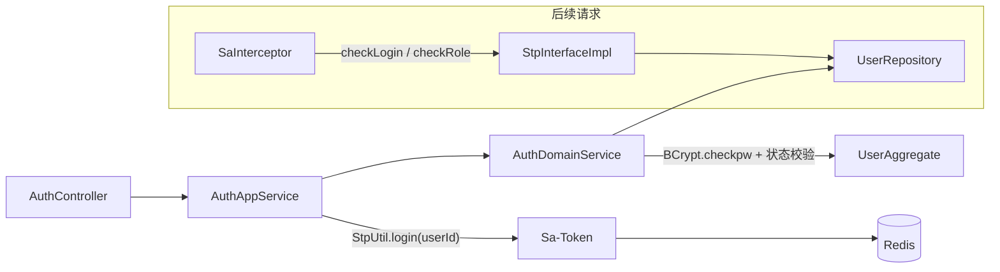

# 引入 Sa-Token 实现 auth 模块

## 目标

- 登录认证：邮箱 + 密码登录，签发 Sa-Token token（Redis 存储），登出、查询当前登录用户。
- 角色鉴权：不建权限表，在 `sys_user` 表新增 `role` 字段，分 `admin`（管理员）/ `user`（普通用户）两种角色；用户管理接口仅 admin 可访问。
- 遵循 [docs/rule/ddd/DDD.md](docs/rule/ddd/DDD.md) 六层规范，新增 `{层}/system/auth/` 业务包，风格对齐现有 system/user 模块（ResultDO、check()、手写 Assembler/Converter）。

## 登录调用链

## 1. 依赖与配置

- [pom.xml](pom.xml) 新增（版本统一用 property `sa-token.version=1.45.0`）：
  - `cn.dev33:sa-token-spring-boot4-starter`（SB4 专用 starter）
  - `cn.dev33:sa-token-redis-template`（token 存 Redis，复用已有 spring-boot-starter-data-redis 的 RedisTemplate）
  - `org.apache.commons:commons-pool2`（lettuce 连接池，官方 Redis 集成文档要求）
- [src/main/resources/application.yaml](src/main/resources/application.yaml) 新增：
  - `spring.data.redis`：host/port/database（本地默认 localhost:6379）
  - `sa-token`：`token-name: satoken`、`timeout: 2592000`、`is-read-header: true`、`is-read-cookie: false`、`token-style: uuid`、`is-concurrent: true`

## 2. SQL 变更（角色字段 + 种子管理员）

- [sql/sys_user.sql](sql/sys_user.sql)：
  - CREATE TABLE 中新增 `role SMALLINT NOT NULL DEFAULT 0`（0-普通用户，1-管理员）+ COMMENT
  - 追加 `ALTER TABLE sys_user ADD COLUMN IF NOT EXISTS role ...` 兼容已建库
  - 追加种子管理员 INSERT（email `admin@example.com`，BCrypt 密文在实现时生成，解决"创建用户需要 admin"的自举问题）

## 3. model 层（共享枚举）

- 新增 `model/system/user/UserRoleEnum`：`ADMIN(1, "admin", "管理员")`、`USER(0, "user", "普通用户")`，含 code（存库）、key（Sa-Token 角色标识）、`getByCode`，风格同 [UserStatusEnum](src/main/java/com/sunnao/spring/ddd/template/model/system/user/UserStatusEnum.java)

## 4. domain 层

- 新增 `domain/system/auth/`：
  - `model/param/LoginParam`（email、password，extends BaseParam）
  - `service/AuthDomainService` + `AuthDomainServiceImpl`：`authenticate(LoginParam)` → `UserRepository.queryByEmail` 加载用户 → `BCrypt.checkpw` 校验密码（用户不存在与密码错误统一返回"邮箱或密码错误"，防账号枚举）→ 校验 status 为 ENABLED → 返回 `ResultDO<UserAggregate>`。领域层保持纯净，不引用 Sa-Token
- 修改 `domain/system/user/`：`UserEntity`、`UserAggregate`、`CreateUserParam` 增加 `role`（UserRoleEnum，创建时默认 USER）

## 5. client 层（自包含，不依赖 model）

- 新增 `client/system/auth/`：
  - `AuthAppService`（login、logout）、`AuthQueryAppService`（getLoginUserInfo）
  - `req/LoginRequestDTO`（email、password，覆写 check()）
  - `res/LoginResponseDTO`（tokenName、tokenValue、userId、nickname、role）、`res/GetLoginUserResponseDTO`（userId、email、nickname、avatar、role、status）
- 修改 `client/system/user/`：新增 `enums/UserRoleEnum`（client 独立副本）；`CreateUserRequestDTO` 增加可选 role（Integer，check() 校验合法码值）；`UserDTO` 增加 role

## 6. application 层

- 新增 `application/system/auth/`：
  - `scenario/AuthAppServiceImpl`：check() → `AuthDomainService.authenticate` → 成功后 `StpUtil.login(userId)` → 组装 LoginResponseDTO（`StpUtil.getTokenName()/getTokenValue()`）；logout → `StpUtil.logout()`。Sa-Token 调用收敛在应用层，全程 ResultDO 不抛异常
  - `scenario/AuthQueryAppServiceImpl`：`StpUtil.getLoginIdAsLong()` → `UserRepository.query(userId)` → Assembler 转 DTO
  - `assembler/AuthAssembler`：静态方法，DTO ↔ Param、UserAggregate → ResponseDTO（含枚举码值转换）
- 修改 `application/system/user/assembler/UserAssembler`：role 字段的 Request → Param、Aggregate → DTO 映射

## 7. infrastructure 层

- 新增 `infrastructure/system/auth/StpInterfaceImpl`（@Component，实现 Sa-Token `StpInterface`）：`getRoleList` 按 loginId 走 `UserRepository.query` 取 role 映射为 `List.of(roleKey)`；`getPermissionList` 返回空列表（不做权限点）
- 修改 `infrastructure/system/user/`：`UserPO` 增加 `role`（Integer）、`UserConverter` 补 role 与枚举互转

## 8. adaptor 层 + 全局配置

- 新增 `adaptor/system/auth/input/AuthController`（`/api/auth`）：
  - POST `/login`（登录）、POST `/logout`（登出）、GET `/me`（当前登录用户），薄透传返回 ResultDO
- 新增 `adaptor/system/auth/input/AuthExceptionHandler`（@RestControllerAdvice）：捕获 Sa-Token 拦截器抛出的 `NotLoginException` → ResultDO("NOT_LOGIN") + HTTP 401、`NotRoleException` → ResultDO("NO_PERMISSION") + HTTP 403（现有 ResultDO 手动 catch 模式覆盖不到拦截器异常，必须补 advice）
- 新增 `common/config/SaTokenConfigure`（implements WebMvcConfigurer）：注册 `SaInterceptor`，路由规则：`/api/**` 全部 checkLogin，放行 `/api/auth/login`；同时启用注解鉴权
- 修改 [UserController](src/main/java/com/sunnao/spring/ddd/template/adaptor/system/user/input/UserController.java)：类级加 `@SaCheckRole("admin")`，用户管理仅管理员可用

## 9. 验证

- `.\mvnw.cmd compile` 编译通过，ReadLints 检查新改文件

## 默认决策（可评审调整）

- 用户不存在/密码错误统一提示"邮箱或密码错误"；禁用用户单独提示
- 用户管理六个接口全部 admin-only；`/api/auth/me` 任意登录用户可访问
- 写操作 DTO 的 `operatorId` 暂保持显式传入，不在本次改为从登录态获取（避免扩大改动面，可作为后续优化）
- role 存 SMALLINT 码值（与 status 一致），Sa-Token 角色标识用字符串 key（admin/user）