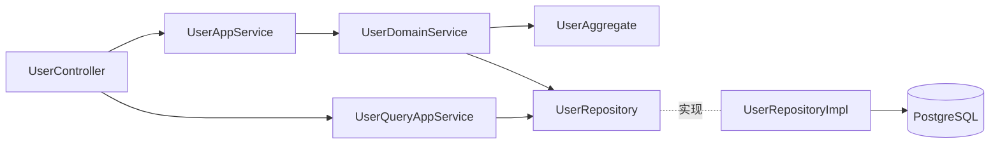

# 系统管理-用户管理 DDD 实现计划

## 目标

按 [docs/rule/ddd](docs/rule/ddd/DDD.md) 六层规范，在 `com.sunnao.spring.ddd.template` 下的 `{层}/system/user/` 包实现用户管理功能：创建用户、修改资料、启用/禁用、逻辑删除（写模式）+ 详情查询、分页查询（读模式），CQRS 读写分离。

## 模式选择与调用链

- 写操作 → 写模式：`Controller → UserAppService → UserDomainService → UserAggregate方法 → UserRepository.save`
- 查询 → 读模式：`Controller → UserQueryAppService → UserRepository → Assembler 转 DTO`

## 1. 技术栈调整（pom.xml + 配置）

- [pom.xml](pom.xml)：
  - 新增 `com.mybatis-flex:mybatis-flex-spring-boot4-starter:1.11.8`、`spring-boot-starter-jdbc`（SB4 下 starter 不再自动装配 jdbc，官方要求显式引入）
  - 新增 `mybatis-flex-processor:1.11.8`（provided），并加入 maven-compiler-plugin 的 `annotationProcessorPaths`，用于生成 `UserPOTableDef` 供 QueryWrapper 使用
  - 移除 `spring-boot-starter-data-jpa` 及其 test starter（与 mybatis-flex 冲突；`AggregateRepository` 用到的 `org.springframework.data.domain.Page` 由 data-redis 传递的 spring-data-commons 继续提供）
- [src/main/resources/application.yaml](src/main/resources/application.yaml)：新增 PostgreSQL datasource 配置与 mybatis-flex 逻辑删除全局配置（deleted：0 正常 / 1 已删除）
- 主启动类加 `@MapperScan` 扫描 `infrastructure/**/mysql/mapper`
- 新增建表脚本 `docs/sql/sys_user.sql`（表名用 `sys_user`，避开 PG 保留字 `user`）：`id bigserial、email、nickname、password、status、avatar、create_at、update_at、create_by、update_by、deleted`，email 加唯一索引（含 deleted 条件）

## 2. model 层（共享枚举）

- `model/system/user/UserStatusEnum`：ENABLED(1) / DISABLED(0)，含 `getByCode`

## 3. domain 层（domain/system/user/）

- `model/aggregate/UserAggregate` extends `BaseAggregate`：字段 id、email、nickname、password、status(UserStatusEnum)、avatar、createAt/createBy/updateAt/updateBy；业务方法（校验失败抛 `AggregateException`）：
  - `updateProfile(UpdateUserParam)` 修改 nickname/avatar
  - `enable()` / `disable()` 状态流转校验
  - `resetPassword(String encodedPassword)`
- `model/param/`：`CreateUserParam`、`UpdateUserParam`、`ChangeUserStatusParam`、`UserQuery`（分页/详情查询条件：email、nickname、status），均继承 `BaseParam`
- `repository/UserRepository extends AggregateRepository<UserAggregate, UserQuery>`：继承基类的 `query(Long)/query(UserQuery)/queryPage(PageQuery<UserQuery>)/save`，补充 `queryByEmail(String)`（邮箱唯一性校验）与 `buildLock(String)`
- `service/UserDomainService` + `UserDomainServiceImpl`：`createUser`（查邮箱唯一 + hutool BCrypt 加密密码 + 构建聚合根 + save）、`updateUser`、`changeUserStatus`、`deleteUser`（逻辑删除），按规范走 锁 → 加载聚合根 → 聚合根方法 → save 流程，异常统一捕获转 `ResultDO`

## 4. client 层（client/system/user/，DTO 自包含，禁止依赖 model 层）

- `enums/UserStatusEnum`（client 独立定义，不引用 model 层）
- `model/UserDTO` extends `BaseDto`：id、email、nickname、status、avatar、createAt、updateAt（不含 password）
- `req/`：`CreateUserRequestDTO`、`UpdateUserRequestDTO`、`ChangeUserStatusRequestDTO`、`DeleteUserRequestDTO`、`GetUserDetailRequestDTO`、`QueryUserPageRequestDTO`（含 pageNum/pageSize），写操作 DTO 带 `operatorId` 用于 createBy/updateBy，均覆写 `check()` 自校验（email 格式用 hutool Validator、密码非空等）
- `res/`：`CreateUserResponseDTO`（userId）、`GetUserDetailResponseDTO`、`QueryUserPageResponseDTO`（total + List&lt;UserDTO&gt;）
- 接口：`UserAppService extends ApplicationCmdService`（createUser/updateUser/changeUserStatus/deleteUser）、`UserQueryAppService extends ApplicationQueryService`（getUserDetail/queryUserPage）

## 5. application 层（application/system/user/）

- `scenario/UserAppServiceImpl`：check() → Assembler 转 Param → 调 DomainService → 组装 ResponseDTO，全程 `ResultDO` 不抛异常
- `scenario/UserQueryAppServiceImpl`：check() → UserRepository 查询 → Assembler 转 DTO（分页用 `PageQuery.build` + startIndex 换算）
- `assembler/UserAssembler`：静态方法 RequestDTO ↔ Param、UserAggregate → UserDTO/ResponseDTO（含 model 枚举 ↔ client 状态码转换）

## 6. infrastructure 层（infrastructure/system/user/）

- `mysql/po/UserPO`：`@Table("sys_user")`、`@Id(keyType = KeyType.Auto)`、`deleted` 字段加 `@Column(isLogicDelete = true)`，纯数据载体，status 存 Integer
- `mysql/mapper/UserMapper extends BaseMapper<UserPO>`（mybatis-flex，无 XML）
- `converter/UserConverter`：静态 `toAggregate/toPO/toAggregateList`，负责枚举码值互转，null 安全
- `repository/UserRepositoryImpl implements UserRepository`（@Component）：
  - `save`：id 为空 insert（回填 id）、否则 update；createAt/updateAt 在此填充
  - `query(Long)/query(UserQuery)/queryByEmail`：QueryWrapper 查询后经 Converter 转聚合根
  - `queryPage`：mybatis-flex `Page` 查询后转换为基接口要求的 `org.springframework.data.domain.Page`（PageImpl）
  - 异常捕获转 `RepositoryException`，与基接口签名一致
- `buildLock`：返回 `new LevelLock(lockKey)`

## 7. adaptor 层（adaptor/system/user/input/）

- `UserController`（@RestController，`/api/system/users`）：
  - POST `/`（创建）、PUT `/{id}`（修改资料）、PUT `/{id}/status`（启停）、DELETE `/{id}`（逻辑删除）、GET `/{id}`（详情）、GET `/page`（分页）
  - 仅做参数透传，调用 client 层接口，直接返回 `ResultDO`，无业务逻辑

## 8. 验证

- `mvnw compile` 通过（APT 生成 TableDef、全链路编译）；检查 lint

## 说明（默认决策，可在评审时调整）

- 数据库访问包名沿用规范文档中的 `mysql/`（虽然实际库是 PostgreSQL，为与文档结构保持一致）
- 密码加密使用 hutool `BCrypt`（domain 层允许静态工具包）；所有响应不回传 password
- 无登录态，操作人 `operatorId` 由请求 DTO 显式传入