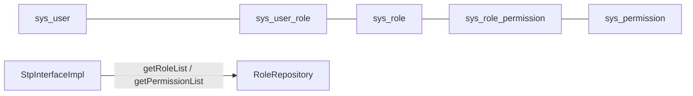

# 脚手架完善计划（横切能力 + 工程化 + 业务模块）

## 背景

user/auth 模块已完成。本计划补齐脚手架缺口，全程遵循 [docs/rule/ddd/DDD.md](docs/rule/ddd/DDD.md) 六层规范与现有编码风格：ResultDO 全链路不抛异常、RequestDTO 覆写 `check()` 自校验、手写 Assembler/Converter、写模式"锁 → 聚合根 → 持久化"流程。

## 阶段一：框架横切能力

### 1. 全局异常处理器

- 将 [AuthExceptionHandler](src/main/java/com/sunnao/spring/ddd/template/adaptor/system/auth/input/AuthExceptionHandler.java) 升级为 `adaptor/common/GlobalExceptionHandler`（原文件删除，Sa-Token 三个 handler 迁入）。
- 补充：`HttpMessageNotReadableException`/参数类型不匹配 → 400 `BAD_REQUEST`；`NoResourceFoundException` → 404；兜底 `Exception` → 500 `SYSTEM_ERROR`（只打日志不外泄堆栈）。
- 定位是"最后防线"：各层仍按现有约定手动 catch 转 ResultDO。

### 2. 当前用户上下文 + 审计字段自动填充

- 新增 `common/context/CurrentUserContext`：包装 `StpUtil.getLoginIdAsLong()`，提供 `getUserId()`（未登录返回 null）。
- 新增 MyBatis-Flex 全局 `InsertListener`/`UpdateListener`（`common/config/MybatisFlexConfigure`）：自动填充 `createAt/updateAt/createBy/updateBy`（操作人取自 CurrentUserContext）。PO 需实现统一的 `BasePO`（含审计字段）供监听器识别。
- 清理显式 operatorId 链路：`DeleteUserRequestDTO.operatorId`、[UserController](src/main/java/com/sunnao/spring/ddd/template/adaptor/system/user/input/UserController.java) 删除接口的 `operatorId` 参数移除，应用层从上下文获取；[UserRepositoryImpl](src/main/java/com/sunnao/spring/ddd/template/infrastructure/system/user/repository/UserRepositoryImpl.java) 中手动 set 时间的代码简化。

### 3. 领域事件基建

- `common/event/DomainEvent`（抽象基类：eventId、occurredAt、operatorId）+ `common/event/DomainEventPublisher` 接口（领域层可用，不依赖 Spring）。
- `infrastructure/common/SpringDomainEventPublisher` 用 `ApplicationEventPublisher` 实现。
- 示例闭环：`UserCreatedEvent` 在 `UserDomainServiceImpl.createUser` 持久化成功后发布；`application/system/user/listener/UserCreatedListener` 以 `@Async` 消费（示例仅记日志）。
- 配套 `common/config/AsyncConfig`：线程池 + TaskDecorator 透传 MDC（供 traceId 与操作日志复用）。

### 4. 分布式锁 Redis 实现

- [LevelLock](src/main/java/com/sunnao/spring/ddd/template/common/lock/LevelLock.java) 改造为接口（保持 `tryLock()/unlock()/getLockKey()` 语义），现实现更名 `JvmLevelLock`。
- 新增 `RedisLevelLock`：`StringRedisTemplate` SET NX PX（值为随机 token，默认 30s 过期）+ Lua 脚本安全释放。
- 新增 `LockFactory`（配置项 `app.lock.type: jvm|redis`，默认 redis），各 `Repository.buildLock` 改为注入 LockFactory 构建，领域服务代码不变。

### 5. API 文档（springdoc-openapi）

- pom 引入 springdoc-openapi（Spring Boot 4 对应版本，实现时用 context7 确认最新版）。
- `common/config/OpenApiConfig` 基础信息 + satoken 请求头的 SecurityScheme；[SaTokenConfigure](src/main/java/com/sunnao/spring/ddd/template/common/config/SaTokenConfigure.java) 放行 `/v3/api-docs/**`、`/swagger-ui/**`。
- 仅 Controller/DTO 加必要的 `@Operation`/`@Schema` 注解，不追求全覆盖。

### 6. 日志与 traceId

- 新增 `common/filter/TraceIdFilter`：生成/透传 traceId 入 MDC，响应头回写 `X-Trace-Id`。
- 新增 `logback-spring.xml`：控制台 + 滚动文件，pattern 含 `%X{traceId}`。
- 简单请求日志：Filter 内记录 method、uri、status、耗时。

## 阶段二：工程化配套

### 7. Flyway 数据库迁移

- pom 引入 `flyway-core` + `flyway-database-postgresql`。
- 现有 [sql/sys_user.sql](sql/sys_user.sql) 整理为 `src/main/resources/db/migration/V1__init_sys_user.sql`（去掉 ALTER 兼容语句，保留种子管理员）；后续业务模块各自新增 V2~V5；`sql/` 目录删除。

### 8. 多环境配置 + docker-compose

- [application.yaml](src/main/resources/application.yaml) 拆为公共配置 + `application-dev.yaml`（localhost 默认值）+ `application-prod.yaml`（数据库/Redis 全部走环境变量），默认激活 dev。
- 根目录新增 `docker-compose.yaml`：PostgreSQL 17 + Redis 7（建表交给 Flyway）。

### 9. 测试基建（云服务）

- 单元测试样板：`UserDomainServiceImplTest`（Mockito mock UserRepository）、`UserAggregateTest`（聚合根业务方法）。
- 集成测试样板：`AuthLoginIntegrationTest`（MockMvc 登录→me→登出全流程）、`UserCrudIntegrationTest`；连接云上 PostgreSQL/Redis，`application-test.yaml` 用环境变量占位（`TEST_PG_URL`、`TEST_REDIS_HOST` 等），**实现到此步时向用户索要连接地址**；测试库由 Flyway 自动建表。

### 10. README

- 根目录 `README.md`：技术栈、六层架构说明（链接 docs/rule/ddd）、快速开始（docker compose up → 配置 → 启动）、已有模块清单、如何新增业务模块。

## 阶段三：通用业务模块

均按现有 user 模块的六层结构与风格实现（`{层}/system/{模块}/`）。

### 11. RBAC 角色权限模块（替换现有 role 枚举字段）

- 表（V2 迁移）：`sys_role`（role_key/role_name/status）、`sys_permission`（perm_key/perm_name）、`sys_role_permission`、`sys_user_role`；种子数据：admin/user 两角色、用户管理等权限点、存量 `sys_user.role` 值迁移到 `sys_user_role` 后**删除 role 列**。不建菜单表（菜单属前端路由概念，用权限点控制）。
- domain：`RoleAggregate`（角色实体 + 权限 key 集合）、`RoleRepository`（含按 userId 查角色/权限）、`RoleDomainService`（角色 CRUD、分配权限、给用户授角色，写模式带锁）。
- client/application/adaptor：`RoleAppService`/`RoleQueryAppService` + DTO + `RoleController`（`/api/system/roles`，@SaCheckRole("admin")）。
- 改造点：[StpInterfaceImpl](src/main/java/com/sunnao/spring/ddd/template/infrastructure/system/auth/StpInterfaceImpl.java) 改查 RoleRepository（getPermissionList 不再返回空）；user 模块去掉 role 字段——`UserEntity`/`UserAggregate`/`UserPO`/DTO 的 `role` 改为 `roles`（List of roleKey），创建用户支持传 roleIds（默认授 user 角色）；`model/system/user/UserRoleEnum` 与 client 副本删除。

### 12. 操作日志模块

- 表（V3）：`sys_oper_log`（trace_id、operator_id、module、action、uri、params、result_code、cost_ms、ip、create_at）。
- `common/annotation/@OperLog(module, action)` + `adaptor/common/OperLogAspect`：环绕切面采集后发 Spring 事件，`@Async` 监听器落库（复用 AsyncConfig），失败只打日志不影响主流程。
- 应用到 user/role/dict/file 写接口及 auth login。
- 查询：`system/log` 业务包按读模式提供分页查询 `LogController`（admin）。

### 13. 字典模块

- 表（V4）：`sys_dict_type` + `sys_dict_data`（label/value/sort/status）。
- 写模式：类型与数据的 CRUD（admin）；读模式：按 typeKey 查数据列表（所有登录用户），走 Redis 缓存（写操作失效对应 key）。
- `DictController`（`/api/system/dicts`）。

### 14. 文件上传模块

- 表（V5）：`sys_file`（original_name、path、size、content_type、storage_type、upload_by）。
- 存储抽象：`application/system/file/FileStorage` 接口（应用层定义 outAdaptor 接口，符合依赖倒置），`adaptor/system/file/output/LocalFileStorage` 本地磁盘实现（路径/大小限制走配置），OSS 留扩展点。
- `FileController`：multipart 上传、下载、删除、分页查询（登录可用，删除 admin-only）。

## 验证

- 每阶段完成后 `.\mvnw.cmd compile` + ReadLints；阶段二结束后跑单测；集成测试在拿到云服务地址后执行 `.\mvnw.cmd test`。

## 默认决策（可调整）

- RBAC 删除 `sys_user.role` 列而非保留冗余；不做菜单表。
- 分布式锁默认 redis，可配置切回 jvm；不引入 Redisson。
- 校验保持 `check()` 约定，不引入 spring-boot-starter-validation。
- 登录日志并入操作日志（login 接口打 @OperLog），不单建表。