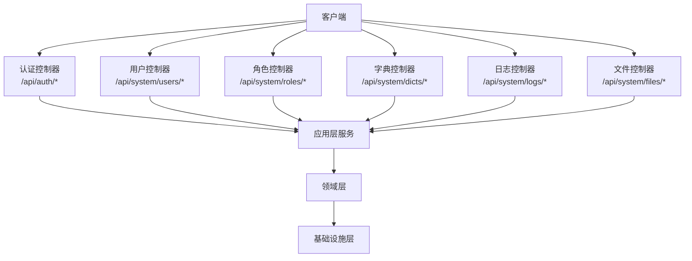
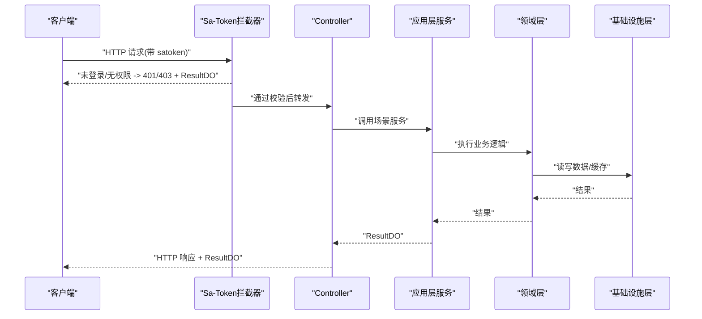
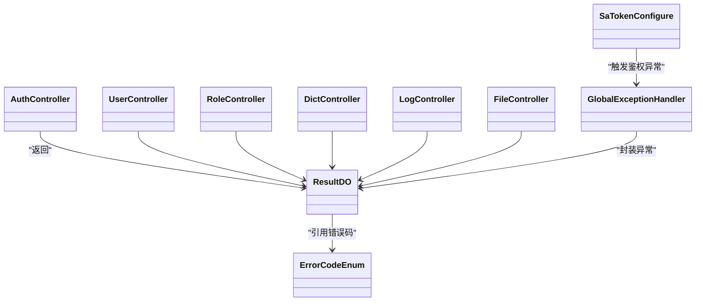

# API接口文档

<cite>
**本文引用的文件**   
- [README.md](file://README.md)
- [AuthController.java](file://src/main/java/com/sunnao/spring/ddd/template/adaptor/auth/input/AuthController.java)
- [UserController.java](file://src/main/java/com/sunnao/spring/ddd/template/adaptor/system/user/input/UserController.java)
- [RoleController.java](file://src/main/java/com/sunnao/spring/ddd/template/adaptor/system/role/input/RoleController.java)
- [DictController.java](file://src/main/java/com/sunnao/spring/ddd/template/adaptor/system/dict/input/DictController.java)
- [LogController.java](file://src/main/java/com/sunnao/spring/ddd/template/adaptor/system/log/input/LogController.java)
- [FileController.java](file://src/main/java/com/sunnao/spring/ddd/template/adaptor/system/file/input/FileController.java)
- [SaTokenConfigure.java](file://src/main/java/com/sunnao/spring/ddd/template/common/config/SaTokenConfigure.java)
- [GlobalExceptionHandler.java](file://src/main/java/com/sunnao/spring/ddd/template/adaptor/common/GlobalExceptionHandler.java)
- [ErrorCodeEnum.java](file://src/main/java/com/sunnao/spring/ddd/template/common/result/ErrorCodeEnum.java)
- [ResultDO.java](file://src/main/java/com/sunnao/spring/ddd/template/common/result/ResultDO.java)
- [LoginRequestDTO.java](file://src/main/java/com/sunnao/spring/ddd/template/client/auth/req/LoginRequestDTO.java)
- [RegisterRequestDTO.java](file://src/main/java/com/sunnao/spring/ddd/template/client/auth/req/RegisterRequestDTO.java)
- [LoginResponseDTO.java](file://src/main/java/com/sunnao/spring/ddd/template/client/auth/res/LoginResponseDTO.java)
- [RegisterResponseDTO.java](file://src/main/java/com/sunnao/spring/ddd/template/client/auth/res/RegisterResponseDTO.java)
- [GetLoginUserResponseDTO.java](file://src/main/java/com/sunnao/spring/ddd/template/client/auth/res/GetLoginUserResponseDTO.java)
</cite>

## 目录
1. [简介](#简介)
2. [项目结构](#项目结构)
3. [核心组件](#核心组件)
4. [架构总览](#架构总览)
5. [详细接口说明](#详细接口说明)
6. [依赖关系分析](#依赖关系分析)
7. [性能与可用性](#性能与可用性)
8. [故障排查指南](#故障排查指南)
9. [结论](#结论)
10. [附录](#附录)

## 简介
本文件为系统 RESTful API 的完整参考文档，覆盖认证、用户管理、角色权限、字典管理、操作日志、文件管理等模块。所有接口遵循统一的响应体规范，采用 Sa-Token 进行会话与鉴权，并提供错误码与异常处理约定。

## 项目结构
- 控制器（Input Adaptor）位于 adaptor 层，负责接收 HTTP 请求并调用应用层服务。
- 统一结果对象 ResultDO 与错误码 ErrorCodeEnum 贯穿全链路。
- Sa-Token 全局拦截器对 /api/** 进行登录态校验，开放登录/注册与 OpenAPI 路径。

图表来源
- [AuthController.java:1-70](file://src/main/java/com/sunnao/spring/ddd/template/adaptor/auth/input/AuthController.java#L1-L70)
- [UserController.java:1-115](file://src/main/java/com/sunnao/spring/ddd/template/adaptor/system/user/input/UserController.java#L1-L115)
- [RoleController.java:1-138](file://src/main/java/com/sunnao/spring/ddd/template/adaptor/system/role/input/RoleController.java#L1-L138)
- [DictController.java:1-153](file://src/main/java/com/sunnao/spring/ddd/template/adaptor/system/dict/input/DictController.java#L1-L153)
- [LogController.java:1-87](file://src/main/java/com/sunnao/spring/ddd/template/adaptor/system/log/input/LogController.java#L1-L87)
- [FileController.java:1-130](file://src/main/java/com/sunnao/spring/ddd/template/adaptor/system/file/input/FileController.java#L1-L130)

章节来源
- [README.md:1-182](file://README.md#L1-L182)

## 核心组件
- 统一响应体 ResultDO：包含 success、code、msg、data 字段，提供成功/失败构建方法。
- 错误码枚举 ErrorCodeEnum：集中定义通用、认证、用户、角色、字典、文件等错误码及默认文案。
- 全局异常处理器 GlobalExceptionHandler：将未登录、无权限、参数解析错误、资源不存在、系统异常等转换为 ResultDO 并返回对应 HTTP 状态码。
- Sa-Token 配置 SaTokenConfigure：除登录/注册外，对所有 /api/** 强制登录；放行 OpenAPI 文档路径。

章节来源
- [ResultDO.java:1-110](file://src/main/java/com/sunnao/spring/ddd/template/common/result/ResultDO.java#L1-L110)
- [ErrorCodeEnum.java:1-209](file://src/main/java/com/sunnao/spring/ddd/template/common/result/ErrorCodeEnum.java#L1-L209)
- [GlobalExceptionHandler.java:1-98](file://src/main/java/com/sunnao/spring/ddd/template/adaptor/common/GlobalExceptionHandler.java#L1-L98)
- [SaTokenConfigure.java:1-31](file://src/main/java/com/sunnao/spring/ddd/template/common/config/SaTokenConfigure.java#L1-L31)

## 架构总览
下图展示一次受保护接口的典型调用链：客户端携带 Token 访问 → Sa-Token 拦截器校验登录态 → Controller 调用应用层服务 → 领域层与基础设施层完成业务与持久化 → 统一响应体返回。

图表来源
- [SaTokenConfigure.java:1-31](file://src/main/java/com/sunnao/spring/ddd/template/common/config/SaTokenConfigure.java#L1-L31)
- [GlobalExceptionHandler.java:1-98](file://src/main/java/com/sunnao/spring/ddd/template/adaptor/common/GlobalExceptionHandler.java#L1-L98)

## 详细接口说明

### 通用约定
- 基础路径
  - 认证：/api/auth
  - 用户：/api/system/users
  - 角色：/api/system/roles
  - 字典：/api/system/dicts
  - 日志：/api/system/logs
  - 文件：/api/system/files
- 认证机制
  - 使用 Sa-Token，登录成功后返回 tokenName 与 tokenValue。
  - 后续请求在请求头中携带：satoken: {tokenValue}。
  - 除登录/注册外，/api/** 均需登录态；OpenAPI 文档路径已放行。
- 统一响应体 ResultDO
  - 字段：success(boolean)、code(String)、msg(String)、data(T)。
  - 成功时 data 为业务数据；失败时 code/msg 描述原因。
- 分页参数
  - pageNum：页码，默认 1
  - pageSize：每页条数，默认 10
- 时间参数
  - startTime/endTime：ISO 8601 格式（如 yyyy-MM-ddTHH:mm:ss），可选。
- 权限点
  - 读：system:*:read
  - 写：system:*:write
  - 具体到各模块见各接口说明。

章节来源
- [SaTokenConfigure.java:1-31](file://src/main/java/com/sunnao/spring/ddd/template/common/config/SaTokenConfigure.java#L1-L31)
- [ResultDO.java:1-110](file://src/main/java/com/sunnao/spring/ddd/template/common/result/ResultDO.java#L1-L110)

---

### 认证接口

#### 登录
- 方法：POST
- URL：/api/auth/login
- 请求头：无特殊要求
- 请求体（JSON）
  - email：字符串，必填，邮箱格式
  - password：字符串，必填
- 响应体（JSON）
  - data.tokenName：字符串，后续请求头名称
  - data.tokenValue：字符串，后续请求头值
  - data.userId：数字
  - data.nickname：字符串
  - data.roles：字符串数组
- 错误码
  - AUTH_FAIL：邮箱或密码错误
  - USER_DISABLED：账号已被禁用
  - PARAM_ERROR：参数校验失败
- 示例
  - 请求
    - POST /api/auth/login
    - Body: {"email":"user@example.com","password":"yourPassword"}
  - 成功响应
    - { "success": true, "code": "SUCCESS", "msg": "操作成功", "data": { "tokenName": "satoken", "tokenValue": "...", "userId": 1, "nickname": "昵称", "roles": ["admin"] } }
  - 失败响应
    - { "success": false, "code": "AUTH_FAIL", "msg": "邮箱或密码错误", "data": null }

章节来源
- [AuthController.java:32-40](file://src/main/java/com/sunnao/spring/ddd/template/adaptor/auth/input/AuthController.java#L32-L40)
- [LoginRequestDTO.java:1-50](file://src/main/java/com/sunnao/spring/ddd/template/client/auth/req/LoginRequestDTO.java#L1-L50)
- [LoginResponseDTO.java:1-47](file://src/main/java/com/sunnao/spring/ddd/template/client/auth/res/LoginResponseDTO.java#L1-L47)
- [ErrorCodeEnum.java:83-99](file://src/main/java/com/sunnao/spring/ddd/template/common/result/ErrorCodeEnum.java#L83-L99)

#### 注册
- 方法：POST
- URL：/api/auth/register
- 请求头：无特殊要求
- 请求体（JSON）
  - email：字符串，必填，邮箱格式
  - nickname：字符串，必填
  - password：字符串，必填，长度不小于6
  - confirmPassword：字符串，必填，需与 password 一致
- 响应体（JSON）
  - data.tokenName、data.tokenValue、data.userId、data.nickname、data.roles
- 错误码
  - EMAIL_DUPLICATE：邮箱已被注册
  - PARAM_ERROR：参数校验失败
- 示例
  - 请求
    - POST /api/auth/register
    - Body: {"email":"new@example.com","nickname":"新用户","password":"123456","confirmPassword":"123456"}
  - 成功响应
    - { "success": true, "code": "SUCCESS", "msg": "操作成功", "data": { "tokenName": "satoken", "tokenValue": "...", "userId": 2, "nickname": "新用户", "roles": ["user"] } }
  - 失败响应
    - { "success": false, "code": "EMAIL_DUPLICATE", "msg": "邮箱已被注册", "data": null }

章节来源
- [AuthController.java:44-50](file://src/main/java/com/sunnao/spring/ddd/template/adaptor/auth/input/AuthController.java#L44-L50)
- [RegisterRequestDTO.java:1-67](file://src/main/java/com/sunnao/spring/ddd/template/client/auth/req/RegisterRequestDTO.java#L1-L67)
- [RegisterResponseDTO.java:1-49](file://src/main/java/com/sunnao/spring/ddd/template/client/auth/res/RegisterResponseDTO.java#L1-L49)
- [ErrorCodeEnum.java:109-110](file://src/main/java/com/sunnao/spring/ddd/template/common/result/ErrorCodeEnum.java#L109-L110)

#### 登出
- 方法：POST
- URL：/api/auth/logout
- 请求头：satoken: {tokenValue}
- 响应体（JSON）
  - data：null
- 错误码
  - NOT_LOGIN：未登录或登录已过期
- 示例
  - 请求
    - POST /api/auth/logout
    - Header: satoken: ...
  - 成功响应
    - { "success": true, "code": "SUCCESS", "msg": "操作成功", "data": null }

章节来源
- [AuthController.java:54-59](file://src/main/java/com/sunnao/spring/ddd/template/adaptor/auth/input/AuthController.java#L54-L59)
- [ErrorCodeEnum.java:37-39](file://src/main/java/com/sunnao/spring/ddd/template/common/result/ErrorCodeEnum.java#L37-L39)

#### 当前用户信息
- 方法：GET
- URL：/api/auth/me
- 请求头：satoken: {tokenValue}
- 响应体（JSON）
  - data.userId、data.email、data.nickname、data.avatar、data.roles、data.status
- 错误码
  - NOT_LOGIN：未登录或登录已过期
- 示例
  - 请求
    - GET /api/auth/me
    - Header: satoken: ...
  - 成功响应
    - { "success": true, "code": "SUCCESS", "msg": "操作成功", "data": { "userId": 1, "email": "admin@example.com", "nickname": "管理员", "avatar": "", "roles": ["admin"], "status": 1 } }

章节来源
- [AuthController.java:63-68](file://src/main/java/com/sunnao/spring/ddd/template/adaptor/auth/input/AuthController.java#L63-L68)
- [GetLoginUserResponseDTO.java:1-52](file://src/main/java/com/sunnao/spring/ddd/template/client/auth/res/GetLoginUserResponseDTO.java#L1-L52)
- [ErrorCodeEnum.java:37-39](file://src/main/java/com/sunnao/spring/ddd/template/common/result/ErrorCodeEnum.java#L37-L39)

---

### 用户管理接口

#### 创建用户
- 方法：POST
- URL：/api/system/users
- 权限：system:user:write
- 请求头：satoken: {tokenValue}
- 请求体（JSON）：参见 CreateUserRequestDTO（由应用层定义）
- 响应体（JSON）：CreateUserResponseDTO
- 错误码：PARAM_ERROR、USER_NOT_FOUND、DB_SAVE_ERROR 等
- 示例
  - 请求
    - POST /api/system/users
    - Header: satoken: ...
    - Body: {...}
  - 成功响应
    - { "success": true, "code": "SUCCESS", "msg": "操作成功", "data": {...} }

章节来源
- [UserController.java:34-41](file://src/main/java/com/sunnao/spring/ddd/template/adaptor/system/user/input/UserController.java#L34-L41)

#### 修改用户资料
- 方法：PUT
- URL：/api/system/users/{id}
- 权限：system:user:write
- 路径参数：id（Long）
- 请求体（JSON）：UpdateUserRequestDTO
- 响应体（JSON）：UpdateUserResponseDTO
- 示例
  - PUT /api/system/users/1
  - Body: {...}

章节来源
- [UserController.java:45-54](file://src/main/java/com/sunnao/spring/ddd/template/adaptor/system/user/input/UserController.java#L45-L54)

#### 变更用户状态（启用/禁用）
- 方法：PUT
- URL：/api/system/users/{id}/status
- 权限：system:user:write
- 路径参数：id（Long）
- 请求体（JSON）：ChangeUserStatusRequestDTO
- 响应体（JSON）：ChangeUserStatusResponseDTO
- 示例
  - PUT /api/system/users/1/status
  - Body: {...}

章节来源
- [UserController.java:58-67](file://src/main/java/com/sunnao/spring/ddd/template/adaptor/system/user/input/UserController.java#L58-L67)

#### 删除用户（逻辑删除）
- 方法：DELETE
- URL：/api/system/users/{id}
- 权限：system:user:write
- 路径参数：id（Long）
- 响应体（JSON）：DeleteUserResponseDTO
- 示例
  - DELETE /api/system/users/1

章节来源
- [UserController.java:70-80](file://src/main/java/com/sunnao/spring/ddd/template/adaptor/system/user/input/UserController.java#L70-L80)

#### 获取用户详情
- 方法：GET
- URL：/api/system/users/{id}
- 权限：system:user:read
- 路径参数：id（Long）
- 响应体（JSON）：GetUserDetailResponseDTO
- 示例
  - GET /api/system/users/1

章节来源
- [UserController.java:84-92](file://src/main/java/com/sunnao/spring/ddd/template/adaptor/system/user/input/UserController.java#L84-L92)

#### 分页查询用户列表
- 方法：GET
- URL：/api/system/users/page
- 权限：system:user:read
- 查询参数
  - pageNum：Integer，默认 1
  - pageSize：Integer，默认 10
  - email：String，可选
  - nickname：String，可选
  - status：Integer，可选
- 响应体（JSON）：QueryUserPageResponseDTO
- 示例
  - GET /api/system/users/page?pageNum=1&pageSize=10&email=admin@example.com

章节来源
- [UserController.java:96-113](file://src/main/java/com/sunnao/spring/ddd/template/adaptor/system/user/input/UserController.java#L96-L113)

---

### 角色权限接口

#### 创建角色
- 方法：POST
- URL：/api/system/roles
- 权限：system:role:write
- 请求体（JSON）：CreateRoleRequestDTO
- 响应体（JSON）：CreateRoleResponseDTO
- 示例
  - POST /api/system/roles
  - Body: {...}

章节来源
- [RoleController.java:34-41](file://src/main/java/com/sunnao/spring/ddd/template/adaptor/system/role/input/RoleController.java#L34-L41)

#### 修改角色
- 方法：PUT
- URL：/api/system/roles/{id}
- 权限：system:role:write
- 路径参数：id（Long）
- 请求体（JSON）：UpdateRoleRequestDTO
- 响应体（JSON）：UpdateRoleResponseDTO
- 示例
  - PUT /api/system/roles/1
  - Body: {...}

章节来源
- [RoleController.java:45-54](file://src/main/java/com/sunnao/spring/ddd/template/adaptor/system/role/input/RoleController.java#L45-L54)

#### 删除角色（内置角色不可删）
- 方法：DELETE
- URL：/api/system/roles/{id}
- 权限：system:role:write
- 路径参数：id（Long）
- 响应体（JSON）：DeleteRoleResponseDTO
- 示例
  - DELETE /api/system/roles/1

章节来源
- [RoleController.java:58-67](file://src/main/java/com/sunnao/spring/ddd/template/adaptor/system/role/input/RoleController.java#L58-L67)

#### 分配权限（全量覆盖）
- 方法：PUT
- URL：/api/system/roles/{id}/permissions
- 权限：system:role:write
- 路径参数：id（Long）
- 请求体（JSON）：AssignPermissionRequestDTO
- 响应体（JSON）：AssignPermissionResponseDTO
- 示例
  - PUT /api/system/roles/1/permissions
  - Body: {...}

章节来源
- [RoleController.java:70-80](file://src/main/java/com/sunnao/spring/ddd/template/adaptor/system/role/input/RoleController.java#L70-L80)

#### 给用户授予角色（全量覆盖）
- 方法：PUT
- URL：/api/system/roles/users/{userId}
- 权限：system:role:write
- 路径参数：userId（Long）
- 请求体（JSON）：AssignUserRoleRequestDTO
- 响应体（JSON）：AssignUserRoleResponseDTO
- 示例
  - PUT /api/system/roles/users/1
  - Body: {...}

章节来源
- [RoleController.java:84-93](file://src/main/java/com/sunnao/spring/ddd/template/adaptor/system/role/input/RoleController.java#L84-L93)

#### 获取角色详情（含权限 key 集合）
- 方法：GET
- URL：/api/system/roles/{id}
- 权限：system:role:read
- 路径参数：id（Long）
- 响应体（JSON）：GetRoleDetailResponseDTO
- 示例
  - GET /api/system/roles/1

章节来源
- [RoleController.java:96-105](file://src/main/java/com/sunnao/spring/ddd/template/adaptor/system/role/input/RoleController.java#L96-L105)

#### 分页查询角色列表
- 方法：GET
- URL：/api/system/roles/page
- 权限：system:role:read
- 查询参数
  - pageNum、pageSize、roleKey、roleName、status
- 响应体（JSON）：QueryRolePageResponseDTO
- 示例
  - GET /api/system/roles/page?roleKey=admin

章节来源
- [RoleController.java:110-126](file://src/main/java/com/sunnao/spring/ddd/template/adaptor/system/role/input/RoleController.java#L110-L126)

#### 查询全部权限点
- 方法：GET
- URL：/api/system/roles/permissions
- 权限：system:role:read
- 响应体（JSON）：QueryPermissionListResponseDTO
- 示例
  - GET /api/system/roles/permissions

章节来源
- [RoleController.java:128-136](file://src/main/java/com/sunnao/spring/ddd/template/adaptor/system/role/input/RoleController.java#L128-L136)

---

### 字典管理接口

#### 创建字典类型
- 方法：POST
- URL：/api/system/dicts/types
- 权限：system:dict:write
- 请求体（JSON）：CreateDictTypeRequestDTO
- 响应体（JSON）：CreateDictTypeResponseDTO
- 示例
  - POST /api/system/dicts/types
  - Body: {...}

章节来源
- [DictController.java:34-41](file://src/main/java/com/sunnao/spring/ddd/template/adaptor/system/dict/input/DictController.java#L34-L41)

#### 修改字典类型
- 方法：PUT
- URL：/api/system/dicts/types/{id}
- 权限：system:dict:write
- 路径参数：id（Long）
- 请求体（JSON）：UpdateDictTypeRequestDTO
- 响应体（JSON）：UpdateDictTypeResponseDTO
- 示例
  - PUT /api/system/dicts/types/1
  - Body: {...}

章节来源
- [DictController.java:45-54](file://src/main/java/com/sunnao/spring/ddd/template/adaptor/system/dict/input/DictController.java#L45-L54)

#### 删除字典类型（级联删除其下数据）
- 方法：DELETE
- URL：/api/system/dicts/types/{id}
- 权限：system:dict:write
- 路径参数：id（Long）
- 响应体（JSON）：DeleteDictTypeResponseDTO
- 示例
  - DELETE /api/system/dicts/types/1

章节来源
- [DictController.java:58-67](file://src/main/java/com/sunnao/spring/ddd/template/adaptor/system/dict/input/DictController.java#L58-L67)

#### 分页查询字典类型列表
- 方法：GET
- URL：/api/system/dicts/types/page
- 权限：system:dict:read
- 查询参数：pageNum、pageSize、typeKey、typeName、status
- 响应体（JSON）：QueryDictTypePageResponseDTO
- 示例
  - GET /api/system/dicts/types/page?typeKey=gender

章节来源
- [DictController.java:72-88](file://src/main/java/com/sunnao/spring/ddd/template/adaptor/system/dict/input/DictController.java#L72-L88)

#### 创建字典数据
- 方法：POST
- URL：/api/system/dicts/data
- 权限：system:dict:write
- 请求体（JSON）：CreateDictDataRequestDTO
- 响应体（JSON）：CreateDictDataResponseDTO
- 示例
  - POST /api/system/dicts/data
  - Body: {...}

章节来源
- [DictController.java:92-99](file://src/main/java/com/sunnao/spring/ddd/template/adaptor/system/dict/input/DictController.java#L92-L99)

#### 修改字典数据
- 方法：PUT
- URL：/api/system/dicts/data/{id}
- 权限：system:dict:write
- 路径参数：id（Long）
- 请求体（JSON）：UpdateDictDataRequestDTO
- 响应体（JSON）：UpdateDictDataResponseDTO
- 示例
  - PUT /api/system/dicts/data/1
  - Body: {...}

章节来源
- [DictController.java:103-112](file://src/main/java/com/sunnao/spring/ddd/template/adaptor/system/dict/input/DictController.java#L103-L112)

#### 删除字典数据
- 方法：DELETE
- URL：/api/system/dicts/data/{id}
- 权限：system:dict:write
- 路径参数：id（Long）
- 响应体（JSON）：DeleteDictDataResponseDTO
- 示例
  - DELETE /api/system/dicts/data/1

章节来源
- [DictController.java:116-125](file://src/main/java/com/sunnao/spring/ddd/template/adaptor/system/dict/input/DictController.java#L116-L125)

#### 按类型键查询启用状态的字典数据（走 Redis 缓存）
- 方法：GET
- URL：/api/system/dicts/data
- 权限：system:dict:read
- 查询参数：typeKey（必填）
- 响应体（JSON）：QueryDictDataListResponseDTO
- 示例
  - GET /api/system/dicts/data?typeKey=gender

章节来源
- [DictController.java:128-138](file://src/main/java/com/sunnao/spring/ddd/template/adaptor/system/dict/input/DictController.java#L128-L138)

#### 按类型键查询全部字典数据（管理端，含禁用项，不走缓存）
- 方法：GET
- URL：/api/system/dicts/data/all
- 权限：system:dict:read
- 查询参数：typeKey（必填）
- 响应体（JSON）：QueryDictDataListResponseDTO
- 示例
  - GET /api/system/dicts/data/all?typeKey=gender

章节来源
- [DictController.java:141-151](file://src/main/java/com/sunnao/spring/ddd/template/adaptor/system/dict/input/DictController.java#L141-L151)

---

### 操作日志接口

#### 分页查询操作日志
- 方法：GET
- URL：/api/system/logs/page
- 权限：system:log:read
- 查询参数
  - pageNum、pageSize、module、operatorId、startTime、endTime
- 响应体（JSON）：QueryOperLogPageResponseDTO
- 示例
  - GET /api/system/logs/page?module=user&operatorId=1&startTime=2024-01-01T00:00:00&endTime=2024-12-31T23:59:59

章节来源
- [LogController.java:38-59](file://src/main/java/com/sunnao/spring/ddd/template/adaptor/system/log/input/LogController.java#L38-L59)

#### 分页查询登录日志
- 方法：GET
- URL：/api/system/logs/login/page
- 权限：system:log:read
- 查询参数
  - pageNum、pageSize、email、userId、success、startTime、endTime
- 响应体（JSON）：QueryLoginLogPageResponseDTO
- 示例
  - GET /api/system/logs/login/page?email=admin@example.com&success=true

章节来源
- [LogController.java:63-85](file://src/main/java/com/sunnao/spring/ddd/template/adaptor/system/log/input/LogController.java#L63-L85)

---

### 文件管理接口

#### 上传文件（multipart/form-data）
- 方法：POST
- URL：/api/system/files
- 权限：system:file:write
- 请求头：Content-Type: multipart/form-data
- 表单字段
  - file：MultipartFile（字段名 file）
- 响应体（JSON）：UploadFileResponseDTO
- 错误码
  - FILE_READ_ERROR：读取上传文件内容失败
  - FILE_TOO_LARGE：文件大小超出限制
  - FILE_STORE_ERROR：文件存储失败
- 示例
  - POST /api/system/files
  - 表单字段 file = 选择文件
  - 成功响应
    - { "success": true, "code": "SUCCESS", "msg": "操作成功", "data": {...} }

章节来源
- [FileController.java:46-64](file://src/main/java/com/sunnao/spring/ddd/template/adaptor/system/file/input/FileController.java#L46-L64)
- [ErrorCodeEnum.java:169-181](file://src/main/java/com/sunnao/spring/ddd/template/common/result/ErrorCodeEnum.java#L169-L181)

#### 下载文件
- 方法：GET
- URL：/api/system/files/{id}/download
- 权限：system:file:read
- 路径参数：id（Long）
- 响应
  - 成功：二进制流，Content-Disposition: attachment; filename="..."
  - 失败：404（文件不存在）或 500（其他错误）
- 示例
  - GET /api/system/files/1/download

章节来源
- [FileController.java:68-96](file://src/main/java/com/sunnao/spring/ddd/template/adaptor/system/file/input/FileController.java#L68-L96)
- [ErrorCodeEnum.java:158-161](file://src/main/java/com/sunnao/spring/ddd/template/common/result/ErrorCodeEnum.java#L158-L161)

#### 删除文件（逻辑删除元数据 + 清理物理文件）
- 方法：DELETE
- URL：/api/system/files/{id}
- 权限：system:file:write
- 路径参数：id（Long）
- 响应体（JSON）：DeleteFileResponseDTO
- 错误码
  - FILE_DELETE_ERROR：文件删除失败
- 示例
  - DELETE /api/system/files/1

章节来源
- [FileController.java:99-109](file://src/main/java/com/sunnao/spring/ddd/template/adaptor/system/file/input/FileController.java#L99-L109)
- [ErrorCodeEnum.java:183-186](file://src/main/java/com/sunnao/spring/ddd/template/common/result/ErrorCodeEnum.java#L183-L186)

#### 分页查询文件列表
- 方法：GET
- URL：/api/system/files/page
- 权限：system:file:read
- 查询参数
  - pageNum、pageSize、originalName、uploadBy
- 响应体（JSON）：QueryFilePageResponseDTO
- 示例
  - GET /api/system/files/page?originalName=report.pdf

章节来源
- [FileController.java:112-128](file://src/main/java/com/sunnao/spring/ddd/template/adaptor/system/file/input/FileController.java#L112-L128)

---

### 安全与鉴权说明
- 登录态校验
  - 除 /api/auth/** 与 OpenAPI 路径外，/api/** 均需携带 satoken 请求头并通过校验。
- 权限控制
  - 读接口需 system:*:read，写接口需 system:*:write。
- 未登录/无权限
  - 未登录：401 + NOT_LOGIN
  - 无权限：403 + NO_PERMISSION
- 参数校验
  - 请求体解析失败或类型不匹配：400 + BAD_REQUEST
- 资源不存在
  - 404 + NOT_FOUND
- 系统异常兜底
  - 500 + SYSTEM_ERROR

章节来源
- [SaTokenConfigure.java:17-30](file://src/main/java/com/sunnao/spring/ddd/template/common/config/SaTokenConfigure.java#L17-L30)
- [GlobalExceptionHandler.java:28-96](file://src/main/java/com/sunnao/spring/ddd/template/adaptor/common/GlobalExceptionHandler.java#L28-L96)
- [ErrorCodeEnum.java:14-64](file://src/main/java/com/sunnao/spring/ddd/template/common/result/ErrorCodeEnum.java#L14-L64)

## 依赖关系分析
- 控制器依赖应用层服务接口（client 层定义的 AppService）。
- 应用层编排领域服务与转换器，领域服务协调聚合根与仓储接口。
- 基础设施层实现仓储与外部存储（本地磁盘/S3）。
- 全局异常处理器统一捕获并转换异常为 ResultDO。

图表来源
- [AuthController.java:1-70](file://src/main/java/com/sunnao/spring/ddd/template/adaptor/auth/input/AuthController.java#L1-L70)
- [UserController.java:1-115](file://src/main/java/com/sunnao/spring/ddd/template/adaptor/system/user/input/UserController.java#L1-L115)
- [RoleController.java:1-138](file://src/main/java/com/sunnao/spring/ddd/template/adaptor/system/role/input/RoleController.java#L1-L138)
- [DictController.java:1-153](file://src/main/java/com/sunnao/spring/ddd/template/adaptor/system/dict/input/DictController.java#L1-L153)
- [LogController.java:1-87](file://src/main/java/com/sunnao/spring/ddd/template/adaptor/system/log/input/LogController.java#L1-L87)
- [FileController.java:1-130](file://src/main/java/com/sunnao/spring/ddd/template/adaptor/system/file/input/FileController.java#L1-L130)
- [GlobalExceptionHandler.java:1-98](file://src/main/java/com/sunnao/spring/ddd/template/adaptor/common/GlobalExceptionHandler.java#L1-L98)
- [SaTokenConfigure.java:1-31](file://src/main/java/com/sunnao/spring/ddd/template/common/config/SaTokenConfigure.java#L1-L31)
- [ResultDO.java:1-110](file://src/main/java/com/sunnao/spring/ddd/template/common/result/ResultDO.java#L1-L110)
- [ErrorCodeEnum.java:1-209](file://src/main/java/com/sunnao/spring/ddd/template/common/result/ErrorCodeEnum.java#L1-L209)

## 性能与可用性
- 字典查询优化
  - 按 typeKey 查询启用字典数据走 Redis 缓存，提升高频读性能。
- 异步落库
  - 操作日志与登录日志通过事件监听异步写入，降低主流程延迟。
- 分布式锁
  - 写模式标准流程先加锁再执行业务，避免并发冲突（适用于高并发写场景）。
- 文件存储
  - 支持本地磁盘与 S3 兼容对象存储，可按环境切换；注意原存储可访问性。

[本节为通用建议，无需代码来源]

## 故障排查指南
- 未登录/登录过期
  - 现象：401 + NOT_LOGIN
  - 排查：确认请求头是否携带 satoken，且 token 有效。
- 无权限
  - 现象：403 + NO_PERMISSION
  - 排查：检查当前用户是否具备所需权限点（system:*:read/write）。
- 参数错误
  - 现象：400 + BAD_REQUEST 或 PARAM_ERROR
  - 排查：核对 JSON 结构与字段类型，确保必填字段非空。
- 资源不存在
  - 现象：404 + NOT_FOUND
  - 排查：确认路径参数是否存在。
- 文件相关错误
  - 现象：FILE_* 错误码
  - 排查：检查文件大小、存储配置、路径合法性与底层存储连通性。
- 系统异常
  - 现象：500 + SYSTEM_ERROR
  - 排查：查看服务端日志定位堆栈。

章节来源
- [GlobalExceptionHandler.java:28-96](file://src/main/java/com/sunnao/spring/ddd/template/adaptor/common/GlobalExceptionHandler.java#L28-L96)
- [ErrorCodeEnum.java:14-64](file://src/main/java/com/sunnao/spring/ddd/template/common/result/ErrorCodeEnum.java#L14-L64)

## 结论
本 API 文档基于现有控制器与公共组件整理，明确了各模块端点、鉴权方式、请求/响应规范与错误码体系。建议在集成测试中结合 Swagger 文档（/swagger-ui.html）进行端到端验证，并在生产环境关注字典缓存命中率与文件存储稳定性。

[本节为总结，无需代码来源]

## 附录

### 版本兼容性
- Spring Boot 4.x、Java 25、MyBatis-Flex、PostgreSQL 17、Redis 7、Sa-Token、Flyway、springdoc-openapi。
- 数据库迁移脚本位于 db/migration/V1~V6。

章节来源
- [README.md:5-18](file://README.md#L5-L18)
- [README.md:95-96](file://README.md#L95-L96)

### 速率限制与安全注意事项
- 登录防爆破：登录失败次数过多会锁定（AUTH_LOCKED）。
- 传输安全：建议使用 HTTPS 传输 satoken，避免中间人攻击。
- 最小权限原则：仅授予必要的 system:*:read/write 权限点。
- 审计追踪：traceId 透传便于问题定位。

章节来源
- [ErrorCodeEnum.java:91-93](file://src/main/java/com/sunnao/spring/ddd/template/common/result/ErrorCodeEnum.java#L91-L93)
- [README.md:119-127](file://README.md#L119-L127)