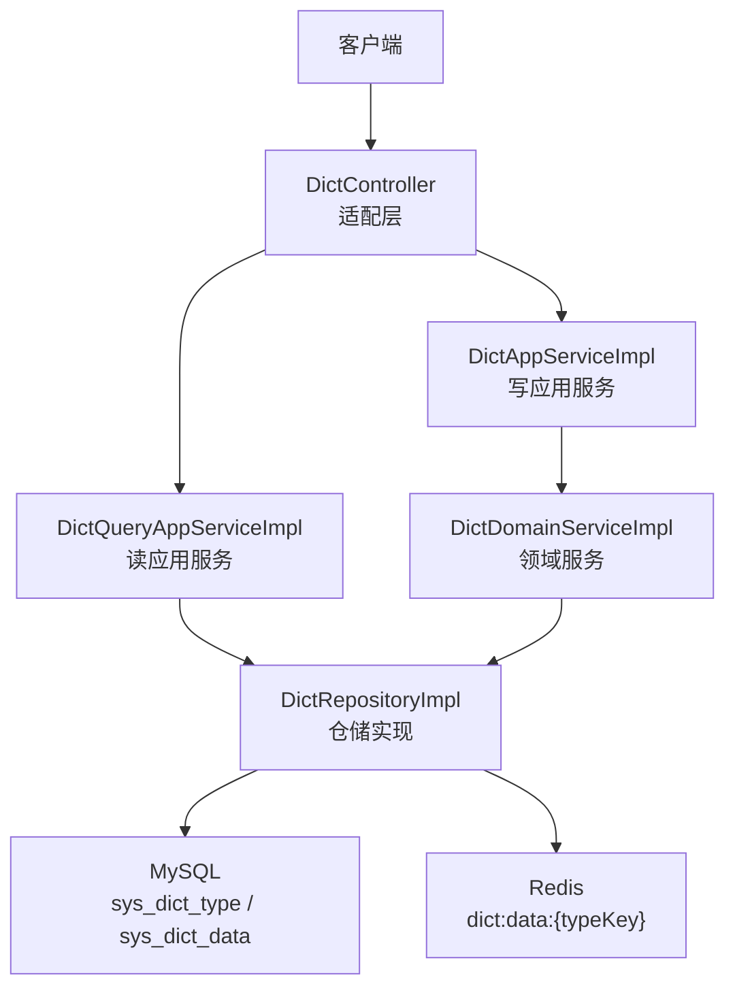
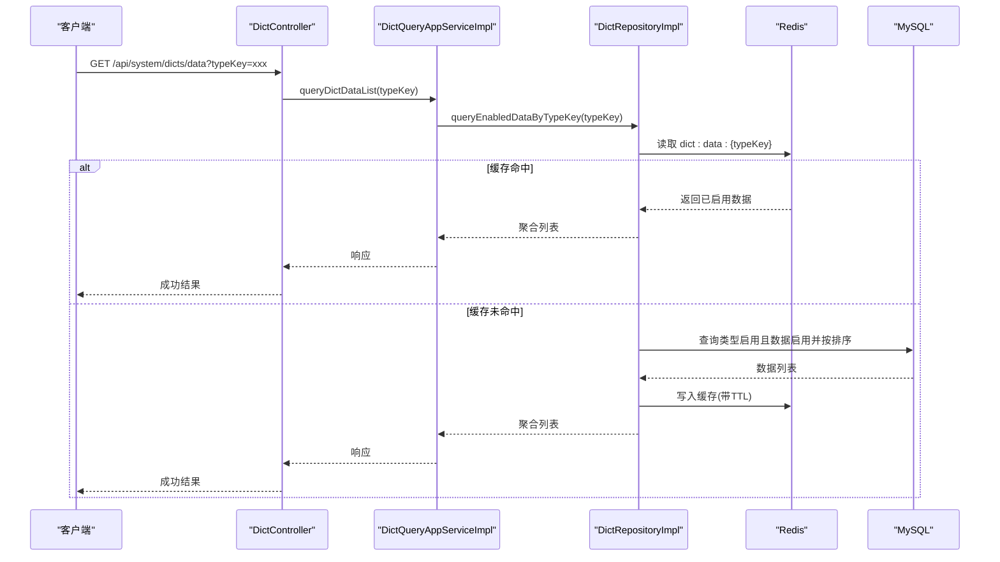
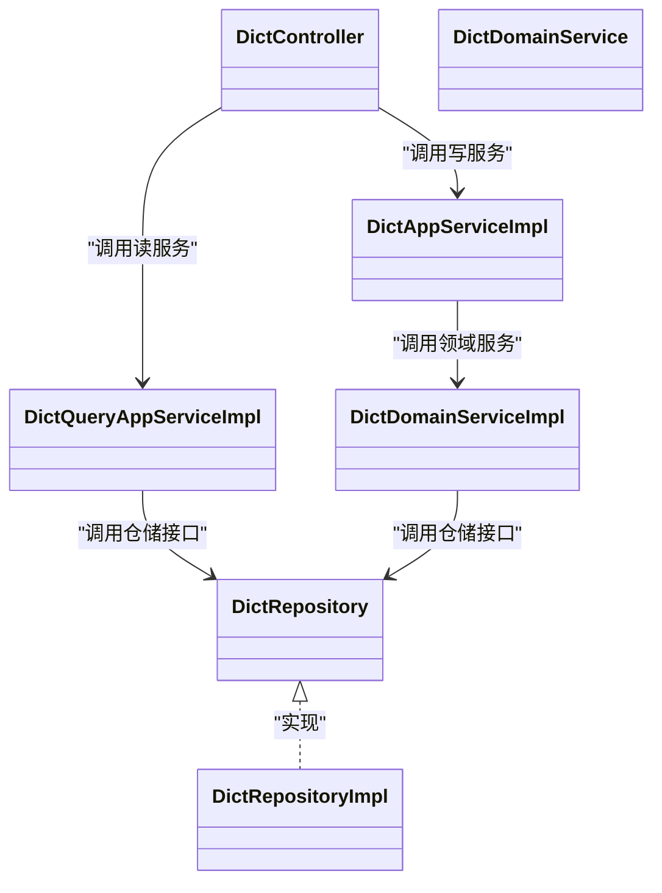
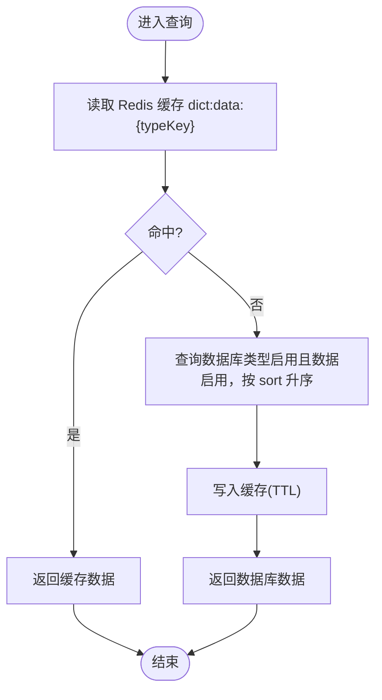

# 字典管理接口

<cite>
**本文引用的文件**   
- [DictController.java](file://src/main/java/com/sunnao/spring/ddd/template/adaptor/system/dict/input/DictController.java)
- [DictAppServiceImpl.java](file://src/main/java/com/sunnao/spring/ddd/template/application/system/dict/scenario/DictAppServiceImpl.java)
- [DictQueryAppServiceImpl.java](file://src/main/java/com/sunnao/spring/ddd/template/application/system/dict/scenario/DictQueryAppServiceImpl.java)
- [DictDomainService.java](file://src/main/java/com/sunnao/spring/ddd/template/domain/system/dict/service/DictDomainService.java)
- [DictDomainServiceImpl.java](file://src/main/java/com/sunnao/spring/ddd/template/domain/system/dict/service/DictDomainServiceImpl.java)
- [DictRepository.java](file://src/main/java/com/sunnao/spring/ddd/template/domain/system/dict/repository/DictRepository.java)
- [DictRepositoryImpl.java](file://src/main/java/com/sunnao/spring/ddd/template/infrastructure/system/dict/repository/DictRepositoryImpl.java)
- [V4__init_dict.sql](file://src/main/resources/db/migration/V4__init_dict.sql)
- [CreateDictTypeRequestDTO.java](file://src/main/java/com/sunnao/spring/ddd/template/client/system/dict/req/CreateDictTypeRequestDTO.java)
- [UpdateDictTypeRequestDTO.java](file://src/main/java/com/sunnao/spring/ddd/template/client/system/dict/req/UpdateDictTypeRequestDTO.java)
- [DeleteDictTypeRequestDTO.java](file://src/main/java/com/sunnao/spring/ddd/template/client/system/dict/req/DeleteDictTypeRequestDTO.java)
- [QueryDictTypePageRequestDTO.java](file://src/main/java/com/sunnao/spring/ddd/template/client/system/dict/req/QueryDictTypePageRequestDTO.java)
- [CreateDictDataRequestDTO.java](file://src/main/java/com/sunnao/spring/ddd/template/client/system/dict/req/CreateDictDataRequestDTO.java)
- [UpdateDictDataRequestDTO.java](file://src/main/java/com/sunnao/spring/ddd/template/client/system/dict/req/UpdateDictDataRequestDTO.java)
</cite>

## 目录
1. [简介](#简介)
2. [项目结构](#项目结构)
3. [核心组件](#核心组件)
4. [架构总览](#架构总览)
5. [详细接口说明](#详细接口说明)
6. [依赖关系分析](#依赖关系分析)
7. [性能与缓存机制](#性能与缓存机制)
8. [状态管理与一致性保证](#状态管理与一致性保证)
9. [故障排查指南](#故障排查指南)
10. [结论](#结论)

## 简介
本文件为“字典管理模块”的 RESTful API 文档，覆盖字典类型与字典数据的创建、更新、删除、查询与分页查询等接口。同时说明：
- 字典类型与字典数据的层级关系
- 字典编码规范（typeKey）
- 缓存同步机制与动态加载示例
- 状态管理与数据一致性保证机制

## 项目结构
字典管理采用 DDD 分层设计：
- 适配层（Adaptor）：HTTP 控制器，负责参数接收、权限校验与日志记录
- 应用层（Application）：场景编排，参数校验、领域服务调用、响应组装
- 领域层（Domain）：聚合根与领域服务，维护业务规则与一致性
- 基础设施层（Infrastructure）：仓储实现，持久化与缓存策略

图示来源
- [DictController.java:1-153](file://src/main/java/com/sunnao/spring/ddd/template/adaptor/system/dict/input/DictController.java#L1-L153)
- [DictAppServiceImpl.java:1-187](file://src/main/java/com/sunnao/spring/ddd/template/application/system/dict/scenario/DictAppServiceImpl.java#L1-L187)
- [DictQueryAppServiceImpl.java:1-108](file://src/main/java/com/sunnao/spring/ddd/template/application/system/dict/scenario/DictQueryAppServiceImpl.java#L1-L108)
- [DictDomainServiceImpl.java:1-234](file://src/main/java/com/sunnao/spring/ddd/template/domain/system/dict/service/DictDomainServiceImpl.java#L1-L234)
- [DictRepositoryImpl.java:1-368](file://src/main/java/com/sunnao/spring/ddd/template/infrastructure/system/dict/repository/DictRepositoryImpl.java#L1-L368)
- [V4__init_dict.sql:1-95](file://src/main/resources/db/migration/V4__init_dict.sql#L1-L95)

章节来源
- [DictController.java:1-153](file://src/main/java/com/sunnao/spring/ddd/template/adaptor/system/dict/input/DictController.java#L1-L153)
- [DictAppServiceImpl.java:1-187](file://src/main/java/com/sunnao/spring/ddd/template/application/system/dict/scenario/DictAppServiceImpl.java#L1-L187)
- [DictQueryAppServiceImpl.java:1-108](file://src/main/java/com/sunnao/spring/ddd/template/application/system/dict/scenario/DictQueryAppServiceImpl.java#L1-L108)
- [DictDomainServiceImpl.java:1-234](file://src/main/java/com/sunnao/spring/ddd/template/domain/system/dict/service/DictDomainServiceImpl.java#L1-L234)
- [DictRepositoryImpl.java:1-368](file://src/main/java/com/sunnao/spring/ddd/template/infrastructure/system/dict/repository/DictRepositoryImpl.java#L1-L368)
- [V4__init_dict.sql:1-95](file://src/main/resources/db/migration/V4__init_dict.sql#L1-L95)

## 核心组件
- 适配层控制器：提供 REST 端点，按权限控制读写操作
- 应用服务：写模式（命令）与读模式（查询）分离
- 领域服务：封装核心业务规则，使用分布式锁保障并发安全
- 仓储接口与实现：定义持久化与缓存策略，读侧优先 Redis，写侧失效缓存

章节来源
- [DictController.java:1-153](file://src/main/java/com/sunnao/spring/ddd/template/adaptor/system/dict/input/DictController.java#L1-L153)
- [DictAppServiceImpl.java:1-187](file://src/main/java/com/sunnao/spring/ddd/template/application/system/dict/scenario/DictAppServiceImpl.java#L1-L187)
- [DictQueryAppServiceImpl.java:1-108](file://src/main/java/com/sunnao/spring/ddd/template/application/system/dict/scenario/DictQueryAppServiceImpl.java#L1-L108)
- [DictDomainService.java:1-64](file://src/main/java/com/sunnao/spring/ddd/template/domain/system/dict/service/DictDomainService.java#L1-L64)
- [DictDomainServiceImpl.java:1-234](file://src/main/java/com/sunnao/spring/ddd/template/domain/system/dict/service/DictDomainServiceImpl.java#L1-L234)
- [DictRepository.java:1-103](file://src/main/java/com/sunnao/spring/ddd/template/domain/system/dict/repository/DictRepository.java#L1-L103)
- [DictRepositoryImpl.java:1-368](file://src/main/java/com/sunnao/spring/ddd/template/infrastructure/system/dict/repository/DictRepositoryImpl.java#L1-L368)

## 架构总览
下图展示一次“按类型键查询启用状态的字典数据列表”的完整调用链，体现读路径的缓存命中与回源逻辑。

图示来源
- [DictController.java:128-138](file://src/main/java/com/sunnao/spring/ddd/template/adaptor/system/dict/input/DictController.java#L128-L138)
- [DictQueryAppServiceImpl.java:64-84](file://src/main/java/com/sunnao/spring/ddd/template/application/system/dict/scenario/DictQueryAppServiceImpl.java#L64-L84)
- [DictRepositoryImpl.java:254-295](file://src/main/java/com/sunnao/spring/ddd/template/infrastructure/system/dict/repository/DictRepositoryImpl.java#L254-L295)

## 详细接口说明

### 通用约定
- 统一响应体：ResultDO<T>
- 鉴权：读操作需 system:dict:read，写操作需 system:dict:write
- 分页：pageNum 从 1 开始；pageSize 范围 1~100
- 状态枚举：1-启用，0-禁用

### 字典类型接口

#### 创建字典类型
- 方法：POST
- 路径：/api/system/dicts/types
- 权限：system:dict:write
- 请求体：CreateDictTypeRequestDTO
  - typeKey：必填，小写字母开头，仅含小写字母/数字/下划线，长度 2~64
  - typeName：必填
  - remark：可选
- 响应：CreateDictTypeResponseDTO（包含 typeId）
- 行为：
  - 参数自校验
  - 按 typeKey 加锁防重
  - 唯一性校验
  - 持久化并回填 ID

章节来源
- [DictController.java:35-41](file://src/main/java/com/sunnao/spring/ddd/template/adaptor/system/dict/input/DictController.java#L35-L41)
- [DictAppServiceImpl.java:31-55](file://src/main/java/com/sunnao/spring/ddd/template/application/system/dict/scenario/DictAppServiceImpl.java#L31-L55)
- [DictDomainServiceImpl.java:30-60](file://src/main/java/com/sunnao/spring/ddd/template/domain/system/dict/service/DictDomainServiceImpl.java#L30-L60)
- [CreateDictTypeRequestDTO.java:1-55](file://src/main/java/com/sunnao/spring/ddd/template/client/system/dict/req/CreateDictTypeRequestDTO.java#L1-L55)

#### 修改字典类型
- 方法：PUT
- 路径：/api/system/dicts/types/{id}
- 权限：system:dict:write
- 路径参数：id（Long）
- 请求体：UpdateDictTypeRequestDTO
  - typeId：必填（由路径注入）
  - typeName/status/remark：至少一项非空
  - status：取值 0/1
- 响应：UpdateDictTypeResponseDTO（包含 typeId）
- 行为：
  - 参数自校验
  - 按 typeId 加锁
  - 存在性校验
  - 通过聚合根更新
  - 持久化并失效对应缓存

章节来源
- [DictController.java:46-54](file://src/main/java/com/sunnao/spring/ddd/template/adaptor/system/dict/input/DictController.java#L46-L54)
- [DictAppServiceImpl.java:57-81](file://src/main/java/com/sunnao/spring/ddd/template/application/system/dict/scenario/DictAppServiceImpl.java#L57-L81)
- [DictDomainServiceImpl.java:62-92](file://src/main/java/com/sunnao/spring/ddd/template/domain/system/dict/service/DictDomainServiceImpl.java#L62-L92)
- [UpdateDictTypeRequestDTO.java:1-59](file://src/main/java/com/sunnao/spring/ddd/template/client/system/dict/req/UpdateDictTypeRequestDTO.java#L1-L59)

#### 删除字典类型
- 方法：DELETE
- 路径：/api/system/dicts/types/{id}
- 权限：system:dict:write
- 路径参数：id（Long）
- 请求体：DeleteDictTypeRequestDTO（typeId 由路径注入）
- 响应：DeleteDictTypeResponseDTO（包含 typeId）
- 行为：
  - 参数自校验
  - 按 typeId 加锁
  - 存在性校验
  - 逻辑删除类型及其下所有数据
  - 事务提交后失效缓存

章节来源
- [DictController.java:59-67](file://src/main/java/com/sunnao/spring/ddd/template/adaptor/system/dict/input/DictController.java#L59-L67)
- [DictAppServiceImpl.java:83-107](file://src/main/java/com/sunnao/spring/ddd/template/application/system/dict/scenario/DictAppServiceImpl.java#L83-L107)
- [DictDomainServiceImpl.java:94-122](file://src/main/java/com/sunnao/spring/ddd/template/domain/system/dict/service/DictDomainServiceImpl.java#L94-L122)
- [DeleteDictTypeRequestDTO.java:1-36](file://src/main/java/com/sunnao/spring/ddd/template/client/system/dict/req/DeleteDictTypeRequestDTO.java#L1-L36)

#### 分页查询字典类型
- 方法：GET
- 路径：/api/system/dicts/types/page
- 权限：system:dict:read
- 查询参数：
  - pageNum：默认 1
  - pageSize：默认 10，最大 100
  - typeKey：可选，精确匹配
  - typeName：可选，模糊匹配
  - status：可选，0/1
- 响应：QueryDictTypePageResponseDTO（包含总数与列表）
- 行为：
  - 参数自校验
  - 构建分页条件
  - 查询并转换响应

章节来源
- [DictController.java:72-88](file://src/main/java/com/sunnao/spring/ddd/template/adaptor/system/dict/input/DictController.java#L72-L88)
- [DictQueryAppServiceImpl.java:38-62](file://src/main/java/com/sunnao/spring/ddd/template/application/system/dict/scenario/DictQueryAppServiceImpl.java#L38-L62)
- [QueryDictTypePageRequestDTO.java:1-63](file://src/main/java/com/sunnao/spring/ddd/template/client/system/dict/req/QueryDictTypePageRequestDTO.java#L1-L63)

### 字典数据接口

#### 创建字典数据
- 方法：POST
- 路径：/api/system/dicts/data
- 权限：system:dict:write
- 请求体：CreateDictDataRequestDTO
  - typeKey：必填
  - label：必填
  - value：必填
  - sort：可选，默认 0
  - remark：可选
- 响应：CreateDictDataResponseDTO（包含 dataId）
- 行为：
  - 参数自校验
  - 按 typeKey+value 加锁防重
  - 归属类型存在性校验
  - 同类型下值唯一性校验
  - 持久化并回填 ID，失效缓存

章节来源
- [DictController.java:93-99](file://src/main/java/com/sunnao/spring/ddd/template/adaptor/system/dict/input/DictController.java#L93-L99)
- [DictAppServiceImpl.java:109-133](file://src/main/java/com/sunnao/spring/ddd/template/application/system/dict/scenario/DictAppServiceImpl.java#L109-L133)
- [DictDomainServiceImpl.java:124-160](file://src/main/java/com/sunnao/spring/ddd/template/domain/system/dict/service/DictDomainServiceImpl.java#L124-L160)
- [CreateDictDataRequestDTO.java:1-62](file://src/main/java/com/sunnao/spring/ddd/template/client/system/dict/req/CreateDictDataRequestDTO.java#L1-L62)

#### 修改字典数据
- 方法：PUT
- 路径：/api/system/dicts/data/{id}
- 权限：system:dict:write
- 路径参数：id（Long）
- 请求体：UpdateDictDataRequestDTO
  - dataId：必填（由路径注入）
  - label/value/sort/status/remark：至少一项非空
  - status：取值 0/1
- 响应：UpdateDictDataResponseDTO（包含 dataId）
- 行为：
  - 参数自校验
  - 按 dataId 加锁
  - 存在性校验
  - 变更 value 时进行唯一性校验
  - 持久化并失效缓存

章节来源
- [DictController.java:104-112](file://src/main/java/com/sunnao/spring/ddd/template/adaptor/system/dict/input/DictController.java#L104-L112)
- [DictAppServiceImpl.java:135-159](file://src/main/java/com/sunnao/spring/ddd/template/application/system/dict/scenario/DictAppServiceImpl.java#L135-L159)
- [DictDomainServiceImpl.java:162-202](file://src/main/java/com/sunnao/spring/ddd/template/domain/system/dict/service/DictDomainServiceImpl.java#L162-L202)
- [UpdateDictDataRequestDTO.java:1-70](file://src/main/java/com/sunnao/spring/ddd/template/client/system/dict/req/UpdateDictDataRequestDTO.java#L1-L70)

#### 删除字典数据
- 方法：DELETE
- 路径：/api/system/dicts/data/{id}
- 权限：system:dict:write
- 路径参数：id（Long）
- 请求体：DeleteDictDataRequestDTO（dataId 由路径注入）
- 响应：DeleteDictDataResponseDTO（包含 dataId）
- 行为：
  - 参数自校验
  - 按 dataId 加锁
  - 存在性校验
  - 逻辑删除并失效缓存

章节来源
- [DictController.java:117-125](file://src/main/java/com/sunnao/spring/ddd/template/adaptor/system/dict/input/DictController.java#L117-L125)
- [DictAppServiceImpl.java:161-185](file://src/main/java/com/sunnao/spring/ddd/template/application/system/dict/scenario/DictAppServiceImpl.java#L161-L185)
- [DictDomainServiceImpl.java:204-232](file://src/main/java/com/sunnao/spring/ddd/template/domain/system/dict/service/DictDomainServiceImpl.java#L204-L232)

#### 按类型键查询启用状态的字典数据列表（走缓存）
- 方法：GET
- 路径：/api/system/dicts/data
- 权限：system:dict:read
- 查询参数：
  - typeKey：必填
- 响应：QueryDictDataListResponseDTO（包含 typeKey 与数据列表）
- 行为：
  - 参数自校验
  - 优先读 Redis 缓存
  - 未命中则回源数据库（类型必须启用，数据仅启用项，按 sort 升序），并写入缓存（TTL）

章节来源
- [DictController.java:128-138](file://src/main/java/com/sunnao/spring/ddd/template/adaptor/system/dict/input/DictController.java#L128-L138)
- [DictQueryAppServiceImpl.java:64-84](file://src/main/java/com/sunnao/spring/ddd/template/application/system/dict/scenario/DictQueryAppServiceImpl.java#L64-L84)
- [DictRepositoryImpl.java:254-295](file://src/main/java/com/sunnao/spring/ddd/template/infrastructure/system/dict/repository/DictRepositoryImpl.java#L254-L295)

#### 按类型键查询全部字典数据（管理端，不走缓存）
- 方法：GET
- 路径：/api/system/dicts/data/all
- 权限：system:dict:read
- 查询参数：
  - typeKey：必填
- 响应：QueryDictDataListResponseDTO（包含 typeKey 与数据列表）
- 行为：
  - 参数自校验
  - 直接查询数据库（含禁用项，按 sort 升序）

章节来源
- [DictController.java:141-151](file://src/main/java/com/sunnao/spring/ddd/template/adaptor/system/dict/input/DictController.java#L141-L151)
- [DictQueryAppServiceImpl.java:86-106](file://src/main/java/com/sunnao/spring/ddd/template/application/system/dict/scenario/DictQueryAppServiceImpl.java#L86-L106)
- [DictRepositoryImpl.java:297-309](file://src/main/java/com/sunnao/spring/ddd/template/infrastructure/system/dict/repository/DictRepositoryImpl.java#L297-L309)

## 依赖关系分析
- 控制器依赖应用服务（写/读）
- 应用写服务依赖领域服务
- 应用读服务依赖仓储接口
- 领域服务依赖仓储接口
- 仓储实现依赖 MyBatis-Flex Mapper 与 Redis

图示来源
- [DictController.java:1-153](file://src/main/java/com/sunnao/spring/ddd/template/adaptor/system/dict/input/DictController.java#L1-L153)
- [DictAppServiceImpl.java:1-187](file://src/main/java/com/sunnao/spring/ddd/template/application/system/dict/scenario/DictAppServiceImpl.java#L1-L187)
- [DictQueryAppServiceImpl.java:1-108](file://src/main/java/com/sunnao/spring/ddd/template/application/system/dict/scenario/DictQueryAppServiceImpl.java#L1-L108)
- [DictDomainService.java:1-64](file://src/main/java/com/sunnao/spring/ddd/template/domain/system/dict/service/DictDomainService.java#L1-L64)
- [DictDomainServiceImpl.java:1-234](file://src/main/java/com/sunnao/spring/ddd/template/domain/system/dict/service/DictDomainServiceImpl.java#L1-L234)
- [DictRepository.java:1-103](file://src/main/java/com/sunnao/spring/ddd/template/domain/system/dict/repository/DictRepository.java#L1-L103)
- [DictRepositoryImpl.java:1-368](file://src/main/java/com/sunnao/spring/ddd/template/infrastructure/system/dict/repository/DictRepositoryImpl.java#L1-L368)

## 性能与缓存机制
- 读路径优化：按 typeKey 查询启用数据优先从 Redis 获取，未命中再回源数据库并回填缓存，TTL 兜底
- 写路径一致性：所有写操作在仓储层失效对应 typeKey 的缓存；删除类操作在事务提交后失效，避免“失效 → 提交”窗口内读到旧数据
- 降级策略：缓存读写异常不影响主流程，自动降级直查数据库

图示来源
- [DictRepositoryImpl.java:254-295](file://src/main/java/com/sunnao/spring/ddd/template/infrastructure/system/dict/repository/DictRepositoryImpl.java#L254-L295)

章节来源
- [DictRepositoryImpl.java:316-345](file://src/main/java/com/sunnao/spring/ddd/template/infrastructure/system/dict/repository/DictRepositoryImpl.java#L316-L345)

## 状态管理与一致性保证
- 状态字段：status（1-启用，0-禁用）
- 类型状态影响读侧：当类型禁用或不存在时，读侧视为无数据
- 数据状态影响读侧：仅返回启用状态的字典数据
- 一致性保证：
  - 分布式锁：写操作按资源粒度加锁（类型键、类型ID、数据ID、类型键+值）
  - 唯一性约束：类型键全局唯一；同类型下字典值唯一
  - 事务与缓存：删除类写操作在事务提交后失效缓存，避免脏读
  - 审计字段：createAt/updateAt/createBy/updateBy 由全局监听器填充

章节来源
- [DictDomainServiceImpl.java:30-232](file://src/main/java/com/sunnao/spring/ddd/template/domain/system/dict/service/DictDomainServiceImpl.java#L30-L232)
- [DictRepositoryImpl.java:152-174](file://src/main/java/com/sunnao/spring/ddd/template/infrastructure/system/dict/repository/DictRepositoryImpl.java#L152-L174)
- [DictRepositoryImpl.java:233-252](file://src/main/java/com/sunnao/spring/ddd/template/infrastructure/system/dict/repository/DictRepositoryImpl.java#L233-L252)
- [V4__init_dict.sql:1-95](file://src/main/resources/db/migration/V4__init_dict.sql#L1-L95)

## 故障排查指南
- 常见错误码：
  - 参数错误：PARAM_ERROR（如必填为空、取值不合法）
  - 业务冲突：TYPE_KEY_DUPLICATE、DICT_VALUE_DUPLICATE
  - 资源不存在：DICT_TYPE_NOT_FOUND、DICT_DATA_NOT_FOUND
  - 系统异常：SYSTEM_ERROR、LOCK_FAIL、DB_QUERY_ERROR、DB_SAVE_ERROR、DB_DELETE_ERROR
- 定位建议：
  - 检查请求参数是否符合校验规则（参考各 RequestDTO 的 check 方法）
  - 确认权限是否具备（system:dict:read/write）
  - 查看仓储层日志，确认缓存命中情况与数据库查询结果
  - 关注事务提交后的缓存失效是否生效

章节来源
- [CreateDictTypeRequestDTO.java:42-53](file://src/main/java/com/sunnao/spring/ddd/template/client/system/dict/req/CreateDictTypeRequestDTO.java#L42-L53)
- [UpdateDictTypeRequestDTO.java:44-57](file://src/main/java/com/sunnao/spring/ddd/template/client/system/dict/req/UpdateDictTypeRequestDTO.java#L44-L57)
- [QueryDictTypePageRequestDTO.java:49-61](file://src/main/java/com/sunnao/spring/ddd/template/client/system/dict/req/QueryDictTypePageRequestDTO.java#L49-L61)
- [CreateDictDataRequestDTO.java:48-60](file://src/main/java/com/sunnao/spring/ddd/template/client/system/dict/req/CreateDictDataRequestDTO.java#L48-L60)
- [UpdateDictDataRequestDTO.java:54-68](file://src/main/java/com/sunnao/spring/ddd/template/client/system/dict/req/UpdateDictDataRequestDTO.java#L54-L68)
- [DictRepositoryImpl.java:254-295](file://src/main/java/com/sunnao/spring/ddd/template/infrastructure/system/dict/repository/DictRepositoryImpl.java#L254-L295)

## 结论
本模块通过清晰的分层设计与严格的参数校验、分布式锁与缓存失效策略，实现了高可用、高性能的字典管理能力。读路径以 Redis 缓存为主，写路径确保强一致性与幂等性，满足生产环境对字典动态加载与实时更新的诉求。