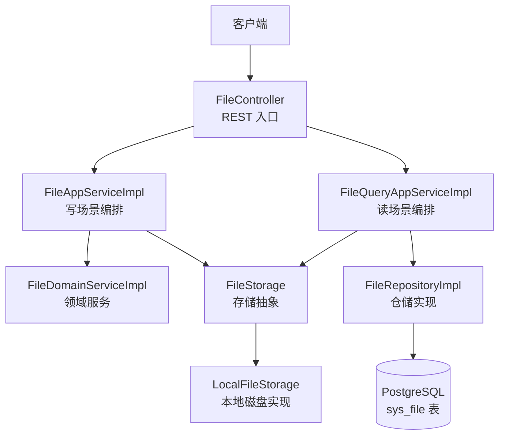
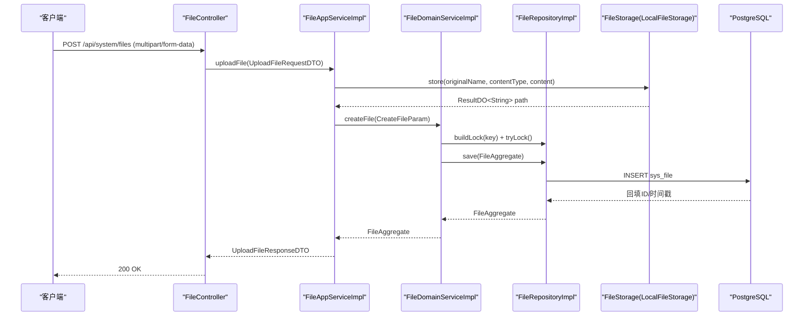
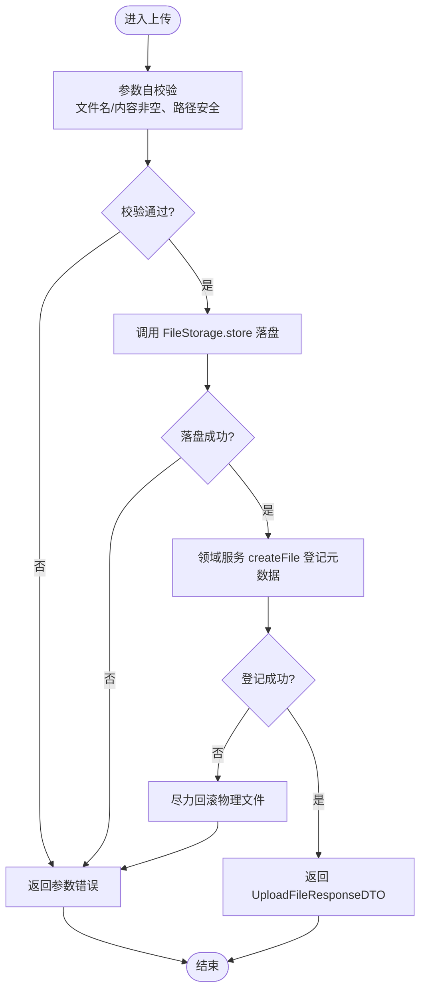
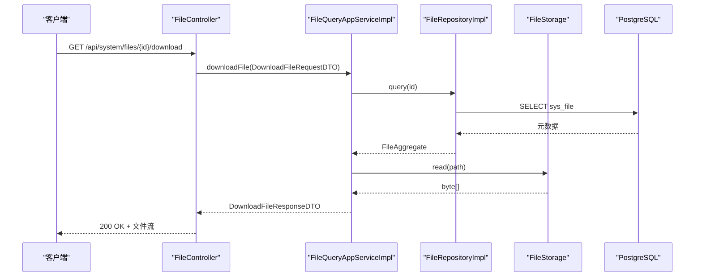
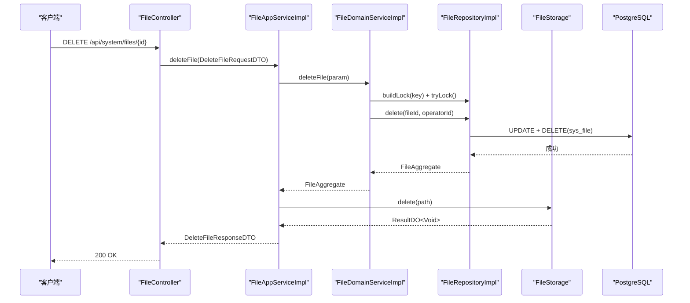
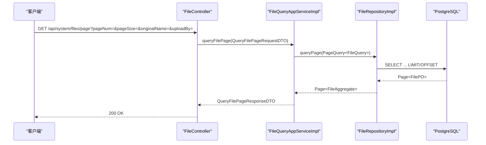
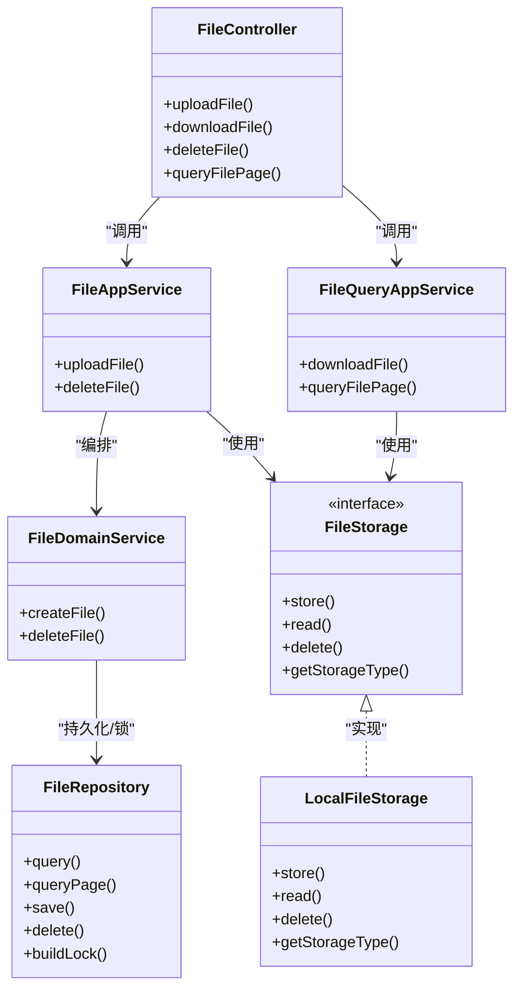

# 文件管理接口

<cite>
**本文引用的文件**
- [FileController.java](file://src/main/java/com/sunnao/spring/ddd/template/adaptor/system/file/input/FileController.java)
- [FileAppServiceImpl.java](file://src/main/java/com/sunnao/spring/ddd/template/application/system/file/scenario/FileAppServiceImpl.java)
- [FileQueryAppServiceImpl.java](file://src/main/java/com/sunnao/spring/ddd/template/application/system/file/scenario/FileQueryAppServiceImpl.java)
- [FileDomainServiceImpl.java](file://src/main/java/com/sunnao/spring/ddd/template/domain/system/file/service/FileDomainServiceImpl.java)
- [FileRepositoryImpl.java](file://src/main/java/com/sunnao/spring/ddd/template/infrastructure/system/file/repository/FileRepositoryImpl.java)
- [V5__init_sys_file.sql](file://src/main/resources/db/migration/V5__init_sys_file.sql)
- [application.yaml](file://src/main/resources/application.yaml)
- [FileStorage.java](file://src/main/java/com/sunnao/spring/ddd/template/application/system/file/FileStorage.java)
- [LocalFileStorage.java](file://src/main/java/com/sunnao/spring/ddd/template/adaptor/system/file/output/LocalFileStorage.java)
- [UploadFileRequestDTO.java](file://src/main/java/com/sunnao/spring/ddd/template/client/system/file/req/UploadFileRequestDTO.java)
- [DownloadFileRequestDTO.java](file://src/main/java/com/sunnao/spring/ddd/template/client/system/file/req/DownloadFileRequestDTO.java)
- [UploadFileResponseDTO.java](file://src/main/java/com/sunnao/spring/ddd/template/client/system/file/res/UploadFileResponseDTO.java)
- [DownloadFileResponseDTO.java](file://src/main/java/com/sunnao/spring/ddd/template/client/system/file/res/DownloadFileResponseDTO.java)
- [FileStorageTypeEnum.java](file://src/main/java/com/sunnao/spring/ddd/template/model/system/file/FileStorageTypeEnum.java)
</cite>

## 目录
1. [简介](#简介)
2. [项目结构](#项目结构)
3. [核心组件](#核心组件)
4. [架构总览](#架构总览)
5. [详细组件分析](#详细组件分析)
6. [依赖关系分析](#依赖关系分析)
7. [性能与扩展性](#性能与扩展性)
8. [故障排查指南](#故障排查指南)
9. [结论](#结论)
10. [附录：API 规范](#附录api-规范)

## 简介
本文件为“文件管理模块”的 RESTful API 文档，覆盖以下能力：
- 上传文件（POST /api/system/files）
- 下载文件（GET /api/system/files/{id}/download）
- 删除文件（DELETE /api/system/files/{id}）
- 分页查询文件列表（GET /api/system/files/page）
- 文件详情查询（通过分页结果或领域聚合获取）

同时说明：
- 上传的 multipart/form-data 格式、大小限制、类型校验
- 下载流式传输、断点续传与并发优化建议
- 大文件处理最佳实践与错误重试机制
- 存储后端切换（本地磁盘/S3 兼容服务）配置与性能考虑
- 安全验证、病毒扫描集成与访问权限控制

## 项目结构
文件管理采用 DDD 分层设计：
- 适配层（Adaptor）：HTTP 控制器接收请求并转换为 DTO
- 应用层（Application）：编排流程，调用领域服务与存储抽象
- 领域层（Domain）：业务规则与一致性保障（含锁）
- 基础设施层（Infrastructure）：数据库持久化与具体存储实现

图表来源
- [FileController.java:1-130](file://src/main/java/com/sunnao/spring/ddd/template/adaptor/system/file/input/FileController.java#L1-L130)
- [FileAppServiceImpl.java:1-107](file://src/main/java/com/sunnao/spring/ddd/template/application/system/file/scenario/FileAppServiceImpl.java#L1-L107)
- [FileQueryAppServiceImpl.java:1-94](file://src/main/java/com/sunnao/spring/ddd/template/application/system/file/scenario/FileQueryAppServiceImpl.java#L1-L94)
- [FileDomainServiceImpl.java:1-84](file://src/main/java/com/sunnao/spring/ddd/template/domain/system/file/service/FileDomainServiceImpl.java#L1-L84)
- [FileRepositoryImpl.java:1-152](file://src/main/java/com/sunnao/spring/ddd/template/infrastructure/system/file/repository/FileRepositoryImpl.java#L1-L152)
- [FileStorage.java:1-47](file://src/main/java/com/sunnao/spring/ddd/template/application/system/file/FileStorage.java#L1-L47)
- [LocalFileStorage.java:1-200](file://src/main/java/com/sunnao/spring/ddd/template/adaptor/system/file/output/LocalFileStorage.java#L1-L200)
- [V5__init_sys_file.sql:1-43](file://src/main/resources/db/migration/V5__init_sys_file.sql#L1-L43)

章节来源
- [FileController.java:1-130](file://src/main/java/com/sunnao/spring/ddd/template/adaptor/system/file/input/FileController.java#L1-L130)
- [application.yaml:64-88](file://src/main/resources/application.yaml#L64-L88)

## 核心组件
- 控制器：负责 HTTP 协议适配、参数绑定、权限校验与响应封装
- 应用服务：写/读场景编排，协调领域服务与存储抽象
- 领域服务：保证写入一致性、并发控制（分布式锁）
- 仓储实现：数据持久化、分页查询、锁构建
- 存储抽象：屏蔽本地磁盘与对象存储差异，统一 store/read/delete/getStorageType

章节来源
- [FileController.java:1-130](file://src/main/java/com/sunnao/spring/ddd/template/adaptor/system/file/input/FileController.java#L1-L130)
- [FileAppServiceImpl.java:1-107](file://src/main/java/com/sunnao/spring/ddd/template/application/system/file/scenario/FileAppServiceImpl.java#L1-L107)
- [FileQueryAppServiceImpl.java:1-94](file://src/main/java/com/sunnao/spring/ddd/template/application/system/file/scenario/FileQueryAppServiceImpl.java#L1-L94)
- [FileDomainServiceImpl.java:1-84](file://src/main/java/com/sunnao/spring/ddd/template/domain/system/file/service/FileDomainServiceImpl.java#L1-L84)
- [FileRepositoryImpl.java:1-152](file://src/main/java/com/sunnao/spring/ddd/template/infrastructure/system/file/repository/FileRepositoryImpl.java#L1-L152)
- [FileStorage.java:1-47](file://src/main/java/com/sunnao/spring/ddd/template/application/system/file/FileStorage.java#L1-L47)

## 架构总览
下图展示一次典型上传流程：控制器接收 MultipartFile → 应用层校验并落盘 → 领域服务登记元数据（加锁）→ 仓储持久化。

图表来源
- [FileController.java:48-64](file://src/main/java/com/sunnao/spring/ddd/template/adaptor/system/file/input/FileController.java#L48-L64)
- [FileAppServiceImpl.java:37-71](file://src/main/java/com/sunnao/spring/ddd/template/application/system/file/scenario/FileAppServiceImpl.java#L37-L71)
- [FileDomainServiceImpl.java:28-52](file://src/main/java/com/sunnao/spring/ddd/template/domain/system/file/service/FileDomainServiceImpl.java#L28-L52)
- [FileRepositoryImpl.java:83-109](file://src/main/java/com/sunnao/spring/ddd/template/infrastructure/system/file/repository/FileRepositoryImpl.java#L83-L109)
- [V5__init_sys_file.sql:1-43](file://src/main/resources/db/migration/V5__init_sys_file.sql#L1-L43)

## 详细组件分析

### 上传文件接口（POST /api/system/files）
- 功能：接收 multipart/form-data，字段名为 file；返回文件 ID、原始文件名与大小
- 权限：system:file:write
- 请求体：multipart/form-data，字段名 file（MultipartFile）
- 响应：包含 fileId、originalName、size

关键行为
- 控制器将 MultipartFile 转为自包含 DTO，避免跨层传递框架对象
- 应用层先做参数自校验，再调用存储抽象进行物理落盘，随后由领域服务登记元数据
- 若元数据登记失败，应用层尽力回滚物理文件（仅记录日志）

图表来源
- [FileController.java:48-64](file://src/main/java/com/sunnao/spring/ddd/template/adaptor/system/file/input/FileController.java#L48-L64)
- [FileAppServiceImpl.java:37-71](file://src/main/java/com/sunnao/spring/ddd/template/application/system/file/scenario/FileAppServiceImpl.java#L37-L71)
- [UploadFileRequestDTO.java:40-52](file://src/main/java/com/sunnao/spring/ddd/template/client/system/file/req/UploadFileRequestDTO.java#L40-L52)

章节来源
- [FileController.java:48-64](file://src/main/java/com/sunnao/spring/ddd/template/adaptor/system/file/input/FileController.java#L48-L64)
- [FileAppServiceImpl.java:37-71](file://src/main/java/com/sunnao/spring/ddd/template/application/system/file/scenario/FileAppServiceImpl.java#L37-L71)
- [UploadFileRequestDTO.java:1-54](file://src/main/java/com/sunnao/spring/ddd/template/client/system/file/req/UploadFileRequestDTO.java#L1-L54)
- [application.yaml:27-31](file://src/main/resources/application.yaml#L27-L31)
- [application.yaml:68-72](file://src/main/resources/application.yaml#L68-L72)

### 下载文件接口（GET /api/system/files/{id}/download）
- 功能：根据文件 ID 返回文件二进制流，设置 Content-Disposition 与 Content-Type
- 权限：system:file:read
- 响应：HTTP 200 + 文件字节数组（当前实现为内存缓冲）

注意
- 当前实现将文件内容读取到内存后一次性返回，适合中小文件
- 未直接支持 Range 头（断点续传），可在后续扩展

图表来源
- [FileController.java:69-96](file://src/main/java/com/sunnao/spring/ddd/template/adaptor/system/file/input/FileController.java#L69-L96)
- [FileQueryAppServiceImpl.java:38-66](file://src/main/java/com/sunnao/spring/ddd/template/application/system/file/scenario/FileQueryAppServiceImpl.java#L38-L66)
- [FileRepositoryImpl.java:44-52](file://src/main/java/com/sunnao/spring/ddd/template/infrastructure/system/file/repository/FileRepositoryImpl.java#L44-L52)
- [V5__init_sys_file.sql:1-43](file://src/main/resources/db/migration/V5__init_sys_file.sql#L1-L43)

章节来源
- [FileController.java:69-96](file://src/main/java/com/sunnao/spring/ddd/template/adaptor/system/file/input/FileController.java#L69-L96)
- [FileQueryAppServiceImpl.java:38-66](file://src/main/java/com/sunnao/spring/ddd/template/application/system/file/scenario/FileQueryAppServiceImpl.java#L38-L66)
- [DownloadFileRequestDTO.java:1-36](file://src/main/java/com/sunnao/spring/ddd/template/client/system/file/req/DownloadFileRequestDTO.java#L1-L36)
- [DownloadFileResponseDTO.java:1-46](file://src/main/java/com/sunnao/spring/ddd/template/client/system/file/res/DownloadFileResponseDTO.java#L1-L46)

### 删除文件接口（DELETE /api/system/files/{id}）
- 功能：逻辑删除元数据（deleted=1），并尽力清理物理文件
- 权限：system:file:write
- 行为：领域服务对 fileId 加锁，确保并发安全；物理文件清理失败仅告警不影响删除结果

图表来源
- [FileController.java:99-109](file://src/main/java/com/sunnao/spring/ddd/template/adaptor/system/file/input/FileController.java#L99-L109)
- [FileAppServiceImpl.java:73-105](file://src/main/java/com/sunnao/spring/ddd/template/application/system/file/scenario/FileAppServiceImpl.java#L73-L105)
- [FileDomainServiceImpl.java:54-82](file://src/main/java/com/sunnao/spring/ddd/template/domain/system/file/service/FileDomainServiceImpl.java#L54-L82)
- [FileRepositoryImpl.java:111-127](file://src/main/java/com/sunnao/spring/ddd/template/infrastructure/system/file/repository/FileRepositoryImpl.java#L111-L127)

章节来源
- [FileController.java:99-109](file://src/main/java/com/sunnao/spring/ddd/template/adaptor/system/file/input/FileController.java#L99-L109)
- [FileAppServiceImpl.java:73-105](file://src/main/java/com/sunnao/spring/ddd/template/application/system/file/scenario/FileAppServiceImpl.java#L73-L105)
- [FileDomainServiceImpl.java:54-82](file://src/main/java/com/sunnao/spring/ddd/template/domain/system/file/service/FileDomainServiceImpl.java#L54-L82)
- [FileRepositoryImpl.java:111-127](file://src/main/java/com/sunnao/spring/ddd/template/infrastructure/system/file/repository/FileRepositoryImpl.java#L111-L127)

### 分页查询接口（GET /api/system/files/page）
- 功能：按页码、每页条数、文件名模糊匹配、上传者过滤进行分页查询
- 权限：system:file:read
- 参数：pageNum、pageSize、originalName、uploadBy
- 响应：分页总数与聚合根列表（可映射为 DTO）

图表来源
- [FileController.java:114-128](file://src/main/java/com/sunnao/spring/ddd/template/adaptor/system/file/input/FileController.java#L114-L128)
- [FileQueryAppServiceImpl.java:68-92](file://src/main/java/com/sunnao/spring/ddd/template/application/system/file/scenario/FileQueryAppServiceImpl.java#L68-L92)
- [FileRepositoryImpl.java:66-80](file://src/main/java/com/sunnao/spring/ddd/template/infrastructure/system/file/repository/FileRepositoryImpl.java#L66-L80)

章节来源
- [FileController.java:114-128](file://src/main/java/com/sunnao/spring/ddd/template/adaptor/system/file/input/FileController.java#L114-L128)
- [FileQueryAppServiceImpl.java:68-92](file://src/main/java/com/sunnao/spring/ddd/template/application/system/file/scenario/FileQueryAppServiceImpl.java#L68-L92)
- [FileRepositoryImpl.java:66-80](file://src/main/java/com/sunnao/spring/ddd/template/infrastructure/system/file/repository/FileRepositoryImpl.java#L66-L80)

### 文件详情查询（GET /api/system/files/{id}）
- 现状：仓库提供按 ID 查询方法，可用于获取单条文件元数据
- 建议：在控制器新增 GET /api/system/files/{id} 端点，复用现有仓储查询能力，返回基础元信息（不含内容）

章节来源
- [FileRepositoryImpl.java:44-52](file://src/main/java/com/sunnao/spring/ddd/template/infrastructure/system/file/repository/FileRepositoryImpl.java#L44-L52)

## 依赖关系分析
- 控制器依赖应用服务（写/读分离）
- 应用服务依赖领域服务与存储抽象
- 领域服务依赖仓储与分布式锁
- 仓储依赖 MyBatis-Flex 与数据库
- 存储抽象可由本地磁盘或 S3 兼容对象存储实现替换

图表来源
- [FileController.java:1-130](file://src/main/java/com/sunnao/spring/ddd/template/adaptor/system/file/input/FileController.java#L1-L130)
- [FileAppServiceImpl.java:1-107](file://src/main/java/com/sunnao/spring/ddd/template/application/system/file/scenario/FileAppServiceImpl.java#L1-L107)
- [FileQueryAppServiceImpl.java:1-94](file://src/main/java/com/sunnao/spring/ddd/template/application/system/file/scenario/FileQueryAppServiceImpl.java#L1-L94)
- [FileDomainServiceImpl.java:1-84](file://src/main/java/com/sunnao/spring/ddd/template/domain/system/file/service/FileDomainServiceImpl.java#L1-L84)
- [FileRepositoryImpl.java:1-152](file://src/main/java/com/sunnao/spring/ddd/template/infrastructure/system/file/repository/FileRepositoryImpl.java#L1-L152)
- [FileStorage.java:1-47](file://src/main/java/com/sunnao/spring/ddd/template/application/system/file/FileStorage.java#L1-L47)
- [LocalFileStorage.java:1-200](file://src/main/java/com/sunnao/spring/ddd/template/adaptor/system/file/output/LocalFileStorage.java#L1-L200)

章节来源
- [FileStorage.java:1-47](file://src/main/java/com/sunnao/spring/ddd/template/application/system/file/FileStorage.java#L1-L47)
- [FileStorageTypeEnum.java:1-53](file://src/main/java/com/sunnao/spring/ddd/template/model/system/file/FileStorageTypeEnum.java#L1-L53)

## 性能与扩展性

### 文件大小限制与类型校验
- 框架层拦截：spring.servlet.multipart.max-file-size 与 max-request-size
- 应用层校验：UploadFileRequestDTO.check 校验文件名与内容非空，并拒绝包含路径分隔符的文件名
- 存储层上限：app.file.max-size 与框架层保持一致，防止绕过

章节来源
- [application.yaml:27-31](file://src/main/resources/application.yaml#L27-L31)
- [application.yaml:68-72](file://src/main/resources/application.yaml#L68-L72)
- [UploadFileRequestDTO.java:40-52](file://src/main/java/com/sunnao/spring/ddd/template/client/system/file/req/UploadFileRequestDTO.java#L40-L52)

### 分片上传机制
- 现状：当前接口不支持分片上传
- 建议方案：
  - 新增分片初始化、分片上传、合并三个接口
  - 使用唯一任务 ID 管理分片状态，合并前校验分片完整性
  - 合并完成后走现有上传流程登记元数据

### 下载流式传输与断点续传
- 现状：当前下载将文件内容加载到内存后返回，不适合超大文件
- 建议方案：
  - 基于 Range 头实现断点续传（206 Partial Content）
  - 使用流式输出（ServletOutputStream/NIO）避免全量入堆
  - 针对对象存储，利用其范围读取能力减少带宽占用

### 并发下载优化
- 建议：
  - 启用连接池与线程池调优
  - 对热点文件引入 CDN 缓存
  - 结合浏览器多连接并行下载策略（前端侧）

### 大文件处理最佳实践
- 上传：优先使用分片上传与断点续传
- 存储：对象存储具备高吞吐与弹性扩容优势
- 网络：合理设置超时与重试退避策略
- 监控：采集上传/下载耗时、失败率、存储 IOPS 等指标

### 错误重试机制
- 建议：
  - 客户端侧指数退避重试（限最大次数）
  - 服务端幂等设计（如分片任务 ID 去重）
  - 失败告警与人工介入通道

章节来源
- [application.yaml:27-31](file://src/main/resources/application.yaml#L27-L31)
- [application.yaml:68-72](file://src/main/resources/application.yaml#L68-L72)

### 存储后端切换（本地磁盘/S3 兼容服务）
- 配置项：
  - app.file.storage-type：local 或 s3
  - app.file.local.base-path：本地根目录
  - app.file.s3.endpoint/region/access-key/secret-key/bucket/path-style-access
- 性能考虑：
  - 本地磁盘：低延迟、低成本，适合小规模与内网环境
  - S3 兼容：高可用、可扩展，适合大规模与跨地域部署
- 扩展方式：新增 FileStorage 实现并按配置注入

章节来源
- [application.yaml:68-88](file://src/main/resources/application.yaml#L68-L88)
- [FileStorage.java:1-47](file://src/main/java/com/sunnao/spring/ddd/template/application/system/file/FileStorage.java#L1-L47)
- [FileStorageTypeEnum.java:1-53](file://src/main/java/com/sunnao/spring/ddd/template/model/system/file/FileStorageTypeEnum.java#L1-L53)

### 安全验证、病毒扫描与访问权限
- 鉴权：
  - 使用 Sa-Token 注解 @SaCheckPermission 控制读写权限
  - 下载/分页需 system:file:read；上传/删除需 system:file:write
- 安全校验：
  - 文件名安全检查（禁止路径穿越字符）
  - 建议在存储前增加病毒扫描（异步队列触发）
- 访问控制：
  - 对象存储桶建议私有访问，服务端签名直链或代理下载
  - 敏感文件可加密存储与传输

章节来源
- [FileController.java:33-36](file://src/main/java/com/sunnao/spring/ddd/template/adaptor/system/file/input/FileController.java#L33-L36)
- [FileController.java:48-128](file://src/main/java/com/sunnao/spring/ddd/template/adaptor/system/file/input/FileController.java#L48-L128)
- [UploadFileRequestDTO.java:40-52](file://src/main/java/com/sunnao/spring/ddd/template/client/system/file/req/UploadFileRequestDTO.java#L40-L52)

## 故障排查指南
- 上传失败
  - 检查 spring.servlet.multipart 限制是否过小
  - 查看应用日志中“读取上传文件内容失败”与“上传文件系统异常”
- 下载失败
  - 确认文件是否存在（FILE_NOT_FOUND）
  - 检查存储实现 read 是否成功
- 删除不一致
  - 关注“清理物理文件失败”告警，必要时手动清理
- 并发冲突
  - 观察 LOCK_FAIL 错误，检查分布式锁实现与 Redis 连通性

章节来源
- [FileController.java:55-64](file://src/main/java/com/sunnao/spring/ddd/template/adaptor/system/file/input/FileController.java#L55-L64)
- [FileAppServiceImpl.java:67-71](file://src/main/java/com/sunnao/spring/ddd/template/application/system/file/scenario/FileAppServiceImpl.java#L67-L71)
- [FileQueryAppServiceImpl.java:62-66](file://src/main/java/com/sunnao/spring/ddd/template/application/system/file/scenario/FileQueryAppServiceImpl.java#L62-L66)
- [FileDomainServiceImpl.java:31-34](file://src/main/java/com/sunnao/spring/ddd/template/domain/system/file/service/FileDomainServiceImpl.java#L31-L34)

## 结论
本文件管理模块以 DDD 分层与存储抽象为核心，提供了上传、下载、删除与分页查询能力，并通过权限注解与参数校验保障基本安全。当前实现适用于中小文件场景；面向大文件与高并发，建议引入分片上传、断点续传、流式下载与对象存储后端，并结合 CDN 与缓存提升整体性能与可用性。

## 附录：API 规范

### 通用
- 基础路径：/api/system/files
- 鉴权：Sa-Token，token-name 为 sa-token（请求头）
- 权限点：
  - 下载/分页查询：system:file:read
  - 上传/删除：system:file:write

### 上传文件
- 方法：POST /api/system/files
- 请求：multipart/form-data，字段名 file
- 响应：{ fileId, originalName, size }

章节来源
- [FileController.java:48-64](file://src/main/java/com/sunnao/spring/ddd/template/adaptor/system/file/input/FileController.java#L48-L64)
- [UploadFileResponseDTO.java:1-36](file://src/main/java/com/sunnao/spring/ddd/template/client/system/file/res/UploadFileResponseDTO.java#L1-L36)

### 下载文件
- 方法：GET /api/system/files/{id}/download
- 响应：HTTP 200 + 文件字节数组，Content-Disposition 与 Content-Type 已设置

章节来源
- [FileController.java:69-96](file://src/main/java/com/sunnao/spring/ddd/template/adaptor/system/file/input/FileController.java#L69-L96)
- [DownloadFileResponseDTO.java:1-46](file://src/main/java/com/sunnao/spring/ddd/template/client/system/file/res/DownloadFileResponseDTO.java#L1-L46)

### 删除文件
- 方法：DELETE /api/system/files/{id}
- 响应：{ fileId }

章节来源
- [FileController.java:99-109](file://src/main/java/com/sunnao/spring/ddd/template/adaptor/system/file/input/FileController.java#L99-L109)

### 分页查询
- 方法：GET /api/system/files/page
- 参数：pageNum、pageSize、originalName、uploadBy
- 响应：分页总数与聚合根列表

章节来源
- [FileController.java:114-128](file://src/main/java/com/sunnao/spring/ddd/template/adaptor/system/file/input/FileController.java#L114-L128)

### 文件详情查询
- 方法：GET /api/system/files/{id}（建议新增）
- 响应：基础元信息（不含内容）

章节来源
- [FileRepositoryImpl.java:44-52](file://src/main/java/com/sunnao/spring/ddd/template/infrastructure/system/file/repository/FileRepositoryImpl.java#L44-L52)