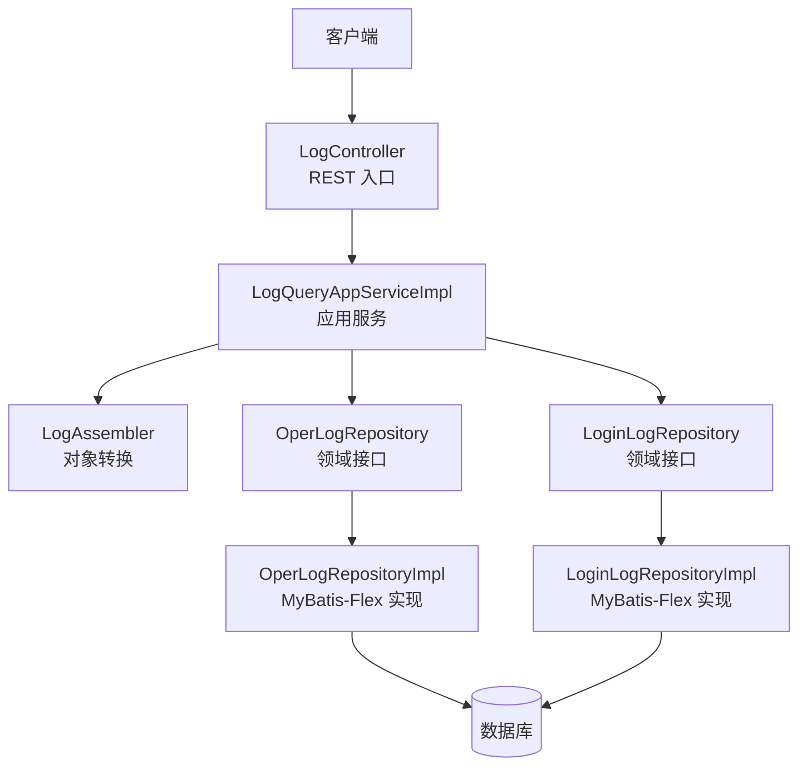
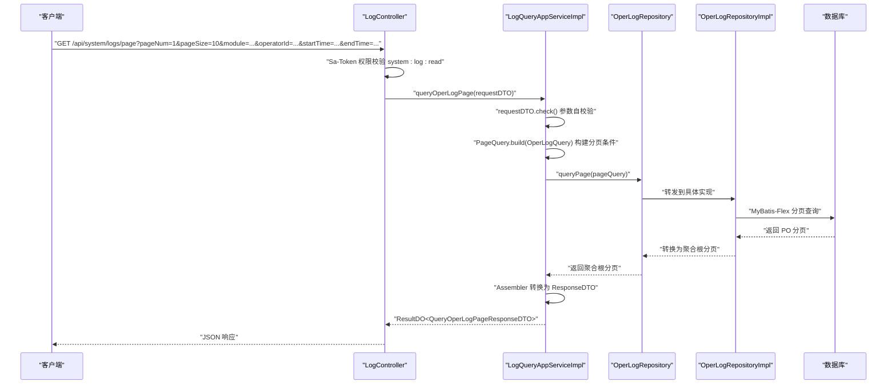
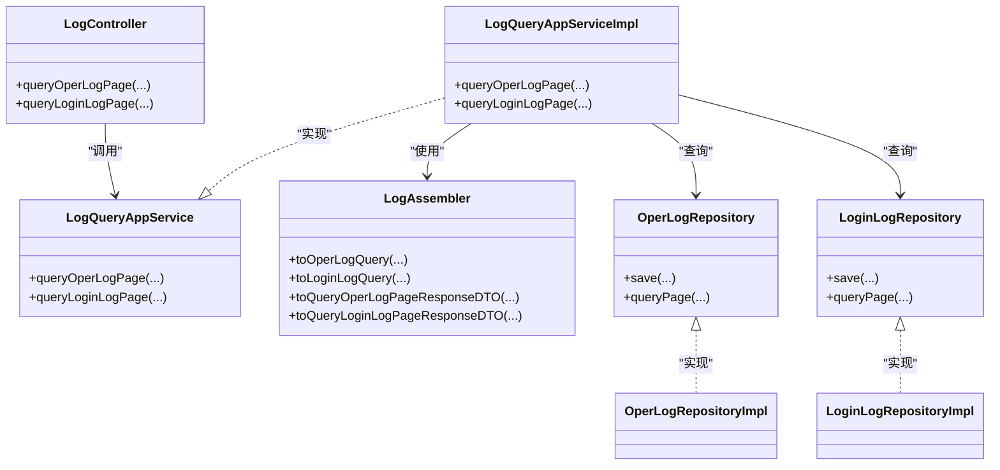

# 日志管理接口

<cite>
**本文引用的文件**   
- [LogController.java](file://src/main/java/com/sunnao/spring/ddd/template/adaptor/system/log/input/LogController.java)
- [LogQueryAppService.java](file://src/main/java/com/sunnao/spring/ddd/template/client/system/log/LogQueryAppService.java)
- [LogQueryAppServiceImpl.java](file://src/main/java/com/sunnao/spring/ddd/template/application/system/log/scenario/LogQueryAppServiceImpl.java)
- [LogAssembler.java](file://src/main/java/com/sunnao/spring/ddd/template/application/system/log/assembler/LogAssembler.java)
- [OperLogRepository.java](file://src/main/java/com/sunnao/spring/ddd/template/domain/system/log/repository/OperLogRepository.java)
- [LoginLogRepository.java](file://src/main/java/com/sunnao/spring/ddd/template/domain/system/log/repository/LoginLogRepository.java)
- [OperLogRepositoryImpl.java](file://src/main/java/com/sunnao/spring/ddd/template/infrastructure/system/log/repository/OperLogRepositoryImpl.java)
- [LoginLogRepositoryImpl.java](file://src/main/java/com/sunnao/spring/ddd/template/infrastructure/system/log/repository/LoginLogRepositoryImpl.java)
- [OperLogDTO.java](file://src/main/java/com/sunnao/spring/ddd/template/client/system/log/model/OperLogDTO.java)
- [LoginLogDTO.java](file://src/main/java/com/sunnao/spring/ddd/template/client/system/log/model/LoginLogDTO.java)
- [QueryOperLogPageRequestDTO.java](file://src/main/java/com/sunnao/spring/ddd/template/client/system/log/req/QueryOperLogPageRequestDTO.java)
- [QueryLoginLogPageRequestDTO.java](file://src/main/java/com/sunnao/spring/ddd/template/client/system/log/req/QueryLoginLogPageRequestDTO.java)
- [QueryOperLogPageResponseDTO.java](file://src/main/java/com/sunnao/spring/ddd/template/client/system/log/res/QueryOperLogPageResponseDTO.java)
- [QueryLoginLogPageResponseDTO.java](file://src/main/java/com/sunnao/spring/ddd/template/client/system/log/res/QueryLoginLogPageResponseDTO.java)
- [OperLogQuery.java](file://src/main/java/com/sunnao/spring/ddd/template/domain/system/log/model/param/OperLogQuery.java)
- [LoginLogQuery.java](file://src/main/java/com/sunnao/spring/ddd/template/domain/system/log/model/param/LoginLogQuery.java)
- [OperLogAspect.java](file://src/main/java/com/sunnao/spring/ddd/template/adaptor/common/OperLogAspect.java)
- [OperLogListener.java](file://src/main/java/com/sunnao/spring/ddd/template/application/system/log/listener/OperLogListener.java)
- [LoginLogListener.java](file://src/main/java/com/sunnao/spring/ddd/template/application/system/log/listener/LoginLogListener.java)
- [OperLogEvent.java](file://src/main/java/com/sunnao/spring/ddd/template/domain/system/log/event/OperLogEvent.java)
- [LoginLogEvent.java](file://src/main/java/com/sunnao/spring/ddd/template/domain/system/log/event/LoginLogEvent.java)
- [AsyncConfig.java](file://src/main/java/com/sunnao/spring/ddd/template/common/config/AsyncConfig.java)
- [V3__init_sys_oper_log.sql](file://src/main/resources/db/migration/V3__init_sys_oper_log.sql)
- [V6__init_sys_login_log.sql](file://src/main/resources/db/migration/V6__init_sys_login_log.sql)
</cite>

## 目录
1. [简介](#简介)
2. [项目结构](#项目结构)
3. [核心组件](#核心组件)
4. [架构总览](#架构总览)
5. [详细组件分析](#详细组件分析)
6. [依赖关系分析](#依赖关系分析)
7. [性能考虑](#性能考虑)
8. [故障排查指南](#故障排查指南)
9. [结论](#结论)
10. [附录](#附录)

## 简介
本文件为“日志管理模块”的 RESTful API 文档，覆盖以下两个分页查询接口：
- 操作日志分页查询：GET /api/system/logs/page
- 登录日志分页查询：GET /api/system/logs/login/page

文档包含：
- 请求参数、过滤条件与分页配置说明
- 响应数据结构差异（操作日志 vs 登录日志）
- 复杂查询场景示例（按时间段统计、用户行为分析等）
- 日志异步采集机制、存储策略与数据清理规则
- 性能优化建议与大数据量查询最佳实践

注意：当前仓库未提供 GET /api/system/logs/oper 路径；实际可用路径为 GET /api/system/logs/page。

## 项目结构
日志相关代码遵循 DDD 分层与适配器模式：
- 适配层（adaptor）：HTTP 控制器接收请求并调用应用服务
- 应用层（application）：编排查询流程、组装 DTO
- 领域层（domain）：定义仓储接口与查询条件模型
- 基础设施层（infrastructure）：MyBatis-Flex 持久化实现与分页

图表来源
- [LogController.java:1-87](file://src/main/java/com/sunnao/spring/ddd/template/adaptor/system/log/input/LogController.java#L1-L87)
- [LogQueryAppServiceImpl.java:1-92](file://src/main/java/com/sunnao/spring/ddd/template/application/system/log/scenario/LogQueryAppServiceImpl.java#L1-L92)
- [LogAssembler.java:1-112](file://src/main/java/com/sunnao/spring/ddd/template/application/system/log/assembler/LogAssembler.java#L1-L112)
- [OperLogRepository.java:1-35](file://src/main/java/com/sunnao/spring/ddd/template/domain/system/log/repository/OperLogRepository.java#L1-L35)
- [LoginLogRepository.java:1-35](file://src/main/java/com/sunnao/spring/ddd/template/domain/system/log/repository/LoginLogRepository.java#L1-L35)
- [OperLogRepositoryImpl.java:1-96](file://src/main/java/com/sunnao/spring/ddd/template/infrastructure/system/log/repository/OperLogRepositoryImpl.java#L1-L96)
- [LoginLogRepositoryImpl.java:1-99](file://src/main/java/com/sunnao/spring/ddd/template/infrastructure/system/log/repository/LoginLogRepositoryImpl.java#L1-L99)

章节来源
- [LogController.java:1-87](file://src/main/java/com/sunnao/spring/ddd/template/adaptor/system/log/input/LogController.java#L1-L87)
- [LogQueryAppServiceImpl.java:1-92](file://src/main/java/com/sunnao/spring/ddd/template/application/system/log/scenario/LogQueryAppServiceImpl.java#L1-L92)

## 核心组件
- 控制器：负责参数绑定、权限校验与调用应用服务
- 应用服务：参数校验、分页构建、调用仓储、结果装配
- 转换器：在 Request/Response DTO 与领域聚合之间进行映射
- 仓储接口与实现：封装 MyBatis-Flex 分页查询与条件构建
- 事件与监听器：操作日志与登录日志通过事件异步写入

章节来源
- [LogController.java:1-87](file://src/main/java/com/sunnao/spring/ddd/template/adaptor/system/log/input/LogController.java#L1-L87)
- [LogQueryAppService.java:1-32](file://src/main/java/com/sunnao/spring/ddd/template/client/system/log/LogQueryAppService.java#L1-L32)
- [LogQueryAppServiceImpl.java:1-92](file://src/main/java/com/sunnao/spring/ddd/template/application/system/log/scenario/LogQueryAppServiceImpl.java#L1-L92)
- [LogAssembler.java:1-112](file://src/main/java/com/sunnao/spring/ddd/template/application/system/log/assembler/LogAssembler.java#L1-L112)
- [OperLogRepository.java:1-35](file://src/main/java/com/sunnao/spring/ddd/template/domain/system/log/repository/OperLogRepository.java#L1-L35)
- [LoginLogRepository.java:1-35](file://src/main/java/com/sunnao/spring/ddd/template/domain/system/log/repository/LoginLogRepository.java#L1-L35)
- [OperLogRepositoryImpl.java:1-96](file://src/main/java/com/sunnao/spring/ddd/template/infrastructure/system/log/repository/OperLogRepositoryImpl.java#L1-L96)
- [LoginLogRepositoryImpl.java:1-99](file://src/main/java/com/sunnao/spring/ddd/template/infrastructure/system/log/repository/LoginLogRepositoryImpl.java#L1-L99)

## 架构总览
下图展示一次“分页查询操作日志”的请求链路，包括权限校验、参数校验、分页构建、仓储查询与结果装配。

图表来源
- [LogController.java:1-87](file://src/main/java/com/sunnao/spring/ddd/template/adaptor/system/log/input/LogController.java#L1-L87)
- [LogQueryAppServiceImpl.java:1-92](file://src/main/java/com/sunnao/spring/ddd/template/application/system/log/scenario/LogQueryAppServiceImpl.java#L1-L92)
- [OperLogRepository.java:1-35](file://src/main/java/com/sunnao/spring/ddd/template/domain/system/log/repository/OperLogRepository.java#L1-L35)
- [OperLogRepositoryImpl.java:1-96](file://src/main/java/com/sunnao/spring/ddd/template/infrastructure/system/log/repository/OperLogRepositoryImpl.java#L1-L96)

## 详细组件分析

### 接口一：分页查询操作日志
- 接口地址：GET /api/system/logs/page
- 鉴权要求：system:log:read
- 排序方式：默认按创建时间倒序（底层以主键 ID 降序近似实现）

请求参数
- pageNum：页码，从 1 开始，默认 1
- pageSize：每页条数，默认 10，范围 1~100
- module：业务模块，精确匹配，可选
- operatorId：操作人ID，可选
- startTime：操作时间下限（含），ISO 格式，可选
- endTime：操作时间上限（含），ISO 格式，可选

校验规则
- pageNum >= 1
- 1 <= pageSize <= 100
- 若同时提供 startTime 与 endTime，则 startTime 不得晚于 endTime

响应结构
- total：总记录数
- logs：操作日志列表，按操作时间倒序

字段说明（操作日志）
- id：日志ID
- traceId：链路追踪ID
- operatorId：操作人ID
- module：业务模块
- action：操作动作
- uri：请求URI
- params：请求参数摘要
- resultCode：结果码（SUCCESS 或错误码）
- costMs：耗时（毫秒）
- ip：客户端IP
- createAt：操作时间

章节来源
- [LogController.java:1-87](file://src/main/java/com/sunnao/spring/ddd/template/adaptor/system/log/input/LogController.java#L1-L87)
- [QueryOperLogPageRequestDTO.java:1-68](file://src/main/java/com/sunnao/spring/ddd/template/client/system/log/req/QueryOperLogPageRequestDTO.java#L1-L68)
- [QueryOperLogPageResponseDTO.java:1-33](file://src/main/java/com/sunnao/spring/ddd/template/client/system/log/res/QueryOperLogPageResponseDTO.java#L1-L33)
- [OperLogDTO.java:1-77](file://src/main/java/com/sunnao/spring/ddd/template/client/system/log/model/OperLogDTO.java#L1-L77)
- [OperLogQuery.java:1-38](file://src/main/java/com/sunnao/spring/ddd/template/domain/system/log/model/param/OperLogQuery.java#L1-L38)
- [OperLogRepositoryImpl.java:1-96](file://src/main/java/com/sunnao/spring/ddd/template/infrastructure/system/log/repository/OperLogRepositoryImpl.java#L1-L96)

### 接口二：分页查询登录日志
- 接口地址：GET /api/system/logs/login/page
- 鉴权要求：system:log:read
- 排序方式：默认按创建时间倒序（底层以主键 ID 降序近似实现）

请求参数
- pageNum：页码，从 1 开始，默认 1
- pageSize：每页条数，默认 10，范围 1~100
- email：登录邮箱，精确匹配，可选
- userId：用户ID，可选
- success：是否登录成功，可选
- startTime：登录时间下限（含），ISO 格式，可选
- endTime：登录时间上限（含），ISO 格式，可选

校验规则
- pageNum >= 1
- 1 <= pageSize <= 100
- 若同时提供 startTime 与 endTime，则 startTime 不得晚于 endTime

响应结构
- total：总记录数
- logs：登录日志列表，按登录时间倒序

字段说明（登录日志）
- id：日志ID
- traceId：链路追踪ID
- userId：用户ID（登录失败时可为空）
- email：登录邮箱
- success：是否登录成功
- code：结果码（SUCCESS 或错误码）
- msg：结果说明（失败原因）
- ip：客户端IP
- userAgent：客户端 User-Agent
- createAt：登录时间

章节来源
- [LogController.java:1-87](file://src/main/java/com/sunnao/spring/ddd/template/adaptor/system/log/input/LogController.java#L1-L87)
- [QueryLoginLogPageRequestDTO.java:1-73](file://src/main/java/com/sunnao/spring/ddd/template/client/system/log/req/QueryLoginLogPageRequestDTO.java#L1-L73)
- [QueryLoginLogPageResponseDTO.java:1-33](file://src/main/java/com/sunnao/spring/ddd/template/client/system/log/res/QueryLoginLogPageResponseDTO.java#L1-L33)
- [LoginLogDTO.java:1-72](file://src/main/java/com/sunnao/spring/ddd/template/client/system/log/model/LoginLogDTO.java#L1-L72)
- [LoginLogQuery.java:1-43](file://src/main/java/com/sunnao/spring/ddd/template/domain/system/log/model/param/LoginLogQuery.java#L1-L43)
- [LoginLogRepositoryImpl.java:1-99](file://src/main/java/com/sunnao/spring/ddd/template/infrastructure/system/log/repository/LoginLogRepositoryImpl.java#L1-L99)

### 数据结构差异对比
- 操作日志关注“谁在哪个模块做了什么”，包含 module、action、uri、params、resultCode、costMs 等
- 登录日志关注“登录行为与结果”，包含 email、success、code、msg、userAgent 等
- 两者均包含通用字段：id、traceId、ip、createAt

章节来源
- [OperLogDTO.java:1-77](file://src/main/java/com/sunnao/spring/ddd/template/client/system/log/model/OperLogDTO.java#L1-L77)
- [LoginLogDTO.java:1-72](file://src/main/java/com/sunnao/spring/ddd/template/client/system/log/model/LoginLogDTO.java#L1-L72)

### 查询过滤条件与排序选项
- 操作日志过滤：module（精确）、operatorId（精确）、时间范围 [startTime, endTime]
- 登录日志过滤：email（精确）、userId（精确）、success（布尔）、时间范围 [startTime, endTime]
- 排序：默认按创建时间倒序（实现层以主键 ID 降序）

章节来源
- [OperLogRepositoryImpl.java:1-96](file://src/main/java/com/sunnao/spring/ddd/template/infrastructure/system/log/repository/OperLogRepositoryImpl.java#L1-L96)
- [LoginLogRepositoryImpl.java:1-99](file://src/main/java/com/sunnao/spring/ddd/template/infrastructure/system/log/repository/LoginLogRepositoryImpl.java#L1-L99)

### 分页参数配置
- pageNum：起始页码为 1
- pageSize：最大 100，超出将触发参数校验失败
- 应用层会将 pageNum 转换为 startIndex 后交由仓储分页

章节来源
- [LogQueryAppServiceImpl.java:1-92](file://src/main/java/com/sunnao/spring/ddd/template/application/system/log/scenario/LogQueryAppServiceImpl.java#L1-L92)
- [QueryOperLogPageRequestDTO.java:1-68](file://src/main/java/com/sunnao/spring/ddd/template/client/system/log/req/QueryOperLogPageRequestDTO.java#L1-L68)
- [QueryLoginLogPageRequestDTO.java:1-73](file://src/main/java/com/sunnao/spring/ddd/template/client/system/log/req/QueryLoginLogPageRequestDTO.java#L1-L73)

### 复杂查询场景示例
- 按时间段统计操作日志总量：传入 startTime 与 endTime，不传其他过滤条件，获取 total 作为统计值
- 用户行为分析：结合 operatorId 与 module 过滤，观察特定用户在某模块的操作频次与耗时分布（costMs）
- 登录安全审计：使用 email 或 userId 过滤，并结合 success=false 筛选失败登录，进一步结合 time range 定位异常时段

章节来源
- [OperLogDTO.java:1-77](file://src/main/java/com/sunnao/spring/ddd/template/client/system/log/model/OperLogDTO.java#L1-L77)
- [LoginLogDTO.java:1-72](file://src/main/java/com/sunnao/spring/ddd/template/client/system/log/model/LoginLogDTO.java#L1-L72)

### 日志数据的异步采集机制
- 操作日志采集：通过切面 @OperLog 捕获方法执行信息，发布领域事件 OperLogEvent，由监听器 OperLogListener 异步落库
- 登录日志采集：登录流程中发布领域事件 LoginLogEvent，由监听器 LoginLogListener 异步落库
- 异步线程池：通过 AsyncConfig 配置线程池参数，避免阻塞主业务流程

章节来源
- [OperLogAspect.java](file://src/main/java/com/sunnao/spring/ddd/template/adaptor/common/OperLogAspect.java)
- [OperLogListener.java](file://src/main/java/com/sunnao/spring/ddd/template/application/system/log/listener/OperLogListener.java)
- [LoginLogListener.java](file://src/main/java/com/sunnao/spring/ddd/template/application/system/log/listener/LoginLogListener.java)
- [OperLogEvent.java](file://src/main/java/com/sunnao/spring/ddd/template/domain/system/log/event/OperLogEvent.java)
- [LoginLogEvent.java](file://src/main/java/com/sunnao/spring/ddd/template/domain/system/log/event/LoginLogEvent.java)
- [AsyncConfig.java](file://src/main/java/com/sunnao/spring/ddd/template/common/config/AsyncConfig.java)

### 存储策略与数据清理规则
- 存储策略：采用 MyBatis-Flex 进行持久化，仓储实现类负责 PO 与聚合根的转换与分页查询
- 表结构初始化脚本：
  - 操作日志表：V3__init_sys_oper_log.sql
  - 登录日志表：V6__init_sys_login_log.sql
- 数据清理规则：仓库未提供删除接口与定时清理逻辑；如需清理，请基于现有表结构自行扩展（如定时任务删除 N 天前的记录）

章节来源
- [OperLogRepositoryImpl.java:1-96](file://src/main/java/com/sunnao/spring/ddd/template/infrastructure/system/log/repository/OperLogRepositoryImpl.java#L1-L96)
- [LoginLogRepositoryImpl.java:1-99](file://src/main/java/com/sunnao/spring/ddd/template/infrastructure/system/log/repository/LoginLogRepositoryImpl.java#L1-L99)
- [V3__init_sys_oper_log.sql](file://src/main/resources/db/migration/V3__init_sys_oper_log.sql)
- [V6__init_sys_login_log.sql](file://src/main/resources/db/migration/V6__init_sys_login_log.sql)

## 依赖关系分析

图表来源
- [LogController.java:1-87](file://src/main/java/com/sunnao/spring/ddd/template/adaptor/system/log/input/LogController.java#L1-L87)
- [LogQueryAppService.java:1-32](file://src/main/java/com/sunnao/spring/ddd/template/client/system/log/LogQueryAppService.java#L1-L32)
- [LogQueryAppServiceImpl.java:1-92](file://src/main/java/com/sunnao/spring/ddd/template/application/system/log/scenario/LogQueryAppServiceImpl.java#L1-L92)
- [LogAssembler.java:1-112](file://src/main/java/com/sunnao/spring/ddd/template/application/system/log/assembler/LogAssembler.java#L1-L112)
- [OperLogRepository.java:1-35](file://src/main/java/com/sunnao/spring/ddd/template/domain/system/log/repository/OperLogRepository.java#L1-L35)
- [LoginLogRepository.java:1-35](file://src/main/java/com/sunnao/spring/ddd/template/domain/system/log/repository/LoginLogRepository.java#L1-L35)
- [OperLogRepositoryImpl.java:1-96](file://src/main/java/com/sunnao/spring/ddd/template/infrastructure/system/log/repository/OperLogRepositoryImpl.java#L1-L96)
- [LoginLogRepositoryImpl.java:1-99](file://src/main/java/com/sunnao/spring/ddd/template/infrastructure/system/log/repository/LoginLogRepositoryImpl.java#L1-L99)

## 性能考虑
- 分页限制：pageSize 最大 100，避免一次性拉取过多数据导致内存与网络压力
- 索引建议：对常用过滤字段建立索引（如 operate_time/create_at、operator_id、user_id、email、module），可显著提升查询性能
- 时间范围查询：尽量缩小时间窗口，减少扫描行数
- 排序策略：默认排序为倒序，若需自定义排序，可在仓储层扩展排序条件
- 异步写入：日志写入走异步事件，降低主流程延迟；合理配置线程池大小与队列容量，防止背压
- 大表治理：定期归档或清理历史日志，避免单表过大影响查询与备份

## 故障排查指南
- 参数校验失败：检查 pageNum、pageSize 与时间范围是否符合约束
- 权限不足：确认当前用户具备 system:log:read 权限
- 查询无结果：核对过滤条件是否正确，尤其是 email、module、operatorId 等精确匹配字段
- 系统异常：查看应用日志中的错误堆栈，仓储层会抛出统一异常码便于定位

章节来源
- [LogQueryAppServiceImpl.java:1-92](file://src/main/java/com/sunnao/spring/ddd/template/application/system/log/scenario/LogQueryAppServiceImpl.java#L1-L92)
- [OperLogRepositoryImpl.java:1-96](file://src/main/java/com/sunnao/spring/ddd/template/infrastructure/system/log/repository/OperLogRepositoryImpl.java#L1-L96)
- [LoginLogRepositoryImpl.java:1-99](file://src/main/java/com/sunnao/spring/ddd/template/infrastructure/system/log/repository/LoginLogRepositoryImpl.java#L1-L99)

## 结论
本模块提供了标准化的操作日志与登录日志分页查询能力，支持常见的时间范围与关键维度过滤，并通过事件驱动实现异步采集与落库。在生产环境中，建议结合索引优化、分页限制与数据清理策略，确保在高并发与大表场景下的稳定与高效。

## 附录

### 接口清单
- 操作日志分页查询
  - 方法：GET
  - 路径：/api/system/logs/page
  - 鉴权：system:log:read
  - 主要参数：pageNum、pageSize、module、operatorId、startTime、endTime
  - 响应：total、logs（操作日志列表）

- 登录日志分页查询
  - 方法：GET
  - 路径：/api/system/logs/login/page
  - 鉴权：system:log:read
  - 主要参数：pageNum、pageSize、email、userId、success、startTime、endTime
  - 响应：total、logs（登录日志列表）

章节来源
- [LogController.java:1-87](file://src/main/java/com/sunnao/spring/ddd/template/adaptor/system/log/input/LogController.java#L1-L87)