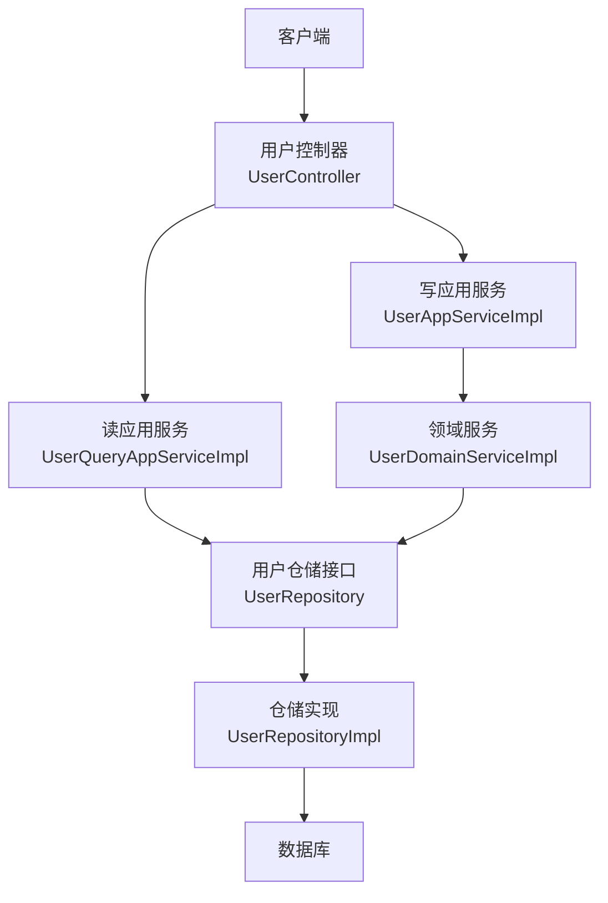
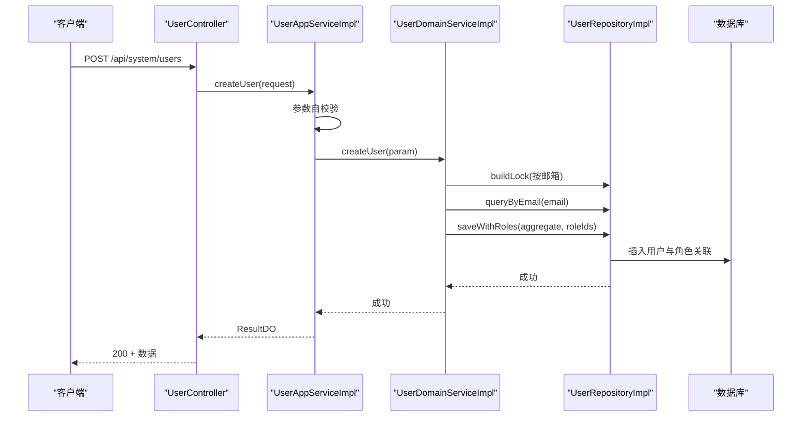
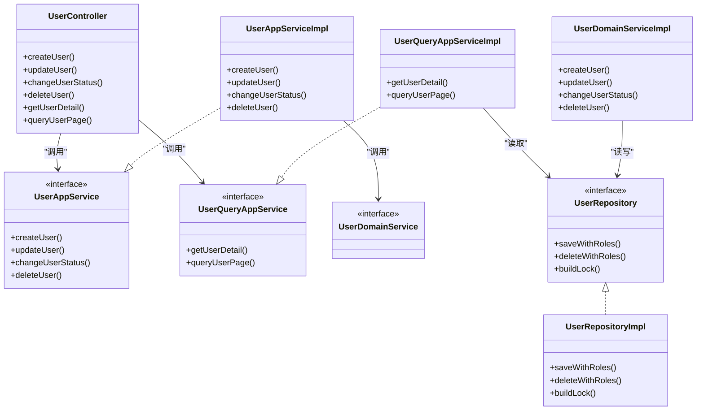

# 用户管理接口

<cite>
**本文引用的文件**
- [UserController.java](file://src/main/java/com/sunnao/spring/ddd/template/adaptor/system/user/input/UserController.java)
- [UserAppServiceImpl.java](file://src/main/java/com/sunnao/spring/ddd/template/application/system/user/scenario/UserAppServiceImpl.java)
- [UserQueryAppServiceImpl.java](file://src/main/java/com/sunnao/spring/ddd/template/application/system/user/scenario/UserQueryAppServiceImpl.java)
- [UserAppService.java](file://src/main/java/com/sunnao/spring/ddd/template/client/system/user/UserAppService.java)
- [UserQueryAppService.java](file://src/main/java/com/sunnao/spring/ddd/template/client/system/user/UserQueryAppService.java)
- [UserDomainServiceImpl.java](file://src/main/java/com/sunnao/spring/ddd/template/domain/system/user/service/UserDomainServiceImpl.java)
- [UserRepository.java](file://src/main/java/com/sunnao/spring/ddd/template/domain/system/user/repository/UserRepository.java)
- [UserRepositoryImpl.java](file://src/main/java/com/sunnao/spring/ddd/template/infrastructure/system/user/repository/UserRepositoryImpl.java)
- [CreateUserRequestDTO.java](file://src/main/java/com/sunnao/spring/ddd/template/client/system/user/req/CreateUserRequestDTO.java)
- [UpdateUserRequestDTO.java](file://src/main/java/com/sunnao/spring/ddd/template/client/system/user/req/UpdateUserRequestDTO.java)
- [DeleteUserRequestDTO.java](file://src/main/java/com/sunnao/spring/ddd/template/client/system/user/req/DeleteUserRequestDTO.java)
- [ChangeUserStatusRequestDTO.java](file://src/main/java/com/sunnao/spring/ddd/template/client/system/user/req/ChangeUserStatusRequestDTO.java)
- [GetUserDetailRequestDTO.java](file://src/main/java/com/sunnao/spring/ddd/template/client/system/user/req/GetUserDetailRequestDTO.java)
- [QueryUserPageRequestDTO.java](file://src/main/java/com/sunnao/spring/ddd/template/client/system/user/req/QueryUserPageRequestDTO.java)
- [CreateUserResponseDTO.java](file://src/main/java/com/sunnao/spring/ddd/template/client/system/user/res/CreateUserResponseDTO.java)
- [UpdateUserResponseDTO.java](file://src/main/java/com/sunnao/spring/ddd/template/client/system/user/res/UpdateUserResponseDTO.java)
</cite>

## 目录
1. [简介](#简介)
2. [项目结构](#项目结构)
3. [核心组件](#核心组件)
4. [架构总览](#架构总览)
5. [详细接口说明](#详细接口说明)
6. [依赖分析](#依赖分析)
7. [性能考虑](#性能考虑)
8. [故障排查指南](#故障排查指南)
9. [结论](#结论)
10. [附录](#附录)

## 简介
本文件为用户管理模块的 RESTful API 接口文档，覆盖以下能力：
- 创建用户（POST /api/system/users）
- 更新用户资料（PUT /api/system/users/{id}）
- 删除用户（DELETE /api/system/users/{id}，逻辑删除）
- 查询用户详情（GET /api/system/users/{id}）
- 分页查询用户列表（GET /api/system/users/page）
- 变更用户状态（PUT /api/system/users/{id}/status）

文档包含权限要求、请求参数定义、响应数据结构、错误处理、示例与最佳实践，并说明用户状态流转规则与权限控制机制。

## 项目结构
用户管理采用 DDD 分层设计：
- 适配层（Adaptor）：HTTP 控制器负责路由、鉴权、参数绑定与日志记录
- 应用层（Application）：编排用例、参数校验、领域服务调用、结果组装
- 领域层（Domain）：聚合根与领域服务实现核心业务规则
- 基础设施层（Infrastructure）：仓储实现、持久化、分布式锁等

图表来源
- [UserController.java:1-115](file://src/main/java/com/sunnao/spring/ddd/template/adaptor/system/user/input/UserController.java#L1-L115)
- [UserAppServiceImpl.java:1-163](file://src/main/java/com/sunnao/spring/ddd/template/application/system/user/scenario/UserAppServiceImpl.java#L1-L163)
- [UserQueryAppServiceImpl.java:1-104](file://src/main/java/com/sunnao/spring/ddd/template/application/system/user/scenario/UserQueryAppServiceImpl.java#L1-L104)
- [UserDomainServiceImpl.java:1-204](file://src/main/java/com/sunnao/spring/ddd/template/domain/system/user/service/UserDomainServiceImpl.java#L1-L204)
- [UserRepository.java:1-65](file://src/main/java/com/sunnao/spring/ddd/template/domain/system/user/repository/UserRepository.java#L1-L65)
- [UserRepositoryImpl.java:1-191](file://src/main/java/com/sunnao/spring/ddd/template/infrastructure/system/user/repository/UserRepositoryImpl.java#L1-L191)

章节来源
- [UserController.java:1-115](file://src/main/java/com/sunnao/spring/ddd/template/adaptor/system/user/input/UserController.java#L1-L115)
- [UserAppServiceImpl.java:1-163](file://src/main/java/com/sunnao/spring/ddd/template/application/system/user/scenario/UserAppServiceImpl.java#L1-L163)
- [UserQueryAppServiceImpl.java:1-104](file://src/main/java/com/sunnao/spring/ddd/template/application/system/user/scenario/UserQueryAppServiceImpl.java#L1-L104)
- [UserDomainServiceImpl.java:1-204](file://src/main/java/com/sunnao/spring/ddd/template/domain/system/user/service/UserDomainServiceImpl.java#L1-L204)
- [UserRepository.java:1-65](file://src/main/java/com/sunnao/spring/ddd/template/domain/system/user/repository/UserRepository.java#L1-L65)
- [UserRepositoryImpl.java:1-191](file://src/main/java/com/sunnao/spring/ddd/template/infrastructure/system/user/repository/UserRepositoryImpl.java#L1-L191)

## 核心组件
- 控制器：统一入口，声明权限点 system:user:read / system:user:write，封装操作日志
- 应用服务：写模式 UserAppService 与读模式 UserQueryAppService，负责用例编排与 DTO 转换
- 领域服务：UserDomainServiceImpl 实现用户生命周期与状态变更的核心规则
- 仓储：UserRepository 接口与 UserRepositoryImpl 实现，提供持久化与分布式锁构建

章节来源
- [UserAppService.java:1-52](file://src/main/java/com/sunnao/spring/ddd/template/client/system/user/UserAppService.java#L1-L52)
- [UserQueryAppService.java:1-32](file://src/main/java/com/sunnao/spring/ddd/template/client/system/user/UserQueryAppService.java#L1-L32)
- [UserDomainServiceImpl.java:1-204](file://src/main/java/com/sunnao/spring/ddd/template/domain/system/user/service/UserDomainServiceImpl.java#L1-L204)
- [UserRepository.java:1-65](file://src/main/java/com/sunnao/spring/ddd/template/domain/system/user/repository/UserRepository.java#L1-L65)
- [UserRepositoryImpl.java:1-191](file://src/main/java/com/sunnao/spring/ddd/template/infrastructure/system/user/repository/UserRepositoryImpl.java#L1-L191)

## 架构总览
下图展示一次“创建用户”的典型调用链，体现从 HTTP 到领域再到持久化的完整流程。

图表来源
- [UserController.java:35-41](file://src/main/java/com/sunnao/spring/ddd/template/adaptor/system/user/input/UserController.java#L35-L41)
- [UserAppServiceImpl.java:40-62](file://src/main/java/com/sunnao/spring/ddd/template/application/system/user/scenario/UserAppServiceImpl.java#L40-L62)
- [UserDomainServiceImpl.java:46-89](file://src/main/java/com/sunnao/spring/ddd/template/domain/system/user/service/UserDomainServiceImpl.java#L46-L89)
- [UserRepositoryImpl.java:119-125](file://src/main/java/com/sunnao/spring/ddd/template/infrastructure/system/user/repository/UserRepositoryImpl.java#L119-L125)

## 详细接口说明

### 通用约定
- 基础路径：/api/system/users
- 鉴权方式：基于 Sa-Token 的权限点
  - 读接口需权限：system:user:read
  - 写接口需权限：system:user:write
- 返回结构：统一包装 ResultDO，包含 code、msg、data
- 操作日志：写接口均记录操作日志（module=user，action=具体动作）

章节来源
- [UserController.java:21-24](file://src/main/java/com/sunnao/spring/ddd/template/adaptor/system/user/input/UserController.java#L21-L24)
- [UserController.java:35-41](file://src/main/java/com/sunnao/spring/ddd/template/adaptor/system/user/input/UserController.java#L35-L41)
- [UserController.java:46-54](file://src/main/java/com/sunnao/spring/ddd/template/adaptor/system/user/input/UserController.java#L46-L54)
- [UserController.java:59-67](file://src/main/java/com/sunnao/spring/ddd/template/adaptor/system/user/input/UserController.java#L59-L67)
- [UserController.java:72-80](file://src/main/java/com/sunnao/spring/ddd/template/adaptor/system/user/input/UserController.java#L72-L80)
- [UserController.java:85-92](file://src/main/java/com/sunnao/spring/ddd/template/adaptor/system/user/input/UserController.java#L85-L92)
- [UserController.java:97-113](file://src/main/java/com/sunnao/spring/ddd/template/adaptor/system/user/input/UserController.java#L97-L113)

---

### 创建用户
- 方法：POST /api/system/users
- 权限：system:user:write
- 请求体字段（CreateUserRequestDTO）
  - email: 字符串，必填，邮箱格式校验
  - nickname: 字符串，必填
  - password: 字符串，必填，长度不小于6
  - avatar: 字符串，可选
  - roleIds: 长整型数组，可选；为空时默认授予 user 角色
- 响应体（CreateUserResponseDTO）
  - userId: 长整型，新建用户的ID
- 行为说明
  - 邮箱唯一性校验
  - 密码加密存储
  - 同一事务内保存用户与角色关联
  - 成功后发布领域事件（异步）
- 典型错误码
  - PARAM_ERROR：参数不合法
  - EMAIL_DUPLICATE：邮箱已存在
  - ROLE_NOT_FOUND：角色不存在或无效
  - LOCK_FAIL：获取分布式锁失败
  - SYSTEM_ERROR：系统异常
- 请求示例
  - 请求头：Content-Type: application/json；Authorization: Bearer <token>
  - 请求体：{"email":"user@example.com","nickname":"张三","password":"123456","avatar":"https://...","roleIds":[1]}
  - 响应体：{"code":0,"msg":"成功","data":{"userId":1001}}
- 复杂场景
  - 批量创建：建议前端循环调用该接口，或在网关层做限流与幂等控制

章节来源
- [UserController.java:35-41](file://src/main/java/com/sunnao/spring/ddd/template/adaptor/system/user/input/UserController.java#L35-L41)
- [UserAppServiceImpl.java:40-62](file://src/main/java/com/sunnao/spring/ddd/template/application/system/user/scenario/UserAppServiceImpl.java#L40-L62)
- [UserDomainServiceImpl.java:46-89](file://src/main/java/com/sunnao/spring/ddd/template/domain/system/user/service/UserDomainServiceImpl.java#L46-L89)
- [CreateUserRequestDTO.java:1-73](file://src/main/java/com/sunnao/spring/ddd/template/client/system/user/req/CreateUserRequestDTO.java#L1-L73)
- [CreateUserResponseDTO.java:1-26](file://src/main/java/com/sunnao/spring/ddd/template/client/system/user/res/CreateUserResponseDTO.java#L1-L26)

---

### 修改用户资料
- 方法：PUT /api/system/users/{id}
- 权限：system:user:write
- 路径参数
  - id: 长整型，目标用户ID
- 请求体字段（UpdateUserRequestDTO）
  - userId: 长整型，必填（与路径一致）
  - nickname: 字符串，可选
  - avatar: 字符串，可选
  - 约束：nickname 与 avatar 不能同时为空
- 响应体（UpdateUserResponseDTO）
  - userId: 长整型，被修改的用户ID
- 行为说明
  - 加载聚合根后通过聚合根方法更新资料
  - 仅更新非空字段，审计字段由全局监听器填充
- 典型错误码
  - PARAM_ERROR：参数不合法
  - USER_NOT_FOUND：用户不存在
  - LOCK_FAIL：获取分布式锁失败
  - SYSTEM_ERROR：系统异常
- 请求示例
  - 请求头：Content-Type: application/json；Authorization: Bearer <token>
  - 请求体：{"userId":1001,"nickname":"李四"}
  - 响应体：{"code":0,"msg":"成功","data":{"userId":1001}}

章节来源
- [UserController.java:46-54](file://src/main/java/com/sunnao/spring/ddd/template/adaptor/system/user/input/UserController.java#L46-L54)
- [UserAppServiceImpl.java:65-88](file://src/main/java/com/sunnao/spring/ddd/template/application/system/user/scenario/UserAppServiceImpl.java#L65-L88)
- [UserDomainServiceImpl.java:92-121](file://src/main/java/com/sunnao/spring/ddd/template/domain/system/user/service/UserDomainServiceImpl.java#L92-L121)
- [UpdateUserRequestDTO.java:1-51](file://src/main/java/com/sunnao/spring/ddd/template/client/system/user/req/UpdateUserRequestDTO.java#L1-L51)
- [UpdateUserResponseDTO.java:1-26](file://src/main/java/com/sunnao/spring/ddd/template/client/system/user/res/UpdateUserResponseDTO.java#L1-L26)

---

### 变更用户状态（启用/禁用）
- 方法：PUT /api/system/users/{id}/status
- 权限：system:user:write
- 路径参数
  - id: 长整型，目标用户ID
- 请求体字段（ChangeUserStatusRequestDTO）
  - userId: 长整型，必填
  - status: 整数，必填；取值：1-启用，0-禁用
- 响应体（ChangeUserStatusResponseDTO）
  - userId: 长整型
  - status: 整数，目标状态
- 行为说明
  - 禁用成功后强制下线该用户全部会话，防止旧 token 继续访问
  - 启用无额外副作用
- 典型错误码
  - PARAM_ERROR：参数不合法
  - USER_NOT_FOUND：用户不存在
  - LOCK_FAIL：获取分布式锁失败
  - SYSTEM_ERROR：系统异常
- 请求示例
  - 请求头：Content-Type: application/json；Authorization: Bearer <token>
  - 请求体：{"userId":1001,"status":0}
  - 响应体：{"code":0,"msg":"成功","data":{"userId":1001,"status":0}}

章节来源
- [UserController.java:59-67](file://src/main/java/com/sunnao/spring/ddd/template/adaptor/system/user/input/UserController.java#L59-L67)
- [UserAppServiceImpl.java:91-120](file://src/main/java/com/sunnao/spring/ddd/template/application/system/user/scenario/UserAppServiceImpl.java#L91-L120)
- [UserDomainServiceImpl.java:124-153](file://src/main/java/com/sunnao/spring/ddd/template/domain/system/user/service/UserDomainServiceImpl.java#L124-L153)
- [ChangeUserStatusRequestDTO.java:1-45](file://src/main/java/com/sunnao/spring/ddd/template/client/system/user/req/ChangeUserStatusRequestDTO.java#L1-L45)

---

### 删除用户（逻辑删除）
- 方法：DELETE /api/system/users/{id}
- 权限：system:user:write
- 路径参数
  - id: 长整型，目标用户ID
- 请求体：无
- 响应体（DeleteUserResponseDTO）
  - userId: 长整型，被删除的用户ID
- 行为说明
  - 逻辑删除用户并清理其角色关联（同一事务）
  - 删除成功后强制下线该用户全部会话
- 典型错误码
  - USER_NOT_FOUND：用户不存在
  - LOCK_FAIL：获取分布式锁失败
  - SYSTEM_ERROR：系统异常
- 请求示例
  - 请求头：Authorization: Bearer <token>
  - 响应体：{"code":0,"msg":"成功","data":{"userId":1001}}

章节来源
- [UserController.java:72-80](file://src/main/java/com/sunnao/spring/ddd/template/adaptor/system/user/input/UserController.java#L72-L80)
- [UserAppServiceImpl.java:123-149](file://src/main/java/com/sunnao/spring/ddd/template/application/system/user/scenario/UserAppServiceImpl.java#L123-L149)
- [UserDomainServiceImpl.java:156-182](file://src/main/java/com/sunnao/spring/ddd/template/domain/system/user/service/UserDomainServiceImpl.java#L156-L182)
- [DeleteUserRequestDTO.java:1-36](file://src/main/java/com/sunnao/spring/ddd/template/client/system/user/req/DeleteUserRequestDTO.java#L1-L36)

---

### 获取用户详情
- 方法：GET /api/system/users/{id}
- 权限：system:user:read
- 路径参数
  - id: 长整型，目标用户ID
- 请求体：无
- 响应体（GetUserDetailResponseDTO）
  - 包含用户基本信息与角色标识集合（roles）
- 行为说明
  - 查询用户聚合根后，批量填充角色标识（RBAC）
- 典型错误码
  - USER_NOT_FOUND：用户不存在
  - SYSTEM_ERROR：系统异常
- 请求示例
  - 请求头：Authorization: Bearer <token>
  - 响应体：{"code":0,"msg":"成功","data":{"userId":1001,"email":"user@example.com","nickname":"张三","roles":["user"]}}

章节来源
- [UserController.java:85-92](file://src/main/java/com/sunnao/spring/ddd/template/adaptor/system/user/input/UserController.java#L85-L92)
- [UserQueryAppServiceImpl.java:43-65](file://src/main/java/com/sunnao/spring/ddd/template/application/system/user/scenario/UserQueryAppServiceImpl.java#L43-L65)
- [GetUserDetailRequestDTO.java:1-36](file://src/main/java/com/sunnao/spring/ddd/template/client/system/user/req/GetUserDetailRequestDTO.java#L1-L36)

---

### 分页查询用户列表
- 方法：GET /api/system/users/page
- 权限：system:user:read
- 查询参数
  - pageNum: 整数，页码，默认1，最小1
  - pageSize: 整数，每页大小，默认10，范围1~100
  - email: 字符串，精确匹配，可选
  - nickname: 字符串，模糊匹配，可选
  - status: 整数，1-启用，0-禁用，可选
- 响应体（QueryUserPageResponseDTO）
  - totalElements: 总数
  - content: 用户列表（含用户信息与角色标识）
- 行为说明
  - 将 pageNum 转换为 startIndex 进行分页
  - 批量填充角色标识，避免逐条查询
- 典型错误码
  - PARAM_ERROR：参数不合法（如 pageSize 越界）
  - SYSTEM_ERROR：系统异常
- 请求示例
  - 请求头：Authorization: Bearer <token>
  - 查询串：?pageNum=1&pageSize=10&nickname=张&status=1
  - 响应体：{"code":0,"msg":"成功","data":{"totalElements":100,"content":[{"userId":1001,"email":"user@example.com","nickname":"张三","roles":["user"]}]} }

章节来源
- [UserController.java:97-113](file://src/main/java/com/sunnao/spring/ddd/template/adaptor/system/user/input/UserController.java#L97-L113)
- [UserQueryAppServiceImpl.java:68-102](file://src/main/java/com/sunnao/spring/ddd/template/application/system/user/scenario/UserQueryAppServiceImpl.java#L68-L102)
- [QueryUserPageRequestDTO.java:1-63](file://src/main/java/com/sunnao/spring/ddd/template/client/system/user/req/QueryUserPageRequestDTO.java#L1-L63)

---

### 用户状态流转规则
- 状态值
  - 1：启用
  - 0：禁用
- 流转规则
  - 可通过状态接口在启用与禁用之间切换
  - 禁用成功后会强制下线该用户所有会话
  - 删除用户后也会强制下线该用户所有会话
- 状态枚举参考
  - 参见 UserStatusEnum 的编码定义与校验逻辑

章节来源
- [ChangeUserStatusRequestDTO.java:34-44](file://src/main/java/com/sunnao/spring/ddd/template/client/system/user/req/ChangeUserStatusRequestDTO.java#L34-L44)
- [UserAppServiceImpl.java:106-110](file://src/main/java/com/sunnao/spring/ddd/template/application/system/user/scenario/UserAppServiceImpl.java#L106-L110)
- [UserAppServiceImpl.java:155-161](file://src/main/java/com/sunnao/spring/ddd/template/application/system/user/scenario/UserAppServiceImpl.java#L155-L161)

---

### 权限控制机制
- 使用 Sa-Token 注解 @SaCheckPermission 进行细粒度权限控制
- 读接口（查询详情、分页列表）需要 system:user:read
- 写接口（创建、更新、删除、状态变更）需要 system:user:write
- 建议在网关或前置过滤器中统一校验 Token 有效性，并在业务层校验资源级权限

章节来源
- [UserController.java:21-24](file://src/main/java/com/sunnao/spring/ddd/template/adaptor/system/user/input/UserController.java#L21-L24)
- [UserController.java:35-41](file://src/main/java/com/sunnao/spring/ddd/template/adaptor/system/user/input/UserController.java#L35-L41)
- [UserController.java:46-54](file://src/main/java/com/sunnao/spring/ddd/template/adaptor/system/user/input/UserController.java#L46-L54)
- [UserController.java:59-67](file://src/main/java/com/sunnao/spring/ddd/template/adaptor/system/user/input/UserController.java#L59-L67)
- [UserController.java:72-80](file://src/main/java/com/sunnao/spring/ddd/template/adaptor/system/user/input/UserController.java#L72-L80)
- [UserController.java:85-92](file://src/main/java/com/sunnao/spring/ddd/template/adaptor/system/user/input/UserController.java#L85-L92)
- [UserController.java:97-113](file://src/main/java/com/sunnao/spring/ddd/template/adaptor/system/user/input/UserController.java#L97-L113)

## 依赖分析
- 控制器依赖应用服务接口（UserAppService、UserQueryAppService）
- 应用服务依赖领域服务（UserDomainServiceImpl）与仓储接口（UserRepository）
- 仓储实现依赖 MyBatis-Flex Mapper 与 LockFactory 构建分布式锁
- 写操作涉及跨仓储组合事务（用户与角色关联）

图表来源
- [UserController.java:1-115](file://src/main/java/com/sunnao/spring/ddd/template/adaptor/system/user/input/UserController.java#L1-L115)
- [UserAppService.java:1-52](file://src/main/java/com/sunnao/spring/ddd/template/client/system/user/UserAppService.java#L1-L52)
- [UserAppServiceImpl.java:1-163](file://src/main/java/com/sunnao/spring/ddd/template/application/system/user/scenario/UserAppServiceImpl.java#L1-L163)
- [UserQueryAppService.java:1-32](file://src/main/java/com/sunnao/spring/ddd/template/client/system/user/UserQueryAppService.java#L1-L32)
- [UserQueryAppServiceImpl.java:1-104](file://src/main/java/com/sunnao/spring/ddd/template/application/system/user/scenario/UserQueryAppServiceImpl.java#L1-L104)
- [UserDomainServiceImpl.java:1-204](file://src/main/java/com/sunnao/spring/ddd/template/domain/system/user/service/UserDomainServiceImpl.java#L1-L204)
- [UserRepository.java:1-65](file://src/main/java/com/sunnao/spring/ddd/template/domain/system/user/repository/UserRepository.java#L1-L65)
- [UserRepositoryImpl.java:1-191](file://src/main/java/com/sunnao/spring/ddd/template/infrastructure/system/user/repository/UserRepositoryImpl.java#L1-L191)

## 性能考虑
- 分页查询采用 PageQuery 与 MyBatis-Flex 分页，避免全表扫描
- 批量填充角色标识，减少 N+1 查询问题
- 写操作使用分布式锁（按邮箱或用户ID），保证并发安全
- 禁用/删除后的强制下线为静默处理，不影响主流程

[本节为通用指导，无需源码引用]

## 故障排查指南
- 常见错误码
  - PARAM_ERROR：参数校验失败，检查必填项与取值范围
  - EMAIL_DUPLICATE：邮箱重复，确认是否已存在
  - ROLE_NOT_FOUND：角色不存在或无效，检查初始化数据
  - USER_NOT_FOUND：用户不存在，确认ID是否正确
  - LOCK_FAIL：分布式锁获取失败，检查锁服务可用性
  - SYSTEM_ERROR：系统异常，查看服务端日志定位堆栈
- 排查要点
  - 检查请求头是否携带有效 Token 与必要权限
  - 核对请求体字段是否符合校验规则
  - 关注分布式锁与事务一致性（用户与角色关联写入）
  - 观察禁用/删除后的会话踢出是否生效

章节来源
- [UserAppServiceImpl.java:58-62](file://src/main/java/com/sunnao/spring/ddd/template/application/system/user/scenario/UserAppServiceImpl.java#L58-L62)
- [UserAppServiceImpl.java:84-88](file://src/main/java/com/sunnao/spring/ddd/template/application/system/user/scenario/UserAppServiceImpl.java#L84-L88)
- [UserAppServiceImpl.java:116-120](file://src/main/java/com/sunnao/spring/ddd/template/application/system/user/scenario/UserAppServiceImpl.java#L116-L120)
- [UserAppServiceImpl.java:145-149](file://src/main/java/com/sunnao/spring/ddd/template/application/system/user/scenario/UserAppServiceImpl.java#L145-L149)
- [UserDomainServiceImpl.java:80-89](file://src/main/java/com/sunnao/spring/ddd/template/domain/system/user/service/UserDomainServiceImpl.java#L80-L89)
- [UserDomainServiceImpl.java:112-121](file://src/main/java/com/sunnao/spring/ddd/template/domain/system/user/service/UserDomainServiceImpl.java#L112-L121)
- [UserDomainServiceImpl.java:144-153](file://src/main/java/com/sunnao/spring/ddd/template/domain/system/user/service/UserDomainServiceImpl.java#L144-L153)
- [UserDomainServiceImpl.java:173-182](file://src/main/java/com/sunnao/spring/ddd/template/domain/system/user/service/UserDomainServiceImpl.java#L173-L182)

## 结论
用户管理模块遵循 DDD 分层与清晰职责划分，结合 Sa-Token 的细粒度权限控制与分布式锁保障并发安全。接口设计简洁明确，参数校验集中在 DTO 层，领域服务承载核心规则，仓储实现关注持久化细节。通过批量填充角色标识与事务性组合写入，兼顾了正确性与性能。

[本节为总结，无需源码引用]

## 附录
- 状态枚举与校验
  - 参见 ChangeUserStatusRequestDTO 的状态校验逻辑
- 分页参数边界
  - pageNum >= 1
  - 1 <= pageSize <= 100
- 批量操作建议
  - 前端可并行发起多个创建请求，但需注意限流与幂等策略
  - 对敏感操作（禁用/删除）建议增加二次确认与审计

章节来源
- [ChangeUserStatusRequestDTO.java:34-44](file://src/main/java/com/sunnao/spring/ddd/template/client/system/user/req/ChangeUserStatusRequestDTO.java#L34-L44)
- [QueryUserPageRequestDTO.java:50-61](file://src/main/java/com/sunnao/spring/ddd/template/client/system/user/req/QueryUserPageRequestDTO.java#L50-L61)