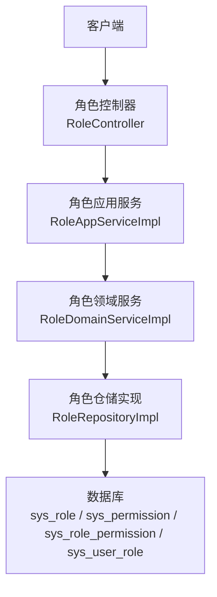
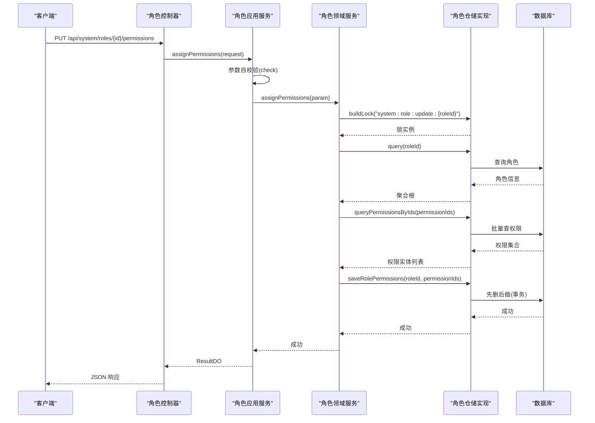
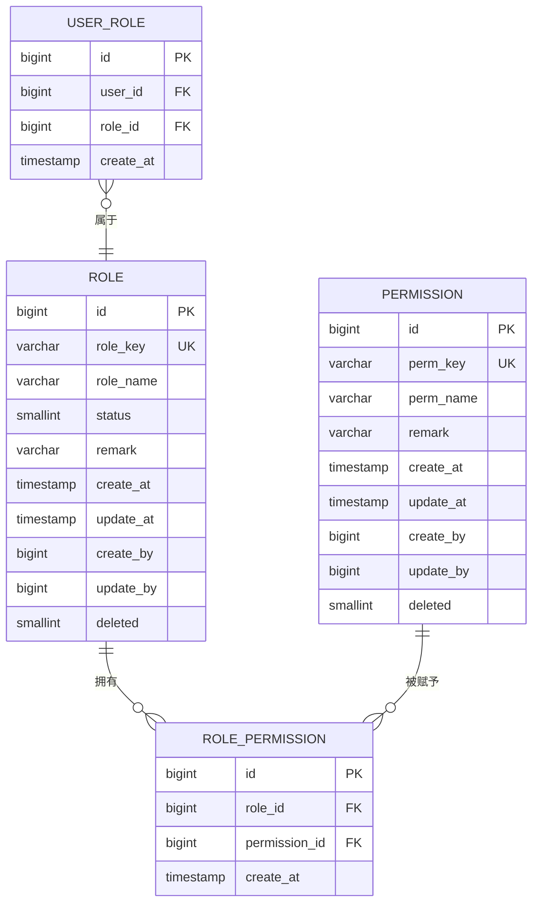
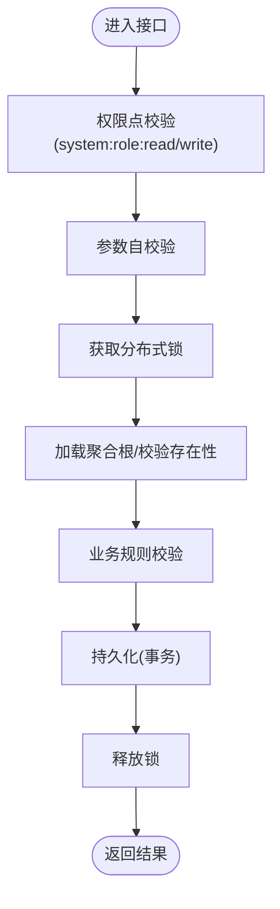
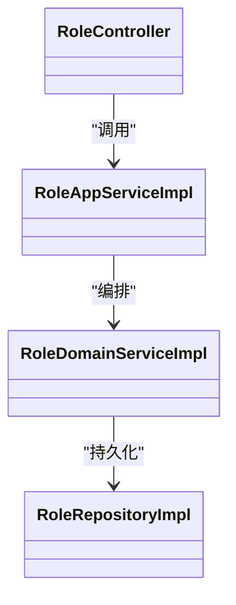

# 角色权限接口

<cite>
**本文引用的文件**   
- [RoleController.java](file://src/main/java/com/sunnao/spring/ddd/template/adaptor/system/role/input/RoleController.java)
- [RoleAppServiceImpl.java](file://src/main/java/com/sunnao/spring/ddd/template/application/system/role/scenario/RoleAppServiceImpl.java)
- [RoleDomainServiceImpl.java](file://src/main/java/com/sunnao/spring/ddd/template/domain/system/role/service/RoleDomainServiceImpl.java)
- [RoleRepositoryImpl.java](file://src/main/java/com/sunnao/spring/ddd/template/infrastructure/system/role/repository/RoleRepositoryImpl.java)
- [V2__init_rbac.sql](file://src/main/resources/db/migration/V2__init_rbac.sql)
- [CreateRoleRequestDTO.java](file://src/main/java/com/sunnao/spring/ddd/template/client/system/role/req/CreateRoleRequestDTO.java)
- [UpdateRoleRequestDTO.java](file://src/main/java/com/sunnao/spring/ddd/template/client/system/role/req/UpdateRoleRequestDTO.java)
- [DeleteRoleRequestDTO.java](file://src/main/java/com/sunnao/spring/ddd/template/client/system/role/req/DeleteRoleRequestDTO.java)
- [AssignPermissionRequestDTO.java](file://src/main/java/com/sunnao/spring/ddd/template/client/system/role/req/AssignPermissionRequestDTO.java)
- [AssignUserRoleRequestDTO.java](file://src/main/java/com/sunnao/spring/ddd/template/client/system/role/req/AssignUserRoleRequestDTO.java)
- [CreateRoleResponseDTO.java](file://src/main/java/com/sunnao/spring/ddd/template/client/system/role/res/CreateRoleResponseDTO.java)
- [UpdateRoleResponseDTO.java](file://src/main/java/com/sunnao/spring/ddd/template/client/system/role/res/UpdateRoleResponseDTO.java)
- [DeleteRoleResponseDTO.java](file://src/main/java/com/sunnao/spring/ddd/template/client/system/role/res/DeleteRoleResponseDTO.java)
- [AssignPermissionResponseDTO.java](file://src/main/java/com/sunnao/spring/ddd/template/client/system/role/res/AssignPermissionResponseDTO.java)
- [AssignUserRoleResponseDTO.java](file://src/main/java/com/sunnao/spring/ddd/template/client/system/role/res/AssignUserRoleResponseDTO.java)
</cite>

## 目录
1. [简介](#简介)
2. [项目结构](#项目结构)
3. [核心组件](#核心组件)
4. [架构总览](#架构总览)
5. [详细组件分析](#详细组件分析)
6. [依赖分析](#依赖分析)
7. [性能考虑](#性能考虑)
8. [故障排查指南](#故障排查指南)
9. [结论](#结论)
10. [附录](#附录)

## 简介
本文件为“角色权限管理模块”的 RESTful API 文档，覆盖以下能力：
- 角色创建、更新、删除、查询（单条与分页）
- 权限分配（全量覆盖）
- 用户角色关联（全量覆盖）
- 权限列表查询（供前端选择）

同时说明 RBAC 数据模型、权限点命名规范、多对多关系、权限继承机制与校验流程，并提供复杂场景与批量操作示例。

## 项目结构
该模块遵循 DDD 分层：
- 适配层（Adaptor）：HTTP 控制器，负责参数绑定、鉴权注解、日志切面
- 应用层（Application）：场景编排、参数自校验、领域服务调用、响应组装
- 领域层（Domain）：聚合根与领域服务，承载业务规则与一致性约束
- 基础设施层（Infrastructure）：仓储实现，持久化与对象转换

图表来源
- [RoleController.java:1-138](file://src/main/java/com/sunnao/spring/ddd/template/adaptor/system/role/input/RoleController.java#L1-L138)
- [RoleAppServiceImpl.java:1-160](file://src/main/java/com/sunnao/spring/ddd/template/application/system/role/scenario/RoleAppServiceImpl.java#L1-L160)
- [RoleDomainServiceImpl.java:1-208](file://src/main/java/com/sunnao/spring/ddd/template/domain/system/role/service/RoleDomainServiceImpl.java#L1-L208)
- [RoleRepositoryImpl.java:1-395](file://src/main/java/com/sunnao/spring/ddd/template/infrastructure/system/role/repository/RoleRepositoryImpl.java#L1-L395)
- [V2__init_rbac.sql:1-158](file://src/main/resources/db/migration/V2__init_rbac.sql#L1-L158)

章节来源
- [RoleController.java:1-138](file://src/main/java/com/sunnao/spring/ddd/template/adaptor/system/role/input/RoleController.java#L1-L138)
- [RoleAppServiceImpl.java:1-160](file://src/main/java/com/sunnao/spring/ddd/template/application/system/role/scenario/RoleAppServiceImpl.java#L1-L160)
- [RoleDomainServiceImpl.java:1-208](file://src/main/java/com/sunnao/spring/ddd/template/domain/system/role/service/RoleDomainServiceImpl.java#L1-L208)
- [RoleRepositoryImpl.java:1-395](file://src/main/java/com/sunnao/spring/ddd/template/infrastructure/system/role/repository/RoleRepositoryImpl.java#L1-L395)
- [V2__init_rbac.sql:1-158](file://src/main/resources/db/migration/V2__init_rbac.sql#L1-L158)

## 核心组件
- 控制器：提供 REST 端点，使用注解进行权限控制与操作日志记录
- 应用服务：参数自校验、领域服务编排、异常统一包装
- 领域服务：加锁、加载聚合根、执行业务规则、持久化
- 仓储实现：PO 与领域对象转换、分页、事务性批量写入、权限/角色/用户关联维护

章节来源
- [RoleController.java:1-138](file://src/main/java/com/sunnao/spring/ddd/template/adaptor/system/role/input/RoleController.java#L1-L138)
- [RoleAppServiceImpl.java:1-160](file://src/main/java/com/sunnao/spring/ddd/template/application/system/role/scenario/RoleAppServiceImpl.java#L1-L160)
- [RoleDomainServiceImpl.java:1-208](file://src/main/java/com/sunnao/spring/ddd/template/domain/system/role/service/RoleDomainServiceImpl.java#L1-L208)
- [RoleRepositoryImpl.java:1-395](file://src/main/java/com/sunnao/spring/ddd/template/infrastructure/system/role/repository/RoleRepositoryImpl.java#L1-L395)

## 架构总览
下图展示一次“分配权限”请求的端到端调用链与关键校验点。

图表来源
- [RoleController.java:70-80](file://src/main/java/com/sunnao/spring/ddd/template/adaptor/system/role/input/RoleController.java#L70-L80)
- [RoleAppServiceImpl.java:108-132](file://src/main/java/com/sunnao/spring/ddd/template/application/system/role/scenario/RoleAppServiceImpl.java#L108-L132)
- [RoleDomainServiceImpl.java:131-168](file://src/main/java/com/sunnao/spring/ddd/template/domain/system/role/service/RoleDomainServiceImpl.java#L131-L168)
- [RoleRepositoryImpl.java:208-231](file://src/main/java/com/sunnao/spring/ddd/template/infrastructure/system/role/repository/RoleRepositoryImpl.java#L208-L231)
- [V2__init_rbac.sql:80-96](file://src/main/resources/db/migration/V2__init_rbac.sql#L80-L96)

## 详细组件分析

### 接口清单与契约

- 创建角色
  - 方法路径：POST /api/system/roles
  - 权限要求：system:role:write
  - 请求体：CreateRoleRequestDTO
  - 响应体：ResultDO<CreateRoleResponseDTO>
  - 行为：校验 roleKey 唯一性与格式；返回新建角色 ID

- 修改角色
  - 方法路径：PUT /api/system/roles/{id}
  - 权限要求：system:role:write
  - 请求体：UpdateRoleRequestDTO
  - 响应体：ResultDO<UpdateRoleResponseDTO>
  - 行为：仅允许更新名称/状态/备注；roleKey 不可变更

- 删除角色
  - 方法路径：DELETE /api/system/roles/{id}
  - 权限要求：system:role:write
  - 响应体：ResultDO<DeleteRoleResponseDTO>
  - 行为：逻辑删除；内置角色不可删除；清理关联

- 获取角色详情
  - 方法路径：GET /api/system/roles/{id}
  - 权限要求：system:role:read
  - 响应体：ResultDO<GetRoleDetailResponseDTO>
  - 行为：返回角色信息与已分配的权限 key 集合

- 分页查询角色列表
  - 方法路径：GET /api/system/roles/page
  - 权限要求：system:role:read
  - 查询参数：pageNum、pageSize、roleKey、roleName、status
  - 响应体：ResultDO<QueryRolePageResponseDTO>
  - 行为：按条件分页，默认升序

- 分配权限（全量覆盖）
  - 方法路径：PUT /api/system/roles/{id}/permissions
  - 权限要求：system:role:write
  - 请求体：AssignPermissionRequestDTO
  - 响应体：ResultDO<AssignPermissionResponseDTO>
  - 行为：先删后插，支持清空权限

- 给用户授予角色（全量覆盖）
  - 方法路径：PUT /api/system/roles/users/{userId}
  - 权限要求：system:role:write
  - 请求体：AssignUserRoleRequestDTO
  - 响应体：ResultDO<AssignUserRoleResponseDTO>
  - 行为：先删后插，支持清空角色

- 查询全部权限点
  - 方法路径：GET /api/system/roles/permissions
  - 权限要求：system:role:read
  - 响应体：ResultDO<QueryPermissionListResponseDTO>
  - 行为：返回所有可用权限点，供前端选择

章节来源
- [RoleController.java:32-136](file://src/main/java/com/sunnao/spring/ddd/template/adaptor/system/role/input/RoleController.java#L32-L136)

### 请求与响应 DTO 定义

- CreateRoleRequestDTO
  - 字段：roleKey、roleName、remark
  - 校验：roleKey 非空且符合正则；roleName 非空

- UpdateRoleRequestDTO
  - 字段：roleId、roleName、status、remark
  - 校验：至少更新一项；status 取值合法

- DeleteRoleRequestDTO
  - 字段：roleId
  - 校验：非空

- AssignPermissionRequestDTO
  - 字段：roleId、permissionIds
  - 校验：permissionIds 不能为 null，元素不能含空值

- AssignUserRoleRequestDTO
  - 字段：userId、roleIds
  - 校验：roleIds 不能为 null，元素不能含空值

- 响应 DTO
  - CreateRoleResponseDTO：返回 roleId
  - UpdateRoleResponseDTO：返回 roleId
  - DeleteRoleResponseDTO：返回 roleId
  - AssignPermissionResponseDTO：返回 roleId
  - AssignUserRoleResponseDTO：返回 userId

章节来源
- [CreateRoleRequestDTO.java:1-55](file://src/main/java/com/sunnao/spring/ddd/template/client/system/role/req/CreateRoleRequestDTO.java#L1-L55)
- [UpdateRoleRequestDTO.java:1-59](file://src/main/java/com/sunnao/spring/ddd/template/client/system/role/req/UpdateRoleRequestDTO.java#L1-L59)
- [DeleteRoleRequestDTO.java:1-36](file://src/main/java/com/sunnao/spring/ddd/template/client/system/role/req/DeleteRoleRequestDTO.java#L1-L36)
- [AssignPermissionRequestDTO.java:1-48](file://src/main/java/com/sunnao/spring/ddd/template/client/system/role/req/AssignPermissionRequestDTO.java#L1-L48)
- [AssignUserRoleRequestDTO.java:1-48](file://src/main/java/com/sunnao/spring/ddd/template/client/system/role/req/AssignUserRoleRequestDTO.java#L1-L48)
- [CreateRoleResponseDTO.java:1-26](file://src/main/java/com/sunnao/spring/ddd/template/client/system/role/res/CreateRoleResponseDTO.java#L1-L26)
- [UpdateRoleResponseDTO.java:1-26](file://src/main/java/com/sunnao/spring/ddd/template/client/system/role/res/UpdateRoleResponseDTO.java#L1-L26)
- [DeleteRoleResponseDTO.java:1-26](file://src/main/java/com/sunnao/spring/ddd/template/client/system/role/res/DeleteRoleResponseDTO.java#L1-L26)
- [AssignPermissionResponseDTO.java:1-26](file://src/main/java/com/sunnao/spring/ddd/template/client/system/role/res/AssignPermissionResponseDTO.java#L1-L26)
- [AssignUserRoleResponseDTO.java:1-26](file://src/main/java/com/sunnao/spring/ddd/template/client/system/role/res/AssignUserRoleResponseDTO.java#L1-L26)

### 业务流程与规则

- 角色创建
  - 并发保护：基于 roleKey 的分布式锁
  - 唯一性：roleKey 全局唯一（索引约束）
  - 审计：创建人/时间由基础设施自动填充

- 角色更新
  - 并发保护：基于 roleId 的分布式锁
  - 不可变字段：roleKey 不允许变更
  - 状态枚举：启用/禁用

- 角色删除
  - 并发保护：基于 roleId 的分布式锁
  - 内置角色保护：admin/user 不可删除
  - 逻辑删除：deleted 置位
  - 级联清理：删除角色-权限、用户-角色关联

- 权限分配（全量覆盖）
  - 并发保护：基于 roleId 的分布式锁
  - 存在性校验：权限 ID 必须存在
  - 幂等策略：先删后插，支持清空

- 用户角色关联（全量覆盖）
  - 并发保护：基于 userId 的分布式锁
  - 存在性校验：用户与角色必须存在
  - 幂等策略：先删后插，支持清空

章节来源
- [RoleDomainServiceImpl.java:35-206](file://src/main/java/com/sunnao/spring/ddd/template/domain/system/role/service/RoleDomainServiceImpl.java#L35-L206)
- [RoleRepositoryImpl.java:159-256](file://src/main/java/com/sunnao/spring/ddd/template/infrastructure/system/role/repository/RoleRepositoryImpl.java#L159-L256)
- [V2__init_rbac.sql:41-114](file://src/main/resources/db/migration/V2__init_rbac.sql#L41-L114)

### 权限点定义规范
- 命名模式：模块:资源:动作
  - 示例：system:user:read、system:role:write、system:dict:read、system:file:write、system:log:read
- 粒度建议：以“读/写”为基本动作粒度，必要时扩展更细粒度
- 存储：sys_permission.perm_key 唯一索引，系统启动时通过迁移脚本初始化种子数据

章节来源
- [V2__init_rbac.sql:122-132](file://src/main/resources/db/migration/V2__init_rbac.sql#L122-L132)

### RBAC 数据模型与关系
- 表结构
  - sys_role：角色主数据（role_key 唯一）
  - sys_permission：权限点主数据（perm_key 唯一）
  - sys_role_permission：角色-权限多对多
  - sys_user_role：用户-角色多对多
- 关系图

图表来源
- [V2__init_rbac.sql:4-114](file://src/main/resources/db/migration/V2__init_rbac.sql#L4-L114)

章节来源
- [V2__init_rbac.sql:1-158](file://src/main/resources/db/migration/V2__init_rbac.sql#L1-L158)

### 权限继承与校验流程
- 继承机制
  - 用户可拥有多个角色，其权限为用户所有角色的权限并集
  - 查询用户权限时，仅统计启用状态的角色的权限
- 校验流程（以接口为例）
  - 控制器层：Sa-Token 注解检查 system:role:read/write
  - 应用层：参数自校验
  - 领域层：业务规则校验（如内置角色保护、ID 存在性）
  - 仓储层：并发锁、事务性批量写入、去重与索引约束

图表来源
- [RoleController.java:32-136](file://src/main/java/com/sunnao/spring/ddd/template/adaptor/system/role/input/RoleController.java#L32-L136)
- [RoleAppServiceImpl.java:30-158](file://src/main/java/com/sunnao/spring/ddd/template/application/system/role/scenario/RoleAppServiceImpl.java#L30-L158)
- [RoleDomainServiceImpl.java:35-206](file://src/main/java/com/sunnao/spring/ddd/template/domain/system/role/service/RoleDomainServiceImpl.java#L35-L206)
- [RoleRepositoryImpl.java:334-337](file://src/main/java/com/sunnao/spring/ddd/template/infrastructure/system/role/repository/RoleRepositoryImpl.java#L334-L337)

### 复杂权限分配场景示例
- 场景一：为新角色“订单管理员”分配“订单查看/编辑/导出”权限
  - 步骤：
    1) GET /api/system/roles/permissions 获取权限点列表
    2) PUT /api/system/roles/{id}/permissions 传入对应权限 ID 集合（全量覆盖）
- 场景二：将“客服专员”角色从用户 A 移除，并新增“售后处理”角色
  - 步骤：
    1) PUT /api/system/roles/users/{userId} 传入新的角色 ID 集合（全量覆盖）
- 场景三：批量授权
  - 思路：在外部循环调用分配接口；若需更高吞吐，可在后端封装批量接口（当前版本为逐条全量覆盖）

[本节为概念性示例，不直接引用具体代码行]

### 批量操作示例
- 批量分配权限：遍历目标角色集合，逐个调用分配接口
- 批量授角色：遍历目标用户集合，逐个调用授角色接口
- 注意：
  - 全量覆盖语义会清空未显式传入的关联项
  - 建议在调用前做好幂等与重试策略

[本节为概念性示例，不直接引用具体代码行]

## 依赖分析
- 控制器依赖应用服务
- 应用服务依赖领域服务与装配器
- 领域服务依赖仓储与用户仓储
- 仓储依赖 MyBatis-Flex Mapper 与转换器，实现事务性批量写入

图表来源
- [RoleController.java:1-138](file://src/main/java/com/sunnao/spring/ddd/template/adaptor/system/role/input/RoleController.java#L1-L138)
- [RoleAppServiceImpl.java:1-160](file://src/main/java/com/sunnao/spring/ddd/template/application/system/role/scenario/RoleAppServiceImpl.java#L1-L160)
- [RoleDomainServiceImpl.java:1-208](file://src/main/java/com/sunnao/spring/ddd/template/domain/system/role/service/RoleDomainServiceImpl.java#L1-L208)
- [RoleRepositoryImpl.java:1-395](file://src/main/java/com/sunnao/spring/ddd/template/infrastructure/system/role/repository/RoleRepositoryImpl.java#L1-L395)

章节来源
- [RoleController.java:1-138](file://src/main/java/com/sunnao/spring/ddd/template/adaptor/system/role/input/RoleController.java#L1-L138)
- [RoleAppServiceImpl.java:1-160](file://src/main/java/com/sunnao/spring/ddd/template/application/system/role/scenario/RoleAppServiceImpl.java#L1-L160)
- [RoleDomainServiceImpl.java:1-208](file://src/main/java/com/sunnao/spring/ddd/template/domain/system/role/service/RoleDomainServiceImpl.java#L1-L208)
- [RoleRepositoryImpl.java:1-395](file://src/main/java/com/sunnao/spring/ddd/template/infrastructure/system/role/repository/RoleRepositoryImpl.java#L1-L395)

## 性能考虑
- 并发安全：关键写操作均使用分布式锁，避免重复创建与竞态条件
- 幂等设计：权限与角色关联采用“先删后插”，多次调用结果一致
- 批量写入：仓储层使用批量插入减少往返开销
- 索引优化：role_key、perm_key、user_id、role_id 组合键均有索引或唯一约束
- 分页查询：使用分页查询接口，避免一次性拉取大量数据

[本节为通用指导，不直接引用具体代码行]

## 故障排查指南
- 常见错误码
  - 参数错误：字段缺失或格式不合法
  - 角色标识重复：创建时 roleKey 冲突
  - 角色不存在：更新/删除/分配权限时角色不存在
  - 权限不存在：分配权限时包含无效权限 ID
  - 用户不存在：授角色时用户不存在
  - 锁失败：并发竞争导致获取锁失败
  - 系统错误：未知异常兜底
- 定位建议
  - 检查请求参数是否符合 DTO 校验规则
  - 确认权限点是否已在系统中初始化
  - 观察分布式锁日志与数据库事务日志
  - 核对角色状态是否为启用（影响权限继承）

章节来源
- [RoleAppServiceImpl.java:30-158](file://src/main/java/com/sunnao/spring/ddd/template/application/system/role/scenario/RoleAppServiceImpl.java#L30-L158)
- [RoleDomainServiceImpl.java:35-206](file://src/main/java/com/sunnao/spring/ddd/template/domain/system/role/service/RoleDomainServiceImpl.java#L35-L206)
- [RoleRepositoryImpl.java:64-395](file://src/main/java/com/sunnao/spring/ddd/template/infrastructure/system/role/repository/RoleRepositoryImpl.java#L64-L395)

## 结论
本模块通过清晰的 DDD 分层与严格的参数校验、并发控制与事务保障，提供了稳定可靠的角色与权限管理能力。权限点采用统一的命名规范，结合 Sa-Token 的细粒度鉴权，满足企业级系统的权限治理需求。

[本节为总结性内容，不直接引用具体代码行]

## 附录

### 接口一览（摘要）
- POST /api/system/roles → 创建角色
- PUT /api/system/roles/{id} → 修改角色
- DELETE /api/system/roles/{id} → 删除角色
- GET /api/system/roles/{id} → 获取角色详情
- GET /api/system/roles/page → 分页查询角色
- PUT /api/system/roles/{id}/permissions → 分配权限
- PUT /api/system/roles/users/{userId} → 授予角色
- GET /api/system/roles/permissions → 查询权限点列表

章节来源
- [RoleController.java:32-136](file://src/main/java/com/sunnao/spring/ddd/template/adaptor/system/role/input/RoleController.java#L32-L136)