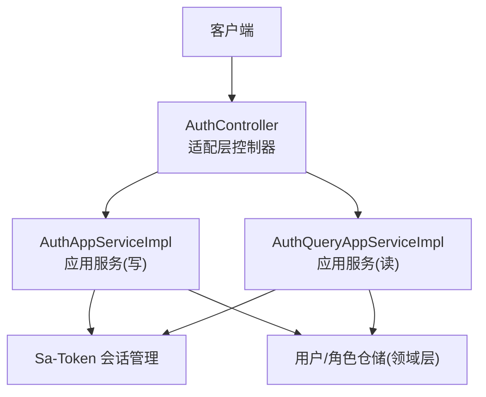
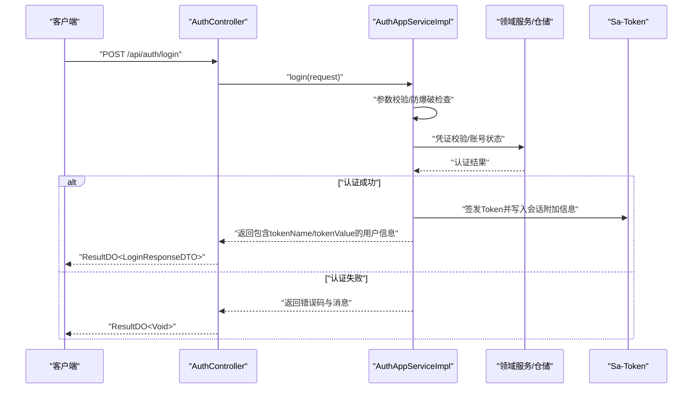
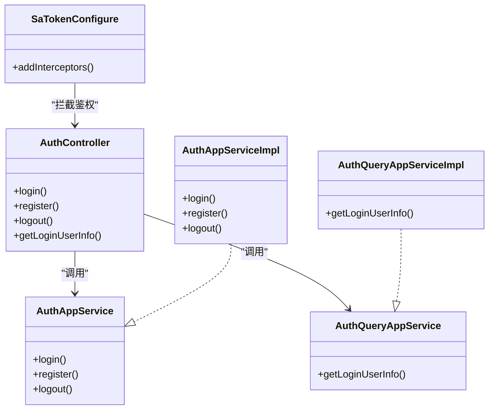

# 认证接口

<cite>
**本文引用的文件列表**
- [AuthController.java](file://src/main/java/com/sunnao/spring/ddd/template/adaptor/auth/input/AuthController.java)
- [LoginRequestDTO.java](file://src/main/java/com/sunnao/spring/ddd/template/client/auth/req/LoginRequestDTO.java)
- [RegisterRequestDTO.java](file://src/main/java/com/sunnao/spring/ddd/template/client/auth/req/RegisterRequestDTO.java)
- [LoginResponseDTO.java](file://src/main/java/com/sunnao/spring/ddd/template/client/auth/res/LoginResponseDTO.java)
- [RegisterResponseDTO.java](file://src/main/java/com/sunnao/spring/ddd/template/client/auth/res/RegisterResponseDTO.java)
- [GetLoginUserResponseDTO.java](file://src/main/java/com/sunnao/spring/ddd/template/client/auth/res/GetLoginUserResponseDTO.java)
- [ResultDO.java](file://src/main/java/com/sunnao/spring/ddd/template/common/result/ResultDO.java)
- [ErrorCodeEnum.java](file://src/main/java/com/sunnao/spring/ddd/template/common/result/ErrorCodeEnum.java)
- [SaTokenConfigure.java](file://src/main/java/com/sunnao/spring/ddd/template/common/config/SaTokenConfigure.java)
- [AuthAppServiceImpl.java](file://src/main/java/com/sunnao/spring/ddd/template/application/auth/scenario/AuthAppServiceImpl.java)
- [AuthQueryAppServiceImpl.java](file://src/main/java/com/sunnao/spring/ddd/template/application/auth/scenario/AuthQueryAppServiceImpl.java)
</cite>

## 目录
1. [简介](#简介)
2. [项目结构](#项目结构)
3. [核心组件](#核心组件)
4. [架构总览](#架构总览)
5. [详细接口说明](#详细接口说明)
6. [依赖分析](#依赖分析)
7. [性能与可用性](#性能与可用性)
8. [故障排查指南](#故障排查指南)
9. [结论](#结论)
10. [附录：安全最佳实践](#附录安全最佳实践)

## 简介
本章节面向调用方，提供认证模块的 RESTful API 文档。涵盖以下接口：
- POST /api/auth/login：登录
- POST /api/auth/register：注册（成功后自动登录）
- POST /api/auth/logout：登出
- GET /api/auth/me：获取当前登录用户信息

所有响应统一使用 ResultDO 包装结构；认证基于 Sa-Token，通过请求头携带 Token。

## 项目结构
认证相关代码采用 DDD 分层组织：
- 适配层（Adaptor）：对外暴露 HTTP 接口
- 应用层（Application）：编排业务场景、会话管理、事件发布
- 领域层（Domain）：领域服务与仓储契约
- 基础设施层（Infrastructure）：持久化实现、外部集成

图表来源
- [AuthController.java:1-70](file://src/main/java/com/sunnao/spring/ddd/template/adaptor/auth/input/AuthController.java#L1-L70)
- [AuthAppServiceImpl.java:1-196](file://src/main/java/com/sunnao/spring/ddd/template/application/auth/scenario/AuthAppServiceImpl.java#L1-L196)
- [AuthQueryAppServiceImpl.java:1-57](file://src/main/java/com/sunnao/spring/ddd/template/application/auth/scenario/AuthQueryAppServiceImpl.java#L1-L57)

章节来源
- [AuthController.java:1-70](file://src/main/java/com/sunnao/spring/ddd/template/adaptor/auth/input/AuthController.java#L1-L70)
- [AuthAppServiceImpl.java:1-196](file://src/main/java/com/sunnao/spring/ddd/template/application/auth/scenario/AuthAppServiceImpl.java#L1-L196)
- [AuthQueryAppServiceImpl.java:1-57](file://src/main/java/com/sunnao/spring/ddd/template/application/auth/scenario/AuthQueryAppServiceImpl.java#L1-L57)

## 核心组件
- 统一结果对象 ResultDO：封装 success、code、msg、data 字段，提供成功/失败构建方法
- 错误码枚举 ErrorCodeEnum：集中定义全局错误码及默认文案
- DTO 模型：登录/注册请求与响应、当前用户信息响应
- Sa-Token 配置：对 /api/** 进行登录态拦截，放行 /api/auth/** 与 OpenAPI 路径

章节来源
- [ResultDO.java:1-110](file://src/main/java/com/sunnao/spring/ddd/template/common/result/ResultDO.java#L1-L110)
- [ErrorCodeEnum.java:1-209](file://src/main/java/com/sunnao/spring/ddd/template/common/result/ErrorCodeEnum.java#L1-L209)
- [SaTokenConfigure.java:1-31](file://src/main/java/com/sunnao/spring/ddd/template/common/config/SaTokenConfigure.java#L1-L31)

## 架构总览
认证流程的关键交互如下：

图表来源
- [AuthController.java:32-40](file://src/main/java/com/sunnao/spring/ddd/template/adaptor/auth/input/AuthController.java#L32-L40)
- [AuthAppServiceImpl.java:66-113](file://src/main/java/com/sunnao/spring/ddd/template/application/auth/scenario/AuthAppServiceImpl.java#L66-L113)

## 详细接口说明

### 通用约定
- 基础路径：/api
- 请求体格式：application/json
- 响应格式：统一使用 ResultDO<T> 包装
- 认证方式：登录后返回 tokenName 与 tokenValue，后续请求在请求头中携带该名称对应的值
- 登录态拦截：除 /api/auth/** 与 OpenAPI 路径外，其他 /api/** 均需登录态

章节来源
- [AuthController.java:21-24](file://src/main/java/com/sunnao/spring/ddd/template/adaptor/auth/input/AuthController.java#L21-L24)
- [SaTokenConfigure.java:17-30](file://src/main/java/com/sunnao/spring/ddd/template/common/config/SaTokenConfigure.java#L17-L30)

### 登录接口
- 方法：POST
- 路径：/api/auth/login
- 请求头：无特殊要求（无需 Token）
- 请求体：LoginRequestDTO
  - email：邮箱，必填，符合邮箱正则
  - password：密码，必填，明文传输（建议走 HTTPS）
- 响应体：ResultDO<LoginResponseDTO>
  - data.tokenName：Token 名称（用于后续请求头携带）
  - data.tokenValue：Token 值
  - data.userId：用户ID
  - data.nickname：昵称
  - data.roles：角色标识集合
- 错误码：
  - PARAM_ERROR：参数校验失败
  - AUTH_LOCKED：登录失败次数过多，暂时锁定
  - AUTH_FAIL：邮箱或密码错误
  - SYSTEM_ERROR：系统异常

请求示例
- 请求体
  {
    "email": "user@example.com",
    "password": "your_password"
  }
- 成功响应
  {
    "success": true,
    "code": null,
    "msg": null,
    "data": {
      "tokenName": "satoken",
      "tokenValue": "xxxxx",
      "userId": 1,
      "nickname": "张三",
      "roles": ["admin","user"]
    }
  }
- 失败响应（示例：邮箱或密码错误）
  {
    "success": false,
    "code": "AUTH_FAIL",
    "msg": "邮箱或密码错误",
    "data": null
  }

章节来源
- [AuthController.java:32-40](file://src/main/java/com/sunnao/spring/ddd/template/adaptor/auth/input/AuthController.java#L32-L40)
- [LoginRequestDTO.java:1-50](file://src/main/java/com/sunnao/spring/ddd/template/client/auth/req/LoginRequestDTO.java#L1-L50)
- [LoginResponseDTO.java:1-47](file://src/main/java/com/sunnao/spring/ddd/template/client/auth/res/LoginResponseDTO.java#L1-L47)
- [AuthAppServiceImpl.java:66-113](file://src/main/java/com/sunnao/spring/ddd/template/application/auth/scenario/AuthAppServiceImpl.java#L66-L113)
- [ErrorCodeEnum.java:83-98](file://src/main/java/com/sunnao/spring/ddd/template/common/result/ErrorCodeEnum.java#L83-L98)

### 注册接口
- 方法：POST
- 路径：/api/auth/register
- 请求头：无特殊要求（无需 Token）
- 请求体：RegisterRequestDTO
  - email：邮箱，必填，符合邮箱正则
  - nickname：昵称，必填
  - password：密码，必填，长度不小于 6
  - confirmPassword：确认密码，必填，需与 password 一致
- 响应体：ResultDO<RegisterResponseDTO>
  - data.tokenName：Token 名称
  - data.tokenValue：Token 值
  - data.userId：用户ID
  - data.nickname：昵称
  - data.roles：角色标识集合（自助注册默认授予 user）
- 错误码：
  - PARAM_ERROR：参数校验失败
  - EMAIL_DUPLICATE：邮箱已被注册
  - SYSTEM_ERROR：系统异常

请求示例
- 请求体
  {
    "email": "newuser@example.com",
    "nickname": "新用户",
    "password": "123456",
    "confirmPassword": "123456"
  }
- 成功响应
  {
    "success": true,
    "code": null,
    "msg": null,
    "data": {
      "tokenName": "satoken",
      "tokenValue": "yyyyy",
      "userId": 2,
      "nickname": "新用户",
      "roles": ["user"]
    }
  }
- 失败响应（示例：两次输入的密码不一致）
  {
    "success": false,
    "code": "PARAM_ERROR",
    "msg": "两次输入的密码不一致",
    "data": null
  }

章节来源
- [AuthController.java:42-50](file://src/main/java/com/sunnao/spring/ddd/template/adaptor/auth/input/AuthController.java#L42-L50)
- [RegisterRequestDTO.java:1-67](file://src/main/java/com/sunnao/spring/ddd/template/client/auth/req/RegisterRequestDTO.java#L1-L67)
- [RegisterResponseDTO.java:1-49](file://src/main/java/com/sunnao/spring/ddd/template/client/auth/res/RegisterResponseDTO.java#L1-L49)
- [AuthAppServiceImpl.java:115-145](file://src/main/java/com/sunnao/spring/ddd/template/application/auth/scenario/AuthAppServiceImpl.java#L115-L145)
- [ErrorCodeEnum.java:100-111](file://src/main/java/com/sunnao/spring/ddd/template/common/result/ErrorCodeEnum.java#L100-L111)

### 登出接口
- 方法：POST
- 路径：/api/auth/logout
- 请求头：需要携带已登录的 Token（由 Sa-Token 拦截器校验）
- 请求体：无
- 响应体：ResultDO<Void>
- 行为说明：未登录时登出视为幂等成功
- 错误码：
  - NOT_LOGIN：未登录或登录已过期（由拦截器直接拒绝）
  - SYSTEM_ERROR：系统异常

请求示例
- 请求头
  satoken: yyyyy
- 成功响应
  {
    "success": true,
    "code": null,
    "msg": null,
    "data": null
  }

章节来源
- [AuthController.java:52-59](file://src/main/java/com/sunnao/spring/ddd/template/adaptor/auth/input/AuthController.java#L52-L59)
- [AuthAppServiceImpl.java:182-194](file://src/main/java/com/sunnao/spring/ddd/template/application/auth/scenario/AuthAppServiceImpl.java#L182-L194)
- [SaTokenConfigure.java:17-30](file://src/main/java/com/sunnao/spring/ddd/template/common/config/SaTokenConfigure.java#L17-L30)

### 获取当前用户信息接口
- 方法：GET
- 路径：/api/auth/me
- 请求头：需要携带已登录的 Token
- 请求体：无
- 响应体：ResultDO<GetLoginUserResponseDTO>
  - data.userId：用户ID
  - data.email：邮箱
  - data.nickname：昵称
  - data.avatar：头像URL
  - data.roles：角色标识集合
  - data.status：状态（1-启用，0-禁用）
- 错误码：
  - NOT_LOGIN：未登录或登录已过期（由拦截器直接拒绝）
  - USER_NOT_FOUND：用户不存在
  - SYSTEM_ERROR：系统异常

请求示例
- 请求头
  satoken: yyyyy
- 成功响应
  {
    "success": true,
    "code": null,
    "msg": null,
    "data": {
      "userId": 1,
      "email": "user@example.com",
      "nickname": "张三",
      "avatar": "https://example.com/avatar.png",
      "roles": ["admin","user"],
      "status": 1
    }
  }
- 失败响应（示例：未登录）
  {
    "success": false,
    "code": "NOT_LOGIN",
    "msg": "未登录或登录已过期",
    "data": null
  }

章节来源
- [AuthController.java:61-68](file://src/main/java/com/sunnao/spring/ddd/template/adaptor/auth/input/AuthController.java#L61-L68)
- [GetLoginUserResponseDTO.java:1-52](file://src/main/java/com/sunnao/spring/ddd/template/client/auth/res/GetLoginUserResponseDTO.java#L1-L52)
- [AuthQueryAppServiceImpl.java:33-55](file://src/main/java/com/sunnao/spring/ddd/template/application/auth/scenario/AuthQueryAppServiceImpl.java#L33-L55)
- [SaTokenConfigure.java:17-30](file://src/main/java/com/sunnao/spring/ddd/template/common/config/SaTokenConfigure.java#L17-L30)

### 统一响应结构 ResultDO
- 字段
  - success：是否成功
  - code：错误码（成功时为 null）
  - msg：错误信息（成功时为 null）
  - data：业务数据（可为 null）
- 构造方式
  - 成功：buildSuccessResult(data)
  - 失败：buildFailResult(code, msg) 或 buildFailResult(errorCode)

章节来源
- [ResultDO.java:1-110](file://src/main/java/com/sunnao/spring/ddd/template/common/result/ResultDO.java#L1-L110)

### 错误码说明（认证相关）
- AUTH_FAIL：邮箱或密码错误
- AUTH_LOCKED：登录失败次数过多，请稍后重试
- USER_DISABLED：账号已被禁用，请联系管理员
- NOT_LOGIN：未登录或登录已过期
- NO_PERMISSION：无权限访问
- PARAM_ERROR：参数错误
- SYSTEM_ERROR：系统异常
- EMAIL_DUPLICATE：邮箱已被注册

章节来源
- [ErrorCodeEnum.java:83-111](file://src/main/java/com/sunnao/spring/ddd/template/common/result/ErrorCodeEnum.java#L83-L111)

## 依赖分析
- 控制器依赖应用服务接口，应用服务实现负责编排领域服务、Sa-Token 与会话、事件发布
- 登录/注册成功后会向 Token-Session 写入 IP、User-Agent、登录时间等附加信息，供在线用户模块展示
- 登录日志以事件形式异步落库，不影响主流程

图表来源
- [AuthController.java:1-70](file://src/main/java/com/sunnao/spring/ddd/template/adaptor/auth/input/AuthController.java#L1-L70)
- [AuthAppService.java:1-39](file://src/main/java/com/sunnao/spring/ddd/template/client/auth/AuthAppService.java#L1-L39)
- [AuthQueryAppService.java:1-20](file://src/main/java/com/sunnao/spring/ddd/template/client/auth/AuthQueryAppService.java#L1-L20)
- [AuthAppServiceImpl.java:1-196](file://src/main/java/com/sunnao/spring/ddd/template/application/auth/scenario/AuthAppServiceImpl.java#L1-L196)
- [AuthQueryAppServiceImpl.java:1-57](file://src/main/java/com/sunnao/spring/ddd/template/application/auth/scenario/AuthQueryAppServiceImpl.java#L1-L57)
- [SaTokenConfigure.java:1-31](file://src/main/java/com/sunnao/spring/ddd/template/common/config/SaTokenConfigure.java#L1-L31)

## 性能与可用性
- 登录防爆破：基于 LoginAttemptLimiter 的窗口计数，达到阈值后拒绝登录，成功则清零
- 登录日志异步落库：通过 DomainEventPublisher 发布事件，避免阻塞主流程
- Token-Session 写入失败不阻断登录主流程，提升可用性

章节来源
- [AuthAppServiceImpl.java:75-94](file://src/main/java/com/sunnao/spring/ddd/template/application/auth/scenario/AuthAppServiceImpl.java#L75-L94)
- [AuthAppServiceImpl.java:147-180](file://src/main/java/com/sunnao/spring/ddd/template/application/auth/scenario/AuthAppServiceImpl.java#L147-L180)

## 故障排查指南
- 登录失败且提示“登录失败次数过多”：检查同一邮箱+IP 的失败计数是否超限，等待冷却窗口或清理计数
- 注册失败提示“邮箱已被注册”：确认邮箱唯一性约束与并发控制
- 获取当前用户信息返回“未登录”：检查请求头是否正确携带 Token 名称与值
- 系统异常：查看服务端日志中的堆栈信息，定位具体异常点

章节来源
- [AuthAppServiceImpl.java:75-94](file://src/main/java/com/sunnao/spring/ddd/template/application/auth/scenario/AuthAppServiceImpl.java#L75-L94)
- [AuthQueryAppServiceImpl.java:33-55](file://src/main/java/com/sunnao/spring/ddd/template/application/auth/scenario/AuthQueryAppServiceImpl.java#L33-L55)

## 结论
认证模块通过清晰的 DDD 分层与统一的 ResultDO 响应结构，提供了稳定可靠的登录、注册、登出与当前用户信息查询能力。Sa-Token 负责会话管理与鉴权拦截，结合防爆破与异步日志，兼顾安全性与可用性。

## 附录：安全最佳实践
- 强制 HTTPS：确保密码与 Token 在网络传输中加密
- Token 存储：前端将 Token 保存在内存或 HttpOnly Cookie，避免 XSS 窃取
- Token 有效期：合理设置 Sa-Token 的有效期与续期策略，定期轮换
- 最小权限：仅返回必要字段，避免泄露敏感信息
- 限流与风控：结合 IP、设备指纹等多维度限制暴力破解与自动化攻击
- 审计与监控：完善登录日志与告警，及时发现异常行为

[本节为通用安全建议，不直接分析具体文件]