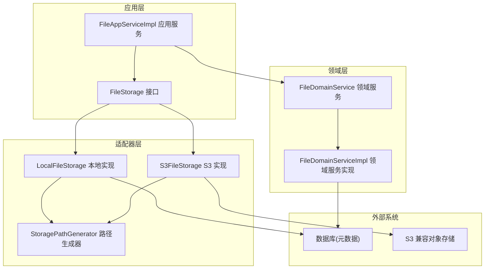
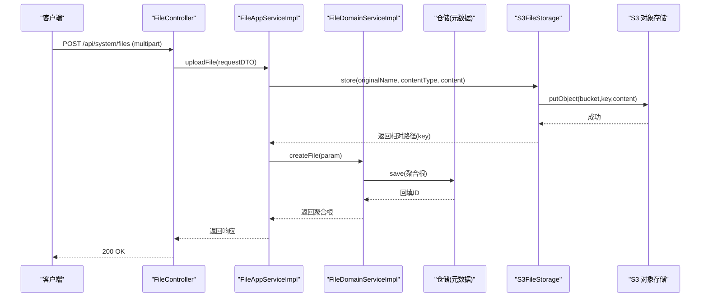
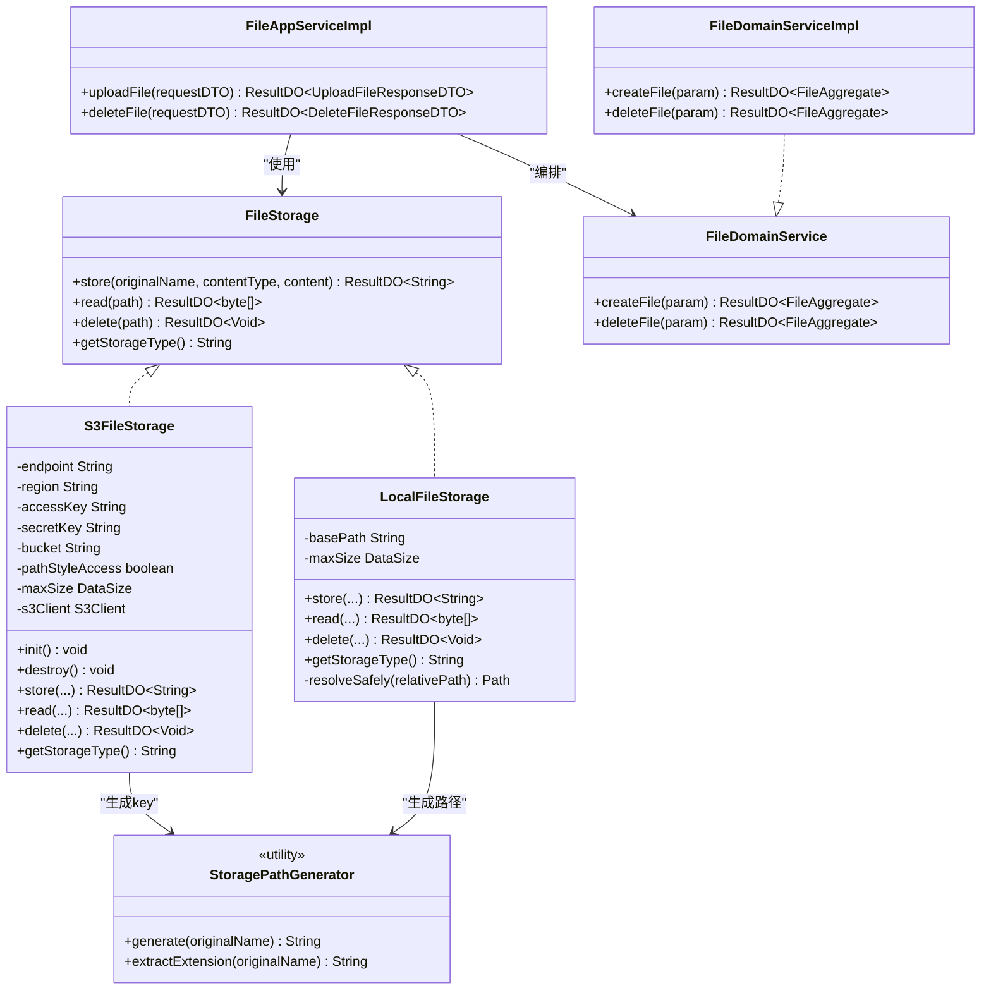
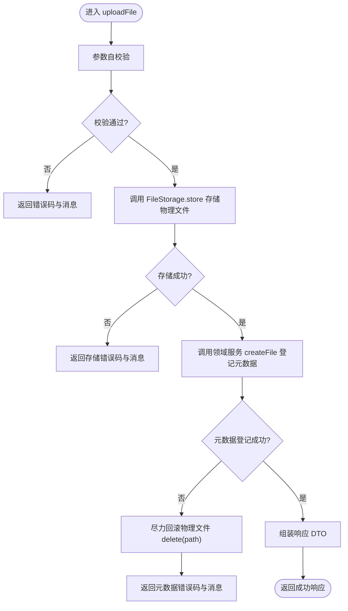
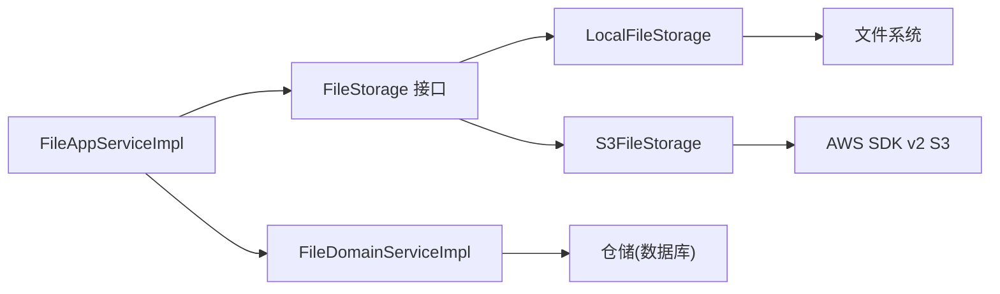

# AWS S3文件存储集成

<cite>
**本文引用的文件**   
- [application.yaml](file://src/main/resources/application.yaml)
- [pom.xml](file://pom.xml)
- [FileStorage.java](file://src/main/java/com/sunnao/spring/ddd/template/application/system/file/FileStorage.java)
- [S3FileStorage.java](file://src/main/java/com/sunnao/spring/ddd/template/adaptor/system/file/output/S3FileStorage.java)
- [LocalFileStorage.java](file://src/main/java/com/sunnao/spring/ddd/template/adaptor/system/file/output/LocalFileStorage.java)
- [StoragePathGenerator.java](file://src/main/java/com/sunnao/spring/ddd/template/adaptor/system/file/output/StoragePathGenerator.java)
- [FileController.java](file://src/main/java/com/sunnao/spring/ddd/template/adaptor/system/file/input/FileController.java)
- [FileAppServiceImpl.java](file://src/main/java/com/sunnao/spring/ddd/template/application/system/file/scenario/FileAppServiceImpl.java)
- [FileDomainService.java](file://src/main/java/com/sunnao/spring/ddd/template/domain/system/file/service/FileDomainService.java)
- [FileDomainServiceImpl.java](file://src/main/java/com/sunnao/spring/ddd/template/domain/system/file/service/FileDomainServiceImpl.java)
- [FileStorageTypeEnum.java](file://src/main/java/com/sunnao/spring/ddd/template/model/system/file/FileStorageTypeEnum.java)
</cite>

## 目录
1. [简介](#简介)
2. [项目结构](#项目结构)
3. [核心组件](#核心组件)
4. [架构总览](#架构总览)
5. [详细组件分析](#详细组件分析)
6. [依赖分析](#依赖分析)
7. [性能考虑](#性能考虑)
8. [故障排查指南](#故障排查指南)
9. [结论](#结论)
10. [附录](#附录)

## 简介
本文件围绕“AWS S3 对象存储集成”在 Spring DDD 模板中的落地方案进行系统化说明。项目通过应用层抽象接口与输出适配器的解耦设计，将本地磁盘与 S3 兼容对象存储（阿里云 OSS、腾讯云 COS、MinIO 等）统一封装为同一能力，并通过配置项动态切换实现。上传流程遵循“先存物理文件，再登记元数据；若元数据登记失败则尽力回滚物理文件”的编排策略，确保数据一致性与可恢复性。

## 项目结构
与 S3 集成相关的代码分布在以下层次：
- 应用层：定义 FileStorage 抽象接口，编排上传/删除场景
- 领域层：提供文件元数据的聚合根与领域服务，负责持久化与一致性约束
- 适配器层：提供 LocalFileStorage 与 S3FileStorage 两种具体实现，按配置启用
- 配置与依赖：通过 application.yaml 注入 S3 连接参数，pom.xml 引入 AWS SDK v2

图表来源
- [FileStorage.java:12-46](file://src/main/java/com/sunnao/spring/ddd/template/application/system/file/FileStorage.java#L12-L46)
- [S3FileStorage.java:42-113](file://src/main/java/com/sunnao/spring/ddd/template/adaptor/system/file/output/S3FileStorage.java#L42-L113)
- [LocalFileStorage.java:27-101](file://src/main/java/com/sunnao/spring/ddd/template/adaptor/system/file/output/LocalFileStorage.java#L27-L101)
- [StoragePathGenerator.java:15-47](file://src/main/java/com/sunnao/spring/ddd/template/adaptor/system/file/output/StoragePathGenerator.java#L15-L47)
- [FileAppServiceImpl.java:24-71](file://src/main/java/com/sunnao/spring/ddd/template/application/system/file/scenario/FileAppServiceImpl.java#L24-L71)
- [FileDomainService.java:14-31](file://src/main/java/com/sunnao/spring/ddd/template/domain/system/file/service/FileDomainService.java#L14-L31)
- [FileDomainServiceImpl.java:23-83](file://src/main/java/com/sunnao/spring/ddd/template/domain/system/file/service/FileDomainServiceImpl.java#L23-L83)

章节来源
- [application.yaml:64-88](file://src/main/resources/application.yaml#L64-L88)
- [pom.xml:127-139](file://pom.xml#L127-L139)

## 核心组件
- FileStorage 接口：定义 store/read/delete/getStorageType 四个方法，所有方法返回 ResultDO，不向调用方抛出异常，屏蔽底层差异
- S3FileStorage：基于 AWS SDK v2 通用 S3 协议客户端，支持 endpoint/region/access-key/secret-key/bucket/path-style-access 配置，对象 key 规则与本地一致
- LocalFileStorage：本地磁盘实现，具备路径穿越防护与大小限制校验
- StoragePathGenerator：统一生成 yyyy/MM/dd/{uuid}.{ext} 格式的路径，避免单目录文件过多并保证唯一性
- FileAppServiceImpl：编排“先存物理文件，再登记元数据；元数据登记失败时尽力回滚物理文件”的上传流程
- FileDomainService/Impl：对文件元数据进行加锁、创建、逻辑删除等核心业务处理，并持久化到数据库
- FileStorageTypeEnum：存储类型枚举，用于落库标识当前使用的存储实现

章节来源
- [FileStorage.java:12-46](file://src/main/java/com/sunnao/spring/ddd/template/application/system/file/FileStorage.java#L12-L46)
- [S3FileStorage.java:42-113](file://src/main/java/com/sunnao/spring/ddd/template/adaptor/system/file/output/S3FileStorage.java#L42-L113)
- [LocalFileStorage.java:27-101](file://src/main/java/com/sunnao/spring/ddd/template/adaptor/system/file/output/LocalFileStorage.java#L27-L101)
- [StoragePathGenerator.java:15-47](file://src/main/java/com/sunnao/spring/ddd/template/adaptor/system/file/output/StoragePathGenerator.java#L15-L47)
- [FileAppServiceImpl.java:37-71](file://src/main/java/com/sunnao/spring/ddd/template/application/system/file/scenario/FileAppServiceImpl.java#L37-L71)
- [FileDomainService.java:14-31](file://src/main/java/com/sunnao/spring/ddd/template/domain/system/file/service/FileDomainService.java#L14-L31)
- [FileDomainServiceImpl.java:28-83](file://src/main/java/com/sunnao/spring/ddd/template/domain/system/file/service/FileDomainServiceImpl.java#L28-L83)
- [FileStorageTypeEnum.java:10-52](file://src/main/java/com/sunnao/spring/ddd/template/model/system/file/FileStorageTypeEnum.java#L10-L52)

## 架构总览
下图展示从 HTTP 请求到 S3 对象存储的完整调用链，体现 DDD 分层与适配器模式的应用。

图表来源
- [FileController.java:48-64](file://src/main/java/com/sunnao/spring/ddd/template/adaptor/system/file/input/FileController.java#L48-L64)
- [FileAppServiceImpl.java:37-71](file://src/main/java/com/sunnao/spring/ddd/template/application/system/file/scenario/FileAppServiceImpl.java#L37-L71)
- [FileDomainServiceImpl.java:28-52](file://src/main/java/com/sunnao/spring/ddd/template/domain/system/file/service/FileDomainServiceImpl.java#L28-L52)
- [S3FileStorage.java:125-150](file://src/main/java/com/sunnao/spring/ddd/template/adaptor/system/file/output/S3FileStorage.java#L125-L150)

## 详细组件分析

### 类关系图（S3 集成相关）

图表来源
- [FileStorage.java:12-46](file://src/main/java/com/sunnao/spring/ddd/template/application/system/file/FileStorage.java#L12-L46)
- [S3FileStorage.java:42-113](file://src/main/java/com/sunnao/spring/ddd/template/adaptor/system/file/output/S3FileStorage.java#L42-L113)
- [LocalFileStorage.java:27-101](file://src/main/java/com/sunnao/spring/ddd/template/adaptor/system/file/output/LocalFileStorage.java#L27-L101)
- [StoragePathGenerator.java:15-47](file://src/main/java/com/sunnao/spring/ddd/template/adaptor/system/file/output/StoragePathGenerator.java#L15-L47)
- [FileAppServiceImpl.java:24-71](file://src/main/java/com/sunnao/spring/ddd/template/application/system/file/scenario/FileAppServiceImpl.java#L24-L71)
- [FileDomainService.java:14-31](file://src/main/java/com/sunnao/spring/ddd/template/domain/system/file/service/FileDomainService.java#L14-L31)
- [FileDomainServiceImpl.java:23-83](file://src/main/java/com/sunnao/spring/ddd/template/domain/system/file/service/FileDomainServiceImpl.java#L23-L83)

#### 上传流程算法流程图（S3 实现）

图表来源
- [FileAppServiceImpl.java:37-71](file://src/main/java/com/sunnao/spring/ddd/template/application/system/file/scenario/FileAppServiceImpl.java#L37-L71)
- [S3FileStorage.java:125-150](file://src/main/java/com/sunnao/spring/ddd/template/adaptor/system/file/output/S3FileStorage.java#L125-L150)

章节来源
- [FileAppServiceImpl.java:37-71](file://src/main/java/com/sunnao/spring/ddd/template/application/system/file/scenario/FileAppServiceImpl.java#L37-L71)
- [S3FileStorage.java:125-150](file://src/main/java/com/sunnao/spring/ddd/template/adaptor/system/file/output/S3FileStorage.java#L125-L150)

### 配置与开关
- 存储类型切换：app.file.storage-type=local|s3，默认 local
- S3 连接参数：app.file.s3.endpoint/region/access-key/secret-key/bucket/path-style-access
- 文件大小上限：app.file.max-size（与 spring.servlet.multipart 保持一致）
- 本地存储根目录：app.file.local.base-path

章节来源
- [application.yaml:64-88](file://src/main/resources/application.yaml#L64-L88)

### 依赖与版本
- AWS SDK v2 S3 客户端已引入，排除异步 Netty 传输层，仅使用同步 Apache HttpClient
- 其他关键依赖：MyBatis-Flex、Sa-Token、Springdoc OpenAPI、Flyway 等

章节来源
- [pom.xml:127-139](file://pom.xml#L127-L139)

## 依赖分析
- 应用层对 FileStorage 接口存在依赖，但具体实现由容器根据配置装配，符合依赖倒置原则
- S3FileStorage 强依赖 AWS SDK v2 S3 客户端，且通过 @ConditionalOnProperty 控制是否启用
- LocalFileStorage 与 S3FileStorage 共享 StoragePathGenerator，保证路径规则一致
- 领域服务通过仓储访问数据库，与应用层解耦

图表来源
- [FileAppServiceImpl.java:24-71](file://src/main/java/com/sunnao/spring/ddd/template/application/system/file/scenario/FileAppServiceImpl.java#L24-L71)
- [FileStorage.java:12-46](file://src/main/java/com/sunnao/spring/ddd/template/application/system/file/FileStorage.java#L12-L46)
- [S3FileStorage.java:42-113](file://src/main/java/com/sunnao/spring/ddd/template/adaptor/system/file/output/S3FileStorage.java#L42-L113)
- [LocalFileStorage.java:27-101](file://src/main/java/com/sunnao/spring/ddd/template/adaptor/system/file/output/LocalFileStorage.java#L27-L101)
- [FileDomainServiceImpl.java:23-83](file://src/main/java/com/sunnao/spring/ddd/template/domain/system/file/service/FileDomainServiceImpl.java#L23-L83)

章节来源
- [pom.xml:127-139](file://pom.xml#L127-L139)
- [application.yaml:64-88](file://src/main/resources/application.yaml#L64-L88)

## 性能考虑
- 连接复用：S3Client 为线程安全实例，启动后复用，避免频繁创建销毁带来的开销
- 完整性校验：关闭强制 CRC 校验以兼容第三方 S3 服务，减少额外计算
- 分目录存储：yyyy/MM/dd 日期分目录降低单目录文件数量，提升 I/O 效率
- 大小限制：应用层与存储层双重校验文件大小，防止超大请求导致内存压力
- 幂等删除：S3 DeleteObject 天然幂等，删除操作更安全高效

[本节为通用指导，无需列出章节来源]

## 故障排查指南
- 启动期报错：S3 配置不完整（endpoint/region/access-key/secret-key/bucket），会在初始化阶段抛出异常，优先检查环境变量或配置文件
- 上传失败：
  - 网络或鉴权问题：检查 endpoint、region、access-key、secret-key、bucket 是否正确
  - 路径风格：MinIO 需 path-style-access=true；OSS/COS 通常为 false
  - 大小超限：确认 app.file.max-size 与 spring.servlet.multipart 设置一致
- 下载失败：
  - 物理文件不存在：S3 会返回 NoSuchKeyException，对应错误码提示
  - 权限不足：检查桶策略与 IAM 权限
- 删除失败：
  - 网络或权限问题：查看日志中错误码与堆栈
- 本地路径穿越：LocalFileStorage 内置路径解析校验，非法路径会被拒绝

章节来源
- [S3FileStorage.java:94-113](file://src/main/java/com/sunnao/spring/ddd/template/adaptor/system/file/output/S3FileStorage.java#L94-L113)
- [S3FileStorage.java:152-167](file://src/main/java/com/sunnao/spring/ddd/template/adaptor/system/file/output/S3FileStorage.java#L152-L167)
- [LocalFileStorage.java:106-113](file://src/main/java/com/sunnao/spring/ddd/template/adaptor/system/file/output/LocalFileStorage.java#L106-L113)

## 结论
本项目通过应用层抽象与适配器模式，将 S3 对象存储无缝接入现有 DDD 架构。S3FileStorage 基于 AWS SDK v2 通用 S3 协议客户端，配合灵活的配置项，可快速对接多种 S3 兼容服务。上传流程采用“先存物理文件、再登记元数据、失败尽力回滚”的策略，兼顾一致性与可用性。建议在生产环境严格管理密钥、合理设置路径风格与大小限制，并结合监控与告警保障稳定性。

[本节为总结性内容，无需列出章节来源]

## 附录
- API 入口：文件上传/下载/删除/分页查询位于 adaptor 层的 FileController
- 存储类型标识：FileStorageTypeEnum 用于落库区分不同存储实现
- 路径生成：StoragePathGenerator 统一生成 yyyy/MM/dd/{uuid}.{ext} 格式

章节来源
- [FileController.java:33-129](file://src/main/java/com/sunnao/spring/ddd/template/adaptor/system/file/input/FileController.java#L33-L129)
- [FileStorageTypeEnum.java:10-52](file://src/main/java/com/sunnao/spring/ddd/template/model/system/file/FileStorageTypeEnum.java#L10-L52)
- [StoragePathGenerator.java:15-47](file://src/main/java/com/sunnao/spring/ddd/template/adaptor/system/file/output/StoragePathGenerator.java#L15-L47)