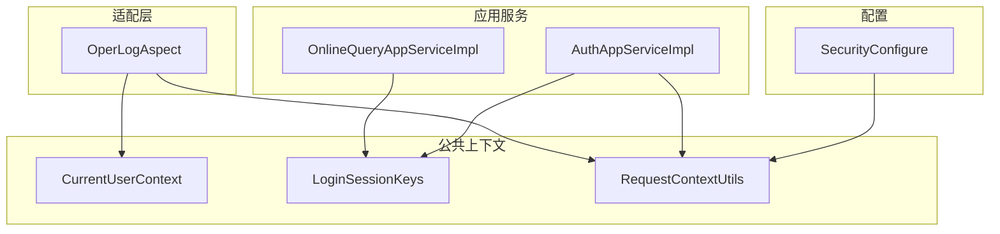
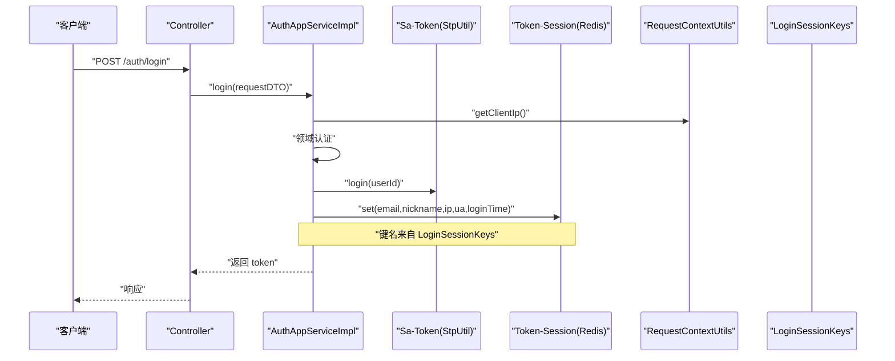
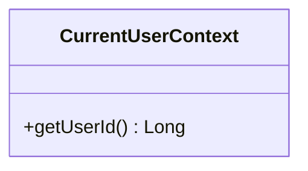
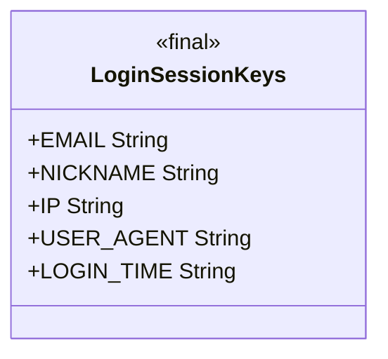
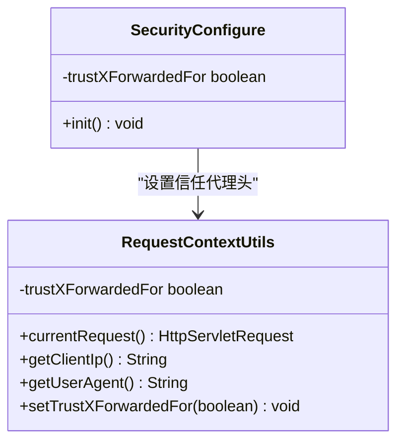
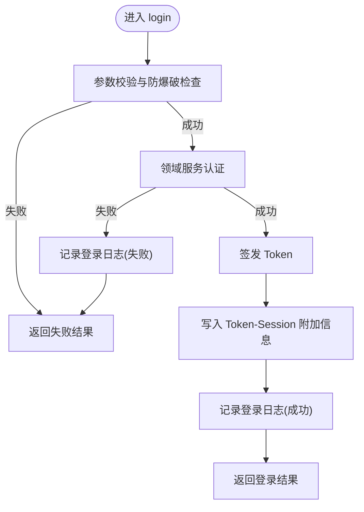
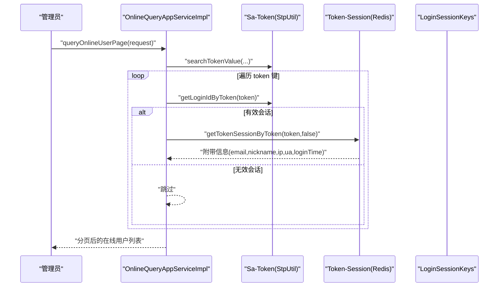
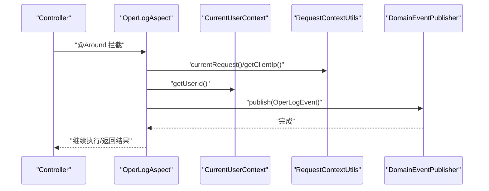
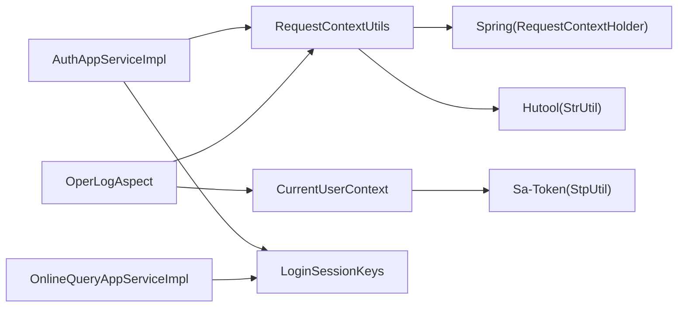

# 上下文管理

<cite>
**本文引用的文件**   
- [CurrentUserContext.java](file://src/main/java/com/sunnao/spring/ddd/template/common/context/CurrentUserContext.java)
- [LoginSessionKeys.java](file://src/main/java/com/sunnao/spring/ddd/template/common/context/LoginSessionKeys.java)
- [RequestContextUtils.java](file://src/main/java/com/sunnao/spring/ddd/template/common/context/RequestContextUtils.java)
- [SecurityConfigure.java](file://src/main/java/com/sunnao/spring/ddd/template/common/config/SecurityConfigure.java)
- [AuthAppServiceImpl.java](file://src/main/java/com/sunnao/spring/ddd/template/application/auth/scenario/AuthAppServiceImpl.java)
- [OnlineQueryAppServiceImpl.java](file://src/main/java/com/sunnao/spring/ddd/template/application/system/online/scenario/OnlineQueryAppServiceImpl.java)
- [OperLogAspect.java](file://src/main/java/com/sunnao/spring/ddd/template/adaptor/common/OperLogAspect.java)
</cite>

## 目录
1. [简介](#简介)
2. [项目结构](#项目结构)
3. [核心组件](#核心组件)
4. [架构总览](#架构总览)
5. [详细组件分析](#详细组件分析)
6. [依赖关系分析](#依赖关系分析)
7. [性能与内存考量](#性能与内存考量)
8. [使用示例](#使用示例)
9. [故障排查指南](#故障排查指南)
10. [结论](#结论)

## 简介
本技术文档聚焦于“上下文管理”子系统，围绕以下目标展开：
- 用户上下文管理（CurrentUserContext）的设计模式与线程安全机制
- 登录会话键值集中化设计（LoginSessionKeys）与常量管理策略
- 请求上下文工具类（RequestContextUtils）的通用操作方法
- 上下文数据的生命周期、内存泄漏防护与性能优化
- 在 Controller/Service/异步任务中的实际使用场景与最佳实践

## 项目结构
上下文相关代码集中在 common.context 包中，并在应用层与安全配置中广泛使用。整体组织方式如下：
- 公共上下文能力：CurrentUserContext、LoginSessionKeys、RequestContextUtils
- 安全配置注入：SecurityConfigure 将是否信任 X-Forwarded-For 头注入到 RequestContextUtils
- 认证流程写入会话附加信息：AuthAppServiceImpl
- 在线用户读取会话附加信息：OnlineQueryAppServiceImpl
- 操作日志采集使用上下文：OperLogAspect

图表来源
- [SecurityConfigure.java:1-29](file://src/main/java/com/sunnao/spring/ddd/template/common/config/SecurityConfigure.java#L1-L29)
- [RequestContextUtils.java:1-84](file://src/main/java/com/sunnao/spring/ddd/template/common/context/RequestContextUtils.java#L1-L84)
- [AuthAppServiceImpl.java:1-196](file://src/main/java/com/sunnao/spring/ddd/template/application/auth/scenario/AuthAppServiceImpl.java#L1-L196)
- [OnlineQueryAppServiceImpl.java:1-107](file://src/main/java/com/sunnao/spring/ddd/template/application/system/online/scenario/OnlineQueryAppServiceImpl.java#L1-L107)
- [OperLogAspect.java:1-131](file://src/main/java/com/sunnao/spring/ddd/template/adaptor/common/OperLogAspect.java#L1-L131)

章节来源
- [SecurityConfigure.java:1-29](file://src/main/java/com/sunnao/spring/ddd/template/common/config/SecurityConfigure.java#L1-L29)
- [RequestContextUtils.java:1-84](file://src/main/java/com/sunnao/spring/ddd/template/common/context/RequestContextUtils.java#L1-L84)
- [AuthAppServiceImpl.java:1-196](file://src/main/java/com/sunnao/spring/ddd/template/application/auth/scenario/AuthAppServiceImpl.java#L1-L196)
- [OnlineQueryAppServiceImpl.java:1-107](file://src/main/java/com/sunnao/spring/ddd/template/application/system/online/scenario/OnlineQueryAppServiceImpl.java#L1-L107)
- [OperLogAspect.java:1-131](file://src/main/java/com/sunnao/spring/ddd/template/adaptor/common/OperLogAspect.java#L1-L131)

## 核心组件
- CurrentUserContext：封装 Sa-Token 登录态读取，提供当前用户ID获取；非 Web 或未登录时返回 null，异常被吞掉以保证调用方无感知。
- LoginSessionKeys：集中定义 Token-Session 附加信息的键名，避免魔法字符串散落各处。
- RequestContextUtils：统一获取 HttpServletRequest、客户端 IP、User-Agent，并支持通过配置决定是否信任 X-Forwarded-For。

章节来源
- [CurrentUserContext.java:1-27](file://src/main/java/com/sunnao/spring/ddd/template/common/context/CurrentUserContext.java#L1-L27)
- [LoginSessionKeys.java:1-36](file://src/main/java/com/sunnao/spring/ddd/template/common/context/LoginSessionKeys.java#L1-L36)
- [RequestContextUtils.java:1-84](file://src/main/java/com/sunnao/spring/ddd/template/common/context/RequestContextUtils.java#L1-L84)

## 架构总览
上下文体系围绕“请求级元数据 + 会话级元数据 + 当前用户标识”三层展开：
- 请求级元数据：由 RequestContextUtils 从 RequestContextHolder 提取，包括 IP、UA、原始请求对象等
- 会话级元数据：由 AuthAppServiceImpl 在登录成功后写入 Token-Session，键名由 LoginSessionKeys 统一管理
- 当前用户标识：由 CurrentUserContext 基于 Sa-Token 获取，供审计、自动填充等场景使用

图表来源
- [AuthAppServiceImpl.java:67-113](file://src/main/java/com/sunnao/spring/ddd/template/application/auth/scenario/AuthAppServiceImpl.java#L67-L113)
- [AuthAppServiceImpl.java:150-161](file://src/main/java/com/sunnao/spring/ddd/template/application/auth/scenario/AuthAppServiceImpl.java#L150-L161)
- [RequestContextUtils.java:52-65](file://src/main/java/com/sunnao/spring/ddd/template/common/context/RequestContextUtils.java#L52-L65)
- [LoginSessionKeys.java:10-33](file://src/main/java/com/sunnao/spring/ddd/template/common/context/LoginSessionKeys.java#L10-L33)

## 详细组件分析

### CurrentUserContext：当前用户上下文
- 设计要点
  - 面向调用方的极简 API：getUserId()
  - 对底层 Sa-Token 的异常进行防御性捕获，确保在非 Web 线程或异常情况下返回 null，不向上抛出
  - 适用于审计、自动填充等需要“当前操作人”的场景
- 线程安全与生命周期
  - 内部仅调用 Sa-Token 提供的静态方法，未持有状态；线程安全性取决于 Sa-Token 的实现
  - 生命周期随请求线程绑定，非 Web 线程无法获取有效值
- 适用场景
  - 应用服务层记录操作人
  - AOP 切面收集审计字段
  - MyBatis-Flex 自动填充更新人等

图表来源
- [CurrentUserContext.java:11-26](file://src/main/java/com/sunnao/spring/ddd/template/common/context/CurrentUserContext.java#L11-L26)

章节来源
- [CurrentUserContext.java:1-27](file://src/main/java/com/sunnao/spring/ddd/template/common/context/CurrentUserContext.java#L1-L27)

### LoginSessionKeys：登录会话键值集中化
- 设计要点
  - 以静态常量集中管理 Token-Session 的键名，避免散落的魔法字符串
  - 键名涵盖邮箱、昵称、IP、User-Agent、登录时间等常用会话元数据
- 使用约定
  - 登录成功后由应用服务写入
  - 在线用户查询模块按相同键名读取展示
- 扩展建议
  - 新增键名需同步更新写入与读取逻辑，保持契约一致

图表来源
- [LoginSessionKeys.java:8-35](file://src/main/java/com/sunnao/spring/ddd/template/common/context/LoginSessionKeys.java#L8-L35)

章节来源
- [LoginSessionKeys.java:1-36](file://src/main/java/com/sunnao/spring/ddd/template/common/context/LoginSessionKeys.java#L1-L36)

### RequestContextUtils：请求上下文工具
- 设计要点
  - 基于 Spring 的 RequestContextHolder 包装，提供 currentRequest()/getClientIp()/getUserAgent()
  - 支持通过配置决定是否信任 X-Forwarded-For 头，默认不信任，防止伪造
  - 非 Web 线程返回 null，调用方需容忍空值
- 配置注入
  - SecurityConfigure 在启动时将 app.security.trust-x-forwarded-for 注入到 RequestContextUtils
- 典型用法
  - 登录日志、操作日志、在线用户会话元数据采集

图表来源
- [RequestContextUtils.java:15-83](file://src/main/java/com/sunnao/spring/ddd/template/common/context/RequestContextUtils.java#L15-L83)
- [SecurityConfigure.java:16-28](file://src/main/java/com/sunnao/spring/ddd/template/common/config/SecurityConfigure.java#L16-L28)

章节来源
- [RequestContextUtils.java:1-84](file://src/main/java/com/sunnao/spring/ddd/template/common/context/RequestContextUtils.java#L1-L84)
- [SecurityConfigure.java:1-29](file://src/main/java/com/sunnao/spring/ddd/template/common/config/SecurityConfigure.java#L1-L29)

### 登录与会话写入流程（AuthAppServiceImpl）
- 关键步骤
  - 参数校验与防爆破检查
  - 领域服务认证
  - 签发 Token 并写入 Token-Session 附加信息（使用 LoginSessionKeys）
  - 发布登录日志事件（异步落库）
- 错误处理
  - 写入会话失败不影响主流程，仅记录日志
  - 发布事件失败不影响主流程，仅记录日志

图表来源
- [AuthAppServiceImpl.java:67-113](file://src/main/java/com/sunnao/spring/ddd/template/application/auth/scenario/AuthAppServiceImpl.java#L67-L113)
- [AuthAppServiceImpl.java:150-161](file://src/main/java/com/sunnao/spring/ddd/template/application/auth/scenario/AuthAppServiceImpl.java#L150-L161)

章节来源
- [AuthAppServiceImpl.java:1-196](file://src/main/java/com/sunnao/spring/ddd/template/application/auth/scenario/AuthAppServiceImpl.java#L1-L196)

### 在线用户查询（OnlineQueryAppServiceImpl）
- 数据来源
  - 直接扫描 Sa-Token Redis 中的 token 键，过滤无效会话后构建在线用户列表
- 会话信息读取
  - 按 LoginSessionKeys 定义的键名从 Token-Session 读取邮箱、昵称、IP、UA、登录时间等
- 分页策略
  - 全量过滤后在内存中进行分页，适合中小规模会话量

图表来源
- [OnlineQueryAppServiceImpl.java:33-69](file://src/main/java/com/sunnao/spring/ddd/template/application/system/online/scenario/OnlineQueryAppServiceImpl.java#L33-L69)
- [OnlineQueryAppServiceImpl.java:83-105](file://src/main/java/com/sunnao/spring/ddd/template/application/system/online/scenario/OnlineQueryAppServiceImpl.java#L83-L105)
- [LoginSessionKeys.java:10-33](file://src/main/java/com/sunnao/spring/ddd/template/common/context/LoginSessionKeys.java#L10-L33)

章节来源
- [OnlineQueryAppServiceImpl.java:1-107](file://src/main/java/com/sunnao/spring/ddd/template/application/system/online/scenario/OnlineQueryAppServiceImpl.java#L1-L107)

### 操作日志采集（OperLogAspect）
- 采集内容
  - traceId、操作人（CurrentUserContext.getUserId()）、URI、参数摘要、结果码、耗时、IP
- 发布策略
  - 通过 DomainEventPublisher 发布 OperLogEvent，由监听器异步落库
  - 采集/发布失败不影响业务主流程

图表来源
- [OperLogAspect.java:51-99](file://src/main/java/com/sunnao/spring/ddd/template/adaptor/common/OperLogAspect.java#L51-L99)
- [CurrentUserContext.java:18-25](file://src/main/java/com/sunnao/spring/ddd/template/common/context/CurrentUserContext.java#L18-L25)
- [RequestContextUtils.java:40-65](file://src/main/java/com/sunnao/spring/ddd/template/common/context/RequestContextUtils.java#L40-L65)

章节来源
- [OperLogAspect.java:1-131](file://src/main/java/com/sunnao/spring/ddd/template/adaptor/common/OperLogAspect.java#L1-L131)

## 依赖关系分析
- 组件耦合
  - CurrentUserContext 依赖 Sa-Token 的 StpUtil
  - RequestContextUtils 依赖 Spring 的 RequestContextHolder 与 Hutool 的 StrUtil
  - LoginSessionKeys 为纯常量，零运行时依赖
- 外部集成点
  - Sa-Token：会话管理与 Token-Session 读写
  - Spring Web：请求上下文绑定
  - Hutool：字符串工具辅助
- 潜在循环依赖
  - 当前实现均为工具类/配置类，无循环依赖风险

图表来源
- [CurrentUserContext.java:1-27](file://src/main/java/com/sunnao/spring/ddd/template/common/context/CurrentUserContext.java#L1-L27)
- [RequestContextUtils.java:1-84](file://src/main/java/com/sunnao/spring/ddd/template/common/context/RequestContextUtils.java#L1-L84)
- [AuthAppServiceImpl.java:1-196](file://src/main/java/com/sunnao/spring/ddd/template/application/auth/scenario/AuthAppServiceImpl.java#L1-L196)
- [OnlineQueryAppServiceImpl.java:1-107](file://src/main/java/com/sunnao/spring/ddd/template/application/system/online/scenario/OnlineQueryAppServiceImpl.java#L1-L107)
- [OperLogAspect.java:1-131](file://src/main/java/com/sunnao/spring/ddd/template/adaptor/common/OperLogAspect.java#L1-L131)

章节来源
- [CurrentUserContext.java:1-27](file://src/main/java/com/sunnao/spring/ddd/template/common/context/CurrentUserContext.java#L1-L27)
- [RequestContextUtils.java:1-84](file://src/main/java/com/sunnao/spring/ddd/template/common/context/RequestContextUtils.java#L1-L84)
- [AuthAppServiceImpl.java:1-196](file://src/main/java/com/sunnao/spring/ddd/template/application/auth/scenario/AuthAppServiceImpl.java#L1-L196)
- [OnlineQueryAppServiceImpl.java:1-107](file://src/main/java/com/sunnao/spring/ddd/template/application/system/online/scenario/OnlineQueryAppServiceImpl.java#L1-L107)
- [OperLogAspect.java:1-131](file://src/main/java/com/sunnao/spring/ddd/template/adaptor/common/OperLogAspect.java#L1-L131)

## 性能与内存考量
- 请求上下文
  - RequestContextUtils 仅在 Web 线程可用，非 Web 线程返回 null，避免不必要的开销
  - User-Agent 超长截断，防止数据库列溢出与存储膨胀
- 会话附加信息
  - 登录成功后一次性写入少量键值，读取时按需获取，避免冗余传输
  - 在线用户查询采用全量扫描+内存分页，适合中小规模会话量；大规模场景应考虑服务端分页或索引优化
- 线程安全
  - CurrentUserContext 与 RequestContextUtils 均无共享可变状态，线程安全由底层框架保证
- 内存泄漏防护
  - 上下文数据来源于 Sa-Token 与 Spring 容器，生命周期由框架管理；应用侧无需手动清理
  - 注意不要在自定义线程池中传递 ServletRequest 引用，避免长生命周期线程持有短生命周期请求对象

[本节为通用指导，不涉及具体文件分析]

## 使用示例

### 在 Controller 层设置上下文
- 说明
  - 本项目通过 Sa-Token 在认证阶段建立会话，Controller 层无需显式设置上下文
  - 若需要在特定入口初始化额外上下文，建议在过滤器或拦截器中完成，并确保在请求结束时清理
- 参考路径
  - [AuthAppServiceImpl.java:96-101](file://src/main/java/com/sunnao/spring/ddd/template/application/auth/scenario/AuthAppServiceImpl.java#L96-L101)

章节来源
- [AuthAppServiceImpl.java:96-101](file://src/main/java/com/sunnao/spring/ddd/template/application/auth/scenario/AuthAppServiceImpl.java#L96-L101)

### 在 Service 层获取用户信息
- 说明
  - 在应用服务中使用 CurrentUserContext.getUserId() 获取当前操作人，用于审计与自动填充
- 参考路径
  - [OperLogAspect.java:89-92](file://src/main/java/com/sunnao/spring/ddd/template/adaptor/common/OperLogAspect.java#L89-L92)

章节来源
- [OperLogAspect.java:89-92](file://src/main/java/com/sunnao/spring/ddd/template/adaptor/common/OperLogAspect.java#L89-L92)

### 在异步任务中传递上下文
- 说明
  - CurrentUserContext 与 RequestContextUtils 在非 Web 线程返回 null
  - 若需在异步任务中携带上下文，应在提交任务前显式捕获并传入任务参数，或在任务内重新解析（如通过 Token 重建会话）
- 参考路径
  - [CurrentUserContext.java:18-25](file://src/main/java/com/sunnao/spring/ddd/template/common/context/CurrentUserContext.java#L18-L25)
  - [RequestContextUtils.java:40-45](file://src/main/java/com/sunnao/spring/ddd/template/common/context/RequestContextUtils.java#L40-L45)

章节来源
- [CurrentUserContext.java:18-25](file://src/main/java/com/sunnao/spring/ddd/template/common/context/CurrentUserContext.java#L18-L25)
- [RequestContextUtils.java:40-45](file://src/main/java/com/sunnao/spring/ddd/template/common/context/RequestContextUtils.java#L40-L45)

### 登录成功后写入会话附加信息
- 说明
  - 使用 LoginSessionKeys 定义的键名，将邮箱、昵称、IP、UA、登录时间写入 Token-Session
- 参考路径
  - [AuthAppServiceImpl.java:150-161](file://src/main/java/com/sunnao/spring/ddd/template/application/auth/scenario/AuthAppServiceImpl.java#L150-L161)
  - [LoginSessionKeys.java:10-33](file://src/main/java/com/sunnao/spring/ddd/template/common/context/LoginSessionKeys.java#L10-L33)

章节来源
- [AuthAppServiceImpl.java:150-161](file://src/main/java/com/sunnao/spring/ddd/template/application/auth/scenario/AuthAppServiceImpl.java#L150-L161)
- [LoginSessionKeys.java:10-33](file://src/main/java/com/sunnao/spring/ddd/template/common/context/LoginSessionKeys.java#L10-L33)

### 在线用户查询读取会话附加信息
- 说明
  - 根据 LoginSessionKeys 的键名从 Token-Session 读取并组装 DTO
- 参考路径
  - [OnlineQueryAppServiceImpl.java:93-103](file://src/main/java/com/sunnao/spring/ddd/template/application/system/online/scenario/OnlineQueryAppServiceImpl.java#L93-L103)

章节来源
- [OnlineQueryAppServiceImpl.java:93-103](file://src/main/java/com/sunnao/spring/ddd/template/application/system/online/scenario/OnlineQueryAppServiceImpl.java#L93-L103)

## 故障排查指南
- 常见问题
  - 非 Web 线程获取不到用户或请求信息：这是预期行为，应改为显式传参或基于 Token 重建上下文
  - 客户端 IP 不正确：检查是否启用了信任 X-Forwarded-For，且前置代理可信
  - 在线用户列表为空或延迟：确认 Sa-Token 会话存储（Redis）连通性与过期策略
- 定位手段
  - 查看登录与会话写入日志，确认 fillTokenSession 是否成功
  - 检查 SecurityConfigure 的配置项 app.security.trust-x-forwarded-for
- 参考路径
  - [SecurityConfigure.java:24-27](file://src/main/java/com/sunnao/spring/ddd/template/common/config/SecurityConfigure.java#L24-L27)
  - [AuthAppServiceImpl.java:158-160](file://src/main/java/com/sunnao/spring/ddd/template/application/auth/scenario/AuthAppServiceImpl.java#L158-L160)

章节来源
- [SecurityConfigure.java:24-27](file://src/main/java/com/sunnao/spring/ddd/template/common/config/SecurityConfigure.java#L24-L27)
- [AuthAppServiceImpl.java:158-160](file://src/main/java/com/sunnao/spring/ddd/template/application/auth/scenario/AuthAppServiceImpl.java#L158-L160)

## 结论
- 上下文管理以“最小 API、最大容错”为原则，Current 用户与请求元数据在各层清晰解耦
- 登录会话键值集中化管理提升了可维护性与一致性
- 通过配置控制 IP 解析策略，兼顾安全与部署灵活性
- 在异步场景中需显式传递上下文，避免隐式依赖导致的数据丢失
- 遵循上述最佳实践可有效降低内存泄漏风险，提升系统稳定性与可观测性