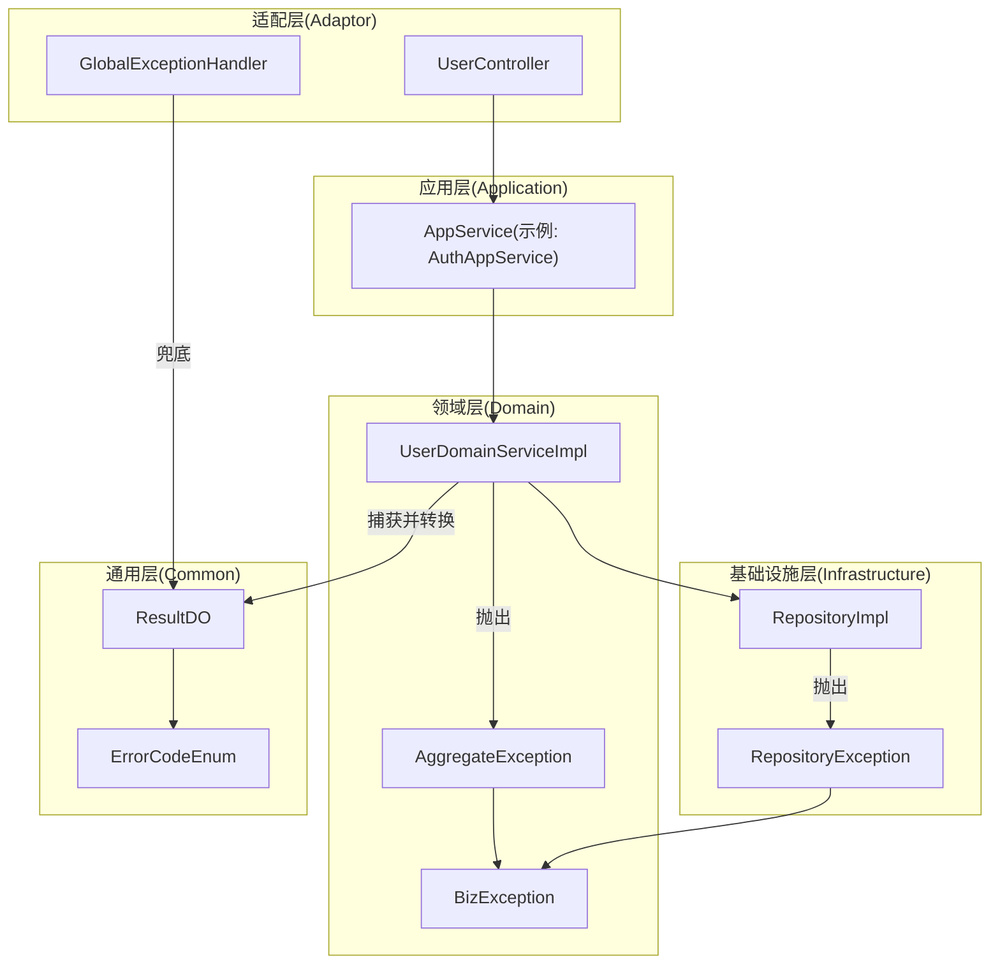
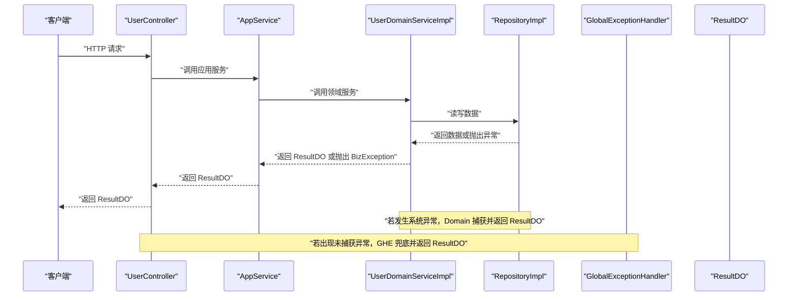
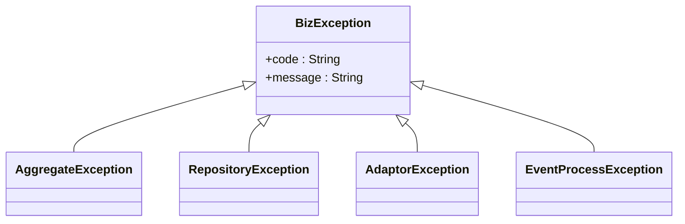
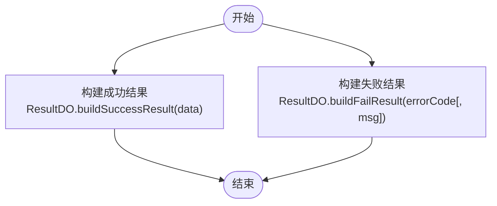
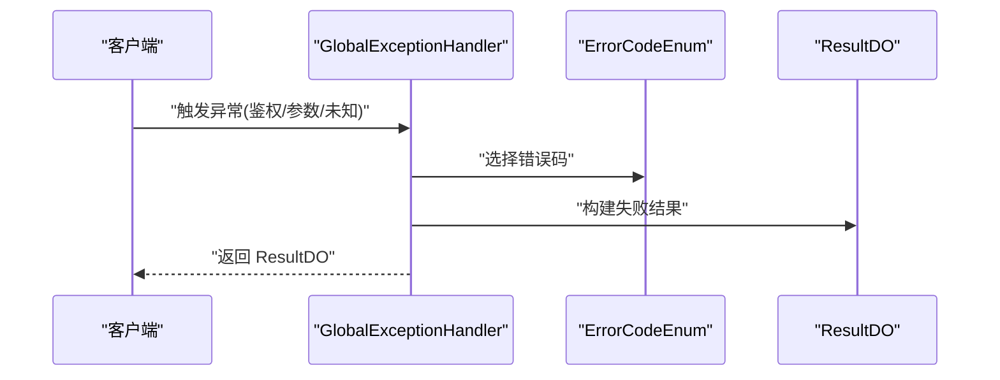
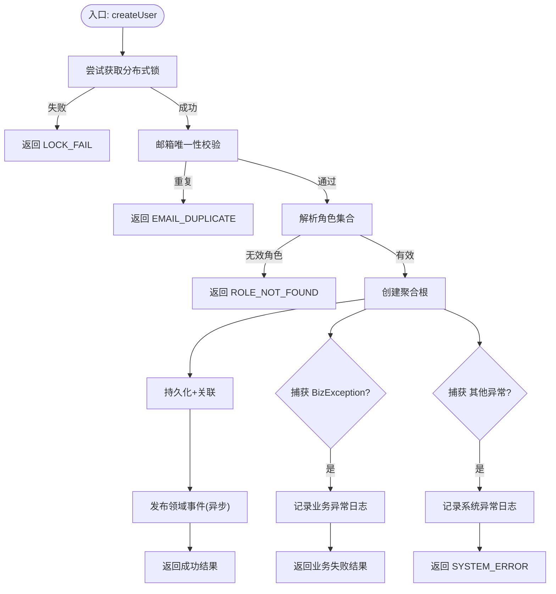
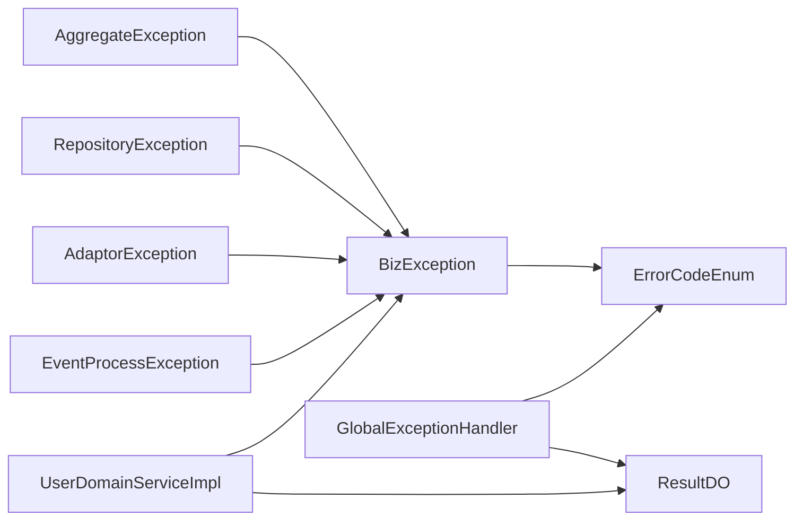

# 全局异常处理

<cite>
**本文引用的文件列表**
- [BizException.java](file://src/main/java/com/sunnao/spring/ddd/template/common/exception/BizException.java)
- [AdaptorException.java](file://src/main/java/com/sunnao/spring/ddd/template/common/exception/AdaptorException.java)
- [AggregateException.java](file://src/main/java/com/sunnao/spring/ddd/template/common/exception/AggregateException.java)
- [RepositoryException.java](file://src/main/java/com/sunnao/spring/ddd/template/common/exception/RepositoryException.java)
- [EventProcessException.java](file://src/main/java/com/sunnao/spring/ddd/template/common/exception/EventProcessException.java)
- [GlobalExceptionHandler.java](file://src/main/java/com/sunnao/spring/ddd/template/adaptor/common/GlobalExceptionHandler.java)
- [ErrorCodeEnum.java](file://src/main/java/com/sunnao/spring/ddd/template/common/result/ErrorCodeEnum.java)
- [ResultDO.java](file://src/main/java/com/sunnao/spring/ddd/template/common/result/ResultDO.java)
- [UserDomainServiceImpl.java](file://src/main/java/com/sunnao/spring/ddd/template/domain/system/user/service/UserDomainServiceImpl.java)
- [UserController.java](file://src/main/java/com/sunnao/spring/ddd/template/adaptor/system/user/input/UserController.java)
</cite>

## 目录
1. [引言](#引言)
2. [项目结构](#项目结构)
3. [核心组件](#核心组件)
4. [架构总览](#架构总览)
5. [详细组件分析](#详细组件分析)
6. [依赖关系分析](#依赖关系分析)
7. [性能考虑](#性能考虑)
8. [故障排查指南](#故障排查指南)
9. [结论](#结论)
10. [附录](#附录)

## 引言
本文件围绕全局异常处理体系，系统性阐述异常分类、统一错误响应格式与错误码管理策略、全局异常处理器的工作机制与日志策略，并提供自定义异常开发规范、最佳实践、性能建议以及前后端对接与用户体验优化策略。目标是帮助开发者在 DDD 分层架构下，构建稳定、可观测、易维护的错误处理方案。

## 项目结构
本项目采用 DDD 分层设计，异常与结果封装集中在 common 层，控制器位于 adaptor 层，领域服务位于 domain 层，基础设施实现位于 infrastructure 层。全局异常处理器作为最后防线，兜住鉴权、参数解析等前置异常与未捕获的系统异常，统一转换为标准响应体。

图表来源
- [GlobalExceptionHandler.java:1-98](file://src/main/java/com/sunnao/spring/ddd/template/adaptor/common/GlobalExceptionHandler.java#L1-L98)
- [UserDomainServiceImpl.java:1-204](file://src/main/java/com/sunnao/spring/ddd/template/domain/system/user/service/UserDomainServiceImpl.java#L1-L204)
- [ErrorCodeEnum.java:1-209](file://src/main/java/com/sunnao/spring/ddd/template/common/result/ErrorCodeEnum.java#L1-L209)
- [ResultDO.java:1-110](file://src/main/java/com/sunnao/spring/ddd/template/common/result/ResultDO.java#L1-L110)

章节来源
- [GlobalExceptionHandler.java:1-98](file://src/main/java/com/sunnao/spring/ddd/template/adaptor/common/GlobalExceptionHandler.java#L1-L98)
- [UserDomainServiceImpl.java:1-204](file://src/main/java/com/sunnao/spring/ddd/template/domain/system/user/service/UserDomainServiceImpl.java#L1-L204)
- [ErrorCodeEnum.java:1-209](file://src/main/java/com/sunnao/spring/ddd/template/common/result/ErrorCodeEnum.java#L1-L209)
- [ResultDO.java:1-110](file://src/main/java/com/sunnao/spring/ddd/template/common/result/ResultDO.java#L1-L110)

## 核心组件
本节聚焦异常类型体系、统一结果对象与错误码枚举的设计与职责边界。

- 业务异常基类 BizException
  - 承载 code 与 msg，支持通过 ErrorCodeEnum 构造，便于统一错误码管理。
  - 适用于各层显式抛出的“可预期业务失败”。

- 领域聚合异常 AggregateException
  - 继承 BizException，用于聚合根或领域服务校验失败场景。
  - 典型使用：状态机流转冲突、不变量破坏等。

- 仓储层异常 RepositoryException
  - 继承 BizException，用于持久化访问失败（如数据库约束冲突、连接异常）的语义化表达。
  - 由上层捕获并转换为 ResultDO 或继续包装为更高层异常。

- 适配层异常 AdaptorException
  - 继承 BizException，用于 HTTP 入参校验、外部调用适配失败等适配层问题。

- 事件处理异常 EventProcessException
  - 继承 BizException，用于异步事件处理过程中的业务失败。

- 统一结果对象 ResultDO
  - 提供 success/code/msg/data 字段，提供便捷工厂方法构建成功/失败结果。
  - 各层方法统一返回 ResultDO，避免向上层直接抛异常。

- 错误码枚举 ErrorCodeEnum
  - 集中定义所有错误码及默认文案，禁止散落字符串字面量。
  - 覆盖通用、认证、用户、角色权限、字典、文件等域。

章节来源
- [BizException.java:1-28](file://src/main/java/com/sunnao/spring/ddd/template/common/exception/BizException.java#L1-L28)
- [AggregateException.java:1-22](file://src/main/java/com/sunnao/spring/ddd/template/common/exception/AggregateException.java#L1-L22)
- [RepositoryException.java:1-22](file://src/main/java/com/sunnao/spring/ddd/template/common/exception/RepositoryException.java#L1-L22)
- [AdaptorException.java:1-22](file://src/main/java/com/sunnao/spring/ddd/template/common/exception/AdaptorException.java#L1-L22)
- [EventProcessException.java:1-22](file://src/main/java/com/sunnao/spring/ddd/template/common/exception/EventProcessException.java#L1-L22)
- [ResultDO.java:1-110](file://src/main/java/com/sunnao/spring/ddd/template/common/result/ResultDO.java#L1-L110)
- [ErrorCodeEnum.java:1-209](file://src/main/java/com/sunnao/spring/ddd/template/common/result/ErrorCodeEnum.java#L1-L209)

## 架构总览
下图展示从请求进入 Controller 到最终返回 ResultDO 的完整路径，包括正常流程与异常兜底路径。

图表来源
- [UserController.java:1-115](file://src/main/java/com/sunnao/spring/ddd/template/adaptor/system/user/input/UserController.java#L1-L115)
- [UserDomainServiceImpl.java:1-204](file://src/main/java/com/sunnao/spring/ddd/template/domain/system/user/service/UserDomainServiceImpl.java#L1-L204)
- [GlobalExceptionHandler.java:1-98](file://src/main/java/com/sunnao/spring/ddd/template/adaptor/common/GlobalExceptionHandler.java#L1-L98)
- [ResultDO.java:1-110](file://src/main/java/com/sunnao/spring/ddd/template/common/result/ResultDO.java#L1-L110)

## 详细组件分析

### 异常分类体系与适用场景
- 业务异常 BizException
  - 定位：跨层通用的业务失败表达。
  - 适用：任何层需要以“业务语义”表达失败时，优先使用 BizException 或其子类。
  - 构造：支持传入 ErrorCodeEnum 与自定义消息，便于统一错误码与提示。

- 聚合层异常 AggregateException
  - 定位：领域聚合根或领域服务校验失败。
  - 适用：不变量破坏、状态机非法流转、业务规则不满足等。
  - 处理：领域服务捕获后转换为 ResultDO，避免将领域细节泄漏到外层。

- 仓储层异常 RepositoryException
  - 定位：持久化访问失败（如唯一性约束冲突、SQL 执行异常）。
  - 适用：基础设施层抛出，由领域或服务层捕获并转换为 ResultDO。

- 适配层异常 AdaptorException
  - 定位：HTTP 入参校验、外部接口适配失败。
  - 适用：Controller 或适配器层对输入进行校验失败时抛出。

- 事件处理异常 EventProcessException
  - 定位：异步事件处理失败。
  - 适用：事件监听器中业务失败，需记录上下文以便重试或告警。

图表来源
- [BizException.java:1-28](file://src/main/java/com/sunnao/spring/ddd/template/common/exception/BizException.java#L1-L28)
- [AggregateException.java:1-22](file://src/main/java/com/sunnao/spring/ddd/template/common/exception/AggregateException.java#L1-L22)
- [RepositoryException.java:1-22](file://src/main/java/com/sunnao/spring/ddd/template/common/exception/RepositoryException.java#L1-L22)
- [AdaptorException.java:1-22](file://src/main/java/com/sunnao/spring/ddd/template/common/exception/AdaptorException.java#L1-L22)
- [EventProcessException.java:1-22](file://src/main/java/com/sunnao/spring/ddd/template/common/exception/EventProcessException.java#L1-L22)

章节来源
- [BizException.java:1-28](file://src/main/java/com/sunnao/spring/ddd/template/common/exception/BizException.java#L1-L28)
- [AggregateException.java:1-22](file://src/main/java/com/sunnao/spring/ddd/template/common/exception/AggregateException.java#L1-L22)
- [RepositoryException.java:1-22](file://src/main/java/com/sunnao/spring/ddd/template/common/exception/RepositoryException.java#L1-L22)
- [AdaptorException.java:1-22](file://src/main/java/com/sunnao/spring/ddd/template/common/exception/AdaptorException.java#L1-L22)
- [EventProcessException.java:1-22](file://src/main/java/com/sunnao/spring/ddd/template/common/exception/EventProcessException.java#L1-L22)

### 统一错误响应格式 ResultDO 与错误码管理 ErrorCodeEnum
- ResultDO 设计要点
  - 字段：success、code、msg、data。
  - 工厂方法：buildSuccessResult(data)、buildFailResult(errorCode)、buildFailResult(errorCode, msg)。
  - 原则：各层方法统一返回 ResultDO，避免向调用方直接抛出异常。

- ErrorCodeEnum 管理策略
  - 集中收敛：所有错误码定义于单一枚举，禁止散落字符串字面量。
  - 默认文案：每个错误码附带默认提示，可在调用处覆写更具体的文案。
  - 分类组织：按通用、认证、用户、角色权限、字典、文件等模块分组，便于扩展与维护。

图表来源
- [ResultDO.java:1-110](file://src/main/java/com/sunnao/spring/ddd/template/common/result/ResultDO.java#L1-L110)
- [ErrorCodeEnum.java:1-209](file://src/main/java/com/sunnao/spring/ddd/template/common/result/ErrorCodeEnum.java#L1-L209)

章节来源
- [ResultDO.java:1-110](file://src/main/java/com/sunnao/spring/ddd/template/common/result/ResultDO.java#L1-L110)
- [ErrorCodeEnum.java:1-209](file://src/main/java/com/sunnao/spring/ddd/template/common/result/ErrorCodeEnum.java#L1-L209)

### 全局异常处理器 GlobalExceptionHandler
- 职责边界
  - 兜住进入 Controller 之前（如 Sa-Token 鉴权、参数反序列化）以及漏网的未捕获异常。
  - 统一转换为 ResultDO，不向客户端外泄堆栈。

- 异常捕获与映射
  - 未登录：NotLoginException → 401 + NOT_LOGIN
  - 角色不满足：NotRoleException → 403 + NO_PERMISSION
  - 权限不满足：NotPermissionException → 403 + NO_PERMISSION
  - 请求体不可读：HttpMessageNotReadableException → 400 + BAD_REQUEST
  - 参数类型不匹配：MethodArgumentTypeMismatchException → 400 + BAD_REQUEST
  - 资源不存在：NoResourceFoundException → 404 + NOT_FOUND
  - 兜底异常：Exception → 500 + SYSTEM_ERROR

- 日志记录策略
  - 鉴权相关使用 warn 级别，包含关键上下文（如 role、permission）。
  - 参数解析失败使用 warn，附带 name/value 等上下文。
  - 兜底异常使用 error，打印完整堆栈，便于生产排障。

图表来源
- [GlobalExceptionHandler.java:1-98](file://src/main/java/com/sunnao/spring/ddd/template/adaptor/common/GlobalExceptionHandler.java#L1-L98)
- [ErrorCodeEnum.java:1-209](file://src/main/java/com/sunnao/spring/ddd/template/common/result/ErrorCodeEnum.java#L1-L209)
- [ResultDO.java:1-110](file://src/main/java/com/sunnao/spring/ddd/template/common/result/ResultDO.java#L1-L110)

章节来源
- [GlobalExceptionHandler.java:1-98](file://src/main/java/com/sunnao/spring/ddd/template/adaptor/common/GlobalExceptionHandler.java#L1-L98)

### 领域层异常处理示例：UserDomainServiceImpl
- 锁获取失败：返回 LOCK_FAIL
- 业务校验失败：返回对应 ErrorCodeEnum（如 EMAIL_DUPLICATE、USER_NOT_FOUND）
- 业务异常捕获：捕获 BizException，记录错误日志并返回 ResultDO
- 系统异常捕获：捕获 Exception，记录错误日志并返回 SYSTEM_ERROR
- 释放锁：finally 确保锁释放

图表来源
- [UserDomainServiceImpl.java:1-204](file://src/main/java/com/sunnao/spring/ddd/template/domain/system/user/service/UserDomainServiceImpl.java#L1-L204)
- [ErrorCodeEnum.java:1-209](file://src/main/java/com/sunnao/spring/ddd/template/common/result/ErrorCodeEnum.java#L1-L209)
- [ResultDO.java:1-110](file://src/main/java/com/sunnao/spring/ddd/template/common/result/ResultDO.java#L1-L110)

章节来源
- [UserDomainServiceImpl.java:1-204](file://src/main/java/com/sunnao/spring/ddd/template/domain/system/user/service/UserDomainServiceImpl.java#L1-L204)

### 自定义异常开发指南与错误码规范
- 新增异常类型步骤
  - 在 common/exception 包下新增异常类，继承 BizException。
  - 提供多构造函数：支持 (code, msg)、(code, msg, cause)、(errorCode, msg)、(errorCode, msg, cause)。
  - 在相应层捕获底层异常并包装为新异常或直接返回 ResultDO。

- 新增错误码步骤
  - 在 ErrorCodeEnum 中新增条目，给出 code 与 defaultMsg。
  - 在各层引用该枚举，禁止使用字符串字面量。

- 使用示例（路径指引）
  - 领域层捕获并转换：[UserDomainServiceImpl.java:80-89](file://src/main/java/com/sunnao/spring/ddd/template/domain/system/user/service/UserDomainServiceImpl.java#L80-L89)
  - 全局异常兜底：[GlobalExceptionHandler.java:91-96](file://src/main/java/com/sunnao/spring/ddd/template/adaptor/common/GlobalExceptionHandler.java#L91-L96)

章节来源
- [BizException.java:1-28](file://src/main/java/com/sunnao/spring/ddd/template/common/exception/BizException.java#L1-L28)
- [ErrorCodeEnum.java:1-209](file://src/main/java/com/sunnao/spring/ddd/template/common/result/ErrorCodeEnum.java#L1-L209)
- [UserDomainServiceImpl.java:80-89](file://src/main/java/com/sunnao/spring/ddd/template/domain/system/user/service/UserDomainServiceImpl.java#L80-L89)
- [GlobalExceptionHandler.java:91-96](file://src/main/java/com/sunnao/spring/ddd/template/adaptor/common/GlobalExceptionHandler.java#L91-L96)

### 最佳实践
- 分层职责清晰
  - 领域层：仅表达业务失败，捕获并转换为 ResultDO，不向外抛异常。
  - 适配层：负责入参校验与外部适配，失败抛出 AdaptorException 或返回 ResultDO。
  - 全局异常：兜底未捕获异常，保证对外一致性。

- 错误码治理
  - 集中管理、分类组织、默认文案明确。
  - 禁止散落字符串，避免前端硬编码。

- 日志与可观测性
  - 区分 warn/error 级别，保留必要上下文（如用户ID、操作对象、参数名值）。
  - 生产环境不输出敏感信息，但保留足够线索用于排障。

- 幂等与并发
  - 使用分布式锁保护关键写操作，失败快速返回 LOCK_FAIL。
  - 事件处理失败不影响主流程，必要时引入重试与死信队列。

### 性能考虑
- 异常路径开销
  - 尽量避免在热路径频繁抛异常；能返回 ResultDO 的场景优先返回。
  - 全局异常处理器仅在异常发生时工作，影响可控。

- 日志成本
  - 控制 warn/error 日志粒度，避免高频大对象序列化。
  - 对高并发接口，谨慎打印完整堆栈，必要时采样。

- 锁与事务
  - 锁获取失败快速返回，减少后续计算。
  - 事务内只做必要操作，降低锁持有时间。

### 故障排查指南
- 常见问题定位
  - 未登录/无权限：检查 Sa-Token 配置与权限点，查看 GHE 的 warn 日志。
  - 参数解析失败：核对 JSON 结构与类型，查看 GHE 的 BAD_REQUEST 日志。
  - 业务失败：定位领域服务中的 BizException 捕获分支与错误码。
  - 系统异常：查看 GHE 的 error 日志与堆栈，结合链路追踪定位。

- 调试建议
  - 开启调试日志级别，关注关键上下文字段。
  - 结合 TraceIdFilter 与日志框架，串联一次请求的全链路日志。
  - 生产环境使用结构化日志与指标埋点，辅助快速定位。

章节来源
- [GlobalExceptionHandler.java:1-98](file://src/main/java/com/sunnao/spring/ddd/template/adaptor/common/GlobalExceptionHandler.java#L1-L98)
- [UserDomainServiceImpl.java:1-204](file://src/main/java/com/sunnao/spring/ddd/template/domain/system/user/service/UserDomainServiceImpl.java#L1-L204)

### 与前端错误处理的对接与体验优化
- 统一响应体
  - 前端根据 ResultDO.success 判断成功与否，再读取 code/msg/data。
  - 对于鉴权失败（NOT_LOGIN），前端引导重新登录；对于权限不足（NO_PERMISSION），提示无权限。

- 友好提示
  - 后端提供默认文案，前端可按需覆盖显示文案，提升本地化体验。
  - 对常见错误（如参数错误、资源不存在）提供明确的下一步操作建议。

- 错误上报
  - 前端收集非致命错误（如网络超时、业务失败）上报监控平台，结合后端日志进行关联分析。

[本节为概念性内容，无需列出具体文件来源]

## 依赖关系分析
- 组件耦合
  - 异常类均依赖 ErrorCodeEnum，形成低耦合的统一错误码契约。
  - GlobalExceptionHandler 依赖 Spring Web 异常类型与 Sa-Token 异常类型，完成前置拦截与兜底。
  - 领域服务依赖 ResultDO 与 ErrorCodeEnum，屏蔽底层异常细节。

图表来源
- [BizException.java:1-28](file://src/main/java/com/sunnao/spring/ddd/template/common/exception/BizException.java#L1-L28)
- [AggregateException.java:1-22](file://src/main/java/com/sunnao/spring/ddd/template/common/exception/AggregateException.java#L1-L22)
- [RepositoryException.java:1-22](file://src/main/java/com/sunnao/spring/ddd/template/common/exception/RepositoryException.java#L1-L22)
- [AdaptorException.java:1-22](file://src/main/java/com/sunnao/spring/ddd/template/common/exception/AdaptorException.java#L1-L22)
- [EventProcessException.java:1-22](file://src/main/java/com/sunnao/spring/ddd/template/common/exception/EventProcessException.java#L1-L22)
- [GlobalExceptionHandler.java:1-98](file://src/main/java/com/sunnao/spring/ddd/template/adaptor/common/GlobalExceptionHandler.java#L1-L98)
- [UserDomainServiceImpl.java:1-204](file://src/main/java/com/sunnao/spring/ddd/template/domain/system/user/service/UserDomainServiceImpl.java#L1-L204)
- [ErrorCodeEnum.java:1-209](file://src/main/java/com/sunnao/spring/ddd/template/common/result/ErrorCodeEnum.java#L1-L209)
- [ResultDO.java:1-110](file://src/main/java/com/sunnao/spring/ddd/template/common/result/ResultDO.java#L1-L110)

章节来源
- [GlobalExceptionHandler.java:1-98](file://src/main/java/com/sunnao/spring/ddd/template/adaptor/common/GlobalExceptionHandler.java#L1-L98)
- [UserDomainServiceImpl.java:1-204](file://src/main/java/com/sunnao/spring/ddd/template/domain/system/user/service/UserDomainServiceImpl.java#L1-L204)
- [ErrorCodeEnum.java:1-209](file://src/main/java/com/sunnao/spring/ddd/template/common/result/ErrorCodeEnum.java#L1-L209)
- [ResultDO.java:1-110](file://src/main/java/com/sunnao/spring/ddd/template/common/result/ResultDO.java#L1-L110)

## 性能考虑
- 异常路径尽量短路，避免在异常分支中进行昂贵计算。
- 日志级别与内容需权衡可观测性与吞吐，生产环境避免全量堆栈。
- 分布式锁与事务范围最小化，减少锁竞争与长事务带来的延迟。

[本节为通用指导，无需列出具体文件来源]

## 结论
通过统一的异常分类体系、集中化的错误码管理与标准化的结果对象，配合全局异常处理器的兜底能力，系统在可观测性、一致性与可维护性方面得到显著提升。遵循本文的最佳实践与规范，可有效降低线上故障率并改善用户体验。

[本节为总结性内容，无需列出具体文件来源]

## 附录
- 参考实现路径
  - 领域层异常捕获与转换：[UserDomainServiceImpl.java:80-89](file://src/main/java/com/sunnao/spring/ddd/template/domain/system/user/service/UserDomainServiceImpl.java#L80-L89)
  - 全局异常兜底处理：[GlobalExceptionHandler.java:91-96](file://src/main/java/com/sunnao/spring/ddd/template/adaptor/common/GlobalExceptionHandler.java#L91-L96)
  - 统一结果对象工厂方法：[ResultDO.java:52-108](file://src/main/java/com/sunnao/spring/ddd/template/common/result/ResultDO.java#L52-L108)
  - 错误码枚举定义：[ErrorCodeEnum.java:12-192](file://src/main/java/com/sunnao/spring/ddd/template/common/result/ErrorCodeEnum.java#L12-L192)

章节来源
- [UserDomainServiceImpl.java:80-89](file://src/main/java/com/sunnao/spring/ddd/template/domain/system/user/service/UserDomainServiceImpl.java#L80-L89)
- [GlobalExceptionHandler.java:91-96](file://src/main/java/com/sunnao/spring/ddd/template/adaptor/common/GlobalExceptionHandler.java#L91-L96)
- [ResultDO.java:52-108](file://src/main/java/com/sunnao/spring/ddd/template/common/result/ResultDO.java#L52-L108)
- [ErrorCodeEnum.java:12-192](file://src/main/java/com/sunnao/spring/ddd/template/common/result/ErrorCodeEnum.java#L12-L192)