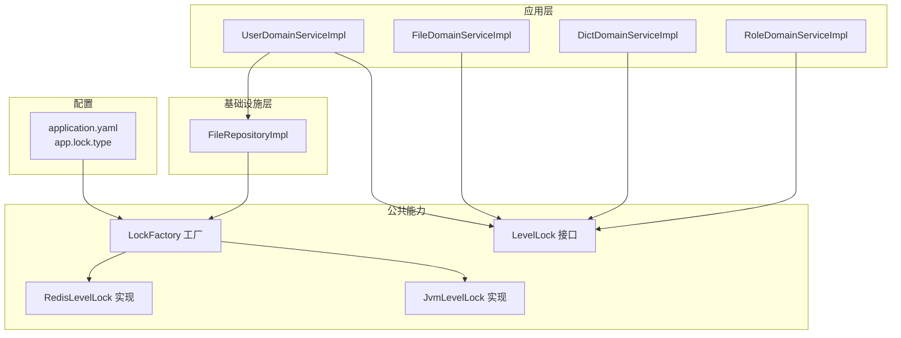
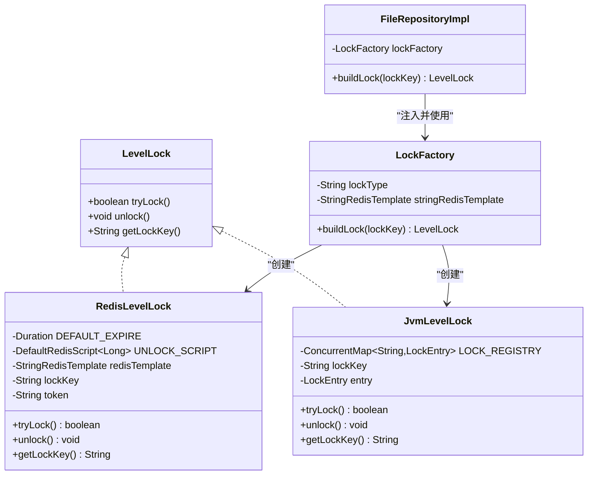
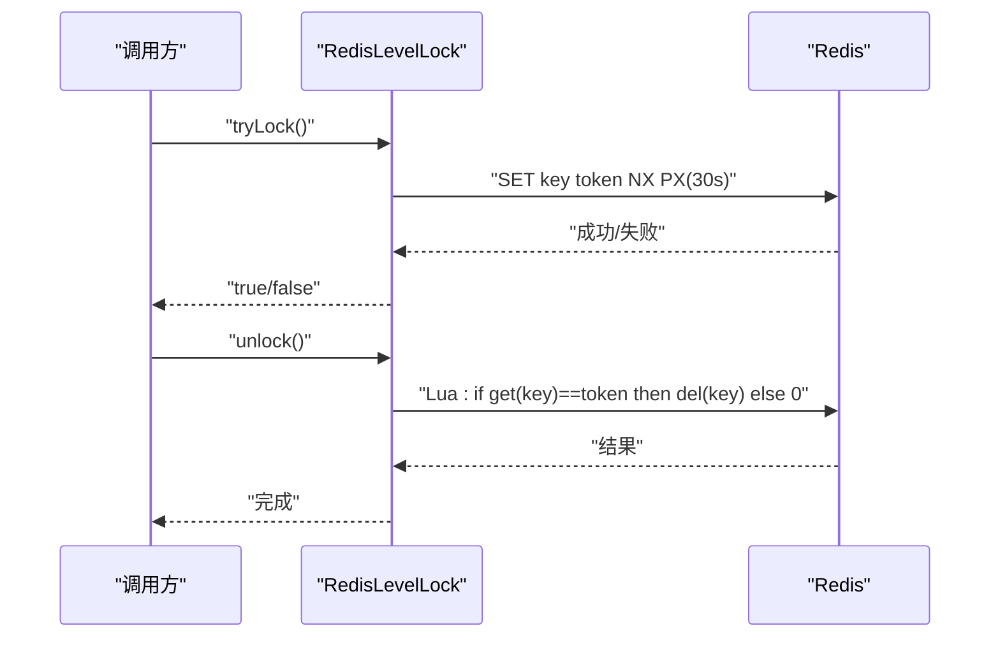
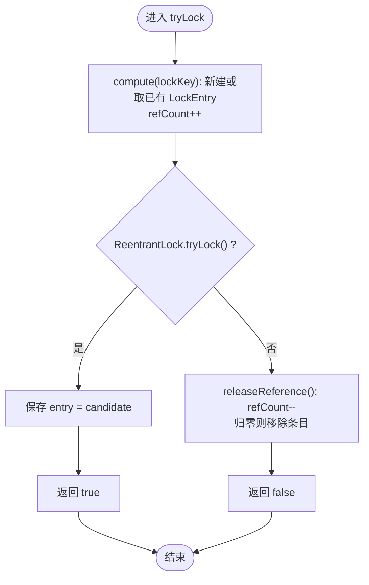
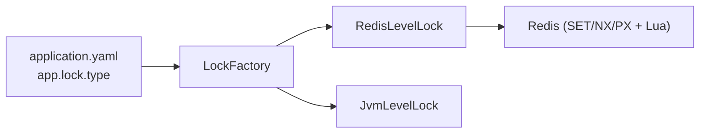

# 分布式锁组件

<cite>
**本文引用的文件**
- [LevelLock.java](file://src/main/java/com/sunnao/spring/ddd/template/common/lock/LevelLock.java)
- [LockFactory.java](file://src/main/java/com/sunnao/spring/ddd/template/common/lock/LockFactory.java)
- [RedisLevelLock.java](file://src/main/java/com/sunnao/spring/ddd/template/common/lock/RedisLevelLock.java)
- [JvmLevelLock.java](file://src/main/java/com/sunnao/spring/ddd/template/common/lock/JvmLevelLock.java)
- [application.yaml](file://src/main/resources/application.yaml)
- [FileRepository.java](file://src/main/java/com/sunnao/spring/ddd/template/domain/system/file/repository/FileRepository.java)
- [FileRepositoryImpl.java](file://src/main/java/com/sunnao/spring/ddd/template/infrastructure/system/file/repository/FileRepositoryImpl.java)
- [UserDomainServiceImpl.java](file://src/main/java/com/sunnao/spring/ddd/template/domain/system/user/service/UserDomainServiceImpl.java)
- [DictDomainServiceImpl.java](file://src/main/java/com/sunnao/spring/ddd/template/domain/system/dict/service/DictDomainServiceImpl.java)
- [RoleDomainServiceImpl.java](file://src/main/java/com/sunnao/spring/ddd/template/domain/system/role/service/RoleDomainServiceImpl.java)
</cite>

## 目录
1. [简介](#简介)
2. [项目结构](#项目结构)
3. [核心组件](#核心组件)
4. [架构总览](#架构总览)
5. [详细组件分析](#详细组件分析)
6. [依赖关系分析](#依赖关系分析)
7. [性能与调优](#性能与调优)
8. [使用示例与最佳实践](#使用示例与最佳实践)
9. [故障排查指南](#故障排查指南)
10. [结论](#结论)

## 简介
本组件提供一套“分级锁”抽象，面向单实例与分布式两种部署形态，统一通过工厂模式构建具体锁实现。默认采用 Redis 分布式锁，支持在单机环境下切换为 JVM 本地锁。该设计使领域服务仅依赖接口，无需感知底层实现细节，便于在不同环境灵活切换与演进。

## 项目结构
锁相关代码位于 common.lock 包下，包含接口、工厂与两个实现；配置项位于 application.yaml；仓储层在各 Repository 接口中声明 buildLock 方法，基础设施层实现注入 LockFactory 并返回对应锁实例；领域服务在写流程中调用 tryLock/unlock 保证并发安全。

图表来源
- [LockFactory.java:1-41](file://src/main/java/com/sunnao/spring/ddd/template/common/lock/LockFactory.java#L1-L41)
- [RedisLevelLock.java:1-75](file://src/main/java/com/sunnao/spring/ddd/template/common/lock/RedisLevelLock.java#L1-L75)
- [JvmLevelLock.java:1-88](file://src/main/java/com/sunnao/spring/ddd/template/common/lock/JvmLevelLock.java#L1-L88)
- [application.yaml:64-67](file://src/main/resources/application.yaml#L64-L67)
- [FileRepositoryImpl.java:30-42](file://src/main/java/com/sunnao/spring/ddd/template/infrastructure/system/file/repository/FileRepositoryImpl.java#L30-L42)
- [UserDomainServiceImpl.java:40-60](file://src/main/java/com/sunnao/spring/ddd/template/domain/system/user/service/UserDomainServiceImpl.java#L40-L60)
- [FileDomainServiceImpl.java:20-40](file://src/main/java/com/sunnao/spring/ddd/template/domain/system/file/service/FileDomainServiceImpl.java#L20-L40)
- [DictDomainServiceImpl.java:20-40](file://src/main/java/com/sunnao/spring/ddd/template/domain/system/dict/service/DictDomainServiceImpl.java#L20-L40)
- [RoleDomainServiceImpl.java:30-50](file://src/main/java/com/sunnao/spring/ddd/template/domain/system/role/service/RoleDomainServiceImpl.java#L30-L50)

章节来源
- [application.yaml:64-67](file://src/main/resources/application.yaml#L64-L67)
- [LockFactory.java:1-41](file://src/main/java/com/sunnao/spring/ddd/template/common/lock/LockFactory.java#L1-L41)

## 核心组件
- LevelLock：定义统一的加锁/解锁/获取锁标识的接口，屏蔽实现差异。
- LockFactory：根据配置 app.lock.type 动态创建 JvmLevelLock 或 RedisLevelLock。
- RedisLevelLock：基于 Redis SET NX PX + Lua 脚本释放，具备 token 校验防止误删。
- JvmLevelLock：基于进程内 ReentrantLock，按引用计数管理注册表条目，避免内存膨胀。

章节来源
- [LevelLock.java:1-33](file://src/main/java/com/sunnao/spring/ddd/template/common/lock/LevelLock.java#L1-L33)
- [LockFactory.java:1-41](file://src/main/java/com/sunnao/spring/ddd/template/common/lock/LockFactory.java#L1-L41)
- [RedisLevelLock.java:1-75](file://src/main/java/com/sunnao/spring/ddd/template/common/lock/RedisLevelLock.java#L1-L75)
- [JvmLevelLock.java:1-88](file://src/main/java/com/sunnao/spring/ddd/template/common/lock/JvmLevelLock.java#L1-L88)

## 架构总览
整体采用“接口+工厂+多实现”的分层设计：
- 领域服务只依赖 LevelLock 接口，通过仓储的 buildLock 方法获取锁实例。
- 基础设施层仓库实现注入 LockFactory，由工厂依据配置选择具体实现。
- 运行时通过 application.yaml 的 app.lock.type 控制行为。

图表来源
- [LevelLock.java:1-33](file://src/main/java/com/sunnao/spring/ddd/template/common/lock/LevelLock.java#L1-L33)
- [LockFactory.java:1-41](file://src/main/java/com/sunnao/spring/ddd/template/common/lock/LockFactory.java#L1-L41)
- [RedisLevelLock.java:1-75](file://src/main/java/com/sunnao/spring/ddd/template/common/lock/RedisLevelLock.java#L1-L75)
- [JvmLevelLock.java:1-88](file://src/main/java/com/sunnao/spring/ddd/template/common/lock/JvmLevelLock.java#L1-L88)
- [FileRepositoryImpl.java:30-42](file://src/main/java/com/sunnao/spring/ddd/template/infrastructure/system/file/repository/FileRepositoryImpl.java#L30-L42)

## 详细组件分析

### 接口与工厂（LevelLock 与 LockFactory）
- LevelLock 暴露 tryLock/unlock/getLockKey 三个方法，语义清晰且无阻塞式等待，适合在写流程中快速失败与重试。
- LockFactory 读取配置 app.lock.type，默认 redis，当值为 jvm 时返回 JvmLevelLock，否则返回 RedisLevelLock。

章节来源
- [LevelLock.java:1-33](file://src/main/java/com/sunnao/spring/ddd/template/common/lock/LevelLock.java#L1-L33)
- [LockFactory.java:1-41](file://src/main/java/com/sunnao/spring/ddd/template/common/lock/LockFactory.java#L1-L41)
- [application.yaml:64-67](file://src/main/resources/application.yaml#L64-L67)

### Redis 分布式锁（RedisLevelLock）
- 加锁：使用 SET key token NX PX 原子操作，token 为随机值，默认过期时间 30 秒，避免死锁。
- 释放：通过 Lua 脚本先比较 token 再删除，确保只有持有者能释放，防止误删他人锁。
- 异常处理：加锁/释放异常均被捕获并记录日志，不影响主流程；释放失败不影响最终一致性，因为锁会到期自动清理。
- 限制：不支持重入与自动续期，持锁业务耗时应远小于过期时间。

图表来源
- [RedisLevelLock.java:20-75](file://src/main/java/com/sunnao/spring/ddd/template/common/lock/RedisLevelLock.java#L20-L75)

章节来源
- [RedisLevelLock.java:1-75](file://src/main/java/com/sunnao/spring/ddd/template/common/lock/RedisLevelLock.java#L1-L75)

### JVM 本地锁（JvmLevelLock）
- 基于进程内 ReentrantLock，适用于单实例部署场景。
- 使用 ConcurrentMap 维护每个 lockKey 对应的 LockEntry（含锁与引用计数）。
- 引用计数策略：
  - tryLock 前对目标 lockKey 的条目进行 compute 自增 refCount，保证条目在使用期间不被并发移除。
  - 加锁成功后将 entry 指向该条目；加锁失败则 releaseReference 回退计数。
  - unlock 时检查当前线程是否持有锁，若持有则执行 unlock 并 releaseReference，最后置空 entry。
- 内存管理：refCount 归零时从注册表移除条目，避免高基数 lockKey 导致内存增长。

图表来源
- [JvmLevelLock.java:37-76](file://src/main/java/com/sunnao/spring/ddd/template/common/lock/JvmLevelLock.java#L37-L76)

章节来源
- [JvmLevelLock.java:1-88](file://src/main/java/com/sunnao/spring/ddd/template/common/lock/JvmLevelLock.java#L1-L88)

### 仓储层集成（以文件仓储为例）
- 仓储接口声明 buildLock(String lockKey)，供领域服务按需获取锁。
- 基础设施层实现注入 LockFactory，并在 buildLock 中委托工厂创建具体锁实例。

章节来源
- [FileRepository.java:26-33](file://src/main/java/com/sunnao/spring/ddd/template/domain/system/file/repository/FileRepository.java#L26-L33)
- [FileRepositoryImpl.java:30-42](file://src/main/java/com/sunnao/spring/ddd/template/infrastructure/system/file/repository/FileRepositoryImpl.java#L30-L42)

## 依赖关系分析
- 配置驱动：LockFactory 依赖 application.yaml 中的 app.lock.type 决定实现。
- 外部依赖：RedisLevelLock 依赖 Spring Data Redis 的 StringRedisTemplate 与 Lua 脚本执行能力。
- 耦合度：领域服务仅依赖 LevelLock 接口，仓储实现负责构造具体锁，降低耦合。

图表来源
- [application.yaml:64-67](file://src/main/resources/application.yaml#L64-L67)
- [LockFactory.java:1-41](file://src/main/java/com/sunnao/spring/ddd/template/common/lock/LockFactory.java#L1-L41)
- [RedisLevelLock.java:1-75](file://src/main/java/com/sunnao/spring/ddd/template/common/lock/RedisLevelLock.java#L1-L75)

章节来源
- [LockFactory.java:1-41](file://src/main/java/com/sunnao/spring/ddd/template/common/lock/LockFactory.java#L1-L41)
- [RedisLevelLock.java:1-75](file://src/main/java/com/sunnao/spring/ddd/template/common/lock/RedisLevelLock.java#L1-L75)

## 性能与调优
- 默认过期时间：RedisLevelLock 默认 30 秒，适用于短事务与轻量级临界区。
- 网络开销：分布式锁涉及 Redis 往返，需关注网络延迟与连接池参数（如 lettuce pool max-active/max-idle/min-idle）。
- 锁粒度：合理设计 lockKey，避免过粗导致串行化过度，也避免过细导致重复竞争。
- 超时控制：持锁业务耗时应显著小于锁过期时间，避免锁提前释放导致数据不一致。
- 单机优先：对于单实例部署，可切换至 JvmLevelLock 以降低网络开销。

[本节为通用指导，不直接分析具体文件]

## 使用示例与最佳实践

### 标准写流程（领域服务侧）
- 步骤：
  1) 通过仓储的 buildLock 获取锁实例。
  2) 调用 tryLock，成功则执行业务逻辑，finally 中调用 unlock。
  3) 失败则快速失败或走降级/重试策略。
- 参考路径：
  - [用户领域服务示例:40-60](file://src/main/java/com/sunnao/spring/ddd/template/domain/system/user/service/UserDomainServiceImpl.java#L40-L60)
  - [文件领域服务示例:20-40](file://src/main/java/com/sunnao/spring/ddd/template/domain/system/file/service/FileDomainServiceImpl.java#L20-L40)
  - [字典领域服务示例:20-40](file://src/main/java/com/sunnao/spring/ddd/template/domain/system/dict/service/DictDomainServiceImpl.java#L20-L40)
  - [角色领域服务示例:30-50](file://src/main/java/com/sunnao/spring/ddd/template/domain/system/role/service/RoleDomainServiceImpl.java#L30-L50)

章节来源
- [UserDomainServiceImpl.java:40-60](file://src/main/java/com/sunnao/spring/ddd/template/domain/system/user/service/UserDomainServiceImpl.java#L40-L60)
- [FileDomainServiceImpl.java:20-40](file://src/main/java/com/sunnao/spring/ddd/template/domain/system/file/service/FileDomainServiceImpl.java#L20-L40)
- [DictDomainServiceImpl.java:20-40](file://src/main/java/com/sunnao/spring/ddd/template/domain/system/dict/service/DictDomainServiceImpl.java#L20-L40)
- [RoleDomainServiceImpl.java:30-50](file://src/main/java/com/sunnao/spring/ddd/template/domain/system/role/service/RoleDomainServiceImpl.java#L30-L50)

### 常见使用场景
- 分布式任务调度：同一任务在同一时刻仅允许一个节点执行，可通过任务 ID 作为 lockKey。
- 库存扣减：以商品 SKU 为 lockKey，在高并发下单场景中避免超卖。
- 会话管理：以用户会话标识为 lockKey，防止同一会话并发修改状态。

[本节为概念性说明，不直接分析具体文件]

### 配置选项
- app.lock.type：redis（默认，分布式）| jvm（单机），用于切换锁实现。
- Redis 连接池：spring.data.redis.lettuce.pool.* 影响并发与吞吐。

章节来源
- [application.yaml:64-67](file://src/main/resources/application.yaml#L64-L67)
- [application.yaml:22-26](file://src/main/resources/application.yaml#L22-L26)

### 注意事项与限制
- 不支持重入：同一线程多次 tryLock 不会增加重入计数，需在业务层保证单次持锁范围。
- 不支持自动续期：长耗时操作不适合使用该锁，建议拆分或缩短临界区。
- 持锁耗时控制：务必确保业务耗时远小于锁过期时间，避免锁提前释放。

章节来源
- [RedisLevelLock.java:18-19](file://src/main/java/com/sunnao/spring/ddd/template/common/lock/RedisLevelLock.java#L18-L19)

## 故障排查指南
- 加锁失败：
  - 检查 Redis 连通性与连接池配置。
  - 确认 lockKey 是否一致，避免不同命名导致竞争失效。
- 释放失败：
  - 观察日志中释放异常，通常不影响最终一致性（锁会到期清理）。
  - 确认未出现跨进程误删（已使用 token 校验）。
- 锁未释放：
  - 检查业务是否在 finally 中调用 unlock。
  - 评估持锁耗时是否超过默认过期时间。

章节来源
- [RedisLevelLock.java:54-73](file://src/main/java/com/sunnao/spring/ddd/template/common/lock/RedisLevelLock.java#L54-L73)

## 结论
本组件通过简洁的接口与工厂模式，实现了单机与分布式两种锁实现的无缝切换。RedisLevelLock 基于原子操作与 Lua 脚本保障安全性，JvmLevelLock 提供低开销的单机方案。结合合理的 lockKey 设计与持锁耗时控制，可在多种业务场景中稳定落地。