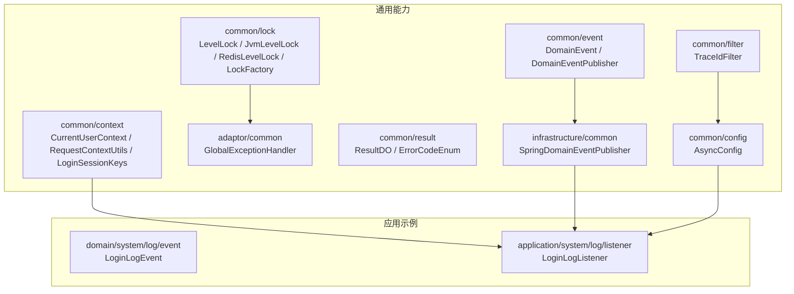
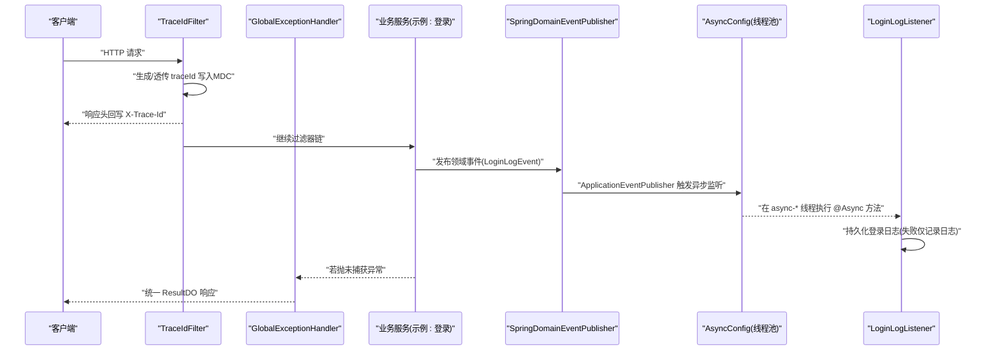
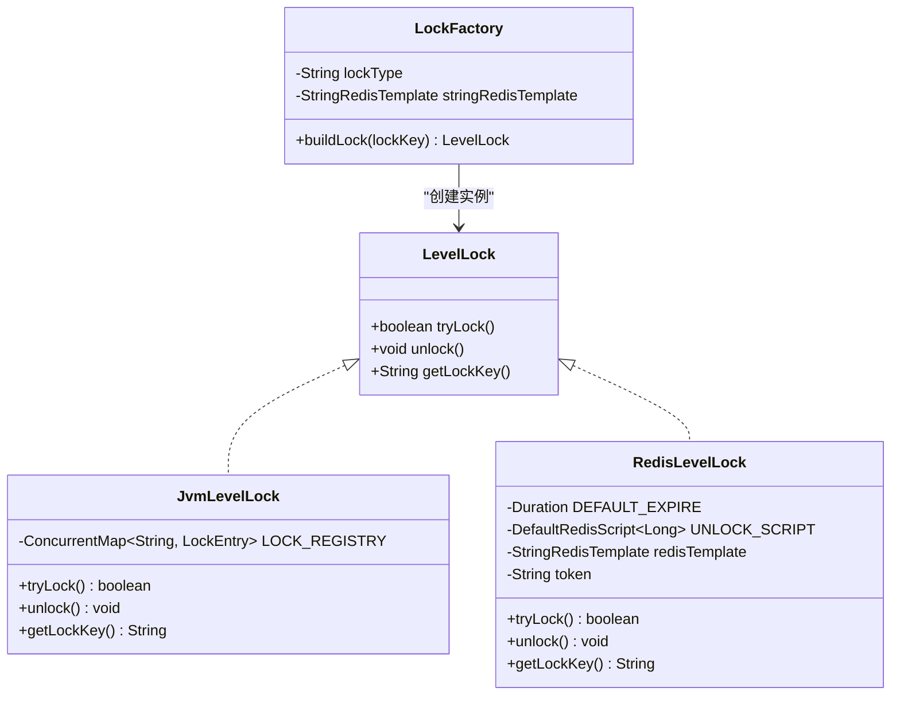
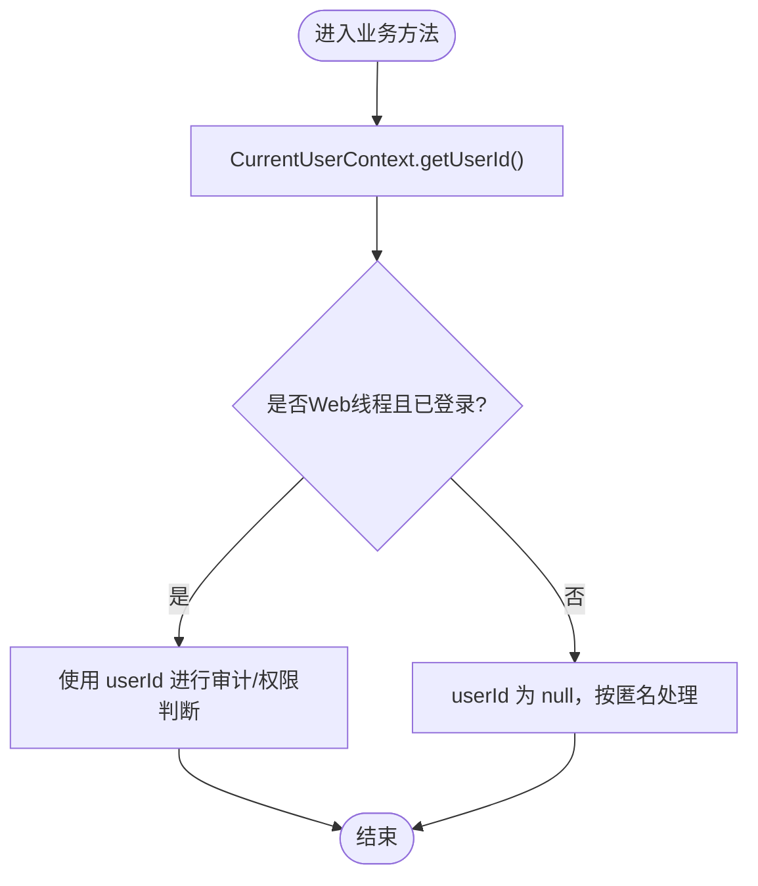
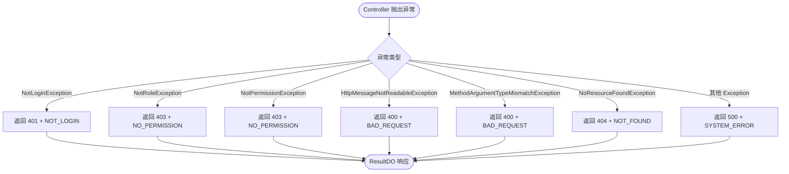
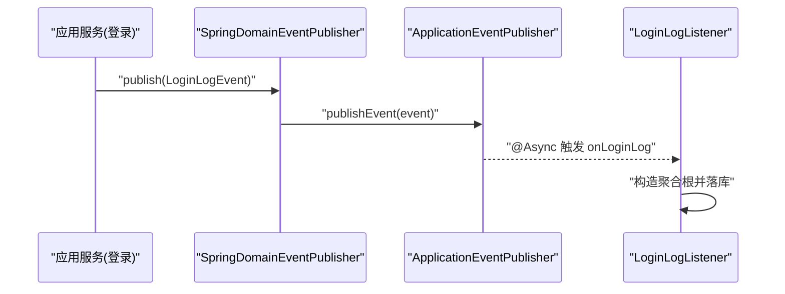
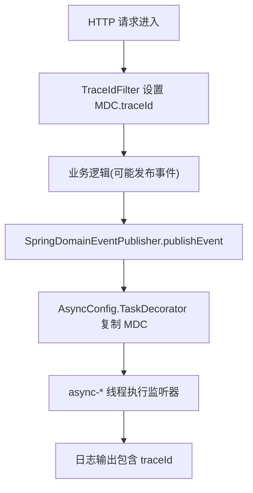
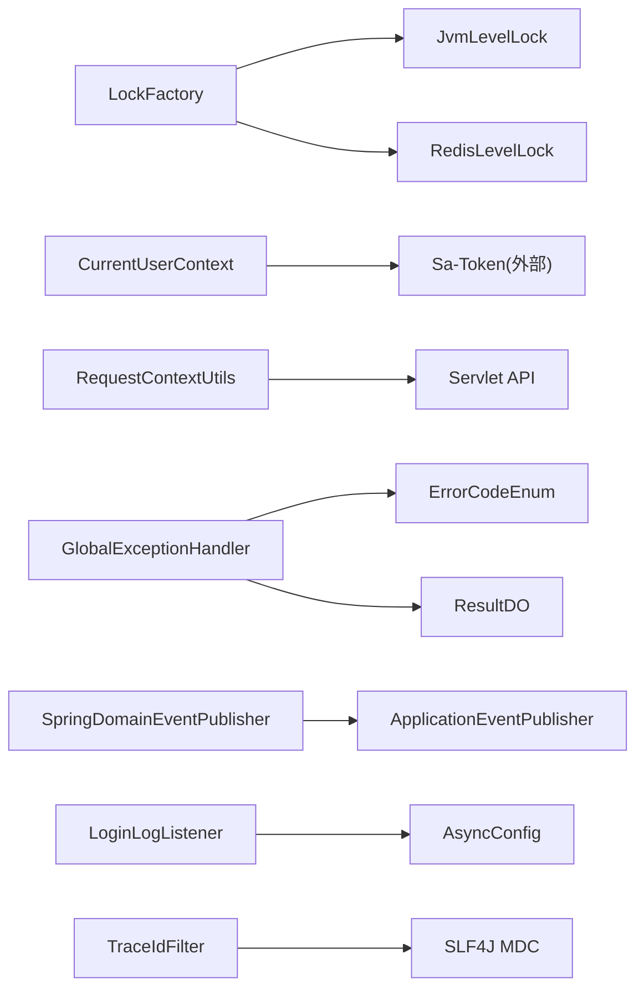

# 基础设施组件

<cite>
**本文引用的文件**   
- [LevelLock.java](file://src/main/java/com/sunnao/spring/ddd/template/common/lock/LevelLock.java)
- [JvmLevelLock.java](file://src/main/java/com/sunnao/spring/ddd/template/common/lock/JvmLevelLock.java)
- [RedisLevelLock.java](file://src/main/java/com/sunnao/spring/ddd/template/common/lock/RedisLevelLock.java)
- [LockFactory.java](file://src/main/java/com/sunnao/spring/ddd/template/common/lock/LockFactory.java)
- [CurrentUserContext.java](file://src/main/java/com/sunnao/spring/ddd/template/common/context/CurrentUserContext.java)
- [RequestContextUtils.java](file://src/main/java/com/sunnao/spring/ddd/template/common/context/RequestContextUtils.java)
- [LoginSessionKeys.java](file://src/main/java/com/sunnao/spring/ddd/template/common/context/LoginSessionKeys.java)
- [GlobalExceptionHandler.java](file://src/main/java/com/sunnao/spring/ddd/template/adaptor/common/GlobalExceptionHandler.java)
- [ErrorCodeEnum.java](file://src/main/java/com/sunnao/spring/ddd/template/common/result/ErrorCodeEnum.java)
- [ResultDO.java](file://src/main/java/com/sunnao/spring/ddd/template/common/result/ResultDO.java)
- [DomainEvent.java](file://src/main/java/com/sunnao/spring/ddd/template/common/event/DomainEvent.java)
- [DomainEventPublisher.java](file://src/main/java/com/sunnao/spring/ddd/template/common/event/DomainEventPublisher.java)
- [SpringDomainEventPublisher.java](file://src/main/java/com/sunnao/spring/ddd/template/infrastructure/common/SpringDomainEventPublisher.java)
- [AsyncConfig.java](file://src/main/java/com/sunnao/spring/ddd/template/common/config/AsyncConfig.java)
- [TraceIdFilter.java](file://src/main/java/com/sunnao/spring/ddd/template/common/filter/TraceIdFilter.java)
- [LoginLogListener.java](file://src/main/java/com/sunnao/spring/ddd/template/application/system/log/listener/LoginLogListener.java)
- [LoginLogEvent.java](file://src/main/java/com/sunnao/spring/ddd/template/domain/system/log/event/LoginLogEvent.java)
</cite>

## 目录
1. [简介](#简介)
2. [项目结构](#项目结构)
3. [核心组件](#核心组件)
4. [架构总览](#架构总览)
5. [详细组件分析](#详细组件分析)
6. [依赖关系分析](#依赖关系分析)
7. [性能与调优](#性能与调优)
8. [故障排查指南](#故障排查指南)
9. [结论](#结论)
10. [附录：使用示例与配置项](#附录使用示例与配置项)

## 简介
本技术文档聚焦于基础设施层的关键能力，包括分布式锁、上下文传递、全局异常处理、异步事件发布订阅以及异步线程池与链路追踪透传。目标是帮助读者快速理解各组件的实现原理、适用场景、最佳实践与调优建议，并提供可直接落地的使用方式与配置说明。

## 项目结构
以下图展示了与本次文档相关的核心模块与文件组织关系（仅列出与本主题相关部分）：

图表来源
- [LevelLock.java:1-33](file://src/main/java/com/sunnao/spring/ddd/template/common/lock/LevelLock.java#L1-L33)
- [JvmLevelLock.java:1-88](file://src/main/java/com/sunnao/spring/ddd/template/common/lock/JvmLevelLock.java#L1-L88)
- [RedisLevelLock.java:1-75](file://src/main/java/com/sunnao/spring/ddd/template/common/lock/RedisLevelLock.java#L1-L75)
- [LockFactory.java:1-41](file://src/main/java/com/sunnao/spring/ddd/template/common/lock/LockFactory.java#L1-L41)
- [CurrentUserContext.java:1-27](file://src/main/java/com/sunnao/spring/ddd/template/common/context/CurrentUserContext.java#L1-L27)
- [RequestContextUtils.java:1-84](file://src/main/java/com/sunnao/spring/ddd/template/common/context/RequestContextUtils.java#L1-L84)
- [LoginSessionKeys.java:1-36](file://src/main/java/com/sunnao/spring/ddd/template/common/context/LoginSessionKeys.java#L1-L36)
- [GlobalExceptionHandler.java:1-98](file://src/main/java/com/sunnao/spring/ddd/template/adaptor/common/GlobalExceptionHandler.java#L1-L98)
- [ErrorCodeEnum.java:1-209](file://src/main/java/com/sunnao/spring/ddd/template/common/result/ErrorCodeEnum.java#L1-L209)
- [ResultDO.java:1-110](file://src/main/java/com/sunnao/spring/ddd/template/common/result/ResultDO.java#L1-L110)
- [DomainEvent.java:1-46](file://src/main/java/com/sunnao/spring/ddd/template/common/event/DomainEvent.java#L1-L46)
- [DomainEventPublisher.java:1-20](file://src/main/java/com/sunnao/spring/ddd/template/common/event/DomainEventPublisher.java#L1-L20)
- [SpringDomainEventPublisher.java:1-35](file://src/main/java/com/sunnao/spring/ddd/template/infrastructure/common/SpringDomainEventPublisher.java#L1-L35)
- [AsyncConfig.java:1-69](file://src/main/java/com/sunnao/spring/ddd/template/common/config/AsyncConfig.java#L1-L69)
- [TraceIdFilter.java:1-61](file://src/main/java/com/sunnao/spring/ddd/template/common/filter/TraceIdFilter.java#L1-L61)
- [LoginLogEvent.java:1-63](file://src/main/java/com/sunnao/spring/ddd/template/domain/system/log/event/LoginLogEvent.java#L1-L63)
- [LoginLogListener.java:1-35](file://src/main/java/com/sunnao/spring/ddd/template/application/system/log/listener/LoginLogListener.java#L1-L35)

章节来源
- [LevelLock.java:1-33](file://src/main/java/com/sunnao/spring/ddd/template/common/lock/LevelLock.java#L1-L33)
- [LockFactory.java:1-41](file://src/main/java/com/sunnao/spring/ddd/template/common/lock/LockFactory.java#L1-L41)

## 核心组件
- 分级锁接口与实现
  - LevelLock：统一 tryLock/unlock/getLockKey 语义，屏蔽单机与分布式差异。
  - JvmLevelLock：基于进程内 ReentrantLock + 引用计数注册表，适合单实例部署。
  - RedisLevelLock：基于 SET NX PX + Lua 校验 token 的分布式锁，默认实现。
  - LockFactory：根据 app.lock.type 动态构建具体锁实现。
- 上下文管理
  - CurrentUserContext：封装 Sa-Token 登录态读取，提供当前用户ID。
  - RequestContextUtils：统一获取客户端 IP、User-Agent 等请求元信息，支持可选信任 X-Forwarded-For。
  - LoginSessionKeys：定义登录会话附加信息的键名集合。
- 全局异常处理
  - GlobalExceptionHandler：集中处理鉴权、参数解析、资源不存在与兜底系统异常，统一返回 ResultDO。
  - ErrorCodeEnum / ResultDO：统一错误码与响应体模型。
- 领域事件发布订阅
  - DomainEvent / DomainEventPublisher：不依赖 Spring 的事件抽象与发布器接口。
  - SpringDomainEventPublisher：基于 ApplicationEventPublisher 的进程内广播实现。
  - 监听器模式：@Async + @EventListener 异步消费，失败不影响主流程。
- 异步配置与链路追踪
  - AsyncConfig：自定义线程池、拒绝策略与 MDC 透传装饰器。
  - TraceIdFilter：生成或透传 traceId，写入 MDC，并在响应头回写，便于全链路追踪。

章节来源
- [JvmLevelLock.java:1-88](file://src/main/java/com/sunnao/spring/ddd/template/common/lock/JvmLevelLock.java#L1-L88)
- [RedisLevelLock.java:1-75](file://src/main/java/com/sunnao/spring/ddd/template/common/lock/RedisLevelLock.java#L1-L75)
- [LockFactory.java:1-41](file://src/main/java/com/sunnao/spring/ddd/template/common/lock/LockFactory.java#L1-L41)
- [CurrentUserContext.java:1-27](file://src/main/java/com/sunnao/spring/ddd/template/common/context/CurrentUserContext.java#L1-L27)
- [RequestContextUtils.java:1-84](file://src/main/java/com/sunnao/spring/ddd/template/common/context/RequestContextUtils.java#L1-L84)
- [LoginSessionKeys.java:1-36](file://src/main/java/com/sunnao/spring/ddd/template/common/context/LoginSessionKeys.java#L1-L36)
- [GlobalExceptionHandler.java:1-98](file://src/main/java/com/sunnao/spring/ddd/template/adaptor/common/GlobalExceptionHandler.java#L1-L98)
- [ErrorCodeEnum.java:1-209](file://src/main/java/com/sunnao/spring/ddd/template/common/result/ErrorCodeEnum.java#L1-L209)
- [ResultDO.java:1-110](file://src/main/java/com/sunnao/spring/ddd/template/common/result/ResultDO.java#L1-L110)
- [DomainEvent.java:1-46](file://src/main/java/com/sunnao/spring/ddd/template/common/event/DomainEvent.java#L1-L46)
- [DomainEventPublisher.java:1-20](file://src/main/java/com/sunnao/spring/ddd/template/common/event/DomainEventPublisher.java#L1-L20)
- [SpringDomainEventPublisher.java:1-35](file://src/main/java/com/sunnao/spring/ddd/template/infrastructure/common/SpringDomainEventPublisher.java#L1-L35)
- [AsyncConfig.java:1-69](file://src/main/java/com/sunnao/spring/ddd/template/common/config/AsyncConfig.java#L1-L69)
- [TraceIdFilter.java:1-61](file://src/main/java/com/sunnao/spring/ddd/template/common/filter/TraceIdFilter.java#L1-L61)

## 架构总览
下图展示从 HTTP 请求进入，到上下文注入、业务处理、异常处理、事件发布与异步消费的完整链路。

图表来源
- [TraceIdFilter.java:1-61](file://src/main/java/com/sunnao/spring/ddd/template/common/filter/TraceIdFilter.java#L1-L61)
- [SpringDomainEventPublisher.java:1-35](file://src/main/java/com/sunnao/spring/ddd/template/infrastructure/common/SpringDomainEventPublisher.java#L1-L35)
- [AsyncConfig.java:1-69](file://src/main/java/com/sunnao/spring/ddd/template/common/config/AsyncConfig.java#L1-L69)
- [LoginLogListener.java:1-35](file://src/main/java/com/sunnao/spring/ddd/template/application/system/log/listener/LoginLogListener.java#L1-L35)
- [GlobalExceptionHandler.java:1-98](file://src/main/java/com/sunnao/spring/ddd/template/adaptor/common/GlobalExceptionHandler.java#L1-L98)

## 详细组件分析

### 分布式锁组件（LevelLock 体系）
- 设计要点
  - 通过 LevelLock 接口统一语义，上层无需感知实现差异。
  - LockFactory 依据配置 app.lock.type 选择 JVM 或 Redis 实现。
  - JvmLevelLock 使用引用计数避免高基数 lockKey 导致内存泄漏。
  - RedisLevelLock 使用原子加锁与 Lua 安全释放，不支持重入与自动续期。
- 适用场景
  - 幂等控制、热点数据并发保护、跨进程互斥操作。
- 注意事项
  - RedisLevelLock 持锁时间应远小于过期时间；必要时在业务侧做重试与退避。
  - 单机环境可切换为 JvmLevelLock 降低外部依赖。

图表来源
- [LevelLock.java:1-33](file://src/main/java/com/sunnao/spring/ddd/template/common/lock/LevelLock.java#L1-L33)
- [JvmLevelLock.java:1-88](file://src/main/java/com/sunnao/spring/ddd/template/common/lock/JvmLevelLock.java#L1-L88)
- [RedisLevelLock.java:1-75](file://src/main/java/com/sunnao/spring/ddd/template/common/lock/RedisLevelLock.java#L1-L75)
- [LockFactory.java:1-41](file://src/main/java/com/sunnao/spring/ddd/template/common/lock/LockFactory.java#L1-L41)

章节来源
- [LevelLock.java:1-33](file://src/main/java/com/sunnao/spring/ddd/template/common/lock/LevelLock.java#L1-L33)
- [JvmLevelLock.java:1-88](file://src/main/java/com/sunnao/spring/ddd/template/common/lock/JvmLevelLock.java#L1-L88)
- [RedisLevelLock.java:1-75](file://src/main/java/com/sunnao/spring/ddd/template/common/lock/RedisLevelLock.java#L1-L75)
- [LockFactory.java:1-41](file://src/main/java/com/sunnao/spring/ddd/template/common/lock/LockFactory.java#L1-L41)

### 上下文管理机制（CurrentUserContext 与请求上下文）
- 当前用户上下文
  - CurrentUserContext 封装 Sa-Token 登录态读取，非 Web 线程或未登录时返回 null，调用方无需额外异常处理。
- 请求上下文工具
  - RequestContextUtils 提供 currentRequest()/getClientIp()/getUserAgent()，并支持可选信任 X-Forwarded-For（由配置类注入）。
- 登录会话键
  - LoginSessionKeys 定义 Token-Session 中附加信息的键名，便于在线用户模块展示会话明细。

图表来源
- [CurrentUserContext.java:1-27](file://src/main/java/com/sunnao/spring/ddd/template/common/context/CurrentUserContext.java#L1-L27)
- [RequestContextUtils.java:1-84](file://src/main/java/com/sunnao/spring/ddd/template/common/context/RequestContextUtils.java#L1-L84)
- [LoginSessionKeys.java:1-36](file://src/main/java/com/sunnao/spring/ddd/template/common/context/LoginSessionKeys.java#L1-L36)

章节来源
- [CurrentUserContext.java:1-27](file://src/main/java/com/sunnao/spring/ddd/template/common/context/CurrentUserContext.java#L1-L27)
- [RequestContextUtils.java:1-84](file://src/main/java/com/sunnao/spring/ddd/template/common/context/RequestContextUtils.java#L1-L84)
- [LoginSessionKeys.java:1-36](file://src/main/java/com/sunnao/spring/ddd/template/common/context/LoginSessionKeys.java#L1-L36)

### 全局异常处理器与统一错误响应
- 异常分类
  - 认证与授权：未登录、角色不满足、权限不满足。
  - 请求解析：JSON 不可读、参数类型不匹配。
  - 路由：资源不存在。
  - 兜底：未预期系统异常。
- 统一响应
  - 所有异常均转换为 ResultDO，包含 success/code/msg/data，禁止向客户端外泄堆栈。
- 错误码体系
  - ErrorCodeEnum 收敛全系统错误码，含默认文案，便于统一对外提示。

图表来源
- [GlobalExceptionHandler.java:1-98](file://src/main/java/com/sunnao/spring/ddd/template/adaptor/common/GlobalExceptionHandler.java#L1-L98)
- [ErrorCodeEnum.java:1-209](file://src/main/java/com/sunnao/spring/ddd/template/common/result/ErrorCodeEnum.java#L1-L209)
- [ResultDO.java:1-110](file://src/main/java/com/sunnao/spring/ddd/template/common/result/ResultDO.java#L1-L110)

章节来源
- [GlobalExceptionHandler.java:1-98](file://src/main/java/com/sunnao/spring/ddd/template/adaptor/common/GlobalExceptionHandler.java#L1-L98)
- [ErrorCodeEnum.java:1-209](file://src/main/java/com/sunnao/spring/ddd/template/common/result/ErrorCodeEnum.java#L1-L209)
- [ResultDO.java:1-110](file://src/main/java/com/sunnao/spring/ddd/template/common/result/ResultDO.java#L1-L110)

### 异步事件发布订阅机制（SpringDomainEventPublisher）
- 事件模型
  - DomainEvent 提供 eventId/occurredAt/operatorId 等公共字段，保证可追踪与审计。
  - 业务事件（如 LoginLogEvent）继承 DomainEvent，携带领域相关数据。
- 发布与监听
  - SpringDomainEventPublisher 基于 ApplicationEventPublisher 进程内广播。
  - 监听器以 @Async + @EventListener 异步消费，失败仅记录日志，不影响主流程。
- 典型流程（登录日志）

图表来源
- [DomainEvent.java:1-46](file://src/main/java/com/sunnao/spring/ddd/template/common/event/DomainEvent.java#L1-L46)
- [DomainEventPublisher.java:1-20](file://src/main/java/com/sunnao/spring/ddd/template/common/event/DomainEventPublisher.java#L1-L20)
- [SpringDomainEventPublisher.java:1-35](file://src/main/java/com/sunnao/spring/ddd/template/infrastructure/common/SpringDomainEventPublisher.java#L1-L35)
- [LoginLogEvent.java:1-63](file://src/main/java/com/sunnao/spring/ddd/template/domain/system/log/event/LoginLogEvent.java#L1-L63)
- [LoginLogListener.java:1-35](file://src/main/java/com/sunnao/spring/ddd/template/application/system/log/listener/LoginLogListener.java#L1-L35)

章节来源
- [DomainEvent.java:1-46](file://src/main/java/com/sunnao/spring/ddd/template/common/event/DomainEvent.java#L1-L46)
- [DomainEventPublisher.java:1-20](file://src/main/java/com/sunnao/spring/ddd/template/common/event/DomainEventPublisher.java#L1-L20)
- [SpringDomainEventPublisher.java:1-35](file://src/main/java/com/sunnao/spring/ddd/template/infrastructure/common/SpringDomainEventPublisher.java#L1-L35)
- [LoginLogEvent.java:1-63](file://src/main/java/com/sunnao/spring/ddd/template/domain/system/log/event/LoginLogEvent.java#L1-L63)
- [LoginLogListener.java:1-35](file://src/main/java/com/sunnao/spring/ddd/template/application/system/log/listener/LoginLogListener.java#L1-L35)

### 异步配置与 traceId 透传（AsyncConfig + TraceIdFilter）
- 线程池配置
  - corePoolSize/maxPoolSize/queueCapacity/keepAliveSeconds/threadNamePrefix/rejectedExecutionHandler 均可配置。
  - 默认采用 CallerRunsPolicy，防止任务丢失。
- MDC 透传
  - TaskDecorator 在提交任务时快照 MDC，执行时恢复，结束后清理，确保异步线程日志包含 traceId。
- 链路追踪
  - TraceIdFilter 在请求入口生成或透传 X-Trace-Id，写入 MDC，并在响应头回写，便于端到端排查。

图表来源
- [AsyncConfig.java:1-69](file://src/main/java/com/sunnao/spring/ddd/template/common/config/AsyncConfig.java#L1-L69)
- [TraceIdFilter.java:1-61](file://src/main/java/com/sunnao/spring/ddd/template/common/filter/TraceIdFilter.java#L1-L61)

章节来源
- [AsyncConfig.java:1-69](file://src/main/java/com/sunnao/spring/ddd/template/common/config/AsyncConfig.java#L1-L69)
- [TraceIdFilter.java:1-61](file://src/main/java/com/sunnao/spring/ddd/template/common/filter/TraceIdFilter.java#L1-L61)

## 依赖关系分析
- 锁体系
  - LockFactory 依赖配置与 Redis 模板，动态返回 JvmLevelLock 或 RedisLevelLock。
- 上下文
  - CurrentUserContext 依赖 Sa-Token；RequestContextUtils 依赖 Servlet 上下文。
- 异常与结果
  - GlobalExceptionHandler 依赖 ErrorCodeEnum 与 ResultDO 统一响应。
- 事件
  - SpringDomainEventPublisher 依赖 Spring ApplicationEventPublisher；监听器依赖 @Async 线程池。
- 异步与追踪
  - AsyncConfig 提供线程池与 MDC 透传；TraceIdFilter 负责 traceId 生命周期管理。

图表来源
- [LockFactory.java:1-41](file://src/main/java/com/sunnao/spring/ddd/template/common/lock/LockFactory.java#L1-L41)
- [JvmLevelLock.java:1-88](file://src/main/java/com/sunnao/spring/ddd/template/common/lock/JvmLevelLock.java#L1-L88)
- [RedisLevelLock.java:1-75](file://src/main/java/com/sunnao/spring/ddd/template/common/lock/RedisLevelLock.java#L1-L75)
- [CurrentUserContext.java:1-27](file://src/main/java/com/sunnao/spring/ddd/template/common/context/CurrentUserContext.java#L1-L27)
- [RequestContextUtils.java:1-84](file://src/main/java/com/sunnao/spring/ddd/template/common/context/RequestContextUtils.java#L1-L84)
- [GlobalExceptionHandler.java:1-98](file://src/main/java/com/sunnao/spring/ddd/template/adaptor/common/GlobalExceptionHandler.java#L1-L98)
- [ErrorCodeEnum.java:1-209](file://src/main/java/com/sunnao/spring/ddd/template/common/result/ErrorCodeEnum.java#L1-L209)
- [ResultDO.java:1-110](file://src/main/java/com/sunnao/spring/ddd/template/common/result/ResultDO.java#L1-L110)
- [SpringDomainEventPublisher.java:1-35](file://src/main/java/com/sunnao/spring/ddd/template/infrastructure/common/SpringDomainEventPublisher.java#L1-L35)
- [AsyncConfig.java:1-69](file://src/main/java/com/sunnao/spring/ddd/template/common/config/AsyncConfig.java#L1-L69)
- [TraceIdFilter.java:1-61](file://src/main/java/com/sunnao/spring/ddd/template/common/filter/TraceIdFilter.java#L1-L61)

## 性能与调优
- 分布式锁
  - RedisLevelLock 默认过期时间较短，适用于短临界区；长耗时操作需结合业务重试与退避。
  - JvmLevelLock 无外部依赖，适合单机压测或低并发场景。
- 异步线程池
  - 根据 QPS 与任务耗时调整 core/max/队列容量；CPU 密集型与 IO 密集型场景差异化配置。
  - 合理设置 keepAliveSeconds 与线程名前缀，便于监控与定位。
- 链路追踪
  - 确保日志 pattern 包含 %X{traceId}，配合 TraceIdFilter 与 TaskDecorator 实现端到端可观测性。
- 上下文
  - 避免在异步线程中强依赖 Web 上下文；对空值做防御式处理。

[本节为通用指导，不涉及具体文件分析]

## 故障排查指南
- 未登录/无权限
  - 检查网关/前置代理是否正确透传认证头；确认 Sa-Token 配置与会话存储。
- 参数解析失败
  - 核对请求体 JSON 结构与字段类型；关注 BAD_REQUEST 错误码与提示信息。
- 资源不存在
  - 检查路由映射与路径大小写；关注 NOT_FOUND 错误码。
- 系统异常
  - 查看服务端 ERROR 日志；注意 ResultDO 中的 SYSTEM_ERROR 响应。
- 事件未消费
  - 确认 @Async 生效与线程池状态；检查监听器异常日志。
- 链路缺失 traceId
  - 确认 TraceIdFilter 已启用；检查日志 pattern 与 MDC 透传装饰器。

章节来源
- [GlobalExceptionHandler.java:1-98](file://src/main/java/com/sunnao/spring/ddd/template/adaptor/common/GlobalExceptionHandler.java#L1-L98)
- [ErrorCodeEnum.java:1-209](file://src/main/java/com/sunnao/spring/ddd/template/common/result/ErrorCodeEnum.java#L1-L209)
- [ResultDO.java:1-110](file://src/main/java/com/sunnao/spring/ddd/template/common/result/ResultDO.java#L1-L110)
- [LoginLogListener.java:1-35](file://src/main/java/com/sunnao/spring/ddd/template/application/system/log/listener/LoginLogListener.java#L1-L35)
- [AsyncConfig.java:1-69](file://src/main/java/com/sunnao/spring/ddd/template/common/config/AsyncConfig.java#L1-L69)
- [TraceIdFilter.java:1-61](file://src/main/java/com/sunnao/spring/ddd/template/common/filter/TraceIdFilter.java#L1-L61)

## 结论
本基础设施组件围绕“一致性、可观测性与解耦”展开：通过分级锁保障并发安全，通过上下文与链路追踪提升可观测性，通过全局异常与统一响应规范对外契约，通过事件驱动实现模块解耦与异步削峰。遵循本文档的使用与调优建议，可在保证稳定性的同时获得良好的扩展性与运维体验。

[本节为总结，不涉及具体文件分析]

## 附录：使用示例与配置项

- 分布式锁使用
  - 在 Repository 或写操作中通过 LockFactory.buildLock(key) 获取锁实例，使用 tryLock/unlock 包裹临界区。
  - 集群部署保持默认 redis 实现；单机或测试环境可切换 jvm。
- 上下文使用
  - 在业务方法中通过 CurrentUserContext.getUserId() 获取当前用户ID；通过 RequestContextUtils 获取客户端 IP/User-Agent。
  - 登录成功后将必要信息写入 Session 键（参考 LoginSessionKeys），用于在线用户展示。
- 事件发布与监听
  - 在领域服务持久化成功后，通过 DomainEventPublisher.publish(event) 发布事件。
  - 在 application 层创建 @Component + @Async + @EventListener 监听器，实现异步消费。
- 异步配置
  - 按需调整 AsyncConfig 的线程池参数；确保 TaskDecorator 开启 MDC 透传。
- 链路追踪
  - 确保 TraceIdFilter 启用；日志 pattern 包含 %X{traceId}；客户端可通过 X-Trace-Id 透传上游链路。

章节来源
- [LockFactory.java:1-41](file://src/main/java/com/sunnao/spring/ddd/template/common/lock/LockFactory.java#L1-L41)
- [CurrentUserContext.java:1-27](file://src/main/java/com/sunnao/spring/ddd/template/common/context/CurrentUserContext.java#L1-L27)
- [RequestContextUtils.java:1-84](file://src/main/java/com/sunnao/spring/ddd/template/common/context/RequestContextUtils.java#L1-L84)
- [LoginSessionKeys.java:1-36](file://src/main/java/com/sunnao/spring/ddd/template/common/context/LoginSessionKeys.java#L1-L36)
- [DomainEventPublisher.java:1-20](file://src/main/java/com/sunnao/spring/ddd/template/common/event/DomainEventPublisher.java#L1-L20)
- [SpringDomainEventPublisher.java:1-35](file://src/main/java/com/sunnao/spring/ddd/template/infrastructure/common/SpringDomainEventPublisher.java#L1-L35)
- [AsyncConfig.java:1-69](file://src/main/java/com/sunnao/spring/ddd/template/common/config/AsyncConfig.java#L1-L69)
- [TraceIdFilter.java:1-61](file://src/main/java/com/sunnao/spring/ddd/template/common/filter/TraceIdFilter.java#L1-L61)