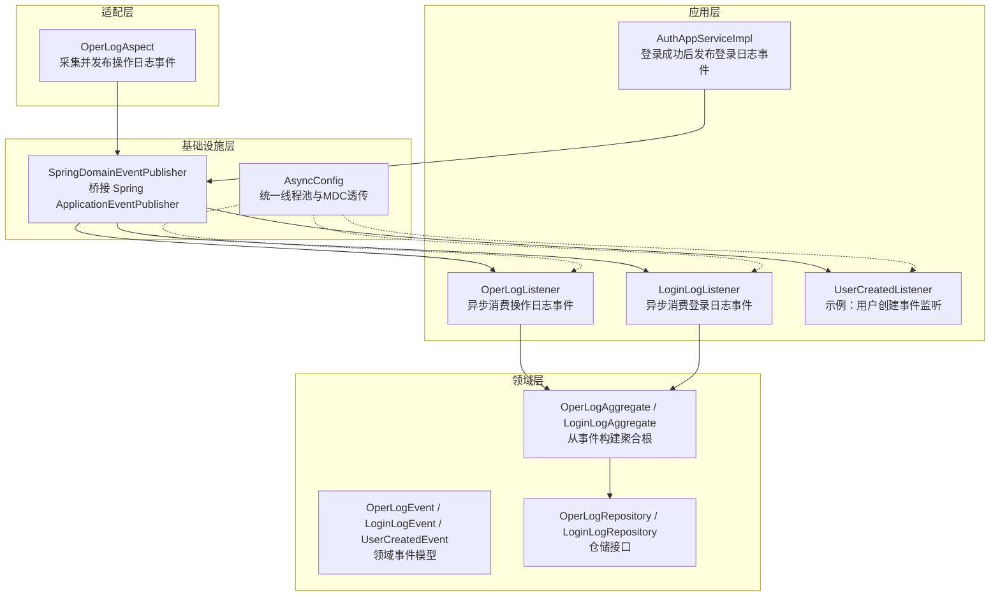
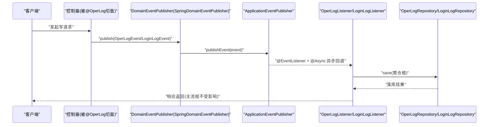
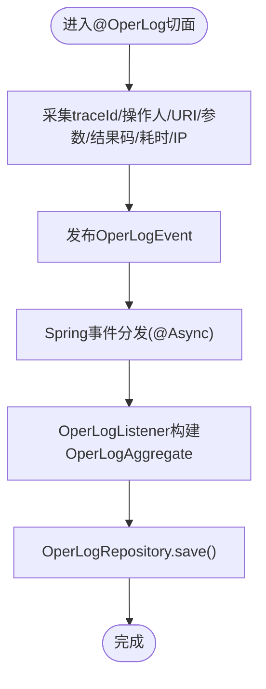
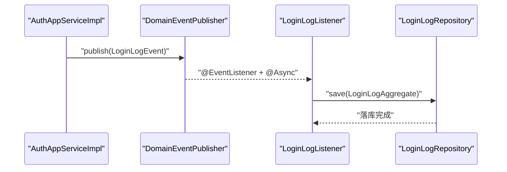
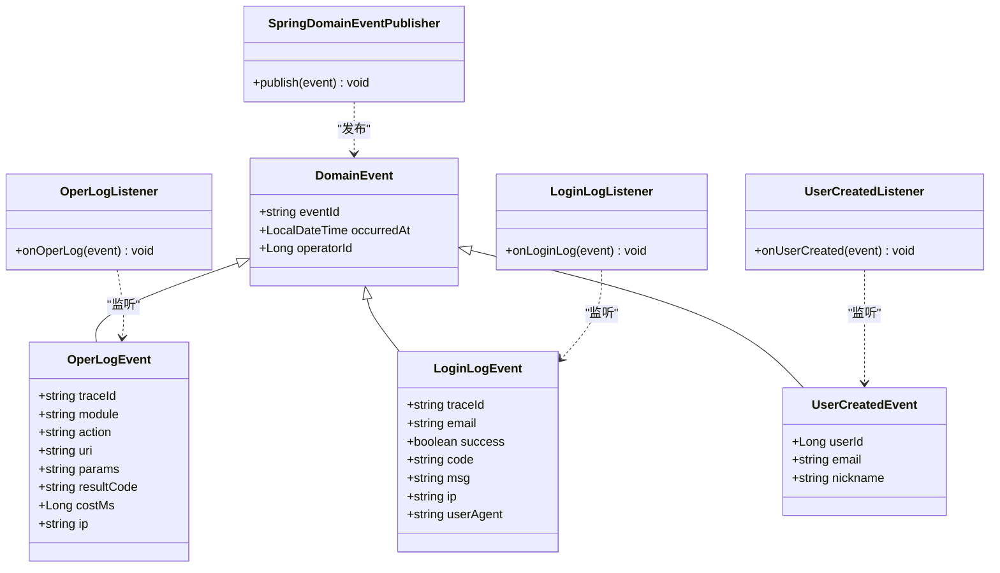
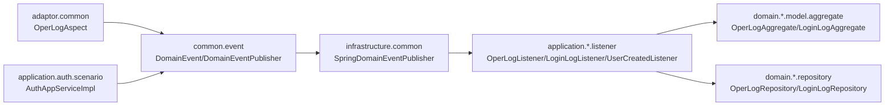

# 异步事件机制

<cite>
**本文引用的文件**
- [DomainEvent.java](file://src/main/java/com/sunnao/spring/ddd/template/common/event/DomainEvent.java)
- [DomainEventPublisher.java](file://src/main/java/com/sunnao/spring/ddd/template/common/event/DomainEventPublisher.java)
- [SpringDomainEventPublisher.java](file://src/main/java/com/sunnao/spring/ddd/template/infrastructure/common/SpringDomainEventPublisher.java)
- [AsyncConfig.java](file://src/main/java/com/sunnao/spring/ddd/template/common/config/AsyncConfig.java)
- [OperLogAspect.java](file://src/main/java/com/sunnao/spring/ddd/template/adaptor/common/OperLogAspect.java)
- [AuthAppServiceImpl.java](file://src/main/java/com/sunnao/spring/ddd/template/application/auth/scenario/AuthAppServiceImpl.java)
- [OperLogListener.java](file://src/main/java/com/sunnao/spring/ddd/template/application/system/log/listener/OperLogListener.java)
- [LoginLogListener.java](file://src/main/java/com/sunnao/spring/ddd/template/application/system/log/listener/LoginLogListener.java)
- [UserCreatedListener.java](file://src/main/java/com/sunnao/spring/ddd/template/application/system/user/listener/UserCreatedListener.java)
- [OperLogEvent.java](file://src/main/java/com/sunnao/spring/ddd/template/domain/system/log/event/OperLogEvent.java)
- [LoginLogEvent.java](file://src/main/java/com/sunnao/spring/ddd/template/domain/system/log/event/LoginLogEvent.java)
- [UserCreatedEvent.java](file://src/main/java/com/sunnao/spring/ddd/template/domain/system/user/event/UserCreatedEvent.java)
- [OperLogAggregate.java](file://src/main/java/com/sunnao/spring/ddd/template/domain/system/log/model/aggregate/OperLogAggregate.java)
- [LoginLogAggregate.java](file://src/main/java/com/sunnao/spring/ddd/template/domain/system/log/model/aggregate/LoginLogAggregate.java)
- [OperLogRepository.java](file://src/main/java/com/sunnao/spring/ddd/template/domain/system/log/repository/OperLogRepository.java)
- [LoginLogRepository.java](file://src/main/java/com/sunnao/spring/ddd/template/domain/system/log/repository/LoginLogRepository.java)
</cite>

## 目录
1. [简介](#简介)
2. [项目结构](#项目结构)
3. [核心组件](#核心组件)
4. [架构总览](#架构总览)
5. [详细组件分析](#详细组件分析)
6. [依赖关系分析](#依赖关系分析)
7. [性能与一致性](#性能与一致性)
8. [故障排查指南](#故障排查指南)
9. [结论](#结论)
10. [附录：最佳实践与规范](#附录最佳实践与规范)

## 简介
本技术文档围绕异步事件机制展开，聚焦领域事件抽象（DomainEvent）与事件发布器接口（DomainEventPublisher），并深入解析 Spring 事件发布器实现（SpringDomainEventPublisher）如何集成 Spring Event 框架，完成进程内发布订阅。文档以操作日志监听器（OperLogListener）和登录日志监听器（LoginLogListener）为例，展示异步事件处理的具体实现；同时给出事件驱动架构设计原则、命名规范、版本兼容性考虑、重试与错误处理方案、监控告警策略、事务边界控制与数据一致性保证，以及自定义事件开发指南与最佳实践。

## 项目结构
该工程采用 DDD 分层与模块化组织，事件相关代码分布在 common、infrastructure、application、domain 等层：
- common.event：定义领域事件抽象与发布器接口
- infrastructure.common：提供基于 Spring ApplicationEventPublisher 的发布器实现
- application.*.listener：事件监听器，使用 @EventListener + @Async 异步消费
- domain.*.event：具体领域事件模型
- domain.*.model.aggregate：从事件构建聚合根的数据载体
- adaptor.common：通过切面采集请求信息并发布操作日志事件
- application.auth.scenario：认证流程中发布登录日志事件

图表来源
- [OperLogAspect.java:1-131](file://src/main/java/com/sunnao/spring/ddd/template/adaptor/common/OperLogAspect.java#L1-L131)
- [AuthAppServiceImpl.java:1-196](file://src/main/java/com/sunnao/spring/ddd/template/application/auth/scenario/AuthAppServiceImpl.java#L1-L196)
- [SpringDomainEventPublisher.java:1-35](file://src/main/java/com/sunnao/spring/ddd/template/infrastructure/common/SpringDomainEventPublisher.java#L1-L35)
- [AsyncConfig.java:1-69](file://src/main/java/com/sunnao/spring/ddd/template/common/config/AsyncConfig.java#L1-L69)
- [OperLogListener.java:1-36](file://src/main/java/com/sunnao/spring/ddd/template/application/system/log/listener/OperLogListener.java#L1-L36)
- [LoginLogListener.java:1-36](file://src/main/java/com/sunnao/spring/ddd/template/application/system/log/listener/LoginLogListener.java#L1-L36)
- [UserCreatedListener.java:1-31](file://src/main/java/com/sunnao/spring/ddd/template/application/system/user/listener/UserCreatedListener.java#L1-L31)
- [OperLogEvent.java:1-70](file://src/main/java/com/sunnao/spring/ddd/template/domain/system/log/event/OperLogEvent.java#L1-L70)
- [LoginLogEvent.java:1-64](file://src/main/java/com/sunnao/spring/ddd/template/domain/system/log/event/LoginLogEvent.java#L1-L64)
- [UserCreatedEvent.java:1-39](file://src/main/java/com/sunnao/spring/ddd/template/domain/system/user/event/UserCreatedEvent.java#L1-L39)
- [OperLogAggregate.java:1-58](file://src/main/java/com/sunnao/spring/ddd/template/domain/system/log/model/aggregate/OperLogAggregate.java#L1-L58)
- [LoginLogAggregate.java:1-57](file://src/main/java/com/sunnao/spring/ddd/template/domain/system/log/model/aggregate/LoginLogAggregate.java#L1-L57)
- [OperLogRepository.java:1-35](file://src/main/java/com/sunnao/spring/ddd/template/domain/system/log/repository/OperLogRepository.java#L1-L35)
- [LoginLogRepository.java:1-35](file://src/main/java/com/sunnao/spring/ddd/template/domain/system/log/repository/LoginLogRepository.java#L1-L35)

章节来源
- [OperLogAspect.java:1-131](file://src/main/java/com/sunnao/spring/ddd/template/adaptor/common/OperLogAspect.java#L1-L131)
- [AuthAppServiceImpl.java:1-196](file://src/main/java/com/sunnao/spring/ddd/template/application/auth/scenario/AuthAppServiceImpl.java#L1-L196)
- [SpringDomainEventPublisher.java:1-35](file://src/main/java/com/sunnao/spring/ddd/template/infrastructure/common/SpringDomainEventPublisher.java#L1-L35)
- [AsyncConfig.java:1-69](file://src/main/java/com/sunnao/spring/ddd/template/common/config/AsyncConfig.java#L1-L69)

## 核心组件
- 领域事件抽象 DomainEvent：提供全局唯一 eventId、发生时间 occurredAt、可选操作人 operatorId，作为所有领域事件的基类，不依赖 Spring，便于在各业务模块 domain 层扩展。
- 事件发布器接口 DomainEventPublisher：定义 publish(event) 方法，位于 common 层，领域服务可直接注入使用；发布失败不抛异常、不影响主流程，内部自行记录日志。
- Spring 事件发布器实现 SpringDomainEventPublisher：基于 ApplicationEventPublisher 进行进程内广播，捕获异常仅记录日志，确保发布失败不影响主流程。
- 异步配置 AsyncConfig：为 @Async 提供统一线程池，并通过 TaskDecorator 将 MDC（如 traceId）透传到异步线程，保障链路追踪完整。

章节来源
- [DomainEvent.java:1-46](file://src/main/java/com/sunnao/spring/ddd/template/common/event/DomainEvent.java#L1-L46)
- [DomainEventPublisher.java:1-20](file://src/main/java/com/sunnao/spring/ddd/template/common/event/DomainEventPublisher.java#L1-L20)
- [SpringDomainEventPublisher.java:1-35](file://src/main/java/com/sunnao/spring/ddd/template/infrastructure/common/SpringDomainEventPublisher.java#L1-L35)
- [AsyncConfig.java:1-69](file://src/main/java/com/sunnao/spring/ddd/template/common/config/AsyncConfig.java#L1-L69)

## 架构总览
下图展示了从请求进入、事件发布到异步消费的完整时序，包括操作日志与登录日志两条路径。

图表来源
- [OperLogAspect.java:1-131](file://src/main/java/com/sunnao/spring/ddd/template/adaptor/common/OperLogAspect.java#L1-L131)
- [AuthAppServiceImpl.java:1-196](file://src/main/java/com/sunnao/spring/ddd/template/application/auth/scenario/AuthAppServiceImpl.java#L1-L196)
- [SpringDomainEventPublisher.java:1-35](file://src/main/java/com/sunnao/spring/ddd/template/infrastructure/common/SpringDomainEventPublisher.java#L1-L35)
- [OperLogListener.java:1-36](file://src/main/java/com/sunnao/spring/ddd/template/application/system/log/listener/OperLogListener.java#L1-L36)
- [LoginLogListener.java:1-36](file://src/main/java/com/sunnao/spring/ddd/template/application/system/log/listener/LoginLogListener.java#L1-L36)
- [OperLogRepository.java:1-35](file://src/main/java/com/sunnao/spring/ddd/template/domain/system/log/repository/OperLogRepository.java#L1-L35)
- [LoginLogRepository.java:1-35](file://src/main/java/com/sunnao/spring/ddd/template/domain/system/log/repository/LoginLogRepository.java#L1-L35)

## 详细组件分析

### 领域事件抽象与发布器接口
- DomainEvent：封装 eventId、occurredAt、operatorId，保证事件可追踪与幂等基础能力。
- DomainEventPublisher：在 common 层定义，解耦具体发布实现；发布失败不抛异常，避免影响主流程。

章节来源
- [DomainEvent.java:1-46](file://src/main/java/com/sunnao/spring/ddd/template/common/event/DomainEvent.java#L1-L46)
- [DomainEventPublisher.java:1-20](file://src/main/java/com/sunnao/spring/ddd/template/common/event/DomainEventPublisher.java#L1-L20)

### Spring 事件发布器实现
- SpringDomainEventPublisher：包装 ApplicationEventPublisher，调用 publishEvent(event)，捕获异常仅记录日志，确保健壮性。

章节来源
- [SpringDomainEventPublisher.java:1-35](file://src/main/java/com/sunnao/spring/ddd/template/infrastructure/common/SpringDomainEventPublisher.java#L1-L35)

### 异步配置与 MDC 透传
- AsyncConfig：启用 @EnableAsync，配置 ThreadPoolTaskExecutor 核心参数与拒绝策略，并通过 TaskDecorator 将 MDC 上下文复制到异步线程，执行后清理，保障链路追踪。

章节来源
- [AsyncConfig.java:1-69](file://src/main/java/com/sunnao/spring/ddd/template/common/config/AsyncConfig.java#L1-L69)

### 操作日志事件链路
- OperLogAspect：环绕标注了 @OperLog 的 Controller 方法，采集 traceId、操作人、URI、参数摘要、结果码、耗时、IP，然后发布 OperLogEvent。
- OperLogListener：@Async + @EventListener 异步消费，构造 OperLogAggregate 并持久化，异常只记录日志。

图表来源
- [OperLogAspect.java:1-131](file://src/main/java/com/sunnao/spring/ddd/template/adaptor/common/OperLogAspect.java#L1-L131)
- [OperLogListener.java:1-36](file://src/main/java/com/sunnao/spring/ddd/template/application/system/log/listener/OperLogListener.java#L1-L36)
- [OperLogAggregate.java:1-58](file://src/main/java/com/sunnao/spring/ddd/template/domain/system/log/model/aggregate/OperLogAggregate.java#L1-L58)
- [OperLogRepository.java:1-35](file://src/main/java/com/sunnao/spring/ddd/template/domain/system/log/repository/OperLogRepository.java#L1-L35)

章节来源
- [OperLogAspect.java:1-131](file://src/main/java/com/sunnao/spring/ddd/template/adaptor/common/OperLogAspect.java#L1-L131)
- [OperLogListener.java:1-36](file://src/main/java/com/sunnao/spring/ddd/template/application/system/log/listener/OperLogListener.java#L1-L36)
- [OperLogEvent.java:1-70](file://src/main/java/com/sunnao/spring/ddd/template/domain/system/log/event/OperLogEvent.java#L1-L70)
- [OperLogAggregate.java:1-58](file://src/main/java/com/sunnao/spring/ddd/template/domain/system/log/model/aggregate/OperLogAggregate.java#L1-L58)
- [OperLogRepository.java:1-35](file://src/main/java/com/sunnao/spring/ddd/template/domain/system/log/repository/OperLogRepository.java#L1-L35)

### 登录日志事件链路
- AuthAppServiceImpl：登录成功或失败均发布 LoginLogEvent，包含 traceId、邮箱、成功标志、结果码/说明、IP、UA。
- LoginLogListener：异步消费，构造 LoginLogAggregate 并持久化，异常只记录日志。

图表来源
- [AuthAppServiceImpl.java:1-196](file://src/main/java/com/sunnao/spring/ddd/template/application/auth/scenario/AuthAppServiceImpl.java#L1-L196)
- [LoginLogListener.java:1-36](file://src/main/java/com/sunnao/spring/ddd/template/application/system/log/listener/LoginLogListener.java#L1-L36)
- [LoginLogEvent.java:1-64](file://src/main/java/com/sunnao/spring/ddd/template/domain/system/log/event/LoginLogEvent.java#L1-L64)
- [LoginLogAggregate.java:1-57](file://src/main/java/com/sunnao/spring/ddd/template/domain/system/log/model/aggregate/LoginLogAggregate.java#L1-L57)
- [LoginLogRepository.java:1-35](file://src/main/java/com/sunnao/spring/ddd/template/domain/system/log/repository/LoginLogRepository.java#L1-L35)

章节来源
- [AuthAppServiceImpl.java:1-196](file://src/main/java/com/sunnao/spring/ddd/template/application/auth/scenario/AuthAppServiceImpl.java#L1-L196)
- [LoginLogListener.java:1-36](file://src/main/java/com/sunnao/spring/ddd/template/application/system/log/listener/LoginLogListener.java#L1-L36)
- [LoginLogEvent.java:1-64](file://src/main/java/com/sunnao/spring/ddd/template/domain/system/log/event/LoginLogEvent.java#L1-L64)
- [LoginLogAggregate.java:1-57](file://src/main/java/com/sunnao/spring/ddd/template/domain/system/log/model/aggregate/LoginLogAggregate.java#L1-L57)
- [LoginLogRepository.java:1-35](file://src/main/java/com/sunnao/spring/ddd/template/domain/system/log/repository/LoginLogRepository.java#L1-L35)

### 用户创建事件监听（示例）
- UserCreatedEvent：用户创建完成后发布的领域事件，包含 userId、email、nickname、operatorId。
- UserCreatedListener：示例监听器，仅记录日志，可扩展为发送欢迎邮件、初始化用户配置等。

章节来源
- [UserCreatedEvent.java:1-39](file://src/main/java/com/sunnao/spring/ddd/template/domain/system/user/event/UserCreatedEvent.java#L1-L39)
- [UserCreatedListener.java:1-31](file://src/main/java/com/sunnao/spring/ddd/template/application/system/user/listener/UserCreatedListener.java#L1-L31)

### 类关系图（事件与监听）

图表来源
- [DomainEvent.java:1-46](file://src/main/java/com/sunnao/spring/ddd/template/common/event/DomainEvent.java#L1-L46)
- [OperLogEvent.java:1-70](file://src/main/java/com/sunnao/spring/ddd/template/domain/system/log/event/OperLogEvent.java#L1-L70)
- [LoginLogEvent.java:1-64](file://src/main/java/com/sunnao/spring/ddd/template/domain/system/log/event/LoginLogEvent.java#L1-L64)
- [UserCreatedEvent.java:1-39](file://src/main/java/com/sunnao/spring/ddd/template/domain/system/user/event/UserCreatedEvent.java#L1-L39)
- [SpringDomainEventPublisher.java:1-35](file://src/main/java/com/sunnao/spring/ddd/template/infrastructure/common/SpringDomainEventPublisher.java#L1-L35)
- [OperLogListener.java:1-36](file://src/main/java/com/sunnao/spring/ddd/template/application/system/log/listener/OperLogListener.java#L1-L36)
- [LoginLogListener.java:1-36](file://src/main/java/com/sunnao/spring/ddd/template/application/system/log/listener/LoginLogListener.java#L1-L36)
- [UserCreatedListener.java:1-31](file://src/main/java/com/sunnao/spring/ddd/template/application/system/user/listener/UserCreatedListener.java#L1-L31)

## 依赖关系分析
- 耦合与内聚：
  - common.event 与 infrastructure.common 通过接口解耦，领域服务仅依赖接口，提升可测试性与替换性。
  - application 层监听器依赖 domain 层聚合与仓储接口，保持高内聚低耦合。
- 外部依赖：
  - Spring ApplicationEventPublisher 用于进程内事件分发。
  - 线程池由 AsyncConfig 统一管理，MDC 透传保障链路追踪。
- 潜在循环依赖：
  - 当前实现无循环依赖；监听器仅消费事件，不反向依赖发布者。

图表来源
- [DomainEventPublisher.java:1-20](file://src/main/java/com/sunnao/spring/ddd/template/common/event/DomainEventPublisher.java#L1-L20)
- [SpringDomainEventPublisher.java:1-35](file://src/main/java/com/sunnao/spring/ddd/template/infrastructure/common/SpringDomainEventPublisher.java#L1-L35)
- [OperLogAspect.java:1-131](file://src/main/java/com/sunnao/spring/ddd/template/adaptor/common/OperLogAspect.java#L1-L131)
- [AuthAppServiceImpl.java:1-196](file://src/main/java/com/sunnao/spring/ddd/template/application/auth/scenario/AuthAppServiceImpl.java#L1-L196)
- [OperLogListener.java:1-36](file://src/main/java/com/sunnao/spring/ddd/template/application/system/log/listener/OperLogListener.java#L1-L36)
- [LoginLogListener.java:1-36](file://src/main/java/com/sunnao/spring/ddd/template/application/system/log/listener/LoginLogListener.java#L1-L36)
- [UserCreatedListener.java:1-31](file://src/main/java/com/sunnao/spring/ddd/template/application/system/user/listener/UserCreatedListener.java#L1-L31)
- [OperLogAggregate.java:1-58](file://src/main/java/com/sunnao/spring/ddd/template/domain/system/log/model/aggregate/OperLogAggregate.java#L1-L58)
- [LoginLogAggregate.java:1-57](file://src/main/java/com/sunnao/spring/ddd/template/domain/system/log/model/aggregate/LoginLogAggregate.java#L1-L57)
- [OperLogRepository.java:1-35](file://src/main/java/com/sunnao/spring/ddd/template/domain/system/log/repository/OperLogRepository.java#L1-L35)
- [LoginLogRepository.java:1-35](file://src/main/java/com/sunnao/spring/ddd/template/domain/system/log/repository/LoginLogRepository.java#L1-L35)

章节来源
- [OperLogAspect.java:1-131](file://src/main/java/com/sunnao/spring/ddd/template/adaptor/common/OperLogAspect.java#L1-L131)
- [AuthAppServiceImpl.java:1-196](file://src/main/java/com/sunnao/spring/ddd/template/application/auth/scenario/AuthAppServiceImpl.java#L1-L196)
- [SpringDomainEventPublisher.java:1-35](file://src/main/java/com/sunnao/spring/ddd/template/infrastructure/common/SpringDomainEventPublisher.java#L1-L35)
- [OperLogListener.java:1-36](file://src/main/java/com/sunnao/spring/ddd/template/application/system/log/listener/OperLogListener.java#L1-L36)
- [LoginLogListener.java:1-36](file://src/main/java/com/sunnao/spring/ddd/template/application/system/log/listener/LoginLogListener.java#L1-L36)
- [UserCreatedListener.java:1-31](file://src/main/java/com/sunnao/spring/ddd/template/application/system/user/listener/UserCreatedListener.java#L1-L31)

## 性能与一致性
- 线程池与背压：
  - 统一线程池大小与队列容量，结合 CallerRunsPolicy 防止任务丢失，避免阻塞主线程。
- 链路追踪：
  - MDC 透传确保异步线程日志包含 traceId，便于问题定位。
- 事务边界：
  - 事件发布在主事务外进行，避免长事务；监听器落库独立于主事务，属于最终一致性。
- 幂等与去重：
  - 事件携带 eventId，可在监听器侧实现幂等写入（例如按 eventId 去重）。
- 资源隔离：
  - 不同业务域可拆分独立线程池，避免相互影响。
- 监控指标：
  - 统计发布成功率、监听耗时、失败率、队列积压等关键指标。

[本节为通用指导，无需源码引用]

## 故障排查指南
- 常见问题：
  - 事件未触发：检查是否启用 @EnableAsync、监听器是否被扫描注册、事件类型是否匹配。
  - 日志缺失：确认 MDC 透传是否生效、TraceIdFilter 是否正确设置。
  - 落库失败：查看监听器异常日志，确认仓储实现与数据库连接。
- 建议措施：
  - 增加重试与死信队列（见附录）。
  - 对关键事件增加告警阈值与人工介入流程。
  - 完善审计日志与链路追踪。

章节来源
- [AsyncConfig.java:1-69](file://src/main/java/com/sunnao/spring/ddd/template/common/config/AsyncConfig.java#L1-L69)
- [OperLogListener.java:1-36](file://src/main/java/com/sunnao/spring/ddd/template/application/system/log/listener/OperLogListener.java#L1-L36)
- [LoginLogListener.java:1-36](file://src/main/java/com/sunnao/spring/ddd/template/application/system/log/listener/LoginLogListener.java#L1-L36)

## 结论
本项目通过清晰的领域事件抽象与发布器接口，结合 Spring 事件框架与统一异步配置，实现了稳定高效的异步事件机制。操作日志与登录日志的异步落库有效降低了主流程延迟，提升了系统吞吐与用户体验。配合 MDC 透传与完善的异常处理，系统在可观测性与健壮性方面具备良好基础。后续可通过重试、死信队列、监控告警等手段进一步增强可靠性与可维护性。

[本节为总结，无需源码引用]

## 附录：最佳实践与规范

### 设计原则
- 明确职责：领域事件表达“已发生”的事实，不包含副作用逻辑。
- 弱耦合：发布者与监听者通过事件类型解耦，避免直接依赖。
- 最终一致性：主事务提交后再发布事件，监听器独立落库。
- 可观测性：事件携带 traceId、eventId、operatorId，便于追踪与审计。

### 事件命名规范
- 包路径：domain.<模块>/event/<事件名>Event.java
- 类名：动词+名词过去式，如 UserCreatedEvent、OperLogEvent、LoginLogEvent
- 字段：小驼峰，语义清晰，避免敏感信息明文存储

### 版本兼容
- 向后兼容：新增字段默认值或可选，避免破坏既有监听器。
- 迁移策略：通过版本号或特性开关渐进升级，保留旧事件兼容处理。

### 重试与错误处理
- 重试策略：指数退避 + 最大重试次数，避免雪崩。
- 死信队列：失败事件持久化至死信表/队列，供人工干预与补偿。
- 幂等处理：基于 eventId 去重，确保重复投递安全。
- 异常分类：区分可重试与不可重试异常，分别处理。

### 监控告警
- 指标：发布成功率、监听耗时 P95/P99、失败率、队列长度、重试次数。
- 告警：失败率超阈、队列积压、重试耗尽、死信增长。
- 日志：结构化日志，包含 eventId、traceId、operatorId、业务键。

### 事务边界与一致性
- 发布时机：主事务提交后发布事件，避免回滚不一致。
- 监听事务：监听器落库开启独立事务，失败不影响主流程。
- 补偿机制：定时任务扫描失败事件，进行补偿或人工处理。

### 自定义事件开发指南
- 步骤：
  1) 在 domain.<模块>/event 下定义事件类，继承 DomainEvent，补充必要字段。
  2) 在需要处注入 DomainEventPublisher，调用 publish(event)。
  3) 在 application.<模块>/listener 下创建监听器，使用 @Async + @EventListener 消费。
  4) 在监听器中构建对应聚合根并调用仓储保存。
- 注意事项：
  - 事件载荷尽量精简，避免大对象序列化开销。
  - 监听器内异常捕获并记录日志，必要时重试或入死信。
  - 合理划分线程池，避免跨域互相影响。

章节来源
- [DomainEvent.java:1-46](file://src/main/java/com/sunnao/spring/ddd/template/common/event/DomainEvent.java#L1-L46)
- [DomainEventPublisher.java:1-20](file://src/main/java/com/sunnao/spring/ddd/template/common/event/DomainEventPublisher.java#L1-L20)
- [SpringDomainEventPublisher.java:1-35](file://src/main/java/com/sunnao/spring/ddd/template/infrastructure/common/SpringDomainEventPublisher.java#L1-L35)
- [OperLogListener.java:1-36](file://src/main/java/com/sunnao/spring/ddd/template/application/system/log/listener/OperLogListener.java#L1-L36)
- [LoginLogListener.java:1-36](file://src/main/java/com/sunnao/spring/ddd/template/application/system/log/listener/LoginLogListener.java#L1-L36)
- [UserCreatedListener.java:1-31](file://src/main/java/com/sunnao/spring/ddd/template/application/system/user/listener/UserCreatedListener.java#L1-L31)
- [OperLogEvent.java:1-70](file://src/main/java/com/sunnao/spring/ddd/template/domain/system/log/event/OperLogEvent.java#L1-L70)
- [LoginLogEvent.java:1-64](file://src/main/java/com/sunnao/spring/ddd/template/domain/system/log/event/LoginLogEvent.java#L1-L64)
- [UserCreatedEvent.java:1-39](file://src/main/java/com/sunnao/spring/ddd/template/domain/system/user/event/UserCreatedEvent.java#L1-L39)
- [OperLogAggregate.java:1-58](file://src/main/java/com/sunnao/spring/ddd/template/domain/system/log/model/aggregate/OperLogAggregate.java#L1-L58)
- [LoginLogAggregate.java:1-57](file://src/main/java/com/sunnao/spring/ddd/template/domain/system/log/model/aggregate/LoginLogAggregate.java#L1-L57)
- [OperLogRepository.java:1-35](file://src/main/java/com/sunnao/spring/ddd/template/domain/system/log/repository/OperLogRepository.java#L1-L35)
- [LoginLogRepository.java:1-35](file://src/main/java/com/sunnao/spring/ddd/template/domain/system/log/repository/LoginLogRepository.java#L1-L35)
- [AsyncConfig.java:1-69](file://src/main/java/com/sunnao/spring/ddd/template/common/config/AsyncConfig.java#L1-L69)