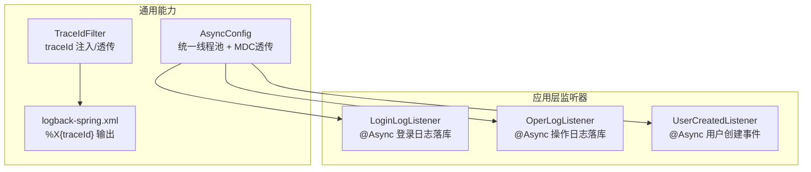
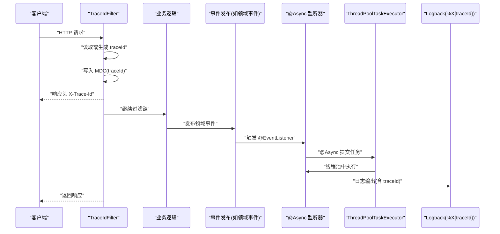
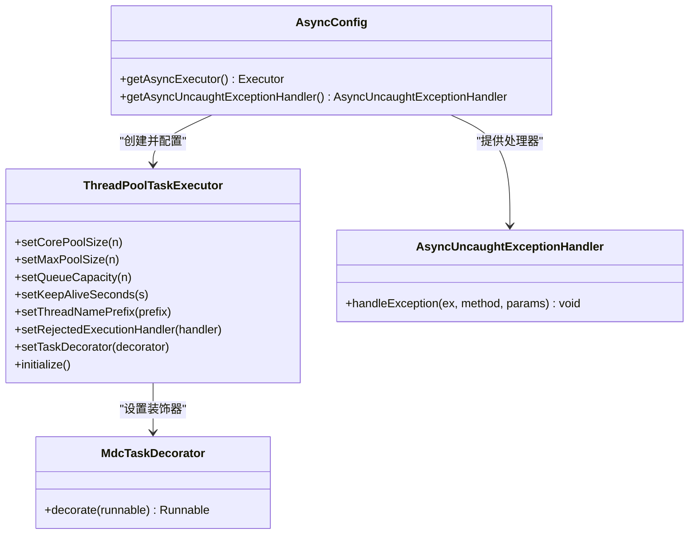
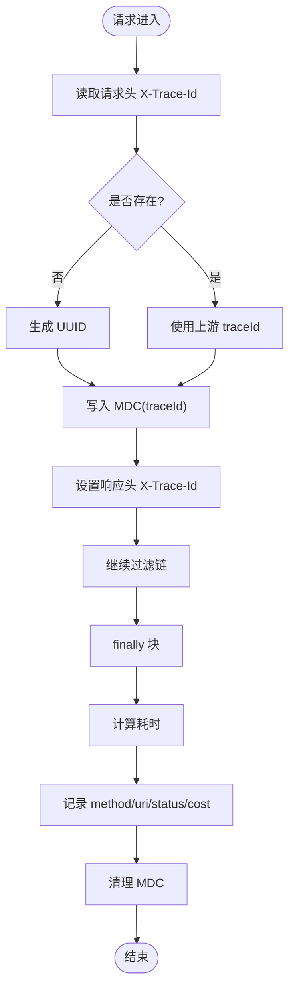
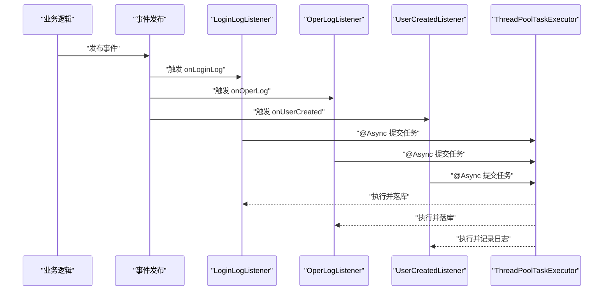
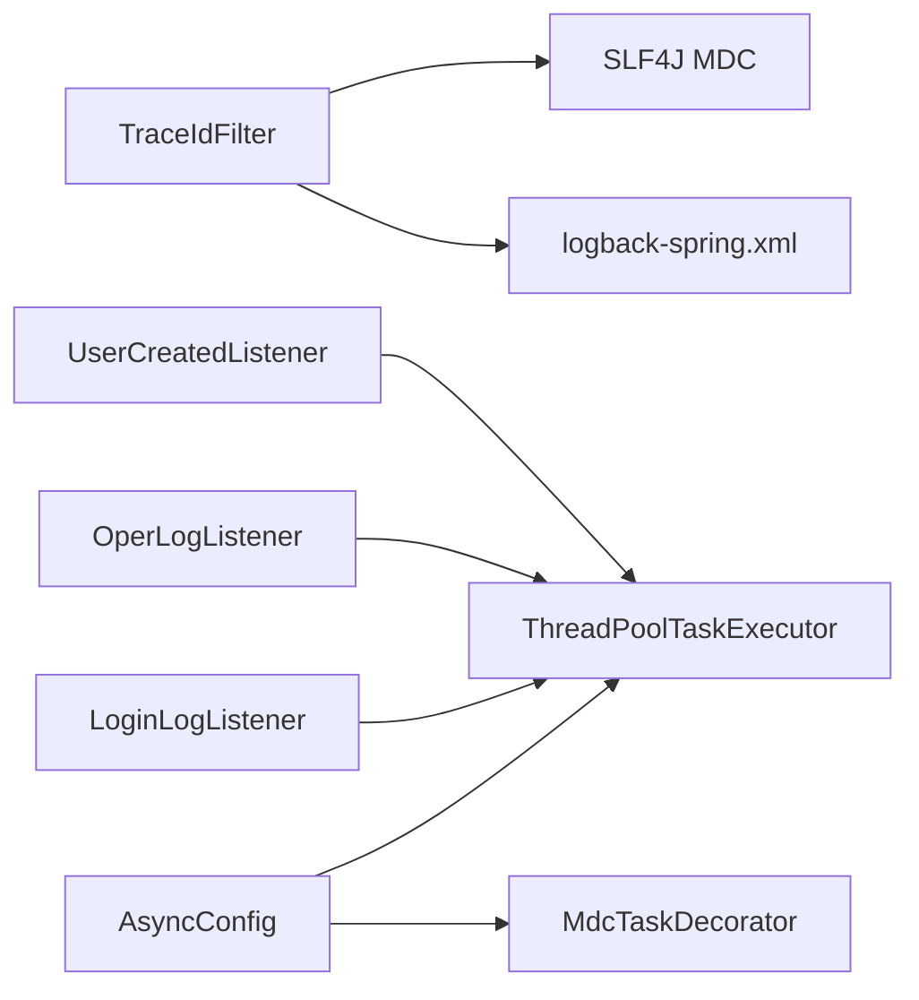

# 异步配置管理

<cite>
**本文引用的文件**   
- [AsyncConfig.java](file://src/main/java/com/sunnao/spring/ddd/template/common/config/AsyncConfig.java)
- [TraceIdFilter.java](file://src/main/java/com/sunnao/spring/ddd/template/common/filter/TraceIdFilter.java)
- [logback-spring.xml](file://src/main/resources/logback-spring.xml)
- [LoginLogListener.java](file://src/main/java/com/sunnao/spring/ddd/template/application/system/log/listener/LoginLogListener.java)
- [OperLogListener.java](file://src/main/java/com/sunnao/spring/ddd/template/application/system/log/listener/OperLogListener.java)
- [UserCreatedListener.java](file://src/main/java/com/sunnao/spring/ddd/template/application/system/user/listener/UserCreatedListener.java)
</cite>

## 目录
1. [简介](#简介)
2. [项目结构](#项目结构)
3. [核心组件](#核心组件)
4. [架构总览](#架构总览)
5. [详细组件分析](#详细组件分析)
6. [依赖关系分析](#依赖关系分析)
7. [性能与调优](#性能与调优)
8. [故障排查指南](#故障排查指南)
9. [结论](#结论)
10. [附录：生产模板与监控指标](#附录生产模板与监控指标)

## 简介
本技术文档围绕“异步配置管理”展开，聚焦以下目标：
- 深入解析异步任务配置（AsyncConfig）的线程池参数调优策略，包括核心线程数、最大线程数、队列容量、线程名称前缀、拒绝策略等。
- 详细说明 traceId 过滤器（TraceIdFilter）如何实现请求链路追踪，涵盖 traceId 的生成、传递、日志输出以及跨服务传递方案。
- 解释异步任务的执行策略、异常处理机制和性能监控方法。
- 提供不同业务场景下的线程池配置建议与调优经验。
- 说明 traceid 在微服务架构中的跨服务传递方案和分布式追踪集成思路。
- 给出异步任务的性能测试方法与常见问题排查指南。
- 提供生产环境的配置模板与监控指标收集方案。

## 项目结构
本项目采用分层架构，异步能力集中在 common 层的配置与过滤器中，并在 application 层通过事件监听器使用 @Async 进行异步消费。日志输出由 logback 统一配置，支持 MDC 透传 traceId。

图表来源
- [AsyncConfig.java:28-40](file://src/main/java/com/sunnao/spring/ddd/template/common/config/AsyncConfig.java#L28-L40)
- [TraceIdFilter.java:40-59](file://src/main/java/com/sunnao/spring/ddd/template/common/filter/TraceIdFilter.java#L40-L59)
- [logback-spring.xml:8-13](file://src/main/resources/logback-spring.xml#L8-L13)
- [LoginLogListener.java:25-34](file://src/main/java/com/sunnao/spring/ddd/template/application/system/log/listener/LoginLogListener.java#L25-L34)
- [OperLogListener.java:25-34](file://src/main/java/com/sunnao/spring/ddd/template/application/system/log/listener/OperLogListener.java#L25-L34)
- [UserCreatedListener.java:20-29](file://src/main/java/com/sunnao/spring/ddd/template/application/system/user/listener/UserCreatedListener.java#L20-L29)

章节来源
- [AsyncConfig.java:17-45](file://src/main/java/com/sunnao/spring/ddd/template/common/config/AsyncConfig.java#L17-L45)
- [TraceIdFilter.java:18-59](file://src/main/java/com/sunnao/spring/ddd/template/common/filter/TraceIdFilter.java#L18-L59)
- [logback-spring.xml:8-13](file://src/main/resources/logback-spring.xml#L8-L13)

## 核心组件
- 异步配置（AsyncConfig）
  - 启用 @EnableAsync，实现 AsyncConfigurer，提供统一的 ThreadPoolTaskExecutor。
  - 关键参数：核心线程数、最大线程数、队列容量、空闲存活时间、线程名前缀、拒绝策略、MDC 透传的 TaskDecorator。
  - 全局未捕获异常处理器，记录异步任务异常与方法名。
- 链路追踪（TraceIdFilter）
  - 优先从请求头 X-Trace-Id 读取，不存在则生成 UUID。
  - 将 traceId 写入 MDC，并回写到响应头 X-Trace-Id。
  - 记录请求耗时与状态码，清理 MDC。
- 日志输出（logback-spring.xml）
  - 控制台与文件输出均包含 %X{traceId:-}，确保 traceId 出现在日志中。
- 异步监听器示例
  - LoginLogListener、OperLogListener、UserCreatedListener 使用 @Async 与 @EventListener 组合，异步消费领域事件，失败仅记录日志不影响主流程。

章节来源
- [AsyncConfig.java:28-45](file://src/main/java/com/sunnao/spring/ddd/template/common/config/AsyncConfig.java#L28-L45)
- [TraceIdFilter.java:40-59](file://src/main/java/com/sunnao/spring/ddd/template/common/filter/TraceIdFilter.java#L40-L59)
- [logback-spring.xml:8-13](file://src/main/resources/logback-spring.xml#L8-L13)
- [LoginLogListener.java:25-34](file://src/main/java/com/sunnao/spring/ddd/template/application/system/log/listener/LoginLogListener.java#L25-L34)
- [OperLogListener.java:25-34](file://src/main/java/com/sunnao/spring/ddd/template/application/system/log/listener/OperLogListener.java#L25-L34)
- [UserCreatedListener.java:20-29](file://src/main/java/com/sunnao/spring/ddd/template/application/system/user/listener/UserCreatedListener.java#L20-L29)

## 架构总览
下图展示了从 HTTP 请求进入，到 traceId 注入、异步任务执行与日志输出的完整链路。

图表来源
- [TraceIdFilter.java:40-59](file://src/main/java/com/sunnao/spring/ddd/template/common/filter/TraceIdFilter.java#L40-L59)
- [AsyncConfig.java:28-40](file://src/main/java/com/sunnao/spring/ddd/template/common/config/AsyncConfig.java#L28-L40)
- [logback-spring.xml:8-13](file://src/main/resources/logback-spring.xml#L8-L13)
- [LoginLogListener.java:25-34](file://src/main/java/com/sunnao/spring/ddd/template/application/system/log/listener/LoginLogListener.java#L25-L34)
- [OperLogListener.java:25-34](file://src/main/java/com/sunnao/spring/ddd/template/application/system/log/listener/OperLogListener.java#L25-L34)
- [UserCreatedListener.java:20-29](file://src/main/java/com/sunnao/spring/ddd/template/application/system/user/listener/UserCreatedListener.java#L20-L29)

## 详细组件分析

### 异步配置（AsyncConfig）
- 线程池参数
  - 核心线程数：用于常驻工作线程，保证基础吞吐。
  - 最大线程数：峰值时扩容，应对突发流量。
  - 队列容量：缓冲任务，避免频繁扩容导致抖动。
  - 空闲存活时间：非核心线程空闲回收时间。
  - 线程名称前缀：便于定位问题线程。
  - 拒绝策略：CallerRunsPolicy，队列满时由调用线程执行，提供背压保护。
- MDC 透传
  - 通过 TaskDecorator 在任务提交时快照当前线程 MDC，执行时恢复，结束后清理，确保异步线程也能输出 traceId。
- 异常处理
  - 全局未捕获异常处理器记录异常与方法名，避免异步任务静默失败。

图表来源
- [AsyncConfig.java:28-45](file://src/main/java/com/sunnao/spring/ddd/template/common/config/AsyncConfig.java#L28-L45)
- [AsyncConfig.java:50-67](file://src/main/java/com/sunnao/spring/ddd/template/common/config/AsyncConfig.java#L50-L67)

章节来源
- [AsyncConfig.java:28-45](file://src/main/java/com/sunnao/spring/ddd/template/common/config/AsyncConfig.java#L28-L45)
- [AsyncConfig.java:50-67](file://src/main/java/com/sunnao/spring/ddd/template/common/config/AsyncConfig.java#L50-L67)

### 链路追踪（TraceIdFilter）
- 生成与透传
  - 若请求头存在 X-Trace-Id，则复用；否则生成 UUID。
  - 将 traceId 写入 MDC，并回写响应头 X-Trace-Id。
- 日志与耗时
  - 在 finally 块中计算耗时并记录 method、uri、status、cost。
  - 清理 MDC，防止上下文泄漏。
- 日志模式
  - logback 配置中使用 %X{traceId:-}，确保日志中包含 traceId。

图表来源
- [TraceIdFilter.java:40-59](file://src/main/java/com/sunnao/spring/ddd/template/common/filter/TraceIdFilter.java#L40-L59)
- [logback-spring.xml:8-13](file://src/main/resources/logback-spring.xml#L8-L13)

章节来源
- [TraceIdFilter.java:40-59](file://src/main/java/com/sunnao/spring/ddd/template/common/filter/TraceIdFilter.java#L40-L59)
- [logback-spring.xml:8-13](file://src/main/resources/logback-spring.xml#L8-L13)

### 异步监听器示例
- 登录日志监听器（LoginLogListener）
  - 使用 @Async 与 @EventListener 组合，异步消费登录日志事件，构建聚合根后落库；失败仅记录日志。
- 操作日志监听器（OperLogListener）
  - 异步消费操作日志事件，构建聚合根后落库；失败仅记录日志。
- 用户创建监听器（UserCreatedListener）
  - 异步消费用户创建事件，示例仅记录日志，可扩展为发送邮件、初始化配置等；失败仅记录日志。

图表来源
- [LoginLogListener.java:25-34](file://src/main/java/com/sunnao/spring/ddd/template/application/system/log/listener/LoginLogListener.java#L25-L34)
- [OperLogListener.java:25-34](file://src/main/java/com/sunnao/spring/ddd/template/application/system/log/listener/OperLogListener.java#L25-L34)
- [UserCreatedListener.java:20-29](file://src/main/java/com/sunnao/spring/ddd/template/application/system/user/listener/UserCreatedListener.java#L20-L29)
- [AsyncConfig.java:28-40](file://src/main/java/com/sunnao/spring/ddd/template/common/config/AsyncConfig.java#L28-L40)

章节来源
- [LoginLogListener.java:25-34](file://src/main/java/com/sunnao/spring/ddd/template/application/system/log/listener/LoginLogListener.java#L25-L34)
- [OperLogListener.java:25-34](file://src/main/java/com/sunnao/spring/ddd/template/application/system/log/listener/OperLogListener.java#L25-L34)
- [UserCreatedListener.java:20-29](file://src/main/java/com/sunnao/spring/ddd/template/application/system/user/listener/UserCreatedListener.java#L20-L29)

## 依赖关系分析
- TraceIdFilter 依赖 SLF4J MDC 与 Hutool ID 工具，负责 traceId 的注入与透传。
- AsyncConfig 依赖 Spring 调度框架与 ThreadPoolTaskExecutor，并通过 TaskDecorator 实现 MDC 透传。
- 监听器依赖各自 Repository 完成持久化，且通过 @Async 使用统一线程池。
- 日志系统通过 logback 配置输出 traceId，形成端到端可观测性。

图表来源
- [TraceIdFilter.java:40-59](file://src/main/java/com/sunnao/spring/ddd/template/common/filter/TraceIdFilter.java#L40-L59)
- [AsyncConfig.java:28-40](file://src/main/java/com/sunnao/spring/ddd/template/common/config/AsyncConfig.java#L28-L40)
- [AsyncConfig.java:50-67](file://src/main/java/com/sunnao/spring/ddd/template/common/config/AsyncConfig.java#L50-L67)
- [logback-spring.xml:8-13](file://src/main/resources/logback-spring.xml#L8-L13)

章节来源
- [TraceIdFilter.java:40-59](file://src/main/java/com/sunnao/spring/ddd/template/common/filter/TraceIdFilter.java#L40-L59)
- [AsyncConfig.java:28-40](file://src/main/java/com/sunnao/spring/ddd/template/common/config/AsyncConfig.java#L28-L40)
- [AsyncConfig.java:50-67](file://src/main/java/com/sunnao/spring/ddd/template/common/config/AsyncConfig.java#L50-L67)
- [logback-spring.xml:8-13](file://src/main/resources/logback-spring.xml#L8-L13)

## 性能与调优
- 线程池参数调优建议
  - CPU 密集型任务：核心线程数 ≈ CPU 核数，最大线程数略高于核心线程数，队列容量较小以避免内存压力。
  - IO 密集型任务：核心线程数 ≈ CPU 核数 × (1 + 平均等待时间/平均计算时间)，最大线程数适当放大，队列容量适中。
  - 混合负载：根据历史压测数据设定核心与最大线程数，结合队列容量与拒绝策略平衡吞吐与延迟。
- 队列容量与拒绝策略
  - 队列过大可能导致内存占用高与延迟增加；过小会导致频繁扩容与拒绝。
  - CallerRunsPolicy 提供背压，适合对一致性要求较高的场景，但可能拖慢调用方。
- 线程名称前缀
  - 设置清晰的前缀（如 async-），便于在堆栈与监控中快速识别异步线程。
- 空闲存活时间
  - 合理设置 keepAliveSeconds，避免资源浪费同时保持弹性。
- 监控指标
  - 活跃线程数、队列长度、已完成任务数、拒绝次数、平均/分位耗时。
  - 结合 JVM 与容器监控（CPU、内存、GC）综合评估。

[本节为通用指导，不直接分析具体文件]

## 故障排查指南
- 常见现象
  - 日志缺失 traceId：检查 TraceIdFilter 是否正确注入 MDC，logback 是否配置 %X{traceId:-}。
  - 异步任务无日志或丢失上下文：确认 AsyncConfig 的 TaskDecorator 是否生效，MDC 是否在异步线程中恢复。
  - 任务被拒绝或阻塞：查看队列容量与拒绝策略，必要时调整核心/最大线程数与队列大小。
  - 异常未上报：检查全局未捕获异常处理器是否记录异常与方法名。
- 排查步骤
  - 通过响应头 X-Trace-Id 关联上下游日志。
  - 在异步监听器中打印 event 与堆栈，确认异常位置。
  - 观察线程池指标与队列堆积情况，判断是否需要扩容或优化任务粒度。
  - 针对 IO 瓶颈，考虑拆分任务或使用专用线程池隔离。

章节来源
- [AsyncConfig.java:42-45](file://src/main/java/com/sunnao/spring/ddd/template/common/config/AsyncConfig.java#L42-L45)
- [AsyncConfig.java:50-67](file://src/main/java/com/sunnao/spring/ddd/template/common/config/AsyncConfig.java#L50-L67)
- [TraceIdFilter.java:40-59](file://src/main/java/com/sunnao/spring/ddd/template/common/filter/TraceIdFilter.java#L40-L59)
- [logback-spring.xml:8-13](file://src/main/resources/logback-spring.xml#L8-L13)

## 结论
本项目通过 TraceIdFilter 与 AsyncConfig 的组合，实现了从请求入口到异步执行的完整链路追踪与统一线程池管理。配合 logback 的 MDC 输出，形成了良好的可观测性与稳定性保障。在生产环境中，应基于业务特征持续调优线程池参数，完善监控指标与告警策略，确保系统在高峰期的稳定与高效。

[本节为总结性内容，不直接分析具体文件]

## 附录：生产模板与监控指标

### 生产环境配置模板（参考）
- 线程池参数
  - 核心线程数：根据 CPU 核数与 IO/CPU 比例设定。
  - 最大线程数：在峰值场景下适度放大，避免过度扩容。
  - 队列容量：中等容量，避免内存压力与延迟。
  - 空闲存活时间：60~120 秒。
  - 线程名称前缀：async-。
  - 拒绝策略：CallerRunsPolicy（背压）。
- 链路追踪
  - 请求头：X-Trace-Id。
  - MDC key：traceId。
  - 日志 pattern：包含 %X{traceId:-}。
- 监控指标
  - 线程池：活跃线程数、队列长度、已完成任务数、拒绝次数。
  - 请求级：method、uri、status、cost。
  - 系统级：CPU、内存、GC、磁盘 IO。

[本节为通用模板，不直接分析具体文件]