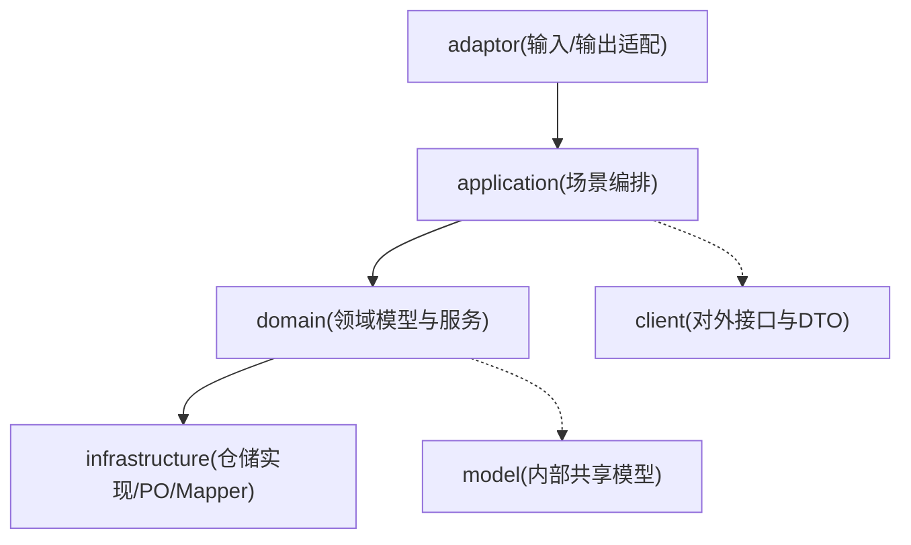
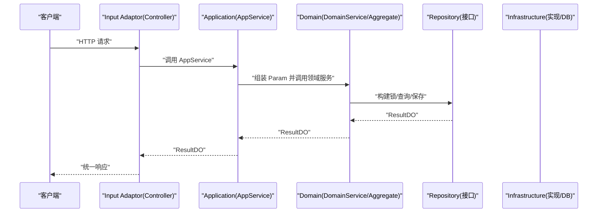
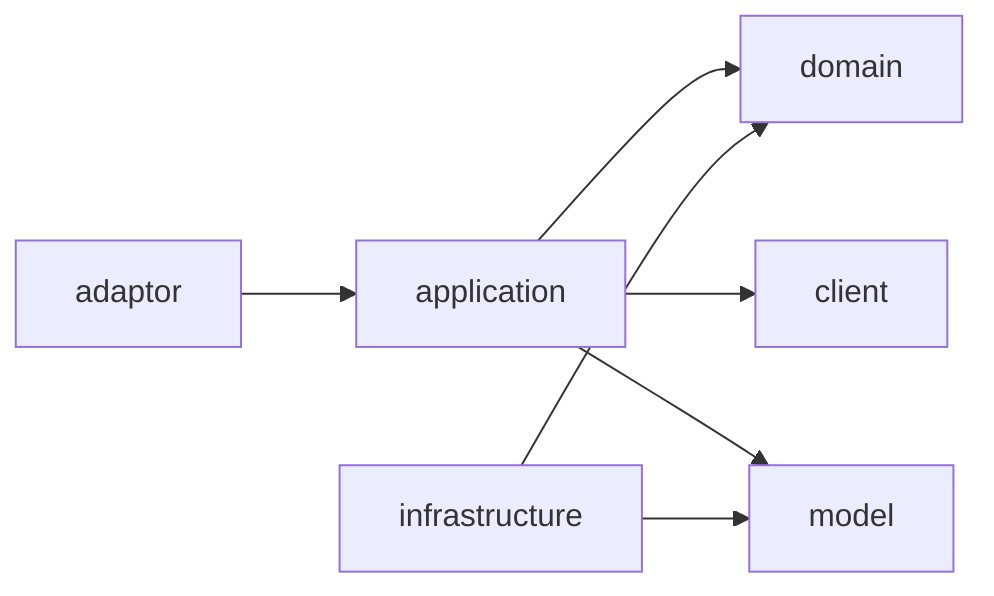
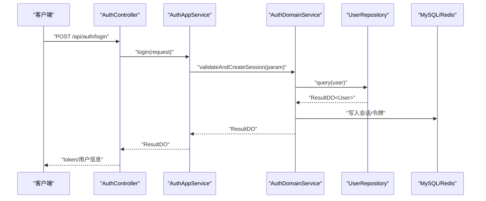

# 代码审查机制

<cite>
**本文引用的文件**   
- [README.md](file://README.md)
- [pom.xml](file://pom.xml)
- [DDD.md](file://docs/rule/ddd/DDD.md)
- [ddd-adaptor-layer.md](file://docs/rule/ddd/ddd-adaptor-layer.md)
- [ddd-application-layer.md](file://docs/rule/ddd/ddd-application-layer.md)
- [ddd-domain-layer.md](file://docs/rule/ddd/ddd-domain-layer.md)
- [ddd-infrastructure-layer.md](file://docs/rule/ddd/ddd-infrastructure-layer.md)
- [ddd-client-layer.md](file://docs/rule/ddd/ddd-client-layer.md)
- [ddd-model-layer.md](file://docs/rule/ddd/ddd-model-layer.md)
- [RedisLevelLock.java](file://src/main/java/com/sunnao/spring/ddd/template/common/lock/RedisLevelLock.java)
- [AuthController.java](file://src/main/java/com/sunnao/spring/ddd/template/adaptor/auth/input/AuthController.java)
- [GlobalExceptionHandler.java](file://src/main/java/com/sunnao/spring/ddd/template/adaptor/common/GlobalExceptionHandler.java)
- [OperLogAspect.java](file://src/main/java/com/sunnao/spring/ddd/template/adaptor/common/OperLogAspect.java)
- [UserAggregateTest.java](file://src/test/java/com/sunnao/spring/ddd/template/domain/system/user/model/aggregate/UserAggregateTest.java)
- [UserDomainServiceImplTest.java](file://src/test/java/com/sunnao/spring/ddd/template/domain/system/user/service/UserDomainServiceImplTest.java)
- [AuthLoginIntegrationTest.java](file://src/test/java/com/sunnao/spring/ddd/template/integration/AuthLoginIntegrationTest.java)
- [AuthRegisterIntegrationTest.java](file://src/test/java/com/sunnao/spring/ddd/template/integration/AuthRegisterIntegrationTest.java)
- [UserCrudIntegrationTest.java](file://src/test/java/com/sunnao/spring/ddd/template/integration/UserCrudIntegrationTest.java)
- [application.yaml](file://src/main/resources/application.yaml)
- [application-prod.yaml](file://src/main/resources/application-prod.yaml)
</cite>

## 目录
1. [引言](#引言)
2. [项目结构](#项目结构)
3. [核心组件](#核心组件)
4. [架构总览](#架构总览)
5. [详细组件分析](#详细组件分析)
6. [依赖分析](#依赖分析)
7. [性能考虑](#性能考虑)
8. [故障排查指南](#故障排查指南)
9. [结论](#结论)
10. [附录](#附录)

## 引言
本文件面向团队建立“高效、可度量、可落地”的代码审查流程与质量保障机制。结合仓库现有 DDD 规范与工程实践，覆盖以下目标：
- 明确代码审查标准（DDD 架构规范、风格一致性、业务逻辑正确性）
- 配置自动化检查工具（静态分析、单测覆盖率、重复度检测）
- 制定审查清单（接口设计、异常处理、性能与安全）
- 定义角色与职责（开发者自审、同行评审、架构师审核）
- 建立反馈处理流程（意见分类、修改要求、争议解决）
- 设置质量门禁（CI/CD 中的检查点与阻断条件）

## 项目结构
本项目采用六边形架构（Adaptor → Application → Domain → Repository），各层职责清晰、依赖倒置，便于分层审查与自动化校验。

图示来源
- [DDD.md:1-187](file://docs/rule/ddd/DDD.md#L1-L187)
- [README.md:19-46](file://README.md#L19-L46)

章节来源
- [README.md:19-46](file://README.md#L19-L46)
- [DDD.md:1-187](file://docs/rule/ddd/DDD.md#L1-L187)

## 核心组件
围绕代码审查，需重点关注的核心组件与约定：
- 统一返回体与错误码：全链路不抛异常，使用 ResultDO 封装；错误码集中管理
- 参数自校验：RequestDTO 覆写 check()，AppService 不写校验逻辑
- Assembler/Converter 分离：应用层 DTO↔领域对象转换，基础设施层 PO↔聚合根转换
- 写模式标准流程：锁 → 加载聚合根 → 执行业务方法 → 持久化 → 释放锁
- 审计字段自动填充：BasePO + MybatisFlexConfigure 全局监听器填充审计字段
- 分布式锁：RedisLevelLock（默认）/JvmLevelLock，通过 Repository.buildLock 暴露

章节来源
- [README.md:37-46](file://README.md#L37-L46)
- [ddd-application-layer.md:143-176](file://docs/rule/ddd/ddd-application-layer.md#L143-L176)
- [ddd-infrastructure-layer.md:188-276](file://docs/rule/ddd/ddd-infrastructure-layer.md#L188-L276)
- [ddd-domain-layer.md:296-385](file://docs/rule/ddd/ddd-domain-layer.md#L296-L385)
- [RedisLevelLock.java:1-46](file://src/main/java/com/sunnao/spring/ddd/template/common/lock/RedisLevelLock.java#L1-L46)

## 架构总览
从调用链角度审视代码变更的影响面与审查要点：

图示来源
- [ddd-adaptor-layer.md:143-162](file://docs/rule/ddd/ddd-adaptor-layer.md#L143-L162)
- [ddd-application-layer.md:313-338](file://docs/rule/ddd/ddd-application-layer.md#L313-L338)
- [ddd-domain-layer.md:315-385](file://docs/rule/ddd/ddd-domain-layer.md#L315-L385)
- [ddd-infrastructure-layer.md:280-412](file://docs/rule/ddd/ddd-infrastructure-layer.md#L280-L412)

## 详细组件分析

### 代码审查标准（DDD 架构规范检查）
- 分层与依赖
  - 仅允许：adaptor→application→domain→repository；application 可依赖 client、model；infrastructure 实现 domain.repository
  - 禁止：domain 直接依赖技术框架或外部服务；client 禁止依赖 model
- 四种开发模式
  - 写模式：AppService → DomainService → Aggregate.save
  - 读模式：QueryAppService → Repository.query
  - 纯计算/规则+计算：按规范在 DomainService 中承载无状态计算或规则匹配
- 命名与包结构
  - 严格遵循各层规范文件的包结构与命名约定（见各层规范）
- 关键约束
  - 领域层禁止使用设计模式；适配器层允许用于技术路由
  - 写模式必须遵循“锁→加载→执行业务→持久化→释放锁”的标准流程

章节来源
- [DDD.md:1-187](file://docs/rule/ddd/DDD.md#L1-L187)
- [ddd-adaptor-layer.md:1-141](file://docs/rule/ddd/ddd-adaptor-layer.md#L1-L141)
- [ddd-application-layer.md:1-176](file://docs/rule/ddd/ddd-application-layer.md#L1-L176)
- [ddd-domain-layer.md:1-176](file://docs/rule/ddd/ddd-domain-layer.md#L1-L176)
- [ddd-infrastructure-layer.md:1-105](file://docs/rule/ddd/ddd-infrastructure-layer.md#L1-L105)
- [ddd-client-layer.md:1-38](file://docs/rule/ddd/ddd-client-layer.md#L1-L38)
- [ddd-model-layer.md:1-30](file://docs/rule/ddd/ddd-model-layer.md#L1-L30)

### 代码风格一致性检查
- 统一返回体：全链路使用 ResultDO，禁止向上抛出未处理异常
- 参数自校验：RequestDTO.check() 负责校验，AppService 不写校验逻辑
- 转换器分离：Assembler（应用层）与 Converter（基础设施层）职责清晰
- 审计字段：BasePO + 全局监听器自动填充 createAt/updateAt/createBy/updateBy
- 日志与追踪：@OperLog 注解 + TraceIdFilter 透传 X-Trace-Id

章节来源
- [README.md:37-46](file://README.md#L37-L46)
- [ddd-application-layer.md:143-176](file://docs/rule/ddd/ddd-application-layer.md#L143-L176)
- [ddd-infrastructure-layer.md:188-276](file://docs/rule/ddd/ddd-infrastructure-layer.md#L188-L276)
- [OperLogAspect.java](file://src/main/java/com/sunnao/spring/ddd/template/adaptor/common/OperLogAspect.java)

### 业务逻辑正确性验证
- 写模式流程合规性：是否先获取锁、再加载聚合根、执行业务、持久化、finally 释放锁
- 异常处理：领域层使用 BizException/AggregateException，统一通过 ResultDO 返回
- 并发安全：分布式锁 key 粒度合理，避免热点冲突
- 数据一致性：聚合根内聚业务规则，避免跨层泄露

章节来源
- [ddd-domain-layer.md:296-385](file://docs/rule/ddd/ddd-domain-layer.md#L296-L385)
- [ddd-infrastructure-layer.md:280-412](file://docs/rule/ddd/ddd-infrastructure-layer.md#L280-L412)

### 自动化代码检查工具配置
- 静态代码分析
  - 建议引入 SonarQube/SonarLint，规则集包含：空指针、资源泄漏、重复代码、复杂度、安全漏洞等
  - 将规则与 DDD 规范对齐（如禁止在 domain 使用设计模式、禁止在 infrastructure 写业务逻辑）
- 单元测试覆盖率
  - 使用 JaCoCo 统计覆盖率，设定阈值：行覆盖率≥80%，分支覆盖率≥70%
  - 重点覆盖：聚合根业务规则、DomainService 写模式流程、异常路径
- 代码重复度检测
  - 使用 PMD/Checkstyle 或 Sonar 的重复块检测，阈值建议≤3%
- 构建期集成
  - Maven 插件：maven-surefire-plugin（测试）、jacoco-maven-plugin（覆盖率）、sonar-maven-plugin（质量门禁）
  - 参考 pom.xml 的插件与依赖组织方式，新增上述插件到 build.plugins

章节来源
- [pom.xml:153-214](file://pom.xml#L153-L214)

### 审查检查清单
- 接口设计合理性
  - RequestDTO/ResponseDTO 自包含，不在 client 依赖 model
  - 方法命名体现业务意图，避免技术动词
- 异常处理完整性
  - 全链路 ResultDO 返回，错误码来自 ErrorCodeEnum
  - 全局异常处理器兜底（401/403/400/404/500）
- 性能考虑
  - 分布式锁 key 粒度与过期时间合理
  - 异步任务线程池拒绝策略配置完善
- 安全漏洞检查
  - 生产环境关闭 Swagger
  - 登录失败次数限制与锁定策略生效
  - 敏感信息不落盘（密钥走环境变量）

章节来源
- [ddd-client-layer.md:24-38](file://docs/rule/ddd/ddd-client-layer.md#L24-L38)
- [GlobalExceptionHandler.java](file://src/main/java/com/sunnao/spring/ddd/template/adaptor/common/GlobalExceptionHandler.java)
- [RedisLevelLock.java:1-46](file://src/main/java/com/sunnao/spring/ddd/template/common/lock/RedisLevelLock.java#L1-L46)
- [application-prod.yaml](file://src/main/resources/application-prod.yaml)

### 审查角色与职责
- 开发者自审
  - 对照检查清单逐项自查；确保单测覆盖关键路径；提交前本地运行测试与静态检查
- 同行评审
  - 关注分层边界、命名规范、异常与错误码、并发与性能风险、可读性与可维护性
- 架构师审核
  - 关注 DDD 模式选择、聚合边界、领域事件与外部适配、扩展性与演进成本

[本节为通用流程说明，无需源码引用]

### 审查反馈处理流程
- 意见分类
  - 阻塞类（必须修复）：架构违规、安全漏洞、严重并发问题
  - 重要类（尽快修复）：异常处理缺失、错误码不规范、性能隐患
  - 建议类（可选优化）：命名微调、注释补充、可读性提升
- 修改要求
  - 每个意见需有对应 commit 或 PR 评论回复；阻塞类未修复不得合并
- 争议解决机制
  - 由架构师最终裁定；必要时发起专题评审会议

[本节为通用流程说明，无需源码引用]

### 代码质量门禁（CI/CD）
- 必检项
  - 编译通过、单元测试全部通过、JaCoCo 覆盖率达标、Sonar 扫描无阻断问题
- 阻断条件
  - 覆盖率低于阈值、重复度高于阈值、存在高危安全漏洞、违反 DDD 规范（如 domain 依赖外部服务）
- 流水线阶段建议
  - compile → test → jacoco-report → sonar-scanner → gate（fail on quality gate）

[本节为通用流程说明，无需源码引用]

## 依赖分析
- 模块依赖关系
  - adaptor 依赖 application/client；application 依赖 domain/client/model；infrastructure 实现 domain.repository
  - client 禁止依赖 model；model 被多模块共享
- 外部依赖
  - Spring Boot 4.x、MyBatis-Flex、PostgreSQL、Redis、Sa-Token、springdoc-openapi、Flyway、AWS S3 SDK

图示来源
- [DDD.md:1-187](file://docs/rule/ddd/DDD.md#L1-L187)
- [ddd-client-layer.md:24-38](file://docs/rule/ddd/ddd-client-layer.md#L24-L38)
- [ddd-model-layer.md:14-29](file://docs/rule/ddd/ddd-model-layer.md#L14-L29)

章节来源
- [DDD.md:1-187](file://docs/rule/ddd/DDD.md#L1-L187)
- [ddd-client-layer.md:24-38](file://docs/rule/ddd/ddd-client-layer.md#L24-L38)
- [ddd-model-layer.md:14-29](file://docs/rule/ddd/ddd-model-layer.md#L14-L29)

## 性能考虑
- 分布式锁
  - RedisLevelLock 基于 SET NX PX + Lua 释放，默认 30s 过期；持锁操作耗时应远小于过期时间
- 异步任务
  - 线程池拒绝策略建议使用 CallerRunsPolicy，提供背压保护
- 数据库与缓存
  - 字典缓存读写与失效策略；分页查询与索引优化
- 外部存储
  - 文件上传大小限制与前端预校验；S3 连接参数走环境变量

章节来源
- [RedisLevelLock.java:1-46](file://src/main/java/com/sunnao/spring/ddd/template/common/lock/RedisLevelLock.java#L1-L46)
- [README.md:97-117](file://README.md#L97-L117)

## 故障排查指南
- 全局异常处理
  - GlobalExceptionHandler 统一捕获 Sa-Token 401/403、400/404、500 等异常，返回统一格式
- 操作日志
  - @OperLog 切面记录模块、动作、traceId、耗时、IP、结果码，便于定位问题
- 登录安全
  - 登录失败次数限制与锁定策略；生产环境关闭 Swagger
- 常见错误码
  - 参见前端错误码表，快速定位问题类型与用户提示

章节来源
- [GlobalExceptionHandler.java](file://src/main/java/com/sunnao/spring/ddd/template/adaptor/common/GlobalExceptionHandler.java)
- [OperLogAspect.java](file://src/main/java/com/sunnao/spring/ddd/template/adaptor/common/OperLogAspect.java)
- [application.yaml](file://src/main/resources/application.yaml)
- [application-prod.yaml](file://src/main/resources/application-prod.yaml)

## 结论
通过将 DDD 规范、统一编码约定与自动化检查深度融入代码审查流程，可在保证架构一致性的同时显著提升交付质量与效率。建议在 CI/CD 中固化质量门禁，持续监控覆盖率与重复度，配合角色分工与反馈闭环，形成可持续改进的质量体系。

[本节为总结性内容，无需源码引用]

## 附录

### 单元测试与集成测试现状
- 单元测试
  - UserAggregateTest：聚合根业务规则验证
  - UserDomainServiceImplTest：Mockito 模拟仓储，验证写模式流程
- 集成测试
  - AuthLoginIntegrationTest / AuthRegisterIntegrationTest / UserCrudIntegrationTest：需要真实 PostgreSQL/Redis，缺失时自动跳过

章节来源
- [UserAggregateTest.java](file://src/test/java/com/sunnao/spring/ddd/template/domain/system/user/model/aggregate/UserAggregateTest.java)
- [UserDomainServiceImplTest.java](file://src/test/java/com/sunnao/spring/ddd/template/domain/system/user/service/UserDomainServiceImplTest.java)
- [AuthLoginIntegrationTest.java](file://src/test/java/com/sunnao/spring/ddd/template/integration/AuthLoginIntegrationTest.java)
- [AuthRegisterIntegrationTest.java](file://src/test/java/com/sunnao/spring/ddd/template/integration/AuthRegisterIntegrationTest.java)
- [UserCrudIntegrationTest.java](file://src/test/java/com/sunnao/spring/ddd/template/integration/UserCrudIntegrationTest.java)

### 示例调用序列（认证登录）

图示来源
- [AuthController.java](file://src/main/java/com/sunnao/spring/ddd/template/adaptor/auth/input/AuthController.java)
- [ddd-application-layer.md:313-338](file://docs/rule/ddd/ddd-application-layer.md#L313-L338)
- [ddd-domain-layer.md:315-385](file://docs/rule/ddd/ddd-domain-layer.md#L315-L385)
- [ddd-infrastructure-layer.md:280-412](file://docs/rule/ddd/ddd-infrastructure-layer.md#L280-L412)