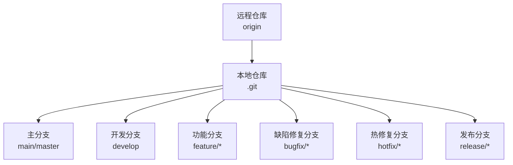
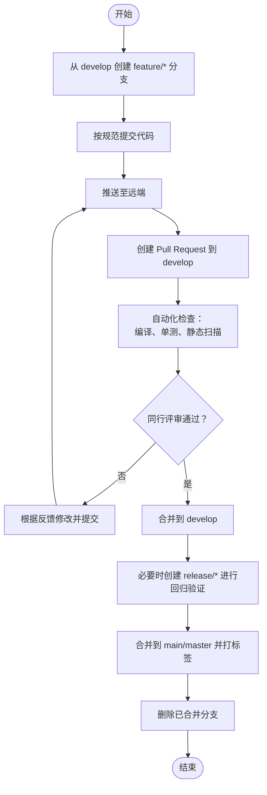
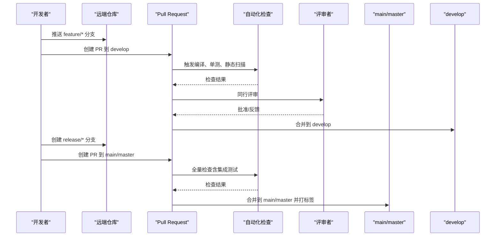
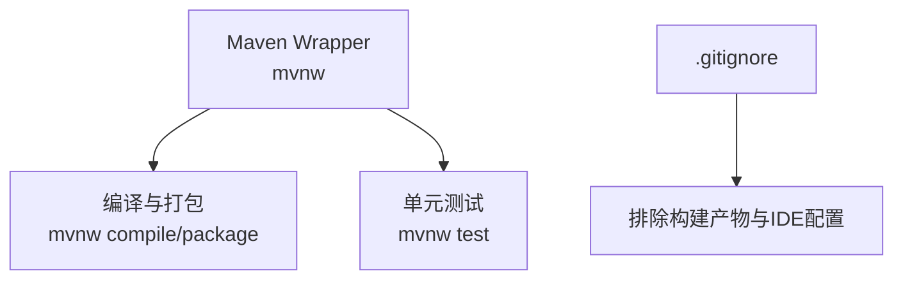

# 分支管理策略

<cite>
**本文引用的文件**   
- [README.md](file://README.md)
- [.gitignore](file://.gitignore)
- [pom.xml](file://pom.xml)
</cite>

## 目录
1. [引言](#引言)
2. [项目结构](#项目结构)
3. [核心组件](#核心组件)
4. [架构总览](#架构总览)
5. [详细组件分析](#详细组件分析)
6. [依赖分析](#依赖分析)
7. [性能考虑](#性能考虑)
8. [故障排查指南](#故障排查指南)
9. [结论](#结论)
10. [附录](#附录)

## 引言
本文件为 spring-ddd-template 仓库制定规范的 Git 分支管理策略与版本控制流程，覆盖主分支保护、功能分支命名规范、开发工作流、合并请求（Pull Request）流程、自动化检查触发条件以及分支清理策略。目标是确保代码质量、可追溯性与发布稳定性，同时兼顾团队协作效率。

## 项目结构
当前仓库未包含 CI/CD 流水线或平台级分支保护配置，因此以下策略以“团队约定 + 本地命令”为主，后续可在平台侧（如 GitHub/GitLab）启用强制规则与自动化检查。

[此图为概念性结构示意，不直接映射具体源码文件]

## 核心组件
- 分支类型与命名
  - main/master：受保护的稳定基线，仅允许通过合并请求进入。
  - develop：集成测试与预发基线，日常功能合并目标。
  - feature/*：新功能开发分支，从 develop 切出，完成后合并回 develop。
  - bugfix/*：非紧急缺陷修复，从 develop 切出，完成后合并回 develop。
  - hotfix/*：线上紧急修复，从 main/master 切出，完成后同时合并到 main/master 和 develop。
  - release/*：发布准备分支，从 develop 切出，用于冻结变更与回归验证，完成后合并到 main/master 并打标签。

- 提交信息规范
  - 采用 Conventional Commits 风格：type(scope): subject
  - type 建议：feat、fix、docs、style、refactor、test、chore、revert
  - scope 建议：模块名（如 auth、user、dict、file、log、system）
  - 示例路径参考：[README.md:148-168](file://README.md#L148-L168)

- 主分支保护策略（平台侧建议）
  - 禁止直接推送至 main/master。
  - 合并必须通过 Pull/Merge Request，且至少 1 位审查者批准。
  - 要求所有状态检查（构建、单测、静态扫描）通过后方可合并。
  - 可选：要求线性历史（squash merge 或 rebase），保留清晰变更记录。

- 合并请求（PR/MR）流程
  - 模板字段：背景与目标、影响范围、自测说明、风险与回滚方案、关联任务号。
  - 审查要求：至少 1 位同行评审；涉及领域模型变更需领域负责人审阅。
  - 自动化检查触发条件：
    - 任何分支 push 与 PR 创建/更新时执行：mvnw test、mvnw compile、静态检查（如 SpotBugs/Checkstyle）。
    - 对 main/master 的合并额外触发：全量单测、集成测试（若可用）、打包构建。

- 分支清理策略
  - 已合并的 feature/*、bugfix/*、hotfix/*、release/* 在合并后删除。
  - 长期分支（如 develop）保留；定期清理长时间未更新的 stale 分支。
  - 本地定期执行 git fetch --prune 同步远端删除的分支。

- 版本与发布
  - 使用语义化版本（SemVer）：MAJOR.MINOR.PATCH
  - 在 main/master 上打标签 vX.Y.Z，对应 release/* 分支的最终产物。
  - 变更日志由合并请求标题与提交信息自动生成（平台侧工具）。

- 最佳实践
  - 小步快跑：频繁提交、清晰的提交信息、及时同步 develop/main。
  - 冲突优先解决：先 rebase 再合并，避免复杂冲突。
  - 文档与配置变更需与代码变更同 PR 提交，保持可追溯。

**章节来源**
- [README.md:148-168](file://README.md#L148-L168)

## 架构总览
下图展示从功能开发到发布的端到端分支流转与关键检查点。

[此图为概念性流程示意，不直接映射具体源码文件]

## 详细组件分析

### 主分支保护与提交限制
- 直接推送限制：禁止向 main/master 直接推送，所有变更必须通过 PR/MR。
- 合并要求：
  - 至少 1 位审查者批准。
  - 所有自动化检查必须通过。
  - 建议在 main/master 上启用 squash merge 或 rebase，保持线性历史。
- 变更范围：
  - 仅允许合并来自 release/* 或 hotfix/* 的变更。
  - 其他分支变更应先合并到 develop，经充分验证后再进入 main/master。

**章节来源**
- [README.md:148-168](file://README.md#L148-L168)

### 功能分支命名规范与使用场景
- feature/*：新功能开发，从 develop 切出，完成后合并回 develop。
- bugfix/*：非紧急缺陷修复，从 develop 切出，完成后合并回 develop。
- hotfix/*：线上紧急修复，从 main/master 切出，完成后同时合并到 main/master 与 develop。
- release/*：发布准备分支，从 develop 切出，用于冻结变更与回归验证，完成后合并到 main/master 并打标签。

命名示例：
- feature/auth-login-improvement
- bugfix/user-crud-null-pointer
- hotfix/dict-cache-invalidation
- release/v1.2.0

**章节来源**
- [README.md:148-168](file://README.md#L148-L168)

### 开发工作流（从功能到开发再到主分支）
- 日常开发：
  - 从 develop 拉取最新代码，创建 feature/* 分支。
  - 本地完成单元测试与集成测试（若可用），保证 mvnw test 通过。
  - 提交信息遵循 Conventional Commits。
  - 推送至远端并创建 PR 到 develop。
- 集成与验证：
  - 自动化检查通过后，进行同行评审。
  - 评审通过后合并到 develop。
- 发布准备：
  - 从 develop 创建 release/*，进行回归测试与问题修复。
  - 验证通过后合并到 main/master，并打语义化版本标签。

[此图为概念性序列图，不直接映射具体源码文件]

### 合并请求（PR/MR）流程与模板
- 模板字段建议：
  - 背景与目标：描述本次变更的业务背景与预期效果。
  - 影响范围：列出受影响模块与接口。
  - 自测说明：本地测试步骤与结果。
  - 风险与回滚方案：潜在风险与回滚操作。
  - 关联任务号：链接到需求或缺陷跟踪系统。
- 审查要求：
  - 至少 1 位同行评审。
  - 涉及领域模型或跨模块变更需领域负责人审阅。
- 自动化检查触发条件：
  - 任何分支 push 与 PR 创建/更新时执行：mvnw test、mvnw compile、静态检查。
  - 对 main/master 的合并额外触发：全量单测、集成测试（若可用）、打包构建。

**章节来源**
- [README.md:148-168](file://README.md#L148-L168)

### 分支清理策略
- 自动删除：
  - 已合并的 feature/*、bugfix/*、hotfix/*、release/* 在合并后删除。
- 手动清理：
  - 定期清理长时间未更新的 stale 分支。
  - 本地执行 git fetch --prune 同步远端删除的分支。
- 长期分支：
  - develop 与 main/master 保留。
  - 如需长期特性分支（如 feature-long-running），需明确生命周期与合并计划。

**章节来源**
- [README.md:148-168](file://README.md#L148-L168)

### 版本与发布流程
- 语义化版本：
  - MAJOR：破坏性变更。
  - MINOR：新增功能，向后兼容。
  - PATCH：缺陷修复，向后兼容。
- 发布步骤：
  - 从 develop 创建 release/* 分支。
  - 在 release/* 上进行回归测试与问题修复。
  - 验证通过后合并到 main/master，并打标签 vX.Y.Z。
  - 生成变更日志与发布说明。

**章节来源**
- [README.md:148-168](file://README.md#L148-L168)

## 依赖分析
- 构建与测试依赖：
  - Maven Wrapper：mvnw 用于统一构建环境。
  - 单测与集成测试：mvnw test 执行，缺失外部依赖时自动跳过（参见 README 中的集成测试说明）。
- 忽略文件：
  - .gitignore 排除 IDE 配置、构建产物与环境变量文件，避免污染仓库。

**图表来源**
- [pom.xml:1-200](file://pom.xml#L1-L200)
- [.gitignore:1-39](file://.gitignore#L1-L39)

**章节来源**
- [pom.xml:1-200](file://pom.xml#L1-L200)
- [.gitignore:1-39](file://.gitignore#L1-L39)

## 性能考虑
- 分支粒度：尽量小而频繁的提交，减少合并冲突与回溯成本。
- 自动化检查优化：
  - 增量构建与缓存（如 Maven 依赖缓存、测试并行执行）。
  - 将耗时较长的集成测试限定在 main/master 合并阶段或 nightly 任务中。
- 分支清理：定期清理无用分支，降低远端仓库体积与克隆时间。

[本节提供通用指导，无需特定文件引用]

## 故障排查指南
- 常见冲突与解决：
  - 先 rebase 到最新 develop/main，再解决冲突；避免多次 merge 导致历史混乱。
- 自动化检查失败：
  - 查看 CI 日志定位失败用例；优先修复单测与静态检查问题。
- 发布失败：
  - 确认 release/* 分支已通过回归测试；检查版本号与标签是否重复。

**章节来源**
- [README.md:129-146](file://README.md#L129-L146)

## 结论
通过明确的分支类型、严格的合并流程与自动化检查，可有效提升代码质量与发布稳定性。建议尽快在平台侧启用分支保护与强制规则，并将本策略纳入团队入职培训与日常协作规范。

[本节为总结性内容，无需特定文件引用]

## 附录

### Git 命令示例
- 创建与切换分支
  - git checkout -b feature/xxx develop
  - git checkout -b bugfix/xxx develop
  - git checkout -b hotfix/xxx main
  - git checkout -b release/v1.2.0 develop
- 提交与推送
  - git add .
  - git commit -m "feat(auth): improve login flow"
  - git push origin feature/xxx
- 同步与合并
  - git fetch --all && git pull --rebase origin develop
  - git checkout develop && git merge --no-ff feature/xxx
  - git checkout main && git merge --no-ff release/v1.2.0
- 清理分支
  - git branch -d feature/xxx
  - git push origin --delete feature/xxx
  - git fetch --prune

[本节为通用命令示例，无需特定文件引用]