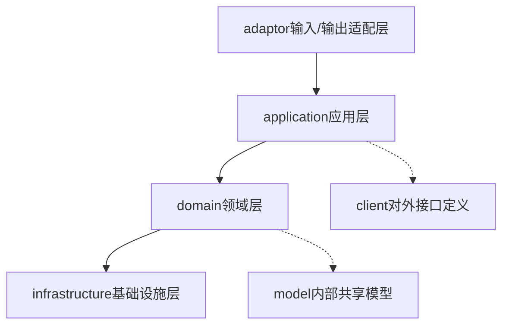
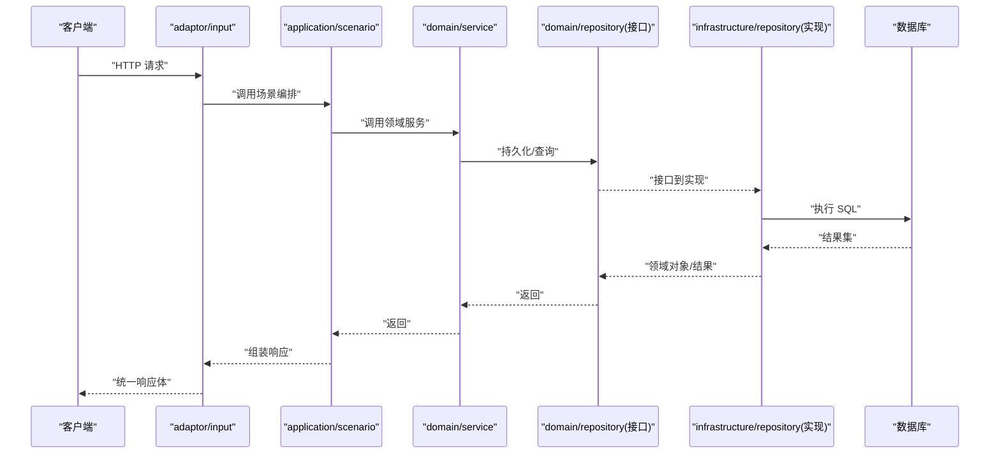
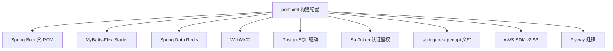

# 团队协作规范

<cite>
**本文引用的文件**   
- [README.md](file://README.md)
- [pom.xml](file://pom.xml)
- [SpringDddTemplateApplicationTests.java](file://src/test/java/com/sunnao/spring/ddd/template/SpringDddTemplateApplicationTests.java)
- [DDD.md](file://docs/rule/ddd/DDD.md)
- [README.md（DDD规则）](file://docs/rule/ddd/README.md)
- [spring-ddd-template-fixes-handover.md](file://docs/handover/spring-ddd-template-fixes-handover.md)
- [frontend-development-guide.md](file://docs/frontend-development-guide.md)
</cite>

## 目录
1. [引言](#引言)
2. [项目结构](#项目结构)
3. [核心组件](#核心组件)
4. [架构总览](#架构总览)
5. [详细组件分析](#详细组件分析)
6. [依赖分析](#依赖分析)
7. [性能考虑](#性能考虑)
8. [故障排查指南](#故障排查指南)
9. [结论](#结论)
10. [附录](#附录)

## 引言
本规范面向团队协作与知识传承，结合仓库现有工程实践与文档，形成统一的协作流程、质量门禁与发布策略。内容覆盖：
- Git 分支管理策略（主分支保护、功能分支命名、合并请求流程）
- 版本发布流程（版本号管理、变更日志维护、回滚策略）
- 代码审查流程与质量门禁（Review 检查清单、自动化测试要求、性能测试标准）
- 项目交接与知识传承（文档维护、注释规范、技术分享机制）
- 常用工具与插件配置（IDE 统一配置、格式化规则、静态分析）
- 问题跟踪与故障处理（Bug 报告模板、紧急修复流程、生产问题排查方法）

说明：本规范以仓库现有约定为基础进行提炼与扩展，确保可落地且与当前实现一致。

## 项目结构
本项目采用六边形架构（Hexagonal Architecture），分层清晰、职责明确，便于多人协作与长期演进。

图示来源
- [README.md:19-36](file://README.md#L19-L36)
- [DDD.md:7-27](file://docs/rule/ddd/DDD.md#L7-L27)

章节来源
- [README.md:19-36](file://README.md#L19-L36)
- [DDD.md:7-27](file://docs/rule/ddd/DDD.md#L7-L27)

## 核心组件
围绕“写模式”的标准流程，团队应遵循以下关键约定，以保证一致性、可维护性与可测试性：
- 全链路不抛异常：各层方法统一返回 ResultDO，内部捕获并转错误码
- 入参自校验：RequestDTO 覆写 check()，AppService 不写校验逻辑
- 对象转换分离：application 层 Assembler 负责 DTO 转换；infrastructure 层 Converter 负责 PO 转换
- 写模式标准流程：领域服务先加锁 → 加载/构建聚合根 → 调用业务方法 → repository.save() → finally 释放锁
- 审计字段自动填充：PO 继承 BasePO，由全局监听器填充创建/更新时间与操作人

章节来源
- [README.md:37-46](file://README.md#L37-L46)

## 架构总览
基于六边形架构的调用顺序为：inAdaptor → application → domain → repository（infrastructure 实现），必要时通过 outAdaptor 访问外部系统。

图示来源
- [DDD.md:9-17](file://docs/rule/ddd/DDD.md#L9-L17)
- [README.md:23-26](file://README.md#L23-L26)

## 详细组件分析

### 分支管理与合并流程
- 主分支保护
  - main/master 受保护，禁止直接推送；仅允许通过合并请求（MR/PR）合入
  - 合入前需通过 CI 流水线（编译、单元测试、集成测试）
- 功能分支命名
  - 建议格式：feature/<模块>-<简述>、fix/<缺陷编号>-<简述>、hotfix/<简述>、release/<版本号>
  - 示例：feature/user-rbac-permission、fix/auth-lockout、hotfix/session-leak、release/v1.2.0
- 合并请求流程
  - 提交前本地运行：mvn clean compile test
  - 发起 MR，至少 1 名 Reviewer 批准
  - 合并策略：优先使用 Squash Merge 保持主干整洁（或按团队偏好选择 Rebase/Merge）
  - 合并后删除已合入的功能分支

章节来源
- [README.md:129-146](file://README.md#L129-L146)

### 版本发布流程
- 版本号管理
  - 采用语义化版本：主版本.次版本.修订号（MAJOR.MINOR.PATCH）
  - 开发阶段使用 SNAPSHOT 后缀，发布时打 Tag 并生成 Release
- 变更日志维护
  - 在 release 分支或独立 CHANGELOG 文件中记录重大变更、新增特性、破坏性变更与已知问题
  - 每次合并进入主分支的 PR/MR 标题应体现变更类型（feat/fix/chore/docs 等）
- 回滚策略
  - 支持 Flyway 迁移脚本回滚（谨慎使用，需评估数据影响）
  - 发布失败时优先回滚镜像/部署包至上一稳定版本
  - 对敏感数据变更提供补偿脚本或人工干预指引

章节来源
- [README.md:141-151](file://README.md#L141-L151)

### 代码审查流程与质量门禁
- Review 检查清单
  - 是否符合六边形架构与各层职责边界
  - 是否遵循“ResultDO 全链路不抛异常”“入参自校验”“Assembler/Converter 分离”“写模式标准流程”“审计字段自动填充”等约定
  - 权限点是否正确标注（@SaCheckPermission），RBAC 种子数据是否完备
  - 事务边界是否合理，跨仓储操作是否原子
  - 缓存失效时机是否正确（如字典缓存延迟到事务提交后）
  - 安全项：XFF 可信代理开关、登录防爆破、踢会话 token 不在 URL 中传递
- 自动化测试要求
  - 必须包含领域层单测（Mockito）与必要的集成测试
  - 集成测试在未配置 TEST_PG_URL / TEST_REDIS_HOST 时自动跳过
  - 新增/修改逻辑需补充对应用例，保证覆盖率与回归稳定性
- 性能测试标准
  - 写路径需关注分布式锁竞争与事务粒度
  - 读路径需关注缓存命中率与分页查询性能
  - 异步任务线程池拒绝策略需显式配置（CallerRunsPolicy）

章节来源
- [README.md:37-46](file://README.md#L37-L46)
- [README.md:129-146](file://README.md#L129-L146)
- [spring-ddd-template-fixes-handover.md:77-137](file://docs/handover/spring-ddd-template-fixes-handover.md#L77-L137)

### 项目交接与知识传承
- 文档维护要求
  - 架构与编码规范位于 docs/rule/ddd 下，新增模块需同步更新相关规范
  - 前端需求与接口约定见 docs/frontend-development-guide.md，前后端对齐接口契约
  - 交接文档集中存放于 docs/handover，记录修复项、遗留项与后续建议
- 代码注释规范
  - 公共类、关键方法与复杂算法需添加行内注释与 Javadoc
  - 对外接口 DTO 增加字段说明，便于前后端协同
- 技术分享机制
  - 定期组织 DDD 实践与架构复盘
  - 将常见问题沉淀为知识库条目，纳入交接文档

章节来源
- [README.md:19-36](file://README.md#L19-L36)
- [README.md:148-168](file://README.md#L148-L168)
- [frontend-development-guide.md:1-30](file://docs/frontend-development-guide.md#L1-L30)
- [spring-ddd-template-fixes-handover.md:1-10](file://docs/handover/spring-ddd-template-fixes-handover.md#L1-L10)

### 常用工具与插件配置
- IDE 统一配置
  - Lombok、MapStruct、MyBatis-Flex 注解处理器已在构建中启用
  - 建议在 IDE 中开启注解处理与自动导入
- 代码格式化规则
  - 统一使用团队约定的 Formatter 配置文件（可在仓库根目录提供 .editorconfig 或 formatter.xml）
- 静态代码分析工具
  - 建议在 CI 中引入 SonarQube 或 SpotBugs，设置质量门禁阈值
  - 结合 Checkstyle/PMD 统一风格与潜在问题检测

章节来源
- [pom.xml:167-212](file://pom.xml#L167-L212)

### 问题跟踪与故障处理
- Bug 报告模板
  - 环境信息（JDK、Spring Boot、PostgreSQL、Redis 版本）
  - 复现步骤、期望行为与实际行为
  - 相关日志片段（含 traceId）、错误码与堆栈
- 紧急修复流程
  - 从主分支拉取 hotfix 分支，快速修复并提交 MR
  - 通过 CI 后合并并立即发布热更版本
- 生产环境问题排查方法
  - 利用 TraceIdFilter 透传的 X-Trace-Id 定位请求链路
  - 操作日志 @OperLog 切面采集参数摘要、耗时与结果码
  - 登录防爆破与强制下线能力辅助安全事件处置

章节来源
- [README.md:119-128](file://README.md#L119-L128)
- [spring-ddd-template-fixes-handover.md:77-108](file://docs/handover/spring-ddd-template-fixes-handover.md#L77-L108)

## 依赖分析
项目依赖关系与构建配置如下：

图示来源
- [pom.xml:1-217](file://pom.xml#L1-L217)

章节来源
- [pom.xml:1-217](file://pom.xml#L1-L217)

## 性能考虑
- 分布式锁
  - 默认使用 RedisLevelLock（SET NX PX + Lua 释放），单机场景可使用 JvmLevelLock
  - 高基数 Key 场景注意内存占用，避免泄漏（参考 JvmLevelLock 引用计数优化）
- 异步任务
  - 线程池拒绝策略设置为 CallerRunsPolicy，队列满时由提交线程执行任务提供背压
- 缓存一致性
  - 字典缓存失效延迟到事务提交后执行，降低并发读写不一致风险
- 资源限制
  - 生产环境关闭 Swagger UI 与 API 文档暴露，减少攻击面

章节来源
- [spring-ddd-template-fixes-handover.md:127-137](file://docs/handover/spring-ddd-template-fixes-handover.md#L127-L137)
- [spring-ddd-template-fixes-handover.md:109-114](file://docs/handover/spring-ddd-template-fixes-handover.md#L109-L114)

## 故障排查指南
- 上下文冒烟测试
  - 需要真实 PostgreSQL 与 Redis；未配置环境变量时自动跳过
- 常见错误码与处理
  - 登录失败次数过多、账号禁用、无权限、参数错误、数据库异常等均有统一错误码与提示文案
- 在线用户与强制下线
  - 按会话或按用户强制下线，注意自身被踢出后的重新登录引导

章节来源
- [SpringDddTemplateApplicationTests.java:1-25](file://src/test/java/com/sunnao/spring/ddd/template/SpringDddTemplateApplicationTests.java#L1-L25)
- [frontend-development-guide.md:49-81](file://docs/frontend-development-guide.md#L49-L81)
- [frontend-development-guide.md:275-289](file://docs/frontend-development-guide.md#L275-L289)

## 结论
本规范以仓库现有实现为依据，明确了团队协作的关键流程与质量门禁。通过严格的分支与合并策略、完善的测试与审查机制、清晰的发布与回滚方案，以及系统的交接与排障方法，可有效提升团队效率与交付质量。

## 附录

### 前端对接要点（供前后端协同）
- 基础约定
  - Base URL 为 /api，鉴权使用 Sa-Token，请求头携带 sa-token
  - 统一响应结构包含 success、code、msg、data
  - 分页参数统一 pageNum/pageSize，文件上传字段名为 file，大小上限 10MB
- 权限模型
  - 角色+权限点两级鉴权，多数页面按权限点控制，在线用户管理按 admin 角色控制
  - 当前缺少“获取当前用户权限点列表”接口，建议后端补充以支撑按钮级权限控制

章节来源
- [frontend-development-guide.md:13-46](file://docs/frontend-development-guide.md#L13-L46)
- [frontend-development-guide.md:292-333](file://docs/frontend-development-guide.md#L292-L333)

### DDD 规范速览
- 四种开发模式：写模式、读模式、纯计算模式、规则+计算模式
- 各模式对应的规范文件组合与调用链详见 DDD 规则文档

章节来源
- [README.md（DDD规则）:1-28](file://docs/rule/ddd/README.md#L1-L28)
- [DDD.md:72-139](file://docs/rule/ddd/DDD.md#L72-L139)