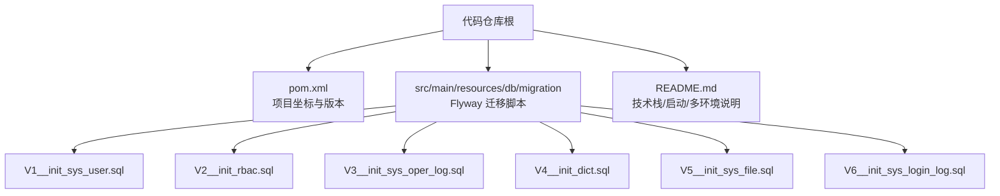
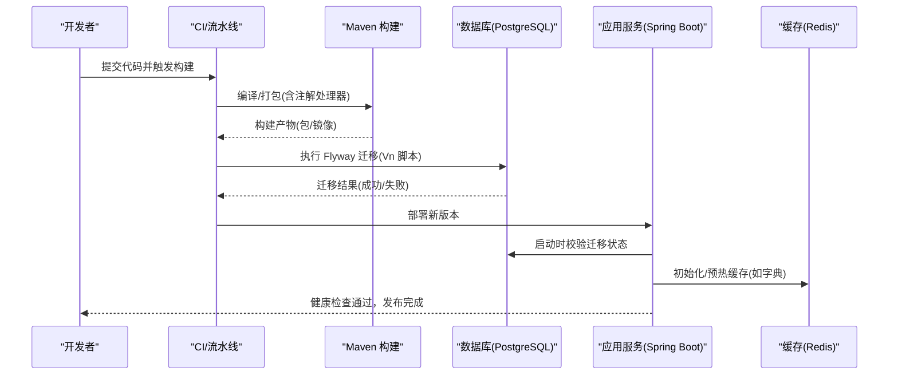
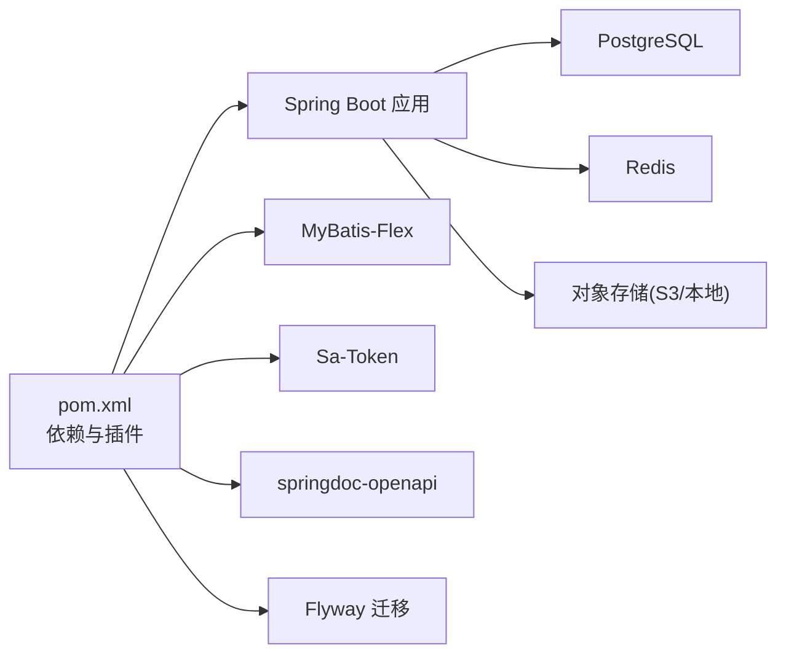

# 版本发布流程

<cite>
**本文引用的文件列表**
- [README.md](file://README.md)
- [pom.xml](file://pom.xml)
- [V1__init_sys_user.sql](file://src/main/resources/db/migration/V1__init_sys_user.sql)
- [V2__init_rbac.sql](file://src/main/resources/db/migration/V2__init_rbac.sql)
- [V3__init_sys_oper_log.sql](file://src/main/resources/db/migration/V3__init_sys_oper_log.sql)
- [V4__init_dict.sql](file://src/main/resources/db/migration/V4__init_dict.sql)
- [V5__init_sys_file.sql](file://src/main/resources/db/migration/V5__init_sys_file.sql)
- [V6__init_sys_login_log.sql](file://src/main/resources/db/migration/V6__init_sys_login_log.sql)
</cite>

## 目录
1. [引言](#引言)
2. [项目结构](#项目结构)
3. [核心组件](#核心组件)
4. [架构总览](#架构总览)
5. [详细组件分析](#详细组件分析)
6. [依赖关系分析](#依赖关系分析)
7. [性能与稳定性考量](#性能与稳定性考量)
8. [故障排查指南](#故障排查指南)
9. [结论](#结论)
10. [附录：发布检查清单与回滚策略](#附录发布检查清单与回滚策略)

## 引言
本文件面向团队制定标准化的版本发布流程与变更管理策略，覆盖语义化版本控制（SemVer）、发布候选（RC）流程、数据库迁移脚本的版本管理（Flyway）、变更日志维护要求、发布检查清单以及发布回滚与紧急修复机制。文档同时结合仓库现有工程结构与工具链（Maven、Spring Boot、Flyway、PostgreSQL、Redis），给出可落地的操作指引。

## 项目结构
本项目采用六边形架构（Hexagonal Architecture），分层清晰，便于在发布过程中进行隔离验证与回归测试。关键与发布相关的要素包括：
- Maven 构建与版本定义位于 pom.xml
- 数据库迁移脚本集中存放于 src/main/resources/db/migration，遵循 Flyway 命名规范
- README 提供快速开始、环境配置与模块说明，可作为发布前后核对的参考

图表来源
- [pom.xml:1-217](file://pom.xml#L1-L217)
- [README.md:1-182](file://README.md#L1-L182)
- [V1__init_sys_user.sql:1-51](file://src/main/resources/db/migration/V1__init_sys_user.sql#L1-L51)
- [V2__init_rbac.sql:1-158](file://src/main/resources/db/migration/V2__init_rbac.sql#L1-L158)
- [V3__init_sys_oper_log.sql:1-45](file://src/main/resources/db/migration/V3__init_sys_oper_log.sql#L1-L45)
- [V4__init_dict.sql:1-95](file://src/main/resources/db/migration/V4__init_dict.sql#L1-L95)
- [V5__init_sys_file.sql:1-43](file://src/main/resources/db/migration/V5__init_sys_file.sql#L1-L43)
- [V6__init_sys_login_log.sql:1-42](file://src/main/resources/db/migration/V6__init_sys_login_log.sql#L1-L42)

章节来源
- [README.md:1-182](file://README.md#L1-L182)
- [pom.xml:1-217](file://pom.xml#L1-L217)

## 核心组件
- 版本与构建
  - 使用 Maven 管理项目坐标与依赖，版本号定义在 pom.xml 中，包含 SNAPSHOT 与正式版本的切换约定。
- 数据库迁移
  - 使用 Flyway 执行数据库迁移，脚本位于 db/migration，按 Vn__描述.sql 命名，应用启动时自动执行未执行的迁移。
- 运行与环境
  - 通过 Spring Boot 启动，支持 dev/prod/test 等多环境配置；集成 PostgreSQL 与 Redis。

章节来源
- [pom.xml:1-217](file://pom.xml#L1-L217)
- [README.md:76-83](file://README.md#L76-L83)

## 架构总览
从发布视角看，系统由“代码构建产物 + 数据库迁移”两部分组成。发布流程围绕这两部分展开：先确保代码构建稳定，再按顺序推进数据库迁移，最后完成灰度与全量发布。

图表来源
- [pom.xml:153-214](file://pom.xml#L153-L214)
- [README.md:64-73](file://README.md#L64-L73)
- [V1__init_sys_user.sql:1-51](file://src/main/resources/db/migration/V1__init_sys_user.sql#L1-L51)
- [V2__init_rbac.sql:1-158](file://src/main/resources/db/migration/V2__init_rbac.sql#L1-L158)
- [V3__init_sys_oper_log.sql:1-45](file://src/main/resources/db/migration/V3__init_sys_oper_log.sql#L1-L45)
- [V4__init_dict.sql:1-95](file://src/main/resources/db/migration/V4__init_dict.sql#L1-L95)
- [V5__init_sys_file.sql:1-43](file://src/main/resources/db/migration/V5__init_sys_file.sql#L1-L43)
- [V6__init_sys_login_log.sql:1-42](file://src/main/resources/db/migration/V6__init_sys_login_log.sql#L1-L42)

## 详细组件分析

### 版本与分支策略（SemVer）
- 版本号格式：主版本.次版本.修订版本[-预发布标识]
  - 主版本：破坏性变更（API/数据模型不兼容）
  - 次版本：新增功能（向后兼容）
  - 修订版本：缺陷修复（向后兼容）
  - 预发布：RC、Beta、Alpha 等（用于发布候选）
- 分支建议
  - main/master：生产可用版本
  - develop：集成开发分支
  - feature/*：功能分支
  - release/*：发布分支（打 RC 标签）
  - hotfix/*：紧急修复分支
- 标签与发布
  - 使用 Git Tag 标记版本，如 v1.2.3、v1.2.4-rc.1
  - 正式发布前在 release 分支上完成所有验证，合并至 main 并打正式标签

章节来源
- [pom.xml:12-14](file://pom.xml#L12-L14)

### 发布候选（RC）流程
- 创建 RC 版本
  - 基于 release 分支创建 RC 标签（如 v1.2.4-rc.1）
  - 在 CI 中执行完整构建与测试套件
- 测试验证
  - 单元测试、集成测试、接口自动化测试
  - 针对数据库迁移脚本进行正向与回滚演练
- 问题修复与回归
  - 仅允许最小改动修复，回归通过后重新打 RC 标签（递增后缀）
- 最终发布
  - 将 release 分支合并到 main，删除 RC 后缀，打正式版本标签
  - 生成发布说明（变更日志摘要）

章节来源
- [pom.xml:153-214](file://pom.xml#L153-L214)
- [README.md:129-146](file://README.md#L129-L146)

### 数据库迁移脚本版本管理（Flyway）
- 命名规范
  - 文件名格式：V{版本号}__描述.sql
  - 示例：V1__init_sys_user.sql、V2__init_rbac.sql、V3__init_sys_oper_log.sql、V4__init_dict.sql、V5__init_sys_file.sql、V6__init_sys_login_log.sql
- 向后兼容性保证
  - 优先采用增量式变更（新增列、默认值、新表）
  - 避免直接删除或重命名列/表；如需变更，分阶段实施（先加字段+迁移数据，再下线旧字段）
  - 索引与约束变更需评估锁与性能影响，尽量在低峰期执行
- 回滚策略
  - 为每个迁移准备对应的反向脚本（可在独立目录或注释中保留），以便紧急回滚
  - 回滚步骤：停止应用 → 执行反向脚本 → 回退应用版本 → 验证数据一致性
- 执行时机
  - 应用启动时由 Flyway 自动执行未应用的迁移；发布前需在目标库预演

章节来源
- [README.md:95](file://README.md#L95)
- [V1__init_sys_user.sql:1-51](file://src/main/resources/db/migration/V1__init_sys_user.sql#L1-L51)
- [V2__init_rbac.sql:1-158](file://src/main/resources/db/migration/V2__init_rbac.sql#L1-L158)
- [V3__init_sys_oper_log.sql:1-45](file://src/main/resources/db/migration/V3__init_sys_oper_log.sql#L1-L45)
- [V4__init_dict.sql:1-95](file://src/main/resources/db/migration/V4__init_dict.sql#L1-L95)
- [V5__init_sys_file.sql:1-43](file://src/main/resources/db/migration/V5__init_sys_file.sql#L1-L43)
- [V6__init_sys_login_log.sql:1-42](file://src/main/resources/db/migration/V6__init_sys_login_log.sql#L1-L42)

### 变更日志维护要求
- 文件位置与格式
  - 建议在仓库根目录维护 CHANGELOG.md，采用 Keep a Changelog 风格
  - 分类条目：新增、修改、废弃、移除、修复、安全
- 重要更新标注
  - 对破坏性变更、重大优化、安全修复进行显著标注
- 版本关联
  - 每个版本区块对应一个 Git Tag，记录发布日期与主要贡献者
- 发布同步
  - 发布前完成变更日志更新，随发布说明一并归档

章节来源
- [pom.xml:12-14](file://pom.xml#L12-L14)

### 发布检查清单
- 代码质量
  - 静态扫描通过、无严重告警
  - 单元测试覆盖率达标、集成测试全部通过
- 安全扫描
  - 依赖漏洞扫描无高危项
  - 敏感信息（密钥、密码）不落盘，使用环境变量注入
- 性能与容量
  - 压测通过，关注慢查询与热点键
  - 数据库索引与统计信息已更新
- 文档与配置
  - API 文档（Swagger）与用户手册同步更新
  - 多环境配置（dev/prod/test）校验无误
- 发布前置
  - 数据库迁移脚本已在预发环境验证
  - 回滚脚本与操作步骤就绪

章节来源
- [README.md:64-83](file://README.md#L64-L83)
- [README.md:129-146](file://README.md#L129-L146)
- [pom.xml:153-214](file://pom.xml#L153-L214)

### 发布回滚流程与紧急修复处理
- 常规回滚
  - 应用回退：回退到上一个稳定版本
  - 数据回退：执行对应迁移的反向脚本（谨慎评估数据一致性）
- 紧急修复（Hotfix）
  - 从 main 拉取 hotfix 分支，最小范围修复
  - 快速回归后打补丁版本标签（如 v1.2.5）
  - 合并回 main 与 develop，同步变更日志
- 回滚决策
  - 以业务影响面与恢复时间为目标，必要时先回滚应用，再逐步修复数据

章节来源
- [README.md:64-83](file://README.md#L64-L83)
- [pom.xml:153-214](file://pom.xml#L153-L214)

## 依赖关系分析
- 构建与插件
  - 使用 spring-boot-maven-plugin 打包
  - maven-compiler-plugin 配置注解处理器（Lombok、MapStruct、MyBatis-Flex）
- 运行时依赖
  - Spring Boot 4.x、MyBatis-Flex、Sa-Token、springdoc-openapi、AWS SDK v2（S3）
  - 数据库驱动 PostgreSQL、Flyway（spring-boot-starter-flyway + flyway-database-postgresql）
- 外部服务
  - Redis（会话、分布式锁、字典缓存）
  - 对象存储（本地磁盘或 S3 协议兼容服务）

图表来源
- [pom.xml:28-151](file://pom.xml#L28-L151)
- [pom.xml:153-214](file://pom.xml#L153-L214)

章节来源
- [pom.xml:28-151](file://pom.xml#L28-L151)
- [pom.xml:153-214](file://pom.xml#L153-L214)

## 性能与稳定性考量
- 数据库迁移
  - 大表变更建议分批执行，避免长时间锁表
  - 迁移前后对比执行计划，确保索引有效
- 缓存策略
  - 字典等热点数据使用 Redis 缓存，写操作后及时失效
- 连接池与线程池
  - 根据压测结果调整连接池大小与异步线程池参数
- 监控与告警
  - 关注启动耗时、迁移耗时、错误率与慢请求

[本节为通用指导，无需特定文件引用]

## 故障排查指南
- 启动失败
  - 检查数据库与 Redis 连通性与权限
  - 查看 Flyway 迁移日志，确认脚本执行顺序与语法
- 鉴权异常
  - 检查 Sa-Token 配置与 Redis 中的 token 状态
- 文件上传/下载异常
  - 校验对象存储配置（端点、区域、桶名、路径风格）
- 日志定位
  - 使用 traceId 链路追踪，结合操作日志与登录日志定位问题

章节来源
- [README.md:119-128](file://README.md#L119-L128)
- [V3__init_sys_oper_log.sql:1-45](file://src/main/resources/db/migration/V3__init_sys_oper_log.sql#L1-L45)
- [V6__init_sys_login_log.sql:1-42](file://src/main/resources/db/migration/V6__init_sys_login_log.sql#L1-L42)

## 结论
通过统一的 SemVer 版本管理、严格的 RC 流程、规范的 Flyway 迁移脚本与完善的发布检查清单，可以显著提升发布的可控性与可回溯性。配合回滚与紧急修复机制，能够在保障业务连续性的前提下快速响应问题。

[本节为总结性内容，无需特定文件引用]

## 附录：发布检查清单与回滚策略

### 发布检查清单（建议逐项勾选）
- 代码与构建
  - 静态扫描通过、单元测试/集成测试全部通过
  - 构建产物签名与校验和生成
- 安全与合规
  - 依赖漏洞扫描无高危项
  - 敏感配置通过环境变量注入，不落盘
- 数据库迁移
  - 预发环境迁移演练成功
  - 回滚脚本准备齐全
- 性能与容量
  - 压测报告达标，慢查询已优化
- 文档与通知
  - API 文档与用户手册更新
  - 发布说明与变更日志同步

章节来源
- [README.md:64-83](file://README.md#L64-L83)
- [README.md:129-146](file://README.md#L129-L146)
- [pom.xml:153-214](file://pom.xml#L153-L214)

### 回滚策略（数据库与应用）
- 应用回滚
  - 回退到上一稳定版本，保持数据库不变
- 数据回滚
  - 执行对应迁移的反向脚本，注意事务与一致性
- 回滚验证
  - 冒烟测试通过，核心指标恢复正常

章节来源
- [README.md:64-83](file://README.md#L64-L83)