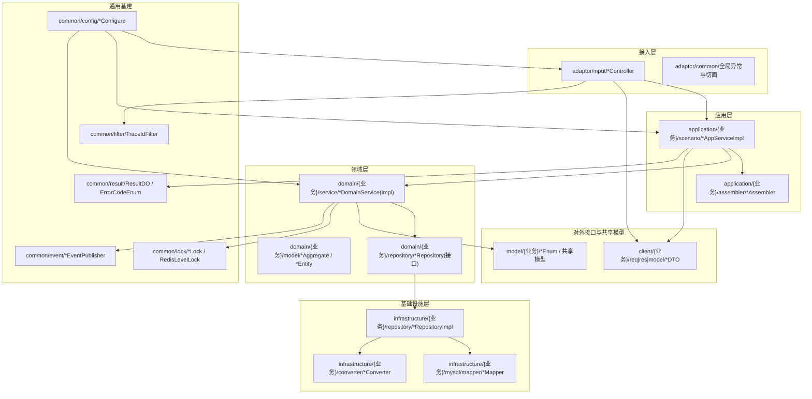
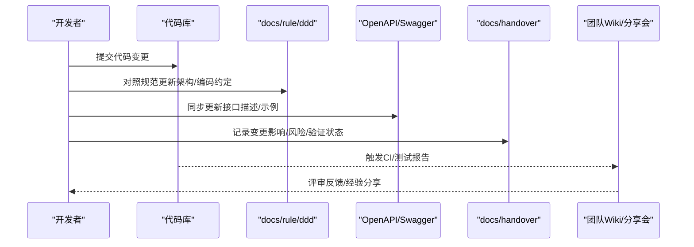
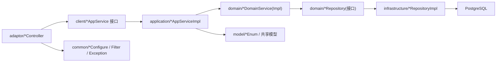
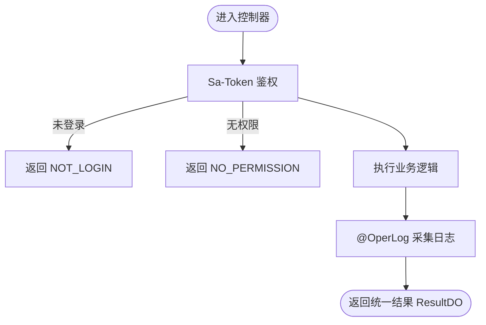

# 知识传承方法

<cite>
**本文引用的文件列表**
- [README.md](file://README.md)
- [spring-ddd-template-fixes-handover.md](file://docs/handover/spring-ddd-template-fixes-handover.md)
- [ddd README.md](file://docs/rule/ddd/README.md)
- [ddd-adaptor-layer.md](file://docs/rule/ddd/ddd-adaptor-layer.md)
- [ddd-model-layer.md](file://docs/rule/ddd/ddd-model-layer.md)
- [frontend-development-guide.md](file://docs/frontend-development-guide.md)
- [OperLog.java](file://src/main/java/com/sunnao/spring/ddd/template/common/annotation/OperLog.java)
- [GlobalExceptionHandler.java](file://src/main/java/com/sunnao/spring/ddd/template/adaptor/common/GlobalExceptionHandler.java)
- [OpenApiConfig.java](file://src/main/java/com/sunnao/spring/ddd/template/common/config/OpenApiConfig.java)
</cite>

## 目录
1. [引言](#引言)
2. [项目结构](#项目结构)
3. [核心组件](#核心组件)
4. [架构总览](#架构总览)
5. [详细组件分析](#详细组件分析)
6. [依赖关系分析](#依赖关系分析)
7. [性能与稳定性考量](#性能与稳定性考量)
8. [故障排查指南](#故障排查指南)
9. [结论](#结论)
10. [附录：交接清单与流程](#附录交接清单与流程)

## 引言
本文件面向“系统化的项目交接和知识传承机制”，结合仓库现有文档与代码，沉淀以下能力：
- 文档维护要求：架构文档更新规范、API 文档同步机制、变更记录维护标准
- 代码注释规范：类与方法注释要求、复杂业务逻辑说明、技术决策记录
- 技术分享机制：定期技术分享会、内部 Wiki 建设、经验总结沉淀
- 新人入职指导：环境搭建指南、开发流程培训、常见问题解答
- 知识转移检查清单：核心模块讲解、架构设计说明、运维注意事项
- 离职交接流程：代码权限回收、文档移交、待办事项确认
- 参考本项目已有的交接文档格式与最佳实践

## 项目结构
本项目采用六边形架构（Hexagonal Architecture），分层清晰、职责明确。顶层入口为 adaptor 层 Controller，应用层进行场景编排，领域层承载业务规则，基础设施层实现持久化与外部适配。对外接口定义在 client 层，共享模型在 model 层，通用基建在 common 层。

图示来源
- [README.md:19-46](file://README.md#L19-L46)
- [ddd README.md:50-81](file://docs/rule/ddd/README.md#L50-L81)

章节来源
- [README.md:19-46](file://README.md#L19-L46)
- [ddd README.md:50-81](file://docs/rule/ddd/README.md#L50-L81)

## 核心组件
围绕知识传承，需要重点对齐的组件与约定如下：
- 统一结果与错误码：全链路不抛异常，统一返回 ResultDO；错误码集中管理，前端按错误码做差异化处理
- 鉴权与审计：Sa-Token 鉴权 + 操作日志注解 @OperLog 采集，便于追溯与复盘
- API 文档：OpenAPI/Swagger 配置，提供在线调试入口
- 分布式锁与事件：Redis/JVM 分级锁、领域事件发布订阅，支撑高并发与解耦
- 多环境配置：dev/prod/test 三套配置，生产关闭 Swagger，敏感信息走环境变量

章节来源
- [README.md:37-46](file://README.md#L37-L46)
- [README.md:119-128](file://README.md#L119-L128)
- [OpenApiConfig.java:11-41](file://src/main/java/com/sunnao/spring/ddd/template/common/config/OpenApiConfig.java#L11-L41)
- [OperLog.java:1-26](file://src/main/java/com/sunnao/spring/ddd/template/common/annotation/OperLog.java#L1-L26)
- [frontend-development-guide.md:49-81](file://docs/frontend-development-guide.md#L49-L81)

## 架构总览
从“知识传承”视角，建议将架构文档、接口契约、变更记录三者联动，形成闭环：
- 架构文档：以 docs/rule/ddd 为权威来源，新增/变更需对照规范评审
- API 文档：以 OpenAPI 为准，前后端共同维护，变更必须同步更新
- 变更记录：以 docs/handover 风格沉淀修复项、遗留项与后续建议，作为交接依据

[此图为概念性流程图，无需图示来源]

## 详细组件分析

### 文档维护要求
- 架构文档更新规范
  - 新增/调整模块时，需在 docs/rule/ddd 对应层级规范中补充包结构、命名、依赖关系与调用链
  - 若引入新的适配器或外部依赖，需在 adaptor 层规范中补充输出适配器的定义与转换策略
  - 涉及共享模型变化时，遵循 model 层依赖约束，确保 client 层自包含
- API 文档同步机制
  - 所有对外接口变更需同步更新 OpenAPI 描述，并在 README 中保持路由前缀与模块说明一致
  - 前端对接文档（docs/frontend-development-guide.md）应随后端接口版本同步更新，避免前后端割裂
- 变更记录维护标准
  - 参照 docs/handover 模板，按优先级（P0/P1/M/L）记录问题、修复方案、关键文件、验证状态与后续建议
  - 每次迭代结束，汇总关键配置变更、兼容性影响与回滚预案

章节来源
- [ddd README.md:17-28](file://docs/rule/ddd/README.md#L17-L28)
- [ddd-adaptor-layer.md:16-35](file://docs/rule/ddd/ddd-adaptor-layer.md#L16-L35)
- [ddd-model-layer.md:14-29](file://docs/rule/ddd/ddd-model-layer.md#L14-L29)
- [spring-ddd-template-fixes-handover.md:1-17](file://docs/handover/spring-ddd-template-fixes-handover.md#L1-L17)
- [frontend-development-guide.md:1-10](file://docs/frontend-development-guide.md#L1-L10)

### 代码注释规范
- 类与方法注释要求
  - 公共注解与配置类需说明用途、使用方式与注意事项（如 OperLog、OpenApiConfig）
  - 全局异常处理器需说明兜底策略与安全边界（如 GlobalExceptionHandler）
- 复杂业务逻辑说明
  - 写模式标准流程（锁 → 聚合根 → 持久化）应在领域服务与仓储实现处补充时序与事务边界说明
  - 跨仓储组合操作需标注事务传播与回滚范围，避免嵌套事务导致的不一致
- 技术决策记录
  - 对安全开关（如 XFF 信任）、锁实现切换（redis/jvm）、缓存失效时机等决策，应在变更记录中说明背景、权衡与风险

章节来源
- [OperLog.java:1-26](file://src/main/java/com/sunnao/spring/ddd/template/common/annotation/OperLog.java#L1-L26)
- [OpenApiConfig.java:11-41](file://src/main/java/com/sunnao/spring/ddd/template/common/config/OpenApiConfig.java#L11-L41)
- [GlobalExceptionHandler.java:17-96](file://src/main/java/com/sunnao/spring/ddd/template/adaptor/common/GlobalExceptionHandler.java#L17-L96)
- [spring-ddd-template-fixes-handover.md:141-152](file://docs/handover/spring-ddd-template-fixes-handover.md#L141-L152)

### 技术分享机制
- 定期技术分享会
  - 基于变更记录与线上问题复盘，组织专题分享（如事务一致性、缓存一致性、安全加固）
- 内部 Wiki 建设
  - 将 docs/rule/ddd 与 docs/handover 纳入团队 Wiki，建立“规范—案例—复盘”的知识体系
- 经验总结沉淀
  - 将常见坑点与最佳实践沉淀为条目，纳入新人入职手册与交接清单

[本节为通用方法论，不直接分析具体文件，故无章节来源]

### 新人入职指导
- 环境搭建指南
  - 启动本地依赖（PostgreSQL 17 + Redis 7），通过 docker compose 一键拉起
  - 使用 Maven Wrapper 运行应用，默认 dev 环境自动建表并写入种子数据
  - 访问 Swagger UI 进行接口调试，使用种子管理员账号登录
- 开发流程培训
  - 新增模块步骤：迁移脚本 → domain → infrastructure → client → application → adaptor → 测试
  - 统一结果与错误码、请求 DTO 自校验、Assembler/Converter 分离、写模式标准流程
- 常见问题解答
  - 未登录/无权限/参数错误/资源不存在等异常的统一响应结构与前端处理建议
  - 生产环境关闭 Swagger、敏感配置走环境变量

章节来源
- [README.md:47-82](file://README.md#L47-L82)
- [README.md:148-168](file://README.md#L148-L168)
- [frontend-development-guide.md:13-30](file://docs/frontend-development-guide.md#L13-L30)
- [frontend-development-guide.md:49-81](file://docs/frontend-development-guide.md#L49-L81)

### 知识转移检查清单
- 核心模块讲解
  - 认证、用户、角色（RBAC）、字典、操作日志、文件上传、在线用户
- 架构设计说明
  - 六边形架构、四种开发模式、Adaptor 接口定义原则、Model 层依赖约束
- 运维注意事项
  - 多环境配置差异、Swagger 开关、线程池拒绝策略、XFF 可信代理开关、锁类型切换

章节来源
- [README.md:84-118](file://README.md#L84-L118)
- [ddd README.md:83-91](file://docs/rule/ddd/README.md#L83-L91)
- [ddd-adaptor-layer.md:36-52](file://docs/rule/ddd/ddd-adaptor-layer.md#L36-L52)
- [ddd-model-layer.md:14-29](file://docs/rule/ddd/ddd-model-layer.md#L14-L29)
- [spring-ddd-template-fixes-handover.md:127-152](file://docs/handover/spring-ddd-template-fixes-handover.md#L127-L152)

### 离职交接流程
- 代码权限回收
  - 根据 RBAC 权限矩阵，回收相应角色的权限点；必要时强制下线会话
- 文档移交
  - 移交最新版的 docs/handover 变更记录、docs/rule/ddd 规范、前端需求文档
- 待办事项确认
  - 逐项核对遗留项、后续建议与风险，确保接收方理解上下文与影响面

章节来源
- [frontend-development-guide.md:336-351](file://docs/frontend-development-guide.md#L336-L351)
- [spring-ddd-template-fixes-handover.md:165-176](file://docs/handover/spring-ddd-template-fixes-handover.md#L165-L176)

## 依赖关系分析
- 组件耦合与内聚
  - adaptor 仅依赖 client 层 AppService 接口，禁止绕过应用层直接调用领域层
  - application 层负责 DTO ↔ 领域对象转换，不写业务规则
  - domain 层零技术依赖，仓储只定义接口，实现位于 infrastructure
- 外部依赖与集成点
  - Sa-Token 鉴权、Flyway 数据库迁移、springdoc-openapi 文档、Redis 会话与锁
- 潜在循环依赖
  - 严格遵循分层依赖方向，避免反向引用；model 层被上层允许依赖，client 层禁止依赖 model

图示来源
- [README.md:19-46](file://README.md#L19-L46)
- [ddd README.md:50-81](file://docs/rule/ddd/README.md#L50-L81)

章节来源
- [README.md:19-46](file://README.md#L19-L46)
- [ddd README.md:50-81](file://docs/rule/ddd/README.md#L50-L81)

## 性能与稳定性考量
- 分布式锁
  - 支持 redis/jvm 两种实现，按 app.lock.type 切换；JVM 级锁已优化引用计数防泄漏
- 异步与背压
  - 异步任务线程池设置 CallerRunsPolicy，队列满时由提交线程执行，提供背压保护
- 缓存一致性
  - 字典缓存失效延迟到事务提交后，降低并发读脏数据概率；高并发可考虑双删策略兜底
- 安全加固
  - 登录防爆破（失败次数与锁定时间可配）、XFF 可信代理开关默认关闭、生产关闭 Swagger

章节来源
- [spring-ddd-template-fixes-handover.md:71-102](file://docs/handover/spring-ddd-template-fixes-handover.md#L71-L102)
- [spring-ddd-template-fixes-handover.md:127-152](file://docs/handover/spring-ddd-template-fixes-handover.md#L127-L152)
- [spring-ddd-template-fixes-handover.md:109-113](file://docs/handover/spring-ddd-template-fixes-handover.md#L109-L113)

## 故障排查指南
- 全局异常处理
  - 未登录、角色/权限不足、请求体解析失败、参数类型不匹配、资源不存在、系统异常均有统一处理与错误码
- 操作日志
  - 写接口标注 @OperLog，自动采集 traceId、操作人、URI、参数摘要、结果码、耗时、IP，便于定位问题
- 接口文档
  - OpenAPI 配置了 sa-token 鉴权头，可在 Swagger UI 右上角 Authorize 填入 token 调试受保护接口

图示来源
- [GlobalExceptionHandler.java:17-96](file://src/main/java/com/sunnao/spring/ddd/template/adaptor/common/GlobalExceptionHandler.java#L17-L96)
- [OperLog.java:1-26](file://src/main/java/com/sunnao/spring/ddd/template/common/annotation/OperLog.java#L1-L26)
- [OpenApiConfig.java:11-41](file://src/main/java/com/sunnao/spring/ddd/template/common/config/OpenApiConfig.java#L11-L41)

章节来源
- [GlobalExceptionHandler.java:17-96](file://src/main/java/com/sunnao/spring/ddd/template/adaptor/common/GlobalExceptionHandler.java#L17-L96)
- [OperLog.java:1-26](file://src/main/java/com/sunnao/spring/ddd/template/common/annotation/OperLog.java#L1-L26)
- [OpenApiConfig.java:11-41](file://src/main/java/com/sunnao/spring/ddd/template/common/config/OpenApiConfig.java#L11-L41)

## 结论
通过“规范—文档—记录—分享—交接”的闭环机制，可将项目知识有效沉淀与传承。建议将本文件纳入团队知识库，并结合 docs/rule/ddd 与 docs/handover 持续完善，确保新人与接手者能快速上手、稳定交付。

[本节为总结性内容，不直接分析具体文件，故无章节来源]

## 附录：交接清单与流程

### 文档维护要求清单
- 架构文档更新
  - 新增/调整模块时，对照 docs/rule/ddd 各层规范更新包结构、命名与依赖关系
  - 引入外部服务时，在 adaptor 层规范中补充输出适配器定义与转换策略
- API 文档同步
  - 接口变更同步更新 OpenAPI 描述，并在 README 中保持一致
  - 前端需求文档随后端接口版本同步更新
- 变更记录维护
  - 按 docs/handover 模板记录问题、修复、验证与后续建议，形成可追踪的交接材料

章节来源
- [ddd README.md:17-28](file://docs/rule/ddd/README.md#L17-L28)
- [ddd-adaptor-layer.md:36-52](file://docs/rule/ddd/ddd-adaptor-layer.md#L36-L52)
- [frontend-development-guide.md:1-10](file://docs/frontend-development-guide.md#L1-L10)
- [spring-ddd-template-fixes-handover.md:1-17](file://docs/handover/spring-ddd-template-fixes-handover.md#L1-L17)

### 代码注释规范清单
- 类与方法注释
  - 公共注解、配置类、异常处理器需说明用途、使用方式与安全边界
- 复杂业务逻辑说明
  - 写模式标准流程、跨仓储事务、缓存失效时机等需补充时序与边界说明
- 技术决策记录
  - 安全开关、锁实现、缓存策略等决策需在变更记录中说明背景与风险

章节来源
- [OperLog.java:1-26](file://src/main/java/com/sunnao/spring/ddd/template/common/annotation/OperLog.java#L1-L26)
- [OpenApiConfig.java:11-41](file://src/main/java/com/sunnao/spring/ddd/template/common/config/OpenApiConfig.java#L11-L41)
- [GlobalExceptionHandler.java:17-96](file://src/main/java/com/sunnao/spring/ddd/template/adaptor/common/GlobalExceptionHandler.java#L17-L96)
- [spring-ddd-template-fixes-handover.md:141-152](file://docs/handover/spring-ddd-template-fixes-handover.md#L141-L152)

### 技术分享机制清单
- 定期技术分享会：基于变更记录与线上问题复盘
- 内部 Wiki 建设：规范—案例—复盘三位一体
- 经验总结沉淀：常见问题与最佳实践条目化

[本节为通用方法论，不直接分析具体文件，故无章节来源]

### 新人入职指导清单
- 环境搭建：docker compose 拉起依赖，Maven Wrapper 运行，Swagger 调试
- 开发流程：新增模块步骤、统一结果与错误码、写模式标准流程
- 常见问题：统一异常响应、生产环境配置、安全开关

章节来源
- [README.md:47-82](file://README.md#L47-L82)
- [README.md:148-168](file://README.md#L148-L168)
- [frontend-development-guide.md:13-30](file://docs/frontend-development-guide.md#L13-L30)
- [frontend-development-guide.md:49-81](file://docs/frontend-development-guide.md#L49-L81)

### 知识转移检查清单
- 核心模块讲解：认证、用户、角色、字典、日志、文件、在线用户
- 架构设计说明：六边形架构、四种开发模式、Adaptor 接口定义、Model 层依赖约束
- 运维注意事项：多环境配置、Swagger 开关、线程池拒绝策略、XFF 可信代理、锁类型切换

章节来源
- [README.md:84-118](file://README.md#L84-L118)
- [ddd README.md:83-91](file://docs/rule/ddd/README.md#L83-L91)
- [ddd-adaptor-layer.md:36-52](file://docs/rule/ddd/ddd-adaptor-layer.md#L36-L52)
- [ddd-model-layer.md:14-29](file://docs/rule/ddd/ddd-model-layer.md#L14-L29)
- [spring-ddd-template-fixes-handover.md:127-152](file://docs/handover/spring-ddd-template-fixes-handover.md#L127-L152)

### 离职交接流程清单
- 代码权限回收：按 RBAC 矩阵回收权限点，必要时强制下线会话
- 文档移交：变更记录、架构规范、前端需求文档
- 待办事项确认：遗留项、后续建议与风险逐项确认

章节来源
- [frontend-development-guide.md:336-351](file://docs/frontend-development-guide.md#L336-L351)
- [spring-ddd-template-fixes-handover.md:165-176](file://docs/handover/spring-ddd-template-fixes-handover.md#L165-L176)