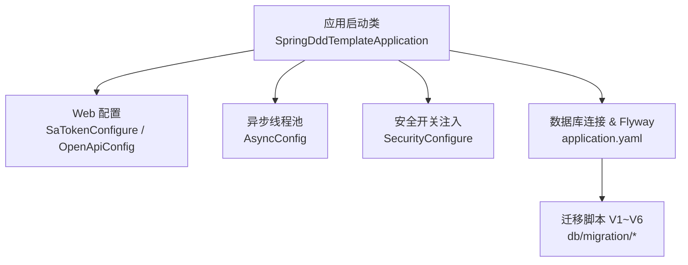
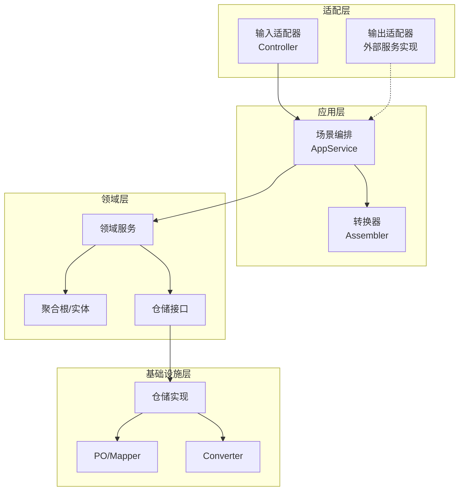
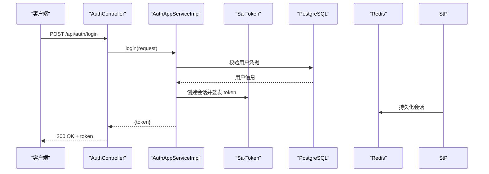
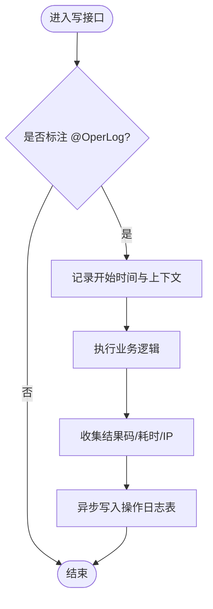
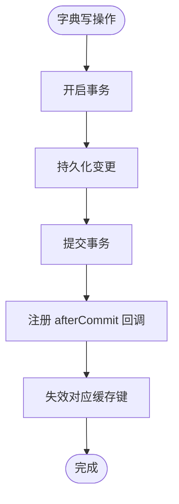
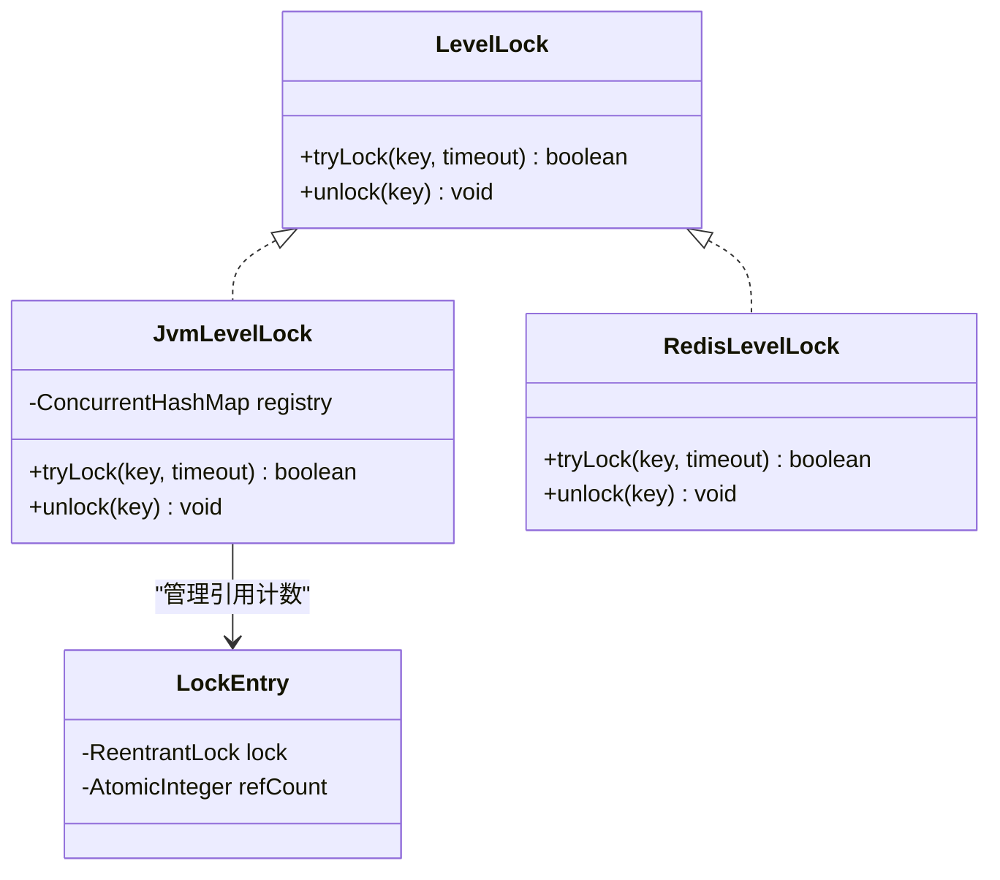
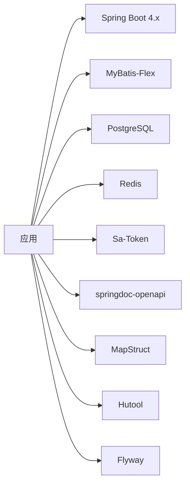

# 开发指南

<cite>
**本文引用的文件**   
- [README.md](file://README.md)
- [pom.xml](file://pom.xml)
- [application.yaml](file://src/main/resources/application.yaml)
- [SpringDddTemplateApplication.java](file://src/main/java/com/sunnao/spring/ddd/template/SpringDddTemplateApplication.java)
- [GlobalExceptionHandler.java](file://src/main/java/com/sunnao/spring/ddd/template/adaptor/common/GlobalExceptionHandler.java)
- [SaTokenConfigure.java](file://src/main/java/com/sunnao/spring/ddd/template/common/config/SaTokenConfigure.java)
- [SecurityConfigure.java](file://src/main/java/com/sunnao/spring/ddd/template/common/config/SecurityConfigure.java)
- [AsyncConfig.java](file://src/main/java/com/sunnao/spring/ddd/template/common/config/AsyncConfig.java)
- [OpenApiConfig.java](file://src/main/java/com/sunnao/spring/ddd/template/common/config/OpenApiConfig.java)
- [V1__init_sys_user.sql](file://src/main/resources/db/migration/V1__init_sys_user.sql)
- [V2__init_rbac.sql](file://src/main/resources/db/migration/V2__init_rbac.sql)
- [V3__init_sys_oper_log.sql](file://src/main/resources/db/migration/V3__init_sys_oper_log.sql)
- [V4__init_dict.sql](file://src/main/resources/db/migration/V4__init_dict.sql)
- [V5__init_sys_file.sql](file://src/main/resources/db/migration/V5__init_sys_file.sql)
- [V6__init_sys_login_log.sql](file://src/main/resources/db/migration/V6__init_sys_login_log.sql)
- [DDD 规范总览 README.md](file://docs/rule/ddd/README.md)
- [代码修复交接文档.md](file://docs/handover/spring-ddd-template-fixes-handover.md)
</cite>

## 目录
1. [简介](#简介)
2. [项目结构](#项目结构)
3. [核心组件](#核心组件)
4. [架构总览](#架构总览)
5. [详细组件分析](#详细组件分析)
6. [依赖分析](#依赖分析)
7. [性能考虑](#性能考虑)
8. [故障排除指南](#故障排除指南)
9. [结论](#结论)
10. [附录](#附录)

## 简介
本指南面向开发团队，提供从环境搭建、编码规范、新功能开发流程、协作与发布到问题排查与知识传承的完整实践说明。项目基于六边形架构（Hexagonal Architecture）与 DDD 分层思想，内置用户、认证、RBAC、字典、操作日志、文件上传等模块，便于快速扩展新业务域。

## 项目结构
- 包组织遵循“按层 + 按领域”的双维度划分：adaptor、application、client、domain、infrastructure、model、common。
- 启动类扫描基础设施层的 Mapper 包路径；Flyway 自动执行 db/migration 下的迁移脚本；springdoc-openapi 提供 /swagger-ui.html 文档入口。
- 多环境配置通过 application.yaml 与外部 .env 文件组合加载，支持 dev/prod/test 三套配置。

**图示来源** 
- [SpringDddTemplateApplication.java:7-13](file://src/main/java/com/sunnao/spring/ddd/template/SpringDddTemplateApplication.java#L7-L13)
- [SaTokenConfigure.java:17-30](file://src/main/java/com/sunnao/spring/ddd/template/common/config/SaTokenConfigure.java#L17-L30)
- [OpenApiConfig.java:18-41](file://src/main/java/com/sunnao/spring/ddd/template/common/config/OpenApiConfig.java#L18-L41)
- [AsyncConfig.java:23-40](file://src/main/java/com/sunnao/spring/ddd/template/common/config/AsyncConfig.java#L23-L40)
- [SecurityConfigure.java:15-28](file://src/main/java/com/sunnao/spring/ddd/template/common/config/SecurityConfigure.java#L15-L28)
- [application.yaml:1-36](file://src/main/resources/application.yaml#L1-L36)
- [V1__init_sys_user.sql:1-51](file://src/main/resources/db/migration/V1__init_sys_user.sql#L1-L51)
- [V2__init_rbac.sql:1-158](file://src/main/resources/db/migration/V2__init_rbac.sql#L1-L158)
- [V3__init_sys_oper_log.sql:1-45](file://src/main/resources/db/migration/V3__init_sys_oper_log.sql#L1-L45)
- [V4__init_dict.sql:1-95](file://src/main/resources/db/migration/V4__init_dict.sql#L1-L95)
- [V5__init_sys_file.sql:1-43](file://src/main/resources/db/migration/V5__init_sys_file.sql#L1-L43)
- [V6__init_sys_login_log.sql:1-42](file://src/main/resources/db/migration/V6__init_sys_login_log.sql#L1-L42)

**章节来源**
- [README.md:19-36](file://README.md#L19-L36)
- [README.md:47-83](file://README.md#L47-L83)
- [application.yaml:1-36](file://src/main/resources/application.yaml#L1-L36)
- [SpringDddTemplateApplication.java:7-13](file://src/main/java/com/sunnao/spring/ddd/template/SpringDddTemplateApplication.java#L7-L13)

## 核心组件
- 全局异常处理：统一拦截 Sa-Token 鉴权异常、参数解析异常、资源不存在与未捕获异常，返回标准 ResultDO。
- 认证与鉴权：Sa-Token 拦截器对 /api/** 默认要求登录态，开放登录接口与文档路径；注解级权限控制由 @SaCheckPermission 驱动。
- 安全上下文：X-Forwarded-For 信任开关由 SecurityConfigure 在启动时注入，避免客户端伪造 IP。
- 异步能力：统一线程池 + MDC 透传，保障 traceId 在异步链路中一致。
- API 文档：OpenAPI 集成，请求头携带 sa-token 进行鉴权调试。

**章节来源**
- [GlobalExceptionHandler.java:17-97](file://src/main/java/com/sunnao/spring/ddd/template/adaptor/common/GlobalExceptionHandler.java#L17-L97)
- [SaTokenConfigure.java:17-30](file://src/main/java/com/sunnao/spring/ddd/template/common/config/SaTokenConfigure.java#L17-L30)
- [SecurityConfigure.java:15-28](file://src/main/java/com/sunnao/spring/ddd/template/common/config/SecurityConfigure.java#L15-L28)
- [AsyncConfig.java:23-40](file://src/main/java/com/sunnao/spring/ddd/template/common/config/AsyncConfig.java#L23-L40)
- [OpenApiConfig.java:18-41](file://src/main/java/com/sunnao/spring/ddd/template/common/config/OpenApiConfig.java#L18-L41)

## 架构总览
系统采用六边形架构，调用顺序自外向内：adaptor(input) → application → domain → repository 接口（infrastructure 实现），同时 application 定义对外部服务的接口，由 adaptor(output) 实现，体现依赖倒置。

**图示来源** 
- [README.md:19-36](file://README.md#L19-L36)

## 详细组件分析

### 认证与鉴权流程
- 登录接口无需登录态，其他 /api/** 均需登录；文档路径放行。
- 控制器使用 @SaCheckPermission 细粒度授权，结合 RBAC 种子数据生效。
- 全局异常处理器将未登录、无角色、无权限等异常转换为统一响应。

**图示来源** 
- [SaTokenConfigure.java:17-30](file://src/main/java/com/sunnao/spring/ddd/template/common/config/SaTokenConfigure.java#L17-L30)
- [GlobalExceptionHandler.java:28-56](file://src/main/java/com/sunnao/spring/ddd/template/adaptor/common/GlobalExceptionHandler.java#L28-L56)
- [V1__init_sys_user.sql:48-51](file://src/main/resources/db/migration/V1__init_sys_user.sql#L48-L51)
- [V2__init_rbac.sql:117-146](file://src/main/resources/db/migration/V2__init_rbac.sql#L117-L146)

**章节来源**
- [SaTokenConfigure.java:17-30](file://src/main/java/com/sunnao/spring/ddd/template/common/config/SaTokenConfigure.java#L17-L30)
- [GlobalExceptionHandler.java:28-56](file://src/main/java/com/sunnao/spring/ddd/template/adaptor/common/GlobalExceptionHandler.java#L28-L56)
- [V1__init_sys_user.sql:48-51](file://src/main/resources/db/migration/V1__init_sys_user.sql#L48-L51)
- [V2__init_rbac.sql:117-146](file://src/main/resources/db/migration/V2__init_rbac.sql#L117-L146)

### 操作日志采集流程
- 写接口标注 @OperLog 后，切面记录模块、动作、URI、参数摘要、结果码、耗时、IP 等。
- 异步落库，MDC 透传 traceId，保证链路可追踪。

**图示来源** 
- [AsyncConfig.java:23-40](file://src/main/java/com/sunnao/spring/ddd/template/common/config/AsyncConfig.java#L23-L40)
- [V3__init_sys_oper_log.sql:1-45](file://src/main/resources/db/migration/V3__init_sys_oper_log.sql#L1-L45)

**章节来源**
- [AsyncConfig.java:23-40](file://src/main/java/com/sunnao/spring/ddd/template/common/config/AsyncConfig.java#L23-L40)
- [V3__init_sys_oper_log.sql:1-45](file://src/main/resources/db/migration/V3__init_sys_oper_log.sql#L1-L45)

### 字典缓存一致性
- 读路径优先走 Redis 缓存，按 typeKey 获取启用数据。
- 写路径在事务提交后再失效缓存，避免并发读回写旧值。

**图示来源** 
- [代码修复交接文档.md:109-113](file://docs/handover/spring-ddd-template-fixes-handover.md#L109-L113)

**章节来源**
- [代码修复交接文档.md:109-113](file://docs/handover/spring-ddd-template-fixes-handover.md#L109-L113)

### 分布式锁与内存泄漏防护
- JvmLevelLock 引入引用计数，防止高基数 Key 导致内存泄漏。
- RedisLevelLock 基于 SET NX PX + Lua 释放，适合分布式场景。

**图示来源** 
- [代码修复交接文档.md:71-76](file://docs/handover/spring-ddd-template-fixes-handover.md#L71-L76)

**章节来源**
- [代码修复交接文档.md:71-76](file://docs/handover/spring-ddd-template-fixes-handover.md#L71-L76)

## 依赖分析
- Java 25、Spring Boot 4.x、MyBatis-Flex、PostgreSQL、Redis、Sa-Token、springdoc-openapi、MapStruct、Hutool、Flyway。
- Spring Boot 4.x 不再默认包含 jdbc starter，需显式引入；Flyway 自动装配拆分至独立模块。

**图示来源** 
- [pom.xml:19-151](file://pom.xml#L19-L151)

**章节来源**
- [pom.xml:19-151](file://pom.xml#L19-L151)

## 性能考虑
- 异步任务使用 CallerRunsPolicy 拒绝策略，队列满时由提交线程执行，提供背压保护。
- Redis 连接池大小可按负载调整；字典缓存读写分离，写后延迟失效提升一致性。
- 大文件上传受 spring.servlet.multipart 与 app.file.max-size 双重限制，避免超大请求阻塞。

[本节为通用建议，不直接分析具体文件]

## 故障排除指南
- 未登录/无权限：检查 Sa-Token 拦截器放行路径与 @SaCheckPermission 权限点是否匹配；确认 RBAC 种子数据已初始化。
- 参数解析失败：查看全局异常处理器返回的错误码与提示，核对请求体格式与类型。
- 登录防爆破：若出现锁定错误码，检查 app.security.login-max-failures 与 app.security.login-lock-minutes 配置。
- XFF 可信代理：如 IP 不正确，确认 app.security.trust-x-forwarded-for 是否开启且前置代理正确设置。
- 在线用户分页 total 不一致：参考修复项，确保先过滤无效会话再分页。

**章节来源**
- [GlobalExceptionHandler.java:28-96](file://src/main/java/com/sunnao/spring/ddd/template/adaptor/common/GlobalExceptionHandler.java#L28-L96)
- [SaTokenConfigure.java:17-30](file://src/main/java/com/sunnao/spring/ddd/template/common/config/SaTokenConfigure.java#L17-L30)
- [代码修复交接文档.md:88-102](file://docs/handover/spring-ddd-template-fixes-handover.md#L88-L102)
- [代码修复交接文档.md:121-125](file://docs/handover/spring-ddd-template-fixes-handover.md#L121-L125)

## 结论
本项目以清晰的六边形分层与 DDD 约定为基础，提供了完善的认证鉴权、日志审计、缓存一致性、分布式锁与异步链路追踪等横切能力。配合规范的迁移脚本与多环境配置，能够快速支撑新业务域的接入与迭代。

## 附录

### 开发环境搭建
- JDK 安装：Java 25。
- IDE 配置：启用 Lombok 与 MapStruct 注解处理器；Maven 编译插件已配置 processor paths。
- 数据库初始化：运行 docker compose 启动 PostgreSQL 17，应用启动时 Flyway 自动执行 V1~V6 迁移脚本。
- Redis 配置：application.yaml 中通过环境变量注入 host/port/password/database；Sa-Token 与会话、字典缓存均依赖 Redis。
- 本地运行：dev 环境默认连接 localhost 的数据库与 Redis；生产环境通过环境变量覆盖连接信息。

**章节来源**
- [pom.xml:19-26](file://pom.xml#L19-L26)
- [pom.xml:153-212](file://pom.xml#L153-L212)
- [application.yaml:1-36](file://src/main/resources/application.yaml#L1-L36)
- [README.md:47-83](file://README.md#L47-L83)

### 编码规范与最佳实践
- 六层分层与依赖方向：adaptor → application → domain → repository 接口（infrastructure 实现）。
- 写模式标准流程：领域服务先构建锁并 tryLock，再加载/构建聚合根、执行业务方法、repository.save()，finally 释放锁。
- RequestDTO 自校验：覆写 check()，AppService 不写校验逻辑。
- Assembler/Converter：application 层 Assembler 负责 DTO 转换，infrastructure 层 Converter 负责 PO 转换。
- 审计字段自动填充：BasePO 由 MybatisFlexConfigure 全局监听器填充 createAt/updateAt/createBy/updateBy。
- ResultDO 全链路不抛异常：各层方法统一返回 ResultDO，内部 catch 后转错误码。

**章节来源**
- [README.md:37-46](file://README.md#L37-L46)
- [DDD 规范总览 README.md:1-91](file://docs/rule/ddd/README.md#L1-L91)

### Git 提交规范与 Code Review 流程
- 提交规范：建议使用 Conventional Commits（feat/fix/docs/chore 等），并在描述中关联需求或问题编号。
- Code Review：关注分层职责、写模式流程、ResultDO 使用、RequestDTO 自校验、权限点落地与事务边界。

[本节为通用建议，不直接分析具体文件]

### 新功能开发流程（端到端）
- 需求分析与设计：明确领域边界、聚合根与实体、读写模式选择。
- 数据库迁移：新增 V{n}__xxx.sql，包含审计字段与 deleted 列。
- 领域建模：domain/{业务}/model 下定义聚合根/实体/Param/Query，domain/{业务}/service 实现领域服务。
- 仓储接口与实现：domain/{业务}/repository 声明接口，infrastructure/{业务}/repository 实现，必要时封装组合事务。
- 应用层编排：application/{业务}/scenario 组装请求、调用领域服务、组装响应；assembler 负责 DTO 转换。
- 客户端接口：client/{业务}/req/res/model 定义对外契约，禁止依赖 model 层。
- 适配层暴露：adaptor/{业务}/input 提供 Controller，按需标注 @OperLog 与 @SaCheckPermission。
- 测试：领域层单测（Mockito）+ 集成测试（条件跳过）。

**章节来源**
- [README.md:148-168](file://README.md#L148-L168)

### 代码生成工具与模板定制
- 一键改包脚本：rename-project.sh 支持交互或直接传参替换 groupId/artifactId/包名/启动类名/应用名/数据库名等。
- 模板定制：可在脚本基础上扩展替换更多模板内容（如 README、配置文件、示例类）。

**章节来源**
- [README.md:49-61](file://README.md#L49-L61)

### 团队协作规范
- 分支管理：feature/* 开发分支，develop 集成分支，release/* 预发分支，main/master 生产分支。
- 版本发布：打 tag 并生成变更日志；生产环境通过环境变量切换 application-prod.yaml。
- 文档维护：DDD 规范与交接文档置于 docs 目录，随代码同步更新。

[本节为通用建议，不直接分析具体文件]

### 常见问题解答
- 为什么 Swagger 在生产不可用？生产配置已关闭 swagger UI 与 api-docs。
- 为什么登录失败被锁定？检查登录防爆破配置与失败次数阈值。
- 为什么 IP 不正确？确认是否开启 XFF 信任开关以及前置代理是否正确设置。
- 为什么在线用户分页 total 与实际不符？参考修复项，确保先过滤无效会话再分页。

**章节来源**
- [代码修复交接文档.md:127-138](file://docs/handover/spring-ddd-template-fixes-handover.md#L127-L138)
- [代码修复交接文档.md:88-102](file://docs/handover/spring-ddd-template-fixes-handover.md#L88-L102)
- [代码修复交接文档.md:121-125](file://docs/handover/spring-ddd-template-fixes-handover.md#L121-L125)

### 项目交接与知识传承
- 交接文档：汇总修复项、遗留项与后续建议，便于后续接手同学推进。
- 关键配置清单：集中列出新增/调整的配置项与默认值建议。
- 验证状态：提供编译与测试命令及结果，确保基线可用。

**章节来源**
- [代码修复交接文档.md:1-17](file://docs/handover/spring-ddd-template-fixes-handover.md#L1-L17)
- [代码修复交接文档.md:141-152](file://docs/handover/spring-ddd-template-fixes-handover.md#L141-L152)
- [代码修复交接文档.md:155-161](file://docs/handover/spring-ddd-template-fixes-handover.md#L155-L161)