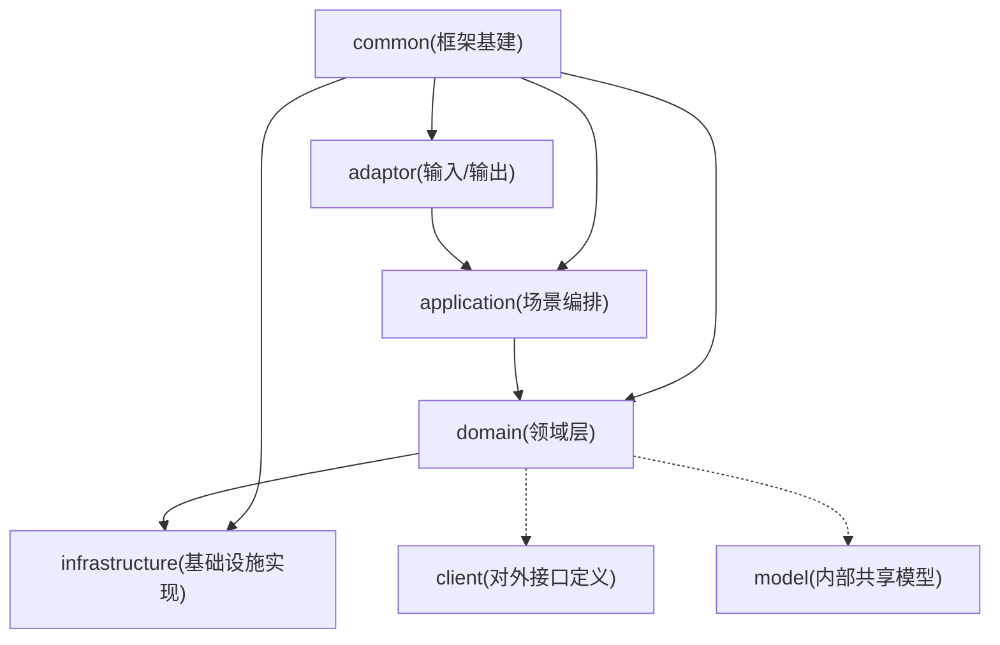
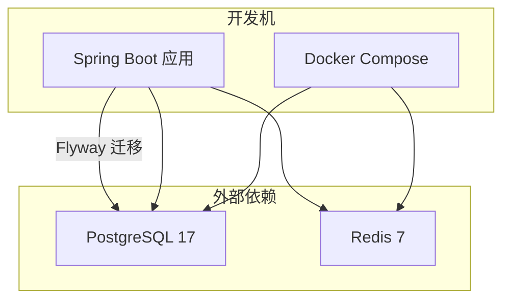
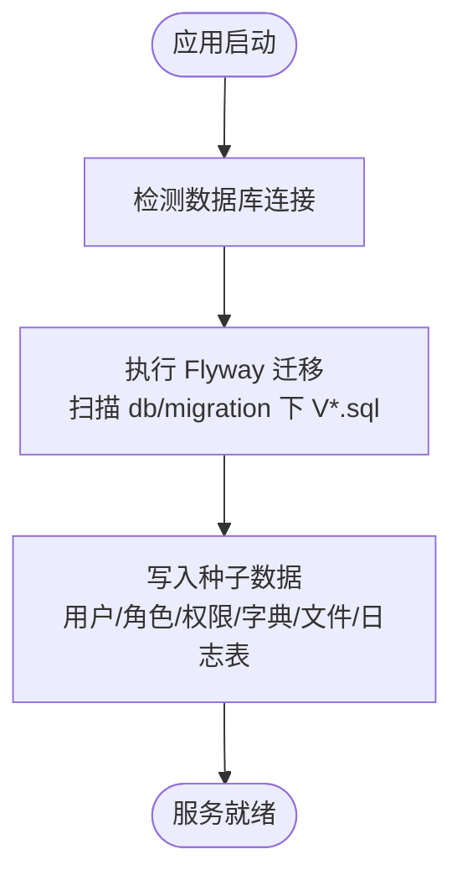
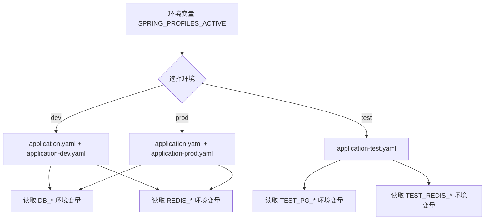
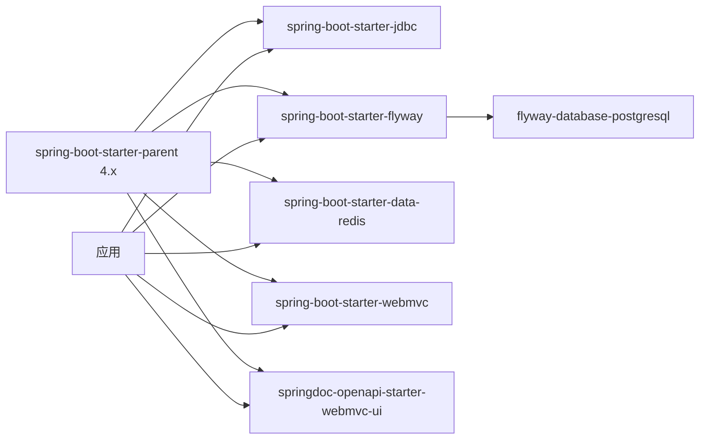

# 开发环境搭建

<cite>
**本文引用的文件**
- [README.md](file://README.md)
- [pom.xml](file://pom.xml)
- [application.yaml](file://src/main/resources/application.yaml)
- [application-prod.yaml](file://src/main/resources/application-prod.yaml)
- [application-test.yaml](file://src/test/resources/application-test.yaml)
- [docker-compose.yaml](file://docker-compose.yaml)
- [V1__init_sys_user.sql](file://src/main/resources/db/migration/V1__init_sys_user.sql)
- [V2__init_rbac.sql](file://src/main/resources/db/migration/V2__init_rbac.sql)
- [V3__init_sys_oper_log.sql](file://src/main/resources/db/migration/V3__init_sys_oper_log.sql)
- [V4__init_dict.sql](file://src/main/resources/db/migration/V4__init_dict.sql)
- [V5__init_sys_file.sql](file://src/main/resources/db/migration/V5__init_sys_file.sql)
- [V6__init_sys_login_log.sql](file://src/main/resources/db/migration/V6__init_sys_login_log.sql)
</cite>

## 目录
1. [简介](#简介)
2. [项目结构](#项目结构)
3. [核心组件](#核心组件)
4. [架构总览](#架构总览)
5. [详细组件分析](#详细组件分析)
6. [依赖分析](#依赖分析)
7. [性能考虑](#性能考虑)
8. [故障排查指南](#故障排查指南)
9. [结论](#结论)
10. [附录](#附录)

## 简介
本指南面向开发者，提供从零到一搭建本地开发环境的完整步骤。内容涵盖：
- JDK 25 安装与环境变量配置
- IDE 推荐设置（IntelliJ IDEA、VS Code）
- PostgreSQL 17 与 Redis 7 的本地安装或 Docker 部署
- 数据库初始化流程（Flyway 迁移脚本执行与种子数据导入）
- 多环境配置文件使用（dev、test、prod）及切换方法
- 常见问题排查（端口冲突、连接失败等）
- 启动验证与 API 文档访问方式

## 项目结构
本项目采用六边形架构（Hexagonal Architecture），分层清晰，便于扩展与维护。关键目录与职责如下：
- adaptor：控制器与全局异常处理、切面等
- application：场景编排、DTO 转换
- client：对外接口定义与自包含 DTO
- domain：聚合根、实体、领域服务、仓储接口
- infrastructure：仓储实现、PO、Mapper、Converter
- model：内部共享枚举/模型
- common：框架基建（ResultDO、锁、事件、上下文、配置、注解、过滤器）

[本图为概念性结构示意，不直接映射具体源码文件]

## 核心组件
- 运行时与依赖
  - Java 25、Spring Boot 4.x
  - MyBatis-Flex（ORM）、PostgreSQL 17、Redis 7
  - Sa-Token（认证鉴权，Token 存 Redis）
  - Flyway（数据库迁移）
  - springdoc-openapi（API 文档）
- 应用配置要点
  - 默认激活 dev 环境
  - 通过环境变量注入数据库与 Redis 连接信息
  - Flyway 启用并自动执行 db/migration 下的脚本
  - Swagger UI 路径为 /swagger-ui.html

章节来源
- [README.md:6-18](file://README.md#L6-L18)
- [pom.xml:19-26](file://pom.xml#L19-L26)
- [pom.xml:141-150](file://pom.xml#L141-L150)
- [application.yaml:7-8](file://src/main/resources/application.yaml#L7-L8)
- [application.yaml:32-36](file://src/main/resources/application.yaml#L32-L36)
- [application.yaml:58-61](file://src/main/resources/application.yaml#L58-L61)

## 架构总览
下图展示开发环境与外部依赖的关系，以及应用启动时 Flyway 的执行位置。

图表来源
- [docker-compose.yaml:1-37](file://docker-compose.yaml#L1-L37)
- [application.yaml:32-36](file://src/main/resources/application.yaml#L32-L36)

章节来源
- [docker-compose.yaml:1-37](file://docker-compose.yaml#L1-L37)
- [application.yaml:32-36](file://src/main/resources/application.yaml#L32-L36)

## 详细组件分析

### JDK 25 安装与环境变量
- 下载并安装 JDK 25（官方发行版或企业发行版均可）
- 设置系统环境变量
  - JAVA_HOME：指向 JDK 安装目录
  - PATH：追加 %JAVA_HOME%\bin（Windows）或 $JAVA_HOME/bin（Linux/macOS）
- 验证安装
  - 命令行执行 java -version 与 javac -version，确认版本为 25

章节来源
- [pom.xml:19-21](file://pom.xml#L19-L21)

### IDE 推荐配置
- IntelliJ IDEA
  - 安装 Lombok 插件
  - 开启注解处理器（Annotation Processors），确保 MapStruct、MyBatis-Flex 处理器生效
  - 项目 SDK 设置为 JDK 25
- VS Code
  - 安装 Extension Pack for Java、Lombok Annotations Support
  - 在 settings.json 中启用注解处理器（参考官方说明）
  - 将工作区 Java 编译器版本设置为 25

章节来源
- [pom.xml:167-212](file://pom.xml#L167-L212)

### PostgreSQL 17 与 Redis 7 部署
- 使用 Docker Compose（推荐）
  - 在项目根目录执行 docker compose up -d
  - 容器名与端口：
    - PostgreSQL：5432
    - Redis：6379
- 本地安装（可选）
  - 安装 PostgreSQL 17 并创建数据库 spring_ddd_template
  - 安装 Redis 7 并确保监听 6379 端口
- 健康检查
  - docker-compose.yaml 已内置 healthcheck，可通过命令查看状态

章节来源
- [docker-compose.yaml:1-37](file://docker-compose.yaml#L1-L37)

### 数据库初始化与种子数据
- Flyway 迁移
  - 应用启动时自动执行 src/main/resources/db/migration 下所有 V*.sql 脚本
  - 支持 baseline-on-migrate，兼容已有库
- 迁移脚本清单与职责
  - V1：用户表与管理员种子数据
  - V2：RBAC 角色/权限/关联表与种子数据
  - V3：操作日志表
  - V4：字典类型/数据表与种子数据
  - V5：文件表
  - V6：登录日志表
- 种子管理员账号
  - 邮箱：admin@example.com
  - 初始密码：admin123456（首次登录后请修改）

图表来源
- [application.yaml:32-36](file://src/main/resources/application.yaml#L32-L36)
- [V1__init_sys_user.sql:1-51](file://src/main/resources/db/migration/V1__init_sys_user.sql#L1-L51)
- [V2__init_rbac.sql:1-158](file://src/main/resources/db/migration/V2__init_rbac.sql#L1-L158)
- [V3__init_sys_oper_log.sql:1-45](file://src/main/resources/db/migration/V3__init_sys_oper_log.sql#L1-L45)
- [V4__init_dict.sql:1-95](file://src/main/resources/db/migration/V4__init_dict.sql#L1-L95)
- [V5__init_sys_file.sql:1-43](file://src/main/resources/db/migration/V5__init_sys_file.sql#L1-L43)
- [V6__init_sys_login_log.sql:1-42](file://src/main/resources/db/migration/V6__init_sys_login_log.sql#L1-L42)

章节来源
- [application.yaml:32-36](file://src/main/resources/application.yaml#L32-L36)
- [V1__init_sys_user.sql:48-51](file://src/main/resources/db/migration/V1__init_sys_user.sql#L48-L51)

### 多环境配置与切换
- 环境文件
  - dev（默认）：application-dev.yaml（由 README 说明；若不存在则使用 application.yaml 中的默认值）
  - prod：application-prod.yaml（关闭 swagger-ui 与 api-docs）
  - test：src/test/resources/application-test.yaml（集成测试专用）
- 激活方式
  - 通过环境变量 SPRING_PROFILES_ACTIVE 指定环境（默认 dev）
- 连接信息注入
  - 数据库：DB_HOST、DB_PORT、DB_NAME、DB_USERNAME、DB_PASSWORD
  - Redis：REDIS_HOST、REDIS_PORT、REDIS_PASSWORD、REDIS_DATABASE
  - 生产环境建议全部走环境变量，避免落盘敏感信息
- 测试环境
  - 使用 TEST_PG_URL、TEST_REDIS_HOST 等环境变量
  - 缺失相关环境变量时，集成测试自动跳过

图表来源
- [application.yaml:7-8](file://src/main/resources/application.yaml#L7-L8)
- [application.yaml:9-26](file://src/main/resources/application.yaml#L9-L26)
- [application-prod.yaml:1-7](file://src/main/resources/application-prod.yaml#L1-L7)
- [application-test.yaml:1-18](file://src/test/resources/application-test.yaml#L1-L18)
- [README.md:76-83](file://README.md#L76-L83)

章节来源
- [application.yaml:7-8](file://src/main/resources/application.yaml#L7-L8)
- [application.yaml:9-26](file://src/main/resources/application.yaml#L9-L26)
- [application-prod.yaml:1-7](file://src/main/resources/application-prod.yaml#L1-L7)
- [application-test.yaml:1-18](file://src/test/resources/application-test.yaml#L1-L18)
- [README.md:76-83](file://README.md#L76-L83)

### 启动与验证
- 启动依赖
  - docker compose up -d
- 启动应用
  - Windows：.\mvnw.cmd spring-boot:run
  - Linux/macOS：./mvnw spring-boot:run
- 验证
  - 打开浏览器访问 http://localhost:8080/swagger-ui.html
  - 使用种子管理员账号登录获取 token，并在请求头携带 satoken: {tokenValue}
- 常用模块路由前缀
  - 认证：/api/auth
  - 用户：/api/system/users
  - 角色：/api/system/roles
  - 字典：/api/system/dicts
  - 日志：/api/system/logs
  - 文件：/api/system/files

章节来源
- [README.md:63-75](file://README.md#L63-L75)
- [README.md:84-95](file://README.md#L84-L95)
- [application.yaml:58-61](file://src/main/resources/application.yaml#L58-L61)

## 依赖分析
- 构建与运行依赖
  - Spring Boot 4.x 父 POM 管理版本
  - 显式引入 spring-boot-starter-jdbc（Spring Boot 4.x 不再默认装配 JDBC）
  - Flyway 使用 spring-boot-starter-flyway 与 flyway-database-postgresql
  - Redis 使用 spring-boot-starter-data-redis，Sa-Token 整合 RedisTemplate
  - springdoc-openapi 提供 /swagger-ui.html 与 /v3/api-docs
- 注解处理器
  - Lombok、MapStruct、MyBatis-Flex 处理器在编译期生成代码

图表来源
- [pom.xml:5-10](file://pom.xml#L5-L10)
- [pom.xml:35-39](file://pom.xml#L35-L39)
- [pom.xml:141-150](file://pom.xml#L141-L150)
- [pom.xml:120-125](file://pom.xml#L120-L125)

章节来源
- [pom.xml:5-10](file://pom.xml#L5-L10)
- [pom.xml:35-39](file://pom.xml#L35-L39)
- [pom.xml:141-150](file://pom.xml#L141-L150)
- [pom.xml:120-125](file://pom.xml#L120-L125)

## 性能考虑
- 连接池
  - Redis Lettuce 连接池参数已在 application.yaml 中配置，可根据并发量调整 max-active/max-idle/min-idle
- 文件上传
  - 应用层与存储层均对文件大小进行限制，保持 spring.servlet.multipart 与 app.file.max-size 一致
- 缓存与锁
  - 字典读多写少场景使用 Redis 缓存；分布式锁默认使用 RedisLevelLock，单机可切换为 JVM 锁

章节来源
- [application.yaml:22-26](file://src/main/resources/application.yaml#L22-L26)
- [application.yaml:27-31](file://src/main/resources/application.yaml#L27-L31)
- [application.yaml:64-72](file://src/main/resources/application.yaml#L64-L72)

## 故障排查指南
- 端口冲突
  - 现象：启动时报端口占用
  - 排查：检查本机是否已占用 5432（PostgreSQL）或 6379（Redis）
  - 解决：停止占用进程或修改 docker-compose.yaml 端口映射
- 连接失败
  - 现象：无法连接数据库或 Redis
  - 排查：
    - 确认环境变量 DB_HOST、DB_PORT、DB_NAME、DB_USERNAME、DB_PASSWORD 正确
    - 确认 REDIS_HOST、REDIS_PORT、REDIS_PASSWORD、REDIS_DATABASE 正确
    - 检查防火墙与安全组策略
  - 解决：修正环境变量或网络策略
- DNS 解析问题
  - 现象：Redis 主机名无法解析
  - 排查：确认 REDIS_HOST 是否为有效主机名或 IP
  - 解决：改为 IP 或修正 DNS 配置
- 迁移失败
  - 现象：Flyway 报错或重复执行
  - 排查：确认数据库 schema 非空时的基线配置是否正确
  - 解决：根据 baseline-on-migrate 行为评估是否需要清理历史版本记录
- 测试跳过
  - 现象：集成测试未执行
  - 原因：缺少 TEST_PG_URL 或 TEST_REDIS_HOST 环境变量
  - 解决：补充环境变量后重新执行测试

章节来源
- [application.yaml:9-26](file://src/main/resources/application.yaml#L9-L26)
- [application.yaml:32-36](file://src/main/resources/application.yaml#L32-L36)
- [application-test.yaml:1-18](file://src/test/resources/application-test.yaml#L1-L18)
- [README.md:129-146](file://README.md#L129-L146)

## 结论
按照本指南完成 JDK、IDE、PostgreSQL、Redis 的安装与配置，并通过 Flyway 完成数据库初始化后，即可快速启动应用并访问 API 文档。多环境切换与常见问题的处理方法有助于提升开发与排障效率。

## 附录
- 快速命令
  - 启动依赖：docker compose up -d
  - 启动应用：./mvnw spring-boot:run（Linux/macOS）或 .\mvnw.cmd spring-boot:run（Windows）
  - 访问文档：http://localhost:8080/swagger-ui.html
- 种子管理员
  - 邮箱：admin@example.com
  - 初始密码：admin123456（首次登录后请修改）

章节来源
- [README.md:63-75](file://README.md#L63-L75)
- [README.md:84-95](file://README.md#L84-L95)