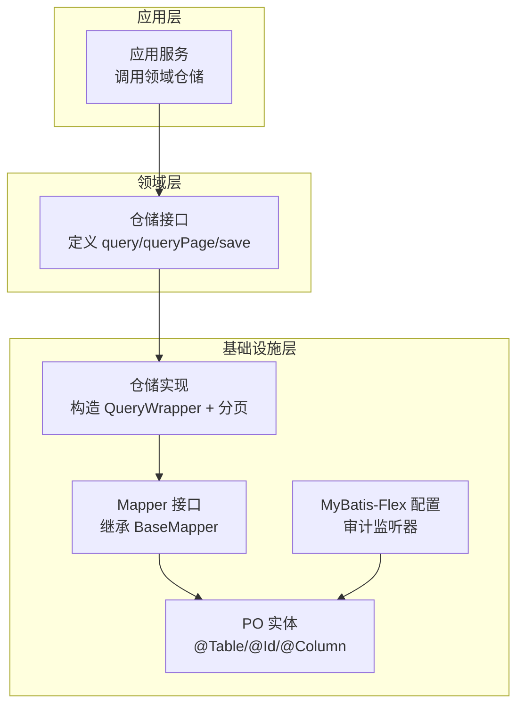
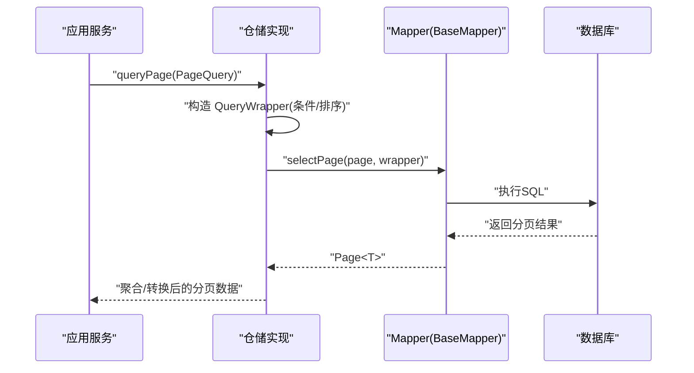
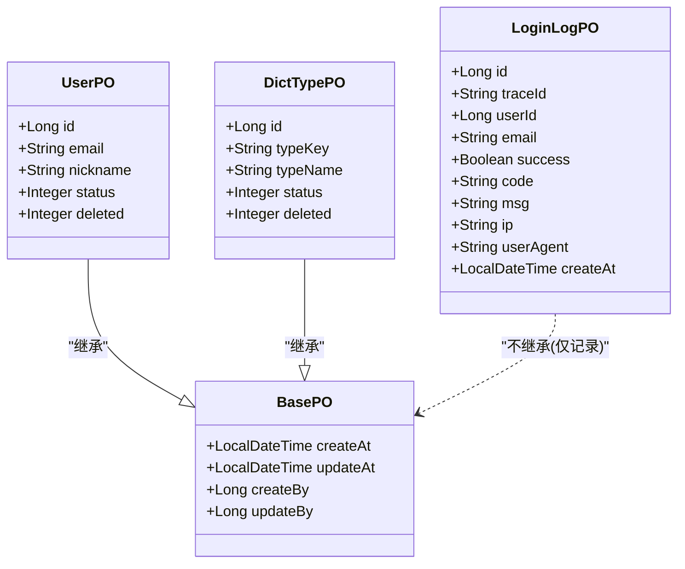
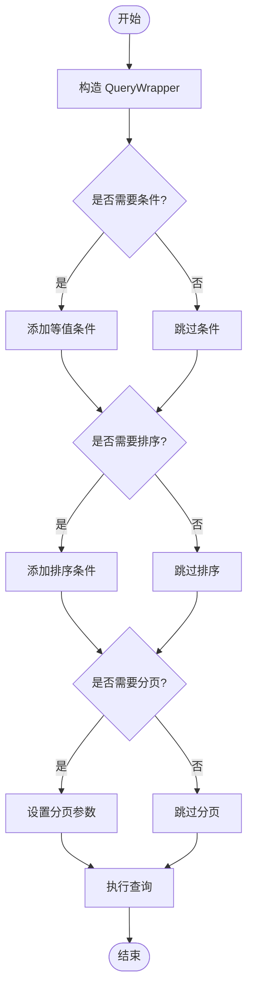
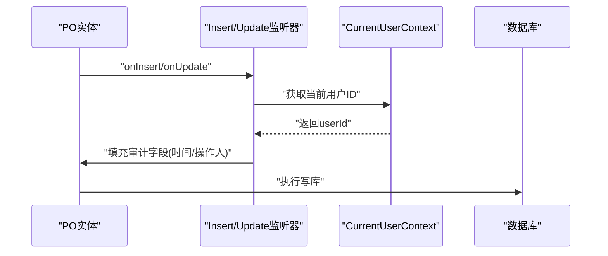
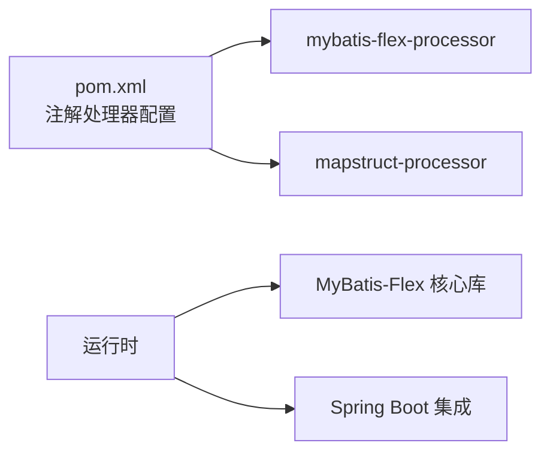

# ORM映射配置

<cite>
**本文引用的文件**   
- [MybatisFlexConfigure.java](file://src/main/java/com/sunnao/spring/ddd/template/common/config/MybatisFlexConfigure.java)
- [BasePO.java](file://src/main/java/com/sunnao/spring/ddd/template/common/model/BasePO.java)
- [UserPO.java](file://src/main/java/com/sunnao/spring/ddd/template/infrastructure/system/user/mysql/po/UserPO.java)
- [DictTypePO.java](file://src/main/java/com/sunnao/spring/ddd/template/infrastructure/system/dict/mysql/po/DictTypePO.java)
- [LoginLogPO.java](file://src/main/java/com/sunnao/spring/ddd/template/infrastructure/system/log/mysql/po/LoginLogPO.java)
- [UserMapper.java](file://src/main/java/com/sunnao/spring/ddd/template/infrastructure/system/user/mysql/mapper/UserMapper.java)
- [DictTypeMapper.java](file://src/main/java/com/sunnao/spring/ddd/template/infrastructure/system/dict/mysql/mapper/DictTypeMapper.java)
- [OperLogMapper.java](file://src/main/java/com/sunnao/spring/ddd/template/infrastructure/system/log/mysql/mapper/OperLogMapper.java)
- [RoleMapper.java](file://src/main/java/com/sunnao/spring/ddd/template/infrastructure/system/role/mysql/mapper/RoleMapper.java)
- [UserRoleMapper.java](file://src/main/java/com/sunnao/spring/ddd/template/infrastructure/system/role/mysql/mapper/UserRoleMapper.java)
- [DictRepositoryImpl.java](file://src/main/java/com/sunnao/spring/ddd/template/infrastructure/system/dict/repository/DictRepositoryImpl.java)
- [PageQuery.java](file://src/main/java/com/sunnao/spring/ddd/template/common/model/PageQuery.java)
- [pom.xml](file://pom.xml)
</cite>

## 目录
1. [简介](#简介)
2. [项目结构](#项目结构)
3. [核心组件](#核心组件)
4. [架构总览](#架构总览)
5. [详细组件分析](#详细组件分析)
6. [依赖分析](#依赖分析)
7. [性能考虑](#性能考虑)
8. [故障排查指南](#故障排查指南)
9. [结论](#结论)
10. [附录](#附录)

## 简介
本指南聚焦于项目中基于 MyBatis-Flex 的 ORM 映射与配置实践，覆盖实体类映射注解、主键生成策略、字段映射规则、Mapper 接口设计规范、动态 SQL 构建（条件查询、排序、分页）、审计字段自动填充、以及环境配置与性能调优建议。文档以仓库现有实现为依据，帮助开发者快速上手并规范使用。

## 项目结构
本项目采用 DDD 分层组织代码，ORM 相关实现集中在基础设施层（infrastructure）的 mysql 子包中：
- PO（持久化对象）定义在 infrastructure/*/mysql/po 下，配合 MyBatis-Flex 注解完成表映射
- Mapper 接口定义在 infrastructure/*/mysql/mapper 下，继承 BaseMapper 获得基础 CRUD 能力
- Repository 实现在 infrastructure/*/repository 下，组合 QueryWrapper 进行动态查询与分页
- 全局配置位于 common/config，通过 MyBatis-Flex 自定义扩展点注册审计监听器

图表来源
- [MybatisFlexConfigure.java:1-73](file://src/main/java/com/sunnao/spring/ddd/template/common/config/MybatisFlexConfigure.java#L1-L73)
- [UserMapper.java:1-11](file://src/main/java/com/sunnao/spring/ddd/template/infrastructure/system/user/mysql/mapper/UserMapper.java#L1-L11)
- [UserPO.java:1-60](file://src/main/java/com/sunnao/spring/ddd/template/infrastructure/system/user/mysql/po/UserPO.java#L1-L60)
- [DictRepositoryImpl.java:1-160](file://src/main/java/com/sunnao/spring/ddd/template/infrastructure/system/dict/repository/DictRepositoryImpl.java#L1-L160)

章节来源
- [MybatisFlexConfigure.java:1-73](file://src/main/java/com/sunnao/spring/ddd/template/common/config/MybatisFlexConfigure.java#L1-L73)
- [UserPO.java:1-60](file://src/main/java/com/sunnao/spring/ddd/template/infrastructure/system/user/mysql/po/UserPO.java#L1-L60)
- [DictTypePO.java:1-55](file://src/main/java/com/sunnao/spring/ddd/template/infrastructure/system/dict/mysql/po/DictTypePO.java#L1-L55)
- [LoginLogPO.java:1-74](file://src/main/java/com/sunnao/spring/ddd/template/infrastructure/system/log/mysql/po/LoginLogPO.java#L1-L74)
- [UserMapper.java:1-11](file://src/main/java/com/sunnao/spring/ddd/template/infrastructure/system/user/mysql/mapper/UserMapper.java#L1-L11)
- [DictTypeMapper.java:1-11](file://src/main/java/com/sunnao/spring/ddd/template/infrastructure/system/dict/mysql/mapper/DictTypeMapper.java#L1-L11)
- [OperLogMapper.java:1-11](file://src/main/java/com/sunnao/spring/ddd/template/infrastructure/system/log/mysql/mapper/OperLogMapper.java#L1-L11)
- [RoleMapper.java:1-11](file://src/main/java/com/sunnao/spring/ddd/template/infrastructure/system/role/mysql/mapper/RoleMapper.java#L1-L11)
- [UserRoleMapper.java:1-11](file://src/main/java/com/sunnao/spring/ddd/template/infrastructure/system/role/mysql/mapper/UserRoleMapper.java#L1-L11)
- [DictRepositoryImpl.java:1-160](file://src/main/java/com/sunnao/spring/ddd/template/infrastructure/system/dict/repository/DictRepositoryImpl.java#L1-L160)

## 核心组件
- 全局配置与审计监听器：通过实现 MyBatis-Flex 的自定义扩展点，为所有继承 BasePO 的实体注册插入/更新监听器，自动填充审计字段（创建时间、更新时间、创建人、更新人），且不会覆盖已显式赋值的操作人字段。
- 持久化对象基类 BasePO：提供统一的审计字段（createAt/updateAt/createBy/updateBy），供各业务 PO 继承复用。
- PO 实体：使用 @Table、@Id、@Column 等注解完成表名、主键、逻辑删除等映射；主键策略统一采用自增。
- Mapper 接口：均继承 BaseMapper<T>，获得标准 CRUD 方法；复杂查询由仓储层通过 QueryWrapper 动态构建。
- 动态查询与分页：仓储实现中使用 PageQuery 封装分页参数，结合 QueryWrapper 构建条件、排序与分页。

章节来源
- [MybatisFlexConfigure.java:1-73](file://src/main/java/com/sunnao/spring/ddd/template/common/config/MybatisFlexConfigure.java#L1-L73)
- [BasePO.java:1-41](file://src/main/java/com/sunnao/spring/ddd/template/common/model/BasePO.java#L1-L41)
- [UserPO.java:1-60](file://src/main/java/com/sunnao/spring/ddd/template/infrastructure/system/user/mysql/po/UserPO.java#L1-L60)
- [DictTypePO.java:1-55](file://src/main/java/com/sunnao/spring/ddd/template/infrastructure/system/dict/mysql/po/DictTypePO.java#L1-L55)
- [LoginLogPO.java:1-74](file://src/main/java/com/sunnao/spring/ddd/template/infrastructure/system/log/mysql/po/LoginLogPO.java#L1-L74)
- [UserMapper.java:1-11](file://src/main/java/com/sunnao/spring/ddd/template/infrastructure/system/user/mysql/mapper/UserMapper.java#L1-L11)
- [DictTypeMapper.java:1-11](file://src/main/java/com/sunnao/spring/ddd/template/infrastructure/system/dict/mysql/mapper/DictTypeMapper.java#L1-L11)
- [OperLogMapper.java:1-11](file://src/main/java/com/sunnao/spring/ddd/template/infrastructure/system/log/mysql/mapper/OperLogMapper.java#L1-L11)
- [RoleMapper.java:1-11](file://src/main/java/com/sunnao/spring/ddd/template/infrastructure/system/role/mysql/mapper/RoleMapper.java#L1-L11)
- [UserRoleMapper.java:1-11](file://src/main/java/com/sunnao/spring/ddd/template/infrastructure/system/role/mysql/mapper/UserRoleMapper.java#L1-L11)
- [DictRepositoryImpl.java:1-160](file://src/main/java/com/sunnao/spring/ddd/template/infrastructure/system/dict/repository/DictRepositoryImpl.java#L1-L160)
- [PageQuery.java:1-40](file://src/main/java/com/sunnao/spring/ddd/template/common/model/PageQuery.java#L1-L40)

## 架构总览
下图展示从应用层到数据库层的 ORM 调用链路与关键组件关系。

图表来源
- [DictRepositoryImpl.java:1-160](file://src/main/java/com/sunnao/spring/ddd/template/infrastructure/system/dict/repository/DictRepositoryImpl.java#L1-L160)
- [UserMapper.java:1-11](file://src/main/java/com/sunnao/spring/ddd/template/infrastructure/system/user/mysql/mapper/UserMapper.java#L1-L11)

## 详细组件分析

### 实体类映射与注解规范
- 表映射：使用 @Table("表名") 指定物理表名
- 主键映射：使用 @Id(keyType = KeyType.Auto) 声明自增主键
- 逻辑删除：在字段上使用 @Column(isLogicDelete = true) 标记逻辑删除列
- 审计字段：通过继承 BasePO 获得 createAt/updateAt/createBy/updateBy，并由全局监听器自动填充
- 日志类 PO 可选择不继承 BasePO（如登录日志），仅保留必要字段

图表来源
- [BasePO.java:1-41](file://src/main/java/com/sunnao/spring/ddd/template/common/model/BasePO.java#L1-L41)
- [UserPO.java:1-60](file://src/main/java/com/sunnao/spring/ddd/template/infrastructure/system/user/mysql/po/UserPO.java#L1-L60)
- [DictTypePO.java:1-55](file://src/main/java/com/sunnao/spring/ddd/template/infrastructure/system/dict/mysql/po/DictTypePO.java#L1-L55)
- [LoginLogPO.java:1-74](file://src/main/java/com/sunnao/spring/ddd/template/infrastructure/system/log/mysql/po/LoginLogPO.java#L1-L74)

章节来源
- [UserPO.java:1-60](file://src/main/java/com/sunnao/spring/ddd/template/infrastructure/system/user/mysql/po/UserPO.java#L1-L60)
- [DictTypePO.java:1-55](file://src/main/java/com/sunnao/spring/ddd/template/infrastructure/system/dict/mysql/po/DictTypePO.java#L1-L55)
- [LoginLogPO.java:1-74](file://src/main/java/com/sunnao/spring/ddd/template/infrastructure/system/log/mysql/po/LoginLogPO.java#L1-L74)
- [BasePO.java:1-41](file://src/main/java/com/sunnao/spring/ddd/template/common/model/BasePO.java#L1-L41)

### 主键生成策略
- 统一采用自增主键：@Id(keyType = KeyType.Auto)
- 适用于用户、字典类型、登录日志等表的主键策略一致，便于维护与迁移

章节来源
- [UserPO.java:20-27](file://src/main/java/com/sunnao/spring/ddd/template/infrastructure/system/user/mysql/po/UserPO.java#L20-L27)
- [DictTypePO.java:20-27](file://src/main/java/com/sunnao/spring/ddd/template/infrastructure/system/dict/mysql/po/DictTypePO.java#L20-L27)
- [LoginLogPO.java:20-27](file://src/main/java/com/sunnao/spring/ddd/template/infrastructure/system/log/mysql/po/LoginLogPO.java#L20-L27)

### 字段映射规则
- 表名映射：@Table("表名")
- 逻辑删除：@Column(isLogicDelete = true) 标注逻辑删除字段
- 审计字段：通过 BasePO 统一提供，无需在每个 PO 重复声明
- 特殊字段处理：例如密码字段可在 toString 中排除，避免敏感信息泄露

章节来源
- [UserPO.java:17-59](file://src/main/java/com/sunnao/spring/ddd/template/infrastructure/system/user/mysql/po/UserPO.java#L17-L59)
- [DictTypePO.java:17-54](file://src/main/java/com/sunnao/spring/ddd/template/infrastructure/system/dict/mysql/po/DictTypePO.java#L17-L54)
- [BasePO.java:17-40](file://src/main/java/com/sunnao/spring/ddd/template/common/model/BasePO.java#L17-L40)

### Mapper 接口设计规范
- 所有 Mapper 接口均继承 BaseMapper<T>，获得标准 CRUD 方法（如 selectById、insert、update、delete 等）
- 复杂查询不在 Mapper 中编写，而是由仓储层通过 QueryWrapper 动态构建，保持 Mapper 简洁
- 示例：UserMapper、DictTypeMapper、OperLogMapper、RoleMapper、UserRoleMapper 均遵循此规范

章节来源
- [UserMapper.java:1-11](file://src/main/java/com/sunnao/spring/ddd/template/infrastructure/system/user/mysql/mapper/UserMapper.java#L1-L11)
- [DictTypeMapper.java:1-11](file://src/main/java/com/sunnao/spring/ddd/template/infrastructure/system/dict/mysql/mapper/DictTypeMapper.java#L1-L11)
- [OperLogMapper.java:1-11](file://src/main/java/com/sunnao/spring/ddd/template/infrastructure/system/log/mysql/mapper/OperLogMapper.java#L1-L11)
- [RoleMapper.java:1-11](file://src/main/java/com/sunnao/spring/ddd/template/infrastructure/system/role/mysql/mapper/RoleMapper.java#L1-L11)
- [UserRoleMapper.java:1-11](file://src/main/java/com/sunnao/spring/ddd/template/infrastructure/system/role/mysql/mapper/UserRoleMapper.java#L1-L11)

### 动态 SQL 构建（条件查询、排序、分页）
- 条件查询：使用 QueryWrapper.create() 构建条件，如 eq、like、in 等
- 排序：在 QueryWrapper 上追加 orderBy 等排序条件
- 分页：使用 PageQuery 封装分页参数，并通过 BaseMapper 的分页方法执行

图表来源
- [DictRepositoryImpl.java:1-160](file://src/main/java/com/sunnao/spring/ddd/template/infrastructure/system/dict/repository/DictRepositoryImpl.java#L1-L160)
- [PageQuery.java:1-40](file://src/main/java/com/sunnao/spring/ddd/template/common/model/PageQuery.java#L1-L40)

章节来源
- [DictRepositoryImpl.java:1-160](file://src/main/java/com/sunnao/spring/ddd/template/infrastructure/system/dict/repository/DictRepositoryImpl.java#L1-L160)
- [PageQuery.java:1-40](file://src/main/java/com/sunnao/spring/ddd/template/common/model/PageQuery.java#L1-L40)

### 审计字段自动填充机制
- 全局配置：实现 MyBatis-Flex 的自定义扩展点，注册 InsertListener 与 UpdateListener
- 插入时：若未显式赋值，则填充 createAt、updateAt、createBy、updateBy
- 更新时：填充 updateAt，若未显式赋值则填充 updateBy
- 数据来源：操作人取自当前上下文（CurrentUserContext），确保审计信息准确

图表来源
- [MybatisFlexConfigure.java:1-73](file://src/main/java/com/sunnao/spring/ddd/template/common/config/MybatisFlexConfigure.java#L1-L73)
- [BasePO.java:1-41](file://src/main/java/com/sunnao/spring/ddd/template/common/model/BasePO.java#L1-L41)

章节来源
- [MybatisFlexConfigure.java:1-73](file://src/main/java/com/sunnao/spring/ddd/template/common/config/MybatisFlexConfigure.java#L1-L73)
- [BasePO.java:1-41](file://src/main/java/com/sunnao/spring/ddd/template/common/model/BasePO.java#L1-L41)

## 依赖分析
- 编译期注解处理器：项目启用 mybatis-flex-processor 与 mapstruct-processor，用于生成辅助代码与提升开发效率
- 运行时依赖：MyBatis-Flex 核心库与 Spring Boot 集成模块，提供 BaseMapper、QueryWrapper、分页支持等能力

图表来源
- [pom.xml:183-216](file://pom.xml#L183-L216)

章节来源
- [pom.xml:183-216](file://pom.xml#L183-L216)

## 性能考虑
- 索引优化：为主键与常用查询字段建立合适索引，避免全表扫描
- 分页限制：合理设置分页大小，避免一次性加载过多数据
- 查询裁剪：按需选择字段，减少网络传输与内存占用
- 连接池参数：根据业务负载调整连接池大小、超时与最大空闲时间
- 事务边界：将只读查询置于只读事务，降低锁竞争
- SQL 日志：仅在开发或问题定位时开启详细 SQL 日志，生产环境谨慎使用

[本节为通用指导，不涉及具体文件分析]

## 故障排查指南
- 审计字段未填充：检查实体是否继承 BasePO，确认全局监听器是否生效
- 主键冲突：确认主键策略为自增，且数据库表结构正确
- 逻辑删除无效：确认字段是否正确标注 isLogicDelete，并确保查询使用仓储提供的分页/查询方法
- 分页异常：检查 PageQuery 参数是否合法，确认分页方法与 QueryWrapper 组合使用
- 连接失败：核对数据库连接配置与网络连通性

章节来源
- [MybatisFlexConfigure.java:1-73](file://src/main/java/com/sunnao/spring/ddd/template/common/config/MybatisFlexConfigure.java#L1-L73)
- [UserPO.java:1-60](file://src/main/java/com/sunnao/spring/ddd/template/infrastructure/system/user/mysql/po/UserPO.java#L1-L60)
- [DictTypePO.java:1-55](file://src/main/java/com/sunnao/spring/ddd/template/infrastructure/system/dict/mysql/po/DictTypePO.java#L1-L55)
- [DictRepositoryImpl.java:1-160](file://src/main/java/com/sunnao/spring/ddd/template/infrastructure/system/dict/repository/DictRepositoryImpl.java#L1-L160)

## 结论
本项目基于 MyBatis-Flex 构建了清晰、可扩展的 ORM 层：通过统一的 PO 基类与全局监听器实现审计字段自动化，通过 BaseMapper 简化 CRUD，通过 QueryWrapper 与 PageQuery 实现灵活的条件查询与分页。该模式兼顾了开发效率与运行性能，适合在 DDD 架构中作为基础设施层的数据访问方案。

[本节为总结性内容，不涉及具体文件分析]

## 附录
- 参考路径
  - 全局配置与审计监听器：[MybatisFlexConfigure.java](file://src/main/java/com/sunnao/spring/ddd/template/common/config/MybatisFlexConfigure.java)
  - 持久化对象基类：[BasePO.java](file://src/main/java/com/sunnao/spring/ddd/template/common/model/BasePO.java)
  - 用户 PO 与 Mapper：[UserPO.java](file://src/main/java/com/sunnao/spring/ddd/template/infrastructure/system/user/mysql/po/UserPO.java)、[UserMapper.java](file://src/main/java/com/sunnao/spring/ddd/template/infrastructure/system/user/mysql/mapper/UserMapper.java)
  - 字典类型 PO 与 Mapper：[DictTypePO.java](file://src/main/java/com/sunnao/spring/ddd/template/infrastructure/system/dict/mysql/po/DictTypePO.java)、[DictTypeMapper.java](file://src/main/java/com/sunnao/spring/ddd/template/infrastructure/system/dict/mysql/mapper/DictTypeMapper.java)
  - 登录日志 PO 与 Mapper：[LoginLogPO.java](file://src/main/java/com/sunnao/spring/ddd/template/infrastructure/system/log/mysql/po/LoginLogPO.java)、[OperLogMapper.java](file://src/main/java/com/sunnao/spring/ddd/template/infrastructure/system/log/mysql/mapper/OperLogMapper.java)
  - 角色相关 Mapper：[RoleMapper.java](file://src/main/java/com/sunnao/spring/ddd/template/infrastructure/system/role/mysql/mapper/RoleMapper.java)、[UserRoleMapper.java](file://src/main/java/com/sunnao/spring/ddd/template/infrastructure/system/role/mysql/mapper/UserRoleMapper.java)
  - 动态查询与分页示例：[DictRepositoryImpl.java](file://src/main/java/com/sunnao/spring/ddd/template/infrastructure/system/dict/repository/DictRepositoryImpl.java)
  - 分页模型：[PageQuery.java](file://src/main/java/com/sunnao/spring/ddd/template/common/model/PageQuery.java)
  - 注解处理器配置：[pom.xml](file://pom.xml)