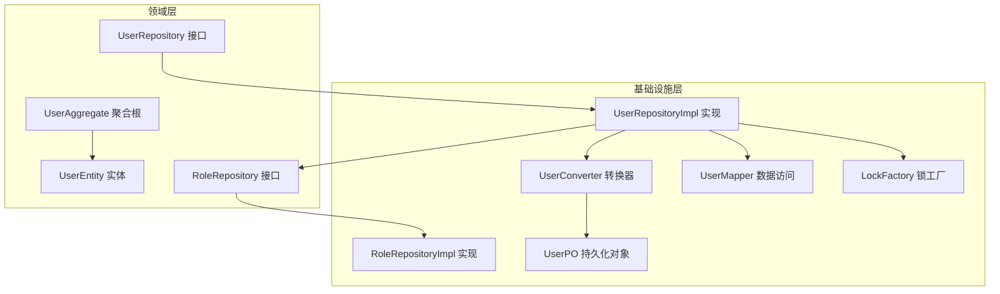
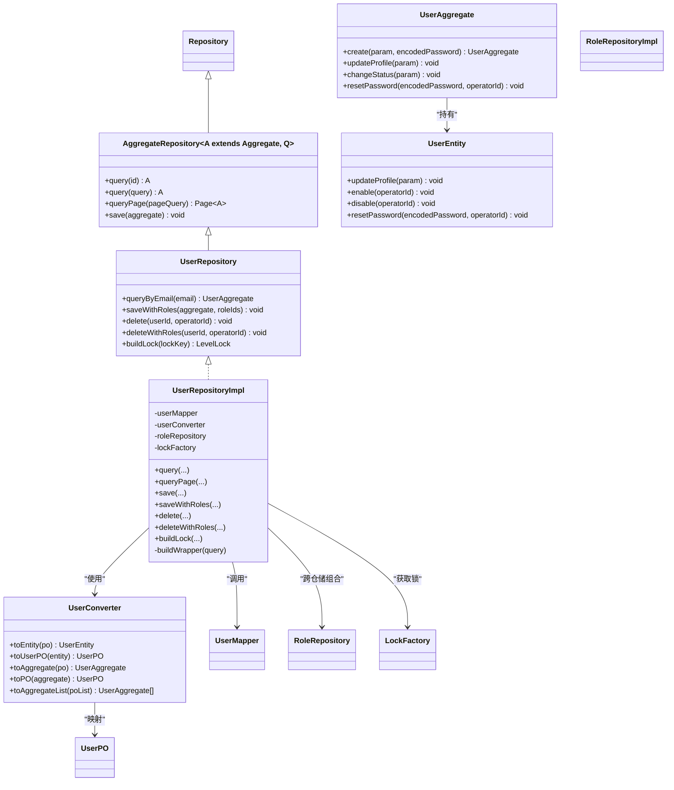
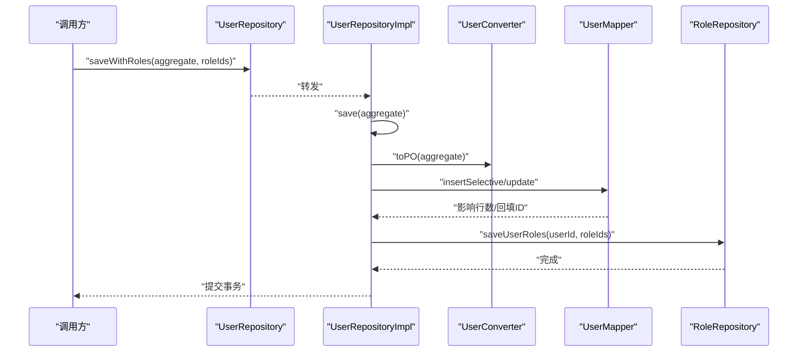
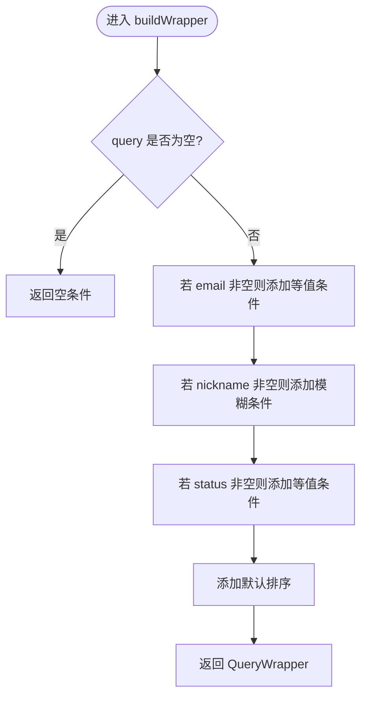
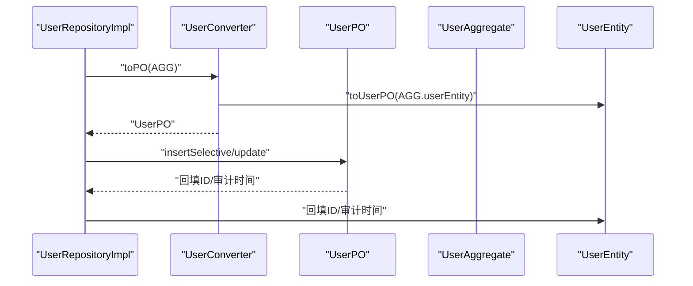
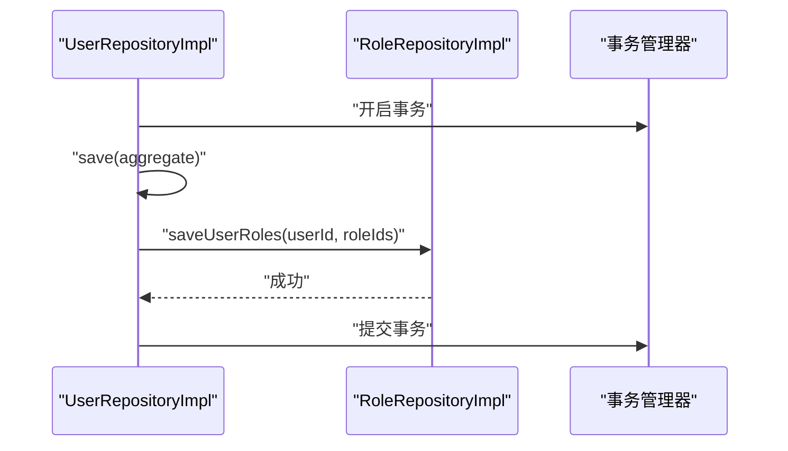
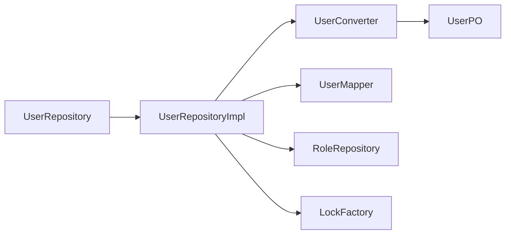

# 仓储实现开发

<cite>
**本文引用的文件**   
- [src/main/java/com/sunnao/spring/ddd/template/common/model/Repository.java](file://src/main/java/com/sunnao/spring/ddd/template/common/model/Repository.java)
- [src/main/java/com/sunnao/spring/ddd/template/common/model/AggregateRepository.java](file://src/main/java/com/sunnao/spring/ddd/template/common/model/AggregateRepository.java)
- [src/main/java/com/sunnao/spring/ddd/template/domain/system/user/repository/UserRepository.java](file://src/main/java/com/sunnao/spring/ddd/template/domain/system/user/repository/UserRepository.java)
- [src/main/java/com/sunnao/spring/ddd/template/infrastructure/system/user/repository/UserRepositoryImpl.java](file://src/main/java/com/sunnao/spring/ddd/template/infrastructure/system/user/repository/UserRepositoryImpl.java)
- [src/main/java/com/sunnao/spring/ddd/template/domain/system/user/model/aggregate/UserAggregate.java](file://src/main/java/com/sunnao/spring/ddd/template/domain/system/user/model/aggregate/UserAggregate.java)
- [src/main/java/com/sunnao/spring/ddd/template/domain/system/user/model/entity/UserEntity.java](file://src/main/java/com/sunnao/spring/ddd/template/domain/system/user/model/entity/UserEntity.java)
- [src/main/java/com/sunnao/spring/ddd/template/infrastructure/system/user/converter/UserConverter.java](file://src/main/java/com/sunnao/spring/ddd/template/infrastructure/system/user/converter/UserConverter.java)
- [src/main/java/com/sunnao/spring/ddd/template/infrastructure/system/user/mysql/po/UserPO.java](file://src/main/java/com/sunnao/spring/ddd/template/infrastructure/system/user/mysql/po/UserPO.java)
- [src/main/java/com/sunnao/spring/ddd/template/infrastructure/system/user/mysql/mapper/UserMapper.java](file://src/main/java/com/sunnao/spring/ddd/template/infrastructure/system/user/mysql/mapper/UserMapper.java)
- [src/main/java/com/sunnao/spring/ddd/template/common/model/BasePO.java](file://src/main/java/com/sunnao/spring/ddd/template/common/model/BasePO.java)
- [src/main/java/com/sunnao/spring/ddd/template/common/model/PageQuery.java](file://src/main/java/com/sunnao/spring/ddd/template/common/model/PageQuery.java)
- [src/main/java/com/sunnao/spring/ddd/template/common/exception/RepositoryException.java](file://src/main/java/com/sunnao/spring/ddd/template/common/exception/RepositoryException.java)
- [src/main/java/com/sunnao/spring/ddd/template/common/lock/LockFactory.java](file://src/main/java/com/sunnao/spring/ddd/template/common/lock/LockFactory.java)
- [src/main/java/com/sunnao/spring/ddd/template/domain/system/role/repository/RoleRepository.java](file://src/main/java/com/sunnao/spring/ddd/template/domain/system/role/repository/RoleRepository.java)
- [src/main/java/com/sunnao/spring/ddd/template/infrastructure/system/role/repository/RoleRepositoryImpl.java](file://src/main/java/com/sunnao/spring/ddd/template/infrastructure/system/role/repository/RoleRepositoryImpl.java)
</cite>

## 目录
1. [引言](#引言)
2. [项目结构](#项目结构)
3. [核心组件](#核心组件)
4. [架构总览](#架构总览)
5. [详细组件分析](#详细组件分析)
6. [依赖关系分析](#依赖关系分析)
7. [性能考虑](#性能考虑)
8. [故障排查指南](#故障排查指南)
9. [结论](#结论)
10. [附录](#附录)

## 引言
本指南面向仓储层的开发与集成，聚焦以下目标：
- 明确仓储接口的定义规范与实现模式
- 以 UserRepositoryImpl 为例，展示数据持久化的标准实现
- 统一异常处理、事务管理、分布式锁集成的最佳实践
- 复杂查询条件构建方法（动态 SQL 组装与分页）
- 聚合根与 PO 对象转换流程（含关联数据的批量操作与事务一致性）
- 性能优化建议与错误处理策略

## 项目结构
仓储层遵循 DDD 分层：领域层定义接口，基础设施层提供实现；通过转换器在聚合根与持久化对象之间进行纯技术映射。

图表来源
- [src/main/java/com/sunnao/spring/ddd/template/domain/system/user/repository/UserRepository.java:1-65](file://src/main/java/com/sunnao/spring/ddd/template/domain/system/user/repository/UserRepository.java#L1-L65)
- [src/main/java/com/sunnao/spring/ddd/template/infrastructure/system/user/repository/UserRepositoryImpl.java:1-191](file://src/main/java/com/sunnao/spring/ddd/template/infrastructure/system/user/repository/UserRepositoryImpl.java#L1-L191)
- [src/main/java/com/sunnao/spring/ddd/template/domain/system/user/model/aggregate/UserAggregate.java:1-113](file://src/main/java/com/sunnao/spring/ddd/template/domain/system/user/model/aggregate/UserAggregate.java#L1-L113)
- [src/main/java/com/sunnao/spring/ddd/template/domain/system/user/model/entity/UserEntity.java:1-119](file://src/main/java/com/sunnao/spring/ddd/template/domain/system/user/model/entity/UserEntity.java#L1-L119)
- [src/main/java/com/sunnao/spring/ddd/template/infrastructure/system/user/converter/UserConverter.java:1-85](file://src/main/java/com/sunnao/spring/ddd/template/infrastructure/system/user/converter/UserConverter.java#L1-L85)
- [src/main/java/com/sunnao/spring/ddd/template/infrastructure/system/user/mysql/po/UserPO.java:1-60](file://src/main/java/com/sunnao/spring/ddd/template/infrastructure/system/user/mysql/po/UserPO.java#L1-L60)
- [src/main/java/com/sunnao/spring/ddd/template/infrastructure/system/user/mysql/mapper/UserMapper.java:1-12](file://src/main/java/com/sunnao/spring/ddd/template/infrastructure/system/user/mysql/mapper/UserMapper.java#L1-L12)
- [src/main/java/com/sunnao/spring/ddd/template/common/lock/LockFactory.java:1-41](file://src/main/java/com/sunnao/spring/ddd/template/common/lock/LockFactory.java#L1-L41)
- [src/main/java/com/sunnao/spring/ddd/template/domain/system/role/repository/RoleRepository.java:1-119](file://src/main/java/com/sunnao/spring/ddd/template/domain/system/role/repository/RoleRepository.java#L1-L119)
- [src/main/java/com/sunnao/spring/ddd/template/infrastructure/system/role/repository/RoleRepositoryImpl.java:1-395](file://src/main/java/com/sunnao/spring/ddd/template/infrastructure/system/role/repository/RoleRepositoryImpl.java#L1-L395)

章节来源
- [src/main/java/com/sunnao/spring/ddd/template/common/model/Repository.java:1-4](file://src/main/java/com/sunnao/spring/ddd/template/common/model/Repository.java#L1-L4)
- [src/main/java/com/sunnao/spring/ddd/template/common/model/AggregateRepository.java:1-43](file://src/main/java/com/sunnao/spring/ddd/template/common/model/AggregateRepository.java#L1-L43)

## 核心组件
- 仓储基类与通用能力
  - Repository：空标记接口，用于标识仓储类型
  - AggregateRepository：定义通用 CRUD 与分页查询能力，约束返回类型为聚合根
- 用户仓储接口与实现
  - UserRepository：扩展通用能力，补充邮箱唯一性校验、带角色关联的保存/删除、分布式锁构建等
  - UserRepositoryImpl：实现所有接口方法，负责聚合根持久化、动态查询构建、分页、事务边界、跨仓储组合操作、锁构建
- 聚合根与实体
  - UserAggregate：对外暴露业务方法，内部持有 UserEntity
  - UserEntity：承载属性与状态变更逻辑
- 转换器与持久化对象
  - UserConverter：聚合根/实体与 PO 之间的纯技术转换，包含枚举映射
  - UserPO：数据库表映射对象，继承 BasePO 获得审计字段支持
- 数据访问
  - UserMapper：基于 MyBatis-Flex 的 BaseMapper 扩展
- 分布式锁
  - LockFactory：根据配置选择 JVM 级或 Redis 分布式锁

章节来源
- [src/main/java/com/sunnao/spring/ddd/template/common/model/Repository.java:1-4](file://src/main/java/com/sunnao/spring/ddd/template/common/model/Repository.java#L1-L4)
- [src/main/java/com/sunnao/spring/ddd/template/common/model/AggregateRepository.java:1-43](file://src/main/java/com/sunnao/spring/ddd/template/common/model/AggregateRepository.java#L1-L43)
- [src/main/java/com/sunnao/spring/ddd/template/domain/system/user/repository/UserRepository.java:1-65](file://src/main/java/com/sunnao/spring/ddd/template/domain/system/user/repository/UserRepository.java#L1-L65)
- [src/main/java/com/sunnao/spring/ddd/template/infrastructure/system/user/repository/UserRepositoryImpl.java:1-191](file://src/main/java/com/sunnao/spring/ddd/template/infrastructure/system/user/repository/UserRepositoryImpl.java#L1-L191)
- [src/main/java/com/sunnao/spring/ddd/template/domain/system/user/model/aggregate/UserAggregate.java:1-113](file://src/main/java/com/sunnao/spring/ddd/template/domain/system/user/model/aggregate/UserAggregate.java#L1-L113)
- [src/main/java/com/sunnao/spring/ddd/template/domain/system/user/model/entity/UserEntity.java:1-119](file://src/main/java/com/sunnao/spring/ddd/template/domain/system/user/model/entity/UserEntity.java#L1-L119)
- [src/main/java/com/sunnao/spring/ddd/template/infrastructure/system/user/converter/UserConverter.java:1-85](file://src/main/java/com/sunnao/spring/ddd/template/infrastructure/system/user/converter/UserConverter.java#L1-L85)
- [src/main/java/com/sunnao/spring/ddd/template/infrastructure/system/user/mysql/po/UserPO.java:1-60](file://src/main/java/com/sunnao/spring/ddd/template/infrastructure/system/user/mysql/po/UserPO.java#L1-L60)
- [src/main/java/com/sunnao/spring/ddd/template/infrastructure/system/user/mysql/mapper/UserMapper.java:1-12](file://src/main/java/com/sunnao/spring/ddd/template/infrastructure/system/user/mysql/mapper/UserMapper.java#L1-L12)
- [src/main/java/com/sunnao/spring/ddd/template/common/lock/LockFactory.java:1-41](file://src/main/java/com/sunnao/spring/ddd/template/common/lock/LockFactory.java#L1-L41)

## 架构总览
仓储层采用“接口在上、实现在下”的分层设计，结合转换器完成领域模型与持久化模型的解耦。跨仓储组合操作通过同一事务保证一致性。

图表来源
- [src/main/java/com/sunnao/spring/ddd/template/common/model/AggregateRepository.java:1-43](file://src/main/java/com/sunnao/spring/ddd/template/common/model/AggregateRepository.java#L1-L43)
- [src/main/java/com/sunnao/spring/ddd/template/domain/system/user/repository/UserRepository.java:1-65](file://src/main/java/com/sunnao/spring/ddd/template/domain/system/user/repository/UserRepository.java#L1-L65)
- [src/main/java/com/sunnao/spring/ddd/template/infrastructure/system/user/repository/UserRepositoryImpl.java:1-191](file://src/main/java/com/sunnao/spring/ddd/template/infrastructure/system/user/repository/UserRepositoryImpl.java#L1-L191)
- [src/main/java/com/sunnao/spring/ddd/template/domain/system/user/model/aggregate/UserAggregate.java:1-113](file://src/main/java/com/sunnao/spring/ddd/template/domain/system/user/model/aggregate/UserAggregate.java#L1-L113)
- [src/main/java/com/sunnao/spring/ddd/template/domain/system/user/model/entity/UserEntity.java:1-119](file://src/main/java/com/sunnao/spring/ddd/template/domain/system/user/model/entity/UserEntity.java#L1-L119)
- [src/main/java/com/sunnao/spring/ddd/template/infrastructure/system/user/converter/UserConverter.java:1-85](file://src/main/java/com/sunnao/spring/ddd/template/infrastructure/system/user/converter/UserConverter.java#L1-L85)
- [src/main/java/com/sunnao/spring/ddd/template/infrastructure/system/user/mysql/po/UserPO.java:1-60](file://src/main/java/com/sunnao/spring/ddd/template/infrastructure/system/user/mysql/po/UserPO.java#L1-L60)
- [src/main/java/com/sunnao/spring/ddd/template/infrastructure/system/user/mysql/mapper/UserMapper.java:1-12](file://src/main/java/com/sunnao/spring/ddd/template/infrastructure/system/user/mysql/mapper/UserMapper.java#L1-L12)
- [src/main/java/com/sunnao/spring/ddd/template/domain/system/role/repository/RoleRepository.java:1-119](file://src/main/java/com/sunnao/spring/ddd/template/domain/system/role/repository/RoleRepository.java#L1-L119)
- [src/main/java/com/sunnao/spring/ddd/template/infrastructure/system/role/repository/RoleRepositoryImpl.java:1-395](file://src/main/java/com/sunnao/spring/ddd/template/infrastructure/system/role/repository/RoleRepositoryImpl.java#L1-L395)
- [src/main/java/com/sunnao/spring/ddd/template/common/lock/LockFactory.java:1-41](file://src/main/java/com/sunnao/spring/ddd/template/common/lock/LockFactory.java#L1-L41)

## 详细组件分析

### 仓储接口定义规范
- 命名与职责
  - 接口位于领域层，仅声明领域相关的数据访问契约
  - 继承 AggregateRepository 复用通用能力
- 方法约定
  - query / queryPage 返回聚合根，不直接返回 PO
  - save 负责新增/更新，由实现类回填 ID 与审计字段
  - delete 为逻辑删除，需记录操作人并设置 deleted 标志
  - 跨仓储组合方法（如 saveWithRoles/deleteWithRoles）在同一事务内执行
- 异常约定
  - 所有数据访问异常统一包装为 RepositoryException，携带错误码与上下文信息

章节来源
- [src/main/java/com/sunnao/spring/ddd/template/common/model/AggregateRepository.java:1-43](file://src/main/java/com/sunnao/spring/ddd/template/common/model/AggregateRepository.java#L1-L43)
- [src/main/java/com/sunnao/spring/ddd/template/domain/system/user/repository/UserRepository.java:1-65](file://src/main/java/com/sunnao/spring/ddd/template/domain/system/user/repository/UserRepository.java#L1-L65)
- [src/main/java/com/sunnao/spring/ddd/template/common/exception/RepositoryException.java:1-22](file://src/main/java/com/sunnao/spring/ddd/template/common/exception/RepositoryException.java#L1-L22)

### 仓储实现模式（以 UserRepositoryImpl 为例）
- 依赖注入
  - Mapper：数据访问入口
  - Converter：聚合根/实体与 PO 的纯技术转换
  - 其他仓储：用于跨仓储组合操作（如角色关联）
  - LockFactory：构建分布式锁实例
- 查询与分页
  - 动态条件构建：基于 QueryWrapper 按可选条件拼装
  - 分页：将自定义 PageQuery 转换为 Spring Data PageRequest，再交由底层分页
- 保存与更新
  - 新增：insertSelective 后回填 ID 与审计时间到聚合根实体
  - 更新：清空不可变创建信息，仅更新非空字段
- 删除
  - 先记录操作人，再进行逻辑删除
- 跨仓储组合
  - saveWithRoles/deleteWithRoles 在同一事务中调用 RoleRepository 完成关联维护
- 分布式锁
  - buildLock 委托 LockFactory，上层可基于返回的 LevelLock 实现幂等或并发控制

图表来源
- [src/main/java/com/sunnao/spring/ddd/template/infrastructure/system/user/repository/UserRepositoryImpl.java:119-125](file://src/main/java/com/sunnao/spring/ddd/template/infrastructure/system/user/repository/UserRepositoryImpl.java#L119-L125)
- [src/main/java/com/sunnao/spring/ddd/template/infrastructure/system/user/converter/UserConverter.java:48-55](file://src/main/java/com/sunnao/spring/ddd/template/infrastructure/system/user/converter/UserConverter.java#L48-L55)
- [src/main/java/com/sunnao/spring/ddd/template/infrastructure/system/user/mysql/mapper/UserMapper.java:1-12](file://src/main/java/com/sunnao/spring/ddd/template/infrastructure/system/user/mysql/mapper/UserMapper.java#L1-L12)
- [src/main/java/com/sunnao/spring/ddd/template/domain/system/role/repository/RoleRepository.java:75-82](file://src/main/java/com/sunnao/spring/ddd/template/domain/system/role/repository/RoleRepository.java#L75-L82)

章节来源
- [src/main/java/com/sunnao/spring/ddd/template/infrastructure/system/user/repository/UserRepositoryImpl.java:1-191](file://src/main/java/com/sunnao/spring/ddd/template/infrastructure/system/user/repository/UserRepositoryImpl.java#L1-L191)

### 复杂查询条件构建与分页
- 动态条件
  - 使用 QueryWrapper.create() 按需追加 eq/like/in/orderBy 等条件
  - 对空值进行判空，避免生成无效条件
- 分页
  - startIndex/pageSize 转换为 pageNumber/pageSize
  - 底层分页结果封装为 Spring Data Page，便于上层统一处理

图表来源
- [src/main/java/com/sunnao/spring/ddd/template/infrastructure/system/user/repository/UserRepositoryImpl.java:173-189](file://src/main/java/com/sunnao/spring/ddd/template/infrastructure/system/user/repository/UserRepositoryImpl.java#L173-L189)

章节来源
- [src/main/java/com/sunnao/spring/ddd/template/common/model/PageQuery.java:1-22](file://src/main/java/com/sunnao/spring/ddd/template/common/model/PageQuery.java#L1-L22)
- [src/main/java/com/sunnao/spring/ddd/template/infrastructure/system/user/repository/UserRepositoryImpl.java:73-87](file://src/main/java/com/sunnao/spring/ddd/template/infrastructure/system/user/repository/UserRepositoryImpl.java#L73-L87)

### 聚合根与 PO 转换流程
- 转换职责
  - 转换器仅做纯技术映射，不包含业务逻辑
  - 枚举映射通过 @Named 方法实现双向转换
- 聚合根构造
  - toAggregate 从 PO 构建聚合根并填充内部实体
  - toPO 从聚合根提取实体映射为 PO
- 审计字段
  - BasePO 提供 createAt/updateAt/createBy/updateBy
  - 全局监听器自动填充，已显式赋值的字段不被覆盖

图表来源
- [src/main/java/com/sunnao/spring/ddd/template/infrastructure/system/user/converter/UserConverter.java:18-85](file://src/main/java/com/sunnao/spring/ddd/template/infrastructure/system/user/converter/UserConverter.java#L18-L85)
- [src/main/java/com/sunnao/spring/ddd/template/infrastructure/system/user/mysql/po/UserPO.java:1-60](file://src/main/java/com/sunnao/spring/ddd/template/infrastructure/system/user/mysql/po/UserPO.java#L1-L60)
- [src/main/java/com/sunnao/spring/ddd/template/common/model/BasePO.java:1-41](file://src/main/java/com/sunnao/spring/ddd/template/common/model/BasePO.java#L1-L41)
- [src/main/java/com/sunnao/spring/ddd/template/infrastructure/system/user/repository/UserRepositoryImpl.java:90-117](file://src/main/java/com/sunnao/spring/ddd/template/infrastructure/system/user/repository/UserRepositoryImpl.java#L90-L117)

章节来源
- [src/main/java/com/sunnao/spring/ddd/template/infrastructure/system/user/converter/UserConverter.java:1-85](file://src/main/java/com/sunnao/spring/ddd/template/infrastructure/system/user/converter/UserConverter.java#L1-L85)
- [src/main/java/com/sunnao/spring/ddd/template/infrastructure/system/user/mysql/po/UserPO.java:1-60](file://src/main/java/com/sunnao/spring/ddd/template/infrastructure/system/user/mysql/po/UserPO.java#L1-L60)
- [src/main/java/com/sunnao/spring/ddd/template/common/model/BasePO.java:1-41](file://src/main/java/com/sunnao/spring/ddd/template/common/model/BasePO.java#L1-L41)

### 事务管理与跨仓储一致性
- 事务边界
  - 组合写入/删除方法标注事务注解，确保多步操作原子性
- 跨仓储协作
  - UserRepositoryImpl 在事务内调用 RoleRepository.saveUserRoles 完成用户-角色关联的全量覆盖
- 回滚策略
  - 任一子步骤失败均触发整体回滚

图表来源
- [src/main/java/com/sunnao/spring/ddd/template/infrastructure/system/user/repository/UserRepositoryImpl.java:119-125](file://src/main/java/com/sunnao/spring/ddd/template/infrastructure/system/user/repository/UserRepositoryImpl.java#L119-L125)
- [src/main/java/com/sunnao/spring/ddd/template/infrastructure/system/role/repository/RoleRepositoryImpl.java:233-256](file://src/main/java/com/sunnao/spring/ddd/template/infrastructure/system/role/repository/RoleRepositoryImpl.java#L233-L256)

章节来源
- [src/main/java/com/sunnao/spring/ddd/template/infrastructure/system/user/repository/UserRepositoryImpl.java:119-163](file://src/main/java/com/sunnao/spring/ddd/template/infrastructure/system/user/repository/UserRepositoryImpl.java#L119-L163)
- [src/main/java/com/sunnao/spring/ddd/template/infrastructure/system/role/repository/RoleRepositoryImpl.java:208-256](file://src/main/java/com/sunnao/spring/ddd/template/infrastructure/system/role/repository/RoleRepositoryImpl.java#L208-L256)

### 分布式锁集成
- 锁工厂
  - 通过配置切换 JVM 级或 Redis 分布式锁
- 使用方式
  - 仓储实现提供 buildLock 方法，领域服务或应用服务可按需获取锁实例进行并发控制

章节来源
- [src/main/java/com/sunnao/spring/ddd/template/common/lock/LockFactory.java:1-41](file://src/main/java/com/sunnao/spring/ddd/template/common/lock/LockFactory.java#L1-L41)
- [src/main/java/com/sunnao/spring/ddd/template/domain/system/user/repository/UserRepository.java:57-64](file://src/main/java/com/sunnao/spring/ddd/template/domain/system/user/repository/UserRepository.java#L57-L64)
- [src/main/java/com/sunnao/spring/ddd/template/infrastructure/system/user/repository/UserRepositoryImpl.java:165-168](file://src/main/java/com/sunnao/spring/ddd/template/infrastructure/system/user/repository/UserRepositoryImpl.java#L165-L168)

## 依赖关系分析
- 耦合与内聚
  - UserRepositoryImpl 对内依赖 Converter/Mapper，对外依赖 RoleRepository 与 LockFactory，职责清晰
- 外部依赖
  - MyBatis-Flex 提供基础数据访问与分页
  - MapStruct 生成转换器代码
  - Spring 事务与分页 API
- 潜在循环依赖
  - 当前实现无循环依赖；跨仓储通过接口解耦

图表来源
- [src/main/java/com/sunnao/spring/ddd/template/domain/system/user/repository/UserRepository.java:1-65](file://src/main/java/com/sunnao/spring/ddd/template/domain/system/user/repository/UserRepository.java#L1-L65)
- [src/main/java/com/sunnao/spring/ddd/template/infrastructure/system/user/repository/UserRepositoryImpl.java:1-191](file://src/main/java/com/sunnao/spring/ddd/template/infrastructure/system/user/repository/UserRepositoryImpl.java#L1-L191)
- [src/main/java/com/sunnao/spring/ddd/template/infrastructure/system/user/converter/UserConverter.java:1-85](file://src/main/java/com/sunnao/spring/ddd/template/infrastructure/system/user/converter/UserConverter.java#L1-L85)
- [src/main/java/com/sunnao/spring/ddd/template/infrastructure/system/user/mysql/po/UserPO.java:1-60](file://src/main/java/com/sunnao/spring/ddd/template/infrastructure/system/user/mysql/po/UserPO.java#L1-L60)
- [src/main/java/com/sunnao/spring/ddd/template/infrastructure/system/user/mysql/mapper/UserMapper.java:1-12](file://src/main/java/com/sunnao/spring/ddd/template/infrastructure/system/user/mysql/mapper/UserMapper.java#L1-L12)
- [src/main/java/com/sunnao/spring/ddd/template/domain/system/role/repository/RoleRepository.java:1-119](file://src/main/java/com/sunnao/spring/ddd/template/domain/system/role/repository/RoleRepository.java#L1-L119)
- [src/main/java/com/sunnao/spring/ddd/template/common/lock/LockFactory.java:1-41](file://src/main/java/com/sunnao/spring/ddd/template/common/lock/LockFactory.java#L1-L41)

章节来源
- [src/main/java/com/sunnao/spring/ddd/template/infrastructure/system/user/repository/UserRepositoryImpl.java:1-191](file://src/main/java/com/sunnao/spring/ddd/template/infrastructure/system/user/repository/UserRepositoryImpl.java#L1-L191)
- [src/main/java/com/sunnao/spring/ddd/template/infrastructure/system/role/repository/RoleRepositoryImpl.java:1-395](file://src/main/java/com/sunnao/spring/ddd/template/infrastructure/system/role/repository/RoleRepositoryImpl.java#L1-L395)

## 性能考虑
- 查询优化
  - 动态条件仅在参数非空时追加，避免多余条件
  - 分页查询使用底层分页，减少内存占用
- 批量操作
  - 关联数据采用“先删后插”的全量覆盖，并使用批量插入提升吞吐
- 索引与排序
  - 建议在常用查询字段（如邮箱、昵称前缀、状态）建立合适索引
  - 默认排序尽量使用主键，避免复杂排序
- 转换开销
  - 使用 MapStruct 生成的转换器，避免运行时反射带来的额外开销

[本节为通用指导，无需源码引用]

## 故障排查指南
- 统一异常
  - 所有数据访问异常包装为 RepositoryException，包含错误码与消息，便于上层统一处理
- 日志定位
  - 关键路径记录入参与异常堆栈，快速定位问题
- 常见错误
  - 参数为空导致保存失败：检查聚合根与转换器返回值
  - 事务回滚：确认组合方法是否抛出未捕获异常
  - 分页错位：核对 startIndex/pageSize 与 pageNumber 的换算

章节来源
- [src/main/java/com/sunnao/spring/ddd/template/common/exception/RepositoryException.java:1-22](file://src/main/java/com/sunnao/spring/ddd/template/common/exception/RepositoryException.java#L1-L22)
- [src/main/java/com/sunnao/spring/ddd/template/infrastructure/system/user/repository/UserRepositoryImpl.java:50-117](file://src/main/java/com/sunnao/spring/ddd/template/infrastructure/system/user/repository/UserRepositoryImpl.java#L50-L117)

## 结论
本指南总结了仓储接口的定义规范与实现模式，并以用户仓储为例展示了持久化、事务、分布式锁、动态查询与分页的最佳实践。通过转换器实现领域模型与持久化对象的解耦，结合统一的异常与日志策略，可有效提升系统的可维护性与稳定性。

[本节为总结性内容，无需源码引用]

## 附录
- 参考实现路径
  - 仓储接口：[UserRepository:1-65](file://src/main/java/com/sunnao/spring/ddd/template/domain/system/user/repository/UserRepository.java#L1-L65)
  - 仓储实现：[UserRepositoryImpl:1-191](file://src/main/java/com/sunnao/spring/ddd/template/infrastructure/system/user/repository/UserRepositoryImpl.java#L1-L191)
  - 聚合根与实体：[UserAggregate:1-113](file://src/main/java/com/sunnao/spring/ddd/template/domain/system/user/model/aggregate/UserAggregate.java#L1-L113), [UserEntity:1-119](file://src/main/java/com/sunnao/spring/ddd/template/domain/system/user/model/entity/UserEntity.java#L1-L119)
  - 转换器与 PO：[UserConverter:1-85](file://src/main/java/com/sunnao/spring/ddd/template/infrastructure/system/user/converter/UserConverter.java#L1-L85), [UserPO:1-60](file://src/main/java/com/sunnao/spring/ddd/template/infrastructure/system/user/mysql/po/UserPO.java#L1-L60)
  - 数据访问：[UserMapper:1-12](file://src/main/java/com/sunnao/spring/ddd/template/infrastructure/system/user/mysql/mapper/UserMapper.java#L1-L12)
  - 分布式锁：[LockFactory:1-41](file://src/main/java/com/sunnao/spring/ddd/template/common/lock/LockFactory.java#L1-L41)
  - 跨仓储示例：[RoleRepository:1-119](file://src/main/java/com/sunnao/spring/ddd/template/domain/system/role/repository/RoleRepository.java#L1-L119), [RoleRepositoryImpl:1-395](file://src/main/java/com/sunnao/spring/ddd/template/infrastructure/system/role/repository/RoleRepositoryImpl.java#L1-L395)