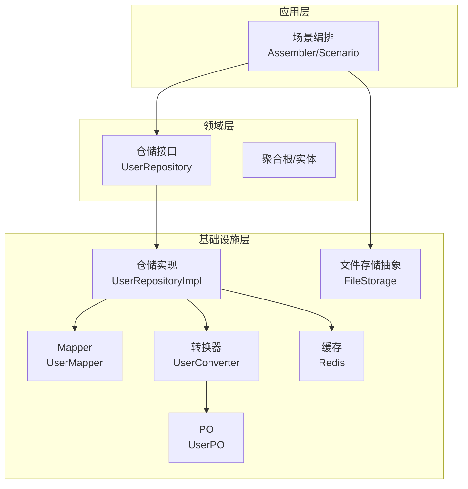
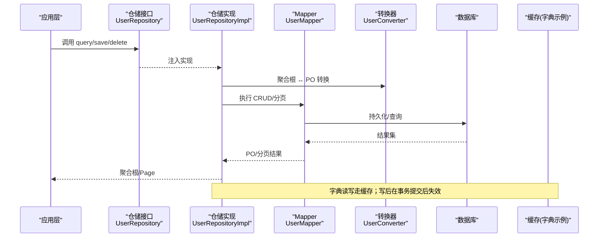
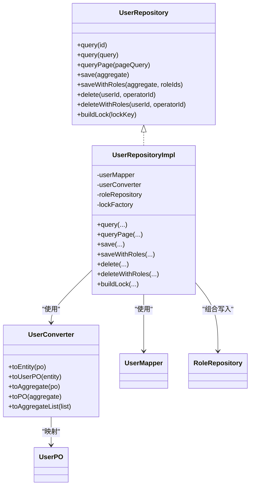
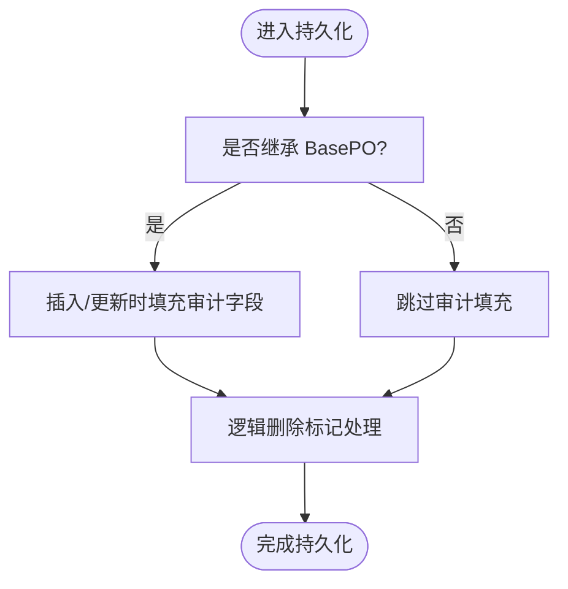
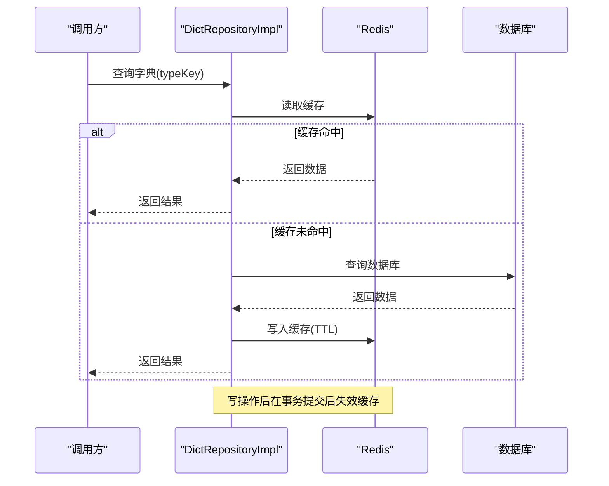
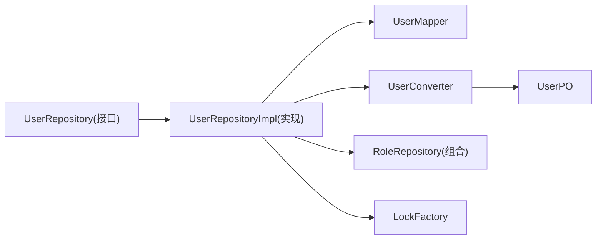

# 基础设施层开发

<cite>
**本文引用的文件**   
- [README.md](file://README.md)
- [MybatisFlexConfigure.java](file://src/main/java/com/sunnao/spring/ddd/template/common/config/MybatisFlexConfigure.java)
- [BasePO.java](file://src/main/java/com/sunnao/spring/ddd/template/common/model/BasePO.java)
- [UserRepository.java](file://src/main/java/com/sunnao/spring/ddd/template/domain/system/user/repository/UserRepository.java)
- [UserRepositoryImpl.java](file://src/main/java/com/sunnao/spring/ddd/template/infrastructure/system/user/repository/UserRepositoryImpl.java)
- [UserPO.java](file://src/main/java/com/sunnao/spring/ddd/template/infrastructure/system/user/mysql/po/UserPO.java)
- [UserConverter.java](file://src/main/java/com/sunnao/spring/ddd/template/infrastructure/system/user/converter/UserConverter.java)
- [application.yaml](file://src/main/resources/application.yaml)
- [V1__init_sys_user.sql](file://src/main/resources/db/migration/V1__init_sys_user.sql)
- [DictRepositoryImpl.java](file://src/main/java/com/sunnao/spring/ddd/template/infrastructure/system/dict/repository/DictRepositoryImpl.java)
- [FileStorage.java](file://src/main/java/com/sunnao/spring/ddd/template/application/system/file/FileStorage.java)
</cite>

## 目录
1. [引言](#引言)
2. [项目结构](#项目结构)
3. [核心组件](#核心组件)
4. [架构总览](#架构总览)
5. [详细组件分析](#详细组件分析)
6. [依赖关系分析](#依赖关系分析)
7. [性能考虑](#性能考虑)
8. [故障排查指南](#故障排查指南)
9. [结论](#结论)
10. [附录](#附录)

## 引言
本指南聚焦于基础设施层的开发与落地规范，围绕仓储接口定义与实现模式、MyBatis-Flex 配置与使用（实体映射、动态 SQL、分页）、PO 对象设计与转换器最佳实践、数据库迁移脚本编写与 Flyway 版本管理、缓存集成与文件存储扩展等主题展开。以 UserRepositoryImpl 为例，展示数据持久化的标准实现路径，帮助团队在 DDD 六边形架构下保持一致的基础设施层编码风格与质量基线。

## 项目结构
本项目遵循六边形架构，基础设施层位于 infrastructure 包内，负责：
- 领域仓储接口的具体实现
- PO 与领域对象的转换（Converter）
- 与外部系统交互的适配（如缓存、文件存储）

图表来源
- [UserRepository.java:1-65](file://src/main/java/com/sunnao/spring/ddd/template/domain/system/user/repository/UserRepository.java#L1-L65)
- [UserRepositoryImpl.java:1-191](file://src/main/java/com/sunnao/spring/ddd/template/infrastructure/system/user/repository/UserRepositoryImpl.java#L1-L191)
- [UserPO.java:1-60](file://src/main/java/com/sunnao/spring/ddd/template/infrastructure/system/user/mysql/po/UserPO.java#L1-L60)
- [UserConverter.java:1-85](file://src/main/java/com/sunnao/spring/ddd/template/infrastructure/system/user/converter/UserConverter.java#L1-L85)
- [FileStorage.java:1-46](file://src/main/java/com/sunnao/spring/ddd/template/application/system/file/FileStorage.java#L1-L46)

章节来源
- [README.md:19-46](file://README.md#L19-L46)

## 核心组件
- 仓储接口与实现分离：领域层仅声明仓储接口，基础设施层提供实现，保证依赖倒置与可测试性。
- 审计字段自动填充：通过 MyBatis-Flex 全局监听器为继承 BasePO 的对象统一填充创建/更新时间与操作人。
- 转换器集中化：使用 MapStruct 生成 PO 与领域实体的双向转换，枚举映射通过 @Named 方法完成。
- 动态查询与分页：基于 QueryWrapper 构建条件，结合 MyBatis-Flex 分页能力返回 Spring Data Page。
- 事务与跨仓储组合：对涉及多仓储的写操作使用 @Transactional 保证一致性。
- 缓存与失效策略：字典模块采用“读缓存 + 写后失效”的策略，失败降级直查数据库。
- 文件存储扩展：应用层定义 FileStorage 抽象，基础设施/适配层提供本地或 S3 兼容实现，按配置切换。

章节来源
- [MybatisFlexConfigure.java:1-73](file://src/main/java/com/sunnao/spring/ddd/template/common/config/MybatisFlexConfigure.java#L1-L73)
- [BasePO.java:1-41](file://src/main/java/com/sunnao/spring/ddd/template/common/model/BasePO.java#L1-L41)
- [UserConverter.java:1-85](file://src/main/java/com/sunnao/spring/ddd/template/infrastructure/system/user/converter/UserConverter.java#L1-L85)
- [UserRepositoryImpl.java:1-191](file://src/main/java/com/sunnao/spring/ddd/template/infrastructure/system/user/repository/UserRepositoryImpl.java#L1-L191)
- [DictRepositoryImpl.java:311-345](file://src/main/java/com/sunnao/spring/ddd/template/infrastructure/system/dict/repository/DictRepositoryImpl.java#L311-L345)
- [FileStorage.java:1-46](file://src/main/java/com/sunnao/spring/ddd/template/application/system/file/FileStorage.java#L1-L46)

## 架构总览
下图展示了从应用层到基础设施层的关键调用链与数据流向，包括仓储实现、转换器、PO 映射、分页与缓存失效。

图表来源
- [UserRepository.java:1-65](file://src/main/java/com/sunnao/spring/ddd/template/domain/system/user/repository/UserRepository.java#L1-L65)
- [UserRepositoryImpl.java:1-191](file://src/main/java/com/sunnao/spring/ddd/template/infrastructure/system/user/repository/UserRepositoryImpl.java#L1-L191)
- [UserConverter.java:1-85](file://src/main/java/com/sunnao/spring/ddd/template/infrastructure/system/user/converter/UserConverter.java#L1-L85)
- [DictRepositoryImpl.java:311-345](file://src/main/java/com/sunnao/spring/ddd/template/infrastructure/system/dict/repository/DictRepositoryImpl.java#L311-L345)

## 详细组件分析

### 仓储接口定义规范与实现模式（以 User 为例）
- 接口职责边界
  - 只暴露必要的持久化与查询能力，复杂组合操作（如保存用户并覆盖角色关联）以组合方法暴露。
  - 提供分布式锁构建入口，便于上层写模式加锁。
- 异常与错误码
  - 所有底层异常统一包装为 RepositoryException，携带 ErrorCodeEnum，避免将技术细节泄露到上层。
- 分页约定
  - 输入 PageQuery，内部转换为 MyBatis-Flex 分页参数，返回 Spring Data Page，保持上层一致的分页体验。
- 事务与一致性
  - 跨仓储组合写操作使用 @Transactional 包裹，确保原子性。

图表来源
- [UserRepository.java:1-65](file://src/main/java/com/sunnao/spring/ddd/template/domain/system/user/repository/UserRepository.java#L1-L65)
- [UserRepositoryImpl.java:1-191](file://src/main/java/com/sunnao/spring/ddd/template/infrastructure/system/user/repository/UserRepositoryImpl.java#L1-L191)
- [UserConverter.java:1-85](file://src/main/java/com/sunnao/spring/ddd/template/infrastructure/system/user/converter/UserConverter.java#L1-L85)
- [UserPO.java:1-60](file://src/main/java/com/sunnao/spring/ddd/template/infrastructure/system/user/mysql/po/UserPO.java#L1-L60)

章节来源
- [UserRepository.java:1-65](file://src/main/java/com/sunnao/spring/ddd/template/domain/system/user/repository/UserRepository.java#L1-L65)
- [UserRepositoryImpl.java:1-191](file://src/main/java/com/sunnao/spring/ddd/template/infrastructure/system/user/repository/UserRepositoryImpl.java#L1-L191)

### MyBatis-Flex 配置与使用
- 全局审计字段填充
  - 通过 MyBatis-FlexCustomizer 注册 InsertListener/UpdateListener，对继承 BasePO 的对象自动填充 createAt/updateAt/createBy/updateBy。
  - 操作人取自 CurrentUserContext，已显式赋值的操作人字段不覆盖。
- 逻辑删除
  - 全局配置 normal-value-of-logic-delete=0、deleted-value-of-logic-delete=1，配合 PO 上 @Column(isLogicDelete=true) 生效。
- 实体映射
  - PO 使用 @Table/@Id/@Column 注解与表结构对应，主键自增 KeyType.Auto。
- 动态 SQL 与分页
  - 使用 QueryWrapper.create() 构建条件，支持等值、模糊、排序等；分页使用 mybatis-flex 的 paginate 方法，再封装为 Spring Data Page。

图表来源
- [MybatisFlexConfigure.java:1-73](file://src/main/java/com/sunnao/spring/ddd/template/common/config/MybatisFlexConfigure.java#L1-L73)
- [BasePO.java:1-41](file://src/main/java/com/sunnao/spring/ddd/template/common/model/BasePO.java#L1-L41)
- [UserPO.java:1-60](file://src/main/java/com/sunnao/spring/ddd/template/infrastructure/system/user/mysql/po/UserPO.java#L1-L60)
- [application.yaml:38-42](file://src/main/resources/application.yaml#L38-L42)

章节来源
- [MybatisFlexConfigure.java:1-73](file://src/main/java/com/sunnao/spring/ddd/template/common/config/MybatisFlexConfigure.java#L1-L73)
- [BasePO.java:1-41](file://src/main/java/com/sunnao/spring/ddd/template/common/model/BasePO.java#L1-L41)
- [UserPO.java:1-60](file://src/main/java/com/sunnao/spring/ddd/template/infrastructure/system/user/mysql/po/UserPO.java#L1-L60)
- [application.yaml:38-42](file://src/main/resources/application.yaml#L38-L42)

### PO 对象设计与转换器最佳实践
- PO 设计要点
  - 仅承载数据映射，不包含业务逻辑；继承 BasePO 获得审计字段；需要逻辑删除的表在 PO 上声明 deleted 字段并使用 isLogicDelete。
- 转换器设计要点
  - 使用 MapStruct 接口，componentModel=spring，由容器管理实例；@Mapping 指定字段映射；枚举转换通过 @Named 方法集中实现；提供 toAggregate/toPO 默认方法简化聚合根与 PO 的互转。
- 数据模型转换最佳实践
  - 领域层与基础设施层之间严格隔离，禁止直接共享 PO；所有转换集中在 Converter，避免散落的 set/get 代码。

章节来源
- [UserPO.java:1-60](file://src/main/java/com/sunnao/spring/ddd/template/infrastructure/system/user/mysql/po/UserPO.java#L1-L60)
- [UserConverter.java:1-85](file://src/main/java/com/sunnao/spring/ddd/template/infrastructure/system/user/converter/UserConverter.java#L1-L85)

### 数据库迁移脚本编写规范（Flyway 版本管理与回滚策略）
- 命名与顺序
  - 使用 V{序号}__描述.sql 命名，按数字递增执行；新增变更追加新版本号。
- 内容规范
  - 建表需包含审计字段与逻辑删除列；为唯一约束添加索引；必要时提供种子数据。
- 版本管理与兼容性
  - application.yaml 中启用 Flyway，locations 指向 db/migration；baseline-on-migrate=true 兼容已有库，全新库正常从 V1 开始。
- 回滚策略
  - 建议每个迁移脚本幂等且可重复执行；如需回滚，提供反向脚本并在发布流程中明确执行顺序；对于破坏性变更，先做数据迁移再删字段。

章节来源
- [application.yaml:32-36](file://src/main/resources/application.yaml#L32-L36)
- [V1__init_sys_user.sql:1-51](file://src/main/resources/db/migration/V1__init_sys_user.sql#L1-L51)

### 缓存集成与失效策略（字典模块示例）
- 读取路径
  - 优先从 Redis 获取字典数据，未命中则回源数据库并回填缓存。
- 写入路径
  - 写操作完成后，在事务提交后失效对应 typeKey 的缓存，避免并发窗口读到旧数据。
- 容错降级
  - 缓存读写失败记录日志并降级为直查数据库，TTL 兜底防止脏数据长存。

图表来源
- [DictRepositoryImpl.java:311-345](file://src/main/java/com/sunnao/spring/ddd/template/infrastructure/system/dict/repository/DictRepositoryImpl.java#L311-L345)

章节来源
- [DictRepositoryImpl.java:311-345](file://src/main/java/com/sunnao/spring/ddd/template/infrastructure/system/dict/repository/DictRepositoryImpl.java#L311-L345)

### 文件存储扩展（应用层抽象 + 多实现）
- 抽象接口
  - 在应用层定义 FileStorage 接口，声明 store/read/delete 与 getStorageType，所有方法返回 ResultDO，不抛异常。
- 实现与切换
  - 基础设施/适配层提供 LocalFileStorage/S3FileStorage 等实现，通过配置项 app.file.storage-type 切换；S3 相关密钥通过环境变量注入，不落盘。
- 元数据落库
  - 文件元数据中的 storage_type 记录实际使用的存储类型，以便后续下载/删除时选择正确的实现。

章节来源
- [FileStorage.java:1-46](file://src/main/java/com/sunnao/spring/ddd/template/application/system/file/FileStorage.java#L1-L46)
- [application.yaml:64-88](file://src/main/resources/application.yaml#L64-L88)

## 依赖关系分析
- 耦合与内聚
  - 仓储实现与 Mapper/Converter 强耦合，但职责单一、内聚度高；与领域仓储接口松耦合，符合依赖倒置。
- 外部依赖
  - 数据库（PostgreSQL）、缓存（Redis）、对象存储（S3 兼容）。
- 潜在循环依赖
  - 仓储实现间通过组合方法协作（如 saveWithRoles 委托 RoleRepository），注意避免循环引用，必要时引入领域服务协调。

图表来源
- [UserRepository.java:1-65](file://src/main/java/com/sunnao/spring/ddd/template/domain/system/user/repository/UserRepository.java#L1-L65)
- [UserRepositoryImpl.java:1-191](file://src/main/java/com/sunnao/spring/ddd/template/infrastructure/system/user/repository/UserRepositoryImpl.java#L1-L191)
- [UserConverter.java:1-85](file://src/main/java/com/sunnao/spring/ddd/template/infrastructure/system/user/converter/UserConverter.java#L1-L85)
- [UserPO.java:1-60](file://src/main/java/com/sunnao/spring/ddd/template/infrastructure/system/user/mysql/po/UserPO.java#L1-L60)

章节来源
- [UserRepository.java:1-65](file://src/main/java/com/sunnao/spring/ddd/template/domain/system/user/repository/UserRepository.java#L1-L65)
- [UserRepositoryImpl.java:1-191](file://src/main/java/com/sunnao/spring/ddd/template/infrastructure/system/user/repository/UserRepositoryImpl.java#L1-L191)

## 性能考虑
- 查询优化
  - 合理使用 QueryWrapper 条件，避免全表扫描；为高频查询字段建立合适索引（如邮箱唯一索引）。
- 分页优化
  - 使用 MyBatis-Flex 原生分页，减少内存占用；合理设置 pageSize，避免过大导致响应慢。
- 事务边界
  - 组合写操作尽量缩小事务范围，减少锁持有时间；跨仓储组合方法置于同一事务，避免部分成功。
- 缓存策略
  - 热点数据（如字典）优先读缓存；写后在事务提交后失效，降低脏读概率；缓存失败降级直查数据库。
- 连接池与资源
  - 根据压测调整数据库连接池与 Redis Lettuce 池大小，避免瓶颈。

[本节为通用指导，无需特定文件来源]

## 故障排查指南
- 常见异常
  - 查询/保存/删除异常会被包装为 RepositoryException，检查日志中的错误码与堆栈定位问题。
- 审计字段未填充
  - 确认 PO 继承 BasePO 且 MyBatis-Flex 全局监听器已注册；检查 CurrentUserContext 是否正确设置当前用户。
- 分页结果异常
  - 核对 PageQuery 的 startIndex/pageSize 计算；确认 QueryWrapper 条件与排序字段存在。
- 缓存不一致
  - 检查写操作是否在事务提交后失效缓存；关注缓存失败降级日志。
- 文件存储不可用
  - 校验 app.file.storage-type 与对应实现配置；S3 相关密钥通过环境变量注入，确认非空。

章节来源
- [UserRepositoryImpl.java:1-191](file://src/main/java/com/sunnao/spring/ddd/template/infrastructure/system/user/repository/UserRepositoryImpl.java#L1-L191)
- [MybatisFlexConfigure.java:1-73](file://src/main/java/com/sunnao/spring/ddd/template/common/config/MybatisFlexConfigure.java#L1-L73)
- [DictRepositoryImpl.java:311-345](file://src/main/java/com/sunnao/spring/ddd/template/infrastructure/system/dict/repository/DictRepositoryImpl.java#L311-L345)
- [application.yaml:64-88](file://src/main/resources/application.yaml#L64-L88)

## 结论
基础设施层在 DDD 六边形架构中承担“技术实现”的职责：通过仓储接口与实现的解耦、统一的转换器与 PO 规范、完善的 MyBatis-Flex 配置与审计机制、稳健的 Flyway 迁移与缓存策略，以及可扩展的文件存储抽象，形成高内聚、低耦合、易维护的数据访问与外部集成层。遵循本文规范，可显著提升团队协作效率与系统稳定性。

[本节为总结性内容，无需特定文件来源]

## 附录
- 快速参考
  - 仓储接口定义位置：domain/{业务}/repository
  - 仓储实现位置：infrastructure/{业务}/repository
  - PO 与 Mapper 位置：infrastructure/{业务}/mysql/{po,mapper}
  - 转换器位置：infrastructure/{业务}/converter
  - 迁移脚本位置：src/main/resources/db/migration
  - 应用配置位置：src/main/resources/application.yaml

[本节为概览性内容，无需特定文件来源]