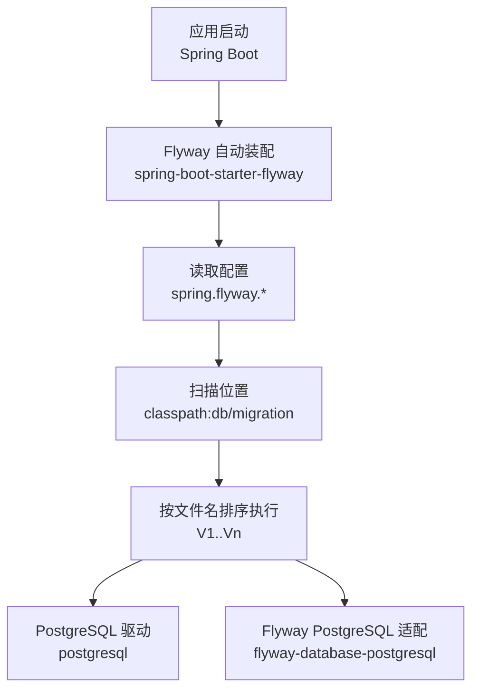
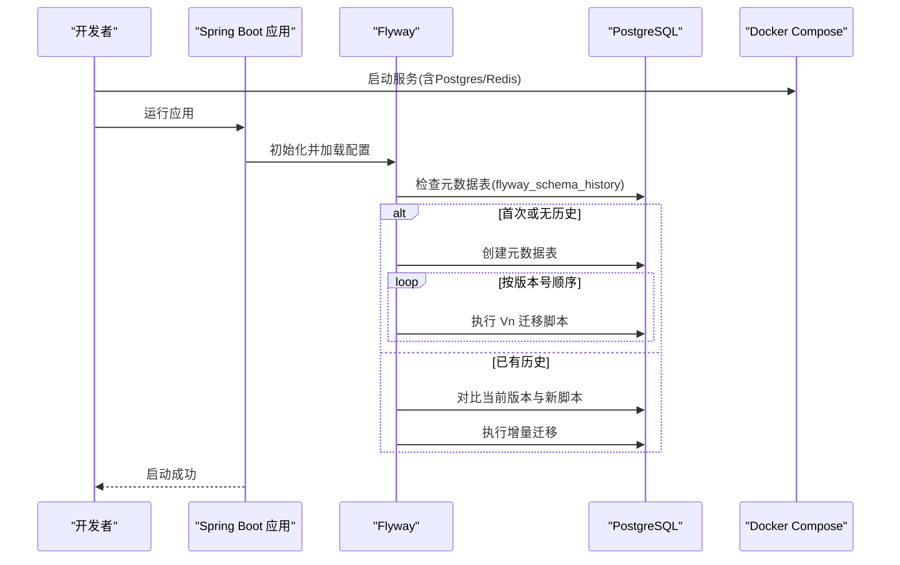
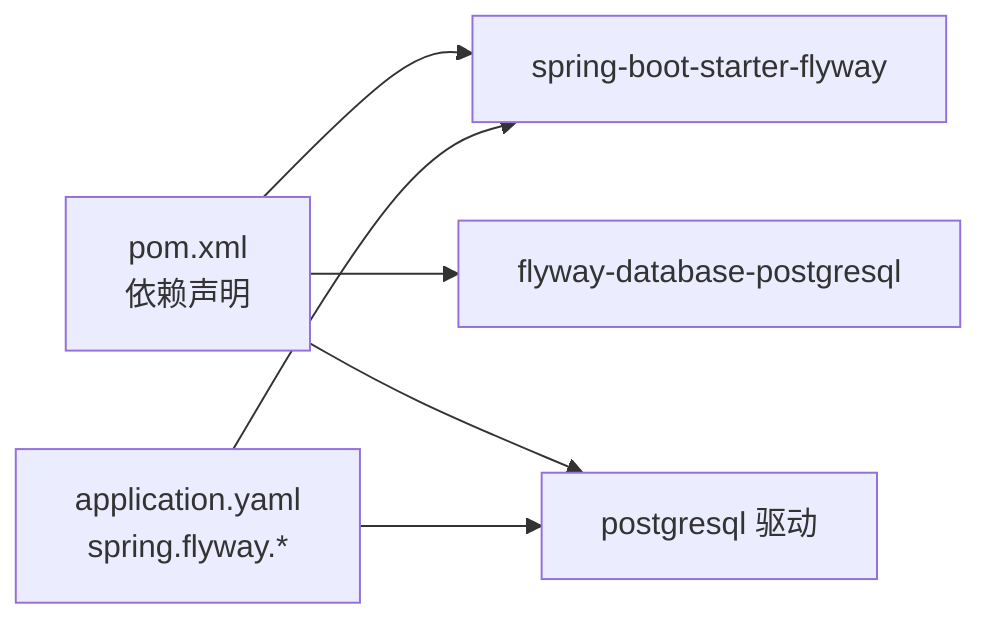

# 数据库迁移

<cite>
**本文引用的文件**
- [pom.xml](file://pom.xml)
- [application.yaml](file://src/main/resources/application.yaml)
- [application-prod.yaml](file://src/main/resources/application-prod.yaml)
- [docker-compose.yaml](file://docker-compose.yaml)
- [V1__init_sys_user.sql](file://src/main/resources/db/migration/V1__init_sys_user.sql)
- [V2__init_rbac.sql](file://src/main/resources/db/migration/V2__init_rbac.sql)
- [V3__init_sys_oper_log.sql](file://src/main/resources/db/migration/V3__init_sys_oper_log.sql)
- [V4__init_dict.sql](file://src/main/resources/db/migration/V4__init_dict.sql)
- [V5__init_sys_file.sql](file://src/main/resources/db/migration/V5__init_sys_file.sql)
- [V6__init_sys_login_log.sql](file://src/main/resources/db/migration/V6__init_sys_login_log.sql)
- [SpringDddTemplateApplicationTests.java](file://src/test/java/com/sunnao/spring/ddd/template/SpringDddTemplateApplicationTests.java)
- [application-test.yaml](file://src/test/resources/application-test.yaml)
</cite>

## 目录
1. [简介](#简介)
2. [项目结构](#项目结构)
3. [核心组件](#核心组件)
4. [架构总览](#架构总览)
5. [详细组件分析](#详细组件分析)
6. [依赖关系分析](#依赖关系分析)
7. [性能与索引设计](#性能与索引设计)
8. [生产环境迁移策略](#生产环境迁移策略)
9. [测试与验证](#测试与验证)
10. [故障排查指南](#故障排查指南)
11. [结论](#结论)

## 简介
本指南面向使用 Spring Boot + Flyway 的数据库版本化管理实践，结合仓库现有实现，系统化说明：
- Flyway 的版本管理与配置要点
- 迁移脚本命名规范与版本控制策略
- SQL 编写最佳实践（建表、索引、约束、注释、种子数据）
- 迁移生命周期管理（升级、回滚、校验）
- 生产环境发布策略（灰度、备份、回退）
- 迁移脚本测试方法与常见问题排查

## 项目结构
本项目采用 DDD 分层组织代码，数据库迁移脚本统一放置在 resources/db/migration 下，由 Flyway 在应用启动时自动执行。

图表来源
- [pom.xml:141-150](file://pom.xml#L141-L150)
- [application.yaml:32-36](file://src/main/resources/application.yaml#L32-L36)
- [docker-compose.yaml:1-20](file://docker-compose.yaml#L1-L20)

章节来源
- [pom.xml:141-150](file://pom.xml#L141-L150)
- [application.yaml:32-36](file://src/main/resources/application.yaml#L32-L36)

## 核心组件
- 依赖与自动装配
  - 引入 spring-boot-starter-flyway 以启用 Flyway 自动装配；仅引入 flyway-core 不会触发迁移。
  - 引入 flyway-database-postgresql 以支持 PostgreSQL 方言与元数据表。
- 配置项
  - spring.flyway.enabled=true
  - spring.flyway.locations=classpath:db/migration
  - spring.flyway.baseline-on-migrate=true（兼容已有库）
- 数据库连接
  - 通过环境变量注入 JDBC URL、用户名、密码等。
- 本地开发环境
  - docker-compose 提供 PostgreSQL 与 Redis，应用启动即完成迁移。

章节来源
- [pom.xml:141-150](file://pom.xml#L141-L150)
- [application.yaml:9-13](file://src/main/resources/application.yaml#L9-L13)
- [application.yaml:32-36](file://src/main/resources/application.yaml#L32-L36)
- [docker-compose.yaml:1-20](file://docker-compose.yaml#L1-L20)

## 架构总览
下图展示了从应用启动到数据库迁移执行的端到端流程。

图表来源
- [application.yaml:32-36](file://src/main/resources/application.yaml#L32-L36)
- [pom.xml:141-150](file://pom.xml#L141-L150)
- [docker-compose.yaml:1-20](file://docker-compose.yaml#L1-L20)

## 详细组件分析

### 迁移脚本与命名规范
- 命名规则
  - 使用 V{version}__description.sql 形式，例如 V1__init_sys_user.sql。
  - version 为纯数字，确保严格递增；描述部分用下划线分隔英文单词。
- 版本控制策略
  - 每个变更对应一个独立脚本，保持幂等性原则（尽量可重复执行或包含存在性判断）。
  - 禁止修改已发布的脚本；如需修正，应新增更高版本脚本进行修复。
- 基线策略
  - baseline-on-migrate=true 用于兼容已有库：当 schema 非空时，将当前最高版本作为基线，不再重放旧脚本。
  - 全新库则从 V1 开始正常迁移。

章节来源
- [application.yaml:32-36](file://src/main/resources/application.yaml#L32-L36)
- [V1__init_sys_user.sql:1-51](file://src/main/resources/db/migration/V1__init_sys_user.sql#L1-L51)
- [V2__init_rbac.sql:1-158](file://src/main/resources/db/migration/V2__init_rbac.sql#L1-L158)

### SQL 编写规范与最佳实践
- 表与字段
  - 主键优先使用自增 BIGSERIAL。
  - 通用审计字段：create_at、update_at、create_by、update_by、deleted（逻辑删除）。
  - 所有文本字段需定义合理长度，避免过大导致存储与索引成本上升。
- 约束与唯一性
  - 对业务唯一字段建立唯一索引，并结合 deleted 条件实现“软唯一”（如邮箱、角色标识、权限标识）。
  - 关联表使用复合唯一索引防止重复关联。
- 索引设计
  - 查询频繁字段建立普通索引；时间范围查询建议降序索引便于分页。
  - 组合索引遵循最左前缀原则，避免冗余索引。
- 注释与可读性
  - 表与列均添加 COMMENT，便于文档化与维护。
- 种子数据
  - 初始数据放在首个或相关版本脚本中，注意幂等与安全性（如管理员初始密码提示修改）。
- 示例参考路径
  - 用户表与邮箱唯一索引、种子管理员：[V1__init_sys_user.sql:1-51](file://src/main/resources/db/migration/V1__init_sys_user.sql#L1-L51)
  - RBAC 模型与迁移：[V2__init_rbac.sql:1-158](file://src/main/resources/db/migration/V2__init_rbac.sql#L1-L158)
  - 操作日志表与索引：[V3__init_sys_oper_log.sql:1-45](file://src/main/resources/db/migration/V3__init_sys_oper_log.sql#L1-L45)
  - 字典类型与数据：[V4__init_dict.sql:1-95](file://src/main/resources/db/migration/V4__init_dict.sql#L1-L95)
  - 文件表与索引：[V5__init_sys_file.sql:1-43](file://src/main/resources/db/migration/V5__init_sys_file.sql#L1-L43)
  - 登录日志表与索引：[V6__init_sys_login_log.sql:1-42](file://src/main/resources/db/migration/V6__init_sys_login_log.sql#L1-L42)

章节来源
- [V1__init_sys_user.sql:1-51](file://src/main/resources/db/migration/V1__init_sys_user.sql#L1-L51)
- [V2__init_rbac.sql:1-158](file://src/main/resources/db/migration/V2__init_rbac.sql#L1-L158)
- [V3__init_sys_oper_log.sql:1-45](file://src/main/resources/db/migration/V3__init_sys_oper_log.sql#L1-L45)
- [V4__init_dict.sql:1-95](file://src/main/resources/db/migration/V4__init_dict.sql#L1-L95)
- [V5__init_sys_file.sql:1-43](file://src/main/resources/db/migration/V5__init_sys_file.sql#L1-L43)
- [V6__init_sys_login_log.sql:1-42](file://src/main/resources/db/migration/V6__init_sys_login_log.sql#L1-L42)

### 数据迁移生命周期管理
- 升级（上线）
  - 部署新版本后，应用启动时 Flyway 自动检测并执行未运行的脚本。
  - 建议在低峰期发布，配合只读副本先行验证。
- 回滚
  - 生产环境不建议直接回滚脚本。推荐做法：
    - 编写反向修复脚本（更高版本），逐步恢复数据结构与数据。
    - 若必须回滚，先在测试/预发环境完整演练，再制定分步回退方案。
- 校验
  - 可通过集成测试或 CI 流水线启动应用，观察迁移是否成功。
  - 使用 baseline-on-migrate 时，确认目标库的历史版本与期望一致。

章节来源
- [application.yaml:32-36](file://src/main/resources/application.yaml#L32-L36)
- [SpringDddTemplateApplicationTests.java:1-24](file://src/test/java/com/sunnao/spring/ddd/template/SpringDddTemplateApplicationTests.java#L1-L24)

### 生产环境迁移策略
- 灰度发布
  - 先扩容少量实例，观察迁移日志与慢查询；稳定后再全量切换。
- 数据备份
  - 发布前对关键库执行快照或逻辑备份，确保可快速恢复。
- 故障恢复
  - 准备一键回滚脚本与恢复步骤；必要时切换到只读模式，暂停写入后再执行修复。
- 监控与告警
  - 关注迁移耗时、锁等待、长事务与错误日志；设置阈值告警。

[本节为通用策略说明，不直接分析具体文件]

## 依赖关系分析
- 运行时依赖
  - spring-boot-starter-flyway：启用 Flyway 自动装配与迁移执行。
  - flyway-database-postgresql：提供 PostgreSQL 方言与元数据表支持。
  - postgresql：JDBC 驱动。
- 配置依赖
  - spring.flyway.* 控制迁移行为与位置。
  - datasource.* 提供连接信息。

图表来源
- [pom.xml:141-150](file://pom.xml#L141-L150)
- [application.yaml:32-36](file://src/main/resources/application.yaml#L32-L36)

章节来源
- [pom.xml:141-150](file://pom.xml#L141-L150)
- [application.yaml:32-36](file://src/main/resources/application.yaml#L32-L36)

## 性能与索引设计
- 常见索引模式
  - 时间范围查询：create_at DESC 索引提升分页与统计性能。
  - 外键/关联查询：user_id、operator_id、type_key 等高频过滤字段建立索引。
  - 唯一性约束：email、role_key、perm_key、type_key+dict_value 等使用唯一索引。
- 注意事项
  - 避免过度索引影响写入性能。
  - 大表变更（加索引、改列）建议在低峰期执行，并评估锁等待。
- 参考路径
  - 操作日志时间索引：[V3__init_sys_oper_log.sql:42-45](file://src/main/resources/db/migration/V3__init_sys_oper_log.sql#L42-L45)
  - 登录日志多字段索引：[V6__init_sys_login_log.sql:39-42](file://src/main/resources/db/migration/V6__init_sys_login_log.sql#L39-L42)
  - 字典联合唯一索引：[V4__init_dict.sql:85-86](file://src/main/resources/db/migration/V4__init_dict.sql#L85-L86)

章节来源
- [V3__init_sys_oper_log.sql:42-45](file://src/main/resources/db/migration/V3__init_sys_oper_log.sql#L42-L45)
- [V6__init_sys_login_log.sql:39-42](file://src/main/resources/db/migration/V6__init_sys_login_log.sql#L39-L42)
- [V4__init_dict.sql:85-86](file://src/main/resources/db/migration/V4__init_dict.sql#L85-L86)

## 测试与验证
- 本地开发
  - 使用 docker-compose 启动 Postgres 与 Redis，应用启动即完成迁移。
- 集成测试
  - 通过 @ActiveProfiles("test") 与 application-test.yaml 指定测试库连接。
  - 使用 @EnabledIfEnvironmentVariable 控制是否需要真实数据库；满足条件时启动上下文并完成迁移。
- 验证方式
  - 查看启动日志中的 Flyway 执行记录。
  - 连接数据库检查 flyway_schema_history 与目标表结构。

章节来源
- [docker-compose.yaml:1-20](file://docker-compose.yaml#L1-L20)
- [application-test.yaml:1-17](file://src/test/resources/application-test.yaml#L1-L17)
- [SpringDddTemplateApplicationTests.java:1-24](file://src/test/java/com/sunnao/spring/ddd/template/SpringDddTemplateApplicationTests.java#L1-L24)

## 故障排查指南
- 无法连接数据库
  - 检查环境变量 DB_HOST、DB_PORT、DB_NAME、DB_USERNAME、DB_PASSWORD 是否正确。
  - 确认 docker-compose 容器健康状态与端口映射。
- 迁移未执行
  - 确认 spring.flyway.enabled=true 且 locations 指向正确目录。
  - 若使用 baseline-on-migrate，核对目标库历史版本是否与预期一致。
- 重复执行报错
  - 检查脚本是否幂等；避免重复 INSERT 或重复创建对象。
- 索引冲突
  - 唯一索引失败通常因存在重复数据，需清理或调整脚本逻辑。
- 生产回滚
  - 优先编写正向修复脚本；确需回滚时，先在预发演练并准备数据备份。

章节来源
- [application.yaml:9-13](file://src/main/resources/application.yaml#L9-L13)
- [application.yaml:32-36](file://src/main/resources/application.yaml#L32-L36)
- [docker-compose.yaml:1-20](file://docker-compose.yaml#L1-L20)

## 结论
本项目基于 Spring Boot 与 Flyway 实现了标准化的数据库版本化管理。通过严格的脚本命名、合理的索引设计与完善的基线策略，既保证了新库从零构建的一致性，也兼顾了存量库平滑升级的需求。在生产环境中，建议结合灰度发布、数据备份与回滚演练，确保迁移过程安全可控。