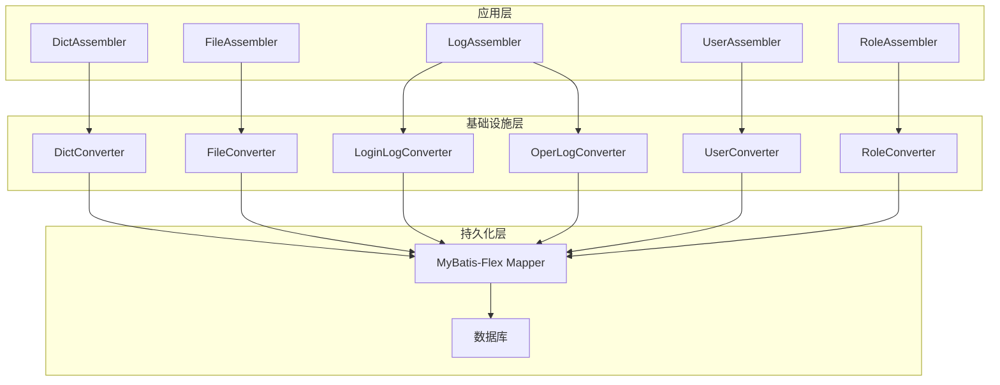
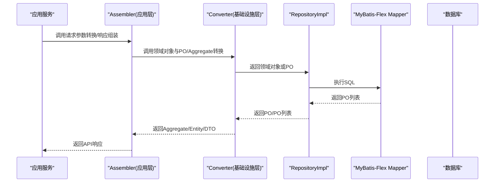
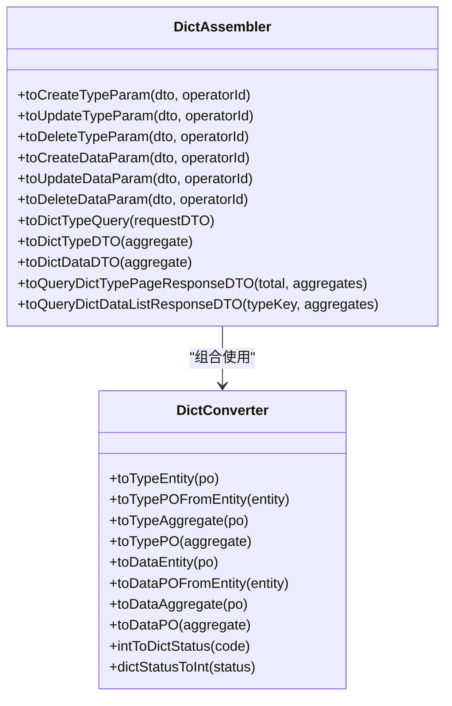
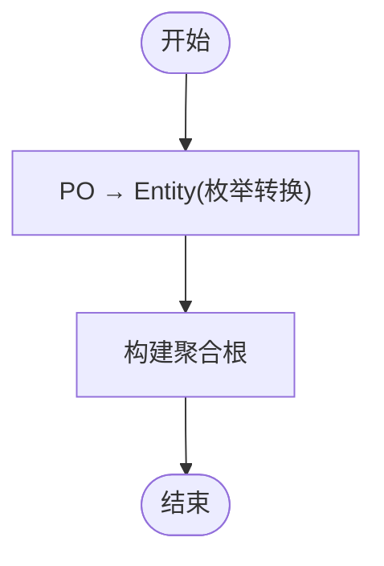
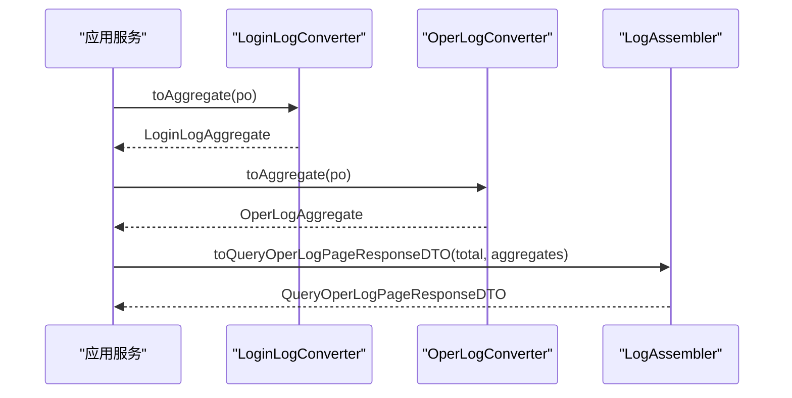
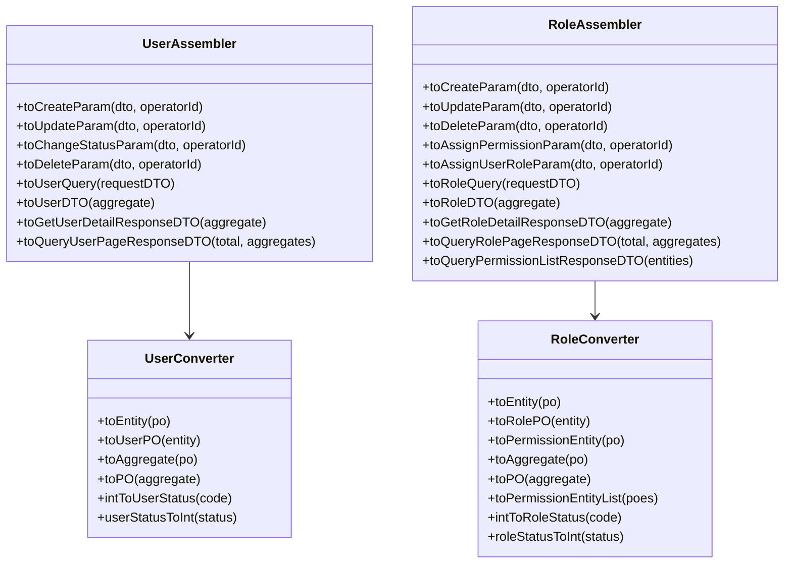
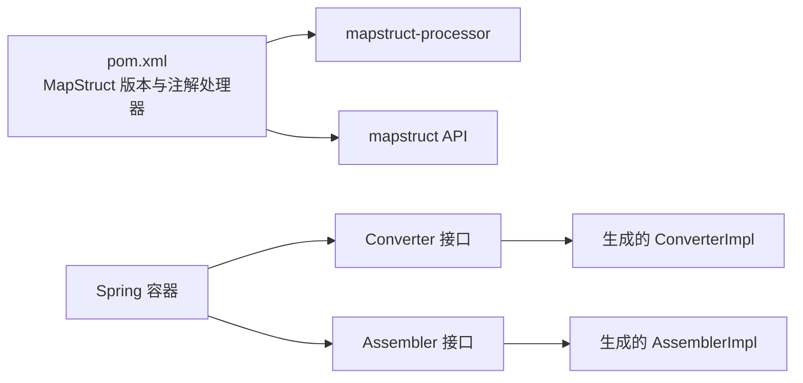

# 数据转换器

<cite>
**本文引用的文件**   
- [pom.xml](file://pom.xml)
- [SpringDddTemplateApplication.java](file://src/main/java/com/sunnao/spring/ddd/template/SpringDddTemplateApplication.java)
- [DictConverter.java](file://src/main/java/com/sunnao/spring/ddd/template/infrastructure/system/dict/converter/DictConverter.java)
- [FileConverter.java](file://src/main/java/com/sunnao/spring/ddd/template/infrastructure/system/file/converter/FileConverter.java)
- [LoginLogConverter.java](file://src/main/java/com/sunnao/spring/ddd/template/infrastructure/system/log/converter/LoginLogConverter.java)
- [OperLogConverter.java](file://src/main/java/com/sunnao/spring/ddd/template/infrastructure/system/log/converter/OperLogConverter.java)
- [UserConverter.java](file://src/main/java/com/sunnao/spring/ddd/template/infrastructure/system/user/converter/UserConverter.java)
- [RoleConverter.java](file://src/main/java/com/sunnao/spring/ddd/template/infrastructure/system/role/converter/RoleConverter.java)
- [DictAssembler.java](file://src/main/java/com/sunnao/spring/ddd/template/application/system/dict/assembler/DictAssembler.java)
- [FileAssembler.java](file://src/main/java/com/sunnao/spring/ddd/template/application/system/file/assembler/FileAssembler.java)
- [LogAssembler.java](file://src/main/java/com/sunnao/spring/ddd/template/application/system/log/assembler/LogAssembler.java)
- [RoleAssembler.java](file://src/main/java/com/sunnao/spring/ddd/template/application/system/role/assembler/RoleAssembler.java)
- [UserAssembler.java](file://src/main/java/com/sunnao/spring/ddd/template/application/system/user/assembler/UserAssembler.java)
</cite>

## 目录
1. [引言](#引言)
2. [项目结构](#项目结构)
3. [核心组件](#核心组件)
4. [架构总览](#架构总览)
5. [详细组件分析](#详细组件分析)
6. [依赖分析](#依赖分析)
7. [性能考虑](#性能考虑)
8. [故障排查指南](#故障排查指南)
9. [结论](#结论)
10. [附录](#附录)

## 引言
本指南聚焦于 MapStruct 数据转换器的使用与最佳实践，围绕 DTO、PO、Aggregate（聚合根）之间的双向转换展开。文档结合仓库中基础设施层与应用层的转换器实现，系统阐述：
- 命名规范与职责边界（Infrastructure Converter vs Application Assembler）
- 复杂对象转换策略（嵌套对象、集合、枚举、字段重映射、忽略字段、默认值）
- 批量转换与缓存策略
- 错误处理与调试方法

## 项目结构
本项目采用 DDD 分层组织，MapStruct 转换器主要分布在两个层次：
- 基础设施层 converter：负责 PO 与领域实体/聚合根之间的纯技术转换
- 应用层 assembler：负责 RequestDTO/ResponseDTO 与领域对象（Aggregate/Entity/Param/Query）之间的转换

图表来源
- [SpringDddTemplateApplication.java:1-20](file://src/main/java/com/sunnao/spring/ddd/template/SpringDddTemplateApplication.java#L1-L20)
- [DictConverter.java:1-140](file://src/main/java/com/sunnao/spring/ddd/template/infrastructure/system/dict/converter/DictConverter.java#L1-L140)
- [FileConverter.java:1-84](file://src/main/java/com/sunnao/spring/ddd/template/infrastructure/system/file/converter/FileConverter.java#L1-L84)
- [LoginLogConverter.java:1-64](file://src/main/java/com/sunnao/spring/ddd/template/infrastructure/system/log/converter/LoginLogConverter.java#L1-L64)
- [OperLogConverter.java:1-64](file://src/main/java/com/sunnao/spring/ddd/template/infrastructure/system/log/converter/OperLogConverter.java#L1-L64)
- [UserConverter.java:1-85](file://src/main/java/com/sunnao/spring/ddd/template/infrastructure/system/user/converter/UserConverter.java#L1-L85)
- [RoleConverter.java:1-101](file://src/main/java/com/sunnao/spring/ddd/template/infrastructure/system/role/converter/RoleConverter.java#L1-L101)
- [DictAssembler.java:1-178](file://src/main/java/com/sunnao/spring/ddd/template/application/system/dict/assembler/DictAssembler.java#L1-L178)
- [FileAssembler.java:1-123](file://src/main/java/com/sunnao/spring/ddd/template/application/system/file/assembler/FileAssembler.java#L1-L123)
- [LogAssembler.java:1-112](file://src/main/java/com/sunnao/spring/ddd/template/application/system/log/assembler/LogAssembler.java#L1-L112)
- [RoleAssembler.java:1-153](file://src/main/java/com/sunnao/spring/ddd/template/application/system/role/assembler/RoleAssembler.java#L1-L153)
- [UserAssembler.java:1-123](file://src/main/java/com/sunnao/spring/ddd/template/application/system/user/assembler/UserAssembler.java#L1-L123)

章节来源
- [pom.xml:1-217](file://pom.xml#L1-L217)
- [SpringDddTemplateApplication.java:1-20](file://src/main/java/com/sunnao/spring/ddd/template/SpringDddTemplateApplication.java#L1-L20)

## 核心组件
- 基础设施层转换器（Converter）
  - 职责：PO ↔ Entity/Aggregate 的纯技术映射；不包含业务逻辑
  - 典型能力：枚举转换、字段忽略、字段重映射、集合转换、聚合根包装/拆解
- 应用层装配器（Assembler）
  - 职责：RequestDTO/ResponseDTO ↔ Aggregate/Entity/Param/Query 的适配映射
  - 典型能力：上下文注入（操作人）、状态码与枚举互转、分页响应组装

章节来源
- [DictConverter.java:1-140](file://src/main/java/com/sunnao/spring/ddd/template/infrastructure/system/dict/converter/DictConverter.java#L1-L140)
- [FileConverter.java:1-84](file://src/main/java/com/sunnao/spring/ddd/template/infrastructure/system/file/converter/FileConverter.java#L1-L84)
- [LoginLogConverter.java:1-64](file://src/main/java/com/sunnao/spring/ddd/template/infrastructure/system/log/converter/LoginLogConverter.java#L1-L64)
- [OperLogConverter.java:1-64](file://src/main/java/com/sunnao/spring/ddd/template/infrastructure/system/log/converter/OperLogConverter.java#L1-L64)
- [UserConverter.java:1-85](file://src/main/java/com/sunnao/spring/ddd/template/infrastructure/system/user/converter/UserConverter.java#L1-L85)
- [RoleConverter.java:1-101](file://src/main/java/com/sunnao/spring/ddd/template/infrastructure/system/role/converter/RoleConverter.java#L1-L101)
- [DictAssembler.java:1-178](file://src/main/java/com/sunnao/spring/ddd/template/application/system/dict/assembler/DictAssembler.java#L1-L178)
- [FileAssembler.java:1-123](file://src/main/java/com/sunnao/spring/ddd/template/application/system/file/assembler/FileAssembler.java#L1-L123)
- [LogAssembler.java:1-112](file://src/main/java/com/sunnao/spring/ddd/template/application/system/log/assembler/LogAssembler.java#L1-L112)
- [RoleAssembler.java:1-153](file://src/main/java/com/sunnao/spring/ddd/template/application/system/role/assembler/RoleAssembler.java#L1-L153)
- [UserAssembler.java:1-123](file://src/main/java/com/sunnao/spring/ddd/template/application/system/user/assembler/UserAssembler.java#L1-L123)

## 架构总览
MapStruct 在编译期生成实现类，运行时通过 Spring 容器管理实例。项目通过注解处理器启用 MapStruct，并在启动类扫描 MyBatis-Flex Mapper（与 MapStruct 无关但同属基础设施）。

图表来源
- [DictAssembler.java:1-178](file://src/main/java/com/sunnao/spring/ddd/template/application/system/dict/assembler/DictAssembler.java#L1-L178)
- [DictConverter.java:1-140](file://src/main/java/com/sunnao/spring/ddd/template/infrastructure/system/dict/converter/DictConverter.java#L1-L140)

## 详细组件分析

### 字典模块转换器
- 基础设施层 DictConverter
  - 支持类型与数据的 Entity↔PO 转换
  - 提供 toTypeAggregate/toDataAggregate 等聚合根包装方法
  - 使用 @Mapping 进行字段重映射与 ignore 忽略
  - 使用 @Named 定义枚举转换辅助方法
- 应用层 DictAssembler
  - 将 RequestDTO 转为 Param/Query，并注入 operatorId
  - 将 Aggregate 转为 ResponseDTO，完成枚举→状态码转换

图表来源
- [DictConverter.java:1-140](file://src/main/java/com/sunnao/spring/ddd/template/infrastructure/system/dict/converter/DictConverter.java#L1-L140)
- [DictAssembler.java:1-178](file://src/main/java/com/sunnao/spring/ddd/template/application/system/dict/assembler/DictAssembler.java#L1-L178)

章节来源
- [DictConverter.java:1-140](file://src/main/java/com/sunnao/spring/ddd/template/infrastructure/system/dict/converter/DictConverter.java#L1-L140)
- [DictAssembler.java:1-178](file://src/main/java/com/sunnao/spring/ddd/template/application/system/dict/assembler/DictAssembler.java#L1-L178)

### 文件模块转换器
- 基础设施层 FileConverter
  - 枚举 String↔枚举类型转换
  - 提供 toAggregate/toPO 及列表转换
- 应用层 FileAssembler
  - 上传/删除/查询的请求到 Param/Query 转换
  - 聚合根到 ResponseDTO 的转换（含内容下载场景）

图表来源
- [FileConverter.java:1-84](file://src/main/java/com/sunnao/spring/ddd/template/infrastructure/system/file/converter/FileConverter.java#L1-L84)
- [FileAssembler.java:1-123](file://src/main/java/com/sunnao/spring/ddd/template/application/system/file/assembler/FileAssembler.java#L1-L123)

章节来源
- [FileConverter.java:1-84](file://src/main/java/com/sunnao/spring/ddd/template/infrastructure/system/file/converter/FileConverter.java#L1-L84)
- [FileAssembler.java:1-123](file://src/main/java/com/sunnao/spring/ddd/template/application/system/file/assembler/FileAssembler.java#L1-L123)

### 日志模块转换器
- 基础设施层 LoginLogConverter / OperLogConverter
  - 纯字段映射，忽略审计字段（创建者、更新时间等）
  - 提供 toAggregate/toPO 与列表转换
- 应用层 LogAssembler
  - 查询条件转换与分页响应组装

图表来源
- [LoginLogConverter.java:1-64](file://src/main/java/com/sunnao/spring/ddd/template/infrastructure/system/log/converter/LoginLogConverter.java#L1-L64)
- [OperLogConverter.java:1-64](file://src/main/java/com/sunnao/spring/ddd/template/infrastructure/system/log/converter/OperLogConverter.java#L1-L64)
- [LogAssembler.java:1-112](file://src/main/java/com/sunnao/spring/ddd/template/application/system/log/assembler/LogAssembler.java#L1-L112)

章节来源
- [LoginLogConverter.java:1-64](file://src/main/java/com/sunnao/spring/ddd/template/infrastructure/system/log/converter/LoginLogConverter.java#L1-L64)
- [OperLogConverter.java:1-64](file://src/main/java/com/sunnao/spring/ddd/template/infrastructure/system/log/converter/OperLogConverter.java#L1-L64)
- [LogAssembler.java:1-112](file://src/main/java/com/sunnao/spring/ddd/template/application/system/log/assembler/LogAssembler.java#L1-L112)

### 用户与角色模块转换器
- 基础设施层 UserConverter / RoleConverter
  - 枚举 Integer↔枚举类型转换
  - 提供 toAggregate/toPO 与列表转换
  - RoleConverter 额外提供 PermissionEntity 转换
- 应用层 UserAssembler / RoleAssembler
  - 请求到 Param/Query 转换，operatorId 注入
  - 聚合根到 ResponseDTO 转换（含权限 key 集合）

图表来源
- [UserConverter.java:1-85](file://src/main/java/com/sunnao/spring/ddd/template/infrastructure/system/user/converter/UserConverter.java#L1-L85)
- [RoleConverter.java:1-101](file://src/main/java/com/sunnao/spring/ddd/template/infrastructure/system/role/converter/RoleConverter.java#L1-L101)
- [UserAssembler.java:1-123](file://src/main/java/com/sunnao/spring/ddd/template/application/system/user/assembler/UserAssembler.java#L1-L123)
- [RoleAssembler.java:1-153](file://src/main/java/com/sunnao/spring/ddd/template/application/system/role/assembler/RoleAssembler.java#L1-L153)

章节来源
- [UserConverter.java:1-85](file://src/main/java/com/sunnao/spring/ddd/template/infrastructure/system/user/converter/UserConverter.java#L1-L85)
- [RoleConverter.java:1-101](file://src/main/java/com/sunnao/spring/ddd/template/infrastructure/system/role/converter/RoleConverter.java#L1-L101)
- [UserAssembler.java:1-123](file://src/main/java/com/sunnao/spring/ddd/template/application/system/user/assembler/UserAssembler.java#L1-L123)
- [RoleAssembler.java:1-153](file://src/main/java/com/sunnao/spring/ddd/template/application/system/role/assembler/RoleAssembler.java#L1-L153)

## 依赖分析
- 构建期依赖
  - MapStruct 注解与注解处理器已配置，编译期生成实现类
- 运行期依赖
  - 所有 Converter/Assembler 均声明为 Spring 组件，由 Spring 容器管理生命周期
- 扫描范围
  - 启动类包含 MyBatis-Flex Mapper 扫描路径（与 MapStruct 无直接耦合）

图表来源
- [pom.xml:1-217](file://pom.xml#L1-L217)

章节来源
- [pom.xml:1-217](file://pom.xml#L1-L217)
- [SpringDddTemplateApplication.java:1-20](file://src/main/java/com/sunnao/spring/ddd/template/SpringDddTemplateApplication.java#L1-L20)

## 性能考虑
- 批量转换优化
  - 优先使用接口中提供的 toXxxList 或 toXxxAggregateList 等方法，避免重复空判断与流式开销
  - 对大列表可考虑分批处理，减少单次内存占用
- 缓存策略
  - 对于频繁使用的静态字典、枚举映射结果，可在应用层引入本地缓存（如 Caffeine）或分布式缓存（Redis），降低重复转换成本
  - 注意缓存失效策略与一致性
- 对象复用
  - 尽量保持不可变对象与只读视图，避免不必要的深拷贝
- 表达式与自定义转换
  - 谨慎使用 expression 与复杂 default 方法，必要时拆分为独立工具方法，便于测试与复用

[本节为通用建议，不直接分析具体文件]

## 故障排查指南
- 编译期问题
  - 确认 pom.xml 中 mapstruct-processor 已正确配置且版本一致
  - 清理并重新编译以生成最新实现类
- 运行期问题
  - 检查 @Mapper(componentModel = "spring") 是否正确，确保被 Spring 扫描并注册为 Bean
  - 若出现字段未映射警告，检查 @Mapping(ignore=true)、@Mapping(source/target) 是否遗漏
  - 枚举转换失败时，核对 @Named 方法与 getByCode 的实现是否覆盖所有可能值
- 调试技巧
  - 查看 target/generated-sources/annotations 下生成的 *Impl 类，定位自动映射逻辑
  - 在关键转换点添加日志，记录输入输出结构，快速定位差异字段

章节来源
- [pom.xml:1-217](file://pom.xml#L1-L217)
- [DictConverter.java:1-140](file://src/main/java/com/sunnao/spring/ddd/template/infrastructure/system/dict/converter/DictConverter.java#L1-L140)
- [FileConverter.java:1-84](file://src/main/java/com/sunnao/spring/ddd/template/infrastructure/system/file/converter/FileConverter.java#L1-L84)
- [LoginLogConverter.java:1-64](file://src/main/java/com/sunnao/spring/ddd/template/infrastructure/system/log/converter/LoginLogConverter.java#L1-L64)
- [OperLogConverter.java:1-64](file://src/main/java/com/sunnao/spring/ddd/template/infrastructure/system/log/converter/OperLogConverter.java#L1-L64)
- [UserConverter.java:1-85](file://src/main/java/com/sunnao/spring/ddd/template/infrastructure/system/user/converter/UserConverter.java#L1-L85)
- [RoleConverter.java:1-101](file://src/main/java/com/sunnao/spring/ddd/template/infrastructure/system/role/converter/RoleConverter.java#L1-L101)

## 结论
本项目在基础设施层与应用层清晰划分了 MapStruct 转换器的职责：
- 基础设施层专注于 PO 与领域对象的纯技术映射，强调枚举转换、字段忽略与聚合根包装
- 应用层专注于 API 契约与领域模型之间的适配，强调上下文注入与响应组装
配合合理的批量转换与缓存策略，可有效提升性能与可维护性。

[本节为总结性内容，不直接分析具体文件]

## 附录

### 命名规范与配置选项清单
- 命名规范
  - 基础设施层：XxxConverter（PO ↔ Entity/Aggregate）
  - 应用层：XxxAssembler（RequestDTO/ResponseDTO ↔ Aggregate/Entity/Param/Query）
- 常用注解与用法
  - @Mapper(componentModel = "spring")：交由 Spring 管理
  - @Mapping(target=..., source=...)：字段重映射
  - @Mapping(target=..., ignore=true)：忽略字段
  - @Mapping(target=..., qualifiedByName="...")：指定自定义转换方法名
  - @Named("...")：定义可复用的转换方法
  - @Context：注入上下文参数（如 operatorId）
  - expression：复杂表达式（谨慎使用）
- 默认值设置
  - 在 default 方法中显式赋值或使用三元表达式提供默认值
- 枚举转换
  - 统一使用 @Named 方法封装 getByCode/getCode，保证双向一致性与空安全

章节来源
- [DictConverter.java:1-140](file://src/main/java/com/sunnao/spring/ddd/template/infrastructure/system/dict/converter/DictConverter.java#L1-L140)
- [FileConverter.java:1-84](file://src/main/java/com/sunnao/spring/ddd/template/infrastructure/system/file/converter/FileConverter.java#L1-L84)
- [LoginLogConverter.java:1-64](file://src/main/java/com/sunnao/spring/ddd/template/infrastructure/system/log/converter/LoginLogConverter.java#L1-L64)
- [OperLogConverter.java:1-64](file://src/main/java/com/sunnao/spring/ddd/template/infrastructure/system/log/converter/OperLogConverter.java#L1-L64)
- [UserConverter.java:1-85](file://src/main/java/com/sunnao/spring/ddd/template/infrastructure/system/user/converter/UserConverter.java#L1-L85)
- [RoleConverter.java:1-101](file://src/main/java/com/sunnao/spring/ddd/template/infrastructure/system/role/converter/RoleConverter.java#L1-L101)
- [DictAssembler.java:1-178](file://src/main/java/com/sunnao/spring/ddd/template/application/system/dict/assembler/DictAssembler.java#L1-L178)
- [FileAssembler.java:1-123](file://src/main/java/com/sunnao/spring/ddd/template/application/system/file/assembler/FileAssembler.java#L1-L123)
- [LogAssembler.java:1-112](file://src/main/java/com/sunnao/spring/ddd/template/application/system/log/assembler/LogAssembler.java#L1-L112)
- [RoleAssembler.java:1-153](file://src/main/java/com/sunnao/spring/ddd/template/application/system/role/assembler/RoleAssembler.java#L1-L153)
- [UserAssembler.java:1-123](file://src/main/java/com/sunnao/spring/ddd/template/application/system/user/assembler/UserAssembler.java#L1-L123)