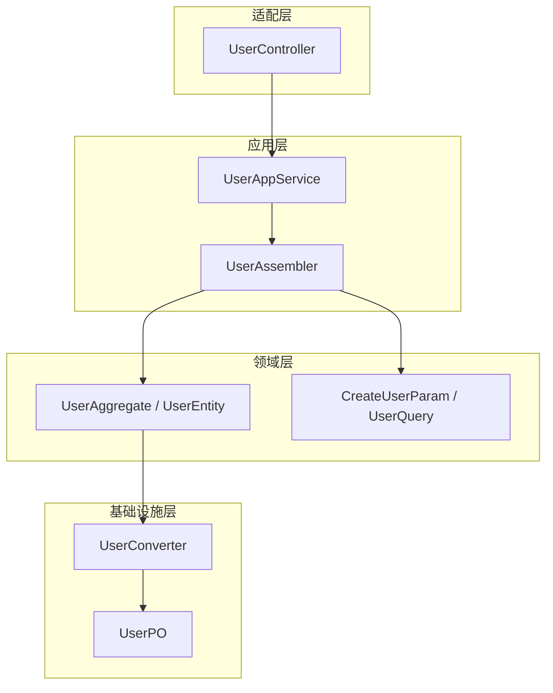
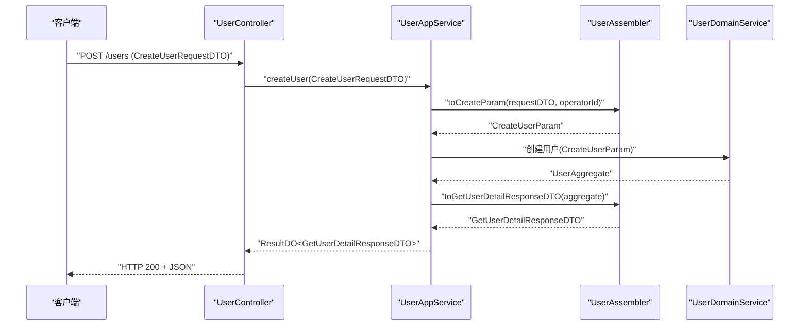
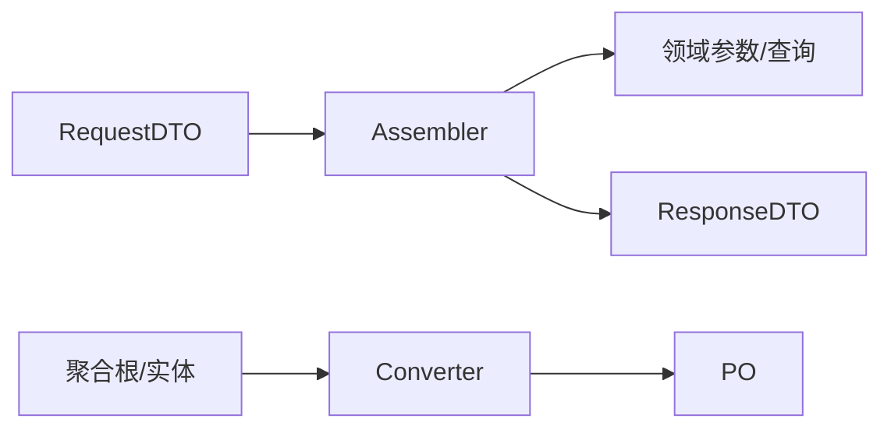

# DTO转换器设计

<cite>
**本文引用的文件**   
- [UserAssembler.java](file://src/main/java/com/sunnao/spring/ddd/template/application/system/user/assembler/UserAssembler.java)
- [CreateUserRequestDTO.java](file://src/main/java/com/sunnao/spring/ddd/template/client/system/user/req/CreateUserRequestDTO.java)
- [CreateUserParam.java](file://src/main/java/com/sunnao/spring/ddd/template/domain/system/user/model/param/CreateUserParam.java)
- [UserQuery.java](file://src/main/java/com/sunnao/spring/ddd/template/domain/system/user/model/param/UserQuery.java)
- [GetUserDetailResponseDTO.java](file://src/main/java/com/sunnao/spring/ddd/template/client/system/user/res/GetUserDetailResponseDTO.java)
- [QueryUserPageResponseDTO.java](file://src/main/java/com/sunnao/spring/ddd/template/client/system/user/res/QueryUserPageResponseDTO.java)
- [AuthAssembler.java](file://src/main/java/com/sunnao/spring/ddd/template/application/auth/assembler/AuthAssembler.java)
- [DictAssembler.java](file://src/main/java/com/sunnao/spring/ddd/template/application/system/dict/assembler/DictAssembler.java)
- [FileAssembler.java](file://src/main/java/com/sunnao/spring/ddd/template/application/system/file/assembler/FileAssembler.java)
- [LogAssembler.java](file://src/main/java/com/sunnao/spring/ddd/template/application/system/log/assembler/LogAssembler.java)
- [RoleAssembler.java](file://src/main/java/com/sunnao/spring/ddd/template/application/system/role/assembler/RoleAssembler.java)
- [UserConverter.java](file://src/main/java/com/sunnao/spring/ddd/template/infrastructure/system/user/converter/UserConverter.java)
- [DictConverter.java](file://src/main/java/com/sunnao/spring/ddd/template/infrastructure/system/dict/converter/DictConverter.java)
- [FileConverter.java](file://src/main/java/com/sunnao/spring/ddd/template/infrastructure/system/file/converter/FileConverter.java)
- [OperLogConverter.java](file://src/main/java/com/sunnao/spring/ddd/template/infrastructure/system/log/converter/OperLogConverter.java)
- [LoginLogConverter.java](file://src/main/java/com/sunnao/spring/ddd/template/infrastructure/system/log/converter/LoginLogConverter.java)
</cite>

## 目录
1. [引言](#引言)
2. [项目结构](#项目结构)
3. [核心组件](#核心组件)
4. [架构总览](#架构总览)
5. [详细组件分析](#详细组件分析)
6. [依赖关系分析](#依赖关系分析)
7. [性能考虑](#性能考虑)
8. [故障排查指南](#故障排查指南)
9. [结论](#结论)
10. [附录](#附录)

## 引言
本指南聚焦于在 DDD 架构中使用 MapStruct 构建 DTO 转换器的最佳实践，围绕 UserAssembler 展开，系统阐述请求对象到领域参数的转换规范、转换器接口设计原则（命名约定、参数传递策略、返回值处理）、复杂映射场景（嵌套对象、枚举值映射、日期格式等）的处理方式，以及批量转换、缓存与内存管理等性能优化建议。文档同时提供常见陷阱与规避方法，帮助团队统一实现风格并提升可维护性与性能。

## 项目结构
本项目采用分层 DDD 组织：
- 适配层（adaptor）：控制器接收 HTTP 请求，调用应用服务
- 应用层（application）：编排用例，使用 Assembler 进行 RequestDTO/ResponseDTO 与领域对象之间的转换
- 领域层（domain）：聚合根、实体、值对象、领域参数与查询条件
- 基础设施层（infrastructure）：持久化相关 Converter，负责领域对象与 PO 的纯技术映射

图表来源
- [UserAssembler.java:1-123](file://src/main/java/com/sunnao/spring/ddd/template/application/system/user/assembler/UserAssembler.java#L1-L123)
- [UserConverter.java:1-85](file://src/main/java/com/sunnao/spring/ddd/template/infrastructure/system/user/converter/UserConverter.java#L1-L85)

章节来源
- [UserAssembler.java:1-123](file://src/main/java/com/sunnao/spring/ddd/template/application/system/user/assembler/UserAssembler.java#L1-L123)
- [UserConverter.java:1-85](file://src/main/java/com/sunnao/spring/ddd/template/infrastructure/system/user/converter/UserConverter.java#L1-L85)

## 核心组件
- UserAssembler：应用层转换器，负责 RequestDTO/ResponseDTO 与领域对象（聚合根/实体/参数/查询）的双向转换；通过 @Context 注入操作人上下文；封装枚举映射与分页响应组装。
- 其他业务 Assembler（AuthAssembler、DictAssembler、FileAssembler、LogAssembler、RoleAssembler）：遵循相同模式，覆盖认证、字典、文件、日志、角色等子域。
- Infrastructure Converter（UserConverter、DictConverter、FileConverter、OperLogConverter、LoginLogConverter）：基础设施层转换器，专注领域对象与 PO 的纯技术映射，包含枚举双向转换与集合包装。

章节来源
- [UserAssembler.java:1-123](file://src/main/java/com/sunnao/spring/ddd/template/application/system/user/assembler/UserAssembler.java#L1-L123)
- [AuthAssembler.java:1-99](file://src/main/java/com/sunnao/spring/ddd/template/application/auth/assembler/AuthAssembler.java#L1-L99)
- [DictAssembler.java:1-178](file://src/main/java/com/sunnao/spring/ddd/template/application/system/dict/assembler/DictAssembler.java#L1-L178)
- [FileAssembler.java:1-123](file://src/main/java/com/sunnao/spring/ddd/template/application/system/file/assembler/FileAssembler.java#L1-L123)
- [LogAssembler.java:1-112](file://src/main/java/com/sunnao/spring/ddd/template/application/system/log/assembler/LogAssembler.java#L1-L112)
- [RoleAssembler.java:1-153](file://src/main/java/com/sunnao/spring/ddd/template/application/system/role/assembler/RoleAssembler.java#L1-L153)
- [UserConverter.java:1-85](file://src/main/java/com/sunnao/spring/ddd/template/infrastructure/system/user/converter/UserConverter.java#L1-L85)
- [DictConverter.java:1-30](file://src/main/java/com/sunnao/spring/ddd/template/infrastructure/system/dict/converter/DictConverter.java#L1-L30)
- [FileConverter.java:1-32](file://src/main/java/com/sunnao/spring/ddd/template/infrastructure/system/file/converter/FileConverter.java#L1-L32)
- [OperLogConverter.java:1-42](file://src/main/java/com/sunnao/spring/ddd/template/infrastructure/system/log/converter/OperLogConverter.java#L1-L42)
- [LoginLogConverter.java:1-42](file://src/main/java/com/sunnao/spring/ddd/template/infrastructure/system/log/converter/LoginLogConverter.java#L1-L42)

## 架构总览
MapStruct 在本项目中以“应用层 Assembler + 基础设施层 Converter”双轨模式运行：
- Assembler 关注跨层语义转换（如状态码与枚举互转、上下文注入、响应体拼装）
- Converter 关注纯技术映射（字段名一致或简单重命名的直转、枚举与数据库类型互转）

```mermaid
classDiagram
class UserAssembler {
+toCreateParam(requestDTO, operatorId) CreateUserParam
+toUpdateParam(requestDTO, operatorId) UpdateUserParam
+toChangeStatusParam(requestDTO, operatorId) ChangeUserStatusParam
+toDeleteParam(requestDTO, operatorId) DeleteUserParam
+toUserQuery(requestDTO) UserQuery
+toUserDTO(aggregate) UserDTO
+toGetUserDetailResponseDTO(aggregate) GetUserDetailResponseDTO
+toQueryUserPageResponseDTO(total, aggregates) QueryUserPageResponseDTO
-intToUserStatus(code) UserStatusEnum
-userStatusToInt(status) Integer
}
class AuthAssembler {
+toLoginParam(requestDTO) LoginParam
+toCreateUserParam(requestDTO) CreateUserParam
+toRegisterResponseDTO(aggregate, tokenName, tokenValue) RegisterResponseDTO
+toLoginResponseDTO(aggregate, tokenName, tokenValue) LoginResponseDTO
+toGetLoginUserResponseDTO(aggregate) GetLoginUserResponseDTO
}
class DictAssembler {
+toCreateTypeParam(...) CreateDictTypeParam
+toUpdateTypeParam(...) UpdateDictTypeParam
+toDeleteTypeParam(...) DeleteDictTypeParam
+toCreateDataParam(...) CreateDictDataParam
+toUpdateDataParam(...) UpdateDictDataParam
+toDeleteDataParam(...) DeleteDictDataParam
+toDictTypeQuery(...) DictTypeQuery
+toDictTypeDTO(...) DictTypeDTO
+toDictDataDTO(...) DictDataDTO
+toQueryDictTypePageResponseDTO(...) QueryDictTypePageResponseDTO
+toQueryDictDataListResponseDTO(...) QueryDictDataListResponseDTO
}
class FileAssembler {
+toCreateParam(...) CreateFileParam
+toDeleteParam(...) DeleteFileParam
+toFileQuery(...) FileQuery
+toUploadFileResponseDTO(...) UploadFileResponseDTO
+toDownloadFileResponseDTO(...) DownloadFileResponseDTO
+toFileDTO(...) FileDTO
+toQueryFilePageResponseDTO(...) QueryFilePageResponseDTO
}
class LogAssembler {
+toOperLogQuery(...) OperLogQuery
+toOperLogDTO(...) OperLogDTO
+toQueryOperLogPageResponseDTO(...) QueryOperLogPageResponseDTO
+toLoginLogQuery(...) LoginLogQuery
+toLoginLogDTO(...) LoginLogDTO
+toQueryLoginLogPageResponseDTO(...) QueryLoginLogPageResponseDTO
}
class RoleAssembler {
+toCreateParam(...) CreateRoleParam
+toUpdateParam(...) UpdateRoleParam
+toDeleteParam(...) DeleteRoleParam
+toAssignPermissionParam(...) AssignPermissionParam
+toAssignUserRoleParam(...) AssignUserRoleParam
+toRoleQuery(...) RoleQuery
+toRoleDTO(...) RoleDTO
+toGetRoleDetailResponseDTO(...) GetRoleDetailResponseDTO
+toQueryRolePageResponseDTO(...) QueryRolePageResponseDTO
+toQueryPermissionListResponseDTO(...) QueryPermissionListResponseDTO
+toPermissionDTO(...) PermissionDTO
}
class UserConverter {
+toEntity(UserPO) UserEntity
+toUserPO(UserEntity) UserPO
+toAggregate(UserPO) UserAggregate
+toPO(UserAggregate) UserPO
+toAggregateList(List<UserPO>) List<UserAggregate>
}
UserAssembler --> UserConverter : "不直接依赖<br/>仅用于说明边界"
```

图表来源
- [UserAssembler.java:1-123](file://src/main/java/com/sunnao/spring/ddd/template/application/system/user/assembler/UserAssembler.java#L1-L123)
- [AuthAssembler.java:1-99](file://src/main/java/com/sunnao/spring/ddd/template/application/auth/assembler/AuthAssembler.java#L1-L99)
- [DictAssembler.java:1-178](file://src/main/java/com/sunnao/spring/ddd/template/application/system/dict/assembler/DictAssembler.java#L1-L178)
- [FileAssembler.java:1-123](file://src/main/java/com/sunnao/spring/ddd/template/application/system/file/assembler/FileAssembler.java#L1-L123)
- [LogAssembler.java:1-112](file://src/main/java/com/sunnao/spring/ddd/template/application/system/log/assembler/LogAssembler.java#L1-L112)
- [RoleAssembler.java:1-153](file://src/main/java/com/sunnao/spring/ddd/template/application/system/role/assembler/RoleAssembler.java#L1-L153)
- [UserConverter.java:1-85](file://src/main/java/com/sunnao/spring/ddd/template/infrastructure/system/user/converter/UserConverter.java#L1-L85)

## 详细组件分析

### UserAssembler 设计与用法
- 职责边界
  - 将客户端请求 DTO 转换为领域参数（Param），并将领域聚合根/实体转换为客户端响应 DTO
  - 处理枚举值映射（client 状态码 ↔ model 枚举）
  - 通过 @Context 注入操作人 ID，避免在请求体中透传敏感上下文
- 关键方法
  - toCreateParam/toUpdateParam/toDeleteParam：使用 @Mapping(target = "operatorId", expression = "java(operatorId)") 注入操作人
  - toChangeStatusParam：自定义 default 方法完成 client 状态码 → model 枚举转换
  - toUserQuery：将分页查询 DTO 转为领域查询条件，含枚举转换
  - toUserDTO/toGetUserDetailResponseDTO/toQueryUserPageResponseDTO：聚合根到 DTO/Response 的转换与分页封装
- 枚举辅助方法
  - intToUserStatus / userStatusToInt：@Named 标注，供 @Mapping(qualifiedByName=...) 复用

图表来源
- [UserAssembler.java:28-36](file://src/main/java/com/sunnao/spring/ddd/template/application/system/user/assembler/UserAssembler.java#L28-L36)
- [UserAssembler.java:91-95](file://src/main/java/com/sunnao/spring/ddd/template/application/system/user/assembler/UserAssembler.java#L91-L95)

章节来源
- [UserAssembler.java:1-123](file://src/main/java/com/sunnao/spring/ddd/template/application/system/user/assembler/UserAssembler.java#L1-L123)
- [CreateUserRequestDTO.java:1-73](file://src/main/java/com/sunnao/spring/ddd/template/client/system/user/req/CreateUserRequestDTO.java#L1-L73)
- [CreateUserParam.java:1-48](file://src/main/java/com/sunnao/spring/ddd/template/domain/system/user/model/param/CreateUserParam.java#L1-L48)
- [UserQuery.java:1-32](file://src/main/java/com/sunnao/spring/ddd/template/domain/system/user/model/param/UserQuery.java#L1-L32)
- [GetUserDetailResponseDTO.java:1-27](file://src/main/java/com/sunnao/spring/ddd/template/client/system/user/res/GetUserDetailResponseDTO.java#L1-L27)
- [QueryUserPageResponseDTO.java:1-33](file://src/main/java/com/sunnao/spring/ddd/template/client/system/user/res/QueryUserPageResponseDTO.java#L1-L33)

### 转换器接口设计原则
- 命名约定
  - 输入→输出：toXxxParam / toXxxQuery / toXxxDTO / toXxxResponseDTO
  - 列表/分页：toXxxListResponseDTO / toXxxPageResponseDTO
  - 枚举转换：intToXxxStatus / xxxStatusToInt（@Named）
- 参数传递策略
  - 使用 @Context 注入非请求体上下文（如 operatorId），避免污染请求模型
  - 对需要额外计算的字段，优先使用 expression 或 default 方法
- 返回值处理
  - 返回空集合时显式赋 Collections.emptyList()，避免下游 NPE
  - 对可能为 null 的聚合根/实体做前置判空，返回 null 或空 DTO

章节来源
- [UserAssembler.java:28-64](file://src/main/java/com/sunnao/spring/ddd/template/application/system/user/assembler/UserAssembler.java#L28-L64)
- [DictAssembler.java:31-90](file://src/main/java/com/sunnao/spring/ddd/template/application/system/dict/assembler/DictAssembler.java#L31-L90)
- [RoleAssembler.java:31-75](file://src/main/java/com/sunnao/spring/ddd/template/application/system/role/assembler/RoleAssembler.java#L31-L75)

### 复杂对象映射场景
- 嵌套对象转换
  - 聚合根包含内部实体，Assembler 先取内部实体再映射到 DTO，避免暴露敏感字段（如密码）
  - 示例路径参考：[UserAssembler.toUserDTO:69-86](file://src/main/java/com/sunnao/spring/ddd/template/application/system/user/assembler/UserAssembler.java#L69-L86)
- 枚举值映射
  - 使用 @Mapping(qualifiedByName = "...") 指定 @Named 方法，实现 client 状态码与 model 枚举的双向转换
  - 示例路径参考：
    - [UserAssembler.intToUserStatus:113-116](file://src/main/java/com/sunnao/spring/ddd/template/application/system/user/assembler/UserAssembler.java#L113-L116)
    - [UserConverter.intToUserStatus:72-75](file://src/main/java/com/sunnao/spring/ddd/template/infrastructure/system/user/converter/UserConverter.java#L72-L75)
- 日期格式转换
  - 若存在字符串与日期互转，建议在 Assembler 中定义 @Named 方法并使用 qualifiedByName 指定
  - 注意：当前仓库未出现日期转换示例，可按此模式扩展

章节来源
- [UserAssembler.java:69-86](file://src/main/java/com/sunnao/spring/ddd/template/application/system/user/assembler/UserAssembler.java#L69-L86)
- [UserConverter.java:24-33](file://src/main/java/com/sunnao/spring/ddd/template/infrastructure/system/user/converter/UserConverter.java#L24-L33)

### 基础设施层 Converter 模式
- 职责：纯技术映射，无业务逻辑；专注于 Entity↔PO、Aggregate↔PO 的转换
- 典型能力
  - 枚举转换：数据库 Integer/String ↔ 领域枚举
  - 忽略字段：@Mapping(target = "...", ignore = true) 屏蔽无关字段
  - 聚合根包装：toAggregate / toPO 便捷方法
- 示例路径参考
  - [UserConverter.toEntity:24-26](file://src/main/java/com/sunnao/spring/ddd/template/infrastructure/system/user/converter/UserConverter.java#L24-L26)
  - [UserConverter.toAggregate:38-45](file://src/main/java/com/sunnao/spring/ddd/template/infrastructure/system/user/converter/UserConverter.java#L38-L45)
  - [DictConverter.toTypeEntity:28-30](file://src/main/java/com/sunnao/spring/ddd/template/infrastructure/system/dict/converter/DictConverter.java#L28-L30)
  - [FileConverter.toEntity:24-25](file://src/main/java/com/sunnao/spring/ddd/template/infrastructure/system/file/converter/FileConverter.java#L24-L25)
  - [OperLogConverter.toEntity:22-25](file://src/main/java/com/sunnao/spring/ddd/template/infrastructure/system/log/converter/OperLogConverter.java#L22-L25)
  - [LoginLogConverter.toEntity:22-25](file://src/main/java/com/sunnao/spring/ddd/template/infrastructure/system/log/converter/LoginLogConverter.java#L22-L25)

章节来源
- [UserConverter.java:1-85](file://src/main/java/com/sunnao/spring/ddd/template/infrastructure/system/user/converter/UserConverter.java#L1-L85)
- [DictConverter.java:1-30](file://src/main/java/com/sunnao/spring/ddd/template/infrastructure/system/dict/converter/DictConverter.java#L1-L30)
- [FileConverter.java:1-32](file://src/main/java/com/sunnao/spring/ddd/template/infrastructure/system/file/converter/FileConverter.java#L1-L32)
- [OperLogConverter.java:1-42](file://src/main/java/com/sunnao/spring/ddd/template/infrastructure/system/log/converter/OperLogConverter.java#L1-L42)
- [LoginLogConverter.java:1-42](file://src/main/java/com/sunnao/spring/ddd/template/infrastructure/system/log/converter/LoginLogConverter.java#L1-L42)

### 其他 Assembler 要点
- AuthAssembler：登录/注册流程的请求→领域参数转换，以及 Token 信息回填到响应 DTO
  - 参考：[AuthAssembler.toCreateUserParam:36-42](file://src/main/java/com/sunnao/spring/ddd/template/application/auth/assembler/AuthAssembler.java#L36-L42)、[AuthAssembler.toLoginResponseDTO:61-70](file://src/main/java/com/sunnao/spring/ddd/template/application/auth/assembler/AuthAssembler.java#L61-L70)
- DictAssembler：字典类型/数据的增删改查转换，统一的状态码与枚举映射
  - 参考：[DictAssembler.toUpdateTypeParam:38-46](file://src/main/java/com/sunnao/spring/ddd/template/application/system/dict/assembler/DictAssembler.java#L38-L46)
- FileAssembler：上传/下载/分页查询的转换，注意大对象内容仅在下载响应中携带
  - 参考：[FileAssembler.toUploadFileResponseDTO:65-72](file://src/main/java/com/sunnao/spring/ddd/template/application/system/file/assembler/FileAssembler.java#L65-L72)
- LogAssembler：操作日志与登录日志的查询与展示转换
  - 参考：[LogAssembler.toOperLogDTO:35-53](file://src/main/java/com/sunnao/spring/ddd/template/application/system/log/assembler/LogAssembler.java#L35-L53)
- RoleAssembler：角色与权限的分配、查询与详情组装
  - 参考：[RoleAssembler.toGetRoleDetailResponseDTO:101-107](file://src/main/java/com/sunnao/spring/ddd/template/application/system/role/assembler/RoleAssembler.java#L101-L107)

章节来源
- [AuthAssembler.java:1-99](file://src/main/java/com/sunnao/spring/ddd/template/application/auth/assembler/AuthAssembler.java#L1-L99)
- [DictAssembler.java:1-178](file://src/main/java/com/sunnao/spring/ddd/template/application/system/dict/assembler/DictAssembler.java#L1-L178)
- [FileAssembler.java:1-123](file://src/main/java/com/sunnao/spring/ddd/template/application/system/file/assembler/FileAssembler.java#L1-L123)
- [LogAssembler.java:1-112](file://src/main/java/com/sunnao/spring/ddd/template/application/system/log/assembler/LogAssembler.java#L1-L112)
- [RoleAssembler.java:1-153](file://src/main/java/com/sunnao/spring/ddd/template/application/system/role/assembler/RoleAssembler.java#L1-L153)

## 依赖关系分析
- 应用层 Assembler 依赖领域层对象（Aggregate/Entity/Param/Query）与客户端 DTO
- 基础设施层 Converter 依赖领域层对象与持久化 PO
- 两者通过清晰的包路径与职责边界解耦，避免循环依赖

图表来源
- [UserAssembler.java:1-123](file://src/main/java/com/sunnao/spring/ddd/template/application/system/user/assembler/UserAssembler.java#L1-L123)
- [UserConverter.java:1-85](file://src/main/java/com/sunnao/spring/ddd/template/infrastructure/system/user/converter/UserConverter.java#L1-L85)

章节来源
- [UserAssembler.java:1-123](file://src/main/java/com/sunnao/spring/ddd/template/application/system/user/assembler/UserAssembler.java#L1-L123)
- [UserConverter.java:1-85](file://src/main/java/com/sunnao/spring/ddd/template/infrastructure/system/user/converter/UserConverter.java#L1-L85)

## 性能考虑
- 批量转换
  - 使用 stream().map(this::toXxx).toList() 进行批量转换，减少样板代码与中间变量
  - 参考：[UserAssembler.toQueryUserPageResponseDTO:100-109](file://src/main/java/com/sunnao/spring/ddd/template/application/system/user/assembler/UserAssembler.java#L100-L109)
- 缓存策略
  - 对于频繁读取且变化不频繁的字典数据，可在应用层引入本地缓存（如 Caffeine）或分布式缓存（Redis），降低重复转换与查询开销
  - 注意：缓存键需包含版本或更新时间戳，避免脏读
- 内存管理
  - 避免在响应中携带大对象（如文件内容），仅在下载接口返回必要字节数组
  - 对空集合显式赋值 Collections.emptyList()，避免下游多次判空与异常分支
- 表达式与默认方法
  - 尽量使用 MapStruct 自动映射，复杂逻辑放入 default 方法或 @Named 方法，保持生成代码可读性
  - 谨慎使用 expression，过多表达式会影响生成代码的可维护性

章节来源
- [UserAssembler.java:100-109](file://src/main/java/com/sunnao/spring/ddd/template/application/system/user/assembler/UserAssembler.java#L100-L109)
- [FileAssembler.java:77-86](file://src/main/java/com/sunnao/spring/ddd/template/application/system/file/assembler/FileAssembler.java#L77-L86)

## 故障排查指南
- 常见问题
  - 字段映射缺失：检查 @Mapping(source/target) 是否遗漏，或使用 default 方法补齐
  - 枚举映射错误：确认 @Named 方法与 @Mapping(qualifiedByName=...) 名称一致
  - 上下文注入失败：确保调用方正确传入 @Context 参数（如 operatorId）
  - 空指针风险：对聚合根/实体判空，返回 null 或空集合
- 定位建议
  - 查看 Assembler 对应方法的注释与实现路径，确认转换意图
  - 对比 RequestDTO/Param/DTO 字段名与类型，必要时增加映射注解
  - 检查枚举类是否提供 getByCode/getCode 方法，保证双向转换可用

章节来源
- [UserAssembler.java:28-64](file://src/main/java/com/sunnao/spring/ddd/template/application/system/user/assembler/UserAssembler.java#L28-L64)
- [UserAssembler.java:113-121](file://src/main/java/com/sunnao/spring/ddd/template/application/system/user/assembler/UserAssembler.java#L113-L121)

## 结论
通过“应用层 Assembler + 基础设施层 Converter”的分层设计，结合 MapStruct 的声明式映射与 @Context/@Named 等高级特性，可以在 DDD 架构下实现清晰、稳定、高性能的 DTO 转换体系。遵循统一的命名约定、参数传递策略与返回值处理规范，能有效降低耦合度、提升可维护性与团队协作效率。

## 附录
- 常用注解速查
  - @Mapper(componentModel = "spring")：启用 Spring 容器管理
  - @Mapping(target/source/qualifiedByName/expression)：字段映射与表达式
  - @Context：注入上下文参数（如 operatorId）
  - @Named：命名转换方法，供 qualifiedByName 引用
- 参考实现路径
  - 应用层 Assembler：[UserAssembler:1-123](file://src/main/java/com/sunnao/spring/ddd/template/application/system/user/assembler/UserAssembler.java#L1-L123)
  - 基础设施层 Converter：[UserConverter:1-85](file://src/main/java/com/sunnao/spring/ddd/template/infrastructure/system/user/converter/UserConverter.java#L1-L85)