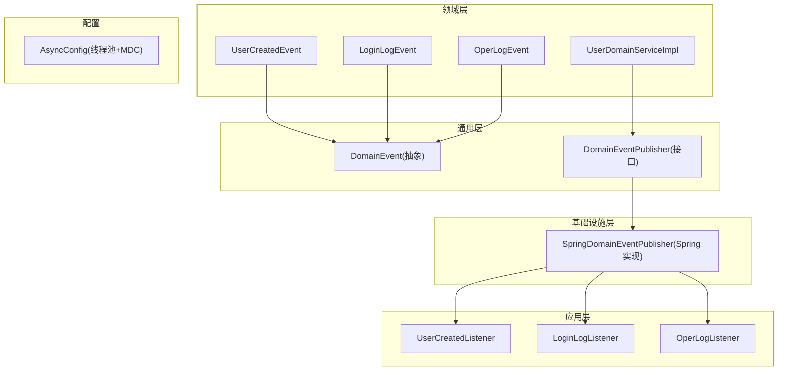
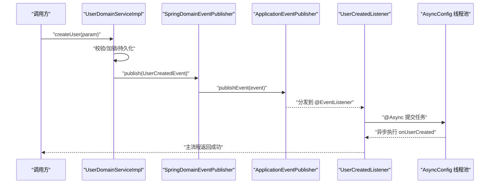
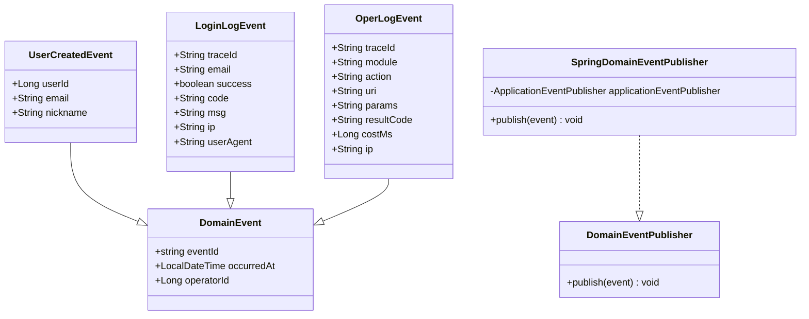
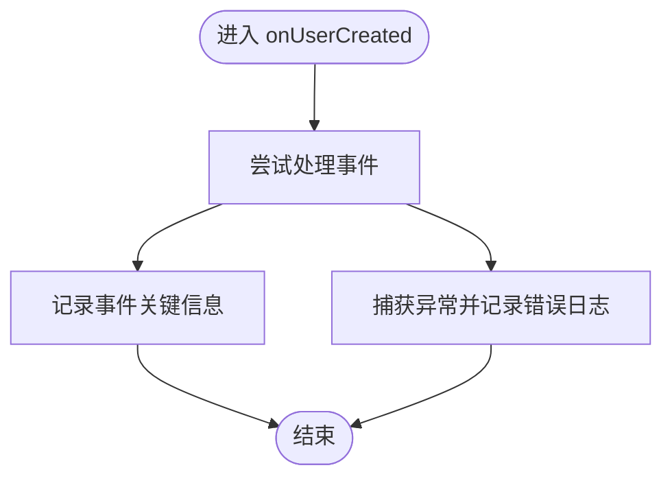
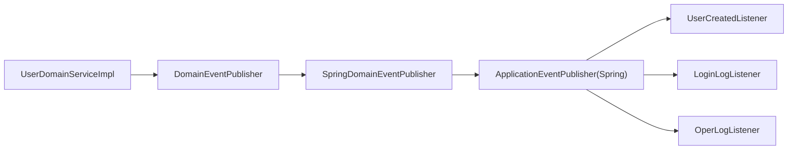

# 事件监听器实现

<cite>
**本文引用的文件**   
- [UserCreatedListener.java](file://src/main/java/com/sunnao/spring/ddd/template/application/system/user/listener/UserCreatedListener.java)
- [UserCreatedEvent.java](file://src/main/java/com/sunnao/spring/ddd/template/domain/system/user/event/UserCreatedEvent.java)
- [DomainEvent.java](file://src/main/java/com/sunnao/spring/ddd/template/common/event/DomainEvent.java)
- [DomainEventPublisher.java](file://src/main/java/com/sunnao/spring/ddd/template/common/event/DomainEventPublisher.java)
- [SpringDomainEventPublisher.java](file://src/main/java/com/sunnao/spring/ddd/template/infrastructure/common/SpringDomainEventPublisher.java)
- [AsyncConfig.java](file://src/main/java/com/sunnao/spring/ddd/template/common/config/AsyncConfig.java)
- [UserDomainServiceImpl.java](file://src/main/java/com/sunnao/spring/ddd/template/domain/system/user/service/UserDomainServiceImpl.java)
- [LoginLogListener.java](file://src/main/java/com/sunnao/spring/ddd/template/application/system/log/listener/LoginLogListener.java)
- [OperLogListener.java](file://src/main/java/com/sunnao/spring/ddd/template/application/system/log/listener/OperLogListener.java)
- [LoginLogEvent.java](file://src/main/java/com/sunnao/spring/ddd/template/domain/system/log/event/LoginLogEvent.java)
- [OperLogEvent.java](file://src/main/java/com/sunnao/spring/ddd/template/domain/system/log/event/OperLogEvent.java)
</cite>

## 目录
1. [引言](#引言)
2. [项目结构](#项目结构)
3. [核心组件](#核心组件)
4. [架构总览](#架构总览)
5. [详细组件分析](#详细组件分析)
6. [依赖关系分析](#依赖关系分析)
7. [性能与异步配置](#性能与异步配置)
8. [错误处理与重试机制](#错误处理与重试机制)
9. [结论](#结论)
10. [附录：最佳实践清单](#附录最佳实践清单)

## 引言
本指南围绕 Spring Event 在 DDD 中的应用，结合仓库中的用户创建场景，系统化讲解事件定义、发布、监听与异步消费。以 UserCreatedListener 为例，展示如何通过领域事件实现业务解耦与异步处理；同时给出线程池配置、MDC 链路透传、失败日志与可扩展的重试方案建议，帮助读者构建稳健的事件驱动架构。

## 项目结构
本项目采用分层与领域驱动设计（DDD）组织代码：
- common：通用基础能力（事件抽象、异常、结果封装、锁、上下文等）
- domain：领域模型与服务（聚合根、实体、参数、仓储接口、领域服务）
- application：应用层编排与监听器（用例编排、事件监听器）
- infrastructure：基础设施实现（Spring 适配、持久化实现）
- adaptor：适配层（控制器、切面等）

事件相关的关键位置：
- 事件基类与发布器接口：common.event
- 发布器 Spring 实现：infrastructure.common
- 领域事件定义：domain.system.*.event
- 事件监听器：application.system.*.listener
- 异步线程池与 MDC 透传：common.config.AsyncConfig

图表来源
- [UserDomainServiceImpl.java:75-78](file://src/main/java/com/sunnao/spring/ddd/template/domain/system/user/service/UserDomainServiceImpl.java#L75-L78)
- [SpringDomainEventPublisher.java:23-33](file://src/main/java/com/sunnao/spring/ddd/template/infrastructure/common/SpringDomainEventPublisher.java#L23-L33)
- [UserCreatedListener.java:20-29](file://src/main/java/com/sunnao/spring/ddd/template/application/system/user/listener/UserCreatedListener.java#L20-L29)
- [LoginLogListener.java:25-34](file://src/main/java/com/sunnao/spring/ddd/template/application/system/log/listener/LoginLogListener.java#L25-L34)
- [OperLogListener.java:25-34](file://src/main/java/com/sunnao/spring/ddd/template/application/system/log/listener/OperLogListener.java#L25-L34)
- [UserCreatedEvent.java:15-37](file://src/main/java/com/sunnao/spring/ddd/template/domain/system/user/event/UserCreatedEvent.java#L15-L37)
- [LoginLogEvent.java:15-62](file://src/main/java/com/sunnao/spring/ddd/template/domain/system/log/event/LoginLogEvent.java#L15-L62)
- [OperLogEvent.java:15-68](file://src/main/java/com/sunnao/spring/ddd/template/domain/system/log/event/OperLogEvent.java#L15-L68)
- [DomainEvent.java:20-44](file://src/main/java/com/sunnao/spring/ddd/template/common/event/DomainEvent.java#L20-L44)
- [DomainEventPublisher.java:11-19](file://src/main/java/com/sunnao/spring/ddd/template/common/event/DomainEventPublisher.java#L11-L19)

章节来源
- [UserDomainServiceImpl.java:46-89](file://src/main/java/com/sunnao/spring/ddd/template/domain/system/user/service/UserDomainServiceImpl.java#L46-L89)
- [UserCreatedListener.java:16-30](file://src/main/java/com/sunnao/spring/ddd/template/application/system/user/listener/UserCreatedListener.java#L16-L30)
- [AsyncConfig.java:23-45](file://src/main/java/com/sunnao/spring/ddd/template/common/config/AsyncConfig.java#L23-L45)

## 核心组件
- 领域事件抽象 DomainEvent：提供事件 ID、发生时间、操作人等公共字段，保证事件可追踪与幂等基础。
- 领域事件发布器接口 DomainEventPublisher：定义 publish(event)，不依赖 Spring，便于领域层直接注入使用。
- Spring 实现 SpringDomainEventPublisher：基于 ApplicationEventPublisher 进行进程内广播，失败仅记录日志，不影响主流程。
- 具体领域事件：如 UserCreatedEvent、LoginLogEvent、OperLogEvent，继承 DomainEvent 并携带业务语义数据。
- 事件监听器：UserCreatedListener、LoginLogListener、OperLogListener，通过 @EventListener 订阅事件，@Async 异步执行。
- 异步配置 AsyncConfig：统一线程池、拒绝策略、未捕获异常处理器，并通过 TaskDecorator 完成 MDC 透传。

章节来源
- [DomainEvent.java:20-44](file://src/main/java/com/sunnao/spring/ddd/template/common/event/DomainEvent.java#L20-L44)
- [DomainEventPublisher.java:11-19](file://src/main/java/com/sunnao/spring/ddd/template/common/event/DomainEventPublisher.java#L11-L19)
- [SpringDomainEventPublisher.java:16-34](file://src/main/java/com/sunnao/spring/ddd/template/infrastructure/common/SpringDomainEventPublisher.java#L16-L34)
- [UserCreatedEvent.java:15-37](file://src/main/java/com/sunnao/spring/ddd/template/domain/system/user/event/UserCreatedEvent.java#L15-L37)
- [LoginLogEvent.java:15-62](file://src/main/java/com/sunnao/spring/ddd/template/domain/system/log/event/LoginLogEvent.java#L15-L62)
- [OperLogEvent.java:15-68](file://src/main/java/com/sunnao/spring/ddd/template/domain/system/log/event/OperLogEvent.java#L15-L68)
- [UserCreatedListener.java:16-30](file://src/main/java/com/sunnao/spring/ddd/template/application/system/user/listener/UserCreatedListener.java#L16-L30)
- [LoginLogListener.java:18-35](file://src/main/java/com/sunnao/spring/ddd/template/application/system/log/listener/LoginLogListener.java#L18-L35)
- [OperLogListener.java:18-35](file://src/main/java/com/sunnao/spring/ddd/template/application/system/log/listener/OperLogListener.java#L18-L35)
- [AsyncConfig.java:23-45](file://src/main/java/com/sunnao/spring/ddd/template/common/config/AsyncConfig.java#L23-L45)

## 架构总览
下图展示了“用户创建”的端到端事件流：领域服务在事务提交后发布事件，Spring 容器将事件分发给所有监听器，监听器在独立线程池中异步执行，确保主流程不受影响。

图表来源
- [UserDomainServiceImpl.java:75-78](file://src/main/java/com/sunnao/spring/ddd/template/domain/system/user/service/UserDomainServiceImpl.java#L75-L78)
- [SpringDomainEventPublisher.java:23-33](file://src/main/java/com/sunnao/spring/ddd/template/infrastructure/common/SpringDomainEventPublisher.java#L23-L33)
- [UserCreatedListener.java:20-29](file://src/main/java/com/sunnao/spring/ddd/template/application/system/user/listener/UserCreatedListener.java#L20-L29)
- [AsyncConfig.java:28-40](file://src/main/java/com/sunnao/spring/ddd/template/common/config/AsyncConfig.java#L28-L40)

## 详细组件分析

### 领域事件与发布器
- 事件基类 DomainEvent：包含 eventId、occurredAt、operatorId，为后续追踪与幂等提供基础。
- 发布器接口 DomainEventPublisher：面向领域层暴露 publish(event)，屏蔽底层实现细节。
- Spring 实现 SpringDomainEventPublisher：内部捕获异常并记录日志，确保发布失败不影响主流程。

图表来源
- [DomainEvent.java:20-44](file://src/main/java/com/sunnao/spring/ddd/template/common/event/DomainEvent.java#L20-L44)
- [UserCreatedEvent.java:15-37](file://src/main/java/com/sunnao/spring/ddd/template/domain/system/user/event/UserCreatedEvent.java#L15-L37)
- [LoginLogEvent.java:15-62](file://src/main/java/com/sunnao/spring/ddd/template/domain/system/log/event/LoginLogEvent.java#L15-L62)
- [OperLogEvent.java:15-68](file://src/main/java/com/sunnao/spring/ddd/template/domain/system/log/event/OperLogEvent.java#L15-L68)
- [DomainEventPublisher.java:11-19](file://src/main/java/com/sunnao/spring/ddd/template/common/event/DomainEventPublisher.java#L11-L19)
- [SpringDomainEventPublisher.java:16-34](file://src/main/java/com/sunnao/spring/ddd/template/infrastructure/common/SpringDomainEventPublisher.java#L16-L34)

章节来源
- [DomainEvent.java:20-44](file://src/main/java/com/sunnao/spring/ddd/template/common/event/DomainEvent.java#L20-L44)
- [DomainEventPublisher.java:11-19](file://src/main/java/com/sunnao/spring/ddd/template/common/event/DomainEventPublisher.java#L11-L19)
- [SpringDomainEventPublisher.java:23-33](file://src/main/java/com/sunnao/spring/ddd/template/infrastructure/common/SpringDomainEventPublisher.java#L23-L33)

### 用户创建事件监听器（UserCreatedListener）
- 职责：异步消费 UserCreatedEvent，示例中记录关键信息，可扩展为发送邮件、初始化用户配置等。
- 关键点：
  - @Async 配合 AsyncConfig 线程池执行，避免阻塞主流程。
  - 内部 try-catch 捕获异常并记录日志，确保失败不影响主流程。
  - 通过 MDC 透传的 traceId 可在日志中串联链路。

图表来源
- [UserCreatedListener.java:20-29](file://src/main/java/com/sunnao/spring/ddd/template/application/system/user/listener/UserCreatedListener.java#L20-L29)

章节来源
- [UserCreatedListener.java:16-30](file://src/main/java/com/sunnao/spring/ddd/template/application/system/user/listener/UserCreatedListener.java#L16-L30)

### 登录日志与应用操作日志监听器
- LoginLogListener：异步消费 LoginLogEvent，构造聚合根后落库，失败仅记录日志。
- OperLogListener：异步消费 OperLogEvent，构造聚合根后落库，失败仅记录日志。
- 两者均复用 AsyncConfig 线程池，保持统一的异步处理能力与 MDC 透传。

章节来源
- [LoginLogListener.java:18-35](file://src/main/java/com/sunnao/spring/ddd/template/application/system/log/listener/LoginLogListener.java#L18-L35)
- [OperLogListener.java:18-35](file://src/main/java/com/sunnao/spring/ddd/template/application/system/log/listener/OperLogListener.java#L18-L35)

### 领域服务中的事件发布点
- UserDomainServiceImpl.createUser 在完成持久化后发布 UserCreatedEvent，遵循“先持久化，再发布事件”的原则，保证事件反映真实状态变更。

章节来源
- [UserDomainServiceImpl.java:75-78](file://src/main/java/com/sunnao/spring/ddd/template/domain/system/user/service/UserDomainServiceImpl.java#L75-L78)

## 依赖关系分析
- 耦合度：
  - 领域服务仅依赖 DomainEventPublisher 接口，低耦合，易于替换实现或扩展。
  - 监听器通过 Spring 容器自动发现与注册，无需显式装配。
- 外部依赖：
  - Spring ApplicationEventPublisher 作为消息分发内核。
  - 线程池由 AsyncConfig 统一管理，支持 MDC 透传。

图表来源
- [UserDomainServiceImpl.java:75-78](file://src/main/java/com/sunnao/spring/ddd/template/domain/system/user/service/UserDomainServiceImpl.java#L75-L78)
- [SpringDomainEventPublisher.java:23-33](file://src/main/java/com/sunnao/spring/ddd/template/infrastructure/common/SpringDomainEventPublisher.java#L23-L33)
- [UserCreatedListener.java:20-29](file://src/main/java/com/sunnao/spring/ddd/template/application/system/user/listener/UserCreatedListener.java#L20-L29)
- [LoginLogListener.java:25-34](file://src/main/java/com/sunnao/spring/ddd/template/application/system/log/listener/LoginLogListener.java#L25-L34)
- [OperLogListener.java:25-34](file://src/main/java/com/sunnao/spring/ddd/template/application/system/log/listener/OperLogListener.java#L25-L34)

章节来源
- [DomainEventPublisher.java:11-19](file://src/main/java/com/sunnao/spring/ddd/template/common/event/DomainEventPublisher.java#L11-L19)
- [SpringDomainEventPublisher.java:16-34](file://src/main/java/com/sunnao/spring/ddd/template/infrastructure/common/SpringDomainEventPublisher.java#L16-L34)

## 性能与异步配置
- 线程池参数（默认值）：
  - 核心线程数：4
  - 最大线程数：8
  - 队列容量：200
  - 空闲线程存活时间：60 秒
  - 线程名前缀：async-
  - 拒绝策略：CallerRunsPolicy（回退到调用线程执行，起到背压作用）
- MDC 透传：
  - 通过 TaskDecorator 在任务提交时快照 MDC，执行时恢复，结束后清理，保障链路追踪一致性。
- 未捕获异常处理：
  - 自定义 AsyncUncaughtExceptionHandler 记录方法名与异常堆栈，便于定位问题。

优化建议（通用指导）：
- 根据 QPS 与平均耗时调整 core/max/queue 参数，观察 GC 与 CPU 使用率。
- 对 I/O 密集型任务可适当增大线程数；CPU 密集型任务需控制线程数以避免上下文切换开销。
- 监控队列堆积与拒绝次数，必要时扩容或拆分监听器至不同线程池。

章节来源
- [AsyncConfig.java:28-45](file://src/main/java/com/sunnao/spring/ddd/template/common/config/AsyncConfig.java#L28-L45)
- [AsyncConfig.java:47-67](file://src/main/java/com/sunnao/spring/ddd/template/common/config/AsyncConfig.java#L47-L67)

## 错误处理与重试机制
当前实现要点：
- 发布侧：SpringDomainEventPublisher.publish 捕获异常并记录日志，不向上抛出，确保主流程稳定。
- 监听侧：各监听器内部 try-catch 记录错误日志，不中断主流程。

可扩展的重试与可靠性方案（建议）：
- 本地重试：
  - 在监听器中对可重试异常进行有限次重试（指数退避），超过阈值转入死信队列。
  - 使用幂等键（eventId）避免重复处理造成副作用。
- 死信队列：
  - 将失败事件持久化到专用表或消息队列的死信分区，供人工介入或离线修复。
- 监控告警：
  - 统计失败率、重试次数、死信数量，设置阈值触发告警。
  - 结合 traceId 与 eventId 关联日志，快速定位问题。
- 事务边界：
  - 事件应在事务提交后发布，避免回滚导致不一致。当前实现已在持久化成功后发布，符合该原则。

章节来源
- [SpringDomainEventPublisher.java:23-33](file://src/main/java/com/sunnao/spring/ddd/template/infrastructure/common/SpringDomainEventPublisher.java#L23-L33)
- [UserCreatedListener.java:23-29](file://src/main/java/com/sunnao/spring/ddd/template/application/system/user/listener/UserCreatedListener.java#L23-L29)
- [LoginLogListener.java:27-34](file://src/main/java/com/sunnao/spring/ddd/template/application/system/log/listener/LoginLogListener.java#L27-L34)
- [OperLogListener.java:27-34](file://src/main/java/com/sunnao/spring/ddd/template/application/system/log/listener/OperLogListener.java#L27-L34)

## 结论
本项目通过 DomainEvent 抽象与 Spring 事件机制，实现了领域层与应用层的解耦。UserCreatedListener 展示了典型的异步事件消费模式，配合 AsyncConfig 的线程池与 MDC 透传，保证了高可用与可观测性。建议在现有基础上引入重试、死信与监控告警，进一步提升系统的健壮性与可运维性。

## 附录：最佳实践清单
- 事件设计
  - 事件命名体现领域语义（如 UserCreatedEvent）。
  - 事件仅承载必要数据，避免过度膨胀。
  - 使用 eventId 作为幂等键，防止重复处理。
- 发布时机
  - 在事务提交后发布事件，保证最终一致性。
- 监听器设计
  - 单一职责，每个监听器专注一个事件类型。
  - 异步处理，避免阻塞主流程。
  - 内部异常捕获与记录，确保稳定性。
- 异步配置
  - 合理设置线程池参数，关注队列堆积与拒绝策略。
  - 始终启用 MDC 透传，保障链路追踪。
- 可靠性
  - 引入重试与死信队列，完善监控告警。
  - 对关键路径增加幂等与去重逻辑。