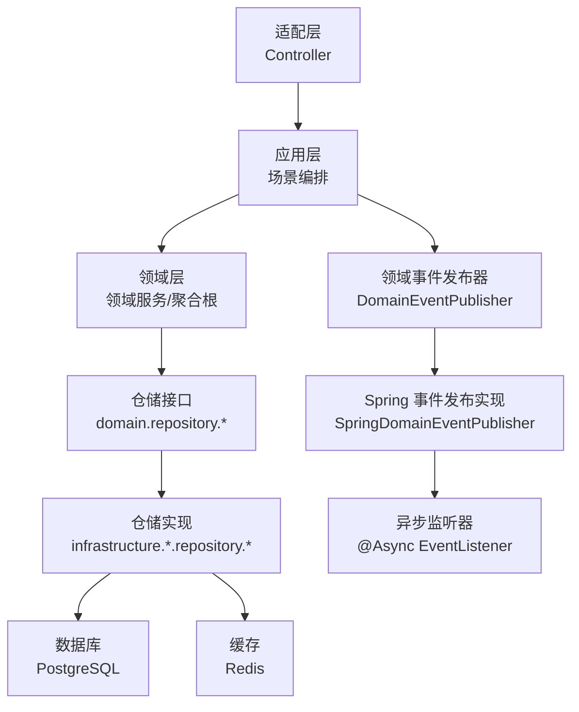
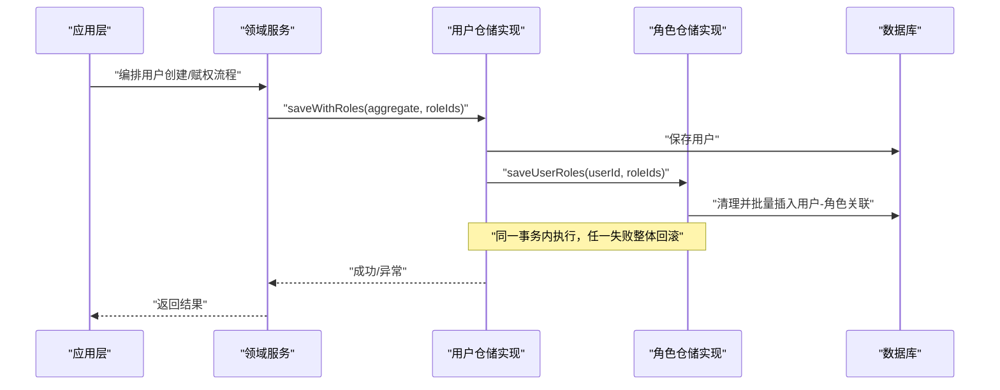
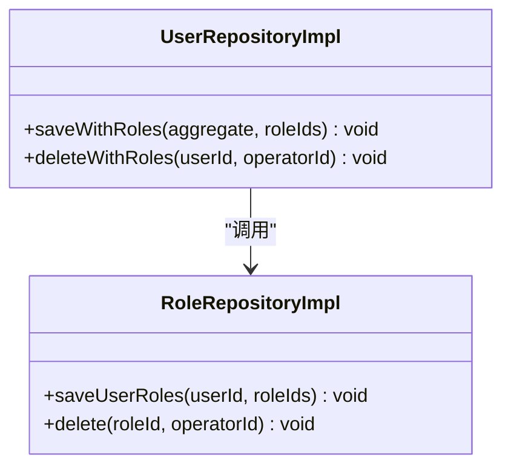
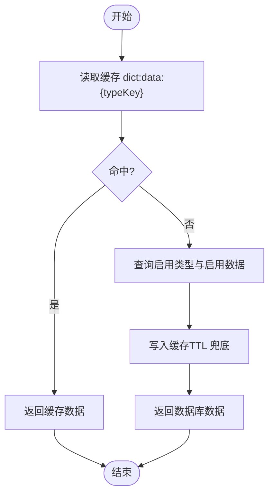
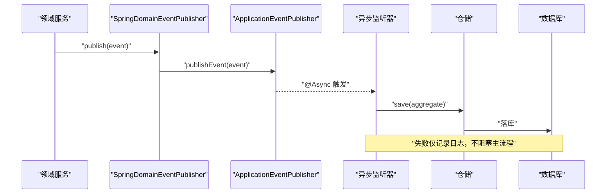
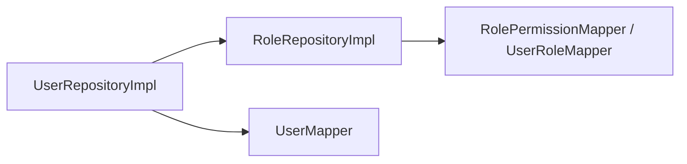

# 事务管理策略

<cite>
**本文引用的文件**
- [README.md](file://README.md)
- [MybatisFlexConfigure.java](file://src/main/java/com/sunnao/spring/ddd/template/common/config/MybatisFlexConfigure.java)
- [UserRepositoryImpl.java](file://src/main/java/com/sunnao/spring/ddd/template/infrastructure/system/user/repository/UserRepositoryImpl.java)
- [RoleRepositoryImpl.java](file://src/main/java/com/sunnao/spring/ddd/template/infrastructure/system/role/repository/RoleRepositoryImpl.java)
- [DictRepositoryImpl.java](file://src/main/java/com/sunnao/spring/ddd/template/infrastructure/system/dict/repository/DictRepositoryImpl.java)
- [FileRepositoryImpl.java](file://src/main/java/com/sunnao/spring/ddd/template/infrastructure/system/file/repository/FileRepositoryImpl.java)
- [DomainEventPublisher.java](file://src/main/java/com/sunnao/spring/ddd/template/common/event/DomainEventPublisher.java)
- [SpringDomainEventPublisher.java](file://src/main/java/com/sunnao/spring/ddd/template/infrastructure/common/SpringDomainEventPublisher.java)
- [LoginLogListener.java](file://src/main/java/com/sunnao/spring/ddd/template/application/system/log/listener/LoginLogListener.java)
- [UserCreatedListener.java](file://src/main/java/com/sunnao/spring/ddd/template/application/system/user/listener/UserCreatedListener.java)
</cite>

## 目录
1. [引言](#引言)
2. [项目结构](#项目结构)
3. [核心组件](#核心组件)
4. [架构总览](#架构总览)
5. [详细组件分析](#详细组件分析)
6. [依赖关系分析](#依赖关系分析)
7. [性能考量](#性能考量)
8. [故障排查指南](#故障排查指南)
9. [结论](#结论)
10. [附录](#附录)

## 引言
本指南围绕 Spring 声明式事务在 DDD 架构中的应用，结合仓库中仓储实现与事件机制，系统阐述本地事务配置与管理策略、事务边界设计原则（长事务优化、嵌套事务处理、传播行为）、异步事务与最终一致性方案（事件驱动补偿与幂等性），并给出分布式事务的 Saga/TCC 思路与落地建议。文档以代码级事实为依据，辅以可视化图示，帮助读者快速建立可落地的最佳实践。

## 项目结构
本项目遵循六边形架构：adaptor → application → domain → repository（接口）→ infrastructure（实现）。事务边界主要落在基础设施层的仓储实现方法上，应用层通过领域服务编排“锁 → 聚合根 → 持久化”，并通过领域事件进行异步解耦。

图表来源
- [README.md:19-36](file://README.md#L19-L36)
- [UserRepositoryImpl.java:34-48](file://src/main/java/com/sunnao/spring/ddd/template/infrastructure/system/user/repository/UserRepositoryImpl.java#L34-L48)
- [DictRepositoryImpl.java:55-68](file://src/main/java/com/sunnao/spring/ddd/template/infrastructure/system/dict/repository/DictRepositoryImpl.java#L55-L68)
- [DomainEventPublisher.java:11-19](file://src/main/java/com/sunnao/spring/ddd/template/common/event/DomainEventPublisher.java#L11-L19)
- [SpringDomainEventPublisher.java:17-33](file://src/main/java/com/sunnao/spring/ddd/template/infrastructure/common/SpringDomainEventPublisher.java#L17-L33)
- [LoginLogListener.java:18-35](file://src/main/java/com/sunnao/spring/ddd/template/application/system/log/listener/LoginLogListener.java#L18-L35)

章节来源
- [README.md:19-36](file://README.md#L19-L36)

## 核心组件
- 审计字段自动填充：基于 MyBatis-Flex 全局监听器，对继承 BasePO 的实体在插入/更新时自动填充创建/更新时间与操作人，避免业务代码侵入。
- 仓储事务边界：仓储实现类在组合写方法上使用 @Transactional(rollbackFor = Exception.class)，确保多表写入原子性；单表保存/删除方法保持无事务或仅由调用方控制事务。
- 缓存一致性：字典模块采用“提交后失效”策略，避免事务未提交时的并发读回填旧数据。
- 异步事件：领域事件通过 ApplicationEventPublisher 广播，监听器 @Async 消费，失败不阻塞主流程。

章节来源
- [MybatisFlexConfigure.java:20-72](file://src/main/java/com/sunnao/spring/ddd/template/common/config/MybatisFlexConfigure.java#L20-L72)
- [UserRepositoryImpl.java:119-125](file://src/main/java/com/sunnao/spring/ddd/template/infrastructure/system/user/repository/UserRepositoryImpl.java#L119-L125)
- [UserRepositoryImpl.java:157-163](file://src/main/java/com/sunnao/spring/ddd/template/infrastructure/system/user/repository/UserRepositoryImpl.java#L157-L163)
- [RoleRepositoryImpl.java:159-181](file://src/main/java/com/sunnao/spring/ddd/template/infrastructure/system/role/repository/RoleRepositoryImpl.java#L159-L181)
- [RoleRepositoryImpl.java:208-231](file://src/main/java/com/sunnao/spring/ddd/template/infrastructure/system/role/repository/RoleRepositoryImpl.java#L208-L231)
- [RoleRepositoryImpl.java:233-256](file://src/main/java/com/sunnao/spring/ddd/template/infrastructure/system/role/repository/RoleRepositoryImpl.java#L233-L256)
- [DictRepositoryImpl.java:152-174](file://src/main/java/com/sunnao/spring/ddd/template/infrastructure/system/dict/repository/DictRepositoryImpl.java#L152-L174)
- [DictRepositoryImpl.java:233-252](file://src/main/java/com/sunnao/spring/ddd/template/infrastructure/system/dict/repository/DictRepositoryImpl.java#L233-L252)
- [DictRepositoryImpl.java:320-331](file://src/main/java/com/sunnao/spring/ddd/template/infrastructure/system/dict/repository/DictRepositoryImpl.java#L320-L331)
- [DomainEventPublisher.java:11-19](file://src/main/java/com/sunnao/spring/ddd/template/common/event/DomainEventPublisher.java#L11-L19)
- [SpringDomainEventPublisher.java:17-33](file://src/main/java/com/sunnao/spring/ddd/template/infrastructure/common/SpringDomainEventPublisher.java#L17-L33)
- [LoginLogListener.java:18-35](file://src/main/java/com/sunnao/spring/ddd/template/application/system/log/listener/LoginLogListener.java#L18-L35)

## 架构总览
下图展示用户创建与角色分配的关键事务路径：应用层编排领域服务，领域服务调用仓储组合写方法，仓储在同一事务内完成用户与角色关联的持久化。

图表来源
- [UserRepositoryImpl.java:119-125](file://src/main/java/com/sunnao/spring/ddd/template/infrastructure/system/user/repository/UserRepositoryImpl.java#L119-L125)
- [RoleRepositoryImpl.java:233-256](file://src/main/java/com/sunnao/spring/ddd/template/infrastructure/system/role/repository/RoleRepositoryImpl.java#L233-L256)

## 详细组件分析

### 仓储层事务边界与传播行为
- 组合写方法使用 @Transactional(rollbackFor = Exception.class) 明确事务边界，保证跨表操作的原子性。
- 被调用的子方法（如 saveUserRoles）默认加入当前事务（REQUIRED），避免重复开启事务导致回滚边界混乱。
- 删除类方法同样标注事务，确保“记录操作人 + 逻辑删除 + 关联清理”的一致性。

图表来源
- [UserRepositoryImpl.java:119-125](file://src/main/java/com/sunnao/spring/ddd/template/infrastructure/system/user/repository/UserRepositoryImpl.java#L119-L125)
- [UserRepositoryImpl.java:157-163](file://src/main/java/com/sunnao/spring/ddd/template/infrastructure/system/user/repository/UserRepositoryImpl.java#L157-L163)
- [RoleRepositoryImpl.java:233-256](file://src/main/java/com/sunnao/spring/ddd/template/infrastructure/system/role/repository/RoleRepositoryImpl.java#L233-L256)
- [RoleRepositoryImpl.java:159-181](file://src/main/java/com/sunnao/spring/ddd/template/infrastructure/system/role/repository/RoleRepositoryImpl.java#L159-L181)

章节来源
- [UserRepositoryImpl.java:119-125](file://src/main/java/com/sunnao/spring/ddd/template/infrastructure/system/user/repository/UserRepositoryImpl.java#L119-L125)
- [UserRepositoryImpl.java:157-163](file://src/main/java/com/sunnao/spring/ddd/template/infrastructure/system/user/repository/UserRepositoryImpl.java#L157-L163)
- [RoleRepositoryImpl.java:159-181](file://src/main/java/com/sunnao/spring/ddd/template/infrastructure/system/role/repository/RoleRepositoryImpl.java#L159-L181)
- [RoleRepositoryImpl.java:233-256](file://src/main/java/com/sunnao/spring/ddd/template/infrastructure/system/role/repository/RoleRepositoryImpl.java#L233-L256)

### 字典缓存一致性与事务提交后失效
字典读写采用“优先读缓存 → 回源数据库 → 写缓存”，写操作在事务提交后失效对应 key，避免“提交前失效 → 并发读回填旧数据”的竞态条件。

图表来源
- [DictRepositoryImpl.java:255-295](file://src/main/java/com/sunnao/spring/ddd/template/infrastructure/system/dict/repository/DictRepositoryImpl.java#L255-L295)

章节来源
- [DictRepositoryImpl.java:152-174](file://src/main/java/com/sunnao/spring/ddd/template/infrastructure/system/dict/repository/DictRepositoryImpl.java#L152-L174)
- [DictRepositoryImpl.java:233-252](file://src/main/java/com/sunnao/spring/ddd/template/infrastructure/system/dict/repository/DictRepositoryImpl.java#L233-L252)
- [DictRepositoryImpl.java:320-331](file://src/main/java/com/sunnao/spring/ddd/template/infrastructure/system/dict/repository/DictRepositoryImpl.java#L320-L331)

### 审计字段自动填充与事务的关系
审计字段由 MyBatis-Flex 全局监听器在插入/更新阶段自动填充，与事务边界无关，但需确保在事务内执行持久化操作，使审计信息随事务一起提交。

章节来源
- [MybatisFlexConfigure.java:20-72](file://src/main/java/com/sunnao/spring/ddd/template/common/config/MybatisFlexConfigure.java#L20-L72)

### 异步事件与最终一致性
领域事件通过 ApplicationEventPublisher 发布，监听器 @Async 消费，失败仅记录日志，不影响主流程。适合用于非关键路径的副作用（如登录日志、通知等）。

图表来源
- [SpringDomainEventPublisher.java:17-33](file://src/main/java/com/sunnao/spring/ddd/template/infrastructure/common/SpringDomainEventPublisher.java#L17-L33)
- [LoginLogListener.java:18-35](file://src/main/java/com/sunnao/spring/ddd/template/application/system/log/listener/LoginLogListener.java#L18-L35)
- [UserCreatedListener.java:16-30](file://src/main/java/com/sunnao/spring/ddd/template/application/system/user/listener/UserCreatedListener.java#L16-L30)

章节来源
- [DomainEventPublisher.java:11-19](file://src/main/java/com/sunnao/spring/ddd/template/common/event/DomainEventPublisher.java#L11-L19)
- [SpringDomainEventPublisher.java:17-33](file://src/main/java/com/sunnao/spring/ddd/template/infrastructure/common/SpringDomainEventPublisher.java#L17-L33)
- [LoginLogListener.java:18-35](file://src/main/java/com/sunnao/spring/ddd/template/application/system/log/listener/LoginLogListener.java#L18-L35)
- [UserCreatedListener.java:16-30](file://src/main/java/com/sunnao/spring/ddd/template/application/system/user/listener/UserCreatedListener.java#L16-L30)

## 依赖关系分析
仓储实现之间的耦合主要体现在组合写场景中：用户仓储调用角色仓储完成用户-角色关联维护，二者共享同一事务上下文，形成强一致性的本地事务边界。

图表来源
- [UserRepositoryImpl.java:34-48](file://src/main/java/com/sunnao/spring/ddd/template/infrastructure/system/user/repository/UserRepositoryImpl.java#L34-L48)
- [RoleRepositoryImpl.java:45-61](file://src/main/java/com/sunnao/spring/ddd/template/infrastructure/system/role/repository/RoleRepositoryImpl.java#L45-L61)

章节来源
- [UserRepositoryImpl.java:119-125](file://src/main/java/com/sunnao/spring/ddd/template/infrastructure/system/user/repository/UserRepositoryImpl.java#L119-L125)
- [RoleRepositoryImpl.java:233-256](file://src/main/java/com/sunnao/spring/ddd/template/infrastructure/system/role/repository/RoleRepositoryImpl.java#L233-L256)

## 性能考量
- 减少长事务：将耗时外部调用（如文件上传、第三方 API）移出事务边界，事务内仅做必要的持久化与状态变更。
- 合理分页与批处理：仓储分页查询与批量插入（如角色权限、用户角色）降低单次事务负载。
- 缓存降级：字典读路径优先走 Redis，失败降级直查数据库，提升吞吐与可用性。
- 审计字段自动化：避免业务代码手动填充审计字段，减少事务内 CPU 开销。

[本节为通用指导，无需源码引用]

## 故障排查指南
- 事务未生效或回滚不完整：检查组合写方法是否标注 @Transactional(rollbackFor = Exception.class)，确认内部调用是否在同一代理对象内。
- 缓存不一致：确认写操作是否在事务提交后失效缓存（evictCacheAfterCommit），避免“提交前失效 → 并发读回填旧数据”。
- 异步事件丢失：确认监听器是否 @Async 且线程池可用；失败仅记录日志，必要时增加重试与死信队列。
- 审计字段缺失：确认持久化发生在事务内，且实体继承 BasePO，监听器已注册。

章节来源
- [UserRepositoryImpl.java:119-125](file://src/main/java/com/sunnao/spring/ddd/template/infrastructure/system/user/repository/UserRepositoryImpl.java#L119-L125)
- [DictRepositoryImpl.java:320-331](file://src/main/java/com/sunnao/spring/ddd/template/infrastructure/system/dict/repository/DictRepositoryImpl.java#L320-L331)
- [LoginLogListener.java:18-35](file://src/main/java/com/sunnao/spring/ddd/template/application/system/log/listener/LoginLogListener.java#L18-L35)
- [MybatisFlexConfigure.java:20-72](file://src/main/java/com/sunnao/spring/ddd/template/common/config/MybatisFlexConfigure.java#L20-L72)

## 结论
本项目在仓储层清晰定义本地事务边界，采用组合写方法保障多表一致性；通过“提交后失效”的策略保证缓存一致性；借助领域事件实现异步解耦与最终一致性。建议在复杂业务流程中继续遵循“短事务、强一致在本地、弱一致靠事件”的原则，并在需要跨服务一致性时引入 Saga/TCC 模式。

[本节为总结，无需源码引用]

## 附录

### 本地事务配置与管理策略（DDD 最佳实践）
- 事务边界：放在仓储实现类的组合写方法上，避免在应用层或领域服务直接加事务注解。
- 传播行为：被调用的子方法使用默认 REQUIRED，加入当前事务；避免不必要的 REQUIRES_NEW。
- 长事务优化：将 IO 密集型操作（网络、文件、消息）移出事务；拆分步骤，先执行业务校验与准备，再进入事务持久化。
- 嵌套事务：谨慎使用，尽量扁平化调用链，明确每个方法的职责与事务范围。
- 幂等性：对写接口提供幂等键（如请求 ID、业务唯一键），在仓储层或下游存储侧去重。

[本节为通用指导，无需源码引用]

### 分布式事务方案（Saga/TCC/最终一致性）
- Saga 模式：将长事务拆分为多个本地事务与补偿动作，按顺序执行，失败则反向补偿。适用于跨服务的业务流程编排。
- TCC 模式：Try-Confirm-Cancel 三阶段，适用于强一致要求较高的场景，需保证空回滚、悬挂与幂等。
- 最终一致性：通过事件驱动与重试、死信、对账等手段达成；本项目已具备事件发布与异步消费基础，可扩展为跨服务的事件总线。

[本节为通用指导，无需源码引用]

### 代码示例路径（参考）
- 用户创建与赋权事务：[UserRepositoryImpl.saveWithRoles:119-125](file://src/main/java/com/sunnao/spring/ddd/template/infrastructure/system/user/repository/UserRepositoryImpl.java#L119-L125)
- 用户删除与角色清理事务：[UserRepositoryImpl.deleteWithRoles:157-163](file://src/main/java/com/sunnao/spring/ddd/template/infrastructure/system/user/repository/UserRepositoryImpl.java#L157-L163)
- 角色删除与关联清理事务：[RoleRepositoryImpl.delete:159-181](file://src/main/java/com/sunnao/spring/ddd/template/infrastructure/system/role/repository/RoleRepositoryImpl.java#L159-L181)
- 角色权限全量覆盖事务：[RoleRepositoryImpl.saveRolePermissions:208-231](file://src/main/java/com/sunnao/spring/ddd/template/infrastructure/system/role/repository/RoleRepositoryImpl.java#L208-L231)
- 用户角色全量覆盖事务：[RoleRepositoryImpl.saveUserRoles:233-256](file://src/main/java/com/sunnao/spring/ddd/template/infrastructure/system/role/repository/RoleRepositoryImpl.java#L233-L256)
- 字典类型删除与提交后失效：[DictRepositoryImpl.deleteType:152-174](file://src/main/java/com/sunnao/spring/ddd/template/infrastructure/system/dict/repository/DictRepositoryImpl.java#L152-L174)
- 字典数据删除与提交后失效：[DictRepositoryImpl.deleteData:233-252](file://src/main/java/com/sunnao/spring/ddd/template/infrastructure/system/dict/repository/DictRepositoryImpl.java#L233-L252)
- 事务提交后失效实现：[DictRepositoryImpl.evictCacheAfterCommit:320-331](file://src/main/java/com/sunnao/spring/ddd/template/infrastructure/system/dict/repository/DictRepositoryImpl.java#L320-L331)
- 审计字段自动填充：[MybatisFlexConfigure:20-72](file://src/main/java/com/sunnao/spring/ddd/template/common/config/MybatisFlexConfigure.java#L20-L72)
- 领域事件发布与异步消费：[SpringDomainEventPublisher:17-33](file://src/main/java/com/sunnao/spring/ddd/template/infrastructure/common/SpringDomainEventPublisher.java#L17-33), [LoginLogListener:18-35](file://src/main/java/com/sunnao/spring/ddd/template/application/system/log/listener/LoginLogListener.java#L18-35), [UserCreatedListener:16-30](file://src/main/java/com/sunnao/spring/ddd/template/application/system/user/listener/UserCreatedListener.java#L16-30)