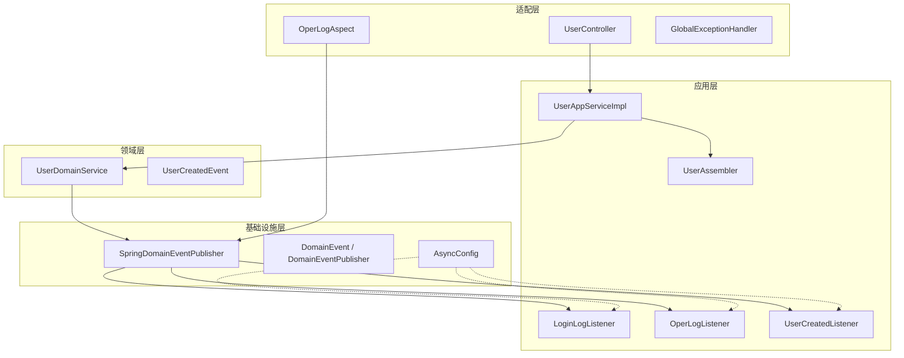
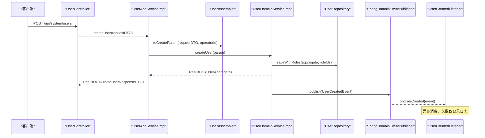
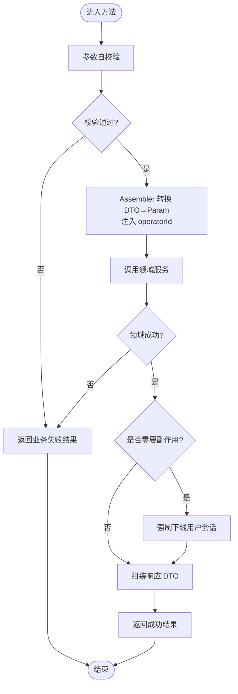
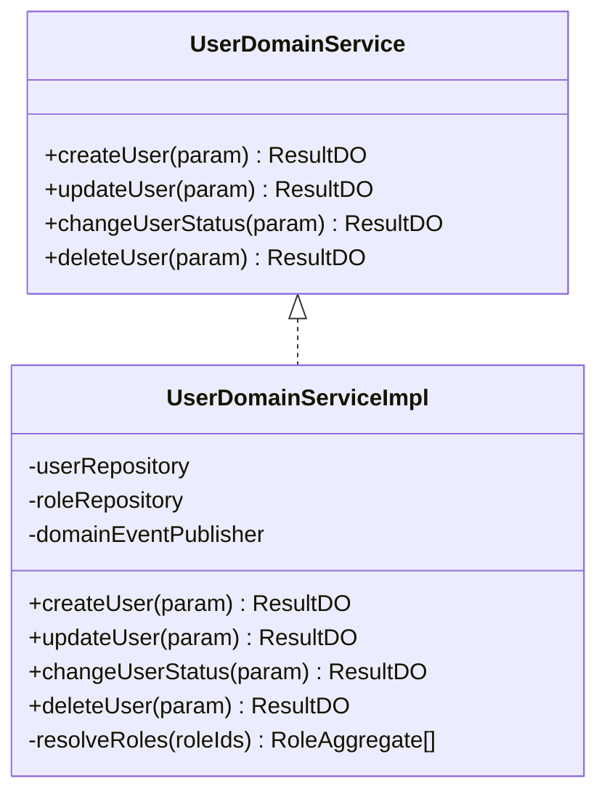
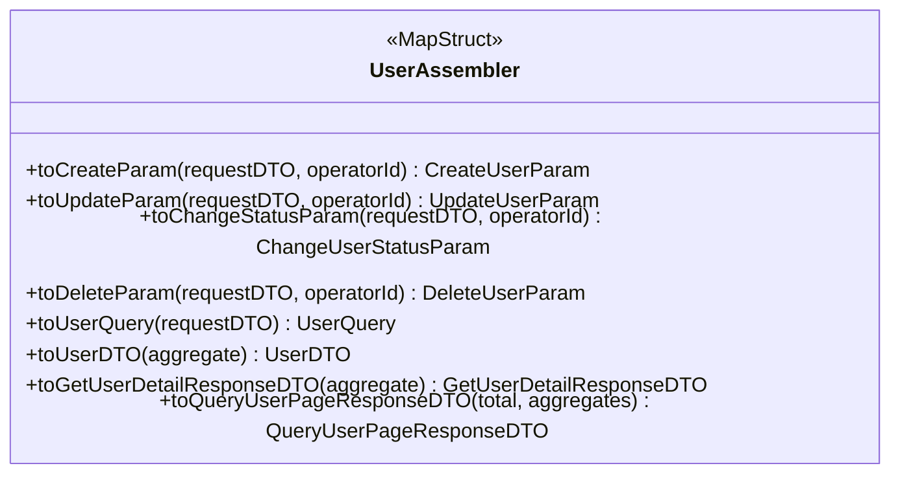
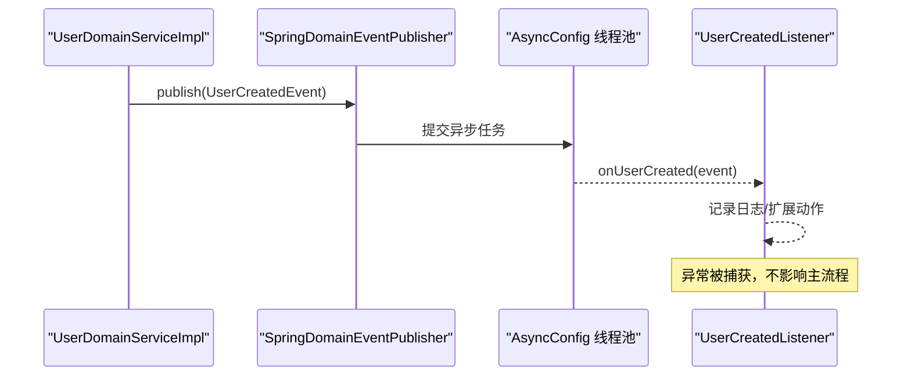
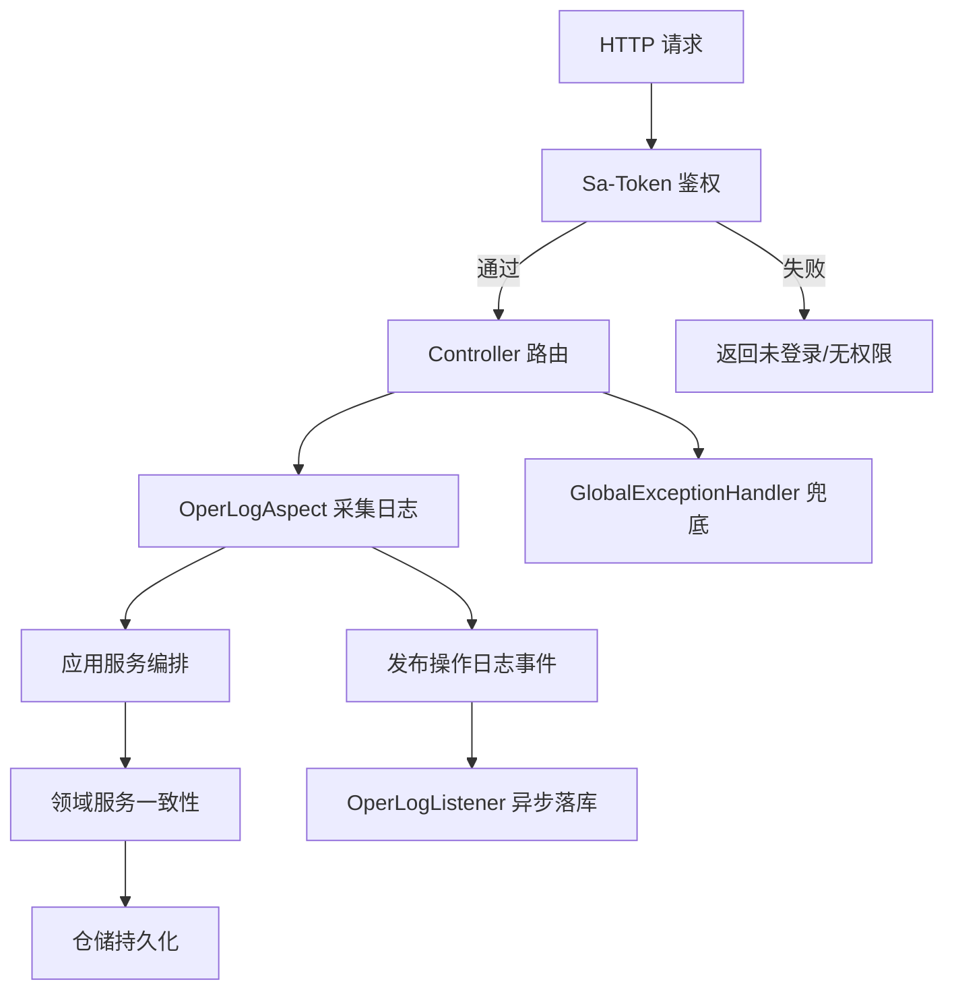
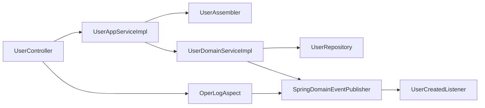

# 应用层开发

<cite>
**本文引用的文件**   
- [UserAppServiceImpl.java](file://src/main/java/com/sunnao/spring/ddd/template/application/system/user/scenario/UserAppServiceImpl.java)
- [UserAssembler.java](file://src/main/java/com/sunnao/spring/ddd/template/application/system/user/assembler/UserAssembler.java)
- [UserDomainService.java](file://src/main/java/com/sunnao/spring/ddd/template/domain/system/user/service/UserDomainService.java)
- [UserDomainServiceImpl.java](file://src/main/java/com/sunnao/spring/ddd/template/domain/system/user/service/UserDomainServiceImpl.java)
- [UserController.java](file://src/main/java/com/sunnao/spring/ddd/template/adaptor/system/user/input/UserController.java)
- [OperLogAspect.java](file://src/main/java/com/sunnao/spring/ddd/template/adaptor/common/OperLogAspect.java)
- [GlobalExceptionHandler.java](file://src/main/java/com/sunnao/spring/ddd/template/adaptor/common/GlobalExceptionHandler.java)
- [OperLog.java](file://src/main/java/com/sunnao/spring/ddd/template/common/annotation/OperLog.java)
- [CurrentUserContext.java](file://src/main/java/com/sunnao/spring/ddd/template/common/context/CurrentUserContext.java)
- [AsyncConfig.java](file://src/main/java/com/sunnao/spring/ddd/template/common/config/AsyncConfig.java)
- [LoginLogListener.java](file://src/main/java/com/sunnao/spring/ddd/template/application/system/log/listener/LoginLogListener.java)
- [OperLogListener.java](file://src/main/java/com/sunnao/spring/ddd/template/application/system/log/listener/OperLogListener.java)
- [DomainEventPublisher.java](file://src/main/java/com/sunnao/spring/ddd/template/common/event/DomainEventPublisher.java)
- [SpringDomainEventPublisher.java](file://src/main/java/com/sunnao/spring/ddd/template/infrastructure/common/SpringDomainEventPublisher.java)
- [DomainEvent.java](file://src/main/java/com/sunnao/spring/ddd/template/common/event/DomainEvent.java)
- [UserCreatedEvent.java](file://src/main/java/com/sunnao/spring/ddd/template/domain/system/user/event/UserCreatedEvent.java)
- [UserCreatedListener.java](file://src/main/java/com/sunnao/spring/ddd/template/application/system/user/listener/UserCreatedListener.java)
</cite>

## 目录
1. [引言](#引言)
2. [项目结构](#项目结构)
3. [核心组件](#核心组件)
4. [架构总览](#架构总览)
5. [详细组件分析](#详细组件分析)
6. [依赖关系分析](#依赖关系分析)
7. [性能考虑](#性能考虑)
8. [故障排查指南](#故障排查指南)
9. [结论](#结论)
10. [附录](#附录)

## 引言
本指南聚焦于应用层的编排模式与职责边界，结合用户领域示例，系统阐述：
- 应用服务如何协调领域服务、处理业务流程与跨域副作用（如强制下线）
- DTO 转换器设计与 MapStruct 使用规范
- 事件监听器实现模式（异步消费、MDC 透传、失败不阻塞主流程）
- 事务管理与并发控制策略（本地事务、分布式锁）
- 横切关注点落地（权限校验、操作日志、异常处理）
并提供可视化图示与最佳实践建议。

## 项目结构
应用层位于 application 包下，按“场景”组织；领域层 domain 提供聚合根与领域服务；基础设施层 infrastructure 提供事件发布器实现与仓储实现；适配层 adaptor 暴露 HTTP API 并承载横切逻辑。

图表来源
- [UserController.java:1-115](file://src/main/java/com/sunnao/spring/ddd/template/adaptor/system/user/input/UserController.java#L1-L115)
- [UserAppServiceImpl.java:1-163](file://src/main/java/com/sunnao/spring/ddd/template/application/system/user/scenario/UserAppServiceImpl.java#L1-L163)
- [UserAssembler.java:1-123](file://src/main/java/com/sunnao/spring/ddd/template/application/system/user/assembler/UserAssembler.java#L1-L123)
- [UserDomainServiceImpl.java:1-204](file://src/main/java/com/sunnao/spring/ddd/template/domain/system/user/service/UserDomainServiceImpl.java#L1-L204)
- [OperLogAspect.java:1-131](file://src/main/java/com/sunnao/spring/ddd/template/adaptor/common/OperLogAspect.java#L1-L131)
- [SpringDomainEventPublisher.java:1-35](file://src/main/java/com/sunnao/spring/ddd/template/infrastructure/common/SpringDomainEventPublisher.java#L1-L35)
- [AsyncConfig.java:1-69](file://src/main/java/com/sunnao/spring/ddd/template/common/config/AsyncConfig.java#L1-L69)
- [LoginLogListener.java:1-36](file://src/main/java/com/sunnao/spring/ddd/template/application/system/log/listener/LoginLogListener.java#L1-L36)
- [OperLogListener.java:1-36](file://src/main/java/com/sunnao/spring/ddd/template/application/system/log/listener/OperLogListener.java#L1-L36)
- [UserCreatedListener.java:1-31](file://src/main/java/com/sunnao/spring/ddd/template/application/system/user/listener/UserCreatedListener.java#L1-L31)

章节来源
- [UserController.java:1-115](file://src/main/java/com/sunnao/spring/ddd/template/adaptor/system/user/input/UserController.java#L1-L115)
- [UserAppServiceImpl.java:1-163](file://src/main/java/com/sunnao/spring/ddd/template/application/system/user/scenario/UserAppServiceImpl.java#L1-L163)
- [UserAssembler.java:1-123](file://src/main/java/com/sunnao/spring/ddd/template/application/system/user/assembler/UserAssembler.java#L1-L123)
- [UserDomainServiceImpl.java:1-204](file://src/main/java/com/sunnao/spring/ddd/template/domain/system/user/service/UserDomainServiceImpl.java#L1-L204)
- [OperLogAspect.java:1-131](file://src/main/java/com/sunnao/spring/ddd/template/adaptor/common/OperLogAspect.java#L1-L131)
- [SpringDomainEventPublisher.java:1-35](file://src/main/java/com/sunnao/spring/ddd/template/infrastructure/common/SpringDomainEventPublisher.java#L1-L35)
- [AsyncConfig.java:1-69](file://src/main/java/com/sunnao/spring/ddd/template/common/config/AsyncConfig.java#L1-L69)
- [LoginLogListener.java:1-36](file://src/main/java/com/sunnao/spring/ddd/template/application/system/log/listener/LoginLogListener.java#L1-L36)
- [OperLogListener.java:1-36](file://src/main/java/com/sunnao/spring/ddd/template/application/system/log/listener/OperLogListener.java#L1-L36)
- [UserCreatedListener.java:1-31](file://src/main/java/com/sunnao/spring/ddd/template/application/system/user/listener/UserCreatedListener.java#L1-L31)

## 核心组件
- 应用服务 UserAppServiceImpl：负责请求参数自校验、DTO→Param 转换、调用领域服务、组装响应，并在禁用/删除后执行“强制下线”的副作用。
- 领域服务 UserDomainServiceImpl：封装用户领域一致性规则，采用“加锁→加载聚合根→执行业务→持久化→释放锁”的标准流程，并通过事件发布器发布领域事件。
- 转换器 UserAssembler：基于 MapStruct 将 Request/Response DTO 与领域对象进行映射，统一枚举转换与上下文注入。
- 事件体系：DomainEvent/DomainEventPublisher 定义抽象，SpringDomainEventPublisher 基于 Spring 事件机制广播；监听器以 @Async 异步消费，失败不影响主流程。
- 横切关注点：OperLogAspect 采集操作日志并发布事件；GlobalExceptionHandler 兜底异常；CurrentUserContext 安全获取当前用户。

章节来源
- [UserAppServiceImpl.java:1-163](file://src/main/java/com/sunnao/spring/ddd/template/application/system/user/scenario/UserAppServiceImpl.java#L1-L163)
- [UserDomainServiceImpl.java:1-204](file://src/main/java/com/sunnao/spring/ddd/template/domain/system/user/service/UserDomainServiceImpl.java#L1-L204)
- [UserAssembler.java:1-123](file://src/main/java/com/sunnao/spring/ddd/template/application/system/user/assembler/UserAssembler.java#L1-L123)
- [DomainEventPublisher.java:1-20](file://src/main/java/com/sunnao/spring/ddd/template/common/event/DomainEventPublisher.java#L1-L20)
- [SpringDomainEventPublisher.java:1-35](file://src/main/java/com/sunnao/spring/ddd/template/infrastructure/common/SpringDomainEventPublisher.java#L1-L35)
- [OperLogAspect.java:1-131](file://src/main/java/com/sunnao/spring/ddd/template/adaptor/common/OperLogAspect.java#L1-L131)
- [GlobalExceptionHandler.java:1-98](file://src/main/java/com/sunnao/spring/ddd/template/adaptor/common/GlobalExceptionHandler.java#L1-L98)
- [CurrentUserContext.java:1-27](file://src/main/java/com/sunnao/spring/ddd/template/common/context/CurrentUserContext.java#L1-L27)

## 架构总览
下图展示一次“创建用户”的端到端调用链，体现应用层编排、领域层一致性保障与事件异步解耦。

图表来源
- [UserController.java:35-41](file://src/main/java/com/sunnao/spring/ddd/template/adaptor/system/user/input/UserController.java#L35-L41)
- [UserAppServiceImpl.java:40-62](file://src/main/java/com/sunnao/spring/ddd/template/application/system/user/scenario/UserAppServiceImpl.java#L40-L62)
- [UserAssembler.java:29-30](file://src/main/java/com/sunnao/spring/ddd/template/application/system/user/assembler/UserAssembler.java#L29-L30)
- [UserDomainServiceImpl.java:46-89](file://src/main/java/com/sunnao/spring/ddd/template/domain/system/user/service/UserDomainServiceImpl.java#L46-L89)
- [SpringDomainEventPublisher.java:24-33](file://src/main/java/com/sunnao/spring/ddd/template/infrastructure/common/SpringDomainEventPublisher.java#L24-L33)
- [UserCreatedListener.java:20-29](file://src/main/java/com/sunnao/spring/ddd/template/application/system/user/listener/UserCreatedListener.java#L20-L29)

## 详细组件分析

### 应用服务编排：UserAppServiceImpl
- 职责边界
  - 只做编排：参数自校验 → DTO→Param 转换 → 调用领域服务 → 组装响应
  - 对跨域副作用（如禁用/删除后强制下线）进行收敛处理，确保主流程稳定
- 关键流程
  - 参数自校验：通过 RequestDTO 的 check() 返回 ResultDO，快速失败
  - 上下文注入：从 CurrentUserContext 获取操作人 ID，交由 Assembler 注入到 Param
  - 领域结果传播：领域服务返回 ResultDO，应用层直接透传或包装为响应 DTO
  - 副作用处理：禁用或删除成功后调用 StpUtil.kickout(userId)，失败仅记录日志
- 异常与日志
  - 捕获未知异常，记录错误日志并返回系统错误码，避免堆栈泄露

图表来源
- [UserAppServiceImpl.java:40-149](file://src/main/java/com/sunnao/spring/ddd/template/application/system/user/scenario/UserAppServiceImpl.java#L40-L149)
- [UserAssembler.java:29-53](file://src/main/java/com/sunnao/spring/ddd/template/application/system/user/assembler/UserAssembler.java#L29-L53)
- [CurrentUserContext.java:18-25](file://src/main/java/com/sunnao/spring/ddd/template/common/context/CurrentUserContext.java#L18-L25)

章节来源
- [UserAppServiceImpl.java:1-163](file://src/main/java/com/sunnao/spring/ddd/template/application/system/user/scenario/UserAppServiceImpl.java#L1-L163)
- [UserAssembler.java:1-123](file://src/main/java/com/sunnao/spring/ddd/template/application/system/user/assembler/UserAssembler.java#L1-L123)
- [CurrentUserContext.java:1-27](file://src/main/java/com/sunnao/spring/ddd/template/common/context/CurrentUserContext.java#L1-L27)

### 领域服务与一致性：UserDomainServiceImpl
- 标准流程
  - 加锁：按邮箱或用户 ID 构建 LevelLock，防止并发重复创建/更新
  - 加载聚合根：查询是否存在，不存在则快速失败
  - 执行业务：通过聚合根方法变更状态、更新资料等
  - 持久化：保存聚合根及关联数据（同一事务）
  - 发布事件：发布领域事件，供下游异步消费
  - 解锁：finally 中释放锁
- 并发与一致性
  - 使用分布式/进程级锁（LevelLock）保证幂等与一致性
  - 角色解析时校验有效性，缺失默认角色时抛出业务异常
- 异常处理
  - 捕获 BizException 转换为业务错误码
  - 捕获其他异常转换为系统错误码，避免向上抛异常

图表来源
- [UserDomainService.java:16-49](file://src/main/java/com/sunnao/spring/ddd/template/domain/system/user/service/UserDomainService.java#L16-L49)
- [UserDomainServiceImpl.java:34-203](file://src/main/java/com/sunnao/spring/ddd/template/domain/system/user/service/UserDomainServiceImpl.java#L34-L203)

章节来源
- [UserDomainService.java:1-50](file://src/main/java/com/sunnao/spring/ddd/template/domain/system/user/service/UserDomainService.java#L1-L50)
- [UserDomainServiceImpl.java:1-204](file://src/main/java/com/sunnao/spring/ddd/template/domain/system/user/service/UserDomainServiceImpl.java#L1-L204)

### DTO 转换器与 MapStruct：UserAssembler
- 设计要点
  - 使用 @Mapper(componentModel = "spring") 生成 Spring Bean
  - 使用 @Context 注入外部上下文（operatorId），避免在业务层拼接
  - 自定义 default 方法处理复杂映射（枚举转换、分页响应组装）
  - 统一枚举转换：int ↔ UserStatusEnum，保持 client 与 model 层类型隔离
- 使用规范
  - 写路径：RequestDTO → Param（带 operatorId）
  - 读路径：Aggregate → DTO/ResponseDTO（过滤敏感字段、枚举值转换）
  - 列表/分页：stream 批量转换，空集合保护

图表来源
- [UserAssembler.java:23-122](file://src/main/java/com/sunnao/spring/ddd/template/application/system/user/assembler/UserAssembler.java#L23-L122)

章节来源
- [UserAssembler.java:1-123](file://src/main/java/com/sunnao/spring/ddd/template/application/system/user/assembler/UserAssembler.java#L1-L123)

### 事件监听器与异步处理
- 事件模型
  - DomainEvent：包含 eventId、occurredAt、operatorId，用于追踪与审计
  - 具体事件：如 UserCreatedEvent，携带业务语义信息
- 发布与订阅
  - 领域服务通过 DomainEventPublisher.publish 发布事件
  - SpringDomainEventPublisher 基于 ApplicationEventPublisher 广播
  - 监听器使用 @Async + @EventListener 异步消费，线程池由 AsyncConfig 配置
- 日志链路
  - AsyncConfig 通过 TaskDecorator 将 MDC 上下文透传到异步线程，保证 traceId 完整
- 失败处理
  - 监听器内部 try-catch 记录错误，不向上传播，确保主流程不受影响

图表来源
- [UserDomainServiceImpl.java:75-78](file://src/main/java/com/sunnao/spring/ddd/template/domain/system/user/service/UserDomainServiceImpl.java#L75-L78)
- [SpringDomainEventPublisher.java:24-33](file://src/main/java/com/sunnao/spring/ddd/template/infrastructure/common/SpringDomainEventPublisher.java#L24-L33)
- [AsyncConfig.java:28-45](file://src/main/java/com/sunnao/spring/ddd/template/common/config/AsyncConfig.java#L28-L45)
- [UserCreatedListener.java:20-29](file://src/main/java/com/sunnao/spring/ddd/template/application/system/user/listener/UserCreatedListener.java#L20-L29)

章节来源
- [DomainEvent.java:1-46](file://src/main/java/com/sunnao/spring/ddd/template/common/event/DomainEvent.java#L1-L46)
- [DomainEventPublisher.java:1-20](file://src/main/java/com/sunnao/spring/ddd/template/common/event/DomainEventPublisher.java#L1-L20)
- [SpringDomainEventPublisher.java:1-35](file://src/main/java/com/sunnao/spring/ddd/template/infrastructure/common/SpringDomainEventPublisher.java#L1-L35)
- [UserCreatedEvent.java:1-39](file://src/main/java/com/sunnao/spring/ddd/template/domain/system/user/event/UserCreatedEvent.java#L1-L39)
- [UserCreatedListener.java:1-31](file://src/main/java/com/sunnao/spring/ddd/template/application/system/user/listener/UserCreatedListener.java#L1-L31)
- [AsyncConfig.java:1-69](file://src/main/java/com/sunnao/spring/ddd/template/common/config/AsyncConfig.java#L1-L69)

### 横切关注点：权限、日志、异常
- 权限校验
  - 控制器方法使用 Sa-Token 注解进行细粒度鉴权（read/write）
- 操作日志
  - OperLog 注解标注写接口，OperLogAspect 环绕采集 traceId、操作人、URI、参数摘要、结果码、耗时、IP
  - 通过 DomainEventPublisher 发布 OperLogEvent，application 层 OperLogListener 异步落库
- 全局异常
  - GlobalExceptionHandler 兜底未登录、无权限、参数解析错误、资源不存在与未预期异常，统一返回 ResultDO

图表来源
- [UserController.java:35-80](file://src/main/java/com/sunnao/spring/ddd/template/adaptor/system/user/input/UserController.java#L35-L80)
- [OperLogAspect.java:51-99](file://src/main/java/com/sunnao/spring/ddd/template/adaptor/common/OperLogAspect.java#L51-L99)
- [OperLogListener.java:25-34](file://src/main/java/com/sunnao/spring/ddd/template/application/system/log/listener/OperLogListener.java#L25-L34)
- [GlobalExceptionHandler.java:31-96](file://src/main/java/com/sunnao/spring/ddd/template/adaptor/common/GlobalExceptionHandler.java#L31-L96)

章节来源
- [OperLog.java:1-27](file://src/main/java/com/sunnao/spring/ddd/template/common/annotation/OperLog.java#L1-L27)
- [OperLogAspect.java:1-131](file://src/main/java/com/sunnao/spring/ddd/template/adaptor/common/OperLogAspect.java#L1-L131)
- [OperLogListener.java:1-36](file://src/main/java/com/sunnao/spring/ddd/template/application/system/log/listener/OperLogListener.java#L1-L36)
- [GlobalExceptionHandler.java:1-98](file://src/main/java/com/sunnao/spring/ddd/template/adaptor/common/GlobalExceptionHandler.java#L1-L98)

## 依赖关系分析
- 耦合与内聚
  - 应用层仅依赖领域服务接口与转换器，低耦合高内聚
  - 领域服务依赖仓储与事件发布器，屏蔽基础设施细节
  - 适配器层只负责协议适配与横切逻辑，不包含业务
- 外部依赖
  - Sa-Token 用于认证授权
  - Spring 事件机制用于进程内异步解耦
  - MapStruct 用于编译期生成的 DTO 转换

图表来源
- [UserController.java:1-115](file://src/main/java/com/sunnao/spring/ddd/template/adaptor/system/user/input/UserController.java#L1-L115)
- [UserAppServiceImpl.java:1-163](file://src/main/java/com/sunnao/spring/ddd/template/application/system/user/scenario/UserAppServiceImpl.java#L1-L163)
- [UserAssembler.java:1-123](file://src/main/java/com/sunnao/spring/ddd/template/application/system/user/assembler/UserAssembler.java#L1-L123)
- [UserDomainServiceImpl.java:1-204](file://src/main/java/com/sunnao/spring/ddd/template/domain/system/user/service/UserDomainServiceImpl.java#L1-L204)
- [OperLogAspect.java:1-131](file://src/main/java/com/sunnao/spring/ddd/template/adaptor/common/OperLogAspect.java#L1-L131)
- [SpringDomainEventPublisher.java:1-35](file://src/main/java/com/sunnao/spring/ddd/template/infrastructure/common/SpringDomainEventPublisher.java#L1-L35)
- [UserCreatedListener.java:1-31](file://src/main/java/com/sunnao/spring/ddd/template/application/system/user/listener/UserCreatedListener.java#L1-L31)

章节来源
- [UserController.java:1-115](file://src/main/java/com/sunnao/spring/ddd/template/adaptor/system/user/input/UserController.java#L1-L115)
- [UserAppServiceImpl.java:1-163](file://src/main/java/com/sunnao/spring/ddd/template/application/system/user/scenario/UserAppServiceImpl.java#L1-L163)
- [UserDomainServiceImpl.java:1-204](file://src/main/java/com/sunnao/spring/ddd/template/domain/system/user/service/UserDomainServiceImpl.java#L1-L204)
- [OperLogAspect.java:1-131](file://src/main/java/com/sunnao/spring/ddd/template/adaptor/common/OperLogAspect.java#L1-L131)
- [SpringDomainEventPublisher.java:1-35](file://src/main/java/com/sunnao/spring/ddd/template/infrastructure/common/SpringDomainEventPublisher.java#L1-L35)
- [UserCreatedListener.java:1-31](file://src/main/java/com/sunnao/spring/ddd/template/application/system/user/listener/UserCreatedListener.java#L1-L31)

## 性能考虑
- 异步事件
  - 使用独立线程池与 CallerRunsPolicy 拒绝策略，避免阻塞主线程
  - MDC 透传保证链路可观测性
- 锁粒度
  - 按邮箱/用户 ID 加锁，缩小锁范围，提高并发度
- 转换开销
  - MapStruct 编译期生成代码，运行期零反射，适合高频转换
- 日志采集
  - 操作日志异步落库，避免同步 IO 影响响应时间
- 建议
  - 根据 QPS 调整线程池大小与队列容量
  - 对热点接口增加缓存与限流
  - 对大对象转换进行按需字段映射，减少内存占用

[本节为通用指导，无需源码引用]

## 故障排查指南
- 常见异常与定位
  - 未登录/无权限：检查 Sa-Token 配置与权限点是否匹配
  - 参数解析失败：检查 JSON 结构与类型映射
  - 资源不存在：核对路由与路径变量
  - 系统异常：查看全局异常处理器日志与业务层日志
- 事件消费失败
  - 确认 @EnableAsync 已启用且线程池正常
  - 检查监听器日志与 MDC 链路
- 锁竞争
  - 观察锁获取失败的业务错误码，评估锁键与并发场景

章节来源
- [GlobalExceptionHandler.java:31-96](file://src/main/java/com/sunnao/spring/ddd/template/adaptor/common/GlobalExceptionHandler.java#L31-L96)
- [AsyncConfig.java:42-45](file://src/main/java/com/sunnao/spring/ddd/template/common/config/AsyncConfig.java#L42-L45)
- [UserDomainServiceImpl.java:46-89](file://src/main/java/com/sunnao/spring/ddd/template/domain/system/user/service/UserDomainServiceImpl.java#L46-L89)

## 结论
应用层应严格遵循“编排者”角色：只做参数校验、对象转换、流程编排与副作用收敛；领域层承担一致性与核心规则；基础设施层屏蔽技术细节；适配层专注协议与横切。通过 MapStruct、事件驱动与统一的异常/日志/权限方案，形成清晰、可扩展、可观测的应用层体系。

[本节为总结，无需源码引用]

## 附录
- 参考路径
  - 应用服务实现：[UserAppServiceImpl.java](file://src/main/java/com/sunnao/spring/ddd/template/application/system/user/scenario/UserAppServiceImpl.java)
  - 领域服务实现：[UserDomainServiceImpl.java](file://src/main/java/com/sunnao/spring/ddd/template/domain/system/user/service/UserDomainServiceImpl.java)
  - 转换器：[UserAssembler.java](file://src/main/java/com/sunnao/spring/ddd/template/application/system/user/assembler/UserAssembler.java)
  - 事件基类与发布器：[DomainEvent.java](file://src/main/java/com/sunnao/spring/ddd/template/common/event/DomainEvent.java), [DomainEventPublisher.java](file://src/main/java/com/sunnao/spring/ddd/template/common/event/DomainEventPublisher.java), [SpringDomainEventPublisher.java](file://src/main/java/com/sunnao/spring/ddd/template/infrastructure/common/SpringDomainEventPublisher.java)
  - 异步配置：[AsyncConfig.java](file://src/main/java/com/sunnao/spring/ddd/template/common/config/AsyncConfig.java)
  - 操作日志：[OperLog.java](file://src/main/java/com/sunnao/spring/ddd/template/common/annotation/OperLog.java), [OperLogAspect.java](file://src/main/java/com/sunnao/spring/ddd/template/adaptor/common/OperLogAspect.java), [OperLogListener.java](file://src/main/java/com/sunnao/spring/ddd/template/application/system/log/listener/OperLogListener.java)
  - 全局异常：[GlobalExceptionHandler.java](file://src/main/java/com/sunnao/spring/ddd/template/adaptor/common/GlobalExceptionHandler.java)
  - 当前用户上下文：[CurrentUserContext.java](file://src/main/java/com/sunnao/spring/ddd/template/common/context/CurrentUserContext.java)

[本节为索引，无需源码引用]