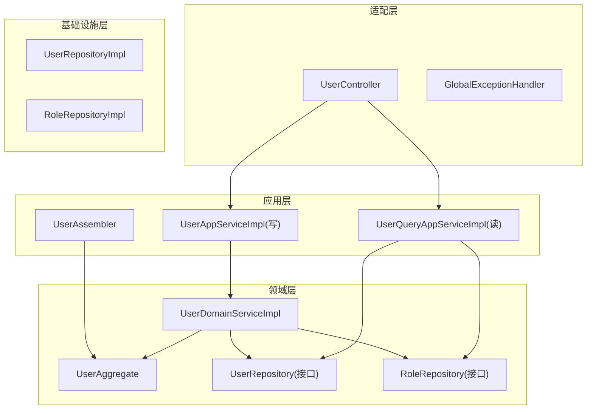
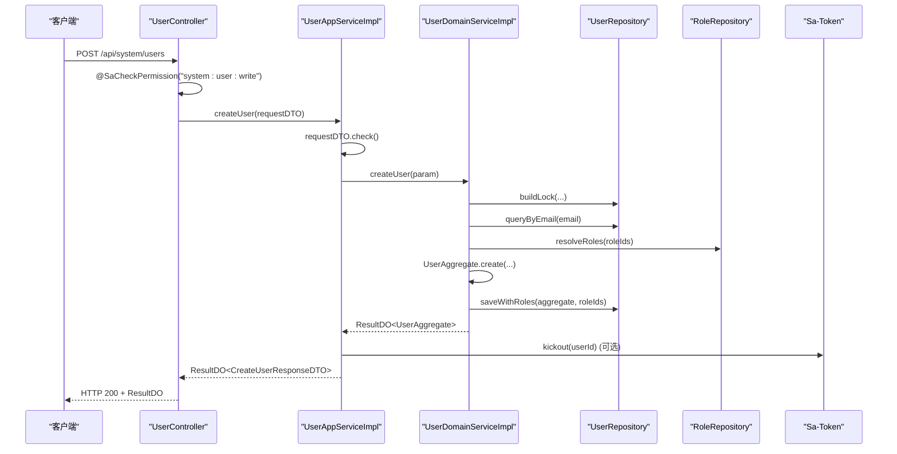
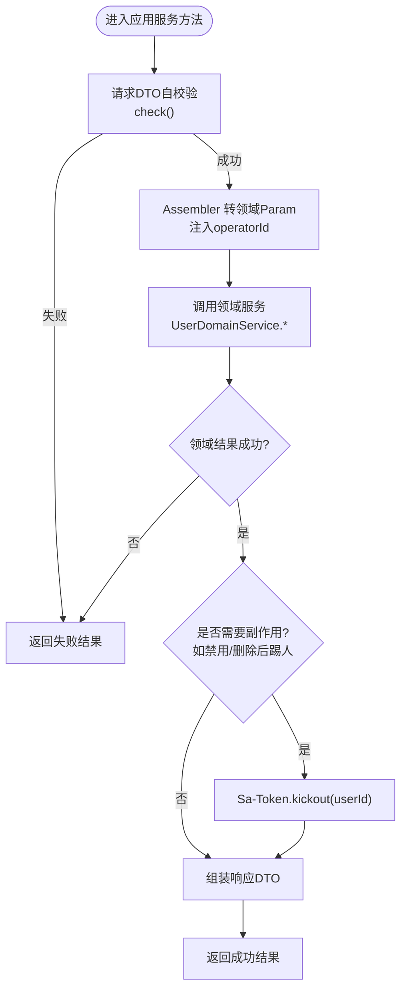
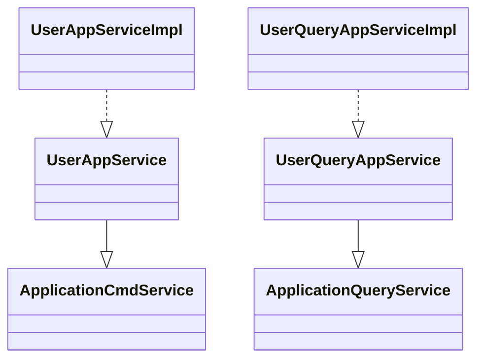
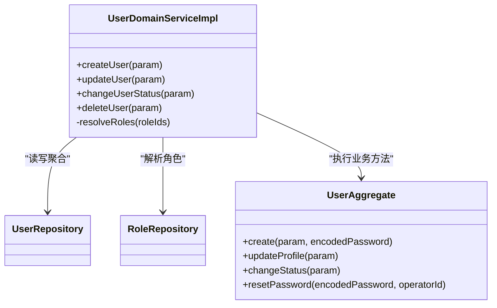
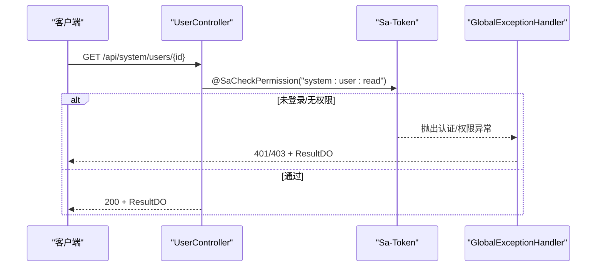
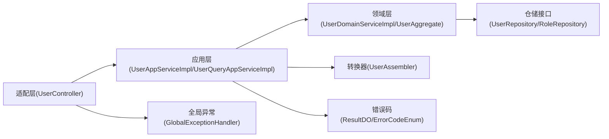

# 应用服务编排

<cite>
**本文引用的文件**
- [UserAppServiceImpl.java](file://src/main/java/com/sunnao/spring/ddd/template/application/system/user/scenario/UserAppServiceImpl.java)
- [UserQueryAppServiceImpl.java](file://src/main/java/com/sunnao/spring/ddd/template/application/system/user/scenario/UserQueryAppServiceImpl.java)
- [UserAppService.java](file://src/main/java/com/sunnao/spring/ddd/template/client/system/user/UserAppService.java)
- [UserQueryAppService.java](file://src/main/java/com/sunnao/spring/ddd/template/client/system/user/UserQueryAppService.java)
- [ApplicationCmdService.java](file://src/main/java/com/sunnao/spring/ddd/template/common/service/ApplicationCmdService.java)
- [ApplicationQueryService.java](file://src/main/java/com/sunnao/spring/ddd/template/common/service/ApplicationQueryService.java)
- [UserController.java](file://src/main/java/com/sunnao/spring/ddd/template/adaptor/system/user/input/UserController.java)
- [UserDomainServiceImpl.java](file://src/main/java/com/sunnao/spring/ddd/template/domain/system/user/service/UserDomainServiceImpl.java)
- [UserAggregate.java](file://src/main/java/com/sunnao/spring/ddd/template/domain/system/user/model/aggregate/UserAggregate.java)
- [UserAssembler.java](file://src/main/java/com/sunnao/spring/ddd/template/application/system/user/assembler/UserAssembler.java)
- [ErrorCodeEnum.java](file://src/main/java/com/sunnao/spring/ddd/template/common/result/ErrorCodeEnum.java)
- [ResultDO.java](file://src/main/java/com/sunnao/spring/ddd/template/common/result/ResultDO.java)
- [BizException.java](file://src/main/java/com/sunnao/spring/ddd/template/common/exception/BizException.java)
- [GlobalExceptionHandler.java](file://src/main/java/com/sunnao/spring/ddd/template/adaptor/common/GlobalExceptionHandler.java)
- [CurrentUserContext.java](file://src/main/java/com/sunnao/spring/ddd/template/common/context/CurrentUserContext.java)
- [CreateUserRequestDTO.java](file://src/main/java/com/sunnao/spring/ddd/template/client/system/user/req/CreateUserRequestDTO.java)
</cite>

## 目录
1. [简介](#简介)
2. [项目结构](#项目结构)
3. [核心组件](#核心组件)
4. [架构总览](#架构总览)
5. [详细组件分析](#详细组件分析)
6. [依赖关系分析](#依赖关系分析)
7. [性能与事务考量](#性能与事务考量)
8. [故障排查指南](#故障排查指南)
9. [结论](#结论)
10. [附录：最佳实践清单](#附录最佳实践清单)

## 简介
本指南聚焦于“应用服务编排”的完整开发范式，以用户领域为例，系统阐述：
- 应用服务的职责边界与标准流程（参数校验、领域服务调用、响应组装）
- CQRS 模式下命令服务与查询服务的差异与实现方式
- 多领域服务协作、事务边界控制与异常处理策略
- 横切关注点落地：错误码、日志、权限校验、操作人上下文等

## 项目结构
本项目采用分层与DDD结合的组织方式：
- 适配层（Adaptor）：HTTP 控制器负责入参解析、鉴权、日志注解与结果包装
- 应用层（Application）：按场景组织应用服务，承载用例编排、跨领域协调、装配与转换
- 领域层（Domain）：聚合根、领域服务、仓储接口与领域事件
- 基础设施层（Infrastructure）：持久化实现、外部存储、事件发布实现等

图表来源
- [UserController.java:1-115](file://src/main/java/com/sunnao/spring/ddd/template/adaptor/system/user/input/UserController.java#L1-L115)
- [UserAppServiceImpl.java:1-163](file://src/main/java/com/sunnao/spring/ddd/template/application/system/user/scenario/UserAppServiceImpl.java#L1-L163)
- [UserQueryAppServiceImpl.java:1-104](file://src/main/java/com/sunnao/spring/ddd/template/application/system/user/scenario/UserQueryAppServiceImpl.java#L1-L104)
- [UserDomainServiceImpl.java:1-204](file://src/main/java/com/sunnao/spring/ddd/template/domain/system/user/service/UserDomainServiceImpl.java#L1-L204)
- [UserAggregate.java:1-113](file://src/main/java/com/sunnao/spring/ddd/template/domain/system/user/model/aggregate/UserAggregate.java#L1-L113)
- [UserAssembler.java:1-123](file://src/main/java/com/sunnao/spring/ddd/template/application/system/user/assembler/UserAssembler.java#L1-L123)

章节来源
- [UserController.java:1-115](file://src/main/java/com/sunnao/spring/ddd/template/adaptor/system/user/input/UserController.java#L1-L115)
- [UserAppServiceImpl.java:1-163](file://src/main/java/com/sunnao/spring/ddd/template/application/system/user/scenario/UserAppServiceImpl.java#L1-L163)
- [UserQueryAppServiceImpl.java:1-104](file://src/main/java/com/sunnao/spring/ddd/template/application/system/user/scenario/UserQueryAppServiceImpl.java#L1-L104)
- [UserDomainServiceImpl.java:1-204](file://src/main/java/com/sunnao/spring/ddd/template/domain/system/user/service/UserDomainServiceImpl.java#L1-L204)
- [UserAggregate.java:1-113](file://src/main/java/com/sunnao/spring/ddd/template/domain/system/user/model/aggregate/UserAggregate.java#L1-L113)
- [UserAssembler.java:1-123](file://src/main/java/com/sunnao/spring/ddd/template/application/system/user/assembler/UserAssembler.java#L1-L123)

## 核心组件
- 应用服务接口与标记
  - 写模式接口继承 ApplicationCmdService，用于统一标识命令类应用服务
  - 读模式接口继承 ApplicationQueryService，用于统一标识查询类应用服务
- 应用服务实现
  - UserAppServiceImpl：写模式场景编排，包含参数自校验、领域服务调用、响应组装、会话踢出等
  - UserQueryAppServiceImpl：读模式场景编排，包含参数自校验、聚合查询、角色填充、响应组装
- 领域服务与聚合
  - UserDomainServiceImpl：封装并发锁、聚合加载、业务规则执行、持久化与领域事件发布
  - UserAggregate：聚合根，暴露变更方法并维护实体一致性
- 转换器
  - UserAssembler：负责 DTO/Param/Aggregate 之间的映射与枚举转换
- 通用基础
  - ResultDO：统一返回体
  - ErrorCodeEnum：全局错误码收敛
  - BizException：领域/应用层业务异常载体
  - GlobalExceptionHandler：全局异常兜底
  - CurrentUserContext：当前登录用户上下文获取

章节来源
- [UserAppService.java:1-52](file://src/main/java/com/sunnao/spring/ddd/template/client/system/user/UserAppService.java#L1-L52)
- [UserQueryAppService.java:1-32](file://src/main/java/com/sunnao/spring/ddd/template/client/system/user/UserQueryAppService.java#L1-L32)
- [ApplicationCmdService.java:1-5](file://src/main/java/com/sunnao/spring/ddd/template/common/service/ApplicationCmdService.java#L1-L5)
- [ApplicationQueryService.java:1-5](file://src/main/java/com/sunnao/spring/ddd/template/common/service/ApplicationQueryService.java#L1-L5)
- [UserAppServiceImpl.java:1-163](file://src/main/java/com/sunnao/spring/ddd/template/application/system/user/scenario/UserAppServiceImpl.java#L1-L163)
- [UserQueryAppServiceImpl.java:1-104](file://src/main/java/com/sunnao/spring/ddd/template/application/system/user/scenario/UserQueryAppServiceImpl.java#L1-L104)
- [UserDomainServiceImpl.java:1-204](file://src/main/java/com/sunnao/spring/ddd/template/domain/system/user/service/UserDomainServiceImpl.java#L1-L204)
- [UserAggregate.java:1-113](file://src/main/java/com/sunnao/spring/ddd/template/domain/system/user/model/aggregate/UserAggregate.java#L1-L113)
- [UserAssembler.java:1-123](file://src/main/java/com/sunnao/spring/ddd/template/application/system/user/assembler/UserAssembler.java#L1-L123)
- [ResultDO.java:1-110](file://src/main/java/com/sunnao/spring/ddd/template/common/result/ResultDO.java#L1-L110)
- [ErrorCodeEnum.java:1-209](file://src/main/java/com/sunnao/spring/ddd/template/common/result/ErrorCodeEnum.java#L1-L209)
- [BizException.java:1-28](file://src/main/java/com/sunnao/spring/ddd/template/common/exception/BizException.java#L1-L28)
- [GlobalExceptionHandler.java:1-98](file://src/main/java/com/sunnao/spring/ddd/template/adaptor/common/GlobalExceptionHandler.java#L1-L98)
- [CurrentUserContext.java:1-27](file://src/main/java/com/sunnao/spring/ddd/template/common/context/CurrentUserContext.java#L1-L27)

## 架构总览
下图展示从 HTTP 请求到领域落库的端到端调用链，体现应用服务在编排中的关键作用。

图表来源
- [UserController.java:35-41](file://src/main/java/com/sunnao/spring/ddd/template/adaptor/system/user/input/UserController.java#L35-L41)
- [UserAppServiceImpl.java:40-62](file://src/main/java/com/sunnao/spring/ddd/template/application/system/user/scenario/UserAppServiceImpl.java#L40-L62)
- [UserDomainServiceImpl.java:46-89](file://src/main/java/com/sunnao/spring/ddd/template/domain/system/user/service/UserDomainServiceImpl.java#L46-L89)
- [UserAggregate.java:38-64](file://src/main/java/com/sunnao/spring/ddd/template/domain/system/user/model/aggregate/UserAggregate.java#L38-L64)

## 详细组件分析

### 应用服务编排标准流程（以 UserAppServiceImpl 为例）
- 参数自校验：请求 DTO 提供 check() 方法，失败直接返回 ResultDO 失败结果
- 上下文注入：通过 CurrentUserContext 获取当前操作人ID，传入 Assembler 生成领域 Param
- 领域服务调用：将 Param 交给 UserDomainServiceImpl 执行业务逻辑
- 响应组装：使用 UserAssembler 或手动构造 ResponseDTO，并通过 ResultDO 返回
- 副作用处理：禁用或删除成功后，调用 Sa-Token 强制下线该用户全部会话，避免旧 token 继续访问

图表来源
- [UserAppServiceImpl.java:40-149](file://src/main/java/com/sunnao/spring/ddd/template/application/system/user/scenario/UserAppServiceImpl.java#L40-L149)
- [UserAssembler.java:29-53](file://src/main/java/com/sunnao/spring/ddd/template/application/system/user/assembler/UserAssembler.java#L29-L53)
- [CurrentUserContext.java:18-25](file://src/main/java/com/sunnao/spring/ddd/template/common/context/CurrentUserContext.java#L18-L25)

章节来源
- [UserAppServiceImpl.java:1-163](file://src/main/java/com/sunnao/spring/ddd/template/application/system/user/scenario/UserAppServiceImpl.java#L1-L163)
- [CreateUserRequestDTO.java:54-71](file://src/main/java/com/sunnao/spring/ddd/template/client/system/user/req/CreateUserRequestDTO.java#L54-L71)
- [UserAssembler.java:1-123](file://src/main/java/com/sunnao/spring/ddd/template/application/system/user/assembler/UserAssembler.java#L1-L123)
- [CurrentUserContext.java:1-27](file://src/main/java/com/sunnao/spring/ddd/template/common/context/CurrentUserContext.java#L1-L27)

### CQRS：命令服务与查询服务
- 命令服务（写）
  - 面向状态变更，强调幂等性、并发控制、事务一致性与副作用管理
  - 典型流程：参数校验 → 领域服务 → 持久化 → 事件/副作用 → 响应
- 查询服务（读）
  - 面向数据读取，强调只读、可缓存、批量优化与投影
  - 典型流程：参数校验 → 聚合查询 → 关联数据填充 → 响应

图表来源
- [ApplicationCmdService.java:1-5](file://src/main/java/com/sunnao/spring/ddd/template/common/service/ApplicationCmdService.java#L1-L5)
- [ApplicationQueryService.java:1-5](file://src/main/java/com/sunnao/spring/ddd/template/common/service/ApplicationQueryService.java#L1-L5)
- [UserAppService.java:1-52](file://src/main/java/com/sunnao/spring/ddd/template/client/system/user/UserAppService.java#L1-L52)
- [UserQueryAppService.java:1-32](file://src/main/java/com/sunnao/spring/ddd/template/client/system/user/UserQueryAppService.java#L1-L32)
- [UserAppServiceImpl.java:1-163](file://src/main/java/com/sunnao/spring/ddd/template/application/system/user/scenario/UserAppServiceImpl.java#L1-L163)
- [UserQueryAppServiceImpl.java:1-104](file://src/main/java/com/sunnao/spring/ddd/template/application/system/user/scenario/UserQueryAppServiceImpl.java#L1-L104)

章节来源
- [UserAppService.java:1-52](file://src/main/java/com/sunnao/spring/ddd/template/client/system/user/UserAppService.java#L1-L52)
- [UserQueryAppService.java:1-32](file://src/main/java/com/sunnao/spring/ddd/template/client/system/user/UserQueryAppService.java#L1-L32)
- [UserAppServiceImpl.java:1-163](file://src/main/java/com/sunnao/spring/ddd/template/application/system/user/scenario/UserAppServiceImpl.java#L1-L163)
- [UserQueryAppServiceImpl.java:1-104](file://src/main/java/com/sunnao/spring/ddd/template/application/system/user/scenario/UserQueryAppServiceImpl.java#L1-L104)

### 领域服务与聚合协作（UserDomainServiceImpl + UserAggregate）
- 并发控制：基于邮箱或用户ID构建分布式锁键，防止重复创建与并发更新
- 聚合一致性：通过聚合根方法（create/updateProfile/changeStatus）保证状态机与不变式
- 事务边界：同一领域方法内完成聚合加载、变更与持久化；跨聚合操作在同一事务中提交
- 异常策略：捕获 BizException 转换为 ResultDO 失败结果；未知异常记录日志并返回系统错误码
- 领域事件：创建用户后发布事件，异步消费不影响主流程

图表来源
- [UserDomainServiceImpl.java:46-204](file://src/main/java/com/sunnao/spring/ddd/template/domain/system/user/service/UserDomainServiceImpl.java#L46-L204)
- [UserAggregate.java:38-113](file://src/main/java/com/sunnao/spring/ddd/template/domain/system/user/model/aggregate/UserAggregate.java#L38-L113)

章节来源
- [UserDomainServiceImpl.java:1-204](file://src/main/java/com/sunnao/spring/ddd/template/domain/system/user/service/UserDomainServiceImpl.java#L1-L204)
- [UserAggregate.java:1-113](file://src/main/java/com/sunnao/spring/ddd/template/domain/system/user/model/aggregate/UserAggregate.java#L1-L113)

### 适配器层与横切关注点
- 权限校验：通过注解进行细粒度权限控制（读/写分离）
- 操作日志：通过注解标注模块与动作，便于审计
- 全局异常：统一拦截未登录、无权限、参数不合法、资源不存在与未预期异常，返回标准化结果

图表来源
- [UserController.java:85-92](file://src/main/java/com/sunnao/spring/ddd/template/adaptor/system/user/input/UserController.java#L85-L92)
- [GlobalExceptionHandler.java:31-56](file://src/main/java/com/sunnao/spring/ddd/template/adaptor/common/GlobalExceptionHandler.java#L31-L56)

章节来源
- [UserController.java:1-115](file://src/main/java/com/sunnao/spring/ddd/template/adaptor/system/user/input/UserController.java#L1-L115)
- [GlobalExceptionHandler.java:1-98](file://src/main/java/com/sunnao/spring/ddd/template/adaptor/common/GlobalExceptionHandler.java#L1-L98)

## 依赖关系分析
- 应用层对领域层的依赖为单向：应用服务仅依赖领域服务与仓储接口
- 转换器位于应用层，屏蔽 DTO 与领域对象差异
- 全局异常处理器位于适配层，作为最后防线
- 错误码与统一结果对象贯穿各层，确保对外一致性

图表来源
- [UserController.java:1-115](file://src/main/java/com/sunnao/spring/ddd/template/adaptor/system/user/input/UserController.java#L1-L115)
- [UserAppServiceImpl.java:1-163](file://src/main/java/com/sunnao/spring/ddd/template/application/system/user/scenario/UserAppServiceImpl.java#L1-L163)
- [UserQueryAppServiceImpl.java:1-104](file://src/main/java/com/sunnao/spring/ddd/template/application/system/user/scenario/UserQueryAppServiceImpl.java#L1-L104)
- [UserDomainServiceImpl.java:1-204](file://src/main/java/com/sunnao/spring/ddd/template/domain/system/user/service/UserDomainServiceImpl.java#L1-L204)
- [UserAssembler.java:1-123](file://src/main/java/com/sunnao/spring/ddd/template/application/system/user/assembler/UserAssembler.java#L1-L123)
- [GlobalExceptionHandler.java:1-98](file://src/main/java/com/sunnao/spring/ddd/template/adaptor/common/GlobalExceptionHandler.java#L1-L98)
- [ResultDO.java:1-110](file://src/main/java/com/sunnao/spring/ddd/template/common/result/ResultDO.java#L1-L110)
- [ErrorCodeEnum.java:1-209](file://src/main/java/com/sunnao/spring/ddd/template/common/result/ErrorCodeEnum.java#L1-L209)

## 性能与事务考量
- 并发控制
  - 写操作通过分布式锁（按邮箱/用户ID）避免重复创建与并发覆盖
- 批量优化
  - 查询分页时批量填充角色标识，避免 N+1 查询
- 事务边界
  - 领域服务方法内完成聚合加载、变更与持久化，保持单一事务
- 副作用隔离
  - 禁用/删除后的会话踢出采用静默处理，失败不影响主流程
- 事件驱动
  - 领域事件异步消费，降低主流程延迟

[本节为通用指导，无需特定文件引用]

## 故障排查指南
- 常见异常与处理
  - 未登录/无权限：由全局异常处理器统一返回 401/403 与 NO_PERMISSION
  - 参数不合法：适配层反序列化异常或类型不匹配，统一返回 BAD_REQUEST
  - 业务异常：领域或服务层捕获 BizException，转换为 ResultDO 失败结果
  - 系统异常：兜底处理器记录堆栈并返回 SYSTEM_ERROR
- 定位建议
  - 检查请求路径与权限点是否匹配
  - 核对 DTO 校验规则与错误码文案
  - 查看领域服务日志与锁竞争情况
  - 确认全局异常处理器是否生效

章节来源
- [GlobalExceptionHandler.java:31-96](file://src/main/java/com/sunnao/spring/ddd/template/adaptor/common/GlobalExceptionHandler.java#L31-L96)
- [BizException.java:1-28](file://src/main/java/com/sunnao/spring/ddd/template/common/exception/BizException.java#L1-L28)
- [ErrorCodeEnum.java:1-209](file://src/main/java/com/sunnao/spring/ddd/template/common/result/ErrorCodeEnum.java#L1-L209)

## 结论
应用服务编排的核心在于“薄编排、厚领域”。通过统一的参数校验、领域服务调用、响应组装与横切关注点治理，既能保障业务流程的可维护性与一致性，又能提升系统的可观测性与稳定性。CQRS 的明确分工进一步提升了可读性与扩展性。

[本节为总结性内容，无需特定文件引用]

## 附录：最佳实践清单
- 应用服务
  - 始终先做参数自校验，再进入领域层
  - 通过 Assembler 完成 DTO/Param/Aggregate 的转换
  - 使用 ResultDO 统一返回，禁止向上抛异常
  - 副作用（如踢人、发消息）应静默处理，失败不影响主流程
- 领域服务
  - 用锁保护热点写入，避免并发问题
  - 通过聚合根方法维护不变式
  - 捕获 BizException 并转换为 ResultDO
  - 领域事件异步化，避免阻塞主流程
- 适配层
  - 使用注解进行权限控制与操作日志
  - 全局异常处理器兜底，不泄露内部细节
- 错误码与日志
  - 统一使用 ErrorCodeEnum，避免散落字符串
  - 关键路径打日志，包含必要上下文信息

[本节为通用指导，无需特定文件引用]