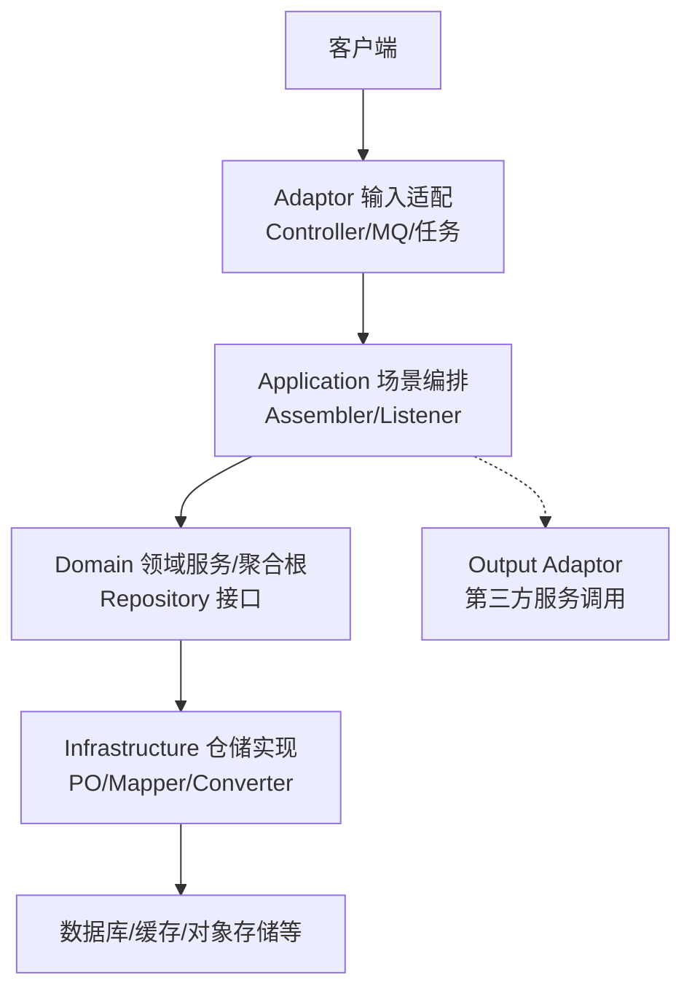
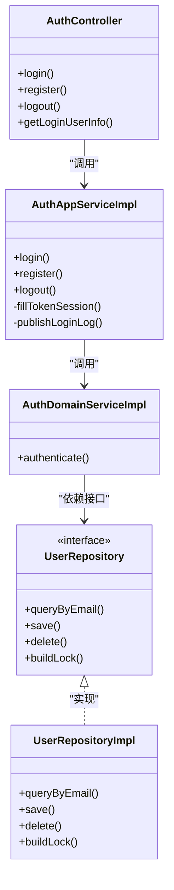
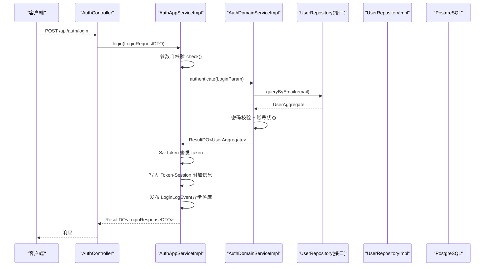
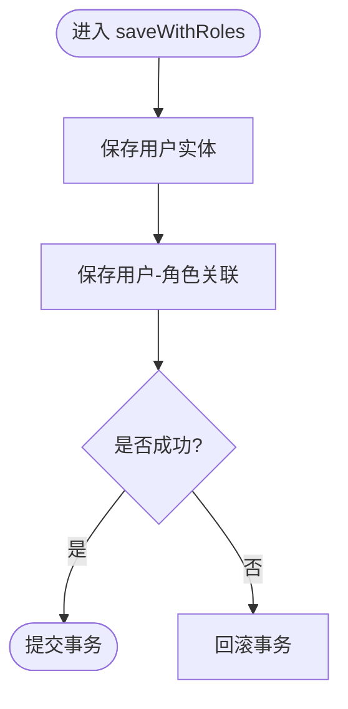
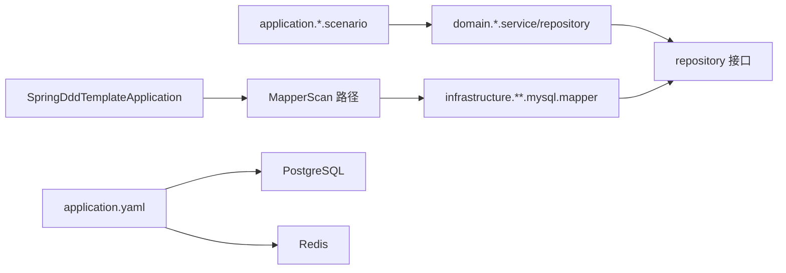

# 开发流程概述

<cite>
**本文引用的文件列表**
- [README.md](file://README.md)
- [pom.xml](file://pom.xml)
- [SpringDddTemplateApplication.java](file://src/main/java/com/sunnao/spring/ddd/template/SpringDddTemplateApplication.java)
- [application.yaml](file://src/main/resources/application.yaml)
- [application-prod.yaml](file://src/main/resources/application-prod.yaml)
- [docker-compose.yaml](file://docker-compose.yaml)
- [AuthController.java](file://src/main/java/com/sunnao/spring/ddd/template/adaptor/auth/input/AuthController.java)
- [AuthAppServiceImpl.java](file://src/main/java/com/sunnao/spring/ddd/template/application/auth/scenario/AuthAppServiceImpl.java)
- [AuthDomainServiceImpl.java](file://src/main/java/com/sunnao/spring/ddd/template/domain/auth/service/AuthDomainServiceImpl.java)
- [UserRepositoryImpl.java](file://src/main/java/com/sunnao/spring/ddd/template/infrastructure/system/user/repository/UserRepositoryImpl.java)
- [ddd-adaptor-layer.md](file://docs/rule/ddd/ddd-adaptor-layer.md)
- [ddd-model-layer.md](file://docs/rule/ddd/ddd-model-layer.md)
</cite>

## 目录
1. [引言](#引言)
2. [项目结构](#项目结构)
3. [核心组件](#核心组件)
4. [架构总览](#架构总览)
5. [详细组件分析](#详细组件分析)
6. [依赖关系分析](#依赖关系分析)
7. [性能与可观测性](#性能与可观测性)
8. [测试策略与验证](#测试策略与验证)
9. [代码规范与检查清单](#代码规范与检查清单)
10. [Git 工作流与发布流程](#git-工作流与发布流程)
11. [故障排查指南](#故障排查指南)
12. [结论](#结论)

## 引言
本文件面向“新功能开发”的完整生命周期，结合仓库中基于六边形架构（Hexagonal Architecture）的 DDD 落地实践，给出从需求到上线的标准流程、分层职责、数据流向、模板与检查清单，以及环境配置、代码规范与 Git 工作流建议。目标是让团队在一致的质量基线之上高效交付新功能。

## 项目结构
本项目采用六层分层：adaptor → application → domain → repository（接口）→ infrastructure（实现），并包含 client 对外接口定义与 model 共享模型。调用方向自外向内，领域层不依赖外部技术细节，通过仓储接口解耦持久化实现。

图示来源
- [README.md:19-36](file://README.md#L19-L36)
- [ddd-adaptor-layer.md:1-120](file://docs/rule/ddd/ddd-adaptor-layer.md#L1-L120)

章节来源
- [README.md:19-36](file://README.md#L19-L36)
- [ddd-adaptor-layer.md:1-120](file://docs/rule/ddd/ddd-adaptor-layer.md#L1-L120)

## 核心组件
- 启动入口与扫描范围：应用主类负责 Spring Boot 启动与 Mapper 扫描路径配置。
- 认证链路示例：Controller → AppService → DomainService → Repository 接口 → Infrastructure 实现 → 数据库。
- 基础设施能力：Flyway 迁移、Sa-Token 会话、Redis 分布式锁、全局异常处理、操作日志切面、TraceId 透传、异步事件。

章节来源
- [SpringDddTemplateApplication.java:7-13](file://src/main/java/com/sunnao/spring/ddd/template/SpringDddTemplateApplication.java#L7-L13)
- [AuthController.java:1-70](file://src/main/java/com/sunnao/spring/ddd/template/adaptor/auth/input/AuthController.java#L1-L70)
- [AuthAppServiceImpl.java:1-196](file://src/main/java/com/sunnao/spring/ddd/template/application/auth/scenario/AuthAppServiceImpl.java#L1-L196)
- [AuthDomainServiceImpl.java:1-58](file://src/main/java/com/sunnao/spring/ddd/template/domain/auth/service/AuthDomainServiceImpl.java#L1-L58)
- [UserRepositoryImpl.java:1-191](file://src/main/java/com/sunnao/spring/ddd/template/infrastructure/system/user/repository/UserRepositoryImpl.java#L1-L191)

## 架构总览
六边形架构在本项目的体现：
- 外层（Adaptor）仅做协议转换与参数校验，禁止业务逻辑。
- 应用层（Application）编排场景、组装 DTO、发布事件、协调跨域调用（Output Adaptor）。
- 领域层（Domain）承载业务规则与状态变更，通过仓储接口访问数据。
- 基础设施层（Infrastructure）提供仓储实现、PO 映射、外部系统接入。

图示来源
- [AuthController.java:1-70](file://src/main/java/com/sunnao/spring/ddd/template/adaptor/auth/input/AuthController.java#L1-L70)
- [AuthAppServiceImpl.java:1-196](file://src/main/java/com/sunnao/spring/ddd/template/application/auth/scenario/AuthAppServiceImpl.java#L1-L196)
- [AuthDomainServiceImpl.java:1-58](file://src/main/java/com/sunnao/spring/ddd/template/domain/auth/service/AuthDomainServiceImpl.java#L1-L58)
- [UserRepositoryImpl.java:1-191](file://src/main/java/com/sunnao/spring/ddd/template/infrastructure/system/user/repository/UserRepositoryImpl.java#L1-L191)

## 详细组件分析

### 认证登录序列（写模式）
该序列展示了从 HTTP 请求到领域认证与持久化的完整调用链，包括防爆破、事件发布与会话写入。

图示来源
- [AuthController.java:32-40](file://src/main/java/com/sunnao/spring/ddd/template/adaptor/auth/input/AuthController.java#L32-L40)
- [AuthAppServiceImpl.java:66-113](file://src/main/java/com/sunnao/spring/ddd/template/application/auth/scenario/AuthAppServiceImpl.java#L66-L113)
- [AuthDomainServiceImpl.java:29-56](file://src/main/java/com/sunnao/spring/ddd/template/domain/auth/service/AuthDomainServiceImpl.java#L29-L56)
- [UserRepositoryImpl.java:128-137](file://src/main/java/com/sunnao/spring/ddd/template/infrastructure/system/user/repository/UserRepositoryImpl.java#L128-L137)

章节来源
- [AuthController.java:1-70](file://src/main/java/com/sunnao/spring/ddd/template/adaptor/auth/input/AuthController.java#L1-L70)
- [AuthAppServiceImpl.java:1-196](file://src/main/java/com/sunnao/spring/ddd/template/application/auth/scenario/AuthAppServiceImpl.java#L1-L196)
- [AuthDomainServiceImpl.java:1-58](file://src/main/java/com/sunnao/spring/ddd/template/domain/auth/service/AuthDomainServiceImpl.java#L1-L58)
- [UserRepositoryImpl.java:1-191](file://src/main/java/com/sunnao/spring/ddd/template/infrastructure/system/user/repository/UserRepositoryImpl.java#L1-L191)

### 用户仓储实现要点（读/写/分页/事务）
- 查询：按条件构建 QueryWrapper，返回聚合根；分页查询封装为 PageImpl。
- 保存：新增回填 ID，更新时忽略创建信息；审计字段由全局监听器填充。
- 删除：记录操作人后逻辑删除；与角色关联清理在同一事务。
- 并发控制：暴露 buildLock 供领域服务使用。

图示来源
- [UserRepositoryImpl.java:119-125](file://src/main/java/com/sunnao/spring/ddd/template/infrastructure/system/user/repository/UserRepositoryImpl.java#L119-L125)

章节来源
- [UserRepositoryImpl.java:50-191](file://src/main/java/com/sunnao/spring/ddd/template/infrastructure/system/user/repository/UserRepositoryImpl.java#L50-L191)

### adaptor 层规范要点
- Input Adaptor 仅做参数接收与转换，调用 Application 层服务。
- Output Adaptor 用于跨领域或外部服务调用，接口定义以调用方业务语义为准。
- 四种开发模式（写/读/纯计算/规则+计算）在 adaptor 层的调用链不同，但均遵循防腐原则。

章节来源
- [ddd-adaptor-layer.md:1-120](file://docs/rule/ddd/ddd-adaptor-layer.md#L1-L120)

### model 层规范要点
- 存放跨模块共享枚举与通用概念。
- client 层禁止依赖 model 层，必须自包含 DTO，通过 Assembler 转换。

章节来源
- [ddd-model-layer.md:1-97](file://docs/rule/ddd/ddd-model-layer.md#L1-L97)

## 依赖关系分析
- 启动类扫描基础设施层 Mapper 包路径，确保 MyBatis-Flex 生效。
- 应用层依赖领域层接口与领域服务；领域层仅依赖仓储接口；基础设施层实现仓储接口并依赖 PO/Mapper。
- 配置文件集中管理数据库、Redis、Sa-Token、Flyway、springdoc 等。

图示来源
- [SpringDddTemplateApplication.java:7-8](file://src/main/java/com/sunnao/spring/ddd/template/SpringDddTemplateApplication.java#L7-L8)
- [application.yaml:9-36](file://src/main/resources/application.yaml#L9-L36)

章节来源
- [SpringDddTemplateApplication.java:7-13](file://src/main/java/com/sunnao/spring/ddd/template/SpringDddTemplateApplication.java#L7-L13)
- [application.yaml:1-88](file://src/main/resources/application.yaml#L1-L88)

## 性能与可观测性
- 分布式锁：支持 Redis 与 JVM 两级锁，默认 Redis，可通过配置切换。
- 异步事件：领域事件通过 Spring 异步监听器消费，避免阻塞主流程。
- TraceId：过滤器生成并透传到异步线程，便于全链路追踪。
- 操作日志：注解驱动，自动采集关键上下文与耗时。

章节来源
- [application.yaml:64-88](file://src/main/resources/application.yaml#L64-L88)
- [AuthAppServiceImpl.java:166-180](file://src/main/java/com/sunnao/spring/ddd/template/application/auth/scenario/AuthAppServiceImpl.java#L166-L180)

## 测试策略与验证
- 单元测试：聚焦领域层聚合根与领域服务，Mock 仓储，验证写模式流程与边界条件。
- 集成测试：需要真实 PostgreSQL 与 Redis，通过环境变量注入连接信息，缺失时自动跳过。
- 本地依赖：使用 docker-compose 一键拉起 Postgres 与 Redis，Flyway 自动建表与种子数据。

章节来源
- [README.md:129-146](file://README.md#L129-L146)
- [docker-compose.yaml:1-37](file://docker-compose.yaml#L1-L37)

## 代码规范与检查清单
- 分层职责
  - adaptor：仅协议转换与参数校验，禁止业务逻辑。
  - application：场景编排、Assembler 转换、事件发布、跨域协调。
  - domain：聚合根/实体承载业务规则，领域服务编排“锁 → 聚合根 → 持久化”。
  - infrastructure：仓储实现、PO 映射、外部系统接入。
- 结果与异常
  - 全链路统一返回 ResultDO，内部捕获异常并转错误码，不在方法签名抛异常。
- 入参与转换
  - RequestDTO 自校验（覆写 check），Assembler 负责 DTO 转换，Converter 负责 PO 转换。
- 写模式标准流程
  - 先获取锁，再加载/构建聚合根，执行业务方法，最后持久化并释放锁。
- 审计字段
  - PO 继承 BasePO，由全局监听器自动填充 createAt/updateAt/createBy/updateBy。
- 权限与安全
  - Sa-Token 鉴权注解按需标注；生产环境关闭 swagger-ui 与 api-docs。
- 依赖约束
  - client 层禁止依赖 model 层，保持对外契约自包含。

章节来源
- [README.md:37-46](file://README.md#L37-L46)
- [application-prod.yaml:1-7](file://src/main/resources/application-prod.yaml#L1-L7)
- [ddd-adaptor-layer.md:1-120](file://docs/rule/ddd/ddd-adaptor-layer.md#L1-L120)
- [ddd-model-layer.md:14-29](file://docs/rule/ddd/ddd-model-layer.md#L14-L29)

## Git 工作流与发布流程
- 分支策略
  - main：稳定版本，仅合并已评审通过的分支。
  - develop：集成分支，日常功能合并。
  - feature/*：按功能命名，独立开发，完成后发起 MR/PR。
  - hotfix/*：线上问题修复，快速回归后合并至 main 与 develop。
- 提交流程
  - 小步提交，提交信息清晰描述变更点与影响范围。
  - 提交前执行本地单测与基础集成用例。
  - 提交后触发 CI（编译、静态检查、单测、覆盖率阈值）。
- 代码审查
  - 至少一名同行评审，关注分层职责、依赖方向、异常处理、事务边界与并发安全。
- 发布流程
  - 预发环境验证通过后，灰度发布或滚动升级。
  - 生产环境关闭 swagger-ui 与 api-docs，确认 Flyway 迁移顺序与幂等性。
  - 发布后观察关键指标与日志，必要时回滚。

[本节为通用流程建议，未直接分析具体源码文件]

## 故障排查指南
- 登录失败
  - 检查防爆破限制是否命中；核对凭证与账号状态；查看登录日志事件是否异步落库成功。
- 权限不足
  - 检查 Sa-Token 配置与请求头携带；确认 RBAC 数据是否正确初始化。
- 数据库连接
  - 核对 application.yaml 中的 JDBC URL、用户名、密码；确认 Flyway 迁移脚本是否存在且可执行。
- 文件上传
  - 检查 multipart 大小限制与 app.file.max-size 一致性；本地存储路径或 S3 凭据是否正确。
- 分布式锁
  - 确认 Redis 连通性与锁类型配置；观察锁获取与释放日志。

章节来源
- [AuthAppServiceImpl.java:66-113](file://src/main/java/com/sunnao/spring/ddd/template/application/auth/scenario/AuthAppServiceImpl.java#L66-L113)
- [application.yaml:9-36](file://src/main/resources/application.yaml#L9-L36)
- [application.yaml:64-88](file://src/main/resources/application.yaml#L64-L88)

## 结论
通过六边形架构与 DDD 分层规范，本项目将业务与技术解耦，明确了各层职责与依赖方向，提供了标准化的开发模板与检查清单。配合完善的测试策略、可观测性与发布流程，可有效保障新功能开发的一致性与质量。建议在团队内推广本流程，并结合业务特性持续优化。