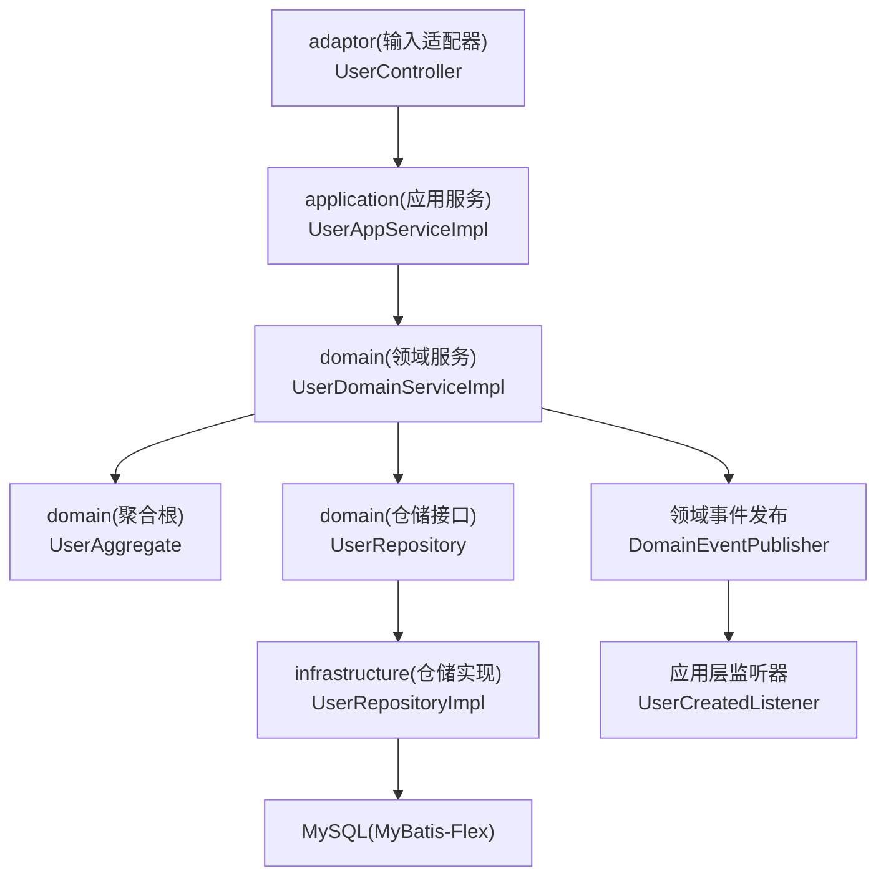
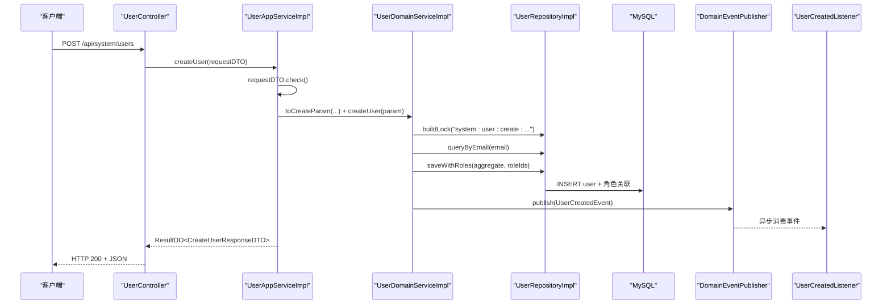
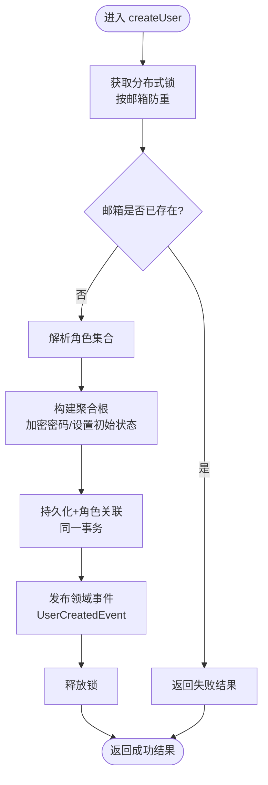
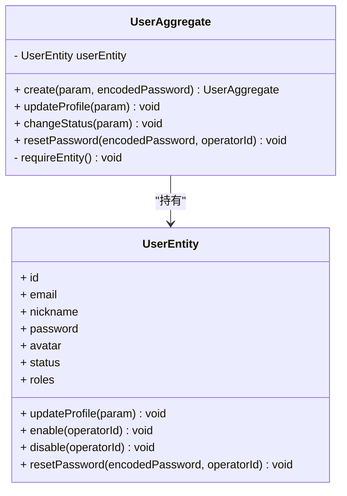
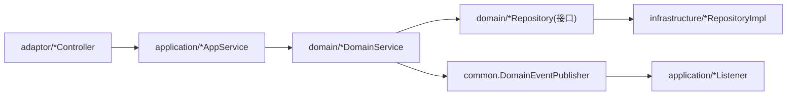

# 新功能开发流程

<cite>
**本文引用的文件**
- [README.md](file://README.md)
- [ddd-README.md](file://docs/rule/ddd/README.md)
- [ddd-adaptor-layer.md](file://docs/rule/ddd/ddd-adaptor-layer.md)
- [UserAggregate.java](file://src/main/java/com/sunnao/spring/ddd/template/domain/system/user/model/aggregate/UserAggregate.java)
- [UserDomainServiceImpl.java](file://src/main/java/com/sunnao/spring/ddd/template/domain/system/user/service/UserDomainServiceImpl.java)
- [UserRepositoryImpl.java](file://src/main/java/com/sunnao/spring/ddd/template/infrastructure/system/user/repository/UserRepositoryImpl.java)
- [UserAppServiceImpl.java](file://src/main/java/com/sunnao/spring/ddd/template/application/system/user/scenario/UserAppServiceImpl.java)
- [UserController.java](file://src/main/java/com/sunnao/spring/ddd/template/adaptor/system/user/input/UserController.java)
</cite>

## 目录
1. [引言](#引言)
2. [项目结构](#项目结构)
3. [核心组件](#核心组件)
4. [架构总览](#架构总览)
5. [详细组件分析](#详细组件分析)
6. [依赖关系分析](#依赖关系分析)
7. [性能与一致性考虑](#性能与一致性考虑)
8. [故障排查指南](#故障排查指南)
9. [结论](#结论)
10. [附录：从需求到实现的完整流程](#附录从需求到实现的完整流程)

## 引言
本文件面向希望在基于六边形架构的 Spring Boot DDD 项目中新增功能的团队，提供从需求分析、技术方案设计、数据库建模、领域建模到代码实现的全链路规范与实践。以“用户管理”模块为例，演示如何在 domain、infrastructure、application、adaptor 各层添加功能，并给出写模式标准化流程（分布式锁 → 聚合根加载 → 业务方法调用 → 数据持久化 → 锁释放）以及事件驱动开发模式（领域事件发布与监听）。同时提供单元测试与集成测试编写指南，包括 Mock 策略与测试数据准备建议。

## 项目结构
本项目遵循六边形架构，自外向内调用顺序为：adaptor(input) → application → domain → repository 接口（由 infrastructure 实现），并通过 adaptor(output) 对接外部系统。关键约定包括：
- ResultDO 全链路不抛异常，统一返回结果对象
- RequestDTO 自校验，AppService 不写校验逻辑
- Assembler/Converter 手写，分别负责 DTO↔Param、PO↔Aggregate 转换
- 写模式标准流程：领域服务先获取锁，再加载/构建聚合根，执行业务方法，持久化，finally 释放锁
- 审计字段自动填充（createAt/updateAt/createBy/updateBy）

图表来源
- [UserController.java](file://src/main/java/com/sunnao/spring/ddd/template/adaptor/system/user/input/UserController.java)
- [UserAppServiceImpl.java](file://src/main/java/com/sunnao/spring/ddd/template/application/system/user/scenario/UserAppServiceImpl.java)
- [UserDomainServiceImpl.java](file://src/main/java/com/sunnao/spring/ddd/template/domain/system/user/service/UserDomainServiceImpl.java)
- [UserAggregate.java](file://src/main/java/com/sunnao/spring/ddd/template/domain/system/user/model/aggregate/UserAggregate.java)
- [UserRepositoryImpl.java](file://src/main/java/com/sunnao/spring/ddd/template/infrastructure/system/user/repository/UserRepositoryImpl.java)

章节来源
- [README.md](file://README.md)
- [ddd-README.md](file://docs/rule/ddd/README.md)
- [ddd-adaptor-layer.md](file://docs/rule/ddd/ddd-adaptor-layer.md)

## 核心组件
- 聚合根 UserAggregate：封装用户创建、资料更新、状态变更、密码重置等核心行为，对外暴露业务方法，内部持有 UserEntity。
- 领域服务 UserDomainServiceImpl：承载写模式标准流程，协调锁、聚合根、仓储与事件发布。
- 仓储实现 UserRepositoryImpl：负责 PO 与 Aggregate 的技术转换、分页查询、事务性组合写入（如 saveWithRoles/deleteWithRoles）、锁构建。
- 应用服务 UserAppServiceImpl：场景编排，参数自校验、Assembler 转换、调用领域服务、组装响应，并在禁用/删除后踢出会话。
- 输入适配器 UserController：HTTP 入口，鉴权与操作日志注解，仅做参数装配与调用 AppService。

章节来源
- [UserAggregate.java](file://src/main/java/com/sunnao/spring/ddd/template/domain/system/user/model/aggregate/UserAggregate.java)
- [UserDomainServiceImpl.java](file://src/main/java/com/sunnao/spring/ddd/template/domain/system/user/service/UserDomainServiceImpl.java)
- [UserRepositoryImpl.java](file://src/main/java/com/sunnao/spring/ddd/template/infrastructure/system/user/repository/UserRepositoryImpl.java)
- [UserAppServiceImpl.java](file://src/main/java/com/sunnao/spring/ddd/template/application/system/user/scenario/UserAppServiceImpl.java)
- [UserController.java](file://src/main/java/com/sunnao/spring/ddd/template/adaptor/system/user/input/UserController.java)

## 架构总览
下图展示一次“创建用户”请求在系统中的流转路径，体现分层职责与事件驱动机制。

图表来源
- [UserController.java](file://src/main/java/com/sunnao/spring/ddd/template/adaptor/system/user/input/UserController.java)
- [UserAppServiceImpl.java](file://src/main/java/com/sunnao/spring/ddd/template/application/system/user/scenario/UserAppServiceImpl.java)
- [UserDomainServiceImpl.java](file://src/main/java/com/sunnao/spring/ddd/template/domain/system/user/service/UserDomainServiceImpl.java)
- [UserRepositoryImpl.java](file://src/main/java/com/sunnao/spring/ddd/template/infrastructure/system/user/repository/UserRepositoryImpl.java)

## 详细组件分析

### 写模式标准化流程（以“创建用户”为例）
- 分布式锁获取：按邮箱维度构建锁键，避免重复创建
- 聚合根加载/构建：唯一性校验通过后，加密密码并构建聚合根
- 业务方法调用：通过聚合根静态工厂或业务方法完成状态初始化
- 数据持久化：saveWithRoles 保证用户与角色关联在同一事务
- 锁释放：finally 中确保解锁
- 领域事件：成功后发布 UserCreatedEvent，异步落库登录日志等

图表来源
- [UserDomainServiceImpl.java](file://src/main/java/com/sunnao/spring/ddd/template/domain/system/user/service/UserDomainServiceImpl.java)
- [UserRepositoryImpl.java](file://src/main/java/com/sunnao/spring/ddd/template/infrastructure/system/user/repository/UserRepositoryImpl.java)

章节来源
- [UserDomainServiceImpl.java](file://src/main/java/com/sunnao/spring/ddd/template/domain/system/user/service/UserDomainServiceImpl.java)
- [UserRepositoryImpl.java](file://src/main/java/com/sunnao/spring/ddd/template/infrastructure/system/user/repository/UserRepositoryImpl.java)

### 领域模型与聚合根设计
- 聚合根 UserAggregate 仅暴露业务方法（创建、更新资料、变更状态、重置密码），内部持有 UserEntity，禁止直接修改实体属性
- 通过 requireEntity 等方法保障实体存在性与一致性
- 值对象与枚举（如用户状态）在领域层使用，保持领域语义清晰

图表来源
- [UserAggregate.java](file://src/main/java/com/sunnao/spring/ddd/template/domain/system/user/model/aggregate/UserAggregate.java)

章节来源
- [UserAggregate.java](file://src/main/java/com/sunnao/spring/ddd/template/domain/system/user/model/aggregate/UserAggregate.java)

### 基础设施层数据持久化实现
- UserRepositoryImpl 承担 PO 与 Aggregate 的纯技术转换，无业务逻辑
- 支持单条保存、分页查询、按条件查询、组合写入（用户+角色）与逻辑删除
- 通过 LockFactory.buildLock 暴露锁构建能力，供领域服务使用
- 审计字段由全局监听器自动填充，无需手动维护

章节来源
- [UserRepositoryImpl.java](file://src/main/java/com/sunnao/spring/ddd/template/infrastructure/system/user/repository/UserRepositoryImpl.java)

### 应用层场景编排
- UserAppServiceImpl 负责：
  - 参数自校验（RequestDTO.check）
  - DTO→Param 转换（Assembler）
  - 调用领域服务执行写操作
  - 组装响应 DTO
  - 在禁用/删除后调用 Sa-Token 强制下线用户会话（不影响主流程）

章节来源
- [UserAppServiceImpl.java](file://src/main/java/com/sunnao/spring/ddd/template/application/system/user/scenario/UserAppServiceImpl.java)

### 适配层 HTTP 接口定义
- UserController 作为 Input Adaptor：
  - 接收 HTTP 请求，装配参数
  - 标注权限点（Sa-Token）与操作日志（@OperLog）
  - 调用 AppService，不包含业务逻辑

章节来源
- [UserController.java](file://src/main/java/com/sunnao/spring/ddd/template/adaptor/system/user/input/UserController.java)

### 事件驱动开发模式
- 领域事件发布：UserDomainServiceImpl 在创建用户成功后发布 UserCreatedEvent
- 监听器实现：应用层监听器（如 UserCreatedListener）异步消费事件，进行后续处理（例如记录登录日志）
- 事件发布与监听解耦，提升扩展性与可观测性

章节来源
- [UserDomainServiceImpl.java](file://src/main/java/com/sunnao/spring/ddd/template/domain/system/user/service/UserDomainServiceImpl.java)

## 依赖关系分析
- 外层依赖内层：adaptor → application → domain；infrastructure 实现 domain 的 repository 接口
- 依赖倒置：application 定义对外部服务的接口（Output Adaptor），infrastructure 提供具体实现
- 事件解耦：领域服务通过 DomainEventPublisher 发布事件，监听器在应用层异步消费

图表来源
- [UserController.java](file://src/main/java/com/sunnao/spring/ddd/template/adaptor/system/user/input/UserController.java)
- [UserAppServiceImpl.java](file://src/main/java/com/sunnao/spring/ddd/template/application/system/user/scenario/UserAppServiceImpl.java)
- [UserDomainServiceImpl.java](file://src/main/java/com/sunnao/spring/ddd/template/domain/system/user/service/UserDomainServiceImpl.java)
- [UserRepositoryImpl.java](file://src/main/java/com/sunnao/spring/ddd/template/infrastructure/system/user/repository/UserRepositoryImpl.java)

章节来源
- [ddd-adaptor-layer.md](file://docs/rule/ddd/ddd-adaptor-layer.md)
- [ddd-README.md](file://docs/rule/ddd/README.md)

## 性能与一致性考虑
- 分布式锁粒度：按邮箱/用户ID等稳定标识构建锁键，避免热点冲突
- 事务边界：组合写入（如用户+角色）使用 @Transactional 保证原子性
- 异步事件：非关键路径操作（如日志记录）通过事件异步处理，降低主流程延迟
- 分页与查询：使用 MyBatis-Flex 分页与条件构造，减少无效数据传输
- 幂等与重试：对写接口结合锁与唯一性约束，避免重复提交导致的数据不一致

[本节为通用指导，不直接分析具体文件]

## 故障排查指南
- 锁相关：检查锁键是否合理、是否存在死锁风险；确认 finally 分支是否释放锁
- 事务回滚：组合写入失败时，确认 @Transactional 配置与传播级别
- 事件丢失：监听器异常不应影响主流程；关注异步线程池配置与错误日志
- 权限与鉴权：确认 Sa-Token 权限点配置与路由匹配
- 审计字段：确认全局监听器生效，操作人来自 CurrentUserContext

章节来源
- [UserDomainServiceImpl.java](file://src/main/java/com/sunnao/spring/ddd/template/domain/system/user/service/UserDomainServiceImpl.java)
- [UserRepositoryImpl.java](file://src/main/java/com/sunnao/spring/ddd/template/infrastructure/system/user/repository/UserRepositoryImpl.java)
- [UserAppServiceImpl.java](file://src/main/java/com/sunnao/spring/ddd/template/application/system/user/scenario/UserAppServiceImpl.java)

## 结论
通过统一的写模式流程、清晰的领域建模与分层职责划分，配合事件驱动与完善的测试策略，可以在该模板上高效、稳健地扩展新功能。以用户管理模块为例，展示了从 HTTP 入口到领域逻辑再到持久化的完整链路，可作为其他模块开发的参考范式。

[本节为总结，不直接分析具体文件]

## 附录：从需求到实现的完整流程

### 阶段一：需求分析与评审
- 明确业务目标与边界，识别核心用例与关键规则
- 输出需求清单与验收标准，评估复杂度与风险

### 阶段二：技术方案设计
- 选择开发模式（写/读/规则+计算/纯计算）
- 确定跨域协作点与外部依赖，规划 Output Adaptor 接口
- 设计事件边界与监听器职责

### 阶段三：数据库建模
- 根据领域概念设计表结构，包含审计字段与逻辑删除列
- 使用 Flyway 迁移脚本管理版本演进

### 阶段四：领域建模
- 定义聚合根与实体，将业务规则内聚到聚合根/实体方法
- 定义领域服务编排复杂流程，仓储接口声明数据访问契约

### 阶段五：基础设施实现
- 实现 Repository 接口，完成 PO 与 Aggregate 的转换
- 配置锁、事务、分页与查询条件构造

### 阶段六：应用层编排
- 实现 AppService：参数自校验、Assembler 转换、调用领域服务、组装响应
- 在必要时编排外部服务调用（Output Adaptor）

### 阶段七：适配层接入
- 定义 Controller：鉴权、操作日志、参数装配
- 暴露 REST API，统一返回 ResultDO

### 阶段八：事件驱动落地
- 在合适时机发布领域事件
- 实现监听器异步处理副作用（如日志、通知）

### 阶段九：测试策略
- 单元测试：聚焦聚合根业务规则与领域服务流程，Mock 仓储与外部依赖
- 集成测试：启动真实数据库与 Redis，验证端到端流程；缺失环境时跳过
- 测试数据准备：使用种子数据与独立测试库，避免污染生产数据

章节来源
- [README.md](file://README.md)
- [ddd-README.md](file://docs/rule/ddd/README.md)
- [ddd-adaptor-layer.md](file://docs/rule/ddd/ddd-adaptor-layer.md)