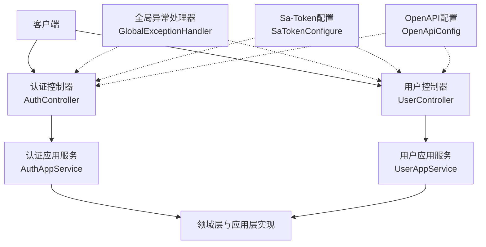
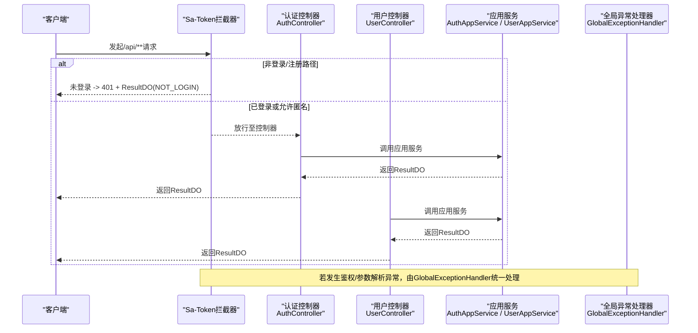
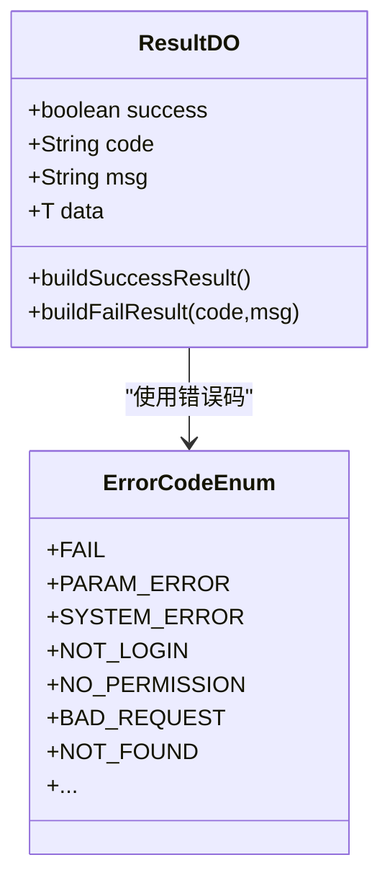
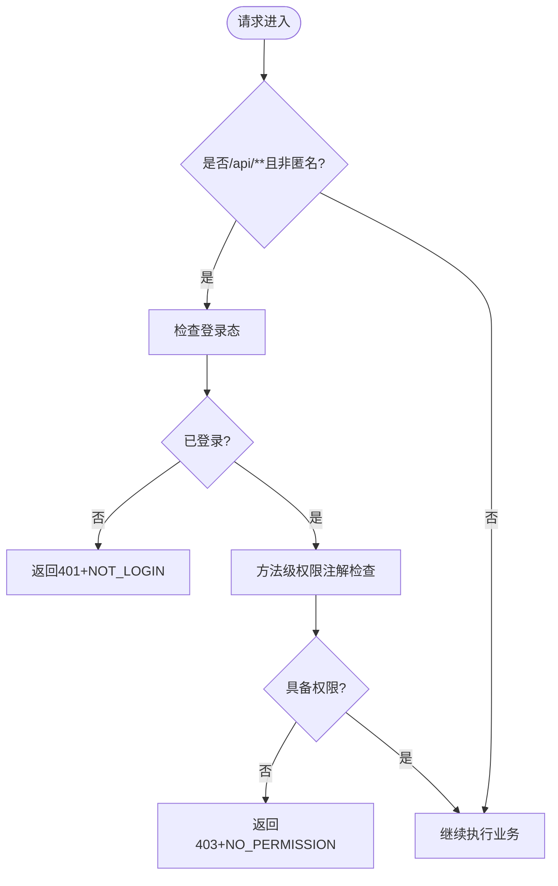
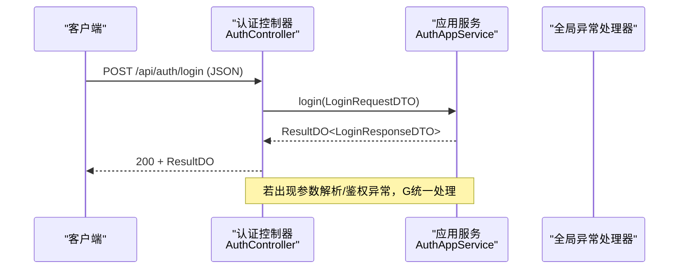
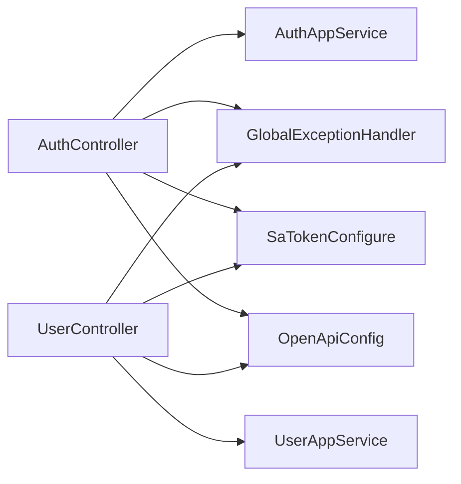

# HTTP控制器开发

<cite>
**本文引用的文件**   
- [UserController.java](file://src/main/java/com/sunnao/spring/ddd/template/adaptor/system/user/input/UserController.java)
- [AuthController.java](file://src/main/java/com/sunnao/spring/ddd/template/adaptor/auth/input/AuthController.java)
- [ResultDO.java](file://src/main/java/com/sunnao/spring/ddd/template/common/result/ResultDO.java)
- [ErrorCodeEnum.java](file://src/main/java/com/sunnao/spring/ddd/template/common/result/ErrorCodeEnum.java)
- [GlobalExceptionHandler.java](file://src/main/java/com/sunnao/spring/ddd/template/adaptor/common/GlobalExceptionHandler.java)
- [SaTokenConfigure.java](file://src/main/java/com/sunnao/spring/ddd/template/common/config/SaTokenConfigure.java)
- [OpenApiConfig.java](file://src/main/java/com/sunnao/spring/ddd/template/common/config/OpenApiConfig.java)
- [UserAppService.java](file://src/main/java/com/sunnao/spring/ddd/template/client/system/user/UserAppService.java)
- [AuthAppService.java](file://src/main/java/com/sunnao/spring/ddd/template/client/auth/AuthAppService.java)
</cite>

## 目录
1. [简介](#简介)
2. [项目结构](#项目结构)
3. [核心组件](#核心组件)
4. [架构总览](#架构总览)
5. [详细组件分析](#详细组件分析)
6. [依赖关系分析](#依赖关系分析)
7. [性能与优化建议](#性能与优化建议)
8. [故障排查指南](#故障排查指南)
9. [结论](#结论)
10. [附录](#附录)

## 简介
本指南面向HTTP控制器的开发与规范制定，基于项目中UserController与AuthController的实际实现，系统阐述RESTful API设计模式、请求参数绑定、统一响应封装、权限控制集成、Swagger文档注解使用，以及参数校验、数据转换、性能优化等实践要点。目标是帮助开发者快速上手并遵循统一的工程规范，保证接口风格一致、可维护性与可观测性良好。

## 项目结构
本项目采用分层架构（Adaptor/Client/Application/Domain/Infrastructure），控制器位于adaptor层，作为输入适配层，仅负责接收HTTP请求、参数转换与调用应用服务，不包含业务逻辑。认证与用户管理相关控制器分别位于auth与system/user子包下。

图表来源
- [AuthController.java:1-70](file://src/main/java/com/sunnao/spring/ddd/template/adaptor/auth/input/AuthController.java#L1-L70)
- [UserController.java:1-115](file://src/main/java/com/sunnao/spring/ddd/template/adaptor/system/user/input/UserController.java#L1-L115)
- [AuthAppService.java:1-39](file://src/main/java/com/sunnao/spring/ddd/template/client/auth/AuthAppService.java#L1-L39)
- [UserAppService.java:1-52](file://src/main/java/com/sunnao/spring/ddd/template/client/system/user/UserAppService.java#L1-L52)
- [GlobalExceptionHandler.java:1-98](file://src/main/java/com/sunnao/spring/ddd/template/adaptor/common/GlobalExceptionHandler.java#L1-L98)
- [SaTokenConfigure.java:1-31](file://src/main/java/com/sunnao/spring/ddd/template/common/config/SaTokenConfigure.java#L1-L31)
- [OpenApiConfig.java:1-42](file://src/main/java/com/sunnao/spring/ddd/template/common/config/OpenApiConfig.java#L1-L42)

章节来源
- [AuthController.java:1-70](file://src/main/java/com/sunnao/spring/ddd/template/adaptor/auth/input/AuthController.java#L1-L70)
- [UserController.java:1-115](file://src/main/java/com/sunnao/spring/ddd/template/adaptor/system/user/input/UserController.java#L1-L115)

## 核心组件
- 统一结果对象ResultDO：所有层方法通过ResultDO封装返回值与错误码，禁止向调用方直接抛出异常；提供成功/失败构建方法，便于上层统一处理。
- 错误码枚举ErrorCodeEnum：集中定义错误码与默认文案，避免散落字符串字面量。
- 全局异常处理器GlobalExceptionHandler：兜住进入Controller之前（如鉴权、参数反序列化）以及未捕获异常，统一转换为ResultDO并返回合适的HTTP状态码。
- 权限控制SaTokenConfigure：除登录/注册外，/api/**全部要求登录态；同时启用注解鉴权（@SaCheckPermission等）。
- OpenAPI配置OpenApiConfig：定义文档元信息与安全方案，使Swagger UI支持按头携带token进行调试。

章节来源
- [ResultDO.java:1-110](file://src/main/java/com/sunnao/spring/ddd/template/common/result/ResultDO.java#L1-L110)
- [ErrorCodeEnum.java:1-209](file://src/main/java/com/sunnao/spring/ddd/template/common/result/ErrorCodeEnum.java#L1-L209)
- [GlobalExceptionHandler.java:1-98](file://src/main/java/com/sunnao/spring/ddd/template/adaptor/common/GlobalExceptionHandler.java#L1-L98)
- [SaTokenConfigure.java:1-31](file://src/main/java/com/sunnao/spring/ddd/template/common/config/SaTokenConfigure.java#L1-L31)
- [OpenApiConfig.java:1-42](file://src/main/java/com/sunnao/spring/ddd/template/common/config/OpenApiConfig.java#L1-L42)

## 架构总览
下图展示了从HTTP请求到应用服务的典型调用链，以及异常与权限控制的拦截点。

图表来源
- [SaTokenConfigure.java:1-31](file://src/main/java/com/sunnao/spring/ddd/template/common/config/SaTokenConfigure.java#L1-L31)
- [AuthController.java:1-70](file://src/main/java/com/sunnao/spring/ddd/template/adaptor/auth/input/AuthController.java#L1-L70)
- [UserController.java:1-115](file://src/main/java/com/sunnao/spring/ddd/template/adaptor/system/user/input/UserController.java#L1-L115)
- [AuthAppService.java:1-39](file://src/main/java/com/sunnao/spring/ddd/template/client/auth/AuthAppService.java#L1-L39)
- [UserAppService.java:1-52](file://src/main/java/com/sunnao/spring/ddd/template/client/system/user/UserAppService.java#L1-L52)
- [GlobalExceptionHandler.java:1-98](file://src/main/java/com/sunnao/spring/ddd/template/adaptor/common/GlobalExceptionHandler.java#L1-L98)

## 详细组件分析

### RESTful API设计规范
- URL路径规范
  - 资源名词复数形式，层级清晰，例如/api/system/users、/api/auth。
  - 子资源使用路径段表示，例如变更状态使用/{id}/status。
- HTTP方法选择
  - POST用于创建资源（/api/system/users）。
  - PUT用于更新资源（/{id}）。
  - DELETE用于删除资源（/{id}）。
  - GET用于查询详情与分页列表（/{id}、/page）。
- 状态码使用
  - 正常业务成功：HTTP 200，响应体为ResultDO.success=true。
  - 未登录：HTTP 401，ResultDO.code=NOT_LOGIN。
  - 无权限：HTTP 403，ResultDO.code=NO_PERMISSION。
  - 参数不合法/类型不匹配：HTTP 400，ResultDO.code=BAD_REQUEST。
  - 资源不存在：HTTP 404，ResultDO.code=NOT_FOUND。
  - 系统异常：HTTP 500，ResultDO.code=SYSTEM_ERROR。

章节来源
- [UserController.java:21-114](file://src/main/java/com/sunnao/spring/ddd/template/adaptor/system/user/input/UserController.java#L21-L114)
- [AuthController.java:21-69](file://src/main/java/com/sunnao/spring/ddd/template/adaptor/auth/input/AuthController.java#L21-L69)
- [GlobalExceptionHandler.java:28-96](file://src/main/java/com/sunnao/spring/ddd/template/adaptor/common/GlobalExceptionHandler.java#L28-L96)

### 请求参数绑定机制
- @RequestBody
  - 适用场景：复杂JSON对象入参，如登录、注册、创建/更新用户等。
  - 最佳实践：DTO字段命名与前端保持一致；对必填字段在DTO层配合校验注解；避免将PO实体直接暴露给HTTP层。
- @PathVariable
  - 适用场景：URL路径中的资源标识，如/{id}。
  - 最佳实践：明确指定名称，保持语义化；结合应用层RequestDTO的ID字段进行赋值。
- @RequestParam
  - 适用场景：简单查询参数，如分页pageNum、pageSize及筛选条件email、nickname、status。
  - 最佳实践：设置required=false与defaultValue，提升健壮性；必要时在DTO层做范围与格式校验。

章节来源
- [AuthController.java:35-68](file://src/main/java/com/sunnao/spring/ddd/template/adaptor/auth/input/AuthController.java#L35-L68)
- [UserController.java:35-113](file://src/main/java/com/sunnao/spring/ddd/template/adaptor/system/user/input/UserController.java#L35-L113)

### 响应格式的统一封装
- ResultDO设计模式
  - 字段包含success、code、msg、data，提供静态构建方法简化成功/失败构造。
  - 各层方法统一返回ResultDO，禁止直接抛异常给调用方，确保对外一致性。
- 错误处理策略
  - 业务异常在各层手动catch并转为ResultDO.buildFailResult(...)。
  - 全局异常处理器兜底处理鉴权、参数解析、资源不存在与未知异常，映射到合适HTTP状态码与错误码。

图表来源
- [ResultDO.java:1-110](file://src/main/java/com/sunnao/spring/ddd/template/common/result/ResultDO.java#L1-L110)
- [ErrorCodeEnum.java:1-209](file://src/main/java/com/sunnao/spring/ddd/template/common/result/ErrorCodeEnum.java#L1-L209)

章节来源
- [ResultDO.java:1-110](file://src/main/java/com/sunnao/spring/ddd/template/common/result/ResultDO.java#L1-L110)
- [ErrorCodeEnum.java:1-209](file://src/main/java/com/sunnao/spring/ddd/template/common/result/ErrorCodeEnum.java#L1-L209)
- [GlobalExceptionHandler.java:28-96](file://src/main/java/com/sunnao/spring/ddd/template/adaptor/common/GlobalExceptionHandler.java#L28-L96)

### 权限控制集成（Sa-Token）
- 路由拦截
  - 除/api/auth/**与OpenAPI路径外，/api/**均需登录态。
- 注解鉴权
  - 在Controller方法上使用@SaCheckPermission("system:user:read|write")等，细粒度控制读/写权限。
- 安全方案
  - OpenAPI配置中声明sa-token头，Swagger UI可通过Authorize填入token进行调试。

图表来源
- [SaTokenConfigure.java:17-30](file://src/main/java/com/sunnao/spring/ddd/template/common/config/SaTokenConfigure.java#L17-L30)
- [UserController.java:35-113](file://src/main/java/com/sunnao/spring/ddd/template/adaptor/system/user/input/UserController.java#L35-L113)
- [OpenApiConfig.java:26-41](file://src/main/java/com/sunnao/spring/ddd/template/common/config/OpenApiConfig.java#L26-L41)

章节来源
- [SaTokenConfigure.java:1-31](file://src/main/java/com/sunnao/spring/ddd/template/common/config/SaTokenConfigure.java#L1-L31)
- [UserController.java:35-113](file://src/main/java/com/sunnao/spring/ddd/template/adaptor/system/user/input/UserController.java#L35-L113)
- [OpenApiConfig.java:1-42](file://src/main/java/com/sunnao/spring/ddd/template/common/config/OpenApiConfig.java#L1-L42)

### Swagger文档注解使用
- @Tag
  - 在类级别标注分组名称与描述，如“用户管理”、“认证”。
- @Operation
  - 在方法级别标注摘要与描述，便于生成接口说明。
- 安全方案
  - OpenApiConfig中定义APIKEY方式的安全方案，头名为sa-token，与Sa-Token配置保持一致。

章节来源
- [UserController.java:21-113](file://src/main/java/com/sunnao/spring/ddd/template/adaptor/system/user/input/UserController.java#L21-L113)
- [AuthController.java:21-68](file://src/main/java/com/sunnao/spring/ddd/template/adaptor/auth/input/AuthController.java#L21-L68)
- [OpenApiConfig.java:18-41](file://src/main/java/com/sunnao/spring/ddd/template/common/config/OpenApiConfig.java#L18-L41)

### 关键流程时序图（以登录为例）

图表来源
- [AuthController.java:35-40](file://src/main/java/com/sunnao/spring/ddd/template/adaptor/auth/input/AuthController.java#L35-L40)
- [AuthAppService.java:16-22](file://src/main/java/com/sunnao/spring/ddd/template/client/auth/AuthAppService.java#L16-L22)
- [GlobalExceptionHandler.java:58-76](file://src/main/java/com/sunnao/spring/ddd/template/adaptor/common/GlobalExceptionHandler.java#L58-L76)

## 依赖关系分析
- 控制器依赖应用服务接口，解耦具体实现，便于测试与替换。
- 全局异常处理器与权限拦截器横切关注点，降低控制器代码复杂度。
- OpenAPI配置与Sa-Token配置共同保障文档与鉴权的可用性。

图表来源
- [AuthController.java:1-70](file://src/main/java/com/sunnao/spring/ddd/template/adaptor/auth/input/AuthController.java#L1-L70)
- [UserController.java:1-115](file://src/main/java/com/sunnao/spring/ddd/template/adaptor/system/user/input/UserController.java#L1-L115)
- [AuthAppService.java:1-39](file://src/main/java/com/sunnao/spring/ddd/template/client/auth/AuthAppService.java#L1-L39)
- [UserAppService.java:1-52](file://src/main/java/com/sunnao/spring/ddd/template/client/system/user/UserAppService.java#L1-L52)
- [GlobalExceptionHandler.java:1-98](file://src/main/java/com/sunnao/spring/ddd/template/adaptor/common/GlobalExceptionHandler.java#L1-L98)
- [SaTokenConfigure.java:1-31](file://src/main/java/com/sunnao/spring/ddd/template/common/config/SaTokenConfigure.java#L1-L31)
- [OpenApiConfig.java:1-42](file://src/main/java/com/sunnao/spring/ddd/template/common/config/OpenApiConfig.java#L1-L42)

章节来源
- [AuthController.java:1-70](file://src/main/java/com/sunnao/spring/ddd/template/adaptor/auth/input/AuthController.java#L1-L70)
- [UserController.java:1-115](file://src/main/java/com/sunnao/spring/ddd/template/adaptor/system/user/input/UserController.java#L1-L115)

## 性能与优化建议
- 减少不必要的对象拷贝：在Controller中将@PathVariable值直接注入到RequestDTO，避免中间变量。
- 分页参数校验：在DTO层增加范围校验（如pageSize上限），防止过大分页导致数据库压力。
- 缓存热点数据：字典、角色、权限等低频变更数据可在应用层引入缓存，降低重复查询开销。
- 异步日志与审计：操作日志记录建议使用异步队列，避免阻塞主流程。
- 连接池与线程池：合理配置数据库连接池与异步线程池大小，监控慢SQL与线程池饱和情况。

[本节为通用指导，无需源码引用]

## 故障排查指南
- 未登录访问被拦截
  - 现象：返回401与NOT_LOGIN。
  - 排查：确认请求头是否携带sa-token；检查SaTokenConfigure的路径放行规则。
- 权限不足
  - 现象：返回403与NO_PERMISSION。
  - 排查：核对@SaCheckPermission的权限点是否与后端权限模型一致。
- 请求体解析失败
  - 现象：返回400与BAD_REQUEST。
  - 排查：检查JSON格式与字段类型；确认DTO字段名与前端一致。
- 参数类型不匹配
  - 现象：返回400与BAD_REQUEST。
  - 排查：检查@RequestParam/@PathVariable的类型与传值；必要时在DTO层增加校验注解。
- 资源不存在
  - 现象：返回404与NOT_FOUND。
  - 排查：确认URL路径是否正确；检查是否存在软删除或数据迁移问题。
- 系统异常
  - 现象：返回500与SYSTEM_ERROR。
  - 排查：查看服务端日志堆栈；定位异常源头并修复。

章节来源
- [GlobalExceptionHandler.java:28-96](file://src/main/java/com/sunnao/spring/ddd/template/adaptor/common/GlobalExceptionHandler.java#L28-L96)
- [SaTokenConfigure.java:17-30](file://src/main/java/com/sunnao/spring/ddd/template/common/config/SaTokenConfigure.java#L17-L30)

## 结论
通过统一的ResultDO封装、集中的错误码管理、Sa-Token的注解式鉴权与OpenAPI的安全方案配置，本项目实现了高内聚、低耦合的HTTP控制器开发范式。遵循本文的RESTful规范、参数绑定与异常处理策略，可有效提升接口质量与团队协作效率。

[本节为总结性内容，无需源码引用]

## 附录
- 常用注解速查
  - @RestController、@RequestMapping、@PostMapping、@PutMapping、@DeleteMapping、@GetMapping
  - @RequestBody、@PathVariable、@RequestParam
  - @SaCheckPermission、@Operation、@Tag
- 参考路径
  - 用户管理控制器：[UserController.java](file://src/main/java/com/sunnao/spring/ddd/template/adaptor/system/user/input/UserController.java)
  - 认证控制器：[AuthController.java](file://src/main/java/com/sunnao/spring/ddd/template/adaptor/auth/input/AuthController.java)
  - 统一结果对象：[ResultDO.java](file://src/main/java/com/sunnao/spring/ddd/template/common/result/ResultDO.java)
  - 错误码枚举：[ErrorCodeEnum.java](file://src/main/java/com/sunnao/spring/ddd/template/common/result/ErrorCodeEnum.java)
  - 全局异常处理器：[GlobalExceptionHandler.java](file://src/main/java/com/sunnao/spring/ddd/template/adaptor/common/GlobalExceptionHandler.java)
  - Sa-Token配置：[SaTokenConfigure.java](file://src/main/java/com/sunnao/spring/ddd/template/common/config/SaTokenConfigure.java)
  - OpenAPI配置：[OpenApiConfig.java](file://src/main/java/com/sunnao/spring/ddd/template/common/config/OpenApiConfig.java)
  - 应用服务接口：[UserAppService.java](file://src/main/java/com/sunnao/spring/ddd/template/client/system/user/UserAppService.java)、[AuthAppService.java](file://src/main/java/com/sunnao/spring/ddd/template/client/auth/AuthAppService.java)