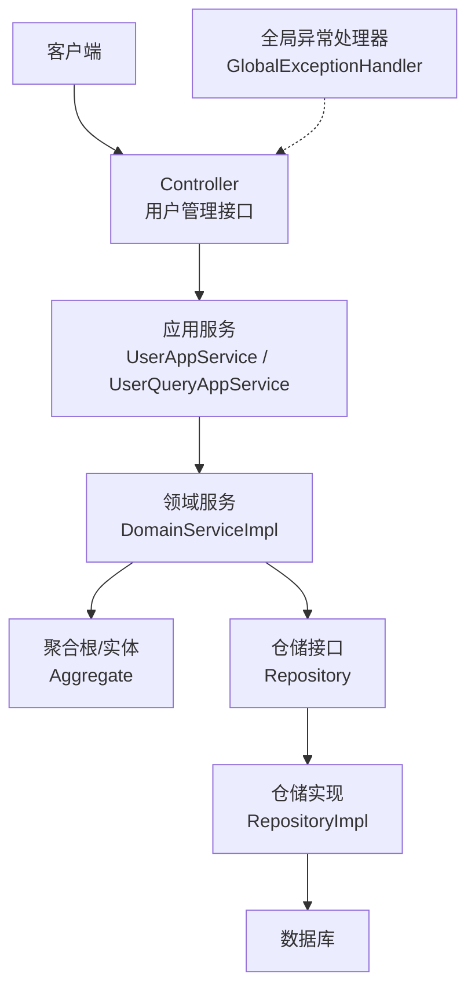
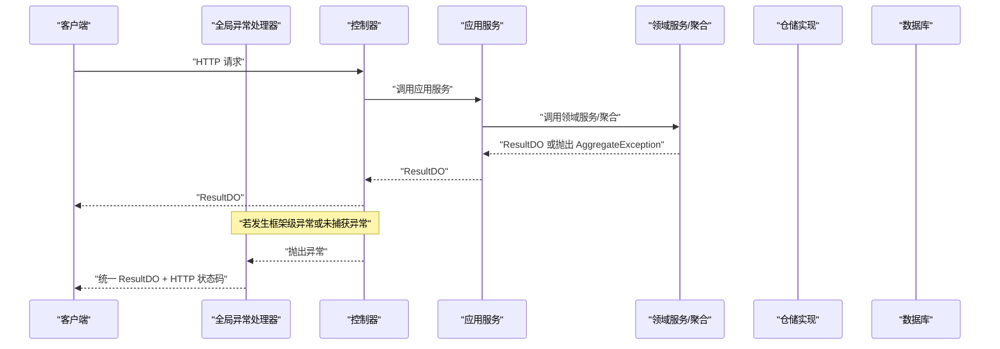
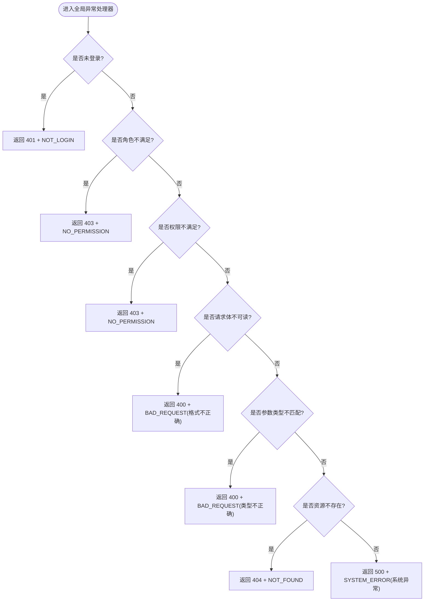
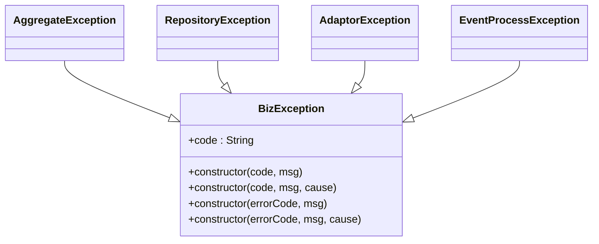
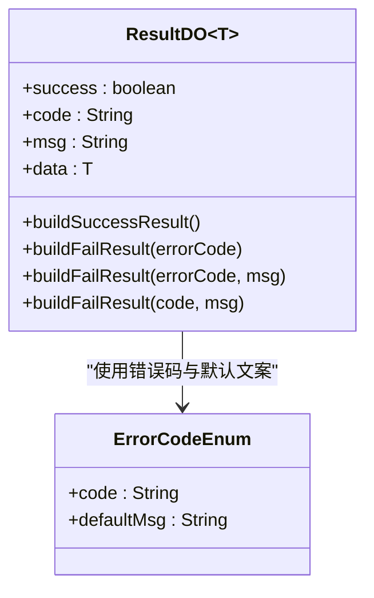
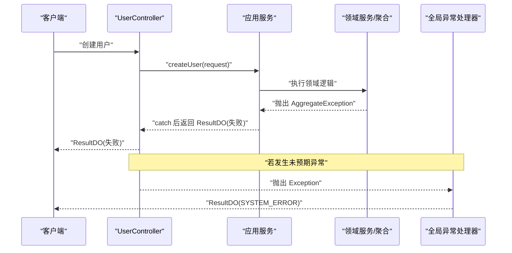
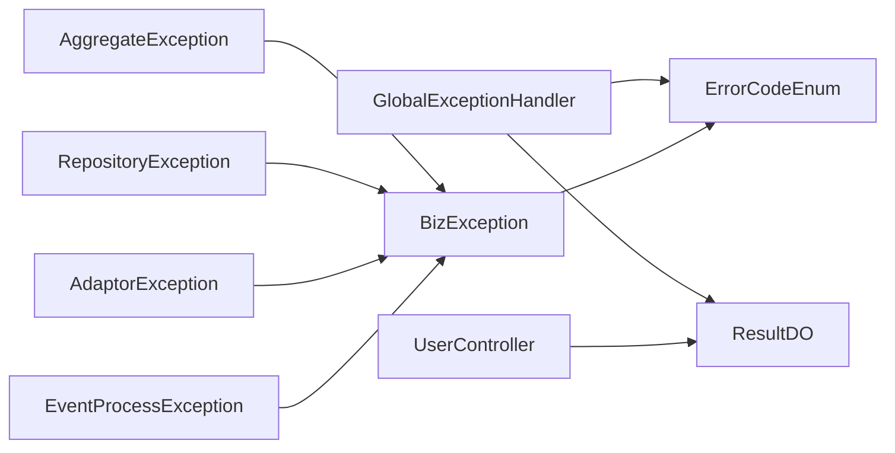

# 全局异常处理

<cite>
**本文引用的文件**   
- [GlobalExceptionHandler.java](file://src/main/java/com/sunnao/spring/ddd/template/adaptor/common/GlobalExceptionHandler.java)
- [BizException.java](file://src/main/java/com/sunnao/spring/ddd/template/common/exception/BizException.java)
- [AggregateException.java](file://src/main/java/com/sunnao/spring/ddd/template/common/exception/AggregateException.java)
- [RepositoryException.java](file://src/main/java/com/sunnao/spring/ddd/template/common/exception/RepositoryException.java)
- [AdaptorException.java](file://src/main/java/com/sunnao/spring/ddd/template/common/exception/AdaptorException.java)
- [EventProcessException.java](file://src/main/java/com/sunnao/spring/ddd/template/common/exception/EventProcessException.java)
- [ErrorCodeEnum.java](file://src/main/java/com/sunnao/spring/ddd/template/common/result/ErrorCodeEnum.java)
- [ResultDO.java](file://src/main/java/com/sunnao/spring/ddd/template/common/result/ResultDO.java)
- [UserController.java](file://src/main/java/com/sunnao/spring/ddd/template/adaptor/system/user/input/UserController.java)
- [DictDataAggregate.java](file://src/main/java/com/sunnao/spring/ddd/template/domain/system/dict/model/aggregate/DictDataAggregate.java)
- [FileAggregate.java](file://src/main/java/com/sunnao/spring/ddd/template/domain/system/file/model/aggregate/FileAggregate.java)
</cite>

## 目录
1. [简介](#简介)
2. [项目结构](#项目结构)
3. [核心组件](#核心组件)
4. [架构总览](#架构总览)
5. [详细组件分析](#详细组件分析)
6. [依赖关系分析](#依赖关系分析)
7. [性能与可观测性](#性能与可观测性)
8. [故障排查指南](#故障排查指南)
9. [最佳实践](#最佳实践)
10. [结论](#结论)

## 简介
本指南围绕 Spring Boot 的全局异常处理机制，结合仓库中的 GlobalExceptionHandler、统一错误码 ErrorCodeEnum、统一响应 ResultDO 以及分层异常体系（BizException、AggregateException、RepositoryException 等），系统化阐述异常分类、处理流程、错误响应封装、日志记录与生产策略。文档同时提供常见场景示例与排障建议，帮助开发者在 DDD 分层架构下构建一致、稳定、可观测的错误处理方案。

## 项目结构
本项目采用 DDD 分层组织代码，异常处理相关的关键位置如下：
- 适配层（Adaptor）：全局异常处理器集中定义，拦截框架级异常与安全鉴权异常，并统一转换为标准响应体。
- 通用层（Common）：统一结果对象 ResultDO、统一错误码枚举 ErrorCodeEnum、业务异常基类 BizException 及其领域/仓储/事件/适配器等派生异常。
- 领域层（Domain）：聚合根与实体校验失败抛出 AggregateException，由上层应用服务捕获并转换为 ResultDO。
- 基础设施层（Infrastructure）：持久化异常包装为 RepositoryException，由应用层捕获并转换。
- 控制器（Controller）：仅做参数转换与调用应用服务，正常路径返回 ResultDO；异常由全局处理器兜底。

图表来源
- [GlobalExceptionHandler.java:1-98](file://src/main/java/com/sunnao/spring/ddd/template/adaptor/common/GlobalExceptionHandler.java#L1-L98)
- [UserController.java:1-115](file://src/main/java/com/sunnao/spring/ddd/template/adaptor/system/user/input/UserController.java#L1-L115)

章节来源
- [GlobalExceptionHandler.java:1-98](file://src/main/java/com/sunnao/spring/ddd/template/adaptor/common/GlobalExceptionHandler.java#L1-L98)
- [UserController.java:1-115](file://src/main/java/com/sunnao/spring/ddd/template/adaptor/system/user/input/UserController.java#L1-L115)

## 核心组件
- 全局异常处理器：负责拦截未登录、无权限、请求解析错误、资源不存在及未预期系统异常，统一输出 ResultDO。
- 统一错误码：集中定义所有错误码与默认文案，禁止散落字符串字面量。
- 统一响应体：封装成功/失败状态、错误码、消息与数据，各层方法通过 ResultDO 传递结果。
- 异常分类体系：BizException 作为业务异常基类，AggregateException、RepositoryException、AdaptorException、EventProcessException 分别对应领域、仓储、适配器、事件处理等场景。

章节来源
- [GlobalExceptionHandler.java:1-98](file://src/main/java/com/sunnao/spring/ddd/template/adaptor/common/GlobalExceptionHandler.java#L1-L98)
- [ErrorCodeEnum.java:1-209](file://src/main/java/com/sunnao/spring/ddd/template/common/result/ErrorCodeEnum.java#L1-L209)
- [ResultDO.java:1-110](file://src/main/java/com/sunnao/spring/ddd/template/common/result/ResultDO.java#L1-L110)
- [BizException.java:1-28](file://src/main/java/com/sunnao/spring/ddd/template/common/exception/BizException.java#L1-L28)
- [AggregateException.java:1-22](file://src/main/java/com/sunnao/spring/ddd/template/common/exception/AggregateException.java#L1-L22)
- [RepositoryException.java:1-22](file://src/main/java/com/sunnao/spring/ddd/template/common/exception/RepositoryException.java#L1-L22)
- [AdaptorException.java:1-22](file://src/main/java/com/sunnao/spring/ddd/template/common/exception/AdaptorException.java#L1-L22)
- [EventProcessException.java:1-22](file://src/main/java/com/sunnao/spring/ddd/template/common/exception/EventProcessException.java#L1-L22)

## 架构总览
全局异常处理遵循“最后防线”原则：正常业务流程在各层手动 catch 并转换为 ResultDO，不会走到全局处理器；全局处理器只兜住进入 Controller 之前（如 Sa-Token 鉴权、参数反序列化）以及漏网的未捕获异常，统一转换为 ResultDO，不向客户端外泄堆栈。

图表来源
- [GlobalExceptionHandler.java:1-98](file://src/main/java/com/sunnao/spring/ddd/template/adaptor/common/GlobalExceptionHandler.java#L1-L98)
- [UserController.java:1-115](file://src/main/java/com/sunnao/spring/ddd/template/adaptor/system/user/input/UserController.java#L1-L115)

## 详细组件分析

### 全局异常处理器设计
- 安全鉴权异常：未登录、角色不满足、权限不满足，分别映射到 401/403 与 NOT_LOGIN/NO_PERMISSION。
- 请求解析异常：JSON 不可读、参数类型不匹配，映射到 400 与 BAD_REQUEST，附带更具体的提示。
- 资源不存在：NoResourceFoundException 映射到 404 与 NOT_FOUND。
- 兜底异常：Exception 捕获未预期系统异常，记录错误日志，返回 SYSTEM_ERROR。

图表来源
- [GlobalExceptionHandler.java:1-98](file://src/main/java/com/sunnao/spring/ddd/template/adaptor/common/GlobalExceptionHandler.java#L1-L98)

章节来源
- [GlobalExceptionHandler.java:1-98](file://src/main/java/com/sunnao/spring/ddd/template/adaptor/common/GlobalExceptionHandler.java#L1-L98)

### 异常分类体系与适用场景
- BizException：业务异常基类，携带 code 与 msg，支持从 ErrorCodeEnum 构造。适用于应用层/领域层明确的业务规则违反。
- AggregateException：继承 BizException，用于领域层聚合根/实体校验失败，如必填为空、状态不合法、约束冲突等。
- RepositoryException：继承 BizException，用于基础设施层持久化异常包装，如数据库查询/保存/删除异常。
- AdaptorException：继承 BizException，用于适配层外部交互异常（如第三方 API 调用失败）。
- EventProcessException：继承 BizException，用于异步事件处理过程中的业务异常。

图表来源
- [BizException.java:1-28](file://src/main/java/com/sunnao/spring/ddd/template/common/exception/BizException.java#L1-L28)
- [AggregateException.java:1-22](file://src/main/java/com/sunnao/spring/ddd/template/common/exception/AggregateException.java#L1-L22)
- [RepositoryException.java:1-22](file://src/main/java/com/sunnao/spring/ddd/template/common/exception/RepositoryException.java#L1-L22)
- [AdaptorException.java:1-22](file://src/main/java/com/sunnao/spring/ddd/template/common/exception/AdaptorException.java#L1-L22)
- [EventProcessException.java:1-22](file://src/main/java/com/sunnao/spring/ddd/template/common/exception/EventProcessException.java#L1-L22)

章节来源
- [BizException.java:1-28](file://src/main/java/com/sunnao/spring/ddd/template/common/exception/BizException.java#L1-L28)
- [AggregateException.java:1-22](file://src/main/java/com/sunnao/spring/ddd/template/common/exception/AggregateException.java#L1-L22)
- [RepositoryException.java:1-22](file://src/main/java/com/sunnao/spring/ddd/template/common/exception/RepositoryException.java#L1-L22)
- [AdaptorException.java:1-22](file://src/main/java/com/sunnao/spring/ddd/template/common/exception/AdaptorException.java#L1-L22)
- [EventProcessException.java:1-22](file://src/main/java/com/sunnao/spring/ddd/template/common/exception/EventProcessException.java#L1-L22)

### 统一错误响应封装
- ErrorCodeEnum：集中定义错误码与默认文案，覆盖通用、认证、用户、角色权限、字典、文件等场景，禁止散落字符串字面量。
- ResultDO：封装 success、code、msg、data，并提供便捷工厂方法构建成功/失败结果。

图表来源
- [ErrorCodeEnum.java:1-209](file://src/main/java/com/sunnao/spring/ddd/template/common/result/ErrorCodeEnum.java#L1-L209)
- [ResultDO.java:1-110](file://src/main/java/com/sunnao/spring/ddd/template/common/result/ResultDO.java#L1-L110)

章节来源
- [ErrorCodeEnum.java:1-209](file://src/main/java/com/sunnao/spring/ddd/template/common/result/ErrorCodeEnum.java#L1-L209)
- [ResultDO.java:1-110](file://src/main/java/com/sunnao/spring/ddd/template/common/result/ResultDO.java#L1-L110)

### 自定义异常处理流程（以领域层为例）
- 领域层校验失败抛出 AggregateException（包含错误码与具体信息）。
- 应用服务捕获 AggregateException，将其转换为 ResultDO 失败结果返回给控制器。
- 控制器直接返回 ResultDO，不向上抛异常。
- 若出现未预期的系统异常，由全局异常处理器捕获并返回 SYSTEM_ERROR。

图表来源
- [GlobalExceptionHandler.java:1-98](file://src/main/java/com/sunnao/spring/ddd/template/adaptor/common/GlobalExceptionHandler.java#L1-L98)
- [UserController.java:1-115](file://src/main/java/com/sunnao/spring/ddd/template/adaptor/system/user/input/UserController.java#L1-L115)
- [DictDataAggregate.java:1-120](file://src/main/java/com/sunnao/spring/ddd/template/domain/system/dict/model/aggregate/DictDataAggregate.java#L1-L120)
- [FileAggregate.java:1-120](file://src/main/java/com/sunnao/spring/ddd/template/domain/system/file/model/aggregate/FileAggregate.java#L1-L120)

章节来源
- [GlobalExceptionHandler.java:1-98](file://src/main/java/com/sunnao/spring/ddd/template/adaptor/common/GlobalExceptionHandler.java#L1-L98)
- [UserController.java:1-115](file://src/main/java/com/sunnao/spring/ddd/template/adaptor/system/user/input/UserController.java#L1-L115)
- [DictDataAggregate.java:1-120](file://src/main/java/com/sunnao/spring/ddd/template/domain/system/dict/model/aggregate/DictDataAggregate.java#L1-L120)
- [FileAggregate.java:1-120](file://src/main/java/com/sunnao/spring/ddd/template/domain/system/file/model/aggregate/FileAggregate.java#L1-L120)

### 常见异常场景与处理示例
- 未登录访问：触发 NotLoginException，全局处理器返回 401 + NOT_LOGIN。
- 角色/权限不足：触发 NotRoleException/NotPermissionException，全局处理器返回 403 + NO_PERMISSION。
- JSON 解析失败：触发 HttpMessageNotReadableException，全局处理器返回 400 + BAD_REQUEST，并附加“请求体格式不正确”。
- 参数类型不匹配：触发 MethodArgumentTypeMismatchException，全局处理器返回 400 + BAD_REQUEST，并附加“请求参数类型不正确”。
- 资源不存在：触发 NoResourceFoundException，全局处理器返回 404 + NOT_FOUND。
- 领域校验失败：聚合根抛出 AggregateException，应用服务捕获并返回 ResultDO(失败)。
- 持久化异常：仓储实现抛出底层异常，包装为 RepositoryException，应用服务捕获并返回 ResultDO(失败)。
- 未预期系统异常：全局处理器兜底，返回 500 + SYSTEM_ERROR，并记录错误日志。

章节来源
- [GlobalExceptionHandler.java:1-98](file://src/main/java/com/sunnao/spring/ddd/template/adaptor/common/GlobalExceptionHandler.java#L1-L98)
- [ErrorCodeEnum.java:1-209](file://src/main/java/com/sunnao/spring/ddd/template/common/result/ErrorCodeEnum.java#L1-L209)
- [ResultDO.java:1-110](file://src/main/java/com/sunnao/spring/ddd/template/common/result/ResultDO.java#L1-L110)
- [AggregateException.java:1-22](file://src/main/java/com/sunnao/spring/ddd/template/common/exception/AggregateException.java#L1-L22)
- [RepositoryException.java:1-22](file://src/main/java/com/sunnao/spring/ddd/template/common/exception/RepositoryException.java#L1-L22)

## 依赖关系分析
- GlobalExceptionHandler 依赖 ErrorCodeEnum 与 ResultDO，用于构造统一失败响应。
- 各层异常均依赖 ErrorCodeEnum，确保错误码收敛与默认文案一致性。
- 控制器仅依赖应用服务与 ResultDO，不直接处理异常，降低耦合度。

图表来源
- [GlobalExceptionHandler.java:1-98](file://src/main/java/com/sunnao/spring/ddd/template/adaptor/common/GlobalExceptionHandler.java#L1-L98)
- [ErrorCodeEnum.java:1-209](file://src/main/java/com/sunnao/spring/ddd/template/common/result/ErrorCodeEnum.java#L1-L209)
- [ResultDO.java:1-110](file://src/main/java/com/sunnao/spring/ddd/template/common/result/ResultDO.java#L1-L110)
- [BizException.java:1-28](file://src/main/java/com/sunnao/spring/ddd/template/common/exception/BizException.java#L1-L28)
- [AggregateException.java:1-22](file://src/main/java/com/sunnao/spring/ddd/template/common/exception/AggregateException.java#L1-L22)
- [RepositoryException.java:1-22](file://src/main/java/com/sunnao/spring/ddd/template/common/exception/RepositoryException.java#L1-L22)
- [AdaptorException.java:1-22](file://src/main/java/com/sunnao/spring/ddd/template/common/exception/AdaptorException.java#L1-L22)
- [EventProcessException.java:1-22](file://src/main/java/com/sunnao/spring/ddd/template/common/exception/EventProcessException.java#L1-L22)
- [UserController.java:1-115](file://src/main/java/com/sunnao/spring/ddd/template/adaptor/system/user/input/UserController.java#L1-L115)

章节来源
- [GlobalExceptionHandler.java:1-98](file://src/main/java/com/sunnao/spring/ddd/template/adaptor/common/GlobalExceptionHandler.java#L1-L98)
- [ErrorCodeEnum.java:1-209](file://src/main/java/com/sunnao/spring/ddd/template/common/result/ErrorCodeEnum.java#L1-L209)
- [ResultDO.java:1-110](file://src/main/java/com/sunnao/spring/ddd/template/common/result/ResultDO.java#L1-L110)
- [UserController.java:1-115](file://src/main/java/com/sunnao/spring/ddd/template/adaptor/system/user/input/UserController.java#L1-L115)

## 性能与可观测性
- 日志级别：鉴权与参数解析异常使用 warn 级别，便于快速定位问题；未预期系统异常使用 error 级别并记录完整堆栈。
- 避免泄露敏感信息：全局处理器不向客户端输出堆栈，防止敏感信息泄露。
- 错误码与文案：通过 ErrorCodeEnum 统一管理，减少重复字符串拼接，提升可读性与维护性。
- 监控建议：对关键异常进行指标采集（如 4xx/5xx 比例、特定错误码频次），配合链路追踪（TraceId）提升排障效率。

[本节为通用指导，无需源码引用]

## 故障排查指南
- 未登录/无权限：检查 Sa-Token 配置与权限点是否正确，确认请求头携带有效令牌。
- 请求体解析失败：核对 JSON 结构与字段类型，关注 BAD_REQUEST 的附加提示。
- 参数类型不匹配：检查 @RequestParam/@PathVariable 类型与传参值是否一致。
- 资源不存在：确认路由映射与静态资源路径是否正确。
- 领域校验失败：查看 AggregateException 的错误码与消息，定位聚合根校验逻辑。
- 持久化异常：查看 RepositoryException 的 cause 与 SQL 日志，确认数据库连接与语句正确性。
- 系统异常：根据全局处理器的 error 日志与堆栈，定位具体异常点。

章节来源
- [GlobalExceptionHandler.java:1-98](file://src/main/java/com/sunnao/spring/ddd/template/adaptor/common/GlobalExceptionHandler.java#L1-L98)
- [ErrorCodeEnum.java:1-209](file://src/main/java/com/sunnao/spring/ddd/template/common/result/ErrorCodeEnum.java#L1-L209)

## 最佳实践
- 异常分类清晰：按层划分异常类型，领域层用 AggregateException，仓储层用 RepositoryException，适配层用 AdaptorException，事件处理用 EventProcessException。
- 错误码收敛：统一使用 ErrorCodeEnum，禁止散落字符串字面量；必要时在调用处覆写更具体的提示文案。
- 响应体一致：各层方法通过 ResultDO 返回结果，控制器不直接抛异常，保证对外接口一致性。
- 日志规范：warn 用于可预期的业务/参数异常，error 用于未预期系统异常；避免在生产环境输出敏感信息。
- 国际化建议：将 ErrorCodeEnum 的默认文案抽取至 i18n 资源文件，根据请求语言动态选择文案。
- 调试信息控制：开发环境可开启更详细的错误详情（如堆栈摘要），生产环境关闭敏感细节。
- 幂等与重试：对于网络/存储异常，结合重试与退避策略，提高系统韧性。
- 测试覆盖：针对异常分支编写单元测试与集成测试，验证错误码与响应体符合预期。

[本节为通用指导，无需源码引用]

## 结论
通过集中化的全局异常处理器、统一的错误码与响应体封装，以及清晰的异常分类体系，本项目实现了跨层一致的异常处理策略。该方案既保证了对外接口的稳定性与安全性，又提升了内部的可观测性与可维护性。建议在后续迭代中持续完善错误码覆盖、国际化支持与监控告警，进一步提升用户体验与运维效率。

[本节为总结，无需源码引用]