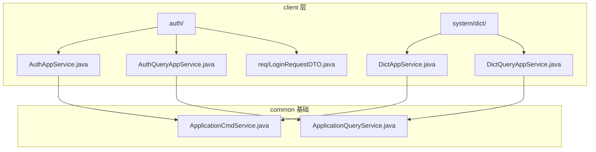
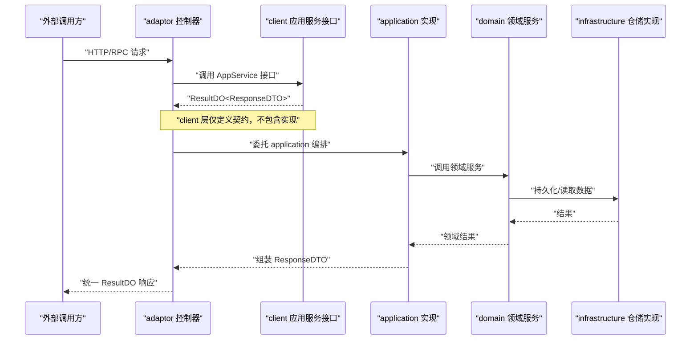
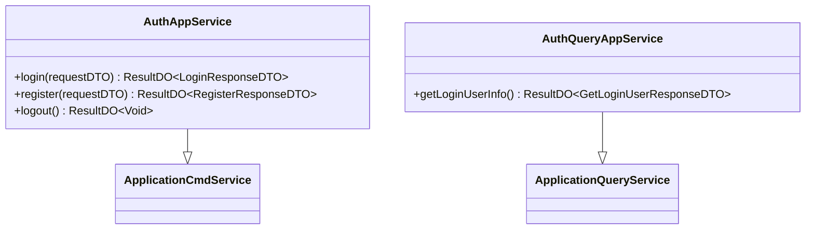
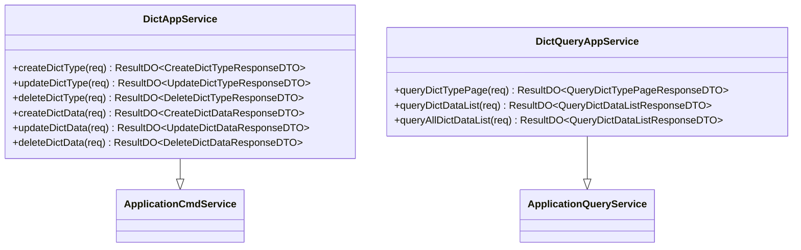
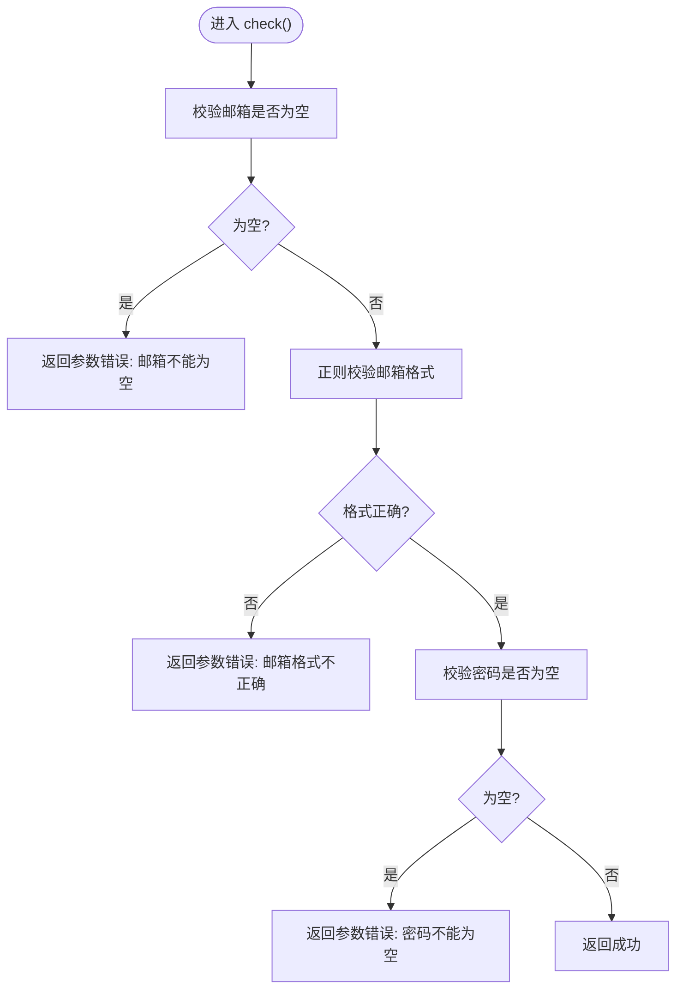
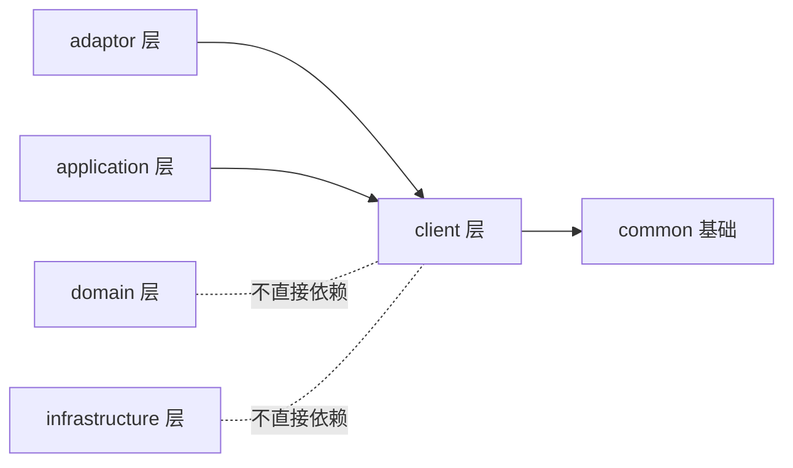

# 客户端接口设计

<cite>
**本文引用的文件**   
- [README.md](file://README.md)
- [package-info.java](file://src/main/java/com/sunnao/spring/ddd/template/client/package-info.java)
- [AuthAppService.java](file://src/main/java/com/sunnao/spring/ddd/template/client/auth/AuthAppService.java)
- [AuthQueryAppService.java](file://src/main/java/com/sunnao/spring/ddd/template/client/auth/AuthQueryAppService.java)
- [DictAppService.java](file://src/main/java/com/sunnao/spring/ddd/template/client/system/dict/DictAppService.java)
- [DictQueryAppService.java](file://src/main/java/com/sunnao/spring/ddd/template/client/system/dict/DictQueryAppService.java)
- [LoginRequestDTO.java](file://src/main/java/com/sunnao/spring/ddd/template/client/auth/req/LoginRequestDTO.java)
- [ApplicationCmdService.java](file://src/main/java/com/sunnao/spring/ddd/template/common/service/ApplicationCmdService.java)
- [ApplicationQueryService.java](file://src/main/java/com/sunnao/spring/ddd/template/common/service/ApplicationQueryService.java)
</cite>

## 目录
1. [引言](#引言)
2. [项目结构](#项目结构)
3. [核心组件](#核心组件)
4. [架构总览](#架构总览)
5. [详细组件分析](#详细组件分析)
6. [依赖分析](#依赖分析)
7. [性能考虑](#性能考虑)
8. [故障排查指南](#故障排查指南)
9. [结论](#结论)
10. [附录](#附录)

## 引言
本指南聚焦于 DDD 架构中的“客户端接口层”（client 包）的设计与开发规范，面向需要对外暴露 RPC/HTTP 接口的团队。内容涵盖：
- client 层的职责与定位
- 应用服务接口定义规范（命令服务与查询服务分离）
- DTO 设计模式（请求/响应职责划分与设计原则）
- 枚举类型定义规范（业务枚举与技术枚举的使用场景）
- 接口版本管理策略（向后兼容与迁移方案）
- 接口文档自动生成与测试方法（Swagger 集成与 Mock 测试）
- 接口设计规范、命名约定、错误处理等质量标准

## 项目结构
client 层按业务域组织顶层包，内部采用“接口 + DTO”的自包含契约设计，禁止反向依赖领域与应用实现，确保对外稳定性与可演进性。

图示来源
- [AuthAppService.java:1-39](file://src/main/java/com/sunnao/spring/ddd/template/client/auth/AuthAppService.java#L1-L39)
- [AuthQueryAppService.java:1-20](file://src/main/java/com/sunnao/spring/ddd/template/client/auth/AuthQueryAppService.java#L1-L20)
- [DictAppService.java:1-62](file://src/main/java/com/sunnao/spring/ddd/template/client/system/dict/DictAppService.java#L1-L62)
- [DictQueryAppService.java:1-40](file://src/main/java/com/sunnao/spring/ddd/template/client/system/dict/DictQueryAppService.java#L1-L40)
- [ApplicationCmdService.java:1-5](file://src/main/java/com/sunnao/spring/ddd/template/common/service/ApplicationCmdService.java#L1-L5)
- [ApplicationQueryService.java:1-5](file://src/main/java/com/sunnao/spring/ddd/template/common/service/ApplicationQueryService.java#L1-L5)

章节来源
- [README.md:19-36](file://README.md#L19-L36)
- [package-info.java:1-30](file://src/main/java/com/sunnao/spring/ddd/template/client/package-info.java#L1-L30)

## 核心组件
- 应用服务接口
  - 写模式：{聚合根名}AppService 继承 ApplicationCmdService
  - 读模式：{聚合根名}QueryAppService 或 {动词}QueryAppService 继承 ApplicationQueryService
- 统一返回
  - 所有方法返回值统一为 ResultDO<T>，错误码通过 ResultDO 封装，不抛异常
- DTO 校验
  - 请求 DTO 覆写 check() 进行入参自校验，返回 ResultDO<Void>
- 包结构约束
  - req/res/model/enums 分层清晰；禁止依赖 model/domain/application/infrastructure

章节来源
- [AuthAppService.java:1-39](file://src/main/java/com/sunnao/spring/ddd/template/client/auth/AuthAppService.java#L1-L39)
- [AuthQueryAppService.java:1-20](file://src/main/java/com/sunnao/spring/ddd/template/client/auth/AuthQueryAppService.java#L1-L20)
- [DictAppService.java:1-62](file://src/main/java/com/sunnao/spring/ddd/template/client/system/dict/DictAppService.java#L1-L62)
- [DictQueryAppService.java:1-40](file://src/main/java/com/sunnao/spring/ddd/template/client/system/dict/DictQueryAppService.java#L1-L40)
- [LoginRequestDTO.java:1-50](file://src/main/java/com/sunnao/spring/ddd/template/client/auth/req/LoginRequestDTO.java#L1-L50)
- [ApplicationCmdService.java:1-5](file://src/main/java/com/sunnao/spring/ddd/template/common/service/ApplicationCmdService.java#L1-L5)
- [ApplicationQueryService.java:1-5](file://src/main/java/com/sunnao/spring/ddd/template/common/service/ApplicationQueryService.java#L1-L5)
- [package-info.java:1-30](file://src/main/java/com/sunnao/spring/ddd/template/client/package-info.java#L1-L30)

## 架构总览
client 层作为对外契约层，向上被 adaptor 层调用，向下由 application 层实现。其核心目标是稳定、自包含、可演进。

图示来源
- [AuthAppService.java:1-39](file://src/main/java/com/sunnao/spring/ddd/template/client/auth/AuthAppService.java#L1-L39)
- [AuthQueryAppService.java:1-20](file://src/main/java/com/sunnao/spring/ddd/template/client/auth/AuthQueryAppService.java#L1-L20)
- [DictAppService.java:1-62](file://src/main/java/com/sunnao/spring/ddd/template/client/system/dict/DictAppService.java#L1-L62)
- [DictQueryAppService.java:1-40](file://src/main/java/com/sunnao/spring/ddd/template/client/system/dict/DictQueryAppService.java#L1-L40)

## 详细组件分析

### 认证模块接口设计
- 写模式接口
  - 登录、注册、登出等方法，参数为 RequestDTO，返回 ResultDO<ResponseDTO>
- 读模式接口
  - 获取当前登录用户信息，无复杂入参，直接返回 ResultDO<ResponseDTO>

图示来源
- [AuthAppService.java:1-39](file://src/main/java/com/sunnao/spring/ddd/template/client/auth/AuthAppService.java#L1-L39)
- [AuthQueryAppService.java:1-20](file://src/main/java/com/sunnao/spring/ddd/template/client/auth/AuthQueryAppService.java#L1-L20)
- [ApplicationCmdService.java:1-5](file://src/main/java/com/sunnao/spring/ddd/template/common/service/ApplicationCmdService.java#L1-L5)
- [ApplicationQueryService.java:1-5](file://src/main/java/com/sunnao/spring/ddd/template/common/service/ApplicationQueryService.java#L1-L5)

章节来源
- [AuthAppService.java:1-39](file://src/main/java/com/sunnao/spring/ddd/template/client/auth/AuthAppService.java#L1-L39)
- [AuthQueryAppService.java:1-20](file://src/main/java/com/sunnao/spring/ddd/template/client/auth/AuthQueryAppService.java#L1-L20)

### 字典模块接口设计
- 写模式接口
  - 字典类型与数据的增删改操作，均使用独立 RequestDTO/ResponseDTO
- 读模式接口
  - 分页查询字典类型、按类型键查询启用数据列表（走缓存）、查询全部数据列表

图示来源
- [DictAppService.java:1-62](file://src/main/java/com/sunnao/spring/ddd/template/client/system/dict/DictAppService.java#L1-L62)
- [DictQueryAppService.java:1-40](file://src/main/java/com/sunnao/spring/ddd/template/client/system/dict/DictQueryAppService.java#L1-L40)
- [ApplicationCmdService.java:1-5](file://src/main/java/com/sunnao/spring/ddd/template/common/service/ApplicationCmdService.java#L1-L5)
- [ApplicationQueryService.java:1-5](file://src/main/java/com/sunnao/spring/ddd/template/common/service/ApplicationQueryService.java#L1-L5)

章节来源
- [DictAppService.java:1-62](file://src/main/java/com/sunnao/spring/ddd/template/client/system/dict/DictAppService.java#L1-L62)
- [DictQueryAppService.java:1-40](file://src/main/java/com/sunnao/spring/ddd/template/client/system/dict/DictQueryAppService.java#L1-L40)

### 请求 DTO 设计与校验流程
- 设计要点
  - 每个写方法对应一个独立的 RequestDTO，字段语义明确、边界清晰
  - 在 DTO 中覆写 check() 完成自校验，返回 ResultDO<Void>
  - 敏感字段（如密码）避免 toString 输出
- 校验流程图

图示来源
- [LoginRequestDTO.java:1-50](file://src/main/java/com/sunnao/spring/ddd/template/client/auth/req/LoginRequestDTO.java#L1-L50)

章节来源
- [LoginRequestDTO.java:1-50](file://src/main/java/com/sunnao/spring/ddd/template/client/auth/req/LoginRequestDTO.java#L1-L50)

## 依赖分析
- 耦合关系
  - client 层仅依赖 common 基础（ApplicationCmdService/ApplicationQueryService、ResultDO、BaseDto 等），不依赖 domain/application/infrastructure
- 内聚性
  - 每个业务域下接口与 DTO 高度内聚，便于独立演进与版本管理
- 外部依赖
  - 通过 adaptor 层桥接 HTTP/RPC 框架；通过 application 层实现具体编排

图示来源
- [package-info.java:1-30](file://src/main/java/com/sunnao/spring/ddd/template/client/package-info.java#L1-L30)
- [AuthAppService.java:1-39](file://src/main/java/com/sunnao/spring/ddd/template/client/auth/AuthAppService.java#L1-L39)
- [DictAppService.java:1-62](file://src/main/java/com/sunnao/spring/ddd/template/client/system/dict/DictAppService.java#L1-L62)

章节来源
- [README.md:19-36](file://README.md#L19-L36)
- [package-info.java:1-30](file://src/main/java/com/sunnao/spring/ddd/template/client/package-info.java#L1-L30)

## 性能考虑
- 读多写少场景优先使用 QueryAppService，减少副作用
- 字典数据按类型键查询启用列表走缓存，降低数据库压力
- 请求 DTO 自校验前置失败，避免不必要的下游调用

[本节为通用指导，无需源码引用]

## 故障排查指南
- 常见错误
  - 参数校验失败：检查 RequestDTO.check() 逻辑与错误码
  - 未包装异常：确保各层方法统一返回 ResultDO，不在 client 层抛出异常
- 建议
  - 在 adaptor 层集中捕获并转换为统一错误响应
  - 结合 traceId 链路定位问题

章节来源
- [README.md:119-128](file://README.md#L119-L128)
- [LoginRequestDTO.java:1-50](file://src/main/java/com/sunnao/spring/ddd/template/client/auth/req/LoginRequestDTO.java#L1-L50)

## 结论
client 层以“契约先行、自包含、低耦合”为核心目标，通过明确的接口分层（命令/查询）、严格的 DTO 校验与统一的返回模型，保障系统对外接口的稳定性与可演进性。配合 Swagger 文档与自动化测试，可显著提升交付质量与协作效率。

[本节为总结性内容，无需源码引用]

## 附录

### 接口设计规范与命名约定
- 接口命名
  - 写模式：{聚合根名}AppService
  - 读模式：{聚合根名}QueryAppService 或 {动词}QueryAppService
- DTO 命名
  - 请求：{方法名}RequestDTO
  - 响应：{方法名}ResponseDTO
  - 复用对象：model/{分类}/{对象名}DTO
- 包结构
  - enums/model/req/res 分层清晰，禁止完全平铺
- 返回值
  - 统一 ResultDO<T>，错误码通过 ResultDO 封装

章节来源
- [package-info.java:1-30](file://src/main/java/com/sunnao/spring/ddd/template/client/package-info.java#L1-L30)
- [AuthAppService.java:1-39](file://src/main/java/com/sunnao/spring/ddd/template/client/auth/AuthAppService.java#L1-L39)
- [AuthQueryAppService.java:1-20](file://src/main/java/com/sunnao/spring/ddd/template/client/auth/AuthQueryAppService.java#L1-L20)
- [DictAppService.java:1-62](file://src/main/java/com/sunnao/spring/ddd/template/client/system/dict/DictAppService.java#L1-L62)
- [DictQueryAppService.java:1-40](file://src/main/java/com/sunnao/spring/ddd/template/client/system/dict/DictQueryAppService.java#L1-L40)

### 枚举类型定义规范
- 业务枚举
  - 用于表达领域概念的状态、类型等，放在 client 层独立定义，避免与内部 model 耦合
- 技术枚举
  - 用于配置项、存储类型等技术维度，同样在 client 层独立定义
- 使用原则
  - 对外契约稳定，变更需评估兼容性；尽量保持枚举值不可变

章节来源
- [package-info.java:1-30](file://src/main/java/com/sunnao/spring/ddd/template/client/package-info.java#L1-L30)

### 接口版本管理策略
- 向后兼容
  - 新增字段默认可选，旧客户端不受影响
  - 废弃字段保留一段时间并提供迁移提示
- 迁移方案
  - 通过版本号或路由前缀区分大版本
  - 提供双版本并存期与灰度发布策略
- 文档同步
  - 变更伴随 API 文档更新与示例更新

[本节为通用指导，无需源码引用]

### 接口文档自动生成与测试
- Swagger 集成
  - 使用 springdoc-openapi，访问 /swagger-ui.html 查看文档
- Mock 测试
  - 基于 client 接口编写单元测试，Mock application 实现，验证契约与错误码
- 集成测试
  - 对关键路径进行端到端验证，缺失外部依赖时自动跳过

章节来源
- [README.md:16-17](file://README.md#L16-L17)
- [README.md:129-146](file://README.md#L129-L146)