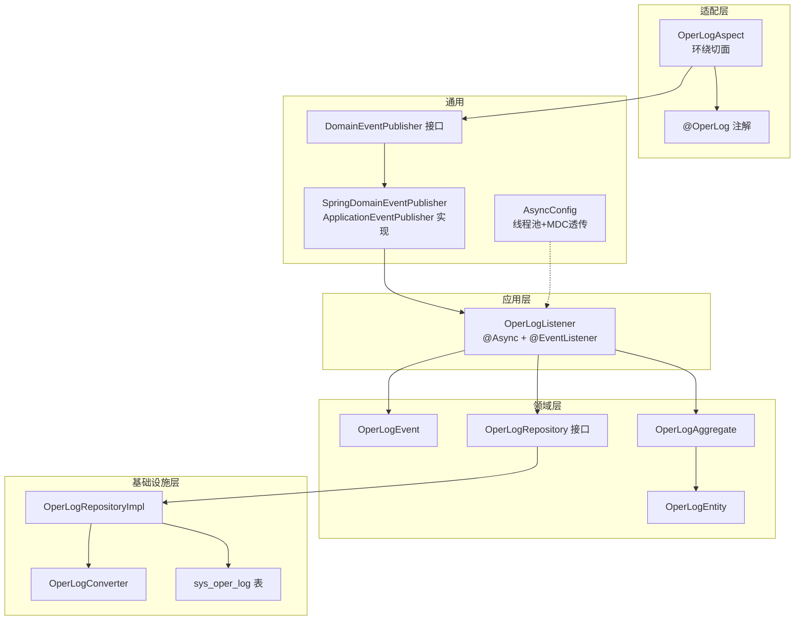
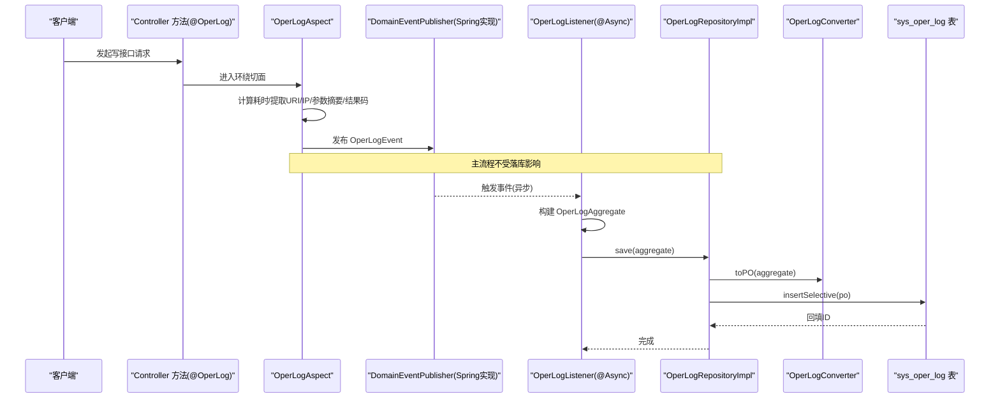
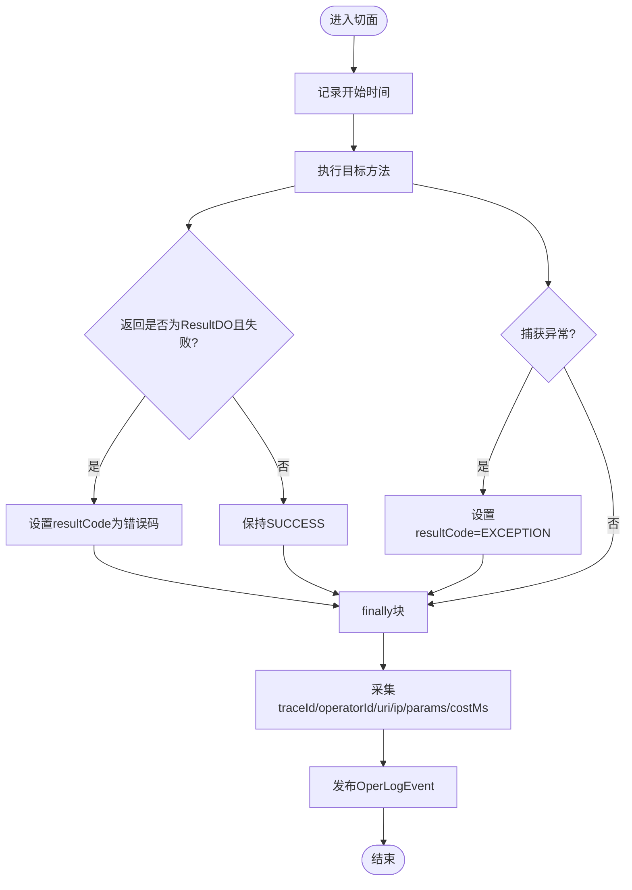
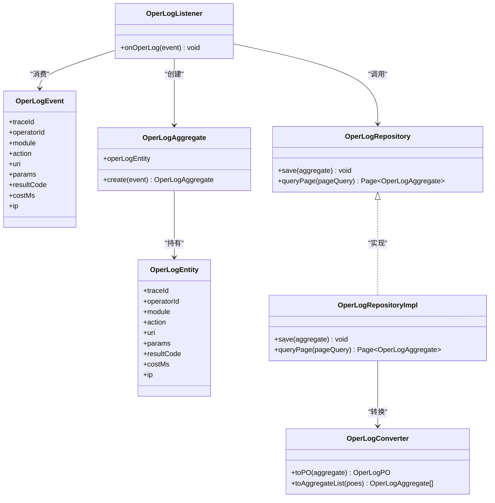

# 操作日志切面

<cite>
**本文引用的文件**   
- [OperLogAspect.java](file://src/main/java/com/sunnao/spring/ddd/template/adaptor/common/OperLogAspect.java)
- [OperLog.java](file://src/main/java/com/sunnao/spring/ddd/template/common/annotation/OperLog.java)
- [OperLogListener.java](file://src/main/java/com/sunnao/spring/ddd/template/application/system/log/listener/OperLogListener.java)
- [OperLogEvent.java](file://src/main/java/com/sunnao/spring/ddd/template/domain/system/log/event/OperLogEvent.java)
- [DomainEventPublisher.java](file://src/main/java/com/sunnao/spring/ddd/template/common/event/DomainEventPublisher.java)
- [SpringDomainEventPublisher.java](file://src/main/java/com/sunnao/spring/ddd/template/infrastructure/common/SpringDomainEventPublisher.java)
- [AsyncConfig.java](file://src/main/java/com/sunnao/spring/ddd/template/common/config/AsyncConfig.java)
- [OperLogRepository.java](file://src/main/java/com/sunnao/spring/ddd/template/domain/system/log/repository/OperLogRepository.java)
- [OperLogRepositoryImpl.java](file://src/main/java/com/sunnao/spring/ddd/template/infrastructure/system/log/repository/OperLogRepositoryImpl.java)
- [OperLogAggregate.java](file://src/main/java/com/sunnao/spring/ddd/template/domain/system/log/model/aggregate/OperLogAggregate.java)
- [OperLogEntity.java](file://src/main/java/com/sunnao/spring/ddd/template/domain/system/log/model/entity/OperLogEntity.java)
- [OperLogConverter.java](file://src/main/java/com/sunnao/spring/ddd/template/infrastructure/system/log/converter/OperLogConverter.java)
- [V3__init_sys_oper_log.sql](file://src/main/resources/db/migration/V3__init_sys_oper_log.sql)
</cite>

## 目录
1. [简介](#简介)
2. [项目结构](#项目结构)
3. [核心组件](#核心组件)
4. [架构总览](#架构总览)
5. [详细组件分析](#详细组件分析)
6. [依赖关系分析](#依赖关系分析)
7. [性能与优化](#性能与优化)
8. [故障排查指南](#故障排查指南)
9. [结论](#结论)
10. [附录：扩展与最佳实践](#附录扩展与最佳实践)

## 简介
本指南围绕操作日志的 AOP 采集与异步落库方案，基于 OperLogAspect 与 @OperLog 注解实现，系统讲解从方法拦截、参数摘要、结果码判定、事件发布到监听器异步持久化的完整链路。文档同时覆盖自定义注解设计模式、切面执行时机与拦截规则、异步线程池配置、MDC 链路透传、数据库索引与查询优化、安全注意事项以及可扩展的自定义处理器策略。

## 项目结构
该功能涉及适配层（AOP）、应用层（事件监听）、领域层（事件与聚合根）、基础设施层（仓储实现与数据转换）以及通用配置（异步线程池）。整体遵循 DDD 分层与关注点分离原则，将横切关注点（日志采集）通过 AOP 解耦，并通过领域事件驱动异步处理。

图表来源
- [OperLogAspect.java:1-131](file://src/main/java/com/sunnao/spring/ddd/template/adaptor/common/OperLogAspect.java#L1-L131)
- [OperLog.java:1-27](file://src/main/java/com/sunnao/spring/ddd/template/common/annotation/OperLog.java#L1-L27)
- [DomainEventPublisher.java:1-20](file://src/main/java/com/sunnao/spring/ddd/template/common/event/DomainEventPublisher.java#L1-L20)
- [SpringDomainEventPublisher.java:1-35](file://src/main/java/com/sunnao/spring/ddd/template/infrastructure/common/SpringDomainEventPublisher.java#L1-L35)
- [AsyncConfig.java:1-69](file://src/main/java/com/sunnao/spring/ddd/template/common/config/AsyncConfig.java#L1-L69)
- [OperLogListener.java:1-36](file://src/main/java/com/sunnao/spring/ddd/template/application/system/log/listener/OperLogListener.java#L1-L36)
- [OperLogEvent.java:1-70](file://src/main/java/com/sunnao/spring/ddd/template/domain/system/log/event/OperLogEvent.java#L1-L70)
- [OperLogAggregate.java:1-58](file://src/main/java/com/sunnao/spring/ddd/template/domain/system/log/model/aggregate/OperLogAggregate.java#L1-L58)
- [OperLogEntity.java:1-62](file://src/main/java/com/sunnao/spring/ddd/template/domain/system/log/model/entity/OperLogEntity.java#L1-L62)
- [OperLogRepository.java:1-35](file://src/main/java/com/sunnao/spring/ddd/template/domain/system/log/repository/OperLogRepository.java#L1-L35)
- [OperLogRepositoryImpl.java:1-96](file://src/main/java/com/sunnao/spring/ddd/template/infrastructure/system/log/repository/OperLogRepositoryImpl.java#L1-L96)
- [OperLogConverter.java:1-64](file://src/main/java/com/sunnao/spring/ddd/template/infrastructure/system/log/converter/OperLogConverter.java#L1-64)
- [V3__init_sys_oper_log.sql:1-45](file://src/main/resources/db/migration/V3__init_sys_oper_log.sql#L1-L45)

章节来源
- [OperLogAspect.java:1-131](file://src/main/java/com/sunnao/spring/ddd/template/adaptor/common/OperLogAspect.java#L1-L131)
- [OperLog.java:1-27](file://src/main/java/com/sunnao/spring/ddd/template/common/annotation/OperLog.java#L1-L27)
- [OperLogListener.java:1-36](file://src/main/java/com/sunnao/spring/ddd/template/application/system/log/listener/OperLogListener.java#L1-L36)
- [OperLogEvent.java:1-70](file://src/main/java/com/sunnao/spring/ddd/template/domain/system/log/event/OperLogEvent.java#L1-L70)
- [DomainEventPublisher.java:1-20](file://src/main/java/com/sunnao/spring/ddd/template/common/event/DomainEventPublisher.java#L1-L20)
- [SpringDomainEventPublisher.java:1-35](file://src/main/java/com/sunnao/spring/ddd/template/infrastructure/common/SpringDomainEventPublisher.java#L1-L35)
- [AsyncConfig.java:1-69](file://src/main/java/com/sunnao/spring/ddd/template/common/config/AsyncConfig.java#L1-L69)
- [OperLogRepository.java:1-35](file://src/main/java/com/sunnao/spring/ddd/template/domain/system/log/repository/OperLogRepository.java#L1-L35)
- [OperLogRepositoryImpl.java:1-96](file://src/main/java/com/sunnao/spring/ddd/template/infrastructure/system/log/repository/OperLogRepositoryImpl.java#L1-L96)
- [OperLogAggregate.java:1-58](file://src/main/java/com/sunnao/spring/ddd/template/domain/system/log/model/aggregate/OperLogAggregate.java#L1-L58)
- [OperLogEntity.java:1-62](file://src/main/java/com/sunnao/spring/ddd/template/domain/system/log/model/entity/OperLogEntity.java#L1-L62)
- [OperLogConverter.java:1-64](file://src/main/java/com/sunnao/spring/ddd/template/infrastructure/system/log/converter/OperLogConverter.java#L1-64)
- [V3__init_sys_oper_log.sql:1-45](file://src/main/resources/db/migration/V3__init_sys_oper_log.sql#L1-L45)

## 核心组件
- 自定义注解 @OperLog：用于标注 Controller 写接口，声明 module 与 action 两个属性，作为日志分类与动作描述。
- 切面 OperLogAspect：使用 @Around 环绕匹配 @OperLog 的方法，采集 traceId、操作人、URI、参数摘要、结果码、耗时、IP，并发布 OperLogEvent。
- 领域事件 OperLogEvent：承载一次操作日志所需的全部上下文信息。
- 事件发布器 DomainEventPublisher 及其 Spring 实现：基于 ApplicationEventPublisher 进行进程内广播。
- 监听器 OperLogListener：以 @Async 异步消费事件，构建聚合根并调用仓储落库。
- 仓储接口与实现：定义只增不改的保存与分页查询；实现中负责 PO 与聚合根的转换及分页条件构建。
- 转换器 OperLogConverter：纯技术映射，屏蔽业务逻辑。
- 异步配置 AsyncConfig：统一线程池与 MDC 透传，保障链路追踪在异步线程中可用。
- 数据库表 sys_oper_log：包含必要字段与常用索引，支撑高效查询。

章节来源
- [OperLog.java:1-27](file://src/main/java/com/sunnao/spring/ddd/template/common/annotation/OperLog.java#L1-L27)
- [OperLogAspect.java:1-131](file://src/main/java/com/sunnao/spring/ddd/template/adaptor/common/OperLogAspect.java#L1-L131)
- [OperLogEvent.java:1-70](file://src/main/java/com/sunnao/spring/ddd/template/domain/system/log/event/OperLogEvent.java#L1-L70)
- [DomainEventPublisher.java:1-20](file://src/main/java/com/sunnao/spring/ddd/template/common/event/DomainEventPublisher.java#L1-L20)
- [SpringDomainEventPublisher.java:1-35](file://src/main/java/com/sunnao/spring/ddd/template/infrastructure/common/SpringDomainEventPublisher.java#L1-L35)
- [OperLogListener.java:1-36](file://src/main/java/com/sunnao/spring/ddd/template/application/system/log/listener/OperLogListener.java#L1-L36)
- [OperLogRepository.java:1-35](file://src/main/java/com/sunnao/spring/ddd/template/domain/system/log/repository/OperLogRepository.java#L1-L35)
- [OperLogRepositoryImpl.java:1-96](file://src/main/java/com/sunnao/spring/ddd/template/infrastructure/system/log/repository/OperLogRepositoryImpl.java#L1-L96)
- [OperLogConverter.java:1-64](file://src/main/java/com/sunnao/spring/ddd/template/infrastructure/system/log/converter/OperLogConverter.java#L1-64)
- [AsyncConfig.java:1-69](file://src/main/java/com/sunnao/spring/ddd/template/common/config/AsyncConfig.java#L1-L69)
- [V3__init_sys_oper_log.sql:1-45](file://src/main/resources/db/migration/V3__init_sys_oper_log.sql#L1-L45)

## 架构总览
下图展示了从请求进入 Controller 到日志落库的端到端流程，包括 AOP 拦截、事件发布、异步监听与持久化。

图表来源
- [OperLogAspect.java:1-131](file://src/main/java/com/sunnao/spring/ddd/template/adaptor/common/OperLogAspect.java#L1-L131)
- [OperLogEvent.java:1-70](file://src/main/java/com/sunnao/spring/ddd/template/domain/system/log/event/OperLogEvent.java#L1-L70)
- [DomainEventPublisher.java:1-20](file://src/main/java/com/sunnao/spring/ddd/template/common/event/DomainEventPublisher.java#L1-L20)
- [SpringDomainEventPublisher.java:1-35](file://src/main/java/com/sunnao/spring/ddd/template/infrastructure/common/SpringDomainEventPublisher.java#L1-L35)
- [OperLogListener.java:1-36](file://src/main/java/com/sunnao/spring/ddd/template/application/system/log/listener/OperLogListener.java#L1-L36)
- [OperLogRepositoryImpl.java:1-96](file://src/main/java/com/sunnao/spring/ddd/template/infrastructure/system/log/repository/OperLogRepositoryImpl.java#L1-L96)
- [OperLogConverter.java:1-64](file://src/main/java/com/sunnao/spring/ddd/template/infrastructure/system/log/converter/OperLogConverter.java#L1-64)
- [V3__init_sys_oper_log.sql:1-45](file://src/main/resources/db/migration/V3__init_sys_oper_log.sql#L1-L45)

## 详细组件分析

### 自定义注解 @OperLog 的设计与使用
- 目标与方法级别：仅作用于方法，适合标注在 Controller 写接口上。
- 属性说明：
  - module：业务模块标识，便于按模块统计与过滤。
  - action：操作动作描述，便于审计与检索。
- 使用建议：为每个写接口标注明确的 module 与 action，避免空值导致后续校验失败。

章节来源
- [OperLog.java:1-27](file://src/main/java/com/sunnao/spring/ddd/template/common/annotation/OperLog.java#L1-L27)

### 切面 OperLogAspect 的执行时机与拦截规则
- 拦截方式：@Around("@annotation(operLog)")，精确匹配被 @OperLog 标注的方法。
- 执行时机：
  - 方法执行前记录开始时间。
  - 方法执行后判断返回体 ResultDO 是否成功，决定 resultCode。
  - 异常路径设置特定错误码，并在 finally 中发布事件，确保不阻塞主流程。
- 信息采集：
  - traceId：来自 MDC（由过滤器注入）。
  - operatorId：来自当前用户上下文。
  - uri/ip：从当前请求对象获取。
  - params：对入参做摘要，跳过敏感类型，超长截断。
- 参数摘要策略：
  - DTO 走 toString（敏感字段可通过注解排除）。
  - 跳过 MultipartFile、byte[]、HttpServletRequest 等。
  - 最大长度限制与数据库列宽对齐，避免溢出。

图表来源
- [OperLogAspect.java:1-131](file://src/main/java/com/sunnao/spring/ddd/template/adaptor/common/OperLogAspect.java#L1-L131)

章节来源
- [OperLogAspect.java:1-131](file://src/main/java/com/sunnao/spring/ddd/template/adaptor/common/OperLogAspect.java#L1-L131)

### 领域事件 OperLogEvent 与发布订阅
- 事件内容：包含 traceId、operatorId、module、action、uri、params、resultCode、costMs、ip 等。
- 发布机制：
  - 切面通过 DomainEventPublisher.publish(event) 发布。
  - Spring 实现基于 ApplicationEventPublisher 进行进程内广播。
  - 发布失败仅记录日志，不影响主流程。

章节来源
- [OperLogEvent.java:1-70](file://src/main/java/com/sunnao/spring/ddd/template/domain/system/log/event/OperLogEvent.java#L1-L70)
- [DomainEventPublisher.java:1-20](file://src/main/java/com/sunnao/spring/ddd/template/common/event/DomainEventPublisher.java#L1-L20)
- [SpringDomainEventPublisher.java:1-35](file://src/main/java/com/sunnao/spring/ddd/template/infrastructure/common/SpringDomainEventPublisher.java#L1-L35)

### 异步监听与持久化链路
- 监听器 OperLogListener：
  - 使用 @Async + @EventListener 异步消费事件。
  - 构建 OperLogAggregate，调用仓储 save 落库。
  - 消费失败仅记录日志，不影响主流程。
- 仓储实现 OperLogRepositoryImpl：
  - save：聚合根转 PO，插入后回填 ID。
  - queryPage：根据 PageQuery 构建 MyBatis-Flex 查询条件，支持模块、操作人、时间范围过滤，并按 create_at 倒序。
- 转换器 OperLogConverter：
  - 提供 Entity/PO/Aggregate 之间的纯技术映射。

图表来源
- [OperLogListener.java:1-36](file://src/main/java/com/sunnao/spring/ddd/template/application/system/log/listener/OperLogListener.java#L1-L36)
- [OperLogEvent.java:1-70](file://src/main/java/com/sunnao/spring/ddd/template/domain/system/log/event/OperLogEvent.java#L1-L70)
- [OperLogAggregate.java:1-58](file://src/main/java/com/sunnao/spring/ddd/template/domain/system/log/model/aggregate/OperLogAggregate.java#L1-L58)
- [OperLogEntity.java:1-62](file://src/main/java/com/sunnao/spring/ddd/template/domain/system/log/model/entity/OperLogEntity.java#L1-L62)
- [OperLogRepository.java:1-35](file://src/main/java/com/sunnao/spring/ddd/template/domain/system/log/repository/OperLogRepository.java#L1-L35)
- [OperLogRepositoryImpl.java:1-96](file://src/main/java/com/sunnao/spring/ddd/template/infrastructure/system/log/repository/OperLogRepositoryImpl.java#L1-L96)
- [OperLogConverter.java:1-64](file://src/main/java/com/sunnao/spring/ddd/template/infrastructure/system/log/converter/OperLogConverter.java#L1-64)

章节来源
- [OperLogListener.java:1-36](file://src/main/java/com/sunnao/spring/ddd/template/application/system/log/listener/OperLogListener.java#L1-L36)
- [OperLogRepositoryImpl.java:1-96](file://src/main/java/com/sunnao/spring/ddd/template/infrastructure/system/log/repository/OperLogRepositoryImpl.java#L1-L96)
- [OperLogConverter.java:1-64](file://src/main/java/com/sunnao/spring/ddd/template/infrastructure/system/log/converter/OperLogConverter.java#L1-64)

### 异步线程池与 MDC 透传
- 线程池配置：
  - 核心线程数、最大线程数、队列容量、存活时间、拒绝策略等。
  - 线程名前缀便于定位问题。
- MDC 透传：
  - 通过 TaskDecorator 在任务提交时快照 MDC，执行时恢复，结束后清理，保证 traceId 在异步线程中可用。

章节来源
- [AsyncConfig.java:1-69](file://src/main/java/com/sunnao/spring/ddd/template/common/config/AsyncConfig.java#L1-L69)

### 数据库设计与索引优化
- 表结构：包含 trace_id、operator_id、module、action、uri、params、result_code、cost_ms、ip、create_at 等字段。
- 索引：
  - create_at DESC：按时间倒序分页查询。
  - operator_id：按操作人筛选。
  - module：按模块筛选。
- 列宽：params 列宽与切面截断长度一致，避免写入异常。

章节来源
- [V3__init_sys_oper_log.sql:1-45](file://src/main/resources/db/migration/V3__init_sys_oper_log.sql#L1-L45)

## 依赖关系分析
- 切面依赖：
  - 上下文工具：CurrentUserContext、RequestContextUtils。
  - 事件发布：DomainEventPublisher（Spring 实现）。
  - 日志与 MDC：SLF4J、MDC。
- 监听器依赖：
  - 仓储接口：OperLogRepository。
  - 聚合根：OperLogAggregate。
- 仓储实现依赖：
  - 转换器：OperLogConverter。
  - Mapper：MyBatis-Flex 生成的 Mapper。
  - 分页：Spring Data Page 与 MyBatis-Flex 分页。

图表来源
- [OperLogAspect.java:1-131](file://src/main/java/com/sunnao/spring/ddd/template/adaptor/common/OperLogAspect.java#L1-L131)
- [DomainEventPublisher.java:1-20](file://src/main/java/com/sunnao/spring/ddd/template/common/event/DomainEventPublisher.java#L1-L20)
- [SpringDomainEventPublisher.java:1-35](file://src/main/java/com/sunnao/spring/ddd/template/infrastructure/common/SpringDomainEventPublisher.java#L1-L35)
- [OperLogListener.java:1-36](file://src/main/java/com/sunnao/spring/ddd/template/application/system/log/listener/OperLogListener.java#L1-L36)
- [OperLogRepository.java:1-35](file://src/main/java/com/sunnao/spring/ddd/template/domain/system/log/repository/OperLogRepository.java#L1-L35)
- [OperLogRepositoryImpl.java:1-96](file://src/main/java/com/sunnao/spring/ddd/template/infrastructure/system/log/repository/OperLogRepositoryImpl.java#L1-L96)
- [OperLogConverter.java:1-64](file://src/main/java/com/sunnao/spring/ddd/template/infrastructure/system/log/converter/OperLogConverter.java#L1-64)

章节来源
- [OperLogAspect.java:1-131](file://src/main/java/com/sunnao/spring/ddd/template/adaptor/common/OperLogAspect.java#L1-L131)
- [OperLogListener.java:1-36](file://src/main/java/com/sunnao/spring/ddd/template/application/system/log/listener/OperLogListener.java#L1-L36)
- [OperLogRepositoryImpl.java:1-96](file://src/main/java/com/sunnao/spring/ddd/template/infrastructure/system/log/repository/OperLogRepositoryImpl.java#L1-L96)

## 性能与优化
- 异步落库：
  - 通过 @Async 与独立线程池隔离日志写入，降低主流程延迟。
  - 合理配置核心/最大线程数与队列容量，避免 OOM 或丢消息。
- 参数摘要：
  - 跳过大型对象与敏感类型，限制长度，减少序列化与存储开销。
- 查询优化：
  - 利用 create_at、operator_id、module 索引提升分页与筛选效率。
  - 控制查询条件粒度，避免全表扫描。
- 幂等与重试：
  - 当前实现为“尽力而为”，失败仅记录日志。若需强一致，可在监听器中增加重试与死信队列。
- 监控与告警：
  - 对发布失败、落库失败、线程池拒绝策略触发点进行监控与告警。

[本节为通用指导，无需具体文件引用]

## 故障排查指南
- 未采集到日志：
  - 确认 Controller 方法已标注 @OperLog，且 module/action 非空。
  - 检查切面是否生效（AOP 代理是否启用）。
- 缺少 traceId：
  - 确认 TraceIdFilter 已注册，MDC 在请求入口设置。
  - 确认 AsyncConfig 的 MDC 透传装饰器已启用。
- 参数为空或过长：
  - 检查 DTO 的 toString 是否屏蔽了敏感字段。
  - 确认参数摘要截断长度与数据库列宽一致。
- 落库失败：
  - 查看监听器日志，确认聚合根构建与转换是否正确。
  - 检查数据库连接、表结构与索引。
- 线程池饱和：
  - 观察线程池指标，调整核心/最大线程数与队列容量。
  - 评估业务峰值与日志量级，必要时引入外部消息队列。

章节来源
- [OperLogAspect.java:1-131](file://src/main/java/com/sunnao/spring/ddd/template/adaptor/common/OperLogAspect.java#L1-L131)
- [AsyncConfig.java:1-69](file://src/main/java/com/sunnao/spring/ddd/template/common/config/AsyncConfig.java#L1-L69)
- [OperLogListener.java:1-36](file://src/main/java/com/sunnao/spring/ddd/template/application/system/log/listener/OperLogListener.java#L1-L36)
- [OperLogRepositoryImpl.java:1-96](file://src/main/java/com/sunnao/spring/ddd/template/infrastructure/system/log/repository/OperLogRepositoryImpl.java#L1-L96)

## 结论
本方案通过 AOP 与领域事件实现了操作日志的非侵入式采集与异步持久化，兼顾性能与可观测性。注解驱动的声明式用法简化了接入成本，仓储层的只增不改模型契合审计场景。结合合理的线程池与索引策略，可在高并发下稳定运行。

[本节为总结，无需具体文件引用]

## 附录：扩展与最佳实践

### 自定义日志处理器扩展
- 新增监听器：
  - 定义新的 @Component 监听器，使用 @Async + @EventListener 消费 OperLogEvent。
  - 在监听器中实现额外处理逻辑（如发送到外部审计系统），失败仅记录日志。
- 自定义注解增强：
  - 在 @OperLog 中扩展更多属性（如租户标识、环境标签），并在切面中采集并传递至事件。
- 参数摘要策略定制：
  - 在切面中扩展 summarizeParams 逻辑，支持自定义过滤规则或脱敏策略。
- 异步策略升级：
  - 将进程内事件升级为外部消息队列（如 Kafka/RabbitMQ），提高可靠性与水平扩展能力。
- 安全与合规：
  - 严格屏蔽敏感字段（密码、令牌、身份证号等）。
  - 对 IP、UA 等元数据进行最小化采集与保留策略。
  - 对日志访问实施鉴权与审计。

章节来源
- [OperLogListener.java:1-36](file://src/main/java/com/sunnao/spring/ddd/template/application/system/log/listener/OperLogListener.java#L1-L36)
- [OperLogAspect.java:1-131](file://src/main/java/com/sunnao/spring/ddd/template/adaptor/common/OperLogAspect.java#L1-L131)
- [OperLogEvent.java:1-70](file://src/main/java/com/sunnao/spring/ddd/template/domain/system/log/event/OperLogEvent.java#L1-L70)
- [AsyncConfig.java:1-69](file://src/main/java/com/sunnao/spring/ddd/template/common/config/AsyncConfig.java#L1-L69)