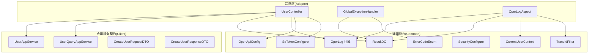
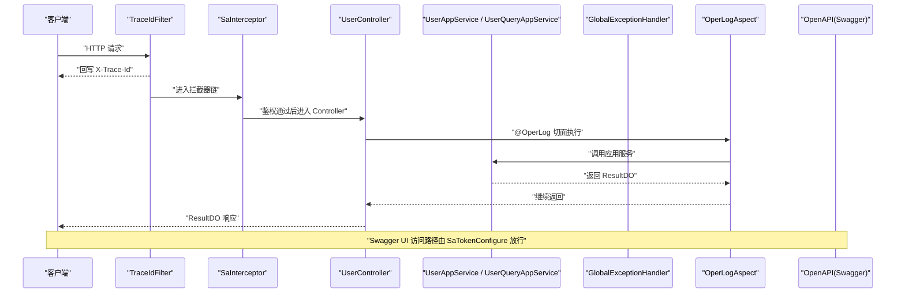
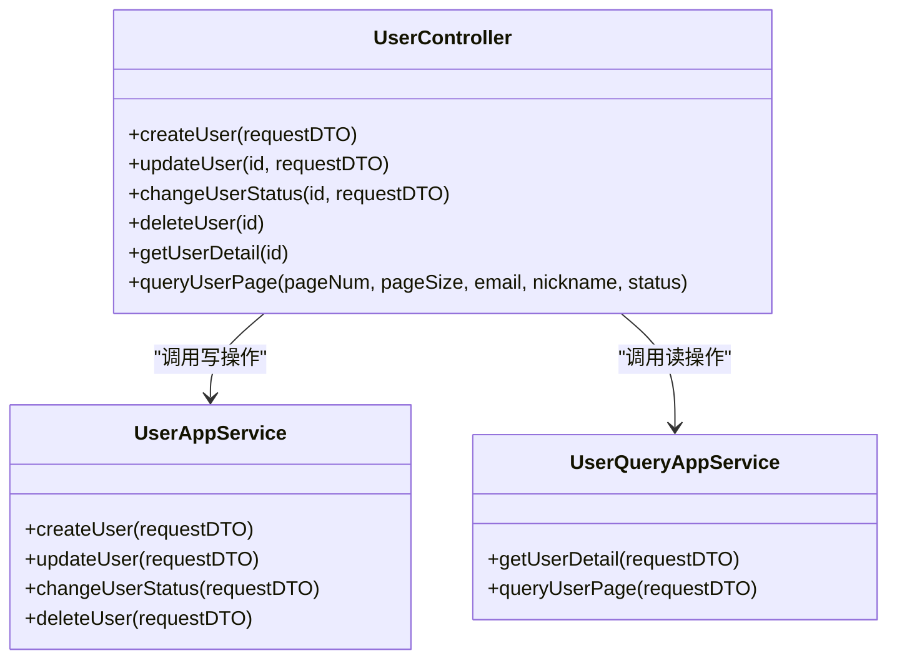
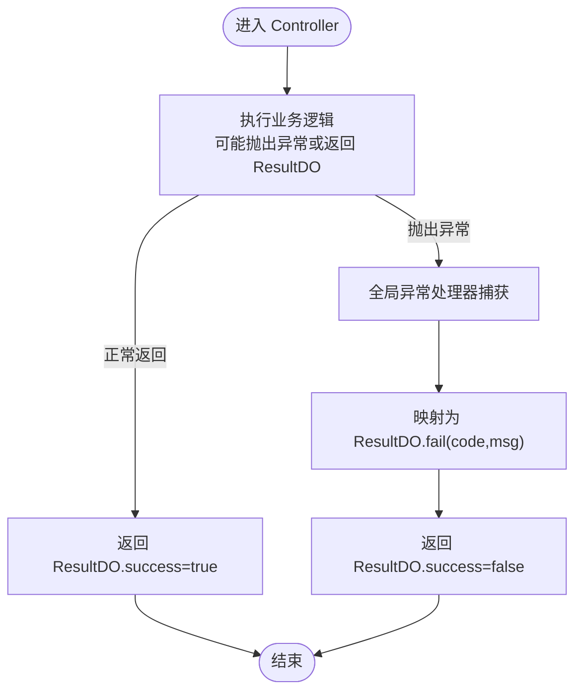
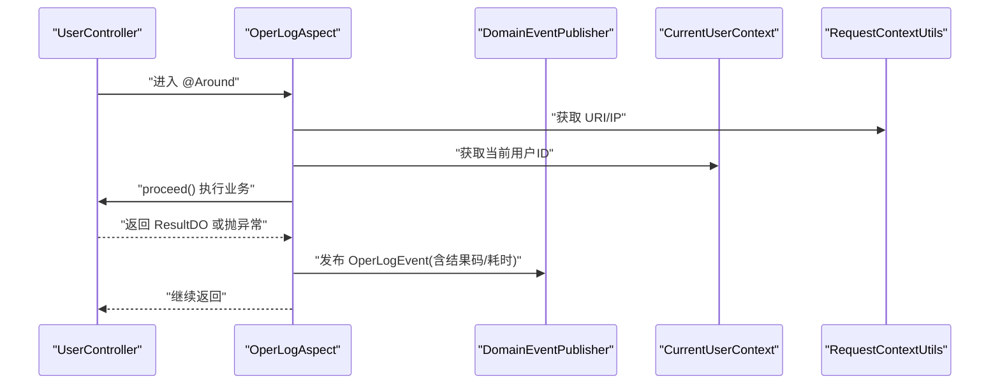
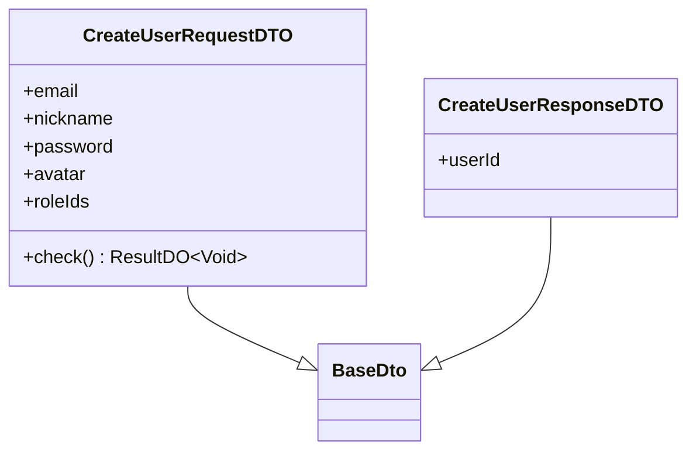
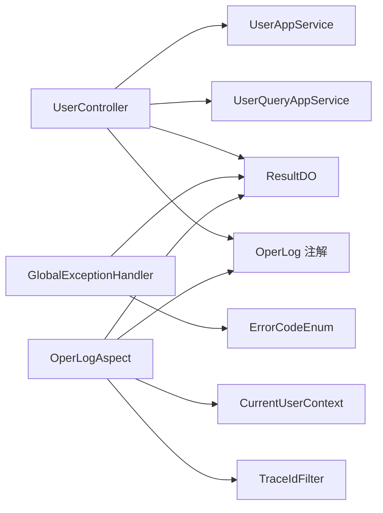

# 适配层开发

<cite>
**本文引用的文件**   
- [UserController.java](file://src/main/java/com/sunnao/spring/ddd/template/adaptor/system/user/input/UserController.java)
- [GlobalExceptionHandler.java](file://src/main/java/com/sunnao/spring/ddd/template/adaptor/common/GlobalExceptionHandler.java)
- [OperLogAspect.java](file://src/main/java/com/sunnao/spring/ddd/template/adaptor/common/OperLogAspect.java)
- [OperLog.java](file://src/main/java/com/sunnao/spring/ddd/template/common/annotation/OperLog.java)
- [ErrorCodeEnum.java](file://src/main/java/com/sunnao/spring/ddd/template/common/result/ErrorCodeEnum.java)
- [ResultDO.java](file://src/main/java/com/sunnao/spring/ddd/template/common/result/ResultDO.java)
- [UserAppService.java](file://src/main/java/com/sunnao/spring/ddd/template/client/system/user/UserAppService.java)
- [UserQueryAppService.java](file://src/main/java/com/sunnao/spring/ddd/template/client/system/user/UserQueryAppService.java)
- [CreateUserRequestDTO.java](file://src/main/java/com/sunnao/spring/ddd/template/client/system/user/req/CreateUserRequestDTO.java)
- [CreateUserResponseDTO.java](file://src/main/java/com/sunnao/spring/ddd/template/client/system/user/res/CreateUserResponseDTO.java)
- [OpenApiConfig.java](file://src/main/java/com/sunnao/spring/ddd/template/common/config/OpenApiConfig.java)
- [SaTokenConfigure.java](file://src/main/java/com/sunnao/spring/ddd/template/common/config/SaTokenConfigure.java)
- [SecurityConfigure.java](file://src/main/java/com/sunnao/spring/ddd/template/common/config/SecurityConfigure.java)
- [TraceIdFilter.java](file://src/main/java/com/sunnao/spring/ddd/template/common/filter/TraceIdFilter.java)
- [CurrentUserContext.java](file://src/main/java/com/sunnao/spring/ddd/template/common/context/CurrentUserContext.java)
</cite>

## 目录
1. [简介](#简介)
2. [项目结构](#项目结构)
3. [核心组件](#核心组件)
4. [架构总览](#架构总览)
5. [详细组件分析](#详细组件分析)
6. [依赖关系分析](#依赖关系分析)
7. [性能考虑](#性能考虑)
8. [故障排查指南](#故障排查指南)
9. [结论](#结论)
10. [附录](#附录)

## 简介
本指南聚焦于适配层（Adaptor）的开发规范与最佳实践，围绕以下目标展开：
- HTTP 控制器设计规范与 RESTful API 标准实现模式（以 UserController 为例）
- 全局异常处理统一机制、错误码定义与响应格式标准化
- 操作日志切面（AOP）的实现原理与使用方法
- 客户端接口定义规范（请求/响应 DTO 设计模式与版本管理策略）
- Swagger 文档自动生成与 API 测试工具使用
- 安全配置、参数校验、性能监控等横切功能的落地指南

## 项目结构
适配层位于 adaptor 包下，按领域模块划分 Controller；应用服务接口位于 client 包下，作为对外契约；通用能力（结果封装、错误码、注解、配置、过滤器、上下文）集中在 common 包。

图示来源
- [UserController.java:1-115](file://src/main/java/com/sunnao/spring/ddd/template/adaptor/system/user/input/UserController.java#L1-L115)
- [GlobalExceptionHandler.java:1-98](file://src/main/java/com/sunnao/spring/ddd/template/adaptor/common/GlobalExceptionHandler.java#L1-L98)
- [OperLogAspect.java:1-131](file://src/main/java/com/sunnao/spring/ddd/template/adaptor/common/OperLogAspect.java#L1-L131)
- [UserAppService.java:1-52](file://src/main/java/com/sunnao/spring/ddd/template/client/system/user/UserAppService.java#L1-L52)
- [UserQueryAppService.java:1-32](file://src/main/java/com/sunnao/spring/ddd/template/client/system/user/UserQueryAppService.java#L1-L32)
- [CreateUserRequestDTO.java:1-73](file://src/main/java/com/sunnao/spring/ddd/template/client/system/user/req/CreateUserRequestDTO.java#L1-L73)
- [CreateUserResponseDTO.java:1-26](file://src/main/java/com/sunnao/spring/ddd/template/client/system/user/res/CreateUserResponseDTO.java#L1-L26)
- [OpenApiConfig.java:1-42](file://src/main/java/com/sunnao/spring/ddd/template/common/config/OpenApiConfig.java#L1-L42)
- [SaTokenConfigure.java:1-31](file://src/main/java/com/sunnao/spring/ddd/template/common/config/SaTokenConfigure.java#L1-L31)
- [SecurityConfigure.java:1-29](file://src/main/java/com/sunnao/spring/ddd/template/common/config/SecurityConfigure.java#L1-L29)
- [TraceIdFilter.java:1-61](file://src/main/java/com/sunnao/spring/ddd/template/common/filter/TraceIdFilter.java#L1-L61)
- [CurrentUserContext.java:1-27](file://src/main/java/com/sunnao/spring/ddd/template/common/context/CurrentUserContext.java#L1-L27)

章节来源
- [UserController.java:1-115](file://src/main/java/com/sunnao/spring/ddd/template/adaptor/system/user/input/UserController.java#L1-L115)
- [GlobalExceptionHandler.java:1-98](file://src/main/java/com/sunnao/spring/ddd/template/adaptor/common/GlobalExceptionHandler.java#L1-L98)
- [OperLogAspect.java:1-131](file://src/main/java/com/sunnao/spring/ddd/template/adaptor/common/OperLogAspect.java#L1-L131)
- [OpenApiConfig.java:1-42](file://src/main/java/com/sunnao/spring/ddd/template/common/config/OpenApiConfig.java#L1-L42)
- [SaTokenConfigure.java:1-31](file://src/main/java/com/sunnao/spring/ddd/template/common/config/SaTokenConfigure.java#L1-L31)
- [SecurityConfigure.java:1-29](file://src/main/java/com/sunnao/spring/ddd/template/common/config/SecurityConfigure.java#L1-L29)
- [TraceIdFilter.java:1-61](file://src/main/java/com/sunnao/spring/ddd/template/common/filter/TraceIdFilter.java#L1-L61)
- [CurrentUserContext.java:1-27](file://src/main/java/com/sunnao/spring/ddd/template/common/context/CurrentUserContext.java#L1-L27)

## 核心组件
- 统一结果对象 ResultDO：各层方法统一通过 ResultDO 封装成功/失败状态、错误码与数据，禁止直接抛出异常给调用方。
- 统一错误码 ErrorCodeEnum：集中定义错误码与默认文案，避免散落字符串字面量。
- 全局异常处理器 GlobalExceptionHandler：兜住鉴权、参数解析、资源不存在及未捕获异常，统一转换为 ResultDO。
- 操作日志切面 OperLogAspect：环绕标注了 @OperLog 的 Controller 方法，采集 traceId、操作人、URI、参数摘要、结果码、耗时、IP，并发布事件异步落库。
- 操作日志注解 OperLog：声明式标注模块与动作，驱动切面采集。
- 安全与文档：Sa-Token 登录态拦截、权限注解；OpenAPI 文档与安全头配置。
- 追踪与上下文：TraceIdFilter 生成/透传 traceId 并记录耗时；CurrentUserContext 提供当前用户ID。

章节来源
- [ResultDO.java:1-110](file://src/main/java/com/sunnao/spring/ddd/template/common/result/ResultDO.java#L1-L110)
- [ErrorCodeEnum.java:1-209](file://src/main/java/com/sunnao/spring/ddd/template/common/result/ErrorCodeEnum.java#L1-L209)
- [GlobalExceptionHandler.java:1-98](file://src/main/java/com/sunnao/spring/ddd/template/adaptor/common/GlobalExceptionHandler.java#L1-L98)
- [OperLogAspect.java:1-131](file://src/main/java/com/sunnao/spring/ddd/template/adaptor/common/OperLogAspect.java#L1-L131)
- [OperLog.java:1-27](file://src/main/java/com/sunnao/spring/ddd/template/common/annotation/OperLog.java#L1-L27)
- [OpenApiConfig.java:1-42](file://src/main/java/com/sunnao/spring/ddd/template/common/config/OpenApiConfig.java#L1-L42)
- [SaTokenConfigure.java:1-31](file://src/main/java/com/sunnao/spring/ddd/template/common/config/SaTokenConfigure.java#L1-L31)
- [TraceIdFilter.java:1-61](file://src/main/java/com/sunnao/spring/ddd/template/common/filter/TraceIdFilter.java#L1-L61)
- [CurrentUserContext.java:1-27](file://src/main/java/com/sunnao/spring/ddd/template/common/context/CurrentUserContext.java#L1-L27)

## 架构总览
下图展示了从浏览器到适配层的典型请求链路，包括安全拦截、日志切面、异常处理与文档访问。

图示来源
- [TraceIdFilter.java:1-61](file://src/main/java/com/sunnao/spring/ddd/template/common/filter/TraceIdFilter.java#L1-L61)
- [SaTokenConfigure.java:1-31](file://src/main/java/com/sunnao/spring/ddd/template/common/config/SaTokenConfigure.java#L1-L31)
- [UserController.java:1-115](file://src/main/java/com/sunnao/spring/ddd/template/adaptor/system/user/input/UserController.java#L1-L115)
- [OperLogAspect.java:1-131](file://src/main/java/com/sunnao/spring/ddd/template/adaptor/common/OperLogAspect.java#L1-L131)
- [UserAppService.java:1-52](file://src/main/java/com/sunnao/spring/ddd/template/client/system/user/UserAppService.java#L1-L52)
- [UserQueryAppService.java:1-32](file://src/main/java/com/sunnao/spring/ddd/template/client/system/user/UserQueryAppService.java#L1-L32)
- [OpenApiConfig.java:1-42](file://src/main/java/com/sunnao/spring/ddd/template/common/config/OpenApiConfig.java#L1-L42)

## 详细组件分析

### HTTP 控制器设计规范（以 UserController 为例）
- 职责边界
  - 仅负责接收请求、组装参数、调用应用服务、返回统一结果；不包含业务逻辑。
- RESTful 风格
  - 资源命名采用名词复数，路径清晰；GET 查询、POST 创建、PUT 更新、DELETE 删除。
- 权限控制
  - 读操作使用 system:user:read，写操作使用 system:user:write；通过注解在方法级声明。
- 日志与文档
  - 写接口标注 @OperLog 记录操作日志；使用 OpenAPI 注解描述接口。
- 分页与查询
  - 分页参数提供默认值；复杂查询条件封装为 RequestDTO。

图示来源
- [UserController.java:1-115](file://src/main/java/com/sunnao/spring/ddd/template/adaptor/system/user/input/UserController.java#L1-L115)
- [UserAppService.java:1-52](file://src/main/java/com/sunnao/spring/ddd/template/client/system/user/UserAppService.java#L1-L52)
- [UserQueryAppService.java:1-32](file://src/main/java/com/sunnao/spring/ddd/template/client/system/user/UserQueryAppService.java#L1-L32)

章节来源
- [UserController.java:1-115](file://src/main/java/com/sunnao/spring/ddd/template/adaptor/system/user/input/UserController.java#L1-L115)

### 全局异常处理与统一响应
- 统一响应体 ResultDO
  - 所有层方法返回 ResultDO，包含 success、code、msg、data。
- 错误码 ErrorCodeEnum
  - 集中定义错误码与默认文案，禁止散落字符串。
- 全局异常处理器 GlobalExceptionHandler
  - 覆盖未登录、角色/权限不足、请求体不可读、参数类型不匹配、资源不存在、系统异常等场景，统一返回 ResultDO 并设置合适的 HTTP 状态码。

图示来源
- [GlobalExceptionHandler.java:1-98](file://src/main/java/com/sunnao/spring/ddd/template/adaptor/common/GlobalExceptionHandler.java#L1-L98)
- [ResultDO.java:1-110](file://src/main/java/com/sunnao/spring/ddd/template/common/result/ResultDO.java#L1-L110)
- [ErrorCodeEnum.java:1-209](file://src/main/java/com/sunnao/spring/ddd/template/common/result/ErrorCodeEnum.java#L1-L209)

章节来源
- [GlobalExceptionHandler.java:1-98](file://src/main/java/com/sunnao/spring/ddd/template/adaptor/common/GlobalExceptionHandler.java#L1-L98)
- [ResultDO.java:1-110](file://src/main/java/com/sunnao/spring/ddd/template/common/result/ResultDO.java#L1-L110)
- [ErrorCodeEnum.java:1-209](file://src/main/java/com/sunnao/spring/ddd/template/common/result/ErrorCodeEnum.java#L1-L209)

### 操作日志切面（AOP）
- 注解 OperLog
  - 声明 module 与 action，用于标识操作模块与动作。
- 切面 OperLogAspect
  - 环绕标注方法，采集 traceId、操作人、URI、参数摘要、结果码、耗时、IP；发布事件后由监听器异步落库；采集/发布失败不影响主流程。
- 参数摘要策略
  - 优先使用 DTO 的 toString（敏感字段已排除），跳过 MultipartFile、byte[]、HttpServletRequest 等，超长截断。

图示来源
- [OperLogAspect.java:1-131](file://src/main/java/com/sunnao/spring/ddd/template/adaptor/common/OperLogAspect.java#L1-L131)
- [OperLog.java:1-27](file://src/main/java/com/sunnao/spring/ddd/template/common/annotation/OperLog.java#L1-L27)
- [CurrentUserContext.java:1-27](file://src/main/java/com/sunnao/spring/ddd/template/common/context/CurrentUserContext.java#L1-L27)

章节来源
- [OperLogAspect.java:1-131](file://src/main/java/com/sunnao/spring/ddd/template/adaptor/common/OperLogAspect.java#L1-L131)
- [OperLog.java:1-27](file://src/main/java/com/sunnao/spring/ddd/template/common/annotation/OperLog.java#L1-L27)

### 客户端接口定义规范（DTO 设计与版本管理）
- 请求/响应分离
  - 每个接口独立 RequestDTO/ResponseDTO，明确输入输出边界。
- 校验前置
  - DTO 提供 check() 方法，进行非空、格式、长度等校验，返回 ResultDO<Void>。
- 敏感信息保护
  - 使用注解屏蔽敏感字段（如密码）在日志/toString 中输出。
- 版本管理策略
  - 通过包名或类名前缀区分版本（例如 v1/v2），保持向后兼容；新增字段时保留旧字段，废弃字段标记但不立即删除。

图示来源
- [CreateUserRequestDTO.java:1-73](file://src/main/java/com/sunnao/spring/ddd/template/client/system/user/req/CreateUserRequestDTO.java#L1-L73)
- [CreateUserResponseDTO.java:1-26](file://src/main/java/com/sunnao/spring/ddd/template/client/system/user/res/CreateUserResponseDTO.java#L1-L26)

章节来源
- [CreateUserRequestDTO.java:1-73](file://src/main/java/com/sunnao/spring/ddd/template/client/system/user/req/CreateUserRequestDTO.java#L1-L73)
- [CreateUserResponseDTO.java:1-26](file://src/main/java/com/sunnao/spring/ddd/template/client/system/user/res/CreateUserResponseDTO.java#L1-L26)

### Swagger 文档与 API 测试
- 文档地址
  - UI：/swagger-ui.html；JSON：/v3/api-docs。
- 鉴权方式
  - 请求头携带 sa-token（与 Sa-Token 配置一致），在 Swagger UI 右上角 Authorize 填入 token 后可调试需登录接口。
- 白名单
  - SaTokenConfigure 对 /v3/api-docs/**、/swagger-ui/**、/swagger-ui.html 放行。

章节来源
- [OpenApiConfig.java:1-42](file://src/main/java/com/sunnao/spring/ddd/template/common/config/OpenApiConfig.java#L1-L42)
- [SaTokenConfigure.java:1-31](file://src/main/java/com/sunnao/spring/ddd/template/common/config/SaTokenConfigure.java#L1-L31)

### 安全配置与横切功能
- 登录态与权限
  - SaTokenConfigure 注册 SaInterceptor，除登录相关接口外，/api/** 均需登录；支持注解鉴权。
- 信任代理 IP
  - SecurityConfigure 注入是否信任 X-Forwarded-For 的配置，默认不信任，防止伪造。
- 追踪与耗时
  - TraceIdFilter 生成/透传 traceId，写入 MDC，并在响应头回写；记录 method、uri、status、耗时。
- 当前用户上下文
  - CurrentUserContext 包装 Sa-Token 登录态读取，供审计与日志切面使用。

章节来源
- [SaTokenConfigure.java:1-31](file://src/main/java/com/sunnao/spring/ddd/template/common/config/SaTokenConfigure.java#L1-L31)
- [SecurityConfigure.java:1-29](file://src/main/java/com/sunnao/spring/ddd/template/common/config/SecurityConfigure.java#L1-L29)
- [TraceIdFilter.java:1-61](file://src/main/java/com/sunnao/spring/ddd/template/common/filter/TraceIdFilter.java#L1-L61)
- [CurrentUserContext.java:1-27](file://src/main/java/com/sunnao/spring/ddd/template/common/context/CurrentUserContext.java#L1-L27)

## 依赖关系分析
- 耦合与内聚
  - Controller 仅依赖应用服务接口与通用结果/注解，低耦合高内聚。
  - 全局异常处理器与错误码解耦，便于扩展新错误类型。
  - 日志切面通过注解与事件发布解耦，不影响主流程。
- 外部依赖
  - Sa-Token 提供认证与权限；OpenAPI 提供文档；MDC 提供链路追踪。

图示来源
- [UserController.java:1-115](file://src/main/java/com/sunnao/spring/ddd/template/adaptor/system/user/input/UserController.java#L1-L115)
- [GlobalExceptionHandler.java:1-98](file://src/main/java/com/sunnao/spring/ddd/template/adaptor/common/GlobalExceptionHandler.java#L1-L98)
- [OperLogAspect.java:1-131](file://src/main/java/com/sunnao/spring/ddd/template/adaptor/common/OperLogAspect.java#L1-L131)
- [ResultDO.java:1-110](file://src/main/java/com/sunnao/spring/ddd/template/common/result/ResultDO.java#L1-L110)
- [ErrorCodeEnum.java:1-209](file://src/main/java/com/sunnao/spring/ddd/template/common/result/ErrorCodeEnum.java#L1-L209)
- [OperLog.java:1-27](file://src/main/java/com/sunnao/spring/ddd/template/common/annotation/OperLog.java#L1-L27)
- [CurrentUserContext.java:1-27](file://src/main/java/com/sunnao/spring/ddd/template/common/context/CurrentUserContext.java#L1-L27)
- [TraceIdFilter.java:1-61](file://src/main/java/com/sunnao/spring/ddd/template/common/filter/TraceIdFilter.java#L1-L61)

## 性能考虑
- 日志采集与发布
  - 操作日志切面在 finally 块中发布事件，失败不影响主流程；建议确保事件发布与落库异步化，避免阻塞请求。
- 参数摘要
  - 对超大入参进行截断，避免内存占用与序列化开销。
- 追踪与日志
  - TraceIdFilter 记录耗时，有助于定位慢接口；建议在关键路径埋点统计。
- 鉴权与拦截
  - Sa-Token 拦截器仅在 /api/** 生效，减少不必要的检查；文档路径已放行。

[本节为通用指导，无需特定文件引用]

## 故障排查指南
- 未登录/无权限
  - 查看全局异常处理器对 NotLoginException、NotRoleException、NotPermissionException 的处理，确认返回的错误码与 HTTP 状态码是否符合预期。
- 请求体解析失败/参数类型不匹配
  - 检查 JSON 结构与字段类型，参考 HttpMessageNotReadableException 与 MethodArgumentTypeMismatchException 的返回码。
- 资源不存在
  - NoResourceFoundException 将返回 NOT_FOUND 与对应错误码。
- 系统异常兜底
  - Exception 兜底返回 SYSTEM_ERROR，注意服务端日志堆栈，避免向客户端泄露细节。
- 操作日志缺失
  - 确认方法是否标注 @OperLog；检查切面是否成功发布事件；关注日志中的“发布操作日志事件失败”提示。
- 追踪 ID 缺失
  - 确认 TraceIdFilter 是否生效，检查请求/响应头是否包含 X-Trace-Id。

章节来源
- [GlobalExceptionHandler.java:1-98](file://src/main/java/com/sunnao/spring/ddd/template/adaptor/common/GlobalExceptionHandler.java#L1-L98)
- [OperLogAspect.java:1-131](file://src/main/java/com/sunnao/spring/ddd/template/adaptor/common/OperLogAspect.java#L1-L131)
- [TraceIdFilter.java:1-61](file://src/main/java/com/sunnao/spring/ddd/template/common/filter/TraceIdFilter.java#L1-L61)

## 结论
本指南基于仓库现有实现，总结了适配层开发的关键规范与实践：
- 控制器遵循 RESTful 与最小职责原则，配合注解完成鉴权与日志。
- 统一结果与错误码体系保障跨层一致性；全局异常处理器提供最后防线。
- AOP 操作日志以注解驱动，采集关键信息并异步落库，不影响主流程。
- DTO 设计强调校验前置与敏感信息保护，并提供版本管理策略。
- 安全与文档开箱即用，结合追踪与上下文能力，提升可观测性与可维护性。

[本节为总结性内容，无需特定文件引用]

## 附录
- 常用注解与配置清单
  - @OperLog：标注写接口，启用操作日志采集
  - @SaCheckPermission：方法级权限控制
  - OpenAPI 安全方案：sa-token 请求头
  - SaToken 拦截器：/api/** 登录态校验
  - TraceIdFilter：链路追踪与耗时记录
  - SecurityConfigure：X-Forwarded-For 信任开关

章节来源
- [OperLog.java:1-27](file://src/main/java/com/sunnao/spring/ddd/template/common/annotation/OperLog.java#L1-L27)
- [OpenApiConfig.java:1-42](file://src/main/java/com/sunnao/spring/ddd/template/common/config/OpenApiConfig.java#L1-L42)
- [SaTokenConfigure.java:1-31](file://src/main/java/com/sunnao/spring/ddd/template/common/config/SaTokenConfigure.java#L1-L31)
- [TraceIdFilter.java:1-61](file://src/main/java/com/sunnao/spring/ddd/template/common/filter/TraceIdFilter.java#L1-L61)
- [SecurityConfigure.java:1-29](file://src/main/java/com/sunnao/spring/ddd/template/common/config/SecurityConfigure.java#L1-L29)