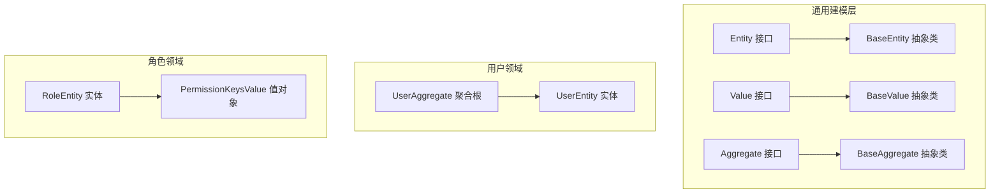
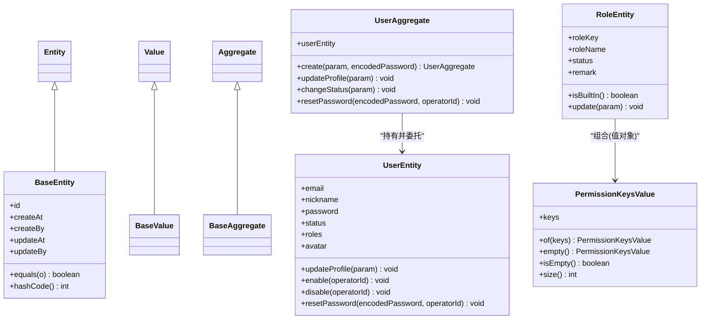
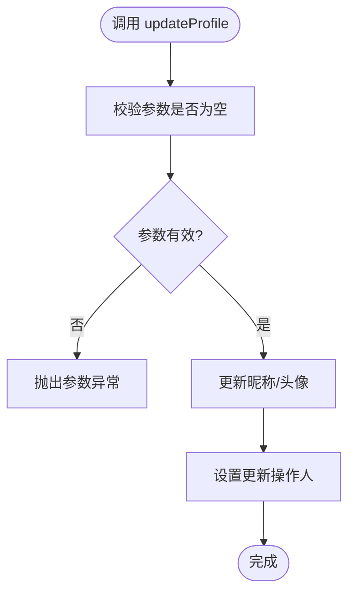
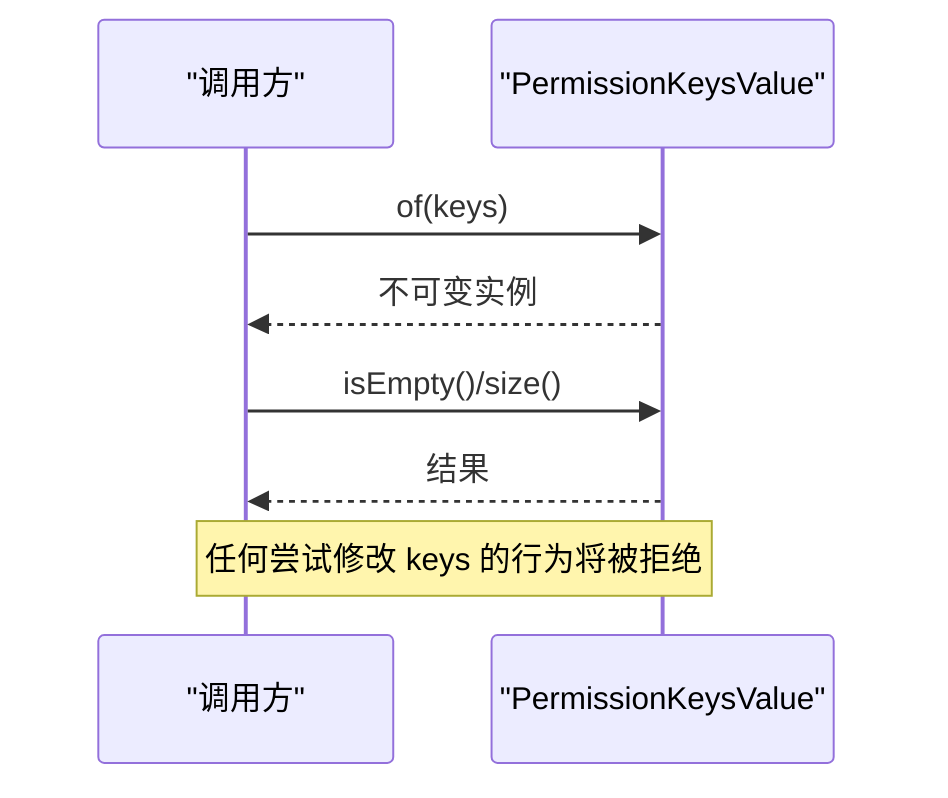
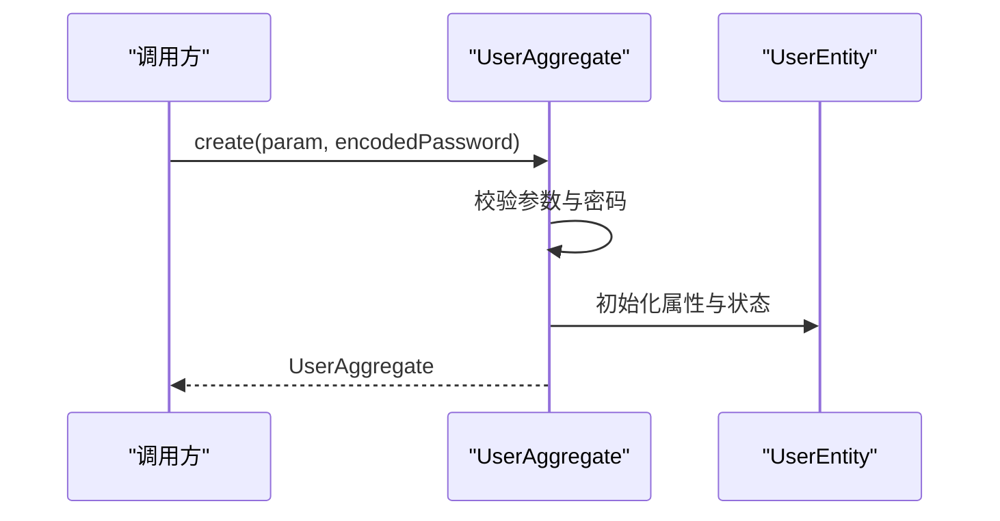
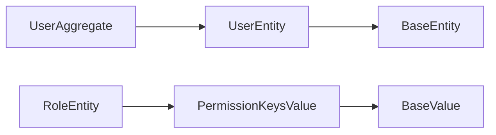

# 实体与值对象

<cite>
**本文引用的文件**   
- [Entity.java](file://src/main/java/com/sunnao/spring/ddd/template/common/model/Entity.java)
- [BaseEntity.java](file://src/main/java/com/sunnao/spring/ddd/template/common/model/BaseEntity.java)
- [Value.java](file://src/main/java/com/sunnao/spring/ddd/template/common/model/Value.java)
- [BaseValue.java](file://src/main/java/com/sunnao/spring/ddd/template/common/model/BaseValue.java)
- [UserEntity.java](file://src/main/java/com/sunnao/spring/ddd/template/domain/system/user/model/entity/UserEntity.java)
- [PermissionKeysValue.java](file://src/main/java/com/sunnao/spring/ddd/template/domain/system/role/model/value/PermissionKeysValue.java)
- [UserAggregate.java](file://src/main/java/com/sunnao/spring/ddd/template/domain/system/user/model/aggregate/UserAggregate.java)
- [RoleEntity.java](file://src/main/java/com/sunnao/spring/ddd/template/domain/system/role/model/entity/RoleEntity.java)
- [Aggregate.java](file://src/main/java/com/sunnao/spring/ddd/template/common/model/Aggregate.java)
- [BaseAggregate.java](file://src/main/java/com/sunnao/spring/ddd/template/common/model/BaseAggregate.java)
</cite>

## 目录
1. [简介](#简介)
2. [项目结构](#项目结构)
3. [核心组件](#核心组件)
4. [架构总览](#架构总览)
5. [详细组件分析](#详细组件分析)
6. [依赖关系分析](#依赖关系分析)
7. [性能考量](#性能考量)
8. [故障排查指南](#故障排查指南)
9. [结论](#结论)
10. [附录](#附录)

## 简介
本指南聚焦于领域模型中的“实体”与“值对象”，结合仓库中 UserEntity、PermissionKeysValue 等具体实现，系统讲解：
- 实体的定义、身份标识机制与生命周期管理
- 值对象的设计模式与不可变性原则
- 以 UserEntity 为例说明属性设计、业务方法封装与状态变更控制
- PermissionKeysValue 的使用场景与设计要点
- Entity/BaseEntity 与 Value/BaseValue 基类的作用与扩展方式
- 实体与值对象的对比分析与使用指导

## 项目结构
围绕实体与值对象的相关代码主要分布在 common.model（通用建模基类）与 domain.system.*（领域模型）两个层次。下图展示与本文相关的核心文件组织关系。

图表来源
- [Entity.java:1-4](file://src/main/java/com/sunnao/spring/ddd/template/common/model/Entity.java#L1-L4)
- [BaseEntity.java:1-44](file://src/main/java/com/sunnao/spring/ddd/template/common/model/BaseEntity.java#L1-L44)
- [Value.java:1-4](file://src/main/java/com/sunnao/spring/ddd/template/common/model/Value.java#L1-L4)
- [BaseValue.java:1-4](file://src/main/java/com/sunnao/spring/ddd/template/common/model/BaseValue.java#L1-L4)
- [Aggregate.java:1-4](file://src/main/java/com/sunnao/spring/ddd/template/common/model/Aggregate.java#L1-L4)
- [BaseAggregate.java:1-5](file://src/main/java/com/sunnao/spring/ddd/template/common/model/BaseAggregate.java#L1-L5)
- [UserAggregate.java:1-113](file://src/main/java/com/sunnao/spring/ddd/template/domain/system/user/model/aggregate/UserAggregate.java#L1-L113)
- [UserEntity.java:1-119](file://src/main/java/com/sunnao/spring/ddd/template/domain/system/user/model/entity/UserEntity.java#L1-L119)
- [RoleEntity.java:1-84](file://src/main/java/com/sunnao/spring/ddd/template/domain/system/role/model/entity/RoleEntity.java#L1-L84)
- [PermissionKeysValue.java:1-43](file://src/main/java/com/sunnao/spring/ddd/template/domain/system/role/model/value/PermissionKeysValue.java#L1-L43)

章节来源
- [Entity.java:1-4](file://src/main/java/com/sunnao/spring/ddd/template/common/model/Entity.java#L1-L4)
- [BaseEntity.java:1-44](file://src/main/java/com/sunnao/spring/ddd/template/common/model/BaseEntity.java#L1-L44)
- [Value.java:1-4](file://src/main/java/com/sunnao/spring/ddd/template/common/model/Value.java#L1-L4)
- [BaseValue.java:1-4](file://src/main/java/com/sunnao/spring/ddd/template/common/model/BaseValue.java#L1-L4)
- [UserEntity.java:1-119](file://src/main/java/com/sunnao/spring/ddd/template/domain/system/user/model/entity/UserEntity.java#L1-L119)
- [PermissionKeysValue.java:1-43](file://src/main/java/com/sunnao/spring/ddd/template/domain/system/role/model/value/PermissionKeysValue.java#L1-L43)
- [UserAggregate.java:1-113](file://src/main/java/com/sunnao/spring/ddd/template/domain/system/user/model/aggregate/UserAggregate.java#L1-L113)
- [RoleEntity.java:1-84](file://src/main/java/com/sunnao/spring/ddd/template/domain/system/role/model/entity/RoleEntity.java#L1-L84)

## 核心组件
- 实体与值对象标记接口
  - Entity：用于标记领域实体类型，便于在仓储、序列化或校验时进行类型识别。
  - Value：用于标记值对象类型，强调其无身份、按值比较的语义。
- 通用基类
  - BaseEntity：提供 id、审计字段（创建/更新时间与操作人），并基于 id 实现 equals/hashCode，确保实体身份一致性。
  - BaseValue：为值对象提供统一继承起点，便于后续扩展不可变性与相等性策略。
- 聚合根与实体
  - UserAggregate：作为用户领域的聚合根，对外暴露创建、更新资料、状态变更、重置密码等用例级方法，内部委托给 UserEntity。
  - UserEntity：承载用户属性与状态变更逻辑，通过业务方法保证状态流转正确性。
- 值对象示例
  - PermissionKeysValue：封装权限 key 集合，采用不可变设计与工厂方法构造，避免外部直接修改内部集合。

章节来源
- [Entity.java:1-4](file://src/main/java/com/sunnao/spring/ddd/template/common/model/Entity.java#L1-L4)
- [Value.java:1-4](file://src/main/java/com/sunnao/spring/ddd/template/common/model/Value.java#L1-L4)
- [BaseEntity.java:1-44](file://src/main/java/com/sunnao/spring/ddd/template/common/model/BaseEntity.java#L1-L44)
- [BaseValue.java:1-4](file://src/main/java/com/sunnao/spring/ddd/template/common/model/BaseValue.java#L1-L4)
- [UserAggregate.java:1-113](file://src/main/java/com/sunnao/spring/ddd/template/domain/system/user/model/aggregate/UserAggregate.java#L1-L113)
- [UserEntity.java:1-119](file://src/main/java/com/sunnao/spring/ddd/template/domain/system/user/model/entity/UserEntity.java#L1-L119)
- [PermissionKeysValue.java:1-43](file://src/main/java/com/sunnao/spring/ddd/template/domain/system/role/model/value/PermissionKeysValue.java#L1-L43)

## 架构总览
下图展示了实体与值对象在领域层中的协作关系，以及聚合根对实体的访问边界。

图表来源
- [Entity.java:1-4](file://src/main/java/com/sunnao/spring/ddd/template/common/model/Entity.java#L1-L4)
- [BaseEntity.java:1-44](file://src/main/java/com/sunnao/spring/ddd/template/common/model/BaseEntity.java#L1-L44)
- [Value.java:1-4](file://src/main/java/com/sunnao/spring/ddd/template/common/model/Value.java#L1-L4)
- [BaseValue.java:1-4](file://src/main/java/com/sunnao/spring/ddd/template/common/model/BaseValue.java#L1-L4)
- [Aggregate.java:1-4](file://src/main/java/com/sunnao/spring/ddd/template/common/model/Aggregate.java#L1-L4)
- [BaseAggregate.java:1-5](file://src/main/java/com/sunnao/spring/ddd/template/common/model/BaseAggregate.java#L1-L5)
- [UserAggregate.java:1-113](file://src/main/java/com/sunnao/spring/ddd/template/domain/system/user/model/aggregate/UserAggregate.java#L1-L113)
- [UserEntity.java:1-119](file://src/main/java/com/sunnao/spring/ddd/template/domain/system/user/model/entity/UserEntity.java#L1-L119)
- [RoleEntity.java:1-84](file://src/main/java/com/sunnao/spring/ddd/template/domain/system/role/model/entity/RoleEntity.java#L1-L84)
- [PermissionKeysValue.java:1-43](file://src/main/java/com/sunnao/spring/ddd/template/domain/system/role/model/value/PermissionKeysValue.java#L1-L43)

## 详细组件分析

### 实体基类与身份标识机制
- 身份标识
  - BaseEntity 通过 id 字段实现 equals/hashCode，确保同一持久化标识的实体在内存中被视为相同对象。
  - 当 id 为空时，equals 返回 false，避免未持久化对象误判相等。
- 审计字段
  - createAt/createBy/updateAt/updateBy 贯穿实体生命周期，记录数据创建与变更上下文。
- 扩展建议
  - 新增实体应继承 BaseEntity，并在构造或初始化时设置审计字段；若需要自定义相等性策略，可在子类重写 equals/hashCode，但需保持与 id 一致的业务约定。

章节来源
- [BaseEntity.java:1-44](file://src/main/java/com/sunnao/spring/ddd/template/common/model/BaseEntity.java#L1-L44)

### 值对象基类与不可变性
- BaseValue 为值对象提供统一继承点，便于后续扩展不可变性与相等性策略。
- 值对象设计要点
  - 不可变性：所有字段声明为 final，不提供 setter，通过工厂方法创建新实例。
  - 相等性：基于值内容实现 equals/hashCode，而非引用。
  - 空值处理：提供 empty 工厂方法，避免 null 传播。
  - 防御性拷贝：对外暴露的集合应为不可变视图，防止外部篡改。

章节来源
- [BaseValue.java:1-4](file://src/main/java/com/sunnao/spring/ddd/template/common/model/BaseValue.java#L1-L4)

### UserEntity 实体详解
- 属性设计
  - 基础信息：邮箱、昵称、头像等描述性属性。
  - 安全相关：加密后的密码字段。
  - 状态：使用枚举表示启用/禁用状态。
  - 跨域数据载体：roles 仅作为查询侧填充的数据载体，不参与用户领域内聚规则。
- 业务方法与状态变更控制
  - updateProfile：校验参数非空且至少一项有效，再更新昵称/头像，并记录操作人。
  - enable/disable：严格的状态机约束，禁止重复启用/禁用，并记录操作人。
  - resetPassword：校验密码非空后更新，并记录操作人。
- 异常与错误码
  - 参数非法或状态不合法时抛出聚合异常，携带错误码与消息，便于上层统一处理。
- 生命周期管理
  - 由 UserAggregate.create 负责初始状态与审计字段的设置；后续变更通过实体方法完成。

图表来源
- [UserEntity.java:60-74](file://src/main/java/com/sunnao/spring/ddd/template/domain/system/user/model/entity/UserEntity.java#L60-L74)

章节来源
- [UserEntity.java:1-119](file://src/main/java/com/sunnao/spring/ddd/template/domain/system/user/model/entity/UserEntity.java#L1-L119)

### PermissionKeysValue 值对象详解
- 设计目标
  - 将角色的权限 key 集合封装为独立值对象，明确表达“一组权限标识”的概念。
- 不可变性实现
  - keys 字段为 final，并通过 Collections.unmodifiableList 包装传入列表，杜绝外部修改。
  - 提供 of 与 empty 工厂方法，统一构造入口，避免 new 带来的不一致。
- 常用能力
  - isEmpty/size 提供便捷判断与统计能力，供领域服务或聚合根使用。
- 使用场景
  - 在角色聚合或领域服务中，作为只读权限集合参与授权决策或输出展示。

图表来源
- [PermissionKeysValue.java:17-42](file://src/main/java/com/sunnao/spring/ddd/template/domain/system/role/model/value/PermissionKeysValue.java#L17-L42)

章节来源
- [PermissionKeysValue.java:1-43](file://src/main/java/com/sunnao/spring/ddd/template/domain/system/role/model/value/PermissionKeysValue.java#L1-L43)

### 聚合根与实体的协作（UserAggregate 与 UserEntity）
- 职责划分
  - UserAggregate：面向用例的编排与校验，如创建用户、变更状态、重置密码；不直接暴露实体属性。
  - UserEntity：承载用户领域内的属性与状态变更规则，确保业务不变式不被破坏。
- 访问边界
  - 外部通过聚合根方法访问实体，避免绕过业务规则直接修改实体属性。
- 典型流程（创建用户）

图表来源
- [UserAggregate.java:38-64](file://src/main/java/com/sunnao/spring/ddd/template/domain/system/user/model/aggregate/UserAggregate.java#L38-L64)
- [UserEntity.java:22-42](file://src/main/java/com/sunnao/spring/ddd/template/domain/system/user/model/entity/UserEntity.java#L22-L42)

章节来源
- [UserAggregate.java:1-113](file://src/main/java/com/sunnao/spring/ddd/template/domain/system/user/model/aggregate/UserAggregate.java#L1-L113)
- [UserEntity.java:1-119](file://src/main/java/com/sunnao/spring/ddd/template/domain/system/user/model/entity/UserEntity.java#L1-L119)

### 角色实体与内置角色保护（RoleEntity）
- 内置角色保护
  - 提供 BUILT_IN_ROLE_KEYS 常量，限制对 admin/user 等内置角色的危险操作（如禁用）。
- 更新规则
  - update 方法校验参数有效性，并对内置角色做特殊保护，同时记录操作人。
- 与值对象的关系
  - 角色可组合 PermissionKeysValue 作为权限集合的值对象，体现“角色拥有若干权限 key”的语义。

章节来源
- [RoleEntity.java:1-84](file://src/main/java/com/sunnao/spring/ddd/template/domain/system/role/model/entity/RoleEntity.java#L1-L84)
- [PermissionKeysValue.java:1-43](file://src/main/java/com/sunnao/spring/ddd/template/domain/system/role/model/value/PermissionKeysValue.java#L1-L43)

## 依赖关系分析
- 耦合与内聚
  - 实体与值对象均位于领域层，低耦合于基础设施与适配层；聚合根作为领域入口，集中协调实体与值对象。
- 直接依赖
  - UserAggregate 依赖 UserEntity；RoleEntity 组合 PermissionKeysValue。
- 间接依赖
  - 实体与值对象依赖通用建模基类（BaseEntity/BaseValue）与领域枚举（如用户状态、角色状态）。
- 潜在风险
  - 避免在实体中引入仓储或服务依赖，保持领域纯度高；如需跨聚合交互，优先通过领域服务或事件。

图表来源
- [UserAggregate.java:1-113](file://src/main/java/com/sunnao/spring/ddd/template/domain/system/user/model/aggregate/UserAggregate.java#L1-L113)
- [UserEntity.java:1-119](file://src/main/java/com/sunnao/spring/ddd/template/domain/system/user/model/entity/UserEntity.java#L1-L119)
- [RoleEntity.java:1-84](file://src/main/java/com/sunnao/spring/ddd/template/domain/system/role/model/entity/RoleEntity.java#L1-L84)
- [PermissionKeysValue.java:1-43](file://src/main/java/com/sunnao/spring/ddd/template/domain/system/role/model/value/PermissionKeysValue.java#L1-L43)
- [BaseEntity.java:1-44](file://src/main/java/com/sunnao/spring/ddd/template/common/model/BaseEntity.java#L1-L44)
- [BaseValue.java:1-4](file://src/main/java/com/sunnao/spring/ddd/template/common/model/BaseValue.java#L1-L4)

章节来源
- [UserAggregate.java:1-113](file://src/main/java/com/sunnao/spring/ddd/template/domain/system/user/model/aggregate/UserAggregate.java#L1-L113)
- [UserEntity.java:1-119](file://src/main/java/com/sunnao/spring/ddd/template/domain/system/user/model/entity/UserEntity.java#L1-L119)
- [RoleEntity.java:1-84](file://src/main/java/com/sunnao/spring/ddd/template/domain/system/role/model/entity/RoleEntity.java#L1-L84)
- [PermissionKeysValue.java:1-43](file://src/main/java/com/sunnao/spring/ddd/template/domain/system/role/model/value/PermissionKeysValue.java#L1-L43)
- [BaseEntity.java:1-44](file://src/main/java/com/sunnao/spring/ddd/template/common/model/BaseEntity.java#L1-L44)
- [BaseValue.java:1-4](file://src/main/java/com/sunnao/spring/ddd/template/common/model/BaseValue.java#L1-L4)

## 性能考量
- 值对象不可变带来的优势
  - 线程安全、易于缓存与共享，减少同步开销。
- 集合包装成本
  - 使用不可变视图（如 unmodifiableList）会带来轻微包装开销，但在领域层通常可接受。
- 实体相等性
  - 基于 id 的 equals/hashCode 计算成本低，适合在集合与缓存中使用。
- 建议
  - 避免在热点路径上频繁创建大型值对象；必要时复用或延迟构造。
  - 谨慎在实体中维护大集合，考虑按需加载或分片查询。

## 故障排查指南
- 常见异常与定位
  - 参数错误：updateProfile/resetPassword 等方法在参数为空或无效时抛出聚合异常，检查调用方传参。
  - 状态不合法：enable/disable 在重复启用/禁用时抛出异常，确认当前状态与目标状态是否一致。
  - 内置角色保护：对 admin 等内置角色执行禁用等操作会触发保护规则，调整操作范围或改用其他角色。
- 调试建议
  - 打印审计字段（updateBy/updateAt）确认操作来源与时间。
  - 在聚合根入口处增加日志，追踪用例执行链路。
  - 对于值对象，检查工厂方法返回值是否为空集合，避免空指针。

章节来源
- [UserEntity.java:60-117](file://src/main/java/com/sunnao/spring/ddd/template/domain/system/user/model/entity/UserEntity.java#L60-L117)
- [RoleEntity.java:62-82](file://src/main/java/com/sunnao/spring/ddd/template/domain/system/role/model/entity/RoleEntity.java#L62-L82)

## 结论
- 实体与值对象在领域模型中各司其职：实体关注身份与状态变更，值对象关注概念与不变性。
- 通过 BaseEntity/BaseValue 统一基类，配合聚合根的访问边界，可有效保障领域不变式与一致性。
- 以 UserEntity 和 PermissionKeysValue 为代表的实践，体现了清晰的职责划分与稳健的错误处理。

## 附录
- 实体与值对象对比与使用指导
  - 何时使用实体
    - 具有唯一身份标识（id）
    - 存在复杂状态与行为
    - 需要持久化与版本控制
  - 何时使用值对象
    - 无身份标识，按值比较
    - 表达清晰的概念（如权限集合、地址、金额）
    - 需要不可变性与线程安全
  - 设计要点
    - 实体：最小暴露面，业务方法封装变更；审计字段完整；相等性基于 id。
    - 值对象：不可变、工厂方法构造、防御性拷贝、简洁相等性。
  - 组合与协作
    - 实体可组合多个值对象，增强语义与安全性。
    - 聚合根协调实体与值对象，对外暴露用例级方法。