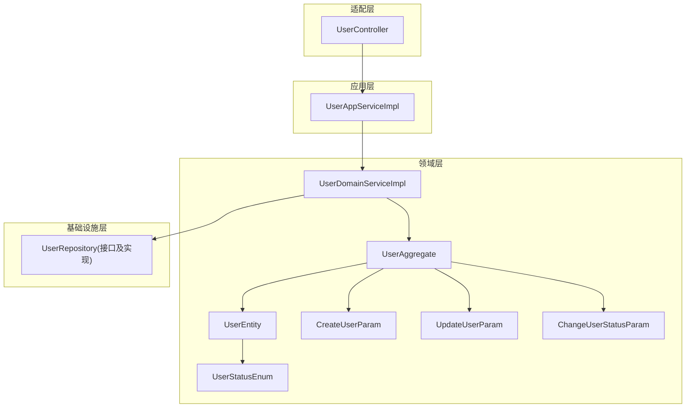
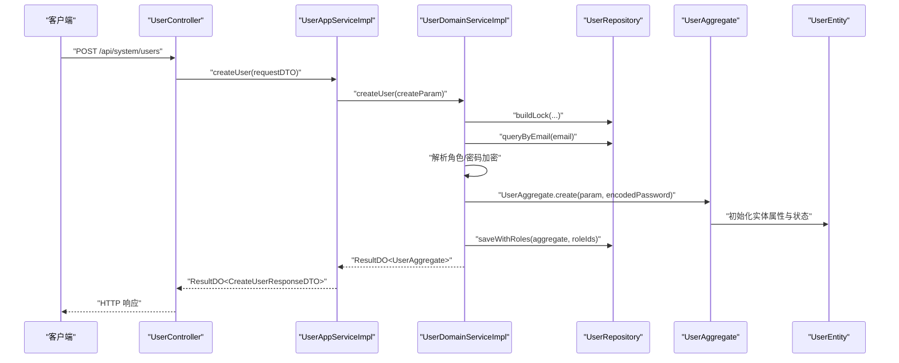
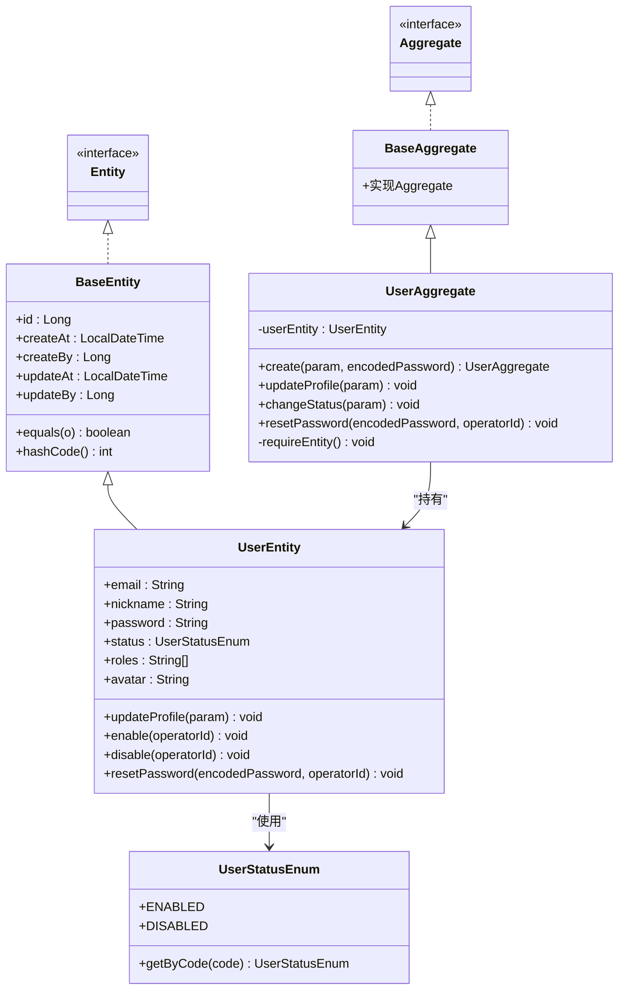
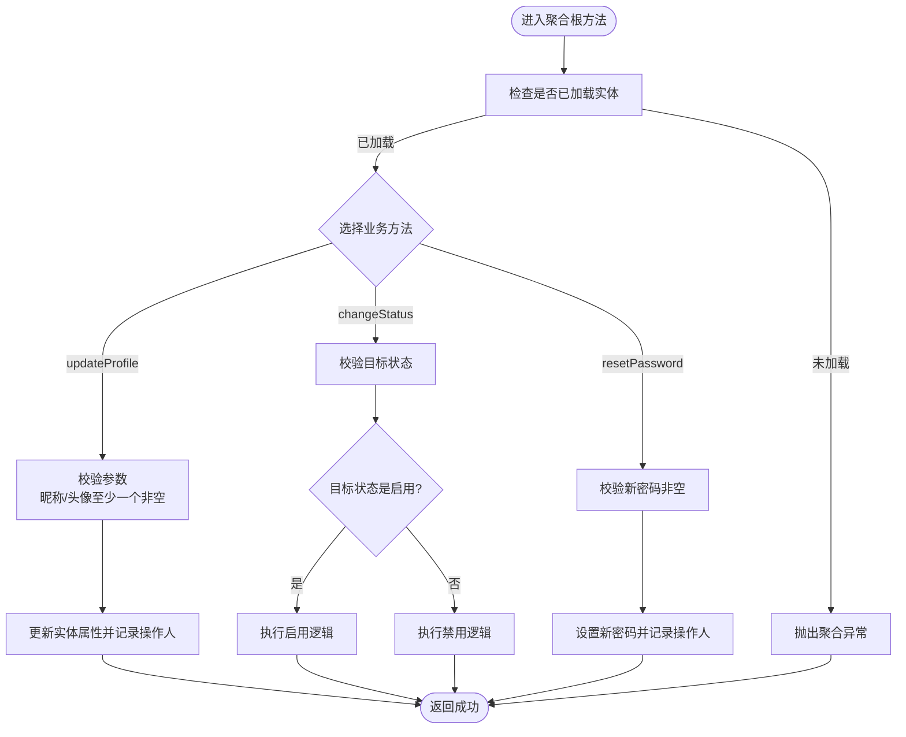
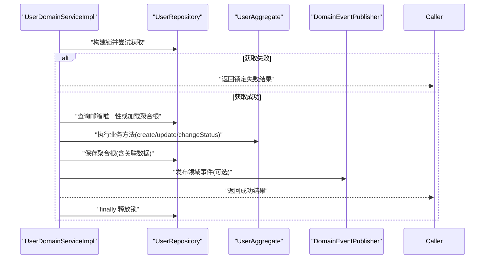
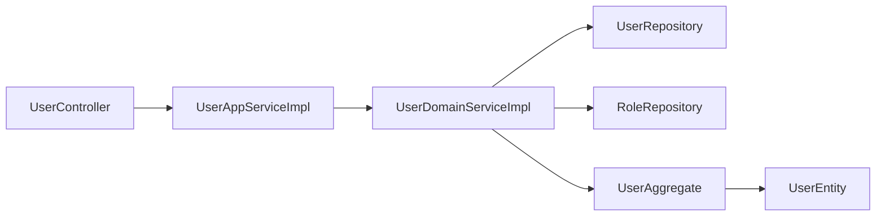

# 聚合根设计

<cite>
**本文引用的文件**
- [BaseAggregate.java](file://src/main/java/com/sunnao/spring/ddd/template/common/model/BaseAggregate.java)
- [Aggregate.java](file://src/main/java/com/sunnao/spring/ddd/template/common/model/Aggregate.java)
- [Entity.java](file://src/main/java/com/sunnao/spring/ddd/template/common/model/Entity.java)
- [BaseEntity.java](file://src/main/java/com/sunnao/spring/ddd/template/common/model/BaseEntity.java)
- [UserAggregate.java](file://src/main/java/com/sunnao/spring/ddd/template/domain/system/user/model/aggregate/UserAggregate.java)
- [UserEntity.java](file://src/main/java/com/sunnao/spring/ddd/template/domain/system/user/model/entity/UserEntity.java)
- [CreateUserParam.java](file://src/main/java/com/sunnao/spring/ddd/template/domain/system/user/model/param/CreateUserParam.java)
- [UpdateUserParam.java](file://src/main/java/com/sunnao/spring/ddd/template/domain/system/user/model/param/UpdateUserParam.java)
- [ChangeUserStatusParam.java](file://src/main/java/com/sunnao/spring/ddd/template/domain/system/user/model/param/ChangeUserStatusParam.java)
- [UserStatusEnum.java](file://src/main/java/com/sunnao/spring/ddd/template/model/system/user/UserStatusEnum.java)
- [UserDomainServiceImpl.java](file://src/main/java/com/sunnao/spring/ddd/template/domain/system/user/service/UserDomainServiceImpl.java)
- [UserAppServiceImpl.java](file://src/main/java/com/sunnao/spring/ddd/template/application/system/user/scenario/UserAppServiceImpl.java)
- [UserController.java](file://src/main/java/com/sunnao/spring/ddd/template/adaptor/system/user/input/UserController.java)
</cite>

## 目录
1. [引言](#引言)
2. [项目结构](#项目结构)
3. [核心组件](#核心组件)
4. [架构总览](#架构总览)
5. [详细组件分析](#详细组件分析)
6. [依赖关系分析](#依赖关系分析)
7. [性能与一致性考量](#性能与一致性考量)
8. [故障排查指南](#故障排查指南)
9. [结论](#结论)
10. [附录：最佳实践清单](#附录最佳实践清单)

## 引言
本文件围绕“聚合根”这一领域驱动设计的核心概念，结合仓库中的用户域实现，系统讲解如何定义聚合边界、保护数据一致性、封装业务逻辑。以 UserAggregate 为例，说明聚合根的创建模式、状态管理、业务方法设计；并介绍 BaseAggregate 基类的使用与扩展方式。同时阐述聚合根与实体的关系，以及如何通过聚合根暴露有限业务接口来保护内部状态。文末提供完整流程的图示与最佳实践建议，帮助读者快速落地可维护、可扩展的领域模型。

## 项目结构
本项目采用分层架构（适配层、应用层、领域层、基础设施层），聚合根位于领域层 model/aggregate 包下，实体位于 model/entity 包下，参数对象位于 model/param 包下。用户域的聚合根为 UserAggregate，其内部持有 UserEntity 作为唯一受保护的领域实体。

图表来源
- [UserController.java:1-115](file://src/main/java/com/sunnao/spring/ddd/template/adaptor/system/user/input/UserController.java#L1-L115)
- [UserAppServiceImpl.java:1-163](file://src/main/java/com/sunnao/spring/ddd/template/application/system/user/scenario/UserAppServiceImpl.java#L1-L163)
- [UserDomainServiceImpl.java:1-204](file://src/main/java/com/sunnao/spring/ddd/template/domain/system/user/service/UserDomainServiceImpl.java#L1-L204)
- [UserAggregate.java:1-113](file://src/main/java/com/sunnao/spring/ddd/template/domain/system/user/model/aggregate/UserAggregate.java#L1-L113)
- [UserEntity.java:1-119](file://src/main/java/com/sunnao/spring/ddd/template/domain/system/user/model/entity/UserEntity.java#L1-L119)
- [CreateUserParam.java:1-48](file://src/main/java/com/sunnao/spring/ddd/template/domain/system/user/model/param/CreateUserParam.java#L1-L48)
- [UpdateUserParam.java:1-36](file://src/main/java/com/sunnao/spring/ddd/template/domain/system/user/model/param/UpdateUserParam.java#L1-L36)
- [ChangeUserStatusParam.java:1-32](file://src/main/java/com/sunnao/spring/ddd/template/domain/system/user/model/param/ChangeUserStatusParam.java#L1-L32)
- [UserStatusEnum.java:1-50](file://src/main/java/com/sunnao/spring/ddd/template/model/system/user/UserStatusEnum.java#L1-L50)

章节来源
- [UserController.java:1-115](file://src/main/java/com/sunnao/spring/ddd/template/adaptor/system/user/input/UserController.java#L1-L115)
- [UserAppServiceImpl.java:1-163](file://src/main/java/com/sunnao/spring/ddd/template/application/system/user/scenario/UserAppServiceImpl.java#L1-L163)
- [UserDomainServiceImpl.java:1-204](file://src/main/java/com/sunnao/spring/ddd/template/domain/system/user/service/UserDomainServiceImpl.java#L1-L204)
- [UserAggregate.java:1-113](file://src/main/java/com/sunnao/spring/ddd/template/domain/system/user/model/aggregate/UserAggregate.java#L1-L113)
- [UserEntity.java:1-119](file://src/main/java/com/sunnao/spring/ddd/template/domain/system/user/model/entity/UserEntity.java#L1-L119)
- [CreateUserParam.java:1-48](file://src/main/java/com/sunnao/spring/ddd/template/domain/system/user/model/param/CreateUserParam.java#L1-L48)
- [UpdateUserParam.java:1-36](file://src/main/java/com/sunnao/spring/ddd/template/domain/system/user/model/param/UpdateUserParam.java#L1-L36)
- [ChangeUserStatusParam.java:1-32](file://src/main/java/com/sunnao/spring/ddd/template/domain/system/user/model/param/ChangeUserStatusParam.java#L1-L32)
- [UserStatusEnum.java:1-50](file://src/main/java/com/sunnao/spring/ddd/template/model/system/user/UserStatusEnum.java#L1-L50)

## 核心组件
- 聚合根接口与基类
  - Aggregate 接口：标记聚合根类型，便于统一识别与扩展。
  - BaseAggregate 抽象基类：实现 Aggregate 接口，可作为所有聚合根的默认基类，便于后续扩展通用能力（如事件收集、审计等）。
- 实体接口与基类
  - Entity 接口：标记实体类型。
  - BaseEntity 抽象基类：提供 id、创建/更新时间、操作人等通用字段，以及基于 id 的 equals/hashCode 实现，保证实体在集合中的行为一致。
- 用户聚合根与实体
  - UserAggregate：用户聚合根，仅持有 UserEntity，对外暴露 create、updateProfile、changeStatus、resetPassword 等业务方法，严格限制对内部状态的直接访问。
  - UserEntity：承载用户属性与状态变更逻辑，由聚合根持有并通过聚合根的方法进行变更。
- 参数与枚举
  - CreateUserParam、UpdateUserParam、ChangeUserStatusParam：用于传递写操作的输入参数。
  - UserStatusEnum：共享的用户状态枚举，供领域与应用层共同使用。

章节来源
- [Aggregate.java:1-4](file://src/main/java/com/sunnao/spring/ddd/template/common/model/Aggregate.java#L1-L4)
- [BaseAggregate.java:1-5](file://src/main/java/com/sunnao/spring/ddd/template/common/model/BaseAggregate.java#L1-L5)
- [Entity.java:1-4](file://src/main/java/com/sunnao/spring/ddd/template/common/model/Entity.java#L1-L4)
- [BaseEntity.java:1-44](file://src/main/java/com/sunnao/spring/ddd/template/common/model/BaseEntity.java#L1-L44)
- [UserAggregate.java:1-113](file://src/main/java/com/sunnao/spring/ddd/template/domain/system/user/model/aggregate/UserAggregate.java#L1-L113)
- [UserEntity.java:1-119](file://src/main/java/com/sunnao/spring/ddd/template/domain/system/user/model/entity/UserEntity.java#L1-L119)
- [CreateUserParam.java:1-48](file://src/main/java/com/sunnao/spring/ddd/template/domain/system/user/model/param/CreateUserParam.java#L1-L48)
- [UpdateUserParam.java:1-36](file://src/main/java/com/sunnao/spring/ddd/template/domain/system/user/model/param/UpdateUserParam.java#L1-L36)
- [ChangeUserStatusParam.java:1-32](file://src/main/java/com/sunnao/spring/ddd/template/domain/system/user/model/param/ChangeUserStatusParam.java#L1-L32)
- [UserStatusEnum.java:1-50](file://src/main/java/com/sunnao/spring/ddd/template/model/system/user/UserStatusEnum.java#L1-L50)

## 架构总览
下图展示了从 HTTP 请求到聚合根执行业务方法的完整调用链，体现“适配层→应用层→领域服务→聚合根→实体”的分层职责与数据流向。

图表来源
- [UserController.java:35-41](file://src/main/java/com/sunnao/spring/ddd/template/adaptor/system/user/input/UserController.java#L35-L41)
- [UserAppServiceImpl.java:40-62](file://src/main/java/com/sunnao/spring/ddd/template/application/system/user/scenario/UserAppServiceImpl.java#L40-L62)
- [UserDomainServiceImpl.java:46-89](file://src/main/java/com/sunnao/spring/ddd/template/domain/system/user/service/UserDomainServiceImpl.java#L46-L89)
- [UserAggregate.java:38-64](file://src/main/java/com/sunnao/spring/ddd/template/domain/system/user/model/aggregate/UserAggregate.java#L38-L64)
- [UserEntity.java:22-58](file://src/main/java/com/sunnao/spring/ddd/template/domain/system/user/model/entity/UserEntity.java#L22-L58)

## 详细组件分析

### 聚合根与实体关系图

图表来源
- [Aggregate.java:1-4](file://src/main/java/com/sunnao/spring/ddd/template/common/model/Aggregate.java#L1-L4)
- [BaseAggregate.java:1-5](file://src/main/java/com/sunnao/spring/ddd/template/common/model/BaseAggregate.java#L1-L5)
- [UserAggregate.java:1-113](file://src/main/java/com/sunnao/spring/ddd/template/domain/system/user/model/aggregate/UserAggregate.java#L1-L113)
- [Entity.java:1-4](file://src/main/java/com/sunnao/spring/ddd/template/common/model/Entity.java#L1-L4)
- [BaseEntity.java:1-44](file://src/main/java/com/sunnao/spring/ddd/template/common/model/BaseEntity.java#L1-L44)
- [UserEntity.java:1-119](file://src/main/java/com/sunnao/spring/ddd/template/domain/system/user/model/entity/UserEntity.java#L1-L119)
- [UserStatusEnum.java:1-50](file://src/main/java/com/sunnao/spring/ddd/template/model/system/user/UserStatusEnum.java#L1-L50)

章节来源
- [UserAggregate.java:1-113](file://src/main/java/com/sunnao/spring/ddd/template/domain/system/user/model/aggregate/UserAggregate.java#L1-L113)
- [UserEntity.java:1-119](file://src/main/java/com/sunnao/spring/ddd/template/domain/system/user/model/entity/UserEntity.java#L1-L119)
- [BaseEntity.java:1-44](file://src/main/java/com/sunnao/spring/ddd/template/common/model/BaseEntity.java#L1-L44)
- [UserStatusEnum.java:1-50](file://src/main/java/com/sunnao/spring/ddd/template/model/system/user/UserStatusEnum.java#L1-L50)

### 聚合根创建模式与状态管理
- 创建模式
  - 通过静态工厂方法 create 完成参数校验、实体构造与初始状态设置，确保聚合根始终处于有效状态。
  - 密码在领域服务中加密后传入，避免明文进入聚合根。
- 状态管理
  - 用户状态通过 changeStatus 方法控制，内部委托给 UserEntity.enable/disable，并在状态流转时进行合法性校验。
  - 更新资料通过 updateProfile 方法，仅允许修改昵称与头像，且至少提供一个非空值。
  - 重置密码通过 resetPassword 方法，要求新密码非空。
- 内部保护
  - requireEntity 私有方法确保聚合根已加载实体后再执行业务方法，防止空实体导致的不一致。

图表来源
- [UserAggregate.java:72-111](file://src/main/java/com/sunnao/spring/ddd/template/domain/system/user/model/aggregate/UserAggregate.java#L72-L111)
- [UserEntity.java:60-117](file://src/main/java/com/sunnao/spring/ddd/template/domain/system/user/model/entity/UserEntity.java#L60-L117)

章节来源
- [UserAggregate.java:38-111](file://src/main/java/com/sunnao/spring/ddd/template/domain/system/user/model/aggregate/UserAggregate.java#L38-L111)
- [UserEntity.java:60-117](file://src/main/java/com/sunnao/spring/ddd/template/domain/system/user/model/entity/UserEntity.java#L60-L117)

### 领域服务编排与持久化
- 标准流程
  - 获取锁（按邮箱或用户ID）防止并发重复创建或覆盖更新。
  - 加载聚合根或进行唯一性校验。
  - 执行业务逻辑（通过聚合根方法）。
  - 持久化变更（仓储保存聚合根及其关联数据）。
  - 发布领域事件（异步消费，失败不影响主流程）。
  - 释放锁。
- 异常处理
  - 捕获业务异常与系统异常，转换为统一结果对象返回，不向上层抛出原始异常。

图表来源
- [UserDomainServiceImpl.java:46-89](file://src/main/java/com/sunnao/spring/ddd/template/domain/system/user/service/UserDomainServiceImpl.java#L46-L89)
- [UserDomainServiceImpl.java:92-121](file://src/main/java/com/sunnao/spring/ddd/template/domain/system/user/service/UserDomainServiceImpl.java#L92-L121)
- [UserDomainServiceImpl.java:124-153](file://src/main/java/com/sunnao/spring/ddd/template/domain/system/user/service/UserDomainServiceImpl.java#L124-L153)
- [UserDomainServiceImpl.java:156-182](file://src/main/java/com/sunnao/spring/ddd/template/domain/system/user/service/UserDomainServiceImpl.java#L156-L182)

章节来源
- [UserDomainServiceImpl.java:46-89](file://src/main/java/com/sunnao/spring/ddd/template/domain/system/user/service/UserDomainServiceImpl.java#L46-L89)
- [UserDomainServiceImpl.java:92-121](file://src/main/java/com/sunnao/spring/ddd/template/domain/system/user/service/UserDomainServiceImpl.java#L92-L121)
- [UserDomainServiceImpl.java:124-153](file://src/main/java/com/sunnao/spring/ddd/template/domain/system/user/service/UserDomainServiceImpl.java#L124-L153)
- [UserDomainServiceImpl.java:156-182](file://src/main/java/com/sunnao/spring/ddd/template/domain/system/user/service/UserDomainServiceImpl.java#L156-L182)

### 应用层编排与外部副作用
- 参数自校验与 DTO 转换
  - 应用服务负责接收请求 DTO，进行自校验，再转换为领域参数对象。
- 外部副作用收敛
  - 禁用或删除成功后，应用层调用会话踢出逻辑，确保旧 token 失效。该副作用不在领域层实现，保持领域纯净。
- 错误传播
  - 将领域服务的结果转换为应用层结果对象返回给适配层。

章节来源
- [UserAppServiceImpl.java:40-62](file://src/main/java/com/sunnao/spring/ddd/template/application/system/user/scenario/UserAppServiceImpl.java#L40-L62)
- [UserAppServiceImpl.java:91-120](file://src/main/java/com/sunnao/spring/ddd/template/application/system/user/scenario/UserAppServiceImpl.java#L91-L120)
- [UserAppServiceImpl.java:123-149](file://src/main/java/com/sunnao/spring/ddd/template/application/system/user/scenario/UserAppServiceImpl.java#L123-L149)

### 适配层职责
- 仅负责接收 HTTP 请求、权限校验、日志注解与参数拼装，禁止编写业务逻辑。
- 调用应用层服务，返回统一结果对象。

章节来源
- [UserController.java:35-41](file://src/main/java/com/sunnao/spring/ddd/template/adaptor/system/user/input/UserController.java#L35-L41)
- [UserController.java:49-54](file://src/main/java/com/sunnao/spring/ddd/template/adaptor/system/user/input/UserController.java#L49-L54)
- [UserController.java:62-67](file://src/main/java/com/sunnao/spring/ddd/template/adaptor/system/user/input/UserController.java#L62-L67)
- [UserController.java:75-80](file://src/main/java/com/sunnao/spring/ddd/template/adaptor/system/user/input/UserController.java#L75-L80)

## 依赖关系分析
- 聚合根与实体
  - UserAggregate 依赖 UserEntity，但不直接暴露实体属性，仅通过业务方法变更状态。
- 领域服务与仓储
  - UserDomainServiceImpl 依赖 UserRepository 进行锁、查询与持久化，同时依赖 RoleRepository 解析角色。
- 应用层与领域层
  - UserAppServiceImpl 依赖 UserDomainService 和 Assembler，负责场景编排与副作用处理。
- 适配层与应用层
  - UserController 仅调用 UserAppService 与 UserQueryAppService，无业务逻辑。

图表来源
- [UserController.java:1-115](file://src/main/java/com/sunnao/spring/ddd/template/adaptor/system/user/input/UserController.java#L1-L115)
- [UserAppServiceImpl.java:1-163](file://src/main/java/com/sunnao/spring/ddd/template/application/system/user/scenario/UserAppServiceImpl.java#L1-L163)
- [UserDomainServiceImpl.java:1-204](file://src/main/java/com/sunnao/spring/ddd/template/domain/system/user/service/UserDomainServiceImpl.java#L1-L204)
- [UserAggregate.java:1-113](file://src/main/java/com/sunnao/spring/ddd/template/domain/system/user/model/aggregate/UserAggregate.java#L1-L113)
- [UserEntity.java:1-119](file://src/main/java/com/sunnao/spring/ddd/template/domain/system/user/model/entity/UserEntity.java#L1-L119)

章节来源
- [UserDomainServiceImpl.java:1-204](file://src/main/java/com/sunnao/spring/ddd/template/domain/system/user/service/UserDomainServiceImpl.java#L1-L204)
- [UserAggregate.java:1-113](file://src/main/java/com/sunnao/spring/ddd/template/domain/system/user/model/aggregate/UserAggregate.java#L1-L113)
- [UserEntity.java:1-119](file://src/main/java/com/sunnao/spring/ddd/template/domain/system/user/model/entity/UserEntity.java#L1-L119)

## 性能与一致性考量
- 并发控制
  - 使用 LevelLock 按邮箱或用户ID加锁，避免重复创建与覆盖更新。
- 事务边界
  - 聚合根持久化与关联数据写入在同一事务内，保证数据一致性。
- 事件解耦
  - 领域事件异步发布，失败不影响主流程，提升吞吐与鲁棒性。
- 最小暴露原则
  - 聚合根仅暴露必要业务方法，减少跨层耦合与误用风险。

[本节为通用指导，无需特定文件引用]

## 故障排查指南
- 常见异常与定位
  - 参数错误：聚合根与实体在参数校验失败时抛出聚合异常，需检查入参是否为空或不符合约束。
  - 状态非法：状态流转不合法时抛出聚合异常，需确认当前状态与目标状态是否符合规则。
  - 数据缺失：聚合根 requireEntity 检查失败表示实体未加载，需检查仓储查询是否正确。
  - 锁定失败：LevelLock.tryLock 失败返回锁定失败结果，需检查锁键设计与并发冲突。
- 日志与追踪
  - 领域服务在各分支记录业务异常与系统异常，便于问题定位。
  - 应用层在系统异常分支记录堆栈，辅助排查。

章节来源
- [UserAggregate.java:107-111](file://src/main/java/com/sunnao/spring/ddd/template/domain/system/user/model/aggregate/UserAggregate.java#L107-L111)
- [UserEntity.java:60-117](file://src/main/java/com/sunnao/spring/ddd/template/domain/system/user/model/entity/UserEntity.java#L60-L117)
- [UserDomainServiceImpl.java:80-88](file://src/main/java/com/sunnao/spring/ddd/template/domain/system/user/service/UserDomainServiceImpl.java#L80-L88)
- [UserDomainServiceImpl.java:112-120](file://src/main/java/com/sunnao/spring/ddd/template/domain/system/user/service/UserDomainServiceImpl.java#L112-L120)
- [UserDomainServiceImpl.java:144-152](file://src/main/java/com/sunnao/spring/ddd/template/domain/system/user/service/UserDomainServiceImpl.java#L144-L152)
- [UserDomainServiceImpl.java:173-181](file://src/main/java/com/sunnao/spring/ddd/template/domain/system/user/service/UserDomainServiceImpl.java#L173-L181)

## 结论
本模板以 UserAggregate 为示例，清晰展示了聚合根的设计要点：通过静态工厂方法创建、通过有限业务方法变更状态、通过实体承载具体属性与规则、通过领域服务编排锁与持久化、通过应用层收敛外部副作用。配合统一的异常与结果对象，形成高内聚、低耦合、易测试的领域模型。遵循上述最佳实践，可在复杂业务中保持领域模型的清晰与稳定。

[本节为总结性内容，无需特定文件引用]

## 附录：最佳实践清单
- 明确聚合边界
  - 将强一致性的相关对象放入同一聚合，避免跨聚合直接引用。
- 保护内部状态
  - 聚合根不暴露实体属性，仅提供业务方法；实体仅在聚合根内部可见。
- 使用静态工厂方法
  - 通过 create 等方法集中校验与初始化，确保对象始终处于有效状态。
- 状态机式变更
  - 状态变更方法内部进行合法性校验，避免非法流转。
- 领域服务编排
  - 在领域服务中处理锁、事务、事件发布等横切关注点，保持聚合根专注业务。
- 应用层收敛副作用
  - 将外部系统交互（如会话踢出）放在应用层，保持领域纯净。
- 统一异常与结果
  - 使用统一的结果对象与错误码，便于上层处理与监控。
- 单元测试与集成测试
  - 针对聚合根的业务方法与领域服务的编排流程编写测试，保障正确性与稳定性。

[本节为通用指导，无需特定文件引用]