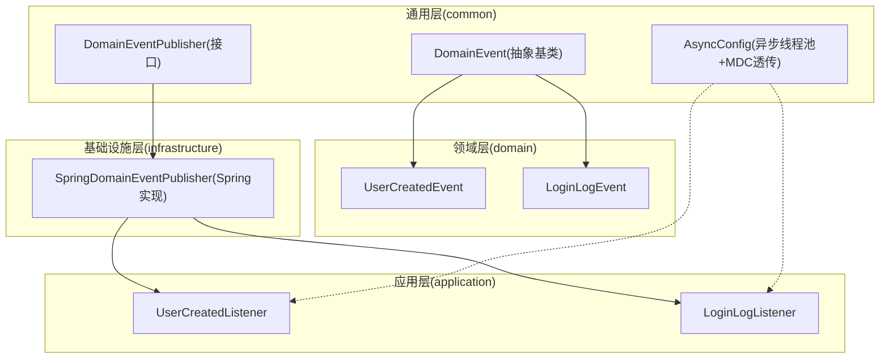
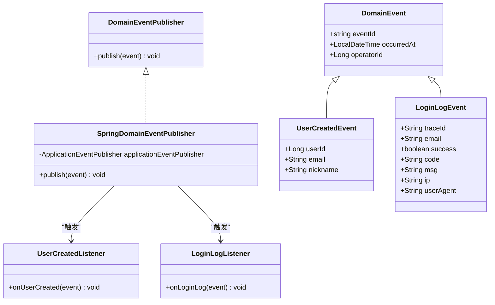
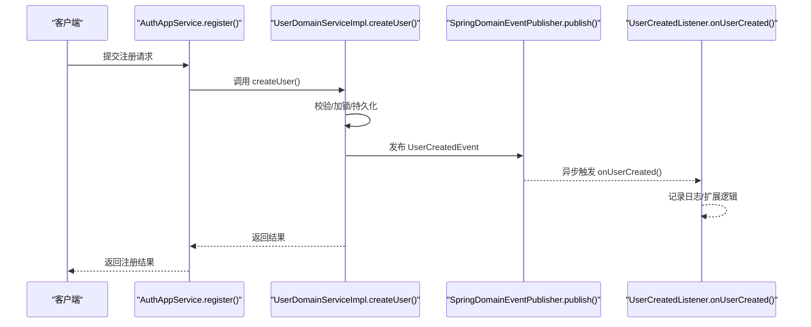
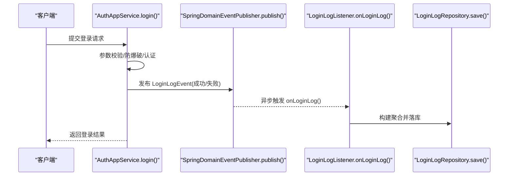
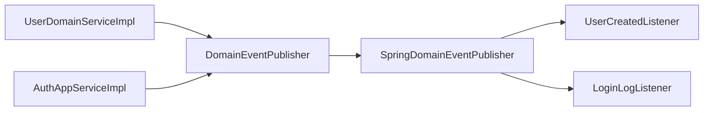

# 领域事件

<cite>
**本文引用的文件**   
- [DomainEvent.java](file://src/main/java/com/sunnao/spring/ddd/template/common/event/DomainEvent.java)
- [DomainEventPublisher.java](file://src/main/java/com/sunnao/spring/ddd/template/common/event/DomainEventPublisher.java)
- [SpringDomainEventPublisher.java](file://src/main/java/com/sunnao/spring/ddd/template/infrastructure/common/SpringDomainEventPublisher.java)
- [UserCreatedEvent.java](file://src/main/java/com/sunnao/spring/ddd/template/domain/system/user/event/UserCreatedEvent.java)
- [LoginLogEvent.java](file://src/main/java/com/sunnao/spring/ddd/template/domain/system/log/event/LoginLogEvent.java)
- [UserCreatedListener.java](file://src/main/java/com/sunnao/spring/ddd/template/application/system/user/listener/UserCreatedListener.java)
- [LoginLogListener.java](file://src/main/java/com/sunnao/spring/ddd/template/application/system/log/listener/LoginLogListener.java)
- [AuthAppServiceImpl.java](file://src/main/java/com/sunnao/spring/ddd/template/application/auth/scenario/AuthAppServiceImpl.java)
- [UserDomainServiceImpl.java](file://src/main/java/com/sunnao/spring/ddd/template/domain/system/user/service/UserDomainServiceImpl.java)
- [AsyncConfig.java](file://src/main/java/com/sunnao/spring/ddd/template/common/config/AsyncConfig.java)
</cite>

## 目录
1. [简介](#简介)
2. [项目结构](#项目结构)
3. [核心组件](#核心组件)
4. [架构总览](#架构总览)
5. [详细组件分析](#详细组件分析)
6. [依赖关系分析](#依赖关系分析)
7. [性能与并发特性](#性能与并发特性)
8. [错误处理与可观测性](#错误处理与可观测性)
9. [最佳实践与规范](#最佳实践与规范)
10. [故障排查指南](#故障排查指南)
11. [结论](#结论)

## 简介
本指南围绕领域事件在 DDD 中的设计与落地，结合仓库中 UserCreatedEvent、LoginLogEvent 的实际实现，系统讲解：
- 领域事件的概念、设计原则与使用场景
- DomainEvent 抽象类与 DomainEventPublisher 接口的设计动机
- SpringDomainEventPublisher 的发布机制与异步消费流程
- 监听器注册与处理流程（基于 Spring @EventListener + @Async）
- 事件命名规范、数据传递设计与错误处理策略
- 完整的事件驱动架构示例与排障建议

## 项目结构
领域事件相关代码分布在 common、domain、application、infrastructure 四层：
- common.event：定义领域事件抽象基类与发布器接口
- domain.*.event：业务域内具体事件定义
- application.*.listener：应用层监听器，负责异步消费并执行业务副作用
- infrastructure.common：Spring 对发布器的实现
- common.config：异步线程池与 MDC 透传配置

图表来源
- [DomainEvent.java:1-46](file://src/main/java/com/sunnao/spring/ddd/template/common/event/DomainEvent.java#L1-L46)
- [DomainEventPublisher.java:1-20](file://src/main/java/com/sunnao/spring/ddd/template/common/event/DomainEventPublisher.java#L1-L20)
- [SpringDomainEventPublisher.java:1-35](file://src/main/java/com/sunnao/spring/ddd/template/infrastructure/common/SpringDomainEventPublisher.java#L1-L35)
- [UserCreatedEvent.java:1-39](file://src/main/java/com/sunnao/spring/ddd/template/domain/system/user/event/UserCreatedEvent.java#L1-L39)
- [LoginLogEvent.java:1-64](file://src/main/java/com/sunnao/spring/ddd/template/domain/system/log/event/LoginLogEvent.java#L1-L64)
- [UserCreatedListener.java:1-31](file://src/main/java/com/sunnao/spring/ddd/template/application/system/user/listener/UserCreatedListener.java#L1-L31)
- [LoginLogListener.java:1-36](file://src/main/java/com/sunnao/spring/ddd/template/application/system/log/listener/LoginLogListener.java#L1-L36)
- [AsyncConfig.java:1-69](file://src/main/java/com/sunnao/spring/ddd/template/common/config/AsyncConfig.java#L1-L69)

章节来源
- [DomainEvent.java:1-46](file://src/main/java/com/sunnao/spring/ddd/template/common/event/DomainEvent.java#L1-L46)
- [DomainEventPublisher.java:1-20](file://src/main/java/com/sunnao/spring/ddd/template/common/event/DomainEventPublisher.java#L1-L20)
- [SpringDomainEventPublisher.java:1-35](file://src/main/java/com/sunnao/spring/ddd/template/infrastructure/common/SpringDomainEventPublisher.java#L1-L35)
- [UserCreatedEvent.java:1-39](file://src/main/java/com/sunnao/spring/ddd/template/domain/system/user/event/UserCreatedEvent.java#L1-L39)
- [LoginLogEvent.java:1-64](file://src/main/java/com/sunnao/spring/ddd/template/domain/system/log/event/LoginLogEvent.java#L1-L64)
- [UserCreatedListener.java:1-31](file://src/main/java/com/sunnao/spring/ddd/template/application/system/user/listener/UserCreatedListener.java#L1-L31)
- [LoginLogListener.java:1-36](file://src/main/java/com/sunnao/spring/ddd/template/application/system/log/listener/LoginLogListener.java#L1-L36)
- [AsyncConfig.java:1-69](file://src/main/java/com/sunnao/spring/ddd/template/common/config/AsyncConfig.java#L1-L69)

## 核心组件
- 领域事件抽象基类 DomainEvent
  - 提供全局唯一 eventId、发生时间 occurredAt、操作人 operatorId 等公共字段，用于追踪与幂等。
  - 不依赖 Spring，便于在各业务模块独立扩展。
- 领域事件发布器接口 DomainEventPublisher
  - 定义 publish(event) 方法；发布失败不抛异常，不影响主流程。
- Spring 实现 SpringDomainEventPublisher
  - 基于 ApplicationEventPublisher 进行进程内广播；捕获异常仅记录日志。
- 具体事件
  - UserCreatedEvent：用户创建成功后发布，携带 userId、email、nickname 等。
  - LoginLogEvent：登录成功/失败后发布，携带 traceId、email、success、code、msg、ip、userAgent 等。
- 监听器
  - UserCreatedListener：异步消费用户创建事件，示例仅记录日志，可扩展邮件、初始化等。
  - LoginLogListener：异步消费登录日志事件，构建聚合根并落库。
- 异步配置 AsyncConfig
  - 统一线程池参数与拒绝策略；通过 TaskDecorator 将 MDC 上下文透传到异步线程。

章节来源
- [DomainEvent.java:1-46](file://src/main/java/com/sunnao/spring/ddd/template/common/event/DomainEvent.java#L1-L46)
- [DomainEventPublisher.java:1-20](file://src/main/java/com/sunnao/spring/ddd/template/common/event/DomainEventPublisher.java#L1-L20)
- [SpringDomainEventPublisher.java:1-35](file://src/main/java/com/sunnao/spring/ddd/template/infrastructure/common/SpringDomainEventPublisher.java#L1-L35)
- [UserCreatedEvent.java:1-39](file://src/main/java/com/sunnao/spring/ddd/template/domain/system/user/event/UserCreatedEvent.java#L1-L39)
- [LoginLogEvent.java:1-64](file://src/main/java/com/sunnao/spring/ddd/template/domain/system/log/event/LoginLogEvent.java#L1-L64)
- [UserCreatedListener.java:1-31](file://src/main/java/com/sunnao/spring/ddd/template/application/system/user/listener/UserCreatedListener.java#L1-L31)
- [LoginLogListener.java:1-36](file://src/main/java/com/sunnao/spring/ddd/template/application/system/log/listener/LoginLogListener.java#L1-L36)
- [AsyncConfig.java:1-69](file://src/main/java/com/sunnao/spring/ddd/template/common/config/AsyncConfig.java#L1-L69)

## 架构总览
下图展示了从“发布”到“异步消费”的端到端流程，以及关键组件之间的依赖关系。

图表来源
- [DomainEvent.java:1-46](file://src/main/java/com/sunnao/spring/ddd/template/common/event/DomainEvent.java#L1-L46)
- [DomainEventPublisher.java:1-20](file://src/main/java/com/sunnao/spring/ddd/template/common/event/DomainEventPublisher.java#L1-L20)
- [SpringDomainEventPublisher.java:1-35](file://src/main/java/com/sunnao/spring/ddd/template/infrastructure/common/SpringDomainEventPublisher.java#L1-L35)
- [UserCreatedEvent.java:1-39](file://src/main/java/com/sunnao/spring/ddd/template/domain/system/user/event/UserCreatedEvent.java#L1-L39)
- [LoginLogEvent.java:1-64](file://src/main/java/com/sunnao/spring/ddd/template/domain/system/log/event/LoginLogEvent.java#L1-L64)
- [UserCreatedListener.java:1-31](file://src/main/java/com/sunnao/spring/ddd/template/application/system/user/listener/UserCreatedListener.java#L1-L31)
- [LoginLogListener.java:1-36](file://src/main/java/com/sunnao/spring/ddd/template/application/system/log/listener/LoginLogListener.java#L1-L36)

## 详细组件分析

### 领域事件抽象与发布器
- DomainEvent
  - 职责：为所有领域事件提供统一的标识、时间与操作人上下文，支撑追踪与幂等。
  - 复杂度：构造 O(1)，序列化开销取决于事件负载大小。
- DomainEventPublisher
  - 职责：解耦发布方与具体实现，允许在不同环境替换实现（如未来迁移至消息中间件）。
- SpringDomainEventPublisher
  - 职责：基于 Spring ApplicationEventPublisher 进行进程内广播；异常吞掉并记录日志，保证主流程稳定。

章节来源
- [DomainEvent.java:1-46](file://src/main/java/com/sunnao/spring/ddd/template/common/event/DomainEvent.java#L1-L46)
- [DomainEventPublisher.java:1-20](file://src/main/java/com/sunnao/spring/ddd/template/common/event/DomainEventPublisher.java#L1-L20)
- [SpringDomainEventPublisher.java:1-35](file://src/main/java/com/sunnao/spring/ddd/template/infrastructure/common/SpringDomainEventPublisher.java#L1-L35)

### 事件定义：UserCreatedEvent 与 LoginLogEvent
- UserCreatedEvent
  - 语义：用户创建完成后的状态变更通知。
  - 载荷：userId、email、nickname、operatorId（来自父类）。
  - 适用场景：发送欢迎邮件、初始化用户偏好、统计指标上报等。
- LoginLogEvent
  - 语义：登录成功或失败的审计事件。
  - 载荷：traceId、email、success、code、msg、ip、userAgent、operatorId（来自父类）。
  - 适用场景：登录日志持久化、风控告警、安全审计。

章节来源
- [UserCreatedEvent.java:1-39](file://src/main/java/com/sunnao/spring/ddd/template/domain/system/user/event/UserCreatedEvent.java#L1-L39)
- [LoginLogEvent.java:1-64](file://src/main/java/com/sunnao/spring/ddd/template/domain/system/log/event/LoginLogEvent.java#L1-L64)

### 事件发布点与调用链

#### 用户创建事件发布流程

图表来源
- [AuthAppServiceImpl.java:116-145](file://src/main/java/com/sunnao/spring/ddd/template/application/auth/scenario/AuthAppServiceImpl.java#L116-L145)
- [UserDomainServiceImpl.java:46-89](file://src/main/java/com/sunnao/spring/ddd/template/domain/system/user/service/UserDomainServiceImpl.java#L46-L89)
- [SpringDomainEventPublisher.java:23-33](file://src/main/java/com/sunnao/spring/ddd/template/infrastructure/common/SpringDomainEventPublisher.java#L23-L33)
- [UserCreatedListener.java:20-29](file://src/main/java/com/sunnao/spring/ddd/template/application/system/user/listener/UserCreatedListener.java#L20-L29)

章节来源
- [AuthAppServiceImpl.java:116-145](file://src/main/java/com/sunnao/spring/ddd/template/application/auth/scenario/AuthAppServiceImpl.java#L116-L145)
- [UserDomainServiceImpl.java:46-89](file://src/main/java/com/sunnao/spring/ddd/template/domain/system/user/service/UserDomainServiceImpl.java#L46-L89)
- [SpringDomainEventPublisher.java:23-33](file://src/main/java/com/sunnao/spring/ddd/template/infrastructure/common/SpringDomainEventPublisher.java#L23-L33)
- [UserCreatedListener.java:20-29](file://src/main/java/com/sunnao/spring/ddd/template/application/system/user/listener/UserCreatedListener.java#L20-L29)

#### 登录日志事件发布流程

图表来源
- [AuthAppServiceImpl.java:67-113](file://src/main/java/com/sunnao/spring/ddd/template/application/auth/scenario/AuthAppServiceImpl.java#L67-L113)
- [AuthAppServiceImpl.java:166-180](file://src/main/java/com/sunnao/spring/ddd/template/application/auth/scenario/AuthAppServiceImpl.java#L166-L180)
- [SpringDomainEventPublisher.java:23-33](file://src/main/java/com/sunnao/spring/ddd/template/infrastructure/common/SpringDomainEventPublisher.java#L23-L33)
- [LoginLogListener.java:25-34](file://src/main/java/com/sunnao/spring/ddd/template/application/system/log/listener/LoginLogListener.java#L25-L34)

章节来源
- [AuthAppServiceImpl.java:67-113](file://src/main/java/com/sunnao/spring/ddd/template/application/auth/scenario/AuthAppServiceImpl.java#L67-L113)
- [AuthAppServiceImpl.java:166-180](file://src/main/java/com/sunnao/spring/ddd/template/application/auth/scenario/AuthAppServiceImpl.java#L166-L180)
- [SpringDomainEventPublisher.java:23-33](file://src/main/java/com/sunnao/spring/ddd/template/infrastructure/common/SpringDomainEventPublisher.java#L23-L33)
- [LoginLogListener.java:25-34](file://src/main/java/com/sunnao/spring/ddd/template/application/system/log/listener/LoginLogListener.java#L25-L34)

### 异步事件处理最佳实践
- 线程池隔离
  - 通过 AsyncConfig 统一配置核心/最大线程数、队列容量与拒绝策略，避免阻塞主线程。
- 链路追踪透传
  - 使用 TaskDecorator 将 MDC 上下文复制到异步线程，确保日志链路完整。
- 幂等与重试
  - 利用事件 eventId 做幂等键；必要时引入重试与死信队列（当前实现为本地进程内，未内置重试）。
- 异常隔离
  - 监听器内部 try-catch 记录错误，避免影响其他监听器与主流程。

章节来源
- [AsyncConfig.java:28-45](file://src/main/java/com/sunnao/spring/ddd/template/common/config/AsyncConfig.java#L28-L45)
- [AsyncConfig.java:50-67](file://src/main/java/com/sunnao/spring/ddd/template/common/config/AsyncConfig.java#L50-L67)
- [UserCreatedListener.java:22-29](file://src/main/java/com/sunnao/spring/ddd/template/application/system/user/listener/UserCreatedListener.java#L22-L29)
- [LoginLogListener.java:27-34](file://src/main/java/com/sunnao/spring/ddd/template/application/system/log/listener/LoginLogListener.java#L27-L34)

## 依赖关系分析
- 耦合度
  - 领域服务与应用场景通过 DomainEventPublisher 接口松耦合；具体实现位于基础设施层。
  - 监听器与事件类型强绑定，但彼此之间无直接依赖，符合观察者模式。
- 外部依赖
  - Spring ApplicationEventPublisher 作为事件总线；MDC 用于链路追踪。
- 潜在循环依赖
  - 当前未发现循环依赖；事件与监听器单向依赖。

图表来源
- [UserDomainServiceImpl.java:46-89](file://src/main/java/com/sunnao/spring/ddd/template/domain/system/user/service/UserDomainServiceImpl.java#L46-L89)
- [AuthAppServiceImpl.java:67-113](file://src/main/java/com/sunnao/spring/ddd/template/application/auth/scenario/AuthAppServiceImpl.java#L67-L113)
- [SpringDomainEventPublisher.java:18-33](file://src/main/java/com/sunnao/spring/ddd/template/infrastructure/common/SpringDomainEventPublisher.java#L18-L33)
- [UserCreatedListener.java:18-29](file://src/main/java/com/sunnao/spring/ddd/template/application/system/user/listener/UserCreatedListener.java#L18-L29)
- [LoginLogListener.java:18-34](file://src/main/java/com/sunnao/spring/ddd/template/application/system/log/listener/LoginLogListener.java#L18-L34)

章节来源
- [UserDomainServiceImpl.java:46-89](file://src/main/java/com/sunnao/spring/ddd/template/domain/system/user/service/UserDomainServiceImpl.java#L46-L89)
- [AuthAppServiceImpl.java:67-113](file://src/main/java/com/sunnao/spring/ddd/template/application/auth/scenario/AuthAppServiceImpl.java#L67-L113)
- [SpringDomainEventPublisher.java:18-33](file://src/main/java/com/sunnao/spring/ddd/template/infrastructure/common/SpringDomainEventPublisher.java#L18-L33)
- [UserCreatedListener.java:18-29](file://src/main/java/com/sunnao/spring/ddd/template/application/system/user/listener/UserCreatedListener.java#L18-L29)
- [LoginLogListener.java:18-34](file://src/main/java/com/sunnao/spring/ddd/template/application/system/log/listener/LoginLogListener.java#L18-L34)

## 性能与并发特性
- 发布路径
  - 同步发布到 ApplicationEventPublisher，随后由 @Async 监听器在独立线程池中执行，避免阻塞主流程。
- 线程池参数
  - 核心线程数、最大线程数、队列容量与拒绝策略在 AsyncConfig 中集中配置，可按压测调优。
- 内存与序列化
  - 事件对象较小，序列化成本可控；注意避免在事件中携带大对象或敏感信息。
- 背压与降级
  - 当队列满时采用 CallerRunsPolicy 回退到调用线程执行，起到天然限流作用；必要时可改为丢弃策略或持久化到磁盘队列。

章节来源
- [AsyncConfig.java:28-45](file://src/main/java/com/sunnao/spring/ddd/template/common/config/AsyncConfig.java#L28-L45)
- [UserCreatedListener.java:20-29](file://src/main/java/com/sunnao/spring/ddd/template/application/system/user/listener/UserCreatedListener.java#L20-L29)
- [LoginLogListener.java:25-34](file://src/main/java/com/sunnao/spring/ddd/template/application/system/log/listener/LoginLogListener.java#L25-L34)

## 错误处理与可观测性
- 发布侧
  - SpringDomainEventPublisher 捕获异常并记录日志，不向上抛出，确保主流程不受影响。
- 消费侧
  - 监听器内部 try-catch 记录错误日志；LoginLogListener 落库失败不影响登录主流程。
- 可观测性
  - 通过 MDC 透传 traceId，跨线程保持链路一致；建议在监听器中输出 eventId、traceId 以便定位问题。

章节来源
- [SpringDomainEventPublisher.java:23-33](file://src/main/java/com/sunnao/spring/ddd/template/infrastructure/common/SpringDomainEventPublisher.java#L23-L33)
- [UserCreatedListener.java:22-29](file://src/main/java/com/sunnao/spring/ddd/template/application/system/user/listener/UserCreatedListener.java#L22-L29)
- [LoginLogListener.java:27-34](file://src/main/java/com/sunnao/spring/ddd/template/application/system/log/listener/LoginLogListener.java#L27-L34)
- [AsyncConfig.java:50-67](file://src/main/java/com/sunnao/spring/ddd/template/common/config/AsyncConfig.java#L50-L67)

## 最佳实践与规范
- 事件命名规范
  - 使用过去式动词短语，表达已发生的领域事实，例如 UserCreatedEvent、LoginLogEvent。
- 数据传递设计
  - 只传递必要的最小数据集；避免包含敏感信息；尽量使用不可变字段。
- 发布时机
  - 在聚合根状态变更且持久化成功后发布；不要在事务外过早发布导致不一致。
- 幂等与去重
  - 使用 eventId 作为幂等键；消费者侧根据 eventId 判断是否重复处理。
- 错误处理策略
  - 发布失败不抛异常；消费失败记录日志并可接入重试/死信；关键路径需考虑补偿。
- 异步边界
  - 明确哪些副作用适合异步（如发邮件、写日志、统计），哪些需要同步（如一致性要求高的写操作）。

[本节为通用指导，不直接分析具体文件]

## 故障排查指南
- 事件未触发
  - 检查监听器是否被 Spring 扫描并注册；确认 @EventListener 注解与方法签名匹配。
- 异步任务未执行
  - 确认 @EnableAsync 生效；查看线程池配置与队列容量；观察是否有 CallerRunsPolicy 导致的阻塞。
- 链路追踪丢失
  - 确认 MDC 透传装饰器已启用；在监听器中打印 traceId 验证。
- 重复消费
  - 检查 eventId 是否唯一；消费者侧是否实现幂等逻辑。
- 性能瓶颈
  - 调整线程池参数；评估监听器耗时；必要时拆分监听器或引入外部消息队列。

章节来源
- [AsyncConfig.java:28-45](file://src/main/java/com/sunnao/spring/ddd/template/common/config/AsyncConfig.java#L28-L45)
- [AsyncConfig.java:50-67](file://src/main/java/com/sunnao/spring/ddd/template/common/config/AsyncConfig.java#L50-L67)
- [UserCreatedListener.java:20-29](file://src/main/java/com/sunnao/spring/ddd/template/application/system/user/listener/UserCreatedListener.java#L20-L29)
- [LoginLogListener.java:25-34](file://src/main/java/com/sunnao/spring/ddd/template/application/system/log/listener/LoginLogListener.java#L25-L34)

## 结论
本项目以简洁清晰的方式实现了领域事件的基础能力：通过 DomainEvent 抽象与 DomainEventPublisher 接口解耦发布与实现，借助 Spring 的 ApplicationEventPublisher 与 @Async 实现进程内异步消费，配合 AsyncConfig 的线程池与 MDC 透传，保证了高可用与可观测性。UserCreatedEvent 与 LoginLogEvent 两个典型用例覆盖了“状态变更通知”和“审计日志”两类常见场景。后续可在现有基础上平滑演进为分布式事件总线，增强可靠性与扩展性。