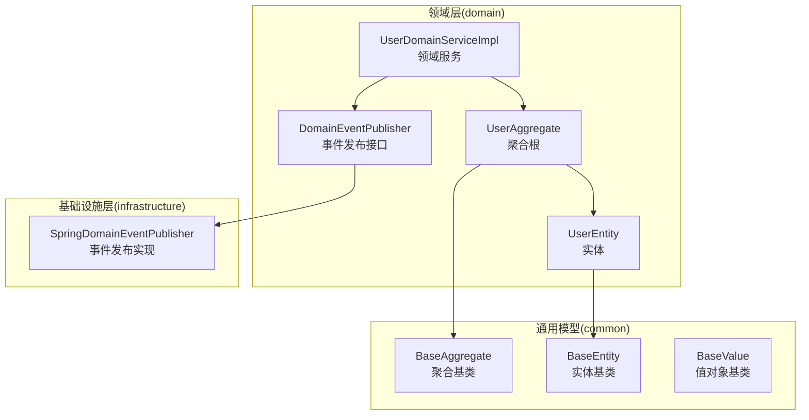
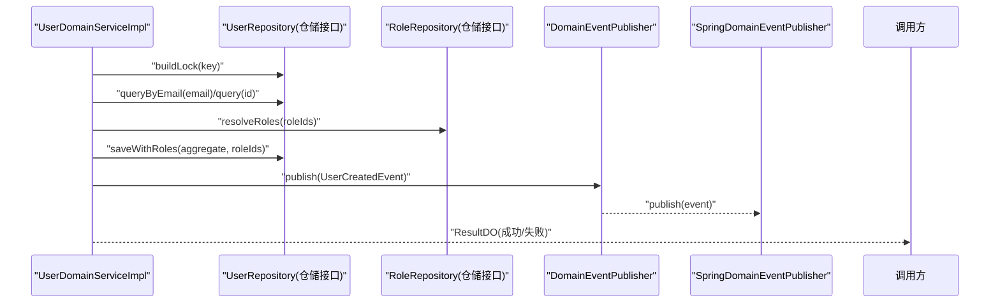
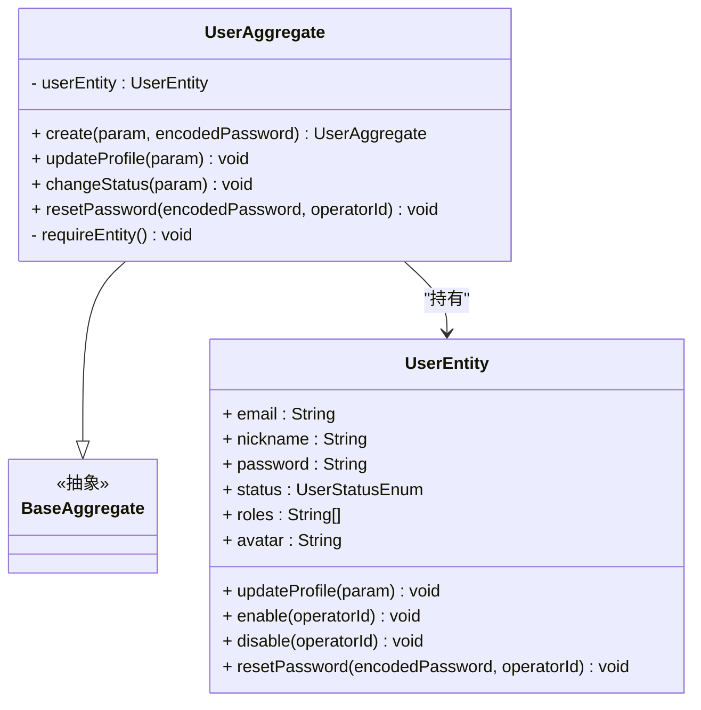
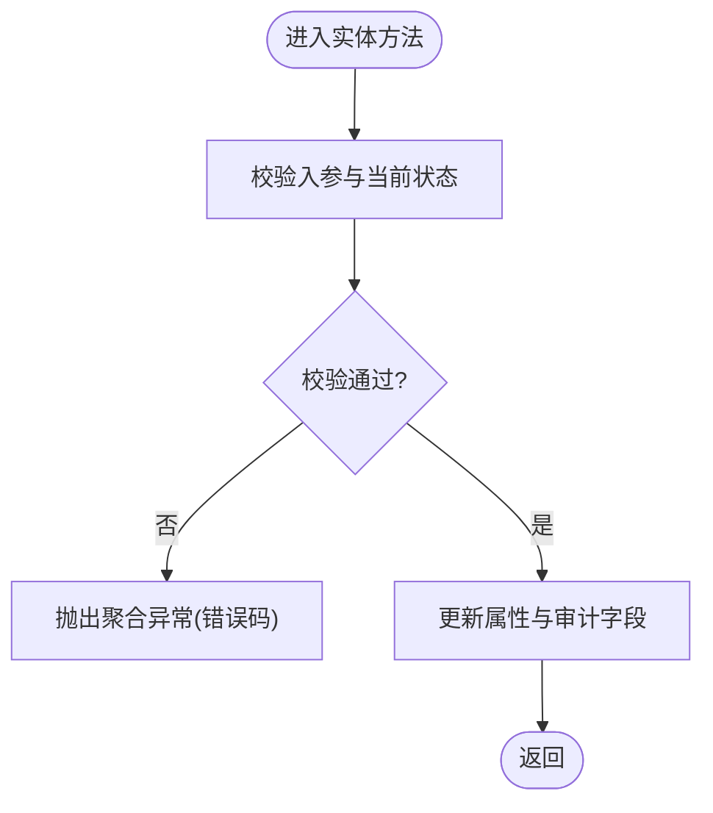
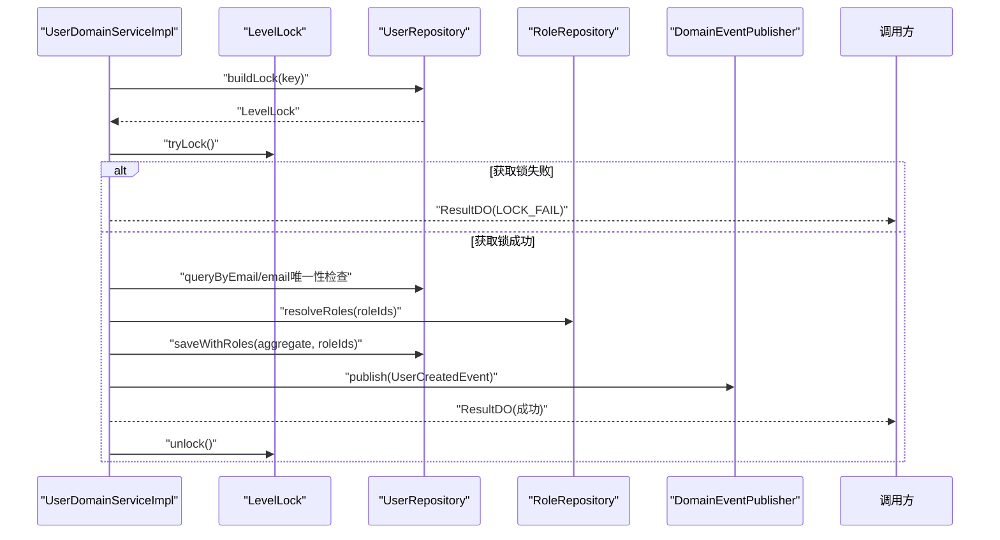
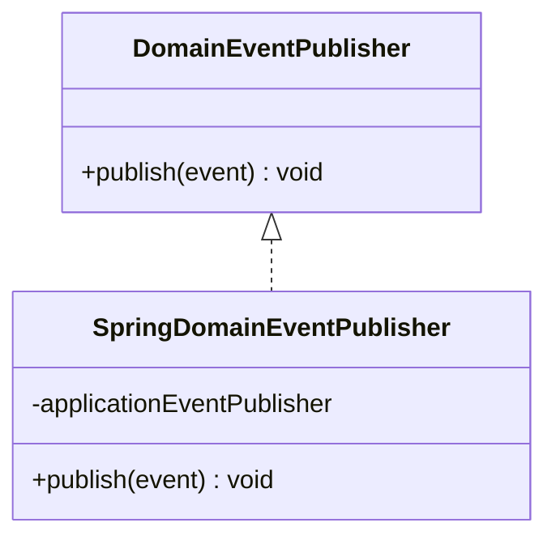
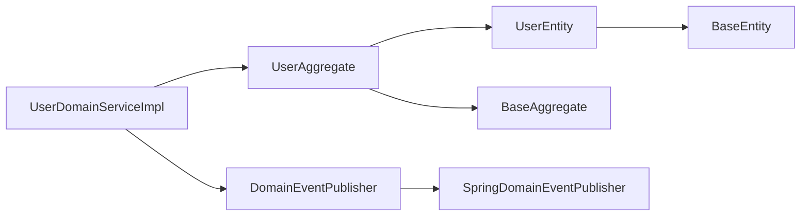

# 领域层开发

<cite>
**本文引用的文件**
- [UserAggregate.java](file://src/main/java/com/sunnao/spring/ddd/template/domain/system/user/model/aggregate/UserAggregate.java)
- [UserEntity.java](file://src/main/java/com/sunnao/spring/ddd/template/domain/system/user/model/entity/UserEntity.java)
- [UserDomainServiceImpl.java](file://src/main/java/com/sunnao/spring/ddd/template/domain/system/user/service/UserDomainServiceImpl.java)
- [BaseAggregate.java](file://src/main/java/com/sunnao/spring/ddd/template/common/model/BaseAggregate.java)
- [BaseEntity.java](file://src/main/java/com/sunnao/spring/ddd/template/common/model/BaseEntity.java)
- [BaseValue.java](file://src/main/java/com/sunnao/spring/ddd/template/common/model/BaseValue.java)
- [DomainEventPublisher.java](file://src/main/java/com/sunnao/spring/ddd/template/common/event/DomainEventPublisher.java)
- [SpringDomainEventPublisher.java](file://src/main/java/com/sunnao/spring/ddd/template/infrastructure/common/SpringDomainEventPublisher.java)
- [README.md](file://README.md)
- [ddd-model-layer.md](file://docs/rule/ddd/ddd-model-layer.md)
</cite>

## 目录
1. [引言](#引言)
2. [项目结构](#项目结构)
3. [核心组件](#核心组件)
4. [架构总览](#架构总览)
5. [详细组件分析](#详细组件分析)
6. [依赖关系分析](#依赖关系分析)
7. [性能考虑](#性能考虑)
8. [故障排查指南](#故障排查指南)
9. [结论](#结论)
10. [附录](#附录)

## 引言
本指南聚焦于领域层的深入开发与落地实践，围绕聚合根设计原则与实现模式、实体定义与生命周期管理、值对象使用场景、领域服务职责边界与跨聚合协调、参数对象的标准化设计、以及领域事件的发布机制与最佳实践展开。以 UserAggregate 为例，系统讲解如何在领域层封装业务逻辑并保护数据一致性，同时提供可操作的流程图与时序图帮助理解关键流程。

## 项目结构
本项目遵循六边形架构与分层规范，领域层位于 domain 包下，按业务域组织（如 system/user），包含 model（聚合根、实体、值对象、参数）、service（领域服务）、repository（仓储接口）。基础设施层在 infrastructure 中提供仓储实现、PO、Converter 等。应用层负责编排与转换，适配器层处理输入输出。

图表来源
- [UserAggregate.java:1-113](file://src/main/java/com/sunnao/spring/ddd/template/domain/system/user/model/aggregate/UserAggregate.java#L1-L113)
- [UserEntity.java:1-119](file://src/main/java/com/sunnao/spring/ddd/template/domain/system/user/model/entity/UserEntity.java#L1-L119)
- [UserDomainServiceImpl.java:1-204](file://src/main/java/com/sunnao/spring/ddd/template/domain/system/user/service/UserDomainServiceImpl.java#L1-L204)
- [DomainEventPublisher.java:1-20](file://src/main/java/com/sunnao/spring/ddd/template/common/event/DomainEventPublisher.java#L1-L20)
- [SpringDomainEventPublisher.java:1-35](file://src/main/java/com/sunnao/spring/ddd/template/infrastructure/common/SpringDomainEventPublisher.java#L1-L35)
- [BaseAggregate.java:1-5](file://src/main/java/com/sunnao/spring/ddd/template/common/model/BaseAggregate.java#L1-L5)
- [BaseEntity.java:1-44](file://src/main/java/com/sunnao/spring/ddd/template/common/model/BaseEntity.java#L1-L44)
- [BaseValue.java:1-4](file://src/main/java/com/sunnao/spring/ddd/template/common/model/BaseValue.java#L1-L4)

章节来源
- [README.md:19-46](file://README.md#L19-L46)

## 核心组件
- 聚合根：UserAggregate 作为用户领域的入口，对外暴露创建、更新资料、变更状态、重置密码等业务方法，内部持有 UserEntity 实体，通过方法约束访问与变更，确保不变式与一致性。
- 实体：UserEntity 承载用户属性与状态变更逻辑，提供 updateProfile、enable、disable、resetPassword 等方法，维护审计字段与状态流转规则。
- 领域服务：UserDomainServiceImpl 负责写模式的完整流程：获取锁 → 加载/构建聚合根 → 执行业务方法 → 持久化 → 释放锁；同时协调跨聚合（角色）与发布领域事件。
- 事件发布：DomainEventPublisher 为领域层提供的无 Spring 依赖的发布接口，具体由 SpringDomainEventPublisher 基于 ApplicationEventPublisher 实现，异步消费且失败不阻塞主流程。
- 基础模型：BaseAggregate、BaseEntity、BaseValue 提供统一的标识、审计字段与相等性比较等通用能力。

章节来源
- [UserAggregate.java:1-113](file://src/main/java/com/sunnao/spring/ddd/template/domain/system/user/model/aggregate/UserAggregate.java#L1-L113)
- [UserEntity.java:1-119](file://src/main/java/com/sunnao/spring/ddd/template/domain/system/user/model/entity/UserEntity.java#L1-L119)
- [UserDomainServiceImpl.java:1-204](file://src/main/java/com/sunnao/spring/ddd/template/domain/system/user/service/UserDomainServiceImpl.java#L1-L204)
- [DomainEventPublisher.java:1-20](file://src/main/java/com/sunnao/spring/ddd/template/common/event/DomainEventPublisher.java#L1-L20)
- [SpringDomainEventPublisher.java:1-35](file://src/main/java/com/sunnao/spring/ddd/template/infrastructure/common/SpringDomainEventPublisher.java#L1-L35)
- [BaseAggregate.java:1-5](file://src/main/java/com/sunnao/spring/ddd/template/common/model/BaseAggregate.java#L1-L5)
- [BaseEntity.java:1-44](file://src/main/java/com/sunnao/spring/ddd/template/common/model/BaseEntity.java#L1-L44)
- [BaseValue.java:1-4](file://src/main/java/com/sunnao/spring/ddd/template/common/model/BaseValue.java#L1-L4)

## 架构总览
领域层通过聚合根与实体封装业务规则，领域服务编排跨聚合操作与外部依赖（如角色查询、事件发布），仓储接口定义数据访问契约，基础设施层实现持久化细节。事件发布采用接口隔离，领域层不感知 Spring 实现，保持纯领域语义。

图表来源
- [UserDomainServiceImpl.java:46-89](file://src/main/java/com/sunnao/spring/ddd/template/domain/system/user/service/UserDomainServiceImpl.java#L46-L89)
- [DomainEventPublisher.java:11-19](file://src/main/java/com/sunnao/spring/ddd/template/common/event/DomainEventPublisher.java#L11-L19)
- [SpringDomainEventPublisher.java:23-33](file://src/main/java/com/sunnao/spring/ddd/template/infrastructure/common/SpringDomainEventPublisher.java#L23-L33)

## 详细组件分析

### 聚合根设计原则与实现模式（UserAggregate）
- 职责边界：聚合根仅暴露业务方法，不直接暴露实体属性；所有变更通过方法进入，保证不变式校验与审计字段填充。
- 构造策略：提供静态工厂方法 create，集中入参校验与初始状态设置，避免非法对象出现。
- 状态变更：updateProfile、changeStatus、resetPassword 等方法委托给实体执行，并在必要时进行前置校验。
- 一致性保护：通过 requireEntity 确保实体存在后再操作，防止空引用导致的异常或脏数据。

图表来源
- [UserAggregate.java:1-113](file://src/main/java/com/sunnao/spring/ddd/template/domain/system/user/model/aggregate/UserAggregate.java#L1-L113)
- [UserEntity.java:1-119](file://src/main/java/com/sunnao/spring/ddd/template/domain/system/user/model/entity/UserEntity.java#L1-L119)
- [BaseAggregate.java:1-5](file://src/main/java/com/sunnao/spring/ddd/template/common/model/BaseAggregate.java#L1-L5)

章节来源
- [UserAggregate.java:38-111](file://src/main/java/com/sunnao/spring/ddd/template/domain/system/user/model/aggregate/UserAggregate.java#L38-L111)

### 实体定义与生命周期管理（UserEntity）
- 属性与状态：email、nickname、password、status、roles、avatar 等；status 受限于枚举，变更需经方法校验。
- 生命周期：创建时由聚合根初始化默认状态与审计字段；更新时通过方法设置 updateBy 与时间戳；删除由仓储侧逻辑删除。
- 不变式：例如 enable/disable 不允许重复切换相同状态；updateProfile 要求至少一个非空字段；resetPassword 要求新密码非空。

图表来源
- [UserEntity.java:60-117](file://src/main/java/com/sunnao/spring/ddd/template/domain/system/user/model/entity/UserEntity.java#L60-L117)

章节来源
- [UserEntity.java:60-117](file://src/main/java/com/sunnao/spring/ddd/template/domain/system/user/model/entity/UserEntity.java#L60-L117)

### 领域服务的职责边界与跨聚合协调（UserDomainServiceImpl）
- 写模式标准流程：获取分布式锁 → 加载/构建聚合根 → 执行业务方法 → 持久化 → 释放锁。
- 跨聚合协调：创建用户时解析角色集合（未指定则授予默认角色），并通过 saveWithRoles 建立用户-角色关联。
- 异常与结果：统一捕获 BizException 与系统异常，转换为 ResultDO 返回，避免向上抛异常。
- 事件发布：创建成功后发布 UserCreatedEvent，交由监听器异步处理，不影响主流程。

图表来源
- [UserDomainServiceImpl.java:46-89](file://src/main/java/com/sunnao/spring/ddd/template/domain/system/user/service/UserDomainServiceImpl.java#L46-L89)

章节来源
- [UserDomainServiceImpl.java:46-89](file://src/main/java/com/sunnao/spring/ddd/template/domain/system/user/service/UserDomainServiceImpl.java#L46-L89)
- [UserDomainServiceImpl.java:92-121](file://src/main/java/com/sunnao/spring/ddd/template/domain/system/user/service/UserDomainServiceImpl.java#L92-L121)
- [UserDomainServiceImpl.java:124-153](file://src/main/java/com/sunnao/spring/ddd/template/domain/system/user/service/UserDomainServiceImpl.java#L124-L153)
- [UserDomainServiceImpl.java:156-182](file://src/main/java/com/sunnao/spring/ddd/template/domain/system/user/service/UserDomainServiceImpl.java#L156-L182)

### 值对象的使用场景与设计模式
- 使用场景：用于表达不可变且具有明确不变式的概念（如权限键集合、状态枚举等）。在本项目中，UserStatusEnum 作为状态值对象被实体与聚合根复用。
- 设计要点：值对象应具备相等性与哈希一致性；在领域层尽量通过方法而非直接赋值修改状态，确保不变式不被破坏。
- 参考规范：model 层共享模型规范强调自包含与禁止向外扩散依赖，值对象应遵循该原则。

章节来源
- [ddd-model-layer.md:1-97](file://docs/rule/ddd/ddd-model-layer.md#L1-L97)
- [BaseValue.java:1-4](file://src/main/java/com/sunnao/spring/ddd/template/common/model/BaseValue.java#L1-L4)

### 参数对象的标准化设计模式
- 创建参数：CreateUserParam 携带邮箱、昵称、头像、角色ID、操作人等，聚合根工厂方法集中校验与初始化。
- 更新参数：UpdateUserParam 与 ChangeUserStatusParam 分别用于资料更新与状态变更，实体方法内做最小必要校验。
- 删除参数：DeleteUserParam 携带用户ID与操作人，领域服务负责加载聚合根并触发逻辑删除。
- 查询参数：UserQuery 用于读模式查询条件，遵循只读、无副作用原则。

章节来源
- [UserAggregate.java:38-64](file://src/main/java/com/sunnao/spring/ddd/template/domain/system/user/model/aggregate/UserAggregate.java#L38-L64)
- [UserEntity.java:60-74](file://src/main/java/com/sunnao/spring/ddd/template/domain/system/user/model/entity/UserEntity.java#L60-L74)
- [UserDomainServiceImpl.java:156-182](file://src/main/java/com/sunnao/spring/ddd/template/domain/system/user/service/UserDomainServiceImpl.java#L156-L182)

### 领域事件的发布机制与最佳实践
- 发布接口：DomainEventPublisher 定义 publish(event)，领域服务可直接注入使用，不依赖 Spring。
- 实现方式：SpringDomainEventPublisher 基于 ApplicationEventPublisher 广播事件，监听器 @Async 异步消费；发布失败记录日志且不抛异常，不影响主流程。
- 最佳实践：
  - 事件内容应最小化，仅包含必要的上下文信息。
  - 监听器幂等设计，避免重复消费导致的数据不一致。
  - 对重要事件增加重试与补偿机制（可在基础设施层扩展）。

图表来源
- [DomainEventPublisher.java:11-19](file://src/main/java/com/sunnao/spring/ddd/template/common/event/DomainEventPublisher.java#L11-L19)
- [SpringDomainEventPublisher.java:16-33](file://src/main/java/com/sunnao/spring/ddd/template/infrastructure/common/SpringDomainEventPublisher.java#L16-L33)

章节来源
- [UserDomainServiceImpl.java:75-78](file://src/main/java/com/sunnao/spring/ddd/template/domain/system/user/service/UserDomainServiceImpl.java#L75-L78)
- [SpringDomainEventPublisher.java:23-33](file://src/main/java/com/sunnao/spring/ddd/template/infrastructure/common/SpringDomainEventPublisher.java#L23-L33)

## 依赖关系分析
- 聚合根依赖实体与基础聚合类型；实体继承基础实体类型，获得标识与审计字段。
- 领域服务依赖仓储接口与事件发布接口，不直接依赖基础设施实现，符合依赖倒置原则。
- 事件发布接口位于 common 层，实现位于 infrastructure 层，领域层保持技术无关。

图表来源
- [UserAggregate.java:1-113](file://src/main/java/com/sunnao/spring/ddd/template/domain/system/user/model/aggregate/UserAggregate.java#L1-L113)
- [UserEntity.java:1-119](file://src/main/java/com/sunnao/spring/ddd/template/domain/system/user/model/entity/UserEntity.java#L1-L119)
- [UserDomainServiceImpl.java:1-204](file://src/main/java/com/sunnao/spring/ddd/template/domain/system/user/service/UserDomainServiceImpl.java#L1-L204)
- [DomainEventPublisher.java:1-20](file://src/main/java/com/sunnao/spring/ddd/template/common/event/DomainEventPublisher.java#L1-L20)
- [SpringDomainEventPublisher.java:1-35](file://src/main/java/com/sunnao/spring/ddd/template/infrastructure/common/SpringDomainEventPublisher.java#L1-L35)
- [BaseAggregate.java:1-5](file://src/main/java/com/sunnao/spring/ddd/template/common/model/BaseAggregate.java#L1-L5)
- [BaseEntity.java:1-44](file://src/main/java/com/sunnao/spring/ddd/template/common/model/BaseEntity.java#L1-L44)

章节来源
- [README.md:19-46](file://README.md#L19-L46)

## 性能考虑
- 分布式锁粒度：按邮箱或用户ID加锁，避免热点冲突；锁范围尽量小，减少等待时间。
- 事件异步消费：发布事件不阻塞主流程，降低写路径延迟。
- 批量操作：角色解析与保存使用批量接口，减少往返次数。
- 缓存与只读：读模式不使用聚合根状态变更，可通过仓储优化查询性能。

[本节为通用指导，无需特定文件来源]

## 故障排查指南
- 锁失败：当 tryLock 返回失败时，领域服务返回 LOCK_FAIL；检查锁键是否合理、是否存在并发热点。
- 业务异常：BizException 会被捕获并转为 ResultDO；查看错误码与消息定位问题。
- 事件发布失败：SpringDomainEventPublisher 捕获异常并记录日志；检查监听器配置与异步线程池。
- 数据不存在：聚合根 requireEntity 与仓储 query 返回空时，返回 USER_NOT_FOUND；确认加载逻辑与事务边界。

章节来源
- [UserDomainServiceImpl.java:46-89](file://src/main/java/com/sunnao/spring/ddd/template/domain/system/user/service/UserDomainServiceImpl.java#L46-L89)
- [UserDomainServiceImpl.java:92-121](file://src/main/java/com/sunnao/spring/ddd/template/domain/system/user/service/UserDomainServiceImpl.java#L92-L121)
- [UserDomainServiceImpl.java:124-153](file://src/main/java/com/sunnao/spring/ddd/template/domain/system/user/service/UserDomainServiceImpl.java#L124-L153)
- [UserDomainServiceImpl.java:156-182](file://src/main/java/com/sunnao/spring/ddd/template/domain/system/user/service/UserDomainServiceImpl.java#L156-L182)
- [SpringDomainEventPublisher.java:23-33](file://src/main/java/com/sunnao/spring/ddd/template/infrastructure/common/SpringDomainEventPublisher.java#L23-L33)

## 结论
通过聚合根与实体的严格封装、领域服务的标准写模式流程、以及事件发布的解耦机制，领域层能够有效保护业务一致性与可维护性。结合参数对象的标准化设计与值对象的不可变性，可以显著提升代码可读性与健壮性。建议在新增业务模块时沿用本指南的模式与约定，确保团队一致性与演进可控。

[本节为总结，无需特定文件来源]

## 附录
- 快速开始与多环境配置请参考 README 中的说明。
- 新增业务模块的步骤与包结构建议参见 README 的“如何新增业务模块”部分。

章节来源
- [README.md:47-83](file://README.md#L47-L83)
- [README.md:148-168](file://README.md#L148-L168)