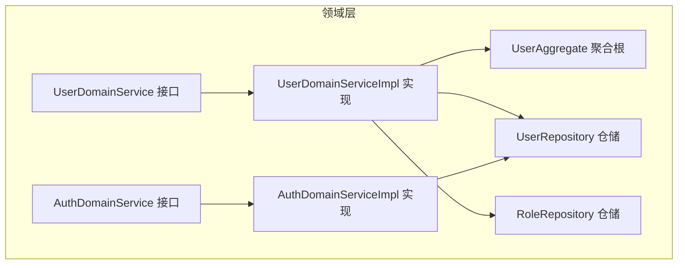
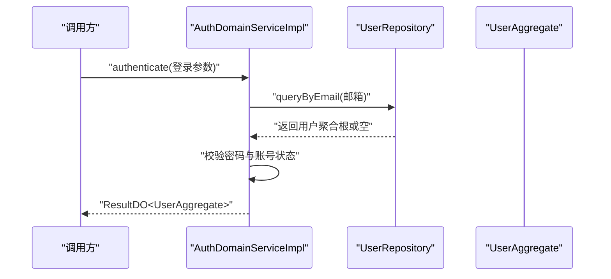
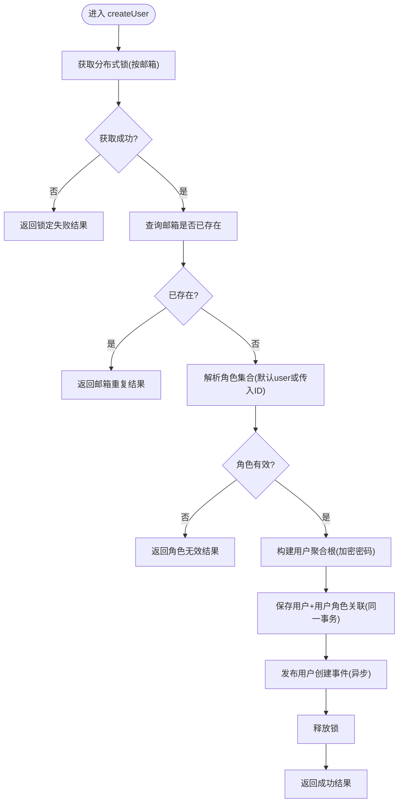
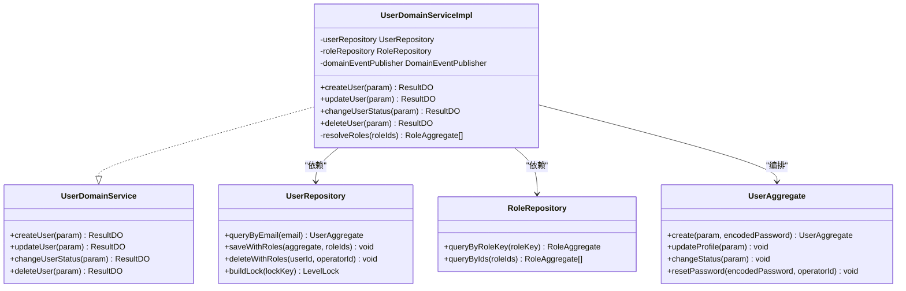
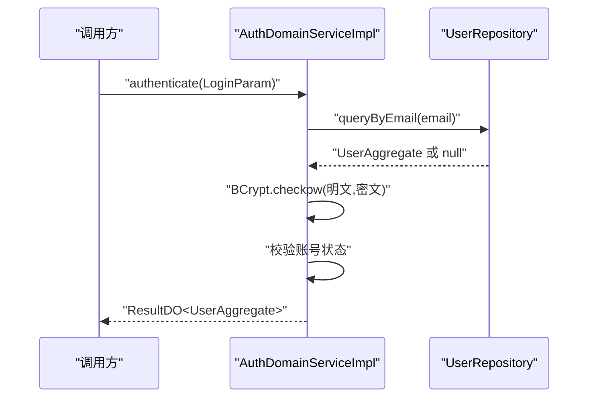
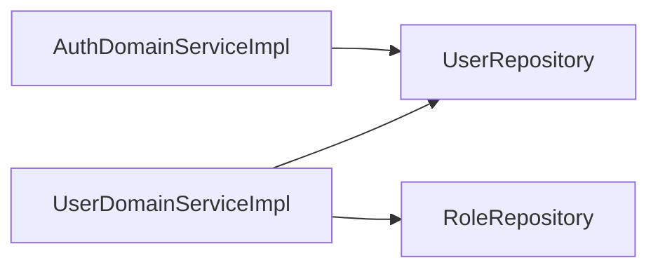

# 领域服务

<cite>
**本文引用的文件列表**
- [DomainService.java](file://src/main/java/com/sunnao/spring/ddd/template/common/service/DomainService.java)
- [UserDomainService.java](file://src/main/java/com/sunnao/spring/ddd/template/domain/system/user/service/UserDomainService.java)
- [UserDomainServiceImpl.java](file://src/main/java/com/sunnao/spring/ddd/template/domain/system/user/service/UserDomainServiceImpl.java)
- [AuthDomainService.java](file://src/main/java/com/sunnao/spring/ddd/template/domain/auth/service/AuthDomainService.java)
- [AuthDomainServiceImpl.java](file://src/main/java/com/sunnao/spring/ddd/template/domain/auth/service/AuthDomainServiceImpl.java)
- [UserAggregate.java](file://src/main/java/com/sunnao/spring/ddd/template/domain/system/user/model/aggregate/UserAggregate.java)
- [UserRepository.java](file://src/main/java/com/sunnao/spring/ddd/template/domain/system/user/repository/UserRepository.java)
- [RoleRepository.java](file://src/main/java/com/sunnao/spring/ddd/template/domain/system/role/repository/RoleRepository.java)
</cite>

## 目录
1. [简介](#简介)
2. [项目结构](#项目结构)
3. [核心组件](#核心组件)
4. [架构总览](#架构总览)
5. [详细组件分析](#详细组件分析)
6. [依赖关系分析](#依赖关系分析)
7. [性能与并发优化](#性能与并发优化)
8. [事务处理](#事务处理)
9. [异常处理](#异常处理)
10. [结论](#结论)
11. [附录：扩展指南](#附录扩展指南)

## 简介
本文件聚焦于“领域服务”的职责边界、适用场景与实现模式，结合 UserDomainServiceImpl 与 AuthDomainServiceImpl 两个典型示例，系统阐述：
- 何时使用领域服务而非在聚合根中实现逻辑（跨聚合协调、复杂编排）
- 领域服务与聚合根的关系与协作方式
- DomainService 接口的设计与扩展方式
- 领域服务中的事务、异常与性能优化建议

## 项目结构
领域服务位于 domain 层，负责编排聚合根与仓储的交互，封装跨聚合的业务流程。用户域与认证域分别提供领域服务接口与实现，并通过仓储访问持久化能力。

图表来源
- [UserDomainService.java:1-50](file://src/main/java/com/sunnao/spring/ddd/template/domain/system/user/service/UserDomainService.java#L1-L50)
- [UserDomainServiceImpl.java:1-204](file://src/main/java/com/sunnao/spring/ddd/template/domain/system/user/service/UserDomainServiceImpl.java#L1-L204)
- [AuthDomainService.java:1-24](file://src/main/java/com/sunnao/spring/ddd/template/domain/auth/service/AuthDomainService.java#L1-L24)
- [AuthDomainServiceImpl.java:1-58](file://src/main/java/com/sunnao/spring/ddd/template/domain/auth/service/AuthDomainServiceImpl.java#L1-L58)
- [UserAggregate.java:1-113](file://src/main/java/com/sunnao/spring/ddd/template/domain/system/user/model/aggregate/UserAggregate.java#L1-L113)
- [UserRepository.java:1-65](file://src/main/java/com/sunnao/spring/ddd/template/domain/system/user/repository/UserRepository.java#L1-L65)
- [RoleRepository.java:1-119](file://src/main/java/com/sunnao/spring/ddd/template/domain/system/role/repository/RoleRepository.java#L1-L119)

章节来源
- [UserDomainService.java:1-50](file://src/main/java/com/sunnao/spring/ddd/template/domain/system/user/service/UserDomainService.java#L1-L50)
- [UserDomainServiceImpl.java:1-204](file://src/main/java/com/sunnao/spring/ddd/template/domain/system/user/service/UserDomainServiceImpl.java#L1-L204)
- [AuthDomainService.java:1-24](file://src/main/java/com/sunnao/spring/ddd/template/domain/auth/service/AuthDomainService.java#L1-L24)
- [AuthDomainServiceImpl.java:1-58](file://src/main/java/com/sunnao/spring/ddd/template/domain/auth/service/AuthDomainServiceImpl.java#L1-L58)
- [UserAggregate.java:1-113](file://src/main/java/com/sunnao/spring/ddd/template/domain/system/user/model/aggregate/UserAggregate.java#L1-L113)
- [UserRepository.java:1-65](file://src/main/java/com/sunnao/spring/ddd/template/domain/system/user/repository/UserRepository.java#L1-L65)
- [RoleRepository.java:1-119](file://src/main/java/com/sunnao/spring/ddd/template/domain/system/role/repository/RoleRepository.java#L1-L119)

## 核心组件
- 领域服务基接口：定义领域服务的统一契约，便于扩展与替换。
- 用户领域服务：封装用户创建、更新、状态变更、删除等写操作，协调用户聚合与角色聚合。
- 认证领域服务：封装登录认证的核心业务（凭证校验、账号状态校验），不感知会话 token 技术细节。

章节来源
- [DomainService.java:1-4](file://src/main/java/com/sunnao/spring/ddd/template/common/service/DomainService.java#L1-L4)
- [UserDomainService.java:1-50](file://src/main/java/com/sunnao/spring/ddd/template/domain/system/user/service/UserDomainService.java#L1-L50)
- [AuthDomainService.java:1-24](file://src/main/java/com/sunnao/spring/ddd/template/domain/auth/service/AuthDomainService.java#L1-L24)

## 架构总览
领域服务作为“跨聚合编排者”，通过仓储加载聚合根，调用聚合根方法维护一致性，再落库并可能发布领域事件。认证领域服务则专注于身份验证流程，屏蔽底层安全框架细节。

图表来源
- [AuthDomainServiceImpl.java:1-58](file://src/main/java/com/sunnao/spring/ddd/template/domain/auth/service/AuthDomainServiceImpl.java#L1-L58)
- [UserRepository.java:1-65](file://src/main/java/com/sunnao/spring/ddd/template/domain/system/user/repository/UserRepository.java#L1-L65)
- [UserAggregate.java:1-113](file://src/main/java/com/sunnao/spring/ddd/template/domain/system/user/model/aggregate/UserAggregate.java#L1-L113)

## 详细组件分析

### 用户领域服务（UserDomainServiceImpl）
职责边界
- 跨聚合协调：创建用户时解析角色集合，保存用户及用户-角色关联；删除用户时清理关联。
- 复杂业务编排：加锁防重、唯一性校验、默认角色分配、事件发布。
- 与聚合根协作：通过聚合根方法完成数据变更（如修改资料、状态切换）。

关键流程（以创建用户为例）
- 获取分布式锁（按邮箱）
- 邮箱唯一性校验
- 解析角色（未指定则分配默认 user 角色）
- 构建聚合根并持久化（含用户-角色关联）
- 发布领域事件（异步）
- 释放锁

图表来源
- [UserDomainServiceImpl.java:46-89](file://src/main/java/com/sunnao/spring/ddd/template/domain/system/user/service/UserDomainServiceImpl.java#L46-L89)
- [UserRepository.java:31-37](file://src/main/java/com/sunnao/spring/ddd/template/domain/system/user/repository/UserRepository.java#L31-L37)
- [RoleRepository.java:29-38](file://src/main/java/com/sunnao/spring/ddd/template/domain/system/role/repository/RoleRepository.java#L29-L38)

章节来源
- [UserDomainServiceImpl.java:1-204](file://src/main/java/com/sunnao/spring/ddd/template/domain/system/user/service/UserDomainServiceImpl.java#L1-L204)
- [UserRepository.java:1-65](file://src/main/java/com/sunnao/spring/ddd/template/domain/system/user/repository/UserRepository.java#L1-L65)
- [RoleRepository.java:1-119](file://src/main/java/com/sunnao/spring/ddd/template/domain/system/role/repository/RoleRepository.java#L1-L119)

#### 对象关系图（用户领域）

图表来源
- [UserDomainService.java:1-50](file://src/main/java/com/sunnao/spring/ddd/template/domain/system/user/service/UserDomainService.java#L1-L50)
- [UserDomainServiceImpl.java:1-204](file://src/main/java/com/sunnao/spring/ddd/template/domain/system/user/service/UserDomainServiceImpl.java#L1-L204)
- [UserAggregate.java:1-113](file://src/main/java/com/sunnao/spring/ddd/template/domain/system/user/model/aggregate/UserAggregate.java#L1-L113)
- [UserRepository.java:1-65](file://src/main/java/com/sunnao/spring/ddd/template/domain/system/user/repository/UserRepository.java#L1-L65)
- [RoleRepository.java:1-119](file://src/main/java/com/sunnao/spring/ddd/template/domain/system/role/repository/RoleRepository.java#L1-L119)

### 认证领域服务（AuthDomainServiceImpl）
职责边界
- 仅关注认证核心逻辑：根据邮箱加载用户、校验密码、校验账号状态。
- 不感知会话 token 技术细节（由应用层收敛 Sa-Token 调用）。
- 统一异常捕获与错误码转换，避免向上抛出系统异常。

图表来源
- [AuthDomainServiceImpl.java:1-58](file://src/main/java/com/sunnao/spring/ddd/template/domain/auth/service/AuthDomainServiceImpl.java#L1-L58)
- [UserRepository.java:22-28](file://src/main/java/com/sunnao/spring/ddd/template/domain/system/user/repository/UserRepository.java#L22-L28)

章节来源
- [AuthDomainService.java:1-24](file://src/main/java/com/sunnao/spring/ddd/template/domain/auth/service/AuthDomainService.java#L1-L24)
- [AuthDomainServiceImpl.java:1-58](file://src/main/java/com/sunnao/spring/ddd/template/domain/auth/service/AuthDomainServiceImpl.java#L1-L58)

### 领域服务与聚合根的关系
- 聚合根承载单一实体的内聚规则与状态流转（如用户资料更新、状态切换、密码重置）。
- 领域服务负责跨聚合编排与外部资源协调（如角色解析、锁控制、事件发布）。
- 当逻辑涉及多个聚合、需要跨仓储事务或复杂编排时，优先放入领域服务；当逻辑属于单一聚合内部一致性时，放入聚合根。

章节来源
- [UserAggregate.java:66-105](file://src/main/java/com/sunnao/spring/ddd/template/domain/system/user/model/aggregate/UserAggregate.java#L66-L105)
- [UserDomainServiceImpl.java:92-121](file://src/main/java/com/sunnao/spring/ddd/template/domain/system/user/service/UserDomainServiceImpl.java#L92-L121)
- [UserDomainServiceImpl.java:123-153](file://src/main/java/com/sunnao/spring/ddd/template/domain/system/user/service/UserDomainServiceImpl.java#L123-L153)

## 依赖关系分析
- UserDomainServiceImpl 依赖 UserRepository 与 RoleRepository，用于加载与持久化用户及角色数据。
- AuthDomainServiceImpl 依赖 UserRepository 进行用户查询与状态校验。
- 两者均遵循面向接口的编程风格，便于替换实现与测试。

图表来源
- [UserDomainServiceImpl.java:1-204](file://src/main/java/com/sunnao/spring/ddd/template/domain/system/user/service/UserDomainServiceImpl.java#L1-L204)
- [AuthDomainServiceImpl.java:1-58](file://src/main/java/com/sunnao/spring/ddd/template/domain/auth/service/AuthDomainServiceImpl.java#L1-L58)
- [UserRepository.java:1-65](file://src/main/java/com/sunnao/spring/ddd/template/domain/system/user/repository/UserRepository.java#L1-L65)
- [RoleRepository.java:1-119](file://src/main/java/com/sunnao/spring/ddd/template/domain/system/role/repository/RoleRepository.java#L1-L119)

章节来源
- [UserDomainServiceImpl.java:1-204](file://src/main/java/com/sunnao/spring/ddd/template/domain/system/user/service/UserDomainServiceImpl.java#L1-L204)
- [AuthDomainServiceImpl.java:1-58](file://src/main/java/com/sunnao/spring/ddd/template/domain/auth/service/AuthDomainServiceImpl.java#L1-L58)
- [UserRepository.java:1-65](file://src/main/java/com/sunnao/spring/ddd/template/domain/system/user/repository/UserRepository.java#L1-L65)
- [RoleRepository.java:1-119](file://src/main/java/com/sunnao/spring/ddd/template/domain/system/role/repository/RoleRepository.java#L1-L119)

## 性能与并发优化
- 分布式锁粒度：按邮箱或用户ID加锁，避免热点冲突与长事务。
- 批量查询与去重：角色解析时对角色ID去重，减少冗余查询。
- 异步事件：用户创建后发布领域事件，避免阻塞主流程。
- 最小化聚合根暴露：通过聚合根方法变更状态，减少不必要的数据传输。

章节来源
- [UserDomainServiceImpl.java:46-89](file://src/main/java/com/sunnao/spring/ddd/template/domain/system/user/service/UserDomainServiceImpl.java#L46-L89)
- [UserDomainServiceImpl.java:184-202](file://src/main/java/com/sunnao/spring/ddd/template/domain/system/user/service/UserDomainServiceImpl.java#L184-L202)

## 事务处理
- 跨仓储组合操作：用户保存与用户-角色关联保存应在同一事务内，任一失败整体回滚。
- 删除操作：逻辑删除用户与其角色关联应保证原子性。
- 仓储接口设计：通过 saveWithRoles / deleteWithRoles 等方法封装事务边界，领域服务无需关心具体事务注解。

章节来源
- [UserRepository.java:31-37](file://src/main/java/com/sunnao/spring/ddd/template/domain/system/user/repository/UserRepository.java#L31-L37)
- [UserRepository.java:49-55](file://src/main/java/com/sunnao/spring/ddd/template/domain/system/user/repository/UserRepository.java#L49-L55)
- [UserDomainServiceImpl.java:69-79](file://src/main/java/com/sunnao/spring/ddd/template/domain/system/user/service/UserDomainServiceImpl.java#L69-L79)
- [UserDomainServiceImpl.java:169-172](file://src/main/java/com/sunnao/spring/ddd/template/domain/system/user/service/UserDomainServiceImpl.java#L169-L172)

## 异常处理
- 业务异常：统一转换为失败结果，携带错误码与消息，避免泄露系统细节。
- 系统异常：捕获 Throwable，记录日志并返回系统错误码。
- 认证流程：对“用户不存在”和“密码错误”采用相同提示，防止账号枚举。

章节来源
- [AuthDomainServiceImpl.java:30-56](file://src/main/java/com/sunnao/spring/ddd/template/domain/auth/service/AuthDomainServiceImpl.java#L30-L56)
- [UserDomainServiceImpl.java:80-88](file://src/main/java/com/sunnao/spring/ddd/template/domain/system/user/service/UserDomainServiceImpl.java#L80-L88)
- [UserDomainServiceImpl.java:112-120](file://src/main/java/com/sunnao/spring/ddd/template/domain/system/user/service/UserDomainServiceImpl.java#L112-L120)
- [UserDomainServiceImpl.java:144-152](file://src/main/java/com/sunnao/spring/ddd/template/domain/system/user/service/UserDomainServiceImpl.java#L144-L152)
- [UserDomainServiceImpl.java:173-181](file://src/main/java/com/sunnao/spring/ddd/template/domain/system/user/service/UserDomainServiceImpl.java#L173-L181)

## 结论
- 领域服务适用于跨聚合编排与复杂业务流程，保持聚合根的单一职责与高内聚。
- 通过仓储接口抽象与锁机制，确保一致性与并发安全。
- 统一的异常处理与错误码体系提升可观测性与稳定性。
- 建议在新增领域服务时遵循现有模式：接口先行、实现类编排聚合根与仓储、必要时引入锁与事件。

## 附录：扩展指南
- 新增领域服务步骤
  - 在 domain 层新建接口，继承 DomainService 基接口。
  - 在实现类中注入所需仓储，编排聚合根方法与仓储操作。
  - 对热点路径引入分布式锁，避免并发问题。
  - 将非关键副作用（如通知、审计）以领域事件形式异步处理。
  - 统一异常捕获与错误码转换，确保上层稳定。
- 设计要点
  - 明确职责边界：跨聚合与复杂编排放领域服务；单一聚合内部一致性放聚合根。
  - 最小暴露原则：通过聚合根方法变更状态，避免直接操作实体属性。
  - 事务边界下沉：在仓储层封装跨仓储事务，领域服务只关注业务编排。

章节来源
- [DomainService.java:1-4](file://src/main/java/com/sunnao/spring/ddd/template/common/service/DomainService.java#L1-L4)
- [UserDomainService.java:1-50](file://src/main/java/com/sunnao/spring/ddd/template/domain/system/user/service/UserDomainService.java#L1-L50)
- [AuthDomainService.java:1-24](file://src/main/java/com/sunnao/spring/ddd/template/domain/auth/service/AuthDomainService.java#L1-L24)
- [UserAggregate.java:1-113](file://src/main/java/com/sunnao/spring/ddd/template/domain/system/user/model/aggregate/UserAggregate.java#L1-L113)
- [UserRepository.java:1-65](file://src/main/java/com/sunnao/spring/ddd/template/domain/system/user/repository/UserRepository.java#L1-L65)
- [RoleRepository.java:1-119](file://src/main/java/com/sunnao/spring/ddd/template/domain/system/role/repository/RoleRepository.java#L1-L119)