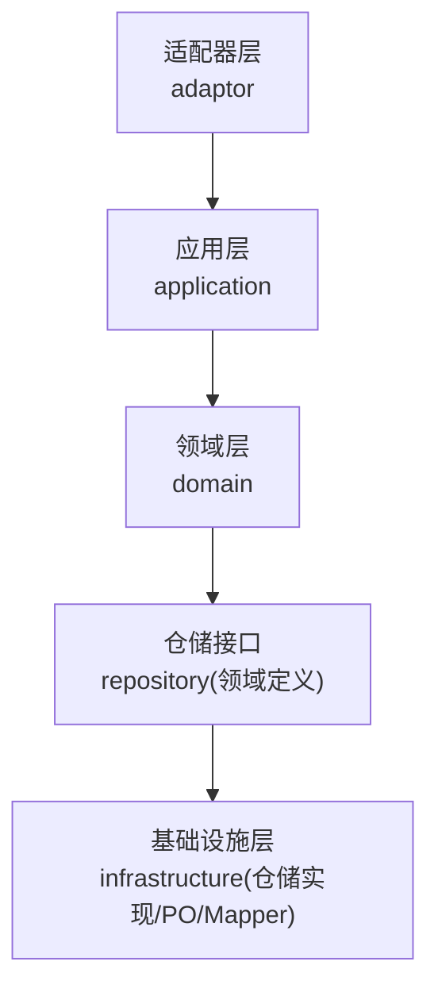
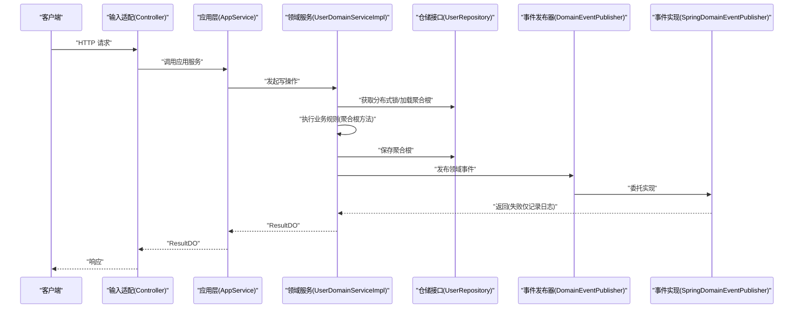
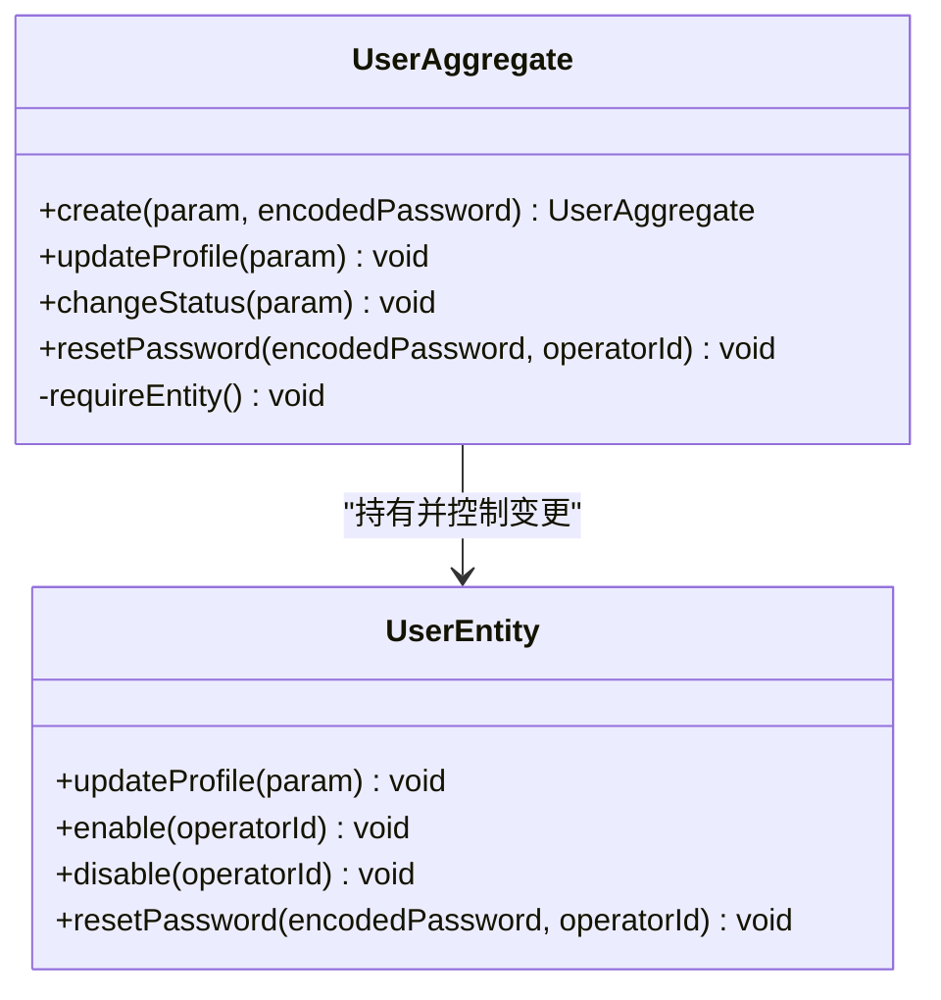
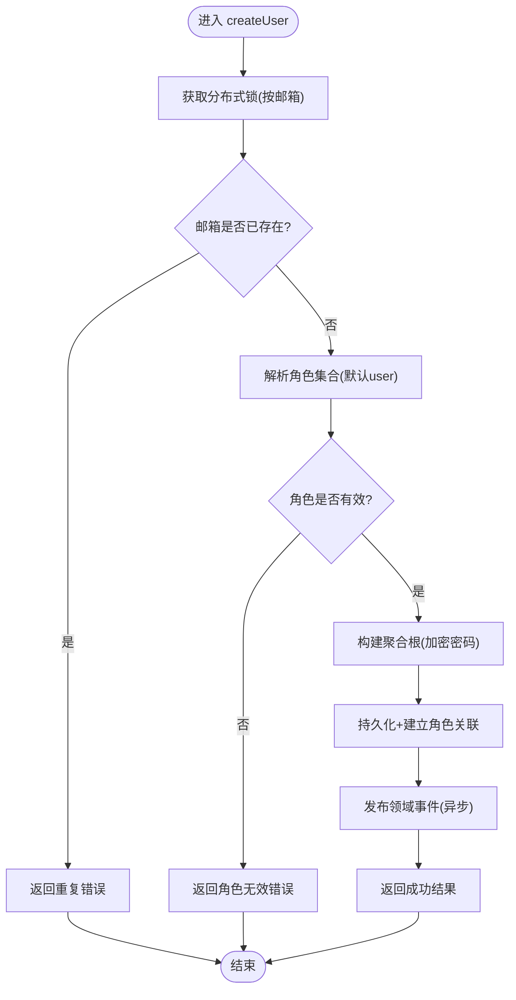
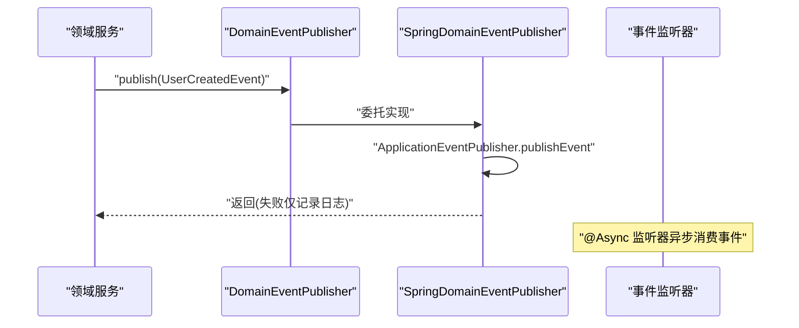
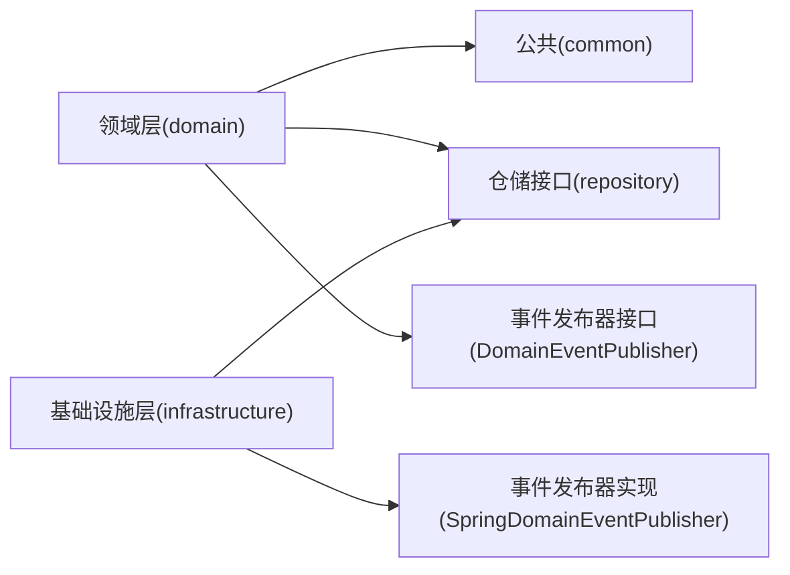

# DDD编码约定

<cite>
**本文引用的文件**   
- [README.md](file://README.md)
- [ddd-adaptor-layer.md](file://docs/rule/ddd/ddd-adaptor-layer.md)
- [UserAggregate.java](file://src/main/java/com/sunnao/spring/ddd/template/domain/system/user/model/aggregate/UserAggregate.java)
- [UserEntity.java](file://src/main/java/com/sunnao/spring/ddd/template/domain/system/user/model/entity/UserEntity.java)
- [UserDomainServiceImpl.java](file://src/main/java/com/sunnao/spring/ddd/template/domain/system/user/service/UserDomainServiceImpl.java)
- [UserCreatedEvent.java](file://src/main/java/com/sunnao/spring/ddd/template/domain/system/user/event/UserCreatedEvent.java)
- [DomainEventPublisher.java](file://src/main/java/com/sunnao/spring/ddd/template/common/event/DomainEventPublisher.java)
- [SpringDomainEventPublisher.java](file://src/main/java/com/sunnao/spring/ddd/template/infrastructure/common/SpringDomainEventPublisher.java)
</cite>

## 目录
1. [引言](#引言)
2. [项目结构](#项目结构)
3. [核心组件](#核心组件)
4. [架构总览](#架构总览)
5. [详细组件分析](#详细组件分析)
6. [依赖分析](#依赖分析)
7. [性能考虑](#性能考虑)
8. [故障排查指南](#故障排查指南)
9. [结论](#结论)
10. [附录](#附录)

## 引言
本编码约定面向基于六边形架构的 Spring Boot DDD 工程，聚焦领域层与周边层的落地规范。围绕聚合根、实体与值对象、领域服务、领域事件与参数对象等关键概念，给出边界划分原则、状态变更管理、发布机制与最佳实践，并结合用户域（User）示例进行说明。目标是帮助团队在“写模式”场景下实现高内聚、低耦合、可测试且易维护的领域模型。

## 项目结构
本项目遵循自外向内的调用顺序：adaptor → application → domain → repository（infrastructure 实现），并强调应用层编排、领域层承载业务规则、基础设施层负责技术细节。

**章节来源**
- [README.md:19-36](file://README.md#L19-L36)

## 核心组件
- 聚合根：UserAggregate，封装创建、更新资料、状态变更、重置密码等业务方法，对外暴露行为而非属性。
- 实体：UserEntity，承载用户属性与状态流转逻辑，由聚合根持有并通过其方法访问。
- 领域服务：UserDomainServiceImpl，统一编排“锁→加载/构建聚合根→执行业务→持久化→事件发布”，异常收敛为 ResultDO。
- 领域事件：UserCreatedEvent，表示用户创建完成；通过 DomainEventPublisher 发布，基础设施层以 Spring 事件异步消费。
- 事件发布器：DomainEventPublisher（common 接口）与 SpringDomainEventPublisher（infrastructure 实现）。

**章节来源**
- [UserAggregate.java:1-113](file://src/main/java/com/sunnao/spring/ddd/template/domain/system/user/model/aggregate/UserAggregate.java#L1-L113)
- [UserEntity.java:1-119](file://src/main/java/com/sunnao/spring/ddd/template/domain/system/user/model/entity/UserEntity.java#L1-L119)
- [UserDomainServiceImpl.java:1-204](file://src/main/java/com/sunnao/spring/ddd/template/domain/system/user/service/UserDomainServiceImpl.java#L1-L204)
- [UserCreatedEvent.java:1-39](file://src/main/java/com/sunnao/spring/ddd/template/domain/system/user/event/UserCreatedEvent.java#L1-L39)
- [DomainEventPublisher.java:1-20](file://src/main/java/com/sunnao/spring/ddd/template/common/event/DomainEventPublisher.java#L1-L20)
- [SpringDomainEventPublisher.java:1-35](file://src/main/java/com/sunnao/spring/ddd/template/infrastructure/common/SpringDomainEventPublisher.java#L1-L35)

## 架构总览
下图展示“写模式”下的典型调用链与职责边界：输入适配接收请求，应用层编排，领域服务协调锁、聚合根与仓储，最终发布领域事件。

**图表来源**
- [UserDomainServiceImpl.java:46-89](file://src/main/java/com/sunnao/spring/ddd/template/domain/system/user/service/UserDomainServiceImpl.java#L46-L89)
- [DomainEventPublisher.java:11-19](file://src/main/java/com/sunnao/spring/ddd/template/common/event/DomainEventPublisher.java#L11-L19)
- [SpringDomainEventPublisher.java:23-33](file://src/main/java/com/sunnao/spring/ddd/template/infrastructure/common/SpringDomainEventPublisher.java#L23-L33)

## 详细组件分析

### 聚合根设计原则（UserAggregate）
- 边界划分
  - 聚合根只持有 UserEntity 实体，不直接暴露属性；外部通过 create/updateProfile/changeStatus/resetPassword 等方法访问和变更内部状态。
  - 所有状态变更均通过显式业务方法执行，避免贫血模型。
- 业务方法封装
  - create：校验入参、初始化默认状态、设置审计字段。
  - updateProfile：按入参选择性更新昵称/头像，并设置更新人。
  - changeStatus：根据目标状态调用实体的 enable/disable，确保状态流转合法。
  - resetPassword：校验新密码非空后更新。
- 状态变更管理
  - 使用 AggregateException 表达聚合根级业务错误，保证一致性。
  - 通过 requireEntity() 保证实体存在后再变更。

**图表来源**
- [UserAggregate.java:38-111](file://src/main/java/com/sunnao/spring/ddd/template/domain/system/user/model/aggregate/UserAggregate.java#L38-L111)
- [UserEntity.java:60-117](file://src/main/java/com/sunnao/spring/ddd/template/domain/system/user/model/entity/UserEntity.java#L60-L117)

**章节来源**
- [UserAggregate.java:1-113](file://src/main/java/com/sunnao/spring/ddd/template/domain/system/user/model/aggregate/UserAggregate.java#L1-L113)
- [UserEntity.java:1-119](file://src/main/java/com/sunnao/spring/ddd/template/domain/system/user/model/entity/UserEntity.java#L1-L119)

### 实体与值对象的区分原则
- 实体（UserEntity）
  - 具备身份标识（继承 BaseEntity），承载属性与状态变更逻辑。
  - 通过聚合根方法访问，禁止外部直接修改属性。
- 值对象（建议）
  - 无独立身份标识，不可变，相等性由属性决定。
  - 用于表达领域概念（如邮箱地址、昵称、头像URL等），可在实体中作为值对象组合。
- 设计要点
  - 实体关注“谁是谁”以及“如何变化”；值对象关注“是什么”与“不变性”。
  - 将简单字段的校验与格式化下沉到值对象，提升可读性与复用性。

[本节为通用指导，不直接分析具体文件]

### 领域服务的职责边界与使用场景（UserDomainServiceImpl）
- 职责边界
  - 编排“锁→加载/构建聚合根→执行业务→持久化→事件发布”，不编写具体业务规则。
  - 异常统一捕获并转换为 ResultDO，保证上层稳定。
- 使用场景
  - 写模式：创建用户、更新资料、变更状态、删除用户。
  - 跨聚合协作：解析角色集合（RoleAggregate），建立用户-角色关联。
- 并发与一致性
  - 使用 LevelLock 按业务键加锁（如邮箱或用户ID），防止重复创建与并发覆盖。
  - 同一事务内完成主数据与关联数据的持久化。

**图表来源**
- [UserDomainServiceImpl.java:46-89](file://src/main/java/com/sunnao/spring/ddd/template/domain/system/user/service/UserDomainServiceImpl.java#L46-L89)

**章节来源**
- [UserDomainServiceImpl.java:1-204](file://src/main/java/com/sunnao/spring/ddd/template/domain/system/user/service/UserDomainServiceImpl.java#L1-L204)

### 领域事件的设计与发布机制
- 事件定义
  - UserCreatedEvent 携带 userId、email、nickname 等最小必要信息，便于下游消费。
- 发布流程
  - 领域服务在持久化成功后调用 DomainEventPublisher.publish(event)。
  - 基础设施层 SpringDomainEventPublisher 基于 ApplicationEventPublisher 广播，监听器以 @Async 异步消费。
  - 发布失败仅记录日志，不影响主流程。
- 处理建议
  - 事件处理器应幂等、健壮，对失败进行重试或补偿。
  - 事件内容保持精简，避免引入循环依赖。

**图表来源**
- [UserDomainServiceImpl.java:75-78](file://src/main/java/com/sunnao/spring/ddd/template/domain/system/user/service/UserDomainServiceImpl.java#L75-L78)
- [DomainEventPublisher.java:11-19](file://src/main/java/com/sunnao/spring/ddd/template/common/event/DomainEventPublisher.java#L11-L19)
- [SpringDomainEventPublisher.java:23-33](file://src/main/java/com/sunnao/spring/ddd/template/infrastructure/common/SpringDomainEventPublisher.java#L23-L33)
- [UserCreatedEvent.java:1-39](file://src/main/java/com/sunnao/spring/ddd/template/domain/system/user/event/UserCreatedEvent.java#L1-L39)

**章节来源**
- [UserCreatedEvent.java:1-39](file://src/main/java/com/sunnao/spring/ddd/template/domain/system/user/event/UserCreatedEvent.java#L1-L39)
- [DomainEventPublisher.java:1-20](file://src/main/java/com/sunnao/spring/ddd/template/common/event/DomainEventPublisher.java#L1-L20)
- [SpringDomainEventPublisher.java:1-35](file://src/main/java/com/sunnao/spring/ddd/template/infrastructure/common/SpringDomainEventPublisher.java#L1-L35)

### 参数对象 Param 设计规范
- 设计原则
  - 每个写操作对应一个 Param（如 CreateUserParam、UpdateUserParam、ChangeUserStatusParam），集中承载该操作的输入与校验。
  - 字段验证与业务规则封装在 Param 或聚合根/实体方法中，避免在应用层散落校验。
- 命名与组织
  - 包路径：domain/{业务}/model/param/*Param。
  - 查询条件单独使用 Query 类（如 UserQuery）。
- 校验策略
  - 必填项、格式、范围等基础校验放在 Param 的 check() 或构造阶段。
  - 复杂业务规则下沉到聚合根/实体方法，抛出 AggregateException。

[本节为通用指导，不直接分析具体文件]

### 适配器层（adaptor）与防腐层要点
- 输入适配（Controller）
  - 仅做协议转换与参数绑定，调用应用层服务，不写业务逻辑。
- 输出适配
  - 基于应用层业务语义定义接口，屏蔽第三方差异；实现类内部进行协议转换。
- 调用链控制
  - 写模式：Input Adaptor → AppService → DomainService → Repository（直接操作自己的数据库）。
  - 读模式：Input Adaptor → QueryAppService → Repository 或 Output Adaptor。

**章节来源**
- [ddd-adaptor-layer.md:1-141](file://docs/rule/ddd/ddd-adaptor-layer.md#L1-L141)

## 依赖分析
- 领域层不依赖框架与技术细节，仅依赖 common 中的基础类型与异常。
- 领域服务依赖仓储接口与领域事件发布器接口，解耦基础设施实现。
- 基础设施层提供仓储实现与事件发布的具体实现，反向依赖领域接口。

**图表来源**
- [UserDomainServiceImpl.java:1-44](file://src/main/java/com/sunnao/spring/ddd/template/domain/system/user/service/UserDomainServiceImpl.java#L1-L44)
- [DomainEventPublisher.java:1-20](file://src/main/java/com/sunnao/spring/ddd/template/common/event/DomainEventPublisher.java#L1-L20)
- [SpringDomainEventPublisher.java:1-35](file://src/main/java/com/sunnao/spring/ddd/template/infrastructure/common/SpringDomainEventPublisher.java#L1-L35)

**章节来源**
- [UserDomainServiceImpl.java:1-44](file://src/main/java/com/sunnao/spring/ddd/template/domain/system/user/service/UserDomainServiceImpl.java#L1-L44)
- [DomainEventPublisher.java:1-20](file://src/main/java/com/sunnao/spring/ddd/template/common/event/DomainEventPublisher.java#L1-L20)
- [SpringDomainEventPublisher.java:1-35](file://src/main/java/com/sunnao/spring/ddd/template/infrastructure/common/SpringDomainEventPublisher.java#L1-L35)

## 性能考虑
- 分布式锁粒度
  - 按业务键（邮箱/用户ID）加锁，避免全局锁导致吞吐下降。
- 事件异步化
  - 领域事件采用异步监听器，降低主流程延迟。
- 读写分离
  - 读模式优先走 Repository 直接查询，必要时通过 Output Adaptor 获取外部数据，减少不必要的聚合根加载。
- 批量与分页
  - 列表查询使用分页对象（PageQuery），避免一次性加载大量数据。

[本节为通用指导，不直接分析具体文件]

## 故障排查指南
- 常见异常
  - AggregateException：聚合根级业务错误（参数非法、状态不合法、实体不存在）。
  - BizException：领域服务级业务错误（资源不存在、权限不足）。
  - 系统异常：被统一捕获并转为 ResultDO，避免向上抛异常。
- 定位步骤
  - 检查锁是否获取成功（LOCK_FAIL）。
  - 确认唯一性约束（如 EMAIL_DUPLICATE）。
  - 核对事件发布是否成功（失败仅记录日志，不影响主流程）。
- 日志与链路
  - 结合 traceId 与操作日志切面，快速定位问题上下文。

**章节来源**
- [UserDomainServiceImpl.java:80-88](file://src/main/java/com/sunnao/spring/ddd/template/domain/system/user/service/UserDomainServiceImpl.java#L80-L88)
- [SpringDomainEventPublisher.java:28-33](file://src/main/java/com/sunnao/spring/ddd/template/infrastructure/common/SpringDomainEventPublisher.java#L28-L33)

## 结论
本约定明确了聚合根边界、实体与值对象区分、领域服务职责、事件发布机制与参数对象设计，配合适配器层防腐与基础设施解耦，形成一套可落地的 DDD 编码规范。建议在新增模块时严格遵循“写模式标准流程”，并以单测保障聚合根业务规则的正确性。

## 附录
- 参考文档
  - 适配器层规范：参见 ddd-adaptor-layer.md。
  - 整体架构与分层：参见 README.md 的架构说明与快速开始。

**章节来源**
- [ddd-adaptor-layer.md:1-141](file://docs/rule/ddd/ddd-adaptor-layer.md#L1-L141)
- [README.md:19-36](file://README.md#L19-L36)