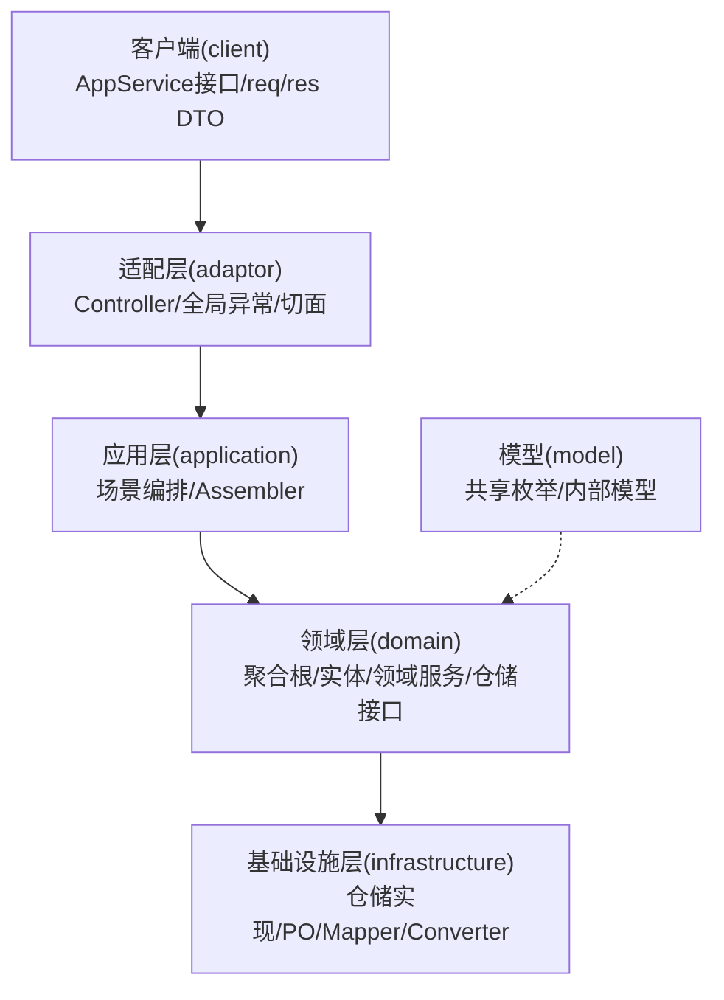
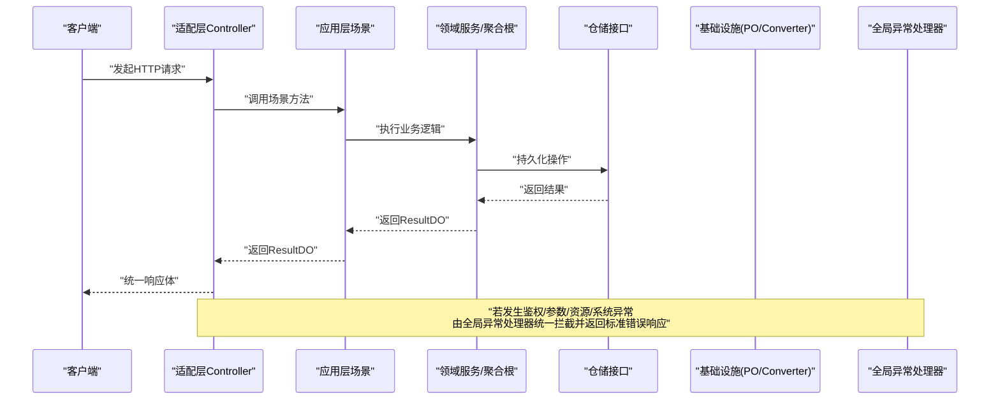
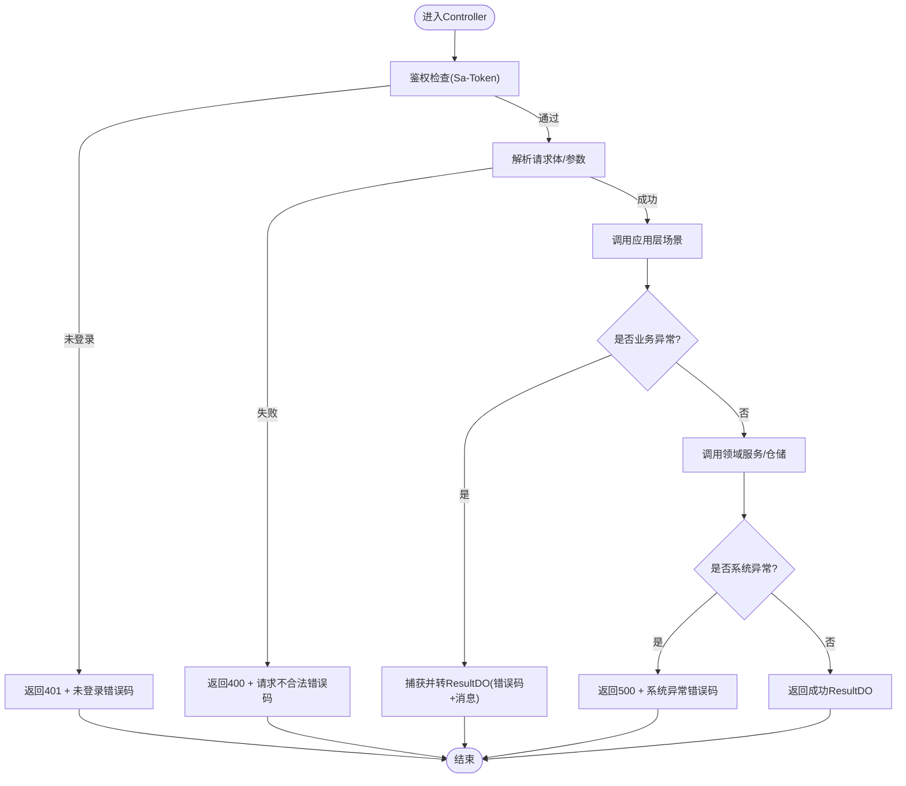
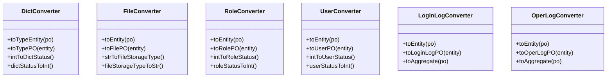
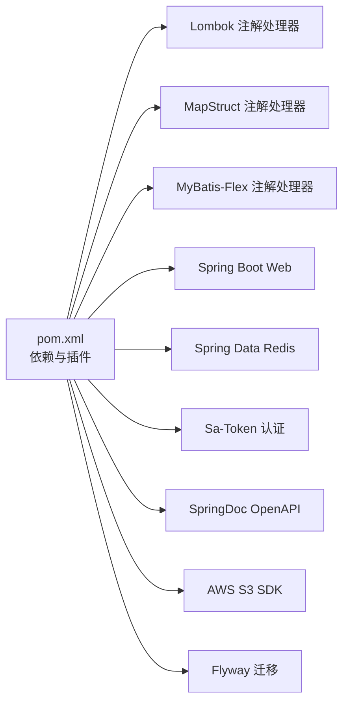

# Java编码规范

<cite>
**本文引用的文件列表**
- [README.md](file://README.md)
- [BizException.java](file://src/main/java/com/sunnao/spring/ddd/template/common/exception/BizException.java)
- [GlobalExceptionHandler.java](file://src/main/java/com/sunnao/spring/ddd/template/adaptor/common/GlobalExceptionHandler.java)
- [ErrorCodeEnum.java](file://src/main/java/com/sunnao/spring/ddd/template/common/result/ErrorCodeEnum.java)
- [BasePO.java](file://src/main/java/com/sunnao/spring/ddd/template/common/model/BasePO.java)
- [OperLogAspect.java](file://src/main/java/com/sunnao/spring/ddd/template/adaptor/common/OperLogAspect.java)
- [pom.xml](file://pom.xml)
- [DictConverter.java](file://src/main/java/com/sunnao/spring/ddd/template/infrastructure/system/dict/converter/DictConverter.java)
- [FileConverter.java](file://src/main/java/com/sunnao/spring/ddd/template/infrastructure/system/file/converter/FileConverter.java)
- [RoleConverter.java](file://src/main/java/com/sunnao/spring/ddd/template/infrastructure/system/role/converter/RoleConverter.java)
- [UserConverter.java](file://src/main/java/com/sunnao/spring/ddd/template/infrastructure/system/user/converter/UserConverter.java)
- [LoginLogConverter.java](file://src/main/java/com/sunnao/spring/ddd/template/infrastructure/system/log/converter/LoginLogConverter.java)
- [OperLogConverter.java](file://src/main/java/com/sunnao/spring/ddd/template/infrastructure/system/log/converter/OperLogConverter.java)
- [logback-spring.xml](file://src/main/resources/logback-spring.xml)
</cite>

## 目录
1. [引言](#引言)
2. [项目结构](#项目结构)
3. [核心组件](#核心组件)
4. [架构总览](#架构总览)
5. [详细组件分析](#详细组件分析)
6. [依赖分析](#依赖分析)
7. [性能考虑](#性能考虑)
8. [故障排查指南](#故障排查指南)
9. [结论](#结论)
10. [附录](#附录)

## 引言
本规范基于仓库现有实现与约定，统一团队在命名、格式、注释、异常处理、工具类使用、质量检查与IDE格式化等方面的实践。目标是在保证可读性与可维护性的同时，提升协作效率与交付质量。

## 项目结构
本项目采用六边形架构（适配层→应用层→领域层→基础设施层），并定义统一的请求响应与错误码体系。关键约定包括：
- 全链路返回统一结果对象，业务失败通过错误码表达；
- 入参DTO自校验；
- 手写Assembler/Converter负责数据转换；
- 写模式遵循“锁→聚合根→持久化”流程；
- 审计字段自动填充。

图示来源
- [README.md:19-36](file://README.md#L19-L36)

章节来源
- [README.md:19-46](file://README.md#L19-L46)

## 核心组件
本节聚焦与编码规范直接相关的核心组件：统一错误码、业务异常、全局异常处理器、审计基类、操作日志切面等。

- 统一错误码
  - 所有失败路径必须引用统一错误码枚举，禁止散落字符串字面量。
  - 每个错误码提供默认文案，可在调用处覆写更具体的提示。
- 业务异常
  - 业务异常携带错误码与消息，用于上层捕获后转换为统一结果或交由全局异常处理器处理。
- 全局异常处理器
  - 兜住鉴权、参数解析、资源不存在及未预期异常，统一转为标准响应体，不泄露堆栈。
- 审计基类
  - PO继承基类后，由框架监听器自动填充创建/更新时间与操作人ID。
- 操作日志切面
  - 对标注注解的Controller方法采集traceId、操作人、URI、参数摘要、结果码、耗时、IP，异步落库。

章节来源
- [ErrorCodeEnum.java:1-209](file://src/main/java/com/sunnao/spring/ddd/template/common/result/ErrorCodeEnum.java#L1-L209)
- [BizException.java:1-28](file://src/main/java/com/sunnao/spring/ddd/template/common/exception/BizException.java#L1-L28)
- [GlobalExceptionHandler.java:1-98](file://src/main/java/com/sunnao/spring/ddd/template/adaptor/common/GlobalExceptionHandler.java#L1-L98)
- [BasePO.java:1-41](file://src/main/java/com/sunnao/spring/ddd/template/common/model/BasePO.java#L1-L41)
- [OperLogAspect.java:21-130](file://src/main/java/com/sunnao/spring/ddd/template/adaptor/common/OperLogAspect.java#L21-L130)

## 架构总览
下图展示一次典型写操作的端到端流程，体现异常分类与统一响应格式。

图示来源
- [GlobalExceptionHandler.java:1-98](file://src/main/java/com/sunnao/spring/ddd/template/adaptor/common/GlobalExceptionHandler.java#L1-L98)
- [ErrorCodeEnum.java:1-209](file://src/main/java/com/sunnao/spring/ddd/template/common/result/ErrorCodeEnum.java#L1-L209)

## 详细组件分析

### 命名约定
- 包名
  - 小写字母、点分隔，按分层组织：adaptor/application/client/domain/infrastructure/model/common。
- 类名
  - 大驼峰，名词或动名词短语，如 AuthController、AuthAppServiceImpl、UserAggregate、UserConverter。
- 方法名
  - 小驼峰，动词开头，语义清晰，如 toEntity、toUserPO、handleNotLogin、summarizeParams。
- 变量名
  - 小驼峰，语义明确，避免单字母缩写（除循环索引）。
- 常量名
  - 全大写+下划线，如 PARAMS_MAX_LENGTH、EXCEPTION_CODE。
- 枚举值
  - 全大写+下划线，如 NOT_LOGIN、NO_PERMISSION、FILE_TOO_LARGE。
- 数据库表/列
  - 蛇形命名，如 sys_user、create_at、update_by。
- 配置键
  - 短横线分隔，如 app.lock.type、springdoc.swagger-ui.enabled。

示例参考
- 常量命名参考：[OperLogAspect.java:41-46](file://src/main/java/com/sunnao/spring/ddd/template/adaptor/common/OperLogAspect.java#L41-L46)
- 枚举命名参考：[ErrorCodeEnum.java:12-192](file://src/main/java/com/sunnao/spring/ddd/template/common/result/ErrorCodeEnum.java#L12-L192)

章节来源
- [OperLogAspect.java:41-46](file://src/main/java/com/sunnao/spring/ddd/template/adaptor/common/OperLogAspect.java#L41-L46)
- [ErrorCodeEnum.java:12-192](file://src/main/java/com/sunnao/spring/ddd/template/common/result/ErrorCodeEnum.java#L12-L192)

### 代码格式
- 缩进与空格
  - 使用4空格缩进；运算符两侧保留空格；逗号后加空格。
- 换行
  - 单行超过合理长度时优先在运算符或逗号后换行；保持方法签名与参数对齐。
- 大括号位置
  - 左大括号不换行，右大括号独占一行。
- 导入顺序
  - 先java.*，再javax.*，再第三方包，最后本项目包；分组间空一行。
- 注释风格
  - 类与方法使用Javadoc；复杂逻辑增加行内注释说明意图与边界条件。

说明
- 本仓库未提供Checkstyle/SonarQube配置文件，建议团队引入并启用IDE内置格式化规则保持一致。

### 注释标准
- 类注释
  - 说明类的职责、边界与关键设计决策。
- 方法注释
  - 描述入参与返回值含义、前置条件、后置条件、异常行为。
- 复杂逻辑注释
  - 解释算法思路、状态机流转、并发与锁策略、性能考量。

参考
- 转换器类注释与职责说明参考：[DictConverter.java:17-22](file://src/main/java/com/sunnao/spring/ddd/template/infrastructure/system/dict/converter/DictConverter.java#L17-L22)

章节来源
- [DictConverter.java:17-22](file://src/main/java/com/sunnao/spring/ddd/template/infrastructure/system/dict/converter/DictConverter.java#L17-L22)

### 异常处理模式
- 业务异常
  - 业务异常携带错误码与消息，适合在领域或服务层抛出，由上层捕获后转换为统一结果或交由全局异常处理器处理。
- 全局异常处理器
  - 分类处理：未登录、角色/权限不足、请求体不可读、参数类型不匹配、资源不存在、未预期系统异常；统一返回标准响应体，不泄露堆栈。
- 统一响应格式
  - 成功与失败均返回统一结果对象；失败包含错误码与消息。

图示来源
- [GlobalExceptionHandler.java:28-96](file://src/main/java/com/sunnao/spring/ddd/template/adaptor/common/GlobalExceptionHandler.java#L28-L96)
- [ErrorCodeEnum.java:12-192](file://src/main/java/com/sunnao/spring/ddd/template/common/result/ErrorCodeEnum.java#L12-L192)
- [BizException.java:6-27](file://src/main/java/com/sunnao/spring/ddd/template/common/exception/BizException.java#L6-L27)

章节来源
- [GlobalExceptionHandler.java:1-98](file://src/main/java/com/sunnao/spring/ddd/template/adaptor/common/GlobalExceptionHandler.java#L1-L98)
- [ErrorCodeEnum.java:1-209](file://src/main/java/com/sunnao/spring/ddd/template/common/result/ErrorCodeEnum.java#L1-L209)
- [BizException.java:1-28](file://src/main/java/com/sunnao/spring/ddd/template/common/exception/BizException.java#L1-L28)

### Lombok注解使用规范
- 适用场景
  - DTO/VO/PO/查询对象等纯数据载体推荐使用@Getter/@Setter/@ToString；构造器按需使用@NoArgsConstructor/@AllArgsConstructor/@Builder。
- 敏感信息
  - 对外响应对象需屏蔽敏感字段（如密码），必要时使用@ToString(exclude = {...})。
- 构建器
  - 复杂对象构建建议使用Builder，提高可读性；避免滥用导致API膨胀。
- 编译期处理
  - 已在Maven中配置Lombok注解处理器，确保编译期生效。

参考
- 依赖与处理器配置参考：[pom.xml:82-98](file://pom.xml#L82-L98)、[pom.xml:178-193](file://pom.xml#L178-L193)
- 审计基类使用Getter/Setter参考：[BasePO.java:17-19](file://src/main/java/com/sunnao/spring/ddd/template/common/model/BasePO.java#L17-L19)

章节来源
- [pom.xml:82-98](file://pom.xml#L82-L98)
- [pom.xml:178-193](file://pom.xml#L178-L193)
- [BasePO.java:17-19](file://src/main/java/com/sunnao/spring/ddd/template/common/model/BasePO.java#L17-L19)

### MapStruct转换器配置
- 组件模型
  - 使用Spring组件模型，便于注入与测试。
- 枚举映射
  - 使用@Mapping与@Named进行枚举双向转换（Integer↔枚举、String↔枚举）。
- 忽略字段
  - 对不需要映射的字段使用ignore=true，如审计字段、逻辑删除字段。
- 职责边界
  - Converter仅做技术层面的对象转换，不包含业务逻辑。

图示来源
- [DictConverter.java:17-30](file://src/main/java/com/sunnao/spring/ddd/template/infrastructure/system/dict/converter/DictConverter.java#L17-L30)
- [FileConverter.java:14-32](file://src/main/java/com/sunnao/spring/ddd/template/infrastructure/system/file/converter/FileConverter.java#L14-L32)
- [RoleConverter.java:16-34](file://src/main/java/com/sunnao/spring/ddd/template/infrastructure/system/role/converter/RoleConverter.java#L16-L34)
- [UserConverter.java:14-33](file://src/main/java/com/sunnao/spring/ddd/template/infrastructure/system/user/converter/UserConverter.java#L14-L33)
- [LoginLogConverter.java:16-42](file://src/main/java/com/sunnao/spring/ddd/template/infrastructure/system/log/converter/LoginLogConverter.java#L16-L42)
- [OperLogConverter.java:16-42](file://src/main/java/com/sunnao/spring/ddd/template/infrastructure/system/log/converter/OperLogConverter.java#L16-L42)

章节来源
- [DictConverter.java:17-30](file://src/main/java/com/sunnao/spring/ddd/template/infrastructure/system/dict/converter/DictConverter.java#L17-L30)
- [FileConverter.java:14-32](file://src/main/java/com/sunnao/spring/ddd/template/infrastructure/system/file/converter/FileConverter.java#L14-L32)
- [RoleConverter.java:16-34](file://src/main/java/com/sunnao/spring/ddd/template/infrastructure/system/role/converter/RoleConverter.java#L16-L34)
- [UserConverter.java:14-33](file://src/main/java/com/sunnao/spring/ddd/template/infrastructure/system/user/converter/UserConverter.java#L14-L33)
- [LoginLogConverter.java:16-42](file://src/main/java/com/sunnao/spring/ddd/template/infrastructure/system/log/converter/LoginLogConverter.java#L16-L42)
- [OperLogConverter.java:16-42](file://src/main/java/com/sunnao/spring/ddd/template/infrastructure/system/log/converter/OperLogConverter.java#L16-L42)

### Hutool工具类使用建议
- 依赖管理
  - 使用hutool-all聚合包，版本在POM中集中管理。
- 使用原则
  - 仅在必要场景使用，避免过度依赖；注意线程安全与性能影响。
- 常见用法
  - 日期时间、集合、字符串、加密解密、JSON序列化等通用能力。

参考
- 依赖声明参考：[pom.xml:94-98](file://pom.xml#L94-L98)

章节来源
- [pom.xml:94-98](file://pom.xml#L94-L98)

### 代码质量检查与IDE格式化
- 现状
  - 仓库未集成Checkstyle与SonarQube配置文件。
- 建议
  - 引入Checkstyle规则集，结合CI流水线执行；
  - 接入SonarQube进行静态扫描与质量门禁；
  - IDE启用统一格式化模板，提交前自动格式化。

说明
- 本节为通用建议，不涉及具体源码文件。

### 日志与追踪
- 日志输出
  - 统一pattern包含traceId，控制台彩色输出，文件滚动策略按天与大小切分，保留天数与总量上限。
- 链路追踪
  - TraceIdFilter生成并透传X-Trace-Id，异步线程经TaskDecorator透传。

参考
- 日志配置参考：[logback-spring.xml:1-42](file://src/main/resources/logback-spring.xml#L1-L42)

章节来源
- [logback-spring.xml:1-42](file://src/main/resources/logback-spring.xml#L1-L42)

## 依赖分析
- 编译期注解处理器
  - Lombok、MapStruct、MyBatis-Flex均在maven-compiler-plugin中配置annotationProcessorPaths，确保编译期生效。
- 运行时依赖
  - Spring Boot Web、Redis、Sa-Token、SpringDoc OpenAPI、AWS S3 SDK、Flyway等。

图示来源
- [pom.xml:82-151](file://pom.xml#L82-L151)
- [pom.xml:167-212](file://pom.xml#L167-L212)

章节来源
- [pom.xml:82-151](file://pom.xml#L82-L151)
- [pom.xml:167-212](file://pom.xml#L167-L212)

## 性能考虑
- 日志滚动策略
  - 按天与大小双维度滚动，控制历史文件数量与总容量，避免磁盘爆满。
- 异步处理
  - 操作日志异步落库，降低主流程延迟；注意线程池拒绝策略与背压。
- 缓存与锁
  - 字典读取走Redis缓存；分布式锁使用Redis实现，Lua脚本原子释放，减少竞争开销。

说明
- 本节为通用指导，不涉及具体源码文件。

## 故障排查指南
- 鉴权问题
  - 未登录/无角色/无权限将触发对应异常处理器，返回401/403与相应错误码。
- 参数问题
  - JSON解析失败或类型不匹配将返回400与“请求不合法”错误码。
- 资源问题
  - 路由不存在返回404与“请求资源不存在”错误码。
- 系统异常
  - 未预期异常返回500与“系统异常”错误码，并记录完整堆栈日志。
- 日志定位
  - 通过traceId在日志中快速定位请求链路。

章节来源
- [GlobalExceptionHandler.java:28-96](file://src/main/java/com/sunnao/spring/ddd/template/adaptor/common/GlobalExceptionHandler.java#L28-L96)
- [logback-spring.xml:8-13](file://src/main/resources/logback-spring.xml#L8-L13)

## 结论
本规范以仓库既有实现为依据，明确了命名、格式、注释、异常处理、工具类使用与质量检查的实践要点。建议在团队内推广并纳入CI门禁，持续保障代码质量与一致性。

## 附录

### 正确与错误的编码方式示例（路径指引）
- 统一错误码使用
  - 正确：在业务异常或失败分支中使用ErrorCodeEnum中的错误码。
  - 错误：直接使用字符串字面量作为错误码。
  - 参考：[ErrorCodeEnum.java:12-192](file://src/main/java/com/sunnao/spring/ddd/template/common/result/ErrorCodeEnum.java#L12-L192)
- 业务异常封装
  - 正确：构造BizException时传入错误码与消息。
  - 错误：抛出RuntimeException而不携带错误码。
  - 参考：[BizException.java:6-27](file://src/main/java/com/sunnao/spring/ddd/template/common/exception/BizException.java#L6-L27)
- 全局异常兜底
  - 正确：在GlobalExceptionHandler中分类处理并返回统一响应。
  - 错误：在Controller中直接打印堆栈并返回原始异常信息。
  - 参考：[GlobalExceptionHandler.java:28-96](file://src/main/java/com/sunnao/spring/ddd/template/adaptor/common/GlobalExceptionHandler.java#L28-L96)
- MapStruct转换器
  - 正确：使用@Mapper(componentModel="spring")与@Mapping/@Named进行枚举映射。
  - 错误：在转换器中编写业务逻辑或忽略必要的枚举转换。
  - 参考：[DictConverter.java:17-30](file://src/main/java/com/sunnao/spring/ddd/template/infrastructure/system/dict/converter/DictConverter.java#L17-L30)
- 审计字段填充
  - 正确：PO继承BasePO，由监听器自动填充审计字段。
  - 错误：手动覆盖审计字段且未考虑并发与上下文。
  - 参考：[BasePO.java:17-40](file://src/main/java/com/sunnao/spring/ddd/template/common/model/BasePO.java#L17-L40)
- 操作日志采集
  - 正确：在Controller方法上标注注解，参数摘要屏蔽敏感字段。
  - 错误：在切面中直接访问敏感字段或未截断超长参数。
  - 参考：[OperLogAspect.java:101-128](file://src/main/java/com/sunnao/spring/ddd/template/adaptor/common/OperLogAspect.java#L101-L128)