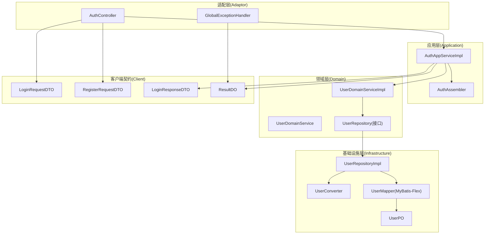
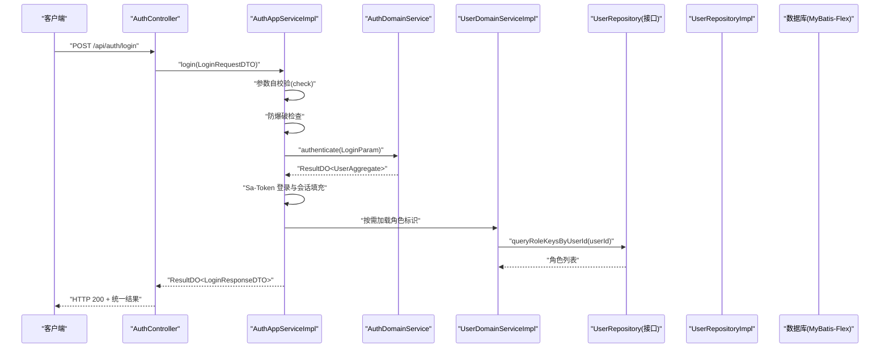
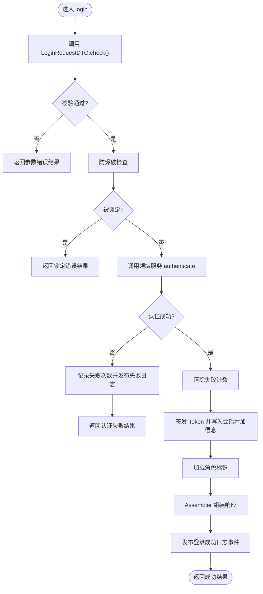
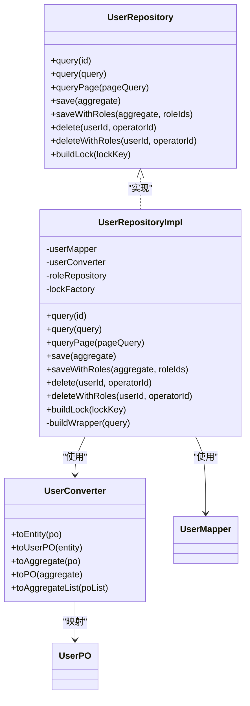
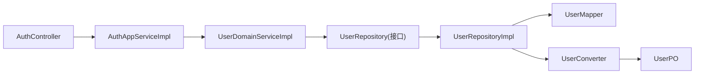
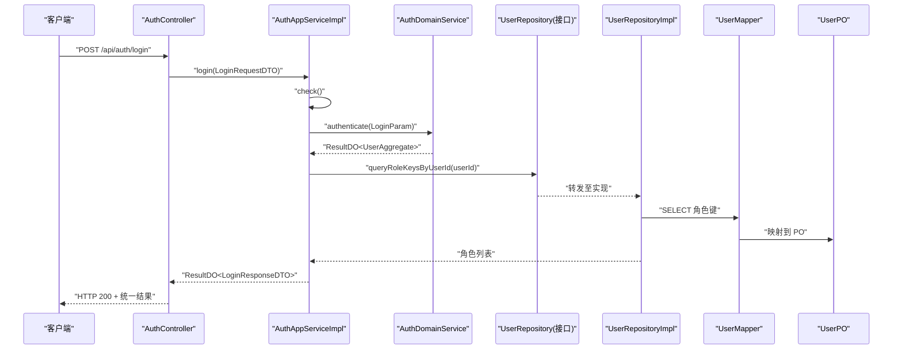

# 架构分层规范

<cite>
**本文引用的文件**   
- [AuthController.java](file://src/main/java/com/sunnao/spring/ddd/template/adaptor/auth/input/AuthController.java)
- [GlobalExceptionHandler.java](file://src/main/java/com/sunnao/spring/ddd/template/adaptor/common/GlobalExceptionHandler.java)
- [AuthAppServiceImpl.java](file://src/main/java/com/sunnao/spring/ddd/template/application/auth/scenario/AuthAppServiceImpl.java)
- [AuthAssembler.java](file://src/main/java/com/sunnao/spring/ddd/template/application/auth/assembler/AuthAssembler.java)
- [UserRepositoryImpl.java](file://src/main/java/com/sunnao/spring/ddd/template/infrastructure/system/user/repository/UserRepositoryImpl.java)
- [UserConverter.java](file://src/main/java/com/sunnao/spring/ddd/template/infrastructure/system/user/converter/UserConverter.java)
- [UserMapper.java](file://src/main/java/com/sunnao/spring/ddd/template/infrastructure/system/user/mysql/mapper/UserMapper.java)
- [UserPO.java](file://src/main/java/com/sunnao/spring/ddd/template/infrastructure/system/user/mysql/po/UserPO.java)
- [LoginRequestDTO.java](file://src/main/java/com/sunnao/spring/ddd/template/client/auth/req/LoginRequestDTO.java)
- [RegisterRequestDTO.java](file://src/main/java/com/sunnao/spring/ddd/template/client/auth/req/RegisterRequestDTO.java)
- [LoginResponseDTO.java](file://src/main/java/com/sunnao/spring/ddd/template/client/auth/res/LoginResponseDTO.java)
- [ResultDO.java](file://src/main/java/com/sunnao/spring/ddd/template/common/result/ResultDO.java)
- [BaseDto.java](file://src/main/java/com/sunnao/spring/ddd/template/common/model/BaseDto.java)
- [UserRepository.java](file://src/main/java/com/sunnao/spring/ddd/template/domain/system/user/repository/UserRepository.java)
- [UserDomainService.java](file://src/main/java/com/sunnao/spring/ddd/template/domain/system/user/service/UserDomainService.java)
- [UserDomainServiceImpl.java](file://src/main/java/com/sunnao/spring/ddd/template/domain/system/user/service/UserDomainServiceImpl.java)
</cite>

## 目录
1. [引言](#引言)
2. [项目结构](#项目结构)
3. [核心组件](#核心组件)
4. [架构总览](#架构总览)
5. [详细组件分析](#详细组件分析)
6. [依赖关系分析](#依赖关系分析)
7. [性能与事务考量](#性能与事务考量)
8. [故障排查指南](#故障排查指南)
9. [结论](#结论)
10. [附录：跨层数据流转示例与最佳实践](#附录跨层数据流转示例与最佳实践)

## 引言
本规范面向六边形架构（端口-适配器）的分层编码约定，聚焦以下目标：
- Adaptor 层 Controller 设计规范：参数校验、响应格式统一、异常处理。
- Application 层场景编排原则：业务流程编排、Assembler 转换器使用、事务边界与领域事件。
- Infrastructure 层仓储实现规范：数据访问逻辑、MyBatis-Flex 使用、PO 映射与转换。
- 强调各层之间的接口抽象与依赖倒置原则。
- 提供 RequestDTO 自校验机制的使用方法与最佳实践。
- 给出跨层数据流转的完整示例与常见问题解决方案。

## 项目结构
本项目采用典型的六边形分层组织：
- Adaptor（适配层）：HTTP 控制器、全局异常处理、操作日志切面等。
- Application（应用层）：场景编排、Assembler 转换器、领域事件发布、会话技术收敛。
- Domain（领域层）：聚合根、实体、值对象、领域服务与仓储接口。
- Infrastructure（基础设施层）：仓储实现、MyBatis-Flex Mapper、PO 对象、持久化细节。
- Client（对外契约层）：请求/响应 DTO、查询/命令 DTO，作为应用层对外暴露的契约。

图表来源
- [AuthController.java:1-70](file://src/main/java/com/sunnao/spring/ddd/template/adaptor/auth/input/AuthController.java#L1-L70)
- [GlobalExceptionHandler.java:1-98](file://src/main/java/com/sunnao/spring/ddd/template/adaptor/common/GlobalExceptionHandler.java#L1-L98)
- [AuthAppServiceImpl.java:1-196](file://src/main/java/com/sunnao/spring/ddd/template/application/auth/scenario/AuthAppServiceImpl.java#L1-L196)
- [AuthAssembler.java:1-99](file://src/main/java/com/sunnao/spring/ddd/template/application/auth/assembler/AuthAssembler.java#L1-L99)
- [UserDomainServiceImpl.java:1-204](file://src/main/java/com/sunnao/spring/ddd/template/domain/system/user/service/UserDomainServiceImpl.java#L1-L204)
- [UserRepository.java:1-65](file://src/main/java/com/sunnao/spring/ddd/template/domain/system/user/repository/UserRepository.java#L1-L65)
- [UserRepositoryImpl.java:1-191](file://src/main/java/com/sunnao/spring/ddd/template/infrastructure/system/user/repository/UserRepositoryImpl.java#L1-L191)
- [UserConverter.java:1-85](file://src/main/java/com/sunnao/spring/ddd/template/infrastructure/system/user/converter/UserConverter.java#L1-L85)
- [UserMapper.java:1-12](file://src/main/java/com/sunnao/spring/ddd/template/infrastructure/system/user/mysql/mapper/UserMapper.java#L1-L12)
- [UserPO.java:1-60](file://src/main/java/com/sunnao/spring/ddd/template/infrastructure/system/user/mysql/po/UserPO.java#L1-L60)
- [LoginRequestDTO.java:1-50](file://src/main/java/com/sunnao/spring/ddd/template/client/auth/req/LoginRequestDTO.java#L1-L50)
- [RegisterRequestDTO.java:1-67](file://src/main/java/com/sunnao/spring/ddd/template/client/auth/req/RegisterRequestDTO.java#L1-L67)
- [LoginResponseDTO.java:1-47](file://src/main/java/com/sunnao/spring/ddd/template/client/auth/res/LoginResponseDTO.java#L1-L47)
- [ResultDO.java:1-110](file://src/main/java/com/sunnao/spring/ddd/template/common/result/ResultDO.java#L1-L110)

章节来源
- [AuthController.java:1-70](file://src/main/java/com/sunnao/spring/ddd/template/adaptor/auth/input/AuthController.java#L1-L70)
- [AuthAppServiceImpl.java:1-196](file://src/main/java/com/sunnao/spring/ddd/template/application/auth/scenario/AuthAppServiceImpl.java#L1-L196)
- [UserRepositoryImpl.java:1-191](file://src/main/java/com/sunnao/spring/ddd/template/infrastructure/system/user/repository/UserRepositoryImpl.java#L1-L191)

## 核心组件
- 统一结果封装 ResultDO：所有层方法通过 ResultDO 返回成功/失败状态与错误码，禁止直接抛出异常给调用方。
- 参数自校验 BaseDto.check()：RequestDTO 覆写 check() 完成入参校验，避免在 AppService 中散落校验逻辑。
- 认证流程 AuthAppServiceImpl：负责登录/注册/登出场景编排，包含防爆破、领域认证、Token 签发与会话附加信息写入。
- 用户仓储 UserRepositoryImpl：基于 MyBatis-Flex 的数据访问实现，负责 PO 与聚合根的转换、分页、组合事务保存/删除。
- 转换器 AuthAssembler / UserConverter：MapStruct 转换器，负责 DTO/Param/Aggregate/PO 之间纯技术转换。

章节来源
- [ResultDO.java:1-110](file://src/main/java/com/sunnao/spring/ddd/template/common/result/ResultDO.java#L1-L110)
- [BaseDto.java:1-23](file://src/main/java/com/sunnao/spring/ddd/template/common/model/BaseDto.java#L1-L23)
- [AuthAppServiceImpl.java:1-196](file://src/main/java/com/sunnao/spring/ddd/template/application/auth/scenario/AuthAppServiceImpl.java#L1-L196)
- [UserRepositoryImpl.java:1-191](file://src/main/java/com/sunnao/spring/ddd/template/infrastructure/system/user/repository/UserRepositoryImpl.java#L1-L191)
- [AuthAssembler.java:1-99](file://src/main/java/com/sunnao/spring/ddd/template/application/auth/assembler/AuthAssembler.java#L1-L99)
- [UserConverter.java:1-85](file://src/main/java/com/sunnao/spring/ddd/template/infrastructure/system/user/converter/UserConverter.java#L1-L85)

## 架构总览
六边形架构在本项目中的体现：
- 外层（Adaptor）仅做协议适配与参数传递，不承载业务逻辑。
- 中间层（Application）编排用例，协调领域服务与外部技术（如 Sa-Token）。
- 内层（Domain）定义业务规则与一致性约束，依赖反转到仓储接口。
- 最外层（Infrastructure）实现持久化、缓存、消息等具体技术细节。

图表来源
- [AuthController.java:1-70](file://src/main/java/com/sunnao/spring/ddd/template/adaptor/auth/input/AuthController.java#L1-L70)
- [AuthAppServiceImpl.java:1-196](file://src/main/java/com/sunnao/spring/ddd/template/application/auth/scenario/AuthAppServiceImpl.java#L1-L196)
- [UserRepositoryImpl.java:1-191](file://src/main/java/com/sunnao/spring/ddd/template/infrastructure/system/user/repository/UserRepositoryImpl.java#L1-L191)
- [UserMapper.java:1-12](file://src/main/java/com/sunnao/spring/ddd/template/infrastructure/system/user/mysql/mapper/UserMapper.java#L1-L12)

## 详细组件分析

### Adaptor 层：AuthController 设计规范
- 职责边界
  - 仅接收 HTTP 请求、绑定参数、调用应用层服务并返回统一结果。
  - 禁止编写任何业务逻辑或持久化细节。
- 请求参数校验
  - 使用 RequestDTO 的 check() 自校验；Controller 不重复校验。
  - 若需新增字段校验，优先在对应 DTO 的 check() 中实现。
- 响应格式统一
  - 所有接口返回 ResultDO<T>，由 GlobalExceptionHandler 兜底统一包装。
- 异常处理
  - 正常流程不抛异常，异常由 GlobalExceptionHandler 捕获并转换为 ResultDO。
  - 鉴权相关异常（未登录、无权限）由全局处理器按 HTTP 状态码返回。
- 可观测性
  - 结合操作日志注解记录模块与动作，便于审计。

章节来源
- [AuthController.java:1-70](file://src/main/java/com/sunnao/spring/ddd/template/adaptor/auth/input/AuthController.java#L1-L70)
- [GlobalExceptionHandler.java:1-98](file://src/main/java/com/sunnao/spring/ddd/template/adaptor/common/GlobalExceptionHandler.java#L1-L98)
- [ResultDO.java:1-110](file://src/main/java/com/sunnao/spring/ddd/template/common/result/ResultDO.java#L1-L110)

### Application 层：场景编排原则（以 AuthAppServiceImpl 为例）
- 编排步骤
  - 参数自校验 → 防爆破检查 → 领域服务认证 → Token 签发与会话填充 → 组装响应。
- Assembler 转换器
  - 登录/注册请求转领域 Param；聚合根+Token 信息转 ResponseDTO。
  - 枚举转换通过 @Named 辅助方法，保持转换清晰可维护。
- 事务管理
  - 登录/注册/登出本身不涉及多表写，无需显式事务；涉及多仓储组合写时，应在仓储层声明事务。
- 领域事件
  - 登录日志通过领域事件异步落库，失败不影响主流程。
- 安全与健壮性
  - 防爆破：凭证失败计数达限则拒绝登录，成功后清零。
  - 会话附加信息写入失败不影响登录主流程。

图表来源
- [AuthAppServiceImpl.java:1-196](file://src/main/java/com/sunnao/spring/ddd/template/application/auth/scenario/AuthAppServiceImpl.java#L1-L196)
- [LoginRequestDTO.java:1-50](file://src/main/java/com/sunnao/spring/ddd/template/client/auth/req/LoginRequestDTO.java#L1-L50)
- [AuthAssembler.java:1-99](file://src/main/java/com/sunnao/spring/ddd/template/application/auth/assembler/AuthAssembler.java#L1-L99)

章节来源
- [AuthAppServiceImpl.java:1-196](file://src/main/java/com/sunnao/spring/ddd/template/application/auth/scenario/AuthAppServiceImpl.java#L1-L196)
- [AuthAssembler.java:1-99](file://src/main/java/com/sunnao/spring/ddd/template/application/auth/assembler/AuthAssembler.java#L1-L99)

### Infrastructure 层：仓储实现规范（以 UserRepositoryImpl 为例）
- 职责边界
  - 聚合根的持久化与查询；PO 与聚合根的纯技术转换；无业务逻辑。
- MyBatis-Flex 使用
  - 通过 UserMapper 进行单条/分页查询与插入更新；分页使用 QueryWrapper 构建条件。
- PO 映射
  - 使用 UserConverter 将 PO 与聚合根互转；枚举转换通过 MapStruct @Named 方法。
- 事务与组合操作
  - saveWithRoles/deleteWithRoles 在同一事务内完成用户与角色关联的保存/清理。
- 异常处理
  - 数据访问异常统一包装为 RepositoryException，向上层返回 ResultDO 的失败语义。

图表来源
- [UserRepository.java:1-65](file://src/main/java/com/sunnao/spring/ddd/template/domain/system/user/repository/UserRepository.java#L1-L65)
- [UserRepositoryImpl.java:1-191](file://src/main/java/com/sunnao/spring/ddd/template/infrastructure/system/user/repository/UserRepositoryImpl.java#L1-L191)
- [UserConverter.java:1-85](file://src/main/java/com/sunnao/spring/ddd/template/infrastructure/system/user/converter/UserConverter.java#L1-L85)
- [UserMapper.java:1-12](file://src/main/java/com/sunnao/spring/ddd/template/infrastructure/system/user/mysql/mapper/UserMapper.java#L1-L12)
- [UserPO.java:1-60](file://src/main/java/com/sunnao/spring/ddd/template/infrastructure/system/user/mysql/po/UserPO.java#L1-L60)

章节来源
- [UserRepositoryImpl.java:1-191](file://src/main/java/com/sunnao/spring/ddd/template/infrastructure/system/user/repository/UserRepositoryImpl.java#L1-L191)
- [UserConverter.java:1-85](file://src/main/java/com/sunnao/spring/ddd/template/infrastructure/system/user/converter/UserConverter.java#L1-L85)
- [UserMapper.java:1-12](file://src/main/java/com/sunnao/spring/ddd/template/infrastructure/system/user/mysql/mapper/UserMapper.java#L1-L12)
- [UserPO.java:1-60](file://src/main/java/com/sunnao/spring/ddd/template/infrastructure/system/user/mysql/po/UserPO.java#L1-L60)

### 领域层：UserDomainServiceImpl 与事务边界
- 标准流程
  - 获取分布式锁 → 加载聚合根 → 执行业务方法 → 持久化 → 释放锁。
- 事务边界
  - 创建用户时通过 userRepository.saveWithRoles 保证用户与角色关联在同一事务内。
- 异常处理
  - 业务异常与系统异常分别捕获，统一转为 ResultDO 返回。

章节来源
- [UserDomainServiceImpl.java:1-204](file://src/main/java/com/sunnao/spring/ddd/template/domain/system/user/service/UserDomainServiceImpl.java#L1-L204)
- [UserDomainService.java:1-50](file://src/main/java/com/sunnao/spring/ddd/template/domain/system/user/service/UserDomainService.java#L1-L50)

## 依赖关系分析
- 依赖倒置
  - Application 层依赖领域接口（UserRepository），而非基础设施实现。
  - Infrastructure 层实现领域接口，注入 Mapper/Converter 等技术组件。
- 耦合与内聚
  - Controller 仅依赖应用层接口；应用层仅依赖领域接口与转换器；仓储实现内聚于基础设施层。
- 外部依赖
  - Sa-Token 用于会话管理，收敛在应用层；MyBatis-Flex 用于数据访问；MapStruct 用于对象转换。

图表来源
- [AuthController.java:1-70](file://src/main/java/com/sunnao/spring/ddd/template/adaptor/auth/input/AuthController.java#L1-L70)
- [AuthAppServiceImpl.java:1-196](file://src/main/java/com/sunnao/spring/ddd/template/application/auth/scenario/AuthAppServiceImpl.java#L1-L196)
- [UserDomainServiceImpl.java:1-204](file://src/main/java/com/sunnao/spring/ddd/template/domain/system/user/service/UserDomainServiceImpl.java#L1-L204)
- [UserRepository.java:1-65](file://src/main/java/com/sunnao/spring/ddd/template/domain/system/user/repository/UserRepository.java#L1-L65)
- [UserRepositoryImpl.java:1-191](file://src/main/java/com/sunnao/spring/ddd/template/infrastructure/system/user/repository/UserRepositoryImpl.java#L1-L191)
- [UserConverter.java:1-85](file://src/main/java/com/sunnao/spring/ddd/template/infrastructure/system/user/converter/UserConverter.java#L1-L85)
- [UserMapper.java:1-12](file://src/main/java/com/sunnao/spring/ddd/template/infrastructure/system/user/mysql/mapper/UserMapper.java#L1-L12)
- [UserPO.java:1-60](file://src/main/java/com/sunnao/spring/ddd/template/infrastructure/system/user/mysql/po/UserPO.java#L1-L60)

章节来源
- [UserRepository.java:1-65](file://src/main/java/com/sunnao/spring/ddd/template/domain/system/user/repository/UserRepository.java#L1-L65)
- [UserRepositoryImpl.java:1-191](file://src/main/java/com/sunnao/spring/ddd/template/infrastructure/system/user/repository/UserRepositoryImpl.java#L1-L191)

## 性能与事务考量
- 防爆破与限流
  - 登录失败计数与窗口限制降低暴力破解风险；成功即清零，避免误伤。
- 分布式锁
  - 用户创建/修改/删除前加锁，防止并发冲突；锁粒度按资源键（邮箱/用户ID）控制。
- 事务边界
  - 组合写（用户+角色）在仓储层使用事务注解，确保原子性。
- 异步事件
  - 登录日志通过领域事件异步落库，减少主流程延迟。

[本节为通用指导，不直接分析具体文件]

## 故障排查指南
- 常见异常与处理
  - 未登录/无权限：由全局异常处理器返回 401/403 与统一错误码。
  - 请求体解析失败/类型不匹配：返回 400 与统一错误码。
  - 资源不存在：返回 404 与统一错误码。
  - 未预期异常：返回 500 与系统错误码，避免泄露堆栈。
- 定位建议
  - 查看全局异常处理器的日志输出。
  - 关注应用层对领域事件的发布是否成功（失败不影响主流程）。
  - 检查仓储层的异常包装与错误码映射。

章节来源
- [GlobalExceptionHandler.java:1-98](file://src/main/java/com/sunnao/spring/ddd/template/adaptor/common/GlobalExceptionHandler.java#L1-L98)
- [ResultDO.java:1-110](file://src/main/java/com/sunnao/spring/ddd/template/common/result/ResultDO.java#L1-L110)

## 结论
- 通过严格的分层职责划分与接口抽象，实现了清晰的依赖倒置。
- 参数自校验、统一结果封装与全局异常处理提升了系统的健壮性与可维护性。
- 仓储层基于 MyBatis-Flex 的纯技术转换与事务保障，确保了数据一致性与扩展性。
- 应用层编排集中了安全与可观测性关注点，使领域层更纯粹。

[本节为总结，不直接分析具体文件]

## 附录：跨层数据流转示例与最佳实践

### 登录流程端到端示例
- 入口：AuthController.login 接收 LoginRequestDTO。
- 校验：LoginRequestDTO.check() 执行邮箱与密码校验。
- 编排：AuthAppServiceImpl 执行防爆破、领域认证、Token 签发与会话填充。
- 响应：通过 AuthAssembler 组装 LoginResponseDTO，并以 ResultDO 返回。

图表来源
- [AuthController.java:1-70](file://src/main/java/com/sunnao/spring/ddd/template/adaptor/auth/input/AuthController.java#L1-L70)
- [AuthAppServiceImpl.java:1-196](file://src/main/java/com/sunnao/spring/ddd/template/application/auth/scenario/AuthAppServiceImpl.java#L1-L196)
- [UserRepositoryImpl.java:1-191](file://src/main/java/com/sunnao/spring/ddd/template/infrastructure/system/user/repository/UserRepositoryImpl.java#L1-L191)
- [UserMapper.java:1-12](file://src/main/java/com/sunnao/spring/ddd/template/infrastructure/system/user/mysql/mapper/UserMapper.java#L1-L12)
- [UserPO.java:1-60](file://src/main/java/com/sunnao/spring/ddd/template/infrastructure/system/user/mysql/po/UserPO.java#L1-L60)
- [LoginRequestDTO.java:1-50](file://src/main/java/com/sunnao/spring/ddd/template/client/auth/req/LoginRequestDTO.java#L1-L50)
- [LoginResponseDTO.java:1-47](file://src/main/java/com/sunnao/spring/ddd/template/client/auth/res/LoginResponseDTO.java#L1-L47)

### RequestDTO 自校验最佳实践
- 在 DTO 中覆写 check()，返回 ResultDO<Void>。
- 校验失败立即返回失败结果，避免进入应用层。
- 复杂校验（如两次密码一致性）在 DTO 内部完成，不传入领域层。

章节来源
- [BaseDto.java:1-23](file://src/main/java/com/sunnao/spring/ddd/template/common/model/BaseDto.java#L1-L23)
- [LoginRequestDTO.java:1-50](file://src/main/java/com/sunnao/spring/ddd/template/client/auth/req/LoginRequestDTO.java#L1-L50)
- [RegisterRequestDTO.java:1-67](file://src/main/java/com/sunnao/spring/ddd/template/client/auth/req/RegisterRequestDTO.java#L1-L67)

### 常见问题与解决方案
- 问题：Controller 中出现业务判断
  - 解决：将逻辑下沉到 Application 层，Controller 只负责参数绑定与调用。
- 问题：异常直接抛出导致 500
  - 解决：在各层捕获异常并转换为 ResultDO；全局异常处理器兜底。
- 问题：事务不一致
  - 解决：组合写操作在仓储层使用事务注解，确保原子性。
- 问题：PO 与领域对象混淆
  - 解决：严格使用 Converter 进行转换，领域层不感知 PO。

章节来源
- [GlobalExceptionHandler.java:1-98](file://src/main/java/com/sunnao/spring/ddd/template/adaptor/common/GlobalExceptionHandler.java#L1-L98)
- [UserRepositoryImpl.java:1-191](file://src/main/java/com/sunnao/spring/ddd/template/infrastructure/system/user/repository/UserRepositoryImpl.java#L1-L191)
- [UserConverter.java:1-85](file://src/main/java/com/sunnao/spring/ddd/template/infrastructure/system/user/converter/UserConverter.java#L1-L85)