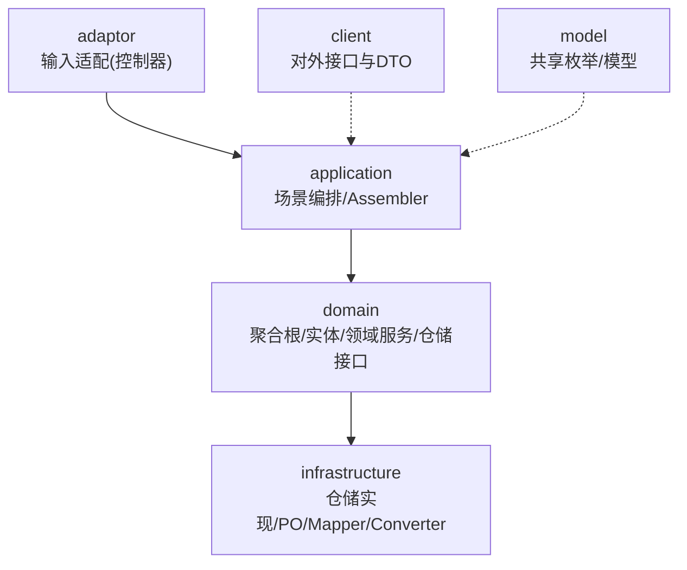
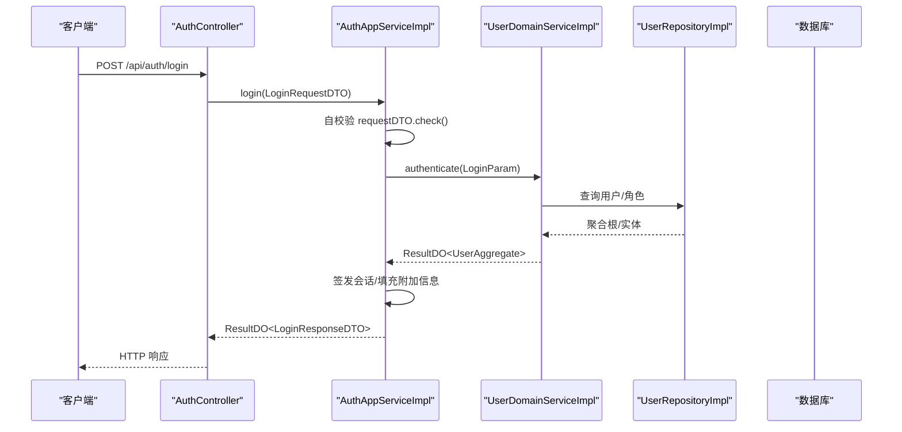
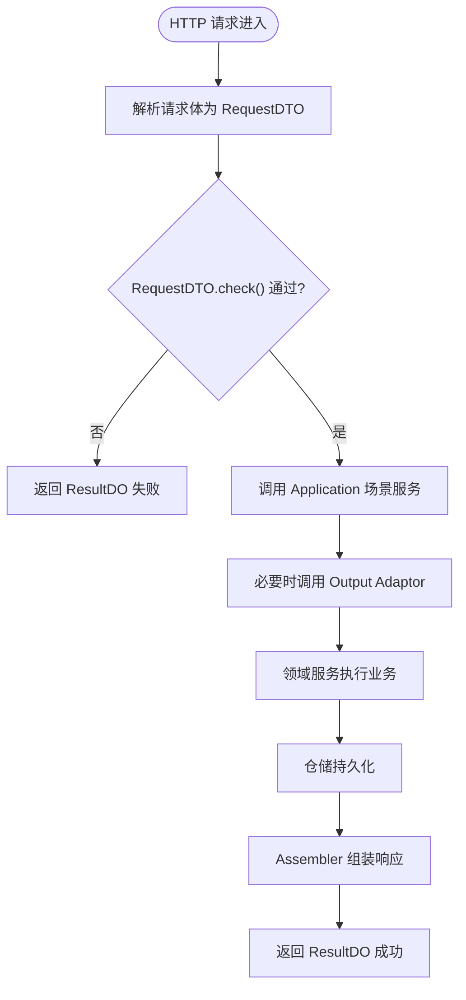
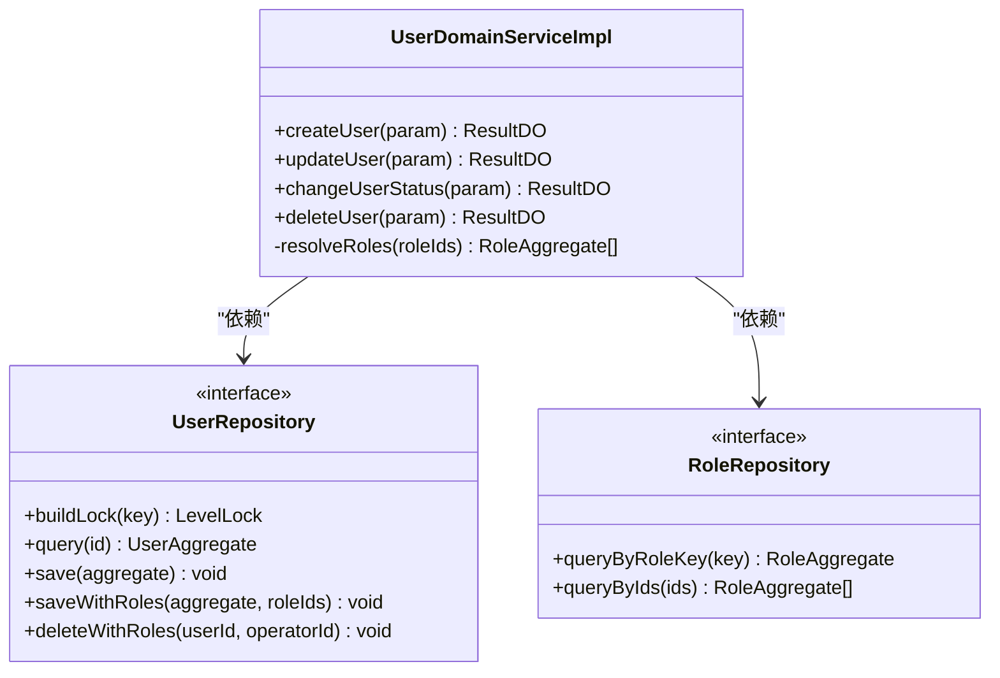
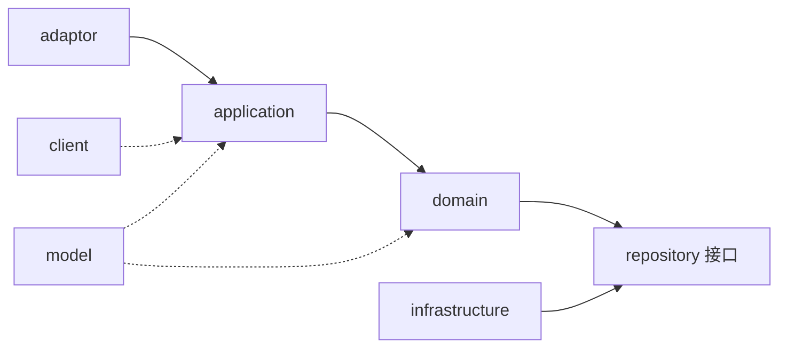

# 编码规范

<cite>
**本文引用的文件**   
- [README.md](file://README.md)
- [ddd-adaptor-layer.md](file://docs/rule/ddd/ddd-adaptor-layer.md)
- [ddd-model-layer.md](file://docs/rule/ddd/ddd-model-layer.md)
- [ResultDO.java](file://src/main/java/com/sunnao/spring/ddd/template/common/result/ResultDO.java)
- [ErrorCodeEnum.java](file://src/main/java/com/sunnao/spring/ddd/template/common/result/ErrorCodeEnum.java)
- [BaseDto.java](file://src/main/java/com/sunnao/spring/ddd/template/common/model/BaseDto.java)
- [AuthController.java](file://src/main/java/com/sunnao/spring/ddd/template/adaptor/auth/input/AuthController.java)
- [AuthAppServiceImpl.java](file://src/main/java/com/sunnao/spring/ddd/template/application/auth/scenario/AuthAppServiceImpl.java)
- [UserDomainServiceImpl.java](file://src/main/java/com/sunnao/spring/ddd/template/domain/system/user/service/UserDomainServiceImpl.java)
- [GlobalExceptionHandler.java](file://src/main/java/com/sunnao/spring/ddd/template/adaptor/common/GlobalExceptionHandler.java)
- [BasePO.java](file://src/main/java/com/sunnao/spring/ddd/template/common/model/BasePO.java)
- [UserAssembler.java](file://src/main/java/com/sunnao/spring/ddd/template/application/system/user/assembler/UserAssembler.java)
- [LoginRequestDTO.java](file://src/main/java/com/sunnao/spring/ddd/template/client/auth/req/LoginRequestDTO.java)
- [CreateRoleRequestDTO.java](file://src/main/java/com/sunnao/spring/ddd/template/client/system/role/req/CreateRoleRequestDTO.java)
- [UpdateUserRequestDTO.java](file://src/main/java/com/sunnao/spring/ddd/template/client/system/user/req/UpdateUserRequestDTO.java)
- [ChangeUserStatusRequestDTO.java](file://src/main/java/com/sunnao/spring/ddd/template/client/system/user/req/ChangeUserStatusRequestDTO.java)
- [application.yaml](file://src/main/resources/application.yaml)
- [logback-spring.xml](file://src/main/resources/logback-spring.xml)
</cite>

## 目录
1. [引言](#引言)
2. [项目结构](#项目结构)
3. [核心组件](#核心组件)
4. [架构总览](#架构总览)
5. [详细组件分析](#详细组件分析)
6. [依赖关系分析](#依赖关系分析)
7. [性能与可观测性](#性能与可观测性)
8. [故障排查指南](#故障排查指南)
9. [结论](#结论)
10. [附录：Git、CR 与质量工具建议](#附录gitcr-与质量工具建议)

## 引言
本规范面向基于六边形架构的 Spring Boot DDD 工程，统一 Java 编码约定、DDD 领域建模规则、各层（Adaptor/Application/Domain/Infrastructure）实现约束，以及“全链路不抛异常”的 ResultDO 模式、RequestDTO 自校验、Assembler/Converter 转换规范。同时给出 Git 提交信息规范、Code Review 检查清单与代码质量工具配置建议，确保团队一致性与可维护性。

## 项目结构
本项目采用六层分层：adaptor → application → domain → repository 接口（infrastructure 实现），并包含对外 client 定义与内部共享 model。关键约定包括：
- 统一返回 ResultDO，禁止向调用方抛出业务异常
- RequestDTO 覆写 check() 完成自校验
- Assembler 负责 DTO ↔ 领域对象转换；Converter 负责 PO ↔ 领域对象转换
- 写模式标准流程：锁 → 聚合根 → 持久化 → 释放锁
- 审计字段自动填充（BasePO + MyBatis-Flex 监听器）

图表来源
- [README.md:19-45](file://README.md#L19-L45)
- [ddd-adaptor-layer.md:17-35](file://docs/rule/ddd/ddd-adaptor-layer.md#L17-L35)

章节来源
- [README.md:19-45](file://README.md#L19-L45)

## 核心组件
- 统一结果与错误码
  - ResultDO：全链路统一返回体，提供成功/失败构建方法，禁止直接抛异常
  - ErrorCodeEnum：全局错误码收敛入口，所有失败路径引用该枚举
- 参数自校验基类
  - BaseDto：定义 check() 默认成功实现，RequestDTO 按需覆写
- 适配器与全局异常
  - GlobalExceptionHandler：兜住框架级异常与鉴权异常，统一转 ResultDO
- 审计基类
  - BasePO：createAt/updateAt/createBy/updateBy 由监听器自动填充

章节来源
- [ResultDO.java:1-109](file://src/main/java/com/sunnao/spring/ddd/template/common/result/ResultDO.java#L1-L109)
- [ErrorCodeEnum.java:1-64](file://src/main/java/com/sunnao/spring/ddd/template/common/result/ErrorCodeEnum.java#L1-L64)
- [BaseDto.java:1-23](file://src/main/java/com/sunnao/spring/ddd/template/common/model/BaseDto.java#L1-L23)
- [GlobalExceptionHandler.java:1-98](file://src/main/java/com/sunnao/spring/ddd/template/adaptor/common/GlobalExceptionHandler.java#L1-L98)
- [BasePO.java:1-41](file://src/main/java/com/sunnao/spring/ddd/template/common/model/BasePO.java#L1-L41)

## 架构总览
六边形架构下，请求从 Adaptor 进入，Application 编排场景，Domain 承载业务逻辑，Infrastructure 实现持久化与外部技术细节。

图表来源
- [AuthController.java:1-70](file://src/main/java/com/sunnao/spring/ddd/template/adaptor/auth/input/AuthController.java#L1-L70)
- [AuthAppServiceImpl.java:66-113](file://src/main/java/com/sunnao/spring/ddd/template/application/auth/scenario/AuthAppServiceImpl.java#L66-L113)
- [UserDomainServiceImpl.java:45-89](file://src/main/java/com/sunnao/spring/ddd/template/domain/system/user/service/UserDomainServiceImpl.java#L45-L89)

## 详细组件分析

### Java 编码规范
- 命名约定
  - 包名：小写点分隔，按层与业务域划分
  - 类名：大驼峰；接口以名词或能力命名；实现以 Impl 结尾
  - 方法名：动词开头，语义清晰
  - 常量：全大写加下划线
  - 字段：小驼峰
- 代码格式
  - 使用 Lombok 简化样板代码；MapStruct 生成转换器
  - 日志输出避免敏感信息（如密码）
- 注释标准
  - 类与方法需说明职责与边界；复杂逻辑补充行内注释
  - 对外接口在 Controller 使用 OpenAPI 注解描述
- 异常处理模式
  - 业务异常通过 ResultDO 返回，禁止向上抛
  - 仅框架级异常由 GlobalExceptionHandler 兜底

章节来源
- [AuthController.java:1-70](file://src/main/java/com/sunnao/spring/ddd/template/adaptor/auth/input/AuthController.java#L1-L70)
- [GlobalExceptionHandler.java:1-98](file://src/main/java/com/sunnao/spring/ddd/template/adaptor/common/GlobalExceptionHandler.java#L1-L98)

### DDD 编码约定
- 聚合根设计原则
  - 封装状态变更与一致性规则；对外暴露行为而非字段
  - 写操作遵循“锁 → 加载/构建 → 执行业务方法 → 持久化 → 释放锁”
- 实体与值对象区分
  - 实体：有唯一标识且关注生命周期与状态变化
  - 值对象：无独立标识，不可变，用于表达业务概念
- 领域服务职责边界
  - 编排跨聚合根的业务流程；不包含 UI/IO 细节
  - 通过 Repository 接口访问数据，不感知具体存储

章节来源
- [UserDomainServiceImpl.java:45-89](file://src/main/java/com/sunnao/spring/ddd/template/domain/system/user/service/UserDomainServiceImpl.java#L45-L89)
- [ddd-adaptor-layer.md:17-35](file://docs/rule/ddd/ddd-adaptor-layer.md#L17-L35)

### 六边形架构各层编码规范

#### Adaptor 层（Input/Output）
- Input Adaptor（Controller）
  - 仅做参数接收与简单转换，调用 Application 层服务
  - 写接口标注操作日志注解，读接口按需标注权限
- Output Adaptor
  - 接口定义基于应用层业务需要，而非第三方接口
  - 实现类封装协议差异与错误映射，返回 ResultDO

图表来源
- [AuthController.java:32-69](file://src/main/java/com/sunnao/spring/ddd/template/adaptor/auth/input/AuthController.java#L32-L69)
- [AuthAppServiceImpl.java:66-113](file://src/main/java/com/sunnao/spring/ddd/template/application/auth/scenario/AuthAppServiceImpl.java#L66-L113)
- [ddd-adaptor-layer.md:93-141](file://docs/rule/ddd/ddd-adaptor-layer.md#L93-L141)

章节来源
- [ddd-adaptor-layer.md:17-141](file://docs/rule/ddd/ddd-adaptor-layer.md#L17-L141)

#### Application 层（场景编排）
- 场景编排原则
  - 先自校验，再调用领域服务；必要时组合外部服务（Output Adaptor）
  - 使用 Assembler 进行 DTO ↔ 领域对象转换
- 事件与副作用
  - 登录/注册成功后发布领域事件，异步落库
  - 会话附加信息写入 Token-Session，不影响主流程

章节来源
- [AuthAppServiceImpl.java:66-113](file://src/main/java/com/sunnao/spring/ddd/template/application/auth/scenario/AuthAppServiceImpl.java#L66-L113)
- [UserAssembler.java:1-30](file://src/main/java/com/sunnao/spring/ddd/template/application/system/user/assembler/UserAssembler.java#L1-L30)

#### Domain 层（业务逻辑）
- 写模式标准流程
  - 获取分布式锁（Redis/JVM）→ 加载/构建聚合根 → 执行业务方法 → 持久化 → finally 释放锁
- 异常与结果
  - 捕获 BizException 与系统异常，转换为 ResultDO 返回
- 领域事件
  - 创建用户后发布 UserCreatedEvent，异步消费

图表来源
- [UserDomainServiceImpl.java:45-89](file://src/main/java/com/sunnao/spring/ddd/template/domain/system/user/service/UserDomainServiceImpl.java#L45-L89)
- [UserDomainServiceImpl.java:184-202](file://src/main/java/com/sunnao/spring/ddd/template/domain/system/user/service/UserDomainServiceImpl.java#L184-L202)

章节来源
- [UserDomainServiceImpl.java:45-89](file://src/main/java/com/sunnao/spring/ddd/template/domain/system/user/service/UserDomainServiceImpl.java#L45-L89)
- [UserDomainServiceImpl.java:184-202](file://src/main/java/com/sunnao/spring/ddd/template/domain/system/user/service/UserDomainServiceImpl.java#L184-L202)

#### Infrastructure 层（持久化与转换）
- Converter 负责 PO ↔ 领域对象转换
- Repository 实现类负责 SQL 与事务边界
- 审计字段自动填充：继承 BasePO，由监听器填充 createAt/updateAt/createBy/updateBy

章节来源
- [BasePO.java:1-41](file://src/main/java/com/sunnao/spring/ddd/template/common/model/BasePO.java#L1-L41)

#### Model 层（共享模型）
- 存放跨模块共享枚举与通用业务概念
- client 层禁止依赖 model，保持 DTO 自包含

章节来源
- [ddd-model-layer.md:1-97](file://docs/rule/ddd/ddd-model-layer.md#L1-L97)

### ResultDO 全链路不抛异常
- 各层方法统一返回 ResultDO，内部 catch 后转错误码
- 全局错误码集中管理，禁止散落字符串字面量
- 全局异常处理器兜住框架级异常，统一转 ResultDO

章节来源
- [ResultDO.java:1-109](file://src/main/java/com/sunnao/spring/ddd/template/common/result/ResultDO.java#L1-L109)
- [ErrorCodeEnum.java:1-64](file://src/main/java/com/sunnao/spring/ddd/template/common/result/ErrorCodeEnum.java#L1-L64)
- [GlobalExceptionHandler.java:1-98](file://src/main/java/com/sunnao/spring/ddd/template/adaptor/common/GlobalExceptionHandler.java#L1-L98)

### RequestDTO 自校验机制
- 所有 RequestDTO 继承 BaseDto，覆写 check() 完成校验
- 校验失败返回 ResultDO.buildFailResult(code, msg)，AppService 不再重复校验
- 示例：邮箱格式、必填项、枚举取值等

章节来源
- [BaseDto.java:1-23](file://src/main/java/com/sunnao/spring/ddd/template/common/model/BaseDto.java#L1-L23)
- [LoginRequestDTO.java:1-49](file://src/main/java/com/sunnao/spring/ddd/template/client/auth/req/LoginRequestDTO.java#L1-L49)
- [CreateRoleRequestDTO.java:1-54](file://src/main/java/com/sunnao/spring/ddd/template/client/system/role/req/CreateRoleRequestDTO.java#L1-L54)
- [UpdateUserRequestDTO.java:1-50](file://src/main/java/com/sunnao/spring/ddd/template/client/system/user/req/UpdateUserRequestDTO.java#L1-L50)
- [ChangeUserStatusRequestDTO.java:1-44](file://src/main/java/com/sunnao/spring/ddd/template/client/system/user/req/ChangeUserStatusRequestDTO.java#L1-L44)

### Assembler/Converter 转换规范
- Application 层 Assembler：负责 RequestDTO/ResponseDTO ↔ 领域对象（Param/Aggregate/Entity）
- Infrastructure 层 Converter：负责领域对象 ↔ PO
- 使用 MapStruct 生成转换实现，避免手写样板代码

章节来源
- [UserAssembler.java:1-30](file://src/main/java/com/sunnao/spring/ddd/template/application/system/user/assembler/UserAssembler.java#L1-L30)

## 依赖关系分析
- 层间依赖方向严格单向：adaptor → application → domain → repository 接口（infrastructure 实现）
- client 层仅定义对外接口与 DTO，不依赖 model 层
- model 层被 domain/application/adaptor/infrastructure 共享

图表来源
- [README.md:19-45](file://README.md#L19-L45)
- [ddd-model-layer.md:14-29](file://docs/rule/ddd/ddd-model-layer.md#L14-L29)

章节来源
- [README.md:19-45](file://README.md#L19-L45)
- [ddd-model-layer.md:14-29](file://docs/rule/ddd/ddd-model-layer.md#L14-L29)

## 性能与可观测性
- 异步任务线程池拒绝策略：CallerRunsPolicy 提供背压
- 生产环境关闭 Swagger，减少不必要开销
- 日志滚动策略：按天+大小切分，保留天数与总量上限控制

章节来源
- [application.yaml:64-87](file://src/main/resources/application.yaml#L64-L87)
- [logback-spring.xml:23-42](file://src/main/resources/logback-spring.xml#L23-L42)

## 故障排查指南
- 未登录/无权限：由 GlobalExceptionHandler 统一返回 NOT_LOGIN/NO_PERMISSION
- 请求体解析失败/类型不匹配：返回 BAD_REQUEST
- 资源不存在：返回 NOT_FOUND
- 未预期异常：返回 SYSTEM_ERROR，记录堆栈但不外泄

章节来源
- [GlobalExceptionHandler.java:1-98](file://src/main/java/com/sunnao/spring/ddd/template/adaptor/common/GlobalExceptionHandler.java#L1-L98)

## 结论
本规范以 ResultDO 全链路不抛异常为核心，结合 RequestDTO 自校验与 Assembler/Converter 转换，配合六边形架构分层与 DDD 实践，形成一致的编码风格与清晰的职责边界。通过统一的错误码、审计字段与日志策略，提升可维护性与可观测性。

## 附录：Git、CR 与质量工具建议
- Git 提交信息规范
  - 格式：<type>(<scope>): <subject>
  - type：feat/fix/docs/style/refactor/test/chore
  - scope：模块名（如 auth、user、dict）
  - subject：简洁明了，不超过 50 字符
  - 示例：feat(auth): 新增登录防爆破限制
- Code Review 检查清单
  - 是否遵循 ResultDO 全链路不抛异常
  - RequestDTO 是否覆写 check() 并完成必要校验
  - Assembler/Converter 是否集中在对应层
  - 写模式是否遵循“锁 → 聚合根 → 持久化 → 释放锁”
  - 错误码是否来自 ErrorCodeEnum，无硬编码
  - 日志是否避免打印敏感信息
  - 权限与操作日志注解是否正确标注
- 代码质量工具配置建议
  - Maven Compiler Plugin：启用 Lombok 与 MapStruct 注解处理器
  - Checkstyle/SpotBugs：纳入 CI 流水线，阻断低质量代码
  - SonarQube：统一质量门禁（复杂度、重复率、安全漏洞）
  - 单元测试覆盖率：设定最低阈值，持续集成中验证

章节来源
- [pom.xml:153-184](file://pom.xml#L153-L184)